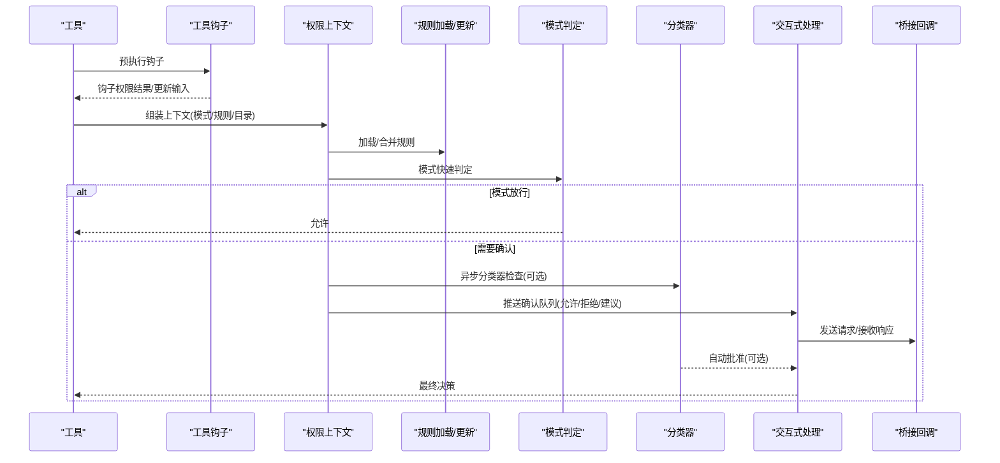
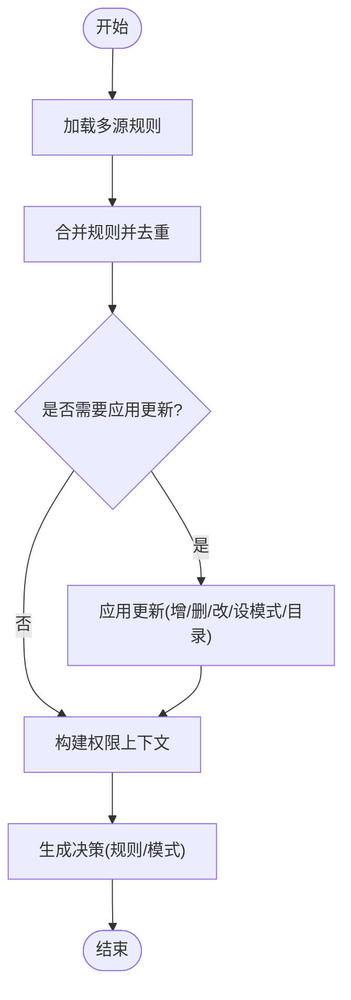
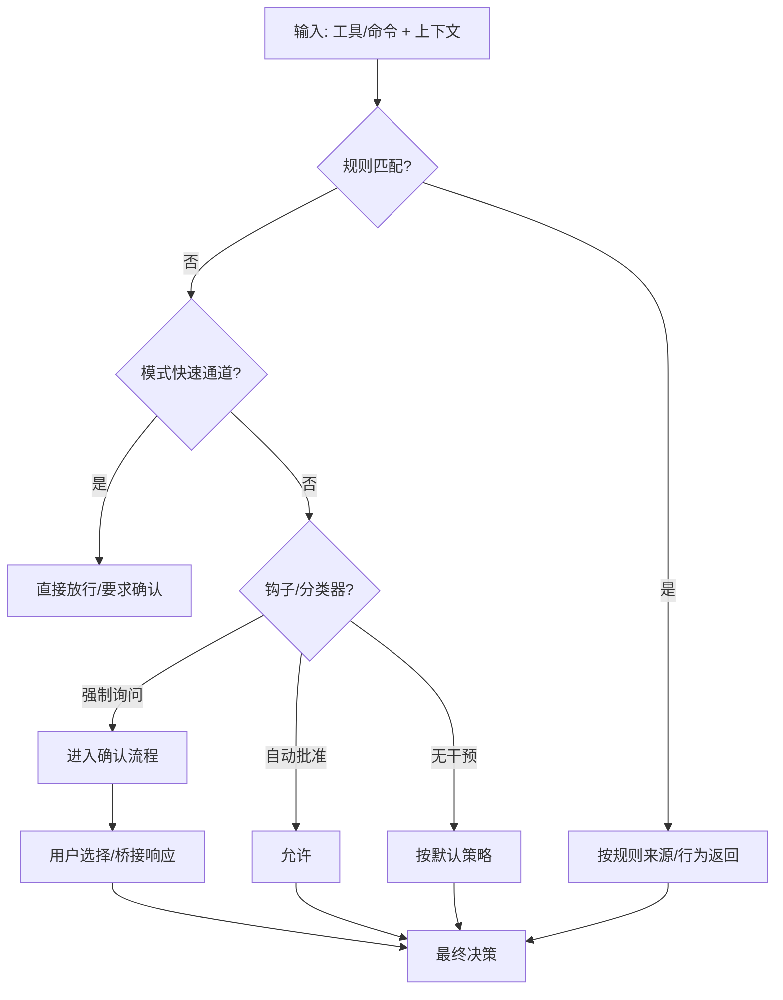
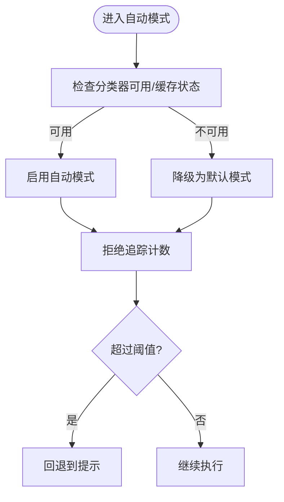
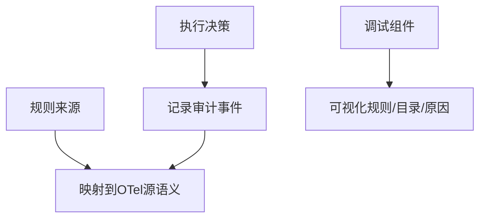
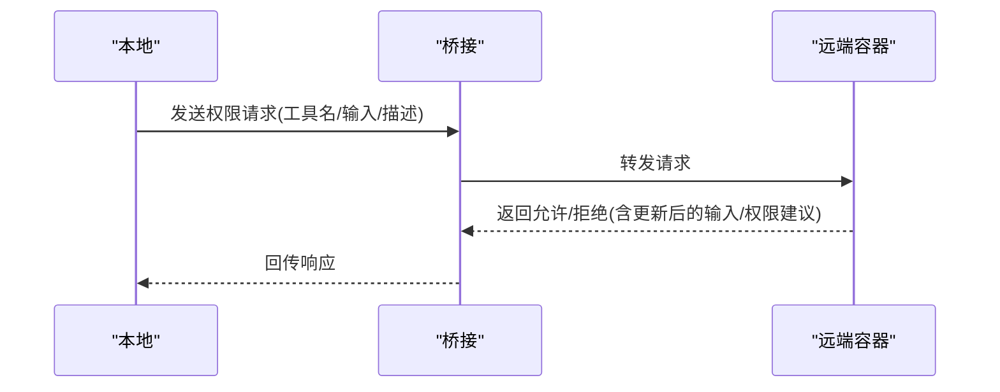
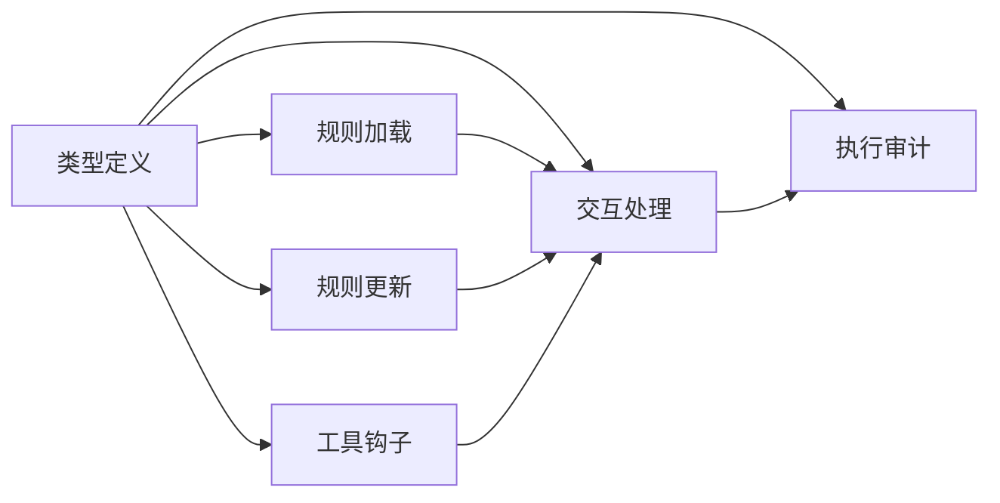

# 权限控制系统

<cite>
**本文引用的文件**
- [src/types/permissions.ts](file://src/types/permissions.ts)
- [src/remote/remotePermissionBridge.ts](file://src/remote/remotePermissionBridge.ts)
- [src/bridge/bridgePermissionCallbacks.ts](file://src/bridge/bridgePermissionCallbacks.ts)
- [src/utils/permissions/PermissionResult.ts](file://src/utils/permissions/PermissionResult.ts)
- [src/utils/permissions/PermissionUpdate.ts](file://src/utils/permissions/PermissionUpdate.ts)
- [src/utils/permissions/permissionsLoader.ts](file://src/utils/permissions/permissionsLoader.ts)
- [src/utils/permissions/permissionSetup.ts](file://src/utils/permissions/permissionSetup.ts)
- [src/utils/permissions/denialTracking.ts](file://src/utils/permissions/denialTracking.ts)
- [src/hooks/toolPermission/handlers/interactiveHandler.ts](file://src/hooks/toolPermission/handlers/interactiveHandler.ts)
- [src/hooks/useCanUseTool.tsx](file://src/hooks/useCanUseTool.tsx)
- [src/services/tools/toolHooks.ts](file://src/services/tools/toolHooks.ts)
- [src/services/tools/toolExecution.ts](file://src/services/tools/toolExecution.ts)
- [src/tools/BashTool/modeValidation.ts](file://src/tools/BashTool/modeValidation.ts)
- [src/components/permissions/PermissionDecisionDebugInfo.tsx](file://src/components/permissions/PermissionDecisionDebugInfo.tsx)
- [src/entrypoints/sdk/coreSchemas.ts](file://src/entrypoints/sdk/coreSchemas.ts)
</cite>

## 目录
1. [引言](#引言)
2. [项目结构](#项目结构)
3. [核心组件](#核心组件)
4. [架构总览](#架构总览)
5. [详细组件分析](#详细组件分析)
6. [依赖关系分析](#依赖关系分析)
7. [性能考量](#性能考量)
8. [故障排查指南](#故障排查指南)
9. [结论](#结论)
10. [附录](#附录)

## 引言
本文件系统性阐述 free-code 的权限控制系统：权限模型设计理念、权限分类与评估机制、权限规则定义与持久化、权限决策算法、权限缓存与回退策略、权限验证与审计、权限日志记录、扩展机制与自定义权限处理器、权限与工具/命令的关系映射，以及安全策略与绕过防护。

## 项目结构
权限控制相关代码主要分布在以下区域：
- 类型与模式：src/types/permissions.ts（权限模式、行为、规则、更新、决策结果、解释器等）
- 远端桥接：src/remote/remotePermissionBridge.ts（远端权限请求合成消息与工具桩）
- 桥接回调：src/bridge/bridgePermissionCallbacks.ts（跨桥通信的请求/响应类型与校验）
- 决策与结果：src/utils/permissions/PermissionResult.ts（结果导出与描述辅助）
- 规则更新与应用：src/utils/permissions/PermissionUpdate.ts（规则增删改与上下文更新）
- 规则加载与设置：src/utils/permissions/permissionsLoader.ts（从设置源加载规则、去重、写入）
- 系统初始化与模式管理：src/utils/permissions/permissionSetup.ts（默认模式、自动模式、禁用旁路模式、模式切换）
- 拒绝追踪与回退：src/utils/permissions/denialTracking.ts（连续拒绝计数与提示回退）
- 交互式处理：src/hooks/toolPermission/handlers/interactiveHandler.ts（交互式权限流程与异步检查）
- 工具使用入口：src/hooks/useCanUseTool.tsx（工具可用性检查与分类器检查）
- 钩子集成：src/services/tools/toolHooks.ts（预执行钩子与权限结果整合）
- 执行与审计：src/services/tools/toolExecution.ts（规则来源到 OpenTelemetry 源语义映射）
- Bash 模式校验：src/tools/BashTool/modeValidation.ts（基于模式的快速判定）
- 调试信息：src/components/permissions/PermissionDecisionDebugInfo.tsx（调试展示与目录提取）
- SDK 核心模式：src/entrypoints/sdk/coreSchemas.ts（权限规则值与更新的 Zod 校验）

```mermaid
graph TB
subgraph "类型与模式"
T1["src/types/permissions.ts"]
end
subgraph "规则加载/更新"
U1["src/utils/permissions/permissionsLoader.ts"]
U2["src/utils/permissions/PermissionUpdate.ts"]
end
subgraph "交互与钩子"
H1["src/hooks/toolPermission/handlers/interactiveHandler.ts"]
H2["src/hooks/useCanUseTool.tsx"]
H3["src/services/tools/toolHooks.ts"]
end
subgraph "执行与审计"
E1["src/services/tools/toolExecution.ts"]
end
subgraph "工具特定"
B1["src/tools/BashTool/modeValidation.ts"]
end
subgraph "远端与桥接"
R1["src/remote/remotePermissionBridge.ts"]
B2["src/bridge/bridgePermissionCallbacks.ts"]
end
subgraph "调试与SDK"
D1["src/components/permissions/PermissionDecisionDebugInfo.tsx"]
S1["src/entrypoints/sdk/coreSchemas.ts"]
end
T1 --> U1
T1 --> U2
T1 --> H1
T1 --> H2
T1 --> H3
T1 --> E1
T1 --> B1
T1 --> R1
T1 --> B2
T1 --> D1
T1 --> S1
```

图表来源
- [src/types/permissions.ts:1-442](file://src/types/permissions.ts#L1-L442)
- [src/utils/permissions/permissionsLoader.ts:85-296](file://src/utils/permissions/permissionsLoader.ts#L85-L296)
- [src/utils/permissions/PermissionUpdate.ts:45-83](file://src/utils/permissions/PermissionUpdate.ts#L45-L83)
- [src/hooks/toolPermission/handlers/interactiveHandler.ts:34-68](file://src/hooks/toolPermission/handlers/interactiveHandler.ts#L34-L68)
- [src/hooks/useCanUseTool.tsx:179-203](file://src/hooks/useCanUseTool.tsx#L179-L203)
- [src/services/tools/toolHooks.ts:413-464](file://src/services/tools/toolHooks.ts#L413-L464)
- [src/services/tools/toolExecution.ts:173-194](file://src/services/tools/toolExecution.ts#L173-L194)
- [src/tools/BashTool/modeValidation.ts:52-92](file://src/tools/BashTool/modeValidation.ts#L52-L92)
- [src/remote/remotePermissionBridge.ts:1-79](file://src/remote/remotePermissionBridge.ts#L1-L79)
- [src/bridge/bridgePermissionCallbacks.ts:1-44](file://src/bridge/bridgePermissionCallbacks.ts#L1-L44)
- [src/components/permissions/PermissionDecisionDebugInfo.tsx:145-202](file://src/components/permissions/PermissionDecisionDebugInfo.tsx#L145-L202)
- [src/entrypoints/sdk/coreSchemas.ts:256-299](file://src/entrypoints/sdk/coreSchemas.ts#L256-L299)

章节来源
- [src/types/permissions.ts:1-442](file://src/types/permissions.ts#L1-L442)
- [src/utils/permissions/permissionsLoader.ts:85-296](file://src/utils/permissions/permissionsLoader.ts#L85-L296)
- [src/utils/permissions/PermissionUpdate.ts:45-83](file://src/utils/permissions/PermissionUpdate.ts#L45-L83)
- [src/hooks/toolPermission/handlers/interactiveHandler.ts:34-68](file://src/hooks/toolPermission/handlers/interactiveHandler.ts#L34-L68)
- [src/hooks/useCanUseTool.tsx:179-203](file://src/hooks/useCanUseTool.tsx#L179-L203)
- [src/services/tools/toolHooks.ts:413-464](file://src/services/tools/toolHooks.ts#L413-L464)
- [src/services/tools/toolExecution.ts:173-194](file://src/services/tools/toolExecution.ts#L173-L194)
- [src/tools/BashTool/modeValidation.ts:52-92](file://src/tools/BashTool/modeValidation.ts#L52-L92)
- [src/remote/remotePermissionBridge.ts:1-79](file://src/remote/remotePermissionBridge.ts#L1-L79)
- [src/bridge/bridgePermissionCallbacks.ts:1-44](file://src/bridge/bridgePermissionCallbacks.ts#L1-L44)
- [src/components/permissions/PermissionDecisionDebugInfo.tsx:145-202](file://src/components/permissions/PermissionDecisionDebugInfo.tsx#L145-L202)
- [src/entrypoints/sdk/coreSchemas.ts:256-299](file://src/entrypoints/sdk/coreSchemas.ts#L256-L299)

## 核心组件
- 权限模式与行为
  - 外部模式集合：接受编辑、旁路权限、默认、不询问、计划
  - 内部模式集合：在外部基础上扩展自动模式（受特性开关控制）
  - 行为：允许、拒绝、询问
- 权限规则
  - 规则来源：用户设置、项目设置、本地设置、标志设置、策略设置、CLI 参数、命令、会话
  - 规则值：工具名 + 可选内容
  - 规则集合：按行为分组（允许/拒绝/询问）
- 权限更新
  - 更新类型：新增规则、替换规则、删除规则、设置模式、添加/移除工作目录
  - 目标来源：用户设置、项目设置、本地设置、会话、CLI 参数
- 决策结果
  - 允许：可携带更新输入、用户修改标记、决策原因、工具使用 ID、反馈接受、内容块
  - 询问：消息、更新输入、决策原因、建议、阻断路径、元数据、异步允许分类器检查、内容块
  - 拒绝：消息、决策原因、工具使用 ID
  - 透传：用于跳过权限对话但保留上下文
- 分类器与解释
  - 分类器结果：匹配与否、置信度、原因
  - 解释：风险等级、解释、推理、风险
- 工具权限上下文
  - 包含当前模式、额外工作目录、各来源的规则集合、旁路模式可用性、危险规则暂存、避免提示、自动化检查前置、预计划模式等

章节来源
- [src/types/permissions.ts:16-38](file://src/types/permissions.ts#L16-L38)
- [src/types/permissions.ts:44-442](file://src/types/permissions.ts#L44-L442)

## 架构总览
权限系统围绕“规则 + 模式 + 决策 + 回调”的闭环运行：
- 规则来源：多源设置（用户/项目/本地/策略/标志）与命令注入
- 上下文构建：合并规则、模式、工作目录、钩子结果
- 决策生成：规则匹配优先于模式；模式可快速放行或要求确认；自动模式结合分类器异步评估
- 交互与桥接：本地 UI 与远端桥接通过统一回调协议传递请求/响应
- 审计与日志：规则来源映射到可观测性源语义，便于追踪与审计

图表来源
- [src/services/tools/toolHooks.ts:413-464](file://src/services/tools/toolHooks.ts#L413-L464)
- [src/hooks/toolPermission/handlers/interactiveHandler.ts:34-68](file://src/hooks/toolPermission/handlers/interactiveHandler.ts#L34-L68)
- [src/bridge/bridgePermissionCallbacks.ts:10-27](file://src/bridge/bridgePermissionCallbacks.ts#L10-L27)
- [src/utils/permissions/permissionsLoader.ts:120-133](file://src/utils/permissions/permissionsLoader.ts#L120-L133)
- [src/utils/permissions/permissionSetup.ts:725-742](file://src/utils/permissions/permissionSetup.ts#L725-L742)

## 详细组件分析

### 权限模型与规则定义
- 权限模式
  - 默认模式来自设置与 CLI，支持自动模式（受特性开关与电路断路器影响）
  - 旁路权限模式受统计门控与设置禁用策略影响，可在运行时被禁用并触发优雅关闭
- 权限规则
  - 支持从多源加载，按行为分组存储
  - 规则字符串标准化与去重，保证幂等写入
  - 支持对策略仅允许模式（受策略开关控制）
- 权限更新
  - 增删改规则、设置模式、添加/移除工作目录
  - 应用更新后返回新上下文，确保后续决策一致

图表来源
- [src/utils/permissions/permissionsLoader.ts:85-145](file://src/utils/permissions/permissionsLoader.ts#L85-L145)
- [src/utils/permissions/PermissionUpdate.ts:45-83](file://src/utils/permissions/PermissionUpdate.ts#L45-L83)
- [src/utils/permissions/permissionSetup.ts:725-742](file://src/utils/permissions/permissionSetup.ts#L725-L742)

章节来源
- [src/utils/permissions/permissionsLoader.ts:85-296](file://src/utils/permissions/permissionsLoader.ts#L85-L296)
- [src/utils/permissions/PermissionUpdate.ts:45-83](file://src/utils/permissions/PermissionUpdate.ts#L45-L83)
- [src/utils/permissions/permissionSetup.ts:555-1431](file://src/utils/permissions/permissionSetup.ts#L555-L1431)

### 权限决策算法
- 决策三态：允许、询问、拒绝
- 决策来源：
  - 规则命中：按来源与行为给出明确结果
  - 模式判定：快速通道（如接受编辑、不询问、计划）
  - 钩子与分类器：钩子可能强制“询问”，分类器可异步自动批准
  - 工作目录与安全检查：敏感路径与跨机桥消息有特殊处理
- 决策理由：结构化解释，便于审计与调试

图表来源
- [src/types/permissions.ts:241-324](file://src/types/permissions.ts#L241-L324)
- [src/services/tools/toolHooks.ts:413-464](file://src/services/tools/toolHooks.ts#L413-L464)
- [src/hooks/toolPermission/handlers/interactiveHandler.ts:34-68](file://src/hooks/toolPermission/handlers/interactiveHandler.ts#L34-L68)

章节来源
- [src/types/permissions.ts:241-324](file://src/types/permissions.ts#L241-L324)
- [src/services/tools/toolHooks.ts:413-464](file://src/services/tools/toolHooks.ts#L413-L464)
- [src/hooks/toolPermission/handlers/interactiveHandler.ts:34-68](file://src/hooks/toolPermission/handlers/interactiveHandler.ts#L34-L68)

### 权限缓存与回退策略
- 自动模式电路断路器：当分类器不可用或缓存不可用时，降级为默认模式
- 拒绝追踪：连续拒绝与累计拒绝阈值触发提示回退，避免持续失败
- 远端桥接：远端环境仅支持有限模式（如接受编辑、计划），其余默认模式会被忽略并记录事件

图表来源
- [src/utils/permissions/permissionSetup.ts:725-742](file://src/utils/permissions/permissionSetup.ts#L725-L742)
- [src/utils/permissions/denialTracking.ts:12-45](file://src/utils/permissions/denialTracking.ts#L12-L45)
- [src/utils/permissions/permissionSetup.ts:743-759](file://src/utils/permissions/permissionSetup.ts#L743-L759)

章节来源
- [src/utils/permissions/permissionSetup.ts:725-759](file://src/utils/permissions/permissionSetup.ts#L725-L759)
- [src/utils/permissions/denialTracking.ts:12-45](file://src/utils/permissions/denialTracking.ts#L12-L45)

### 权限验证、审计与日志
- 规则来源到可观测性源语义映射：会话临时授予、用户永久授予、用户拒绝、配置（非用户编写）
- 审计字段：规则来源、行为、工具名、命令描述、决策原因、分类器使用量与耗时
- 调试信息：规则可视化、目录提取、规则字符串化

图表来源
- [src/services/tools/toolExecution.ts:173-194](file://src/services/tools/toolExecution.ts#L173-L194)
- [src/components/permissions/PermissionDecisionDebugInfo.tsx:145-202](file://src/components/permissions/PermissionDecisionDebugInfo.tsx#L145-L202)

章节来源
- [src/services/tools/toolExecution.ts:173-194](file://src/services/tools/toolExecution.ts#L173-L194)
- [src/components/permissions/PermissionDecisionDebugInfo.tsx:145-202](file://src/components/permissions/PermissionDecisionDebugInfo.tsx#L145-L202)

### 权限与工具/命令的关系映射
- Bash 工具：根据当前模式进行快速判定（如接受编辑模式下的文件系统命令），否则进入通用权限流
- 远端桥接：为远程容器中的工具创建合成消息与工具桩，确保权限请求在远端正确路由
- 桥接回调：统一的请求/响应协议，支持取消与订阅回调，保障前端能及时响应

图表来源
- [src/bridge/bridgePermissionCallbacks.ts:10-27](file://src/bridge/bridgePermissionCallbacks.ts#L10-L27)
- [src/remote/remotePermissionBridge.ts:12-46](file://src/remote/remotePermissionBridge.ts#L12-L46)

章节来源
- [src/tools/BashTool/modeValidation.ts:52-92](file://src/tools/BashTool/modeValidation.ts#L52-L92)
- [src/remote/remotePermissionBridge.ts:12-79](file://src/remote/remotePermissionBridge.ts#L12-L79)
- [src/bridge/bridgePermissionCallbacks.ts:10-44](file://src/bridge/bridgePermissionCallbacks.ts#L10-L44)

### 扩展机制与自定义权限处理器
- 规则值与更新的 Zod 校验：确保规则字符串与更新结构合法
- 钩子集成：预执行钩子可提前返回“询问”或更新输入，影响后续权限流
- 自定义分类器：支持异步自动批准，减少用户交互
- 模式扩展：通过设置与 CLI 注入新的模式，配合特性开关启用

章节来源
- [src/entrypoints/sdk/coreSchemas.ts:256-299](file://src/entrypoints/sdk/coreSchemas.ts#L256-L299)
- [src/services/tools/toolHooks.ts:413-464](file://src/services/tools/toolHooks.ts#L413-L464)
- [src/hooks/toolPermission/handlers/interactiveHandler.ts:34-68](file://src/hooks/toolPermission/handlers/interactiveHandler.ts#L34-L68)

### 权限安全策略与绕过防护
- 旁路权限模式禁用：受统计门控与设置项双重控制，禁用时自动降级并触发优雅关闭
- 远端模式限制：仅接受编辑与计划模式，其他模式在远端被忽略
- 敏感路径与跨机桥消息：安全检查区分可由分类器评估与不可绕过的场景
- 拒绝追踪：防止分类器持续拒绝导致用户体验恶化

章节来源
- [src/utils/permissions/permissionSetup.ts:1367-1431](file://src/utils/permissions/permissionSetup.ts#L1367-L1431)
- [src/utils/permissions/permissionSetup.ts:743-759](file://src/utils/permissions/permissionSetup.ts#L743-L759)
- [src/types/permissions.ts:312-324](file://src/types/permissions.ts#L312-L324)
- [src/utils/permissions/denialTracking.ts:12-45](file://src/utils/permissions/denialTracking.ts#L12-L45)

## 依赖关系分析
- 类型层：所有实现均依赖 src/types/permissions.ts 中的强类型定义，避免循环依赖
- 规则层：permissionsLoader 与 PermissionUpdate 协同，确保规则加载与更新的一致性
- 流程层：interactiveHandler 作为交互中枢，串联钩子、模式、分类器与桥接回调
- 执行层：toolExecution 将规则来源映射到可观测性源语义，形成审计闭环

图表来源
- [src/types/permissions.ts:1-442](file://src/types/permissions.ts#L1-L442)
- [src/utils/permissions/permissionsLoader.ts:85-145](file://src/utils/permissions/permissionsLoader.ts#L85-L145)
- [src/utils/permissions/PermissionUpdate.ts:45-83](file://src/utils/permissions/PermissionUpdate.ts#L45-L83)
- [src/hooks/toolPermission/handlers/interactiveHandler.ts:34-68](file://src/hooks/toolPermission/handlers/interactiveHandler.ts#L34-L68)
- [src/services/tools/toolHooks.ts:413-464](file://src/services/tools/toolHooks.ts#L413-L464)
- [src/services/tools/toolExecution.ts:173-194](file://src/services/tools/toolExecution.ts#L173-L194)

章节来源
- [src/types/permissions.ts:1-442](file://src/types/permissions.ts#L1-L442)
- [src/utils/permissions/permissionsLoader.ts:85-145](file://src/utils/permissions/permissionsLoader.ts#L85-L145)
- [src/utils/permissions/PermissionUpdate.ts:45-83](file://src/utils/permissions/PermissionUpdate.ts#L45-L83)
- [src/hooks/toolPermission/handlers/interactiveHandler.ts:34-68](file://src/hooks/toolPermission/handlers/interactiveHandler.ts#L34-L68)
- [src/services/tools/toolHooks.ts:413-464](file://src/services/tools/toolHooks.ts#L413-L464)
- [src/services/tools/toolExecution.ts:173-194](file://src/services/tools/toolExecution.ts#L173-L194)

## 性能考量
- 异步分类器：允许非阻塞地评估，提升交互流畅性
- 缓存与断路：自动模式下若分类器不可用，立即降级，避免超时与失败风暴
- 拒绝追踪：防止频繁失败导致的重复开销
- 规则去重与标准化：减少重复解析与写入成本

## 故障排查指南
- 无法自动批准：检查分类器可用性、缓存状态与电路断路器
- 持续拒绝：查看拒绝追踪状态，必要时回退到提示
- 旁路权限被禁用：检查统计门控与设置项，确认是否被动态禁用
- 远端模式异常：确认仅使用受支持的模式（接受编辑、计划）
- 规则未生效：核对规则来源、行为与目标设置源，检查去重与写入日志

章节来源
- [src/utils/permissions/permissionSetup.ts:725-759](file://src/utils/permissions/permissionSetup.ts#L725-L759)
- [src/utils/permissions/denialTracking.ts:12-45](file://src/utils/permissions/denialTracking.ts#L12-L45)
- [src/utils/permissions/permissionSetup.ts:1367-1431](file://src/utils/permissions/permissionSetup.ts#L1367-L1431)

## 结论
该权限控制系统以强类型定义为基础，结合多源规则、模式快速通道、异步分类器与桥接回调，实现了灵活且安全的权限治理。通过审计映射与调试工具，系统具备良好的可观测性与可维护性。同时，旁路模式禁用、远端模式限制与拒绝追踪等安全策略，有效降低了权限绕过与误用风险。

## 附录
- 关键类型与接口参考：src/types/permissions.ts
- 规则加载与更新：src/utils/permissions/permissionsLoader.ts、src/utils/permissions/PermissionUpdate.ts
- 交互与钩子：src/hooks/toolPermission/handlers/interactiveHandler.ts、src/hooks/useCanUseTool.tsx、src/services/tools/toolHooks.ts
- 执行与审计：src/services/tools/toolExecution.ts
- 工具特定逻辑：src/tools/BashTool/modeValidation.ts
- 远端与桥接：src/remote/remotePermissionBridge.ts、src/bridge/bridgePermissionCallbacks.ts
- 调试与SDK：src/components/permissions/PermissionDecisionDebugInfo.tsx、src/entrypoints/sdk/coreSchemas.ts