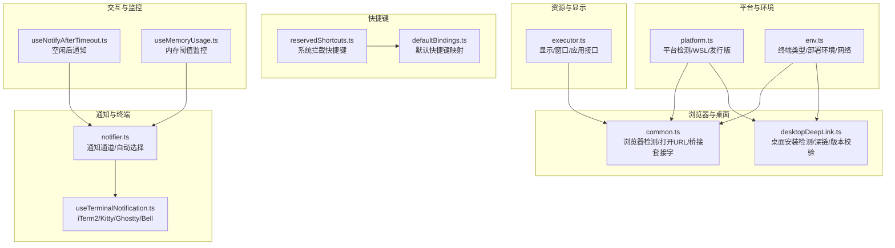
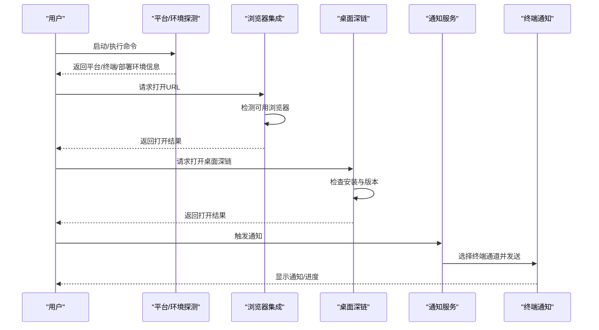
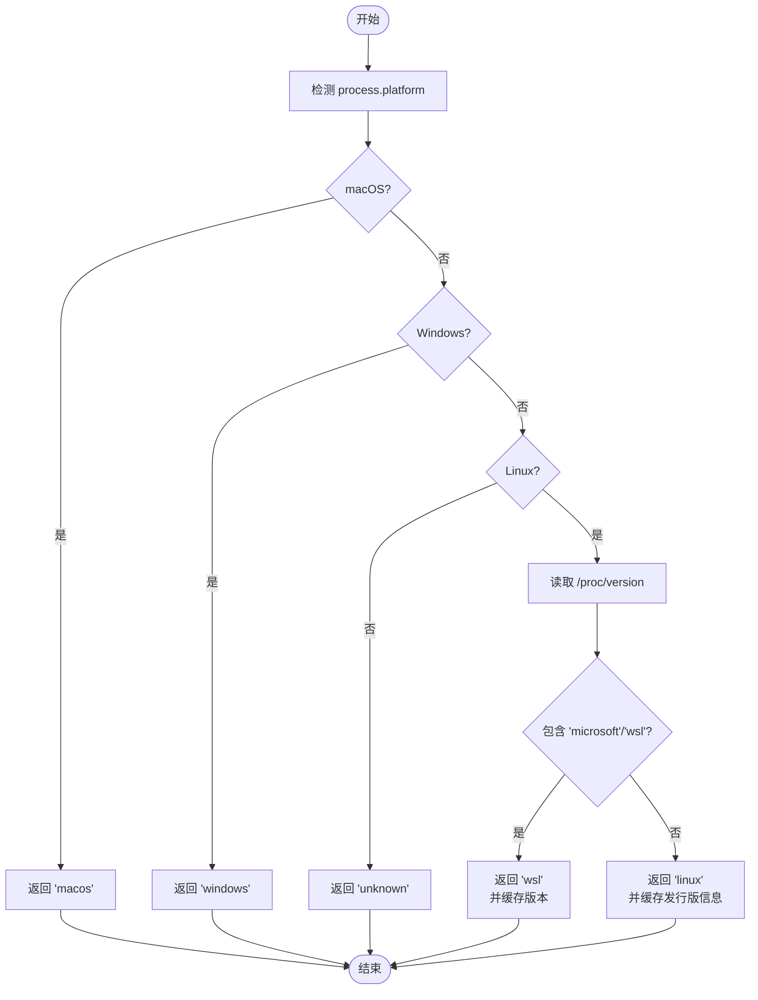
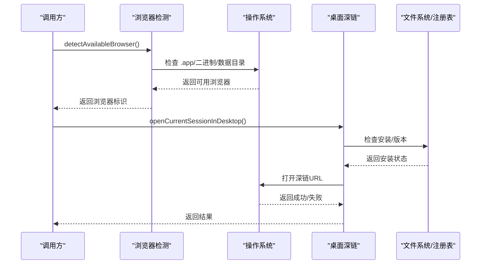
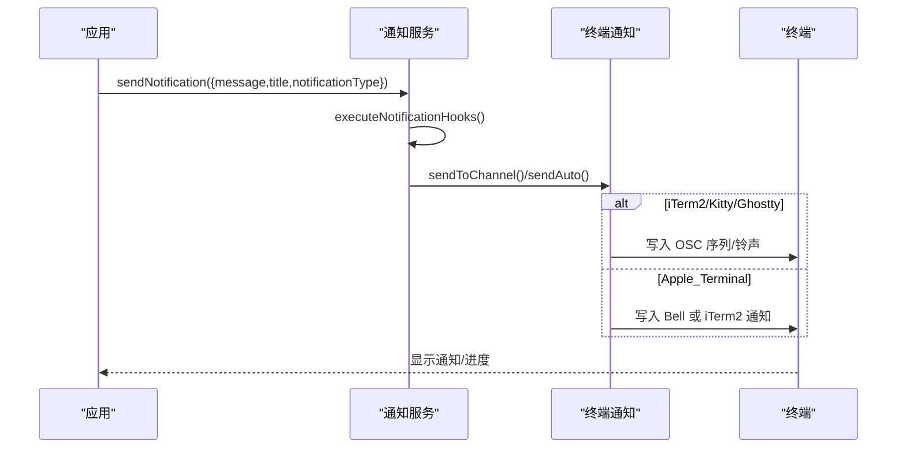
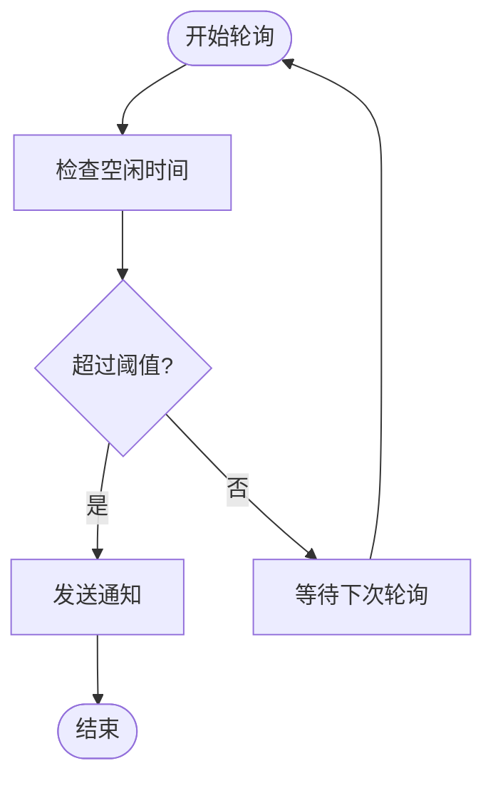
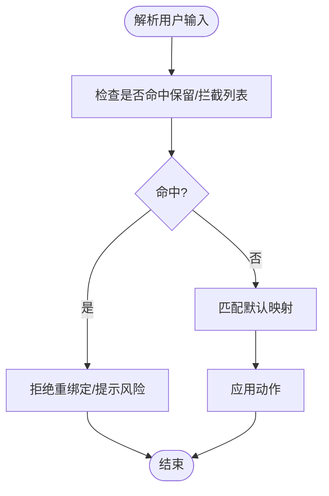
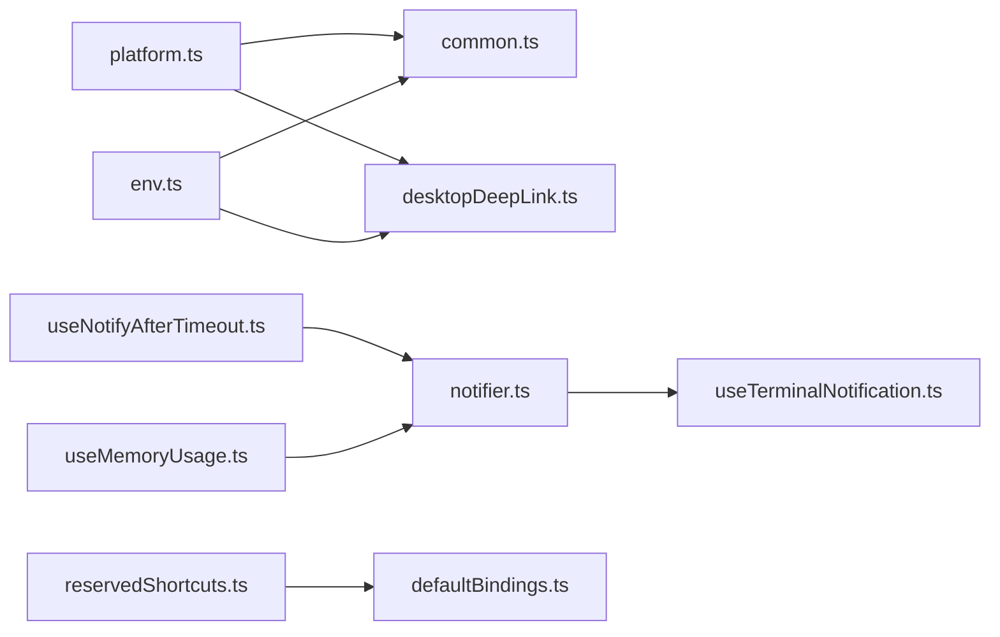

# 系统集成工具

<cite>
**本文档引用的文件**
- [platform.ts](file://src/utils/platform.ts)
- [env.ts](file://src/utils/env.ts)
- [common.ts](file://src/utils/claudeInChrome/common.ts)
- [desktopDeepLink.ts](file://src/utils/desktopDeepLink.ts)
- [notifier.ts](file://src/services/notifier.ts)
- [useTerminalNotification.ts](file://src/ink/useTerminalNotification.ts)
- [useNotifyAfterTimeout.ts](file://src/hooks/useNotifyAfterTimeout.ts)
- [useMemoryUsage.ts](file://src/hooks/useMemoryUsage.ts)
- [reservedShortcuts.ts](file://src/keybindings/reservedShortcuts.ts)
- [defaultBindings.ts](file://src/keybindings/defaultBindings.ts)
- [executor.ts](file://src/utils/computerUse/executor.ts)
</cite>

## 目录
1. [简介](#简介)
2. [项目结构](#项目结构)
3. [核心组件](#核心组件)
4. [架构总览](#架构总览)
5. [详细组件分析](#详细组件分析)
6. [依赖关系分析](#依赖关系分析)
7. [性能考量](#性能考量)
8. [故障排查指南](#故障排查指南)
9. [结论](#结论)
10. [附录](#附录)

## 简介
本文件面向 free-code 的系统集成工具，系统性阐述跨平台系统调用、系统信息获取与系统资源管理；操作系统检测、浏览器集成与终端适配；系统通知、系统托盘与系统快捷方式处理；系统权限请求与系统 API 访问控制；以及系统兼容性处理与系统版本检测机制。文档同时给出扩展点与自定义系统适配器的设计建议，并提供可视化图示帮助理解。

## 项目结构
围绕系统集成的关键模块主要分布在以下路径：
- 平台与环境探测：src/utils/platform.ts、src/utils/env.ts
- 浏览器与桌面深链：src/utils/claudeInChrome/common.ts、src/utils/desktopDeepLink.ts
- 终端通知与进度上报：src/services/notifier.ts、src/ink/useTerminalNotification.ts
- 交互与资源监控：src/hooks/useNotifyAfterTimeout.ts、src/hooks/useMemoryUsage.ts
- 快捷键与系统拦截：src/keybindings/reservedShortcuts.ts、src/keybindings/defaultBindings.ts
- 资源与显示：src/utils/computerUse/executor.ts（显示/窗口/应用相关）

图表来源
- [platform.ts:1-151](file://src/utils/platform.ts#L1-L151)
- [env.ts:1-348](file://src/utils/env.ts#L1-L348)
- [common.ts:1-541](file://src/utils/claudeInChrome/common.ts#L1-L541)
- [desktopDeepLink.ts:1-237](file://src/utils/desktopDeepLink.ts#L1-L237)
- [notifier.ts:1-157](file://src/services/notifier.ts#L1-L157)
- [useTerminalNotification.ts:1-127](file://src/ink/useTerminalNotification.ts#L1-L127)
- [useNotifyAfterTimeout.ts:28-65](file://src/hooks/useNotifyAfterTimeout.ts#L28-L65)
- [useMemoryUsage.ts:1-39](file://src/hooks/useMemoryUsage.ts#L1-L39)
- [reservedShortcuts.ts:1-93](file://src/keybindings/reservedShortcuts.ts#L1-L93)
- [defaultBindings.ts:32-66](file://src/keybindings/defaultBindings.ts#L32-L66)
- [executor.ts:342-366](file://src/utils/computerUse/executor.ts#L342-L366)

章节来源
- [platform.ts:1-151](file://src/utils/platform.ts#L1-L151)
- [env.ts:1-348](file://src/utils/env.ts#L1-L348)

## 核心组件
- 平台与环境探测：统一抽象不同平台差异，识别 WSL、发行版信息、部署环境、SSH 会话等，为后续行为提供依据。
- 浏览器与桌面集成：在多平台下检测可用浏览器、打开 URL、管理桥接套接字；检测桌面安装状态与版本，构建并打开深链。
- 终端通知与进度上报：根据终端类型自动选择通知通道（iTerm2、Kitty、Ghostty），支持铃声提示与进度条。
- 交互与资源监控：基于空闲时间触发通知，周期性采集内存使用状态并按阈值展示。
- 快捷键与系统拦截：定义不可重绑定与被系统/终端拦截的快捷键集合，避免冲突。
- 资源与显示：封装显示/窗口/应用相关能力，便于上层工具使用。

章节来源
- [common.ts:345-469](file://src/utils/claudeInChrome/common.ts#L345-L469)
- [desktopDeepLink.ts:137-162](file://src/utils/desktopDeepLink.ts#L137-L162)
- [notifier.ts:18-36](file://src/services/notifier.ts#L18-L36)
- [useTerminalNotification.ts:25-126](file://src/ink/useTerminalNotification.ts#L25-L126)
- [useNotifyAfterTimeout.ts:38-65](file://src/hooks/useNotifyAfterTimeout.ts#L38-L65)
- [useMemoryUsage.ts:18-39](file://src/hooks/useMemoryUsage.ts#L18-L39)
- [reservedShortcuts.ts:73-83](file://src/keybindings/reservedShortcuts.ts#L73-L83)
- [defaultBindings.ts:32-66](file://src/keybindings/defaultBindings.ts#L32-L66)
- [executor.ts:342-366](file://src/utils/computerUse/executor.ts#L342-L366)

## 架构总览
系统集成工具通过“平台/环境探测”作为入口，驱动“浏览器/桌面深链”“终端通知/进度”“快捷键/拦截”“资源监控”等子系统协同工作。关键流程包括：
- 平台识别与版本检测（WSL、发行版、部署环境）
- 终端类型识别与通知通道选择
- 浏览器可用性检测与 URL 打开策略
- 桌面安装状态与版本兼容性检查
- 空闲与资源阈值触发的通知策略

图表来源
- [platform.ts:11-49](file://src/utils/platform.ts#L11-L49)
- [common.ts:345-469](file://src/utils/claudeInChrome/common.ts#L345-L469)
- [desktopDeepLink.ts:137-200](file://src/utils/desktopDeepLink.ts#L137-L200)
- [notifier.ts:18-36](file://src/services/notifier.ts#L18-L36)
- [useTerminalNotification.ts:25-126](file://src/ink/useTerminalNotification.ts#L25-L126)

## 详细组件分析

### 平台与环境探测
- 功能要点
  - 平台识别：区分 macOS、Windows、WSL、Linux、unknown，并缓存结果。
  - WSL 版本检测：从内核字符串中提取 WSL 版本或回退到“WSL1”判断。
  - 发行版信息：读取 /etc/os-release 获取发行版 ID 与版本号。
  - 部署环境识别：覆盖云开发、云平台、容器/编排、CI 等常见环境。
  - 终端类型识别：综合 TERM、TERM_PROGRAM、TMUX、WSL 等环境变量进行判定。
  - SSH 会话检测：通过 SSH_* 环境变量判断当前是否处于 SSH 会话。
- 复杂度与性能
  - 多处使用 memoize 缓存，减少重复 IO 与系统调用。
  - 文件读取与正则匹配为 O(n) 行为，影响有限。
- 错误处理
  - 对异常 IO 进行捕获并返回安全默认值（如 unknown）。

图表来源
- [platform.ts:11-79](file://src/utils/platform.ts#L11-L79)
- [platform.ts:87-115](file://src/utils/platform.ts#L87-L115)

章节来源
- [platform.ts:11-115](file://src/utils/platform.ts#L11-L115)
- [env.ts:135-234](file://src/utils/env.ts#L135-L234)
- [env.ts:240-305](file://src/utils/env.ts#L240-L305)

### 浏览器集成与桌面深链
- 浏览器集成
  - 支持 Chrome、Brave、Arc、Chromium、Edge、Vivaldi、Opera。
  - 按平台优先级检测可用浏览器：macOS 检查 .app 是否存在；Linux/WSL 检查二进制是否存在；Windows 检查数据目录或注册表。
  - 打开 URL：macOS 使用 open 命令；Windows 使用 rundll32 避免元字符问题；Linux/WSL 尝试多个二进制。
  - 桥接套接字：Unix 使用 /tmp 下带用户名的 socket 目录，Windows 使用命名管道。
- 桌面深链
  - 安装检测：macOS 检查 /Applications/Claude.app；Linux 通过 xdg-mime 查询协议处理器；Windows 通过注册表查询。
  - 版本检测：macOS 读取 Info.plist；Windows 扫描 Squirrel 安装目录下的 app-X.Y.Z 最高版本。
  - 深链构建：claude://resume 或 claude-dev://resume（开发模式），携带会话 ID 与当前工作目录。
  - 打开深链：macOS 使用 open 或 AppleScript（开发模式）；Linux 使用 xdg-open；Windows 使用 cmd /c start。

图表来源
- [common.ts:345-469](file://src/utils/claudeInChrome/common.ts#L345-L469)
- [desktopDeepLink.ts:50-200](file://src/utils/desktopDeepLink.ts#L50-L200)

章节来源
- [common.ts:39-216](file://src/utils/claudeInChrome/common.ts#L39-L216)
- [common.ts:345-469](file://src/utils/claudeInChrome/common.ts#L345-L469)
- [desktopDeepLink.ts:11-162](file://src/utils/desktopDeepLink.ts#L11-L162)

### 终端通知与进度上报
- 通知通道
  - 自动选择：根据 env.terminal 判定 iTerm2、Kitty、Ghostty 或 Apple_Terminal 铃声。
  - 手动指定：iterm2、kitty、ghostty、terminal_bell、notifications_disabled 等。
  - Apple_Terminal：若禁用铃声，则回退到发送 BEL。
- 进度上报
  - 仅在支持的终端（iTerm2/Kitty/Ghostty 等）启用进度条。
  - 支持 running、indeterminate、error、completed 四种状态与百分比。
- 通知钩子
  - 发送前执行通知钩子，便于外部扩展。

图表来源
- [notifier.ts:18-104](file://src/services/notifier.ts#L18-L104)
- [useTerminalNotification.ts:25-126](file://src/ink/useTerminalNotification.ts#L25-L126)

章节来源
- [notifier.ts:18-157](file://src/services/notifier.ts#L18-L157)
- [useTerminalNotification.ts:25-126](file://src/ink/useTerminalNotification.ts#L25-L126)

### 交互与资源监控
- 空闲通知
  - 在空闲超过阈值时触发通知，支持立即触发与延时触发两种场景。
  - 通过定时器轮询与交互时间戳控制，避免长时间任务导致的误触发。
- 内存监控
  - 每 10 秒轮询一次 heapUsed，超过阈值（高/危）才更新状态，降低渲染压力。
  - 提供 normal/null 状态以避免不必要的 UI 更新。

图表来源
- [useNotifyAfterTimeout.ts:53-64](file://src/hooks/useNotifyAfterTimeout.ts#L53-L64)

章节来源
- [useNotifyAfterTimeout.ts:28-65](file://src/hooks/useNotifyAfterTimeout.ts#L28-L65)
- [useMemoryUsage.ts:18-39](file://src/hooks/useMemoryUsage.ts#L18-L39)

### 快捷键与系统拦截
- 不可重绑定快捷键：如 ctrl+c、ctrl+d、ctrl+m 等，由系统或终端硬编码拦截。
- 终端保留快捷键：如 ctrl+z、ctrl+\ 等，可能被终端/OS 拦截。
- macOS 特有系统快捷键：如 cmd+c/v/x/q/w/tab/space 等。
- 默认快捷键映射：在全局与聊天上下文下提供常用快捷键，部分快捷键在特定特性开启时生效。

图表来源
- [reservedShortcuts.ts:73-83](file://src/keybindings/reservedShortcuts.ts#L73-L83)
- [defaultBindings.ts:32-66](file://src/keybindings/defaultBindings.ts#L32-L66)

章节来源
- [reservedShortcuts.ts:1-93](file://src/keybindings/reservedShortcuts.ts#L1-L93)
- [defaultBindings.ts:32-66](file://src/keybindings/defaultBindings.ts#L32-L66)

### 资源与显示（计算机使用）
- 显示/窗口/应用接口：提供获取显示器尺寸、列出显示器、查找窗口所在显示器等能力。
- 与系统集成：通过底层能力封装，为上层工具提供一致的跨平台接口。

章节来源
- [executor.ts:342-366](file://src/utils/computerUse/executor.ts#L342-L366)

## 依赖关系分析
- 组件耦合
  - 平台与环境探测为上游基础能力，被浏览器/桌面、通知、快捷键等广泛依赖。
  - 终端通知依赖 env.terminal 与 Ink 的写入上下文。
  - 浏览器与桌面深链依赖平台探测与系统命令（open/xdg-open/reg/rundll32 等）。
- 外部依赖
  - 系统命令与配置文件（/proc/version、/etc/os-release、注册表、AppleScript、defaults）。
  - 第三方库用于解析 plist（Apple_Terminal 配置解析）。
- 循环依赖
  - 当前模块间无明显循环依赖迹象；各模块职责清晰，通过函数调用解耦。

图表来源
- [platform.ts:1-151](file://src/utils/platform.ts#L1-L151)
- [env.ts:1-348](file://src/utils/env.ts#L1-L348)
- [common.ts:1-541](file://src/utils/claudeInChrome/common.ts#L1-L541)
- [desktopDeepLink.ts:1-237](file://src/utils/desktopDeepLink.ts#L1-L237)
- [notifier.ts:1-157](file://src/services/notifier.ts#L1-L157)
- [useTerminalNotification.ts:1-127](file://src/ink/useTerminalNotification.ts#L1-L127)
- [useNotifyAfterTimeout.ts:28-65](file://src/hooks/useNotifyAfterTimeout.ts#L28-L65)
- [useMemoryUsage.ts:1-39](file://src/hooks/useMemoryUsage.ts#L1-L39)
- [reservedShortcuts.ts:1-93](file://src/keybindings/reservedShortcuts.ts#L1-L93)
- [defaultBindings.ts:32-66](file://src/keybindings/defaultBindings.ts#L32-L66)

## 性能考量
- 缓存与去抖
  - 多处使用 memoize 缓存昂贵操作（平台识别、WSL 版本、发行版信息、部署环境、终端类型）。
- I/O 优化
  - 仅在必要时读取 /proc/version 与 /etc/os-release，且对异常进行容错。
- 渲染节流
  - 内存监控每 10 秒一次，且在正常状态下不更新状态，避免频繁重渲染。
- 通知最小化
  - 自动通道选择失败时返回“无方法可用”，避免无效尝试。

## 故障排查指南
- 浏览器无法打开 URL
  - 检查可用浏览器检测逻辑与平台分支；确认 open/xdg-open/rundll32 可用。
  - 关注日志输出与返回码，定位具体失败步骤。
- Apple_Terminal 铃声无效
  - 检查当前配置文件是否禁用了铃声；必要时回退到 Bell 通知。
- 桌面深链无法打开
  - 确认安装检测与版本检测逻辑；在开发模式下检查 AppleScript 路由是否正确。
- 终端通知未显示
  - 检查 preferredNotifChannel 与 env.terminal；确认终端支持对应 OSC 序列。
- 快捷键无效
  - 检查是否命中保留/拦截列表；确认终端/OS 是否拦截了该组合键。

章节来源
- [common.ts:444-468](file://src/utils/claudeInChrome/common.ts#L444-L468)
- [notifier.ts:110-156](file://src/services/notifier.ts#L110-L156)
- [desktopDeepLink.ts:168-200](file://src/utils/desktopDeepLink.ts#L168-L200)
- [env.ts:135-234](file://src/utils/env.ts#L135-L234)
- [reservedShortcuts.ts:73-83](file://src/keybindings/reservedShortcuts.ts#L73-L83)

## 结论
本系统集成工具通过统一的平台/环境探测，结合跨平台的浏览器与桌面深链、终端通知与进度上报、快捷键拦截策略以及资源监控机制，实现了在多平台、多终端、多部署环境下的稳定运行。其设计强调可扩展性与可维护性，为后续新增系统适配器与权限控制提供了清晰的扩展点。

## 附录
- 扩展点与自定义系统适配器建议
  - 新增浏览器：在浏览器配置集中添加新浏览器的平台路径/二进制/注册表项，并调整检测顺序。
  - 新增终端通知通道：在通知服务中增加通道分支，并在终端通知中实现相应 OSC 序列。
  - 新增部署环境：在部署环境检测中增加识别规则，确保 analytics 与诊断信息准确。
  - 新增快捷键映射：在默认映射中添加新功能快捷键，并在保留列表中声明拦截风险。
- 权限请求与系统 API 访问控制
  - 建议在调用系统命令前进行能力检测与降级处理，避免阻塞主流程。
  - 对涉及用户隐私或系统敏感的操作（如打开深链、写入配置）提供明确的用户确认与审计日志。
- 兼容性与版本检测
  - 对于桌面深链与浏览器桥接，采用语义化版本比较与最小版本限制，保证功能可用性。
  - 对于终端通知，记录并上报所用通道与终端类型，便于问题定位与版本演进。