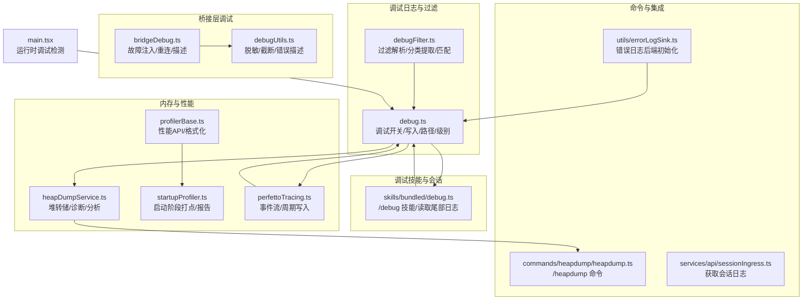
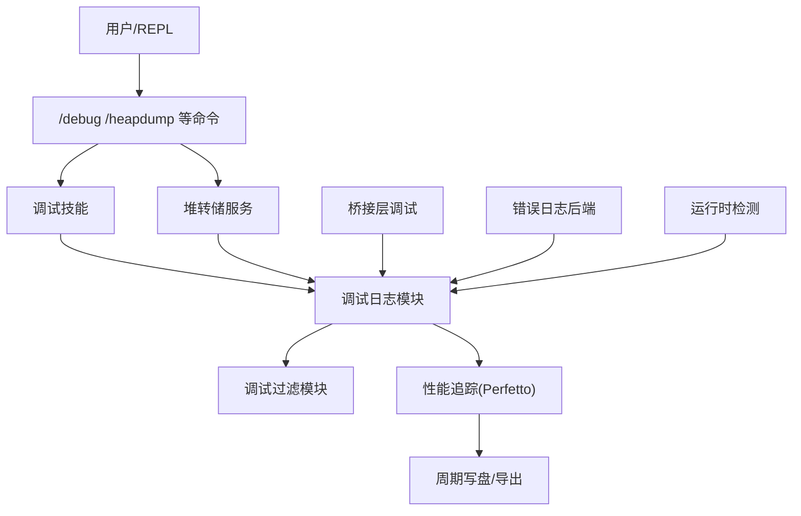
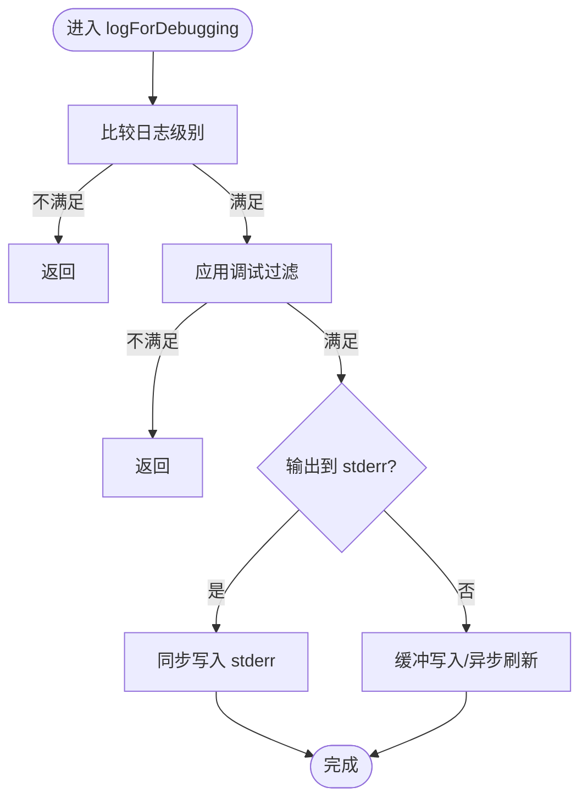
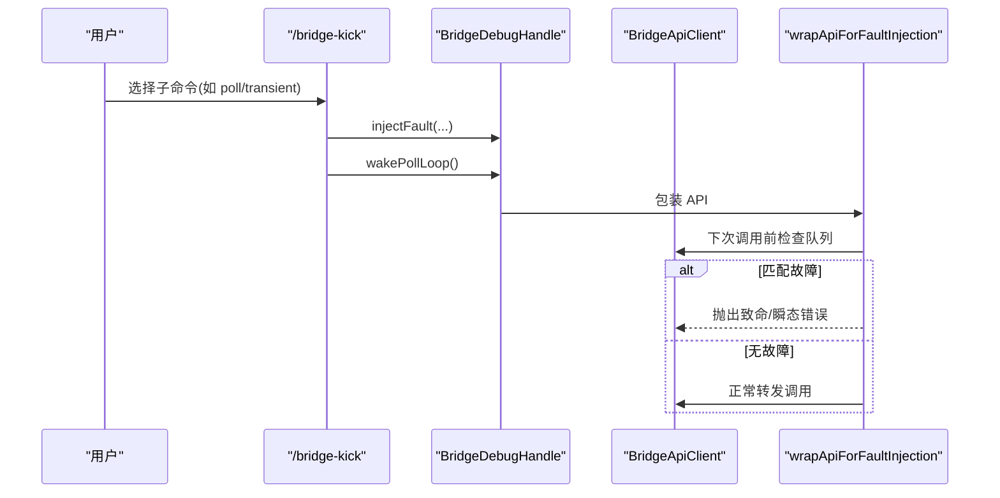
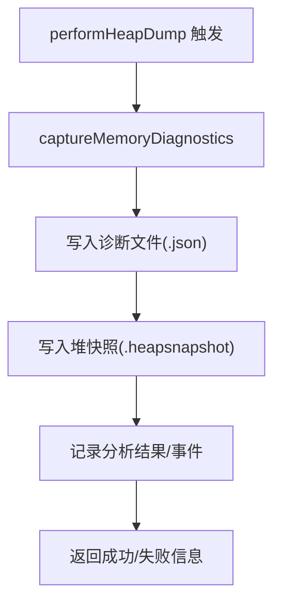
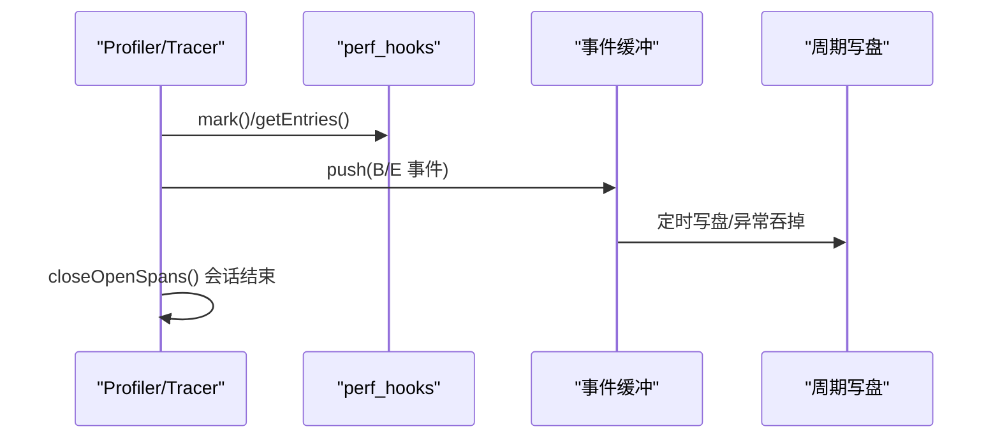
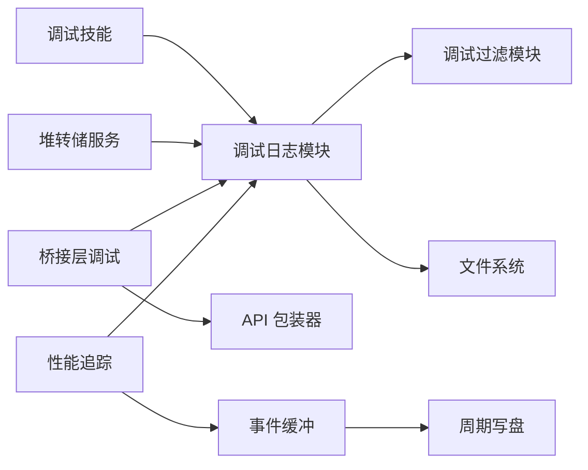

# 调试工具

<cite>
**本文引用的文件**
- [src/utils/debug.ts](file://src/utils/debug.ts)
- [src/utils/debugFilter.ts](file://src/utils/debugFilter.ts)
- [src/bridge/bridgeDebug.ts](file://src/bridge/bridgeDebug.ts)
- [src/bridge/debugUtils.ts](file://src/bridge/debugUtils.ts)
- [src/skills/bundled/debug.ts](file://src/skills/bundled/debug.ts)
- [src/utils/heapDumpService.ts](file://src/utils/heapDumpService.ts)
- [src/commands/heapdump/heapdump.ts](file://src/commands/heapdump/heapdump.ts)
- [src/utils/profilerBase.ts](file://src/utils/profilerBase.ts)
- [src/utils/startupProfiler.ts](file://src/utils/startupProfiler.ts)
- [src/utils/telemetry/perfettoTracing.ts](file://src/utils/telemetry/perfettoTracing.ts)
- [src/services/api/sessionIngress.ts](file://src/services/api/sessionIngress.ts)
- [src/utils/errorLogSink.ts](file://src/utils/errorLogSink.ts)
- [src/main.tsx](file://src/main.tsx)
</cite>

## 目录
1. [简介](#简介)
2. [项目结构](#项目结构)
3. [核心组件](#核心组件)
4. [架构总览](#架构总览)
5. [详细组件分析](#详细组件分析)
6. [依赖关系分析](#依赖关系分析)
7. [性能考量](#性能考量)
8. [故障排查指南](#故障排查指南)
9. [结论](#结论)
10. [附录](#附录)

## 简介
本文件系统性梳理 free-code 的调试工具集，覆盖调试模式启用机制、调试信息采集与过滤、性能分析（启动/查询/交互）、内存监控与堆转储、资源使用跟踪、桥接层故障注入与恢复测试、调试会话管理、可视化与导出能力，以及生产环境调试注意事项与优化建议。目标是帮助开发者在开发与排障场景中高效定位问题，并在生产环境中安全可控地启用诊断能力。

## 项目结构
调试工具相关代码主要分布在以下模块：
- 调试日志与过滤：src/utils/debug.ts、src/utils/debugFilter.ts
- 桥接层调试与故障注入：src/bridge/bridgeDebug.ts、src/bridge/debugUtils.ts
- 调试技能与会话管理：src/skills/bundled/debug.ts
- 内存与资源监控：src/utils/heapDumpService.ts、src/utils/profilerBase.ts、src/utils/startupProfiler.ts、src/utils/telemetry/perfettoTracing.ts
- 命令入口与集成：src/commands/heapdump/heapdump.ts、src/services/api/sessionIngress.ts
- 错误日志后端：src/utils/errorLogSink.ts
- 运行时检测：src/main.tsx

**图表来源**
- [src/utils/debug.ts:1-269](file://src/utils/debug.ts#L1-L269)
- [src/utils/debugFilter.ts:1-158](file://src/utils/debugFilter.ts#L1-L158)
- [src/bridge/bridgeDebug.ts:1-136](file://src/bridge/bridgeDebug.ts#L1-L136)
- [src/bridge/debugUtils.ts:1-142](file://src/bridge/debugUtils.ts#L1-L142)
- [src/skills/bundled/debug.ts:1-104](file://src/skills/bundled/debug.ts#L1-L104)
- [src/utils/heapDumpService.ts:1-304](file://src/utils/heapDumpService.ts#L1-L304)
- [src/utils/profilerBase.ts:1-46](file://src/utils/profilerBase.ts#L1-L46)
- [src/utils/startupProfiler.ts:68-128](file://src/utils/startupProfiler.ts#L68-L128)
- [src/utils/telemetry/perfettoTracing.ts:642-1005](file://src/utils/telemetry/perfettoTracing.ts#L642-L1005)
- [src/commands/heapdump/heapdump.ts:1-18](file://src/commands/heapdump/heapdump.ts#L1-L18)
- [src/services/api/sessionIngress.ts:449-485](file://src/services/api/sessionIngress.ts#L449-L485)
- [src/utils/errorLogSink.ts:212-235](file://src/utils/errorLogSink.ts#L212-L235)
- [src/main.tsx:231-250](file://src/main.tsx#L231-L250)

**章节来源**
- [src/utils/debug.ts:1-269](file://src/utils/debug.ts#L1-L269)
- [src/utils/debugFilter.ts:1-158](file://src/utils/debugFilter.ts#L1-L158)
- [src/bridge/bridgeDebug.ts:1-136](file://src/bridge/bridgeDebug.ts#L1-L136)
- [src/bridge/debugUtils.ts:1-142](file://src/bridge/debugUtils.ts#L1-L142)
- [src/skills/bundled/debug.ts:1-104](file://src/skills/bundled/debug.ts#L1-L104)
- [src/utils/heapDumpService.ts:1-304](file://src/utils/heapDumpService.ts#L1-L304)
- [src/utils/profilerBase.ts:1-46](file://src/utils/profilerBase.ts#L1-L46)
- [src/utils/startupProfiler.ts:68-128](file://src/utils/startupProfiler.ts#L68-L128)
- [src/utils/telemetry/perfettoTracing.ts:642-1005](file://src/utils/telemetry/perfettoTracing.ts#L642-L1005)
- [src/commands/heapdump/heapdump.ts:1-18](file://src/commands/heapdump/heapdump.ts#L1-L18)
- [src/services/api/sessionIngress.ts:449-485](file://src/services/api/sessionIngress.ts#L449-L485)
- [src/utils/errorLogSink.ts:212-235](file://src/utils/errorLogSink.ts#L212-L235)
- [src/main.tsx:231-250](file://src/main.tsx#L231-L250)

## 核心组件
- 调试模式与日志输出
  - 启用机制：支持命令行参数、环境变量、运行时动态开启；可定向到 stderr 或文件；支持最小日志级别控制与格式化输出标记。
  - 日志写入：缓冲写入、延迟刷新、即时模式、符号链接指向最新日志文件。
  - 过滤机制：基于类别（前缀/方括号/MCP/事件类型等）的包含/排除过滤，支持混合模式自动降级。
- 桥接层调试与故障注入
  - 故障注入：针对 poll/register/reconnect/heartbeat 四类 API 注入致命或瞬态错误，支持计数与立即唤醒轮询循环。
  - 恢复测试：提供强制重连与状态描述，便于观察恢复路径。
  - 安全脱敏：对敏感字段进行脱敏处理，限制消息长度并截断超长内容。
- 调试技能与会话管理
  - /debug 技能：按需开启调试日志，读取会话日志尾部内容，提示用户复现问题并重新阅读日志。
- 内存与资源监控
  - 堆转储：先写诊断文件再写堆快照，避免大堆序列化崩溃；记录 V8 统计、原生内存、句柄/请求、FD 数量等。
  - 资源使用：RSS、堆使用、外部内存、上下文数量、增长速率、平台版本等。
- 性能分析
  - 启动性能：通过 marks 记录关键节点，生成带内存快照的时间线报告。
  - 通用性能：共享格式化函数，统一时间线列对齐与内存信息展示。
  - Perfetto 事件流：API/工具/用户输入/交互等多类 span，支持周期写盘与异常吞掉。
- 命令与集成
  - /heapdump 命令：触发堆转储与诊断文件输出。
  - 会话日志获取：从服务端拉取会话日志，处理鉴权失效与未找到等场景。
  - 错误日志后端：初始化错误日志写入，保证启动早期错误不丢失。
- 运行时检测
  - 检测 Node/Bun 的 --inspect/--debug 等标志，辅助判断是否处于调试/检查模式。

**章节来源**
- [src/utils/debug.ts:18-269](file://src/utils/debug.ts#L18-L269)
- [src/utils/debugFilter.ts:1-158](file://src/utils/debugFilter.ts#L1-L158)
- [src/bridge/bridgeDebug.ts:1-136](file://src/bridge/bridgeDebug.ts#L1-L136)
- [src/bridge/debugUtils.ts:1-142](file://src/bridge/debugUtils.ts#L1-L142)
- [src/skills/bundled/debug.ts:1-104](file://src/skills/bundled/debug.ts#L1-L104)
- [src/utils/heapDumpService.ts:1-304](file://src/utils/heapDumpService.ts#L1-L304)
- [src/utils/profilerBase.ts:1-46](file://src/utils/profilerBase.ts#L1-L46)
- [src/utils/startupProfiler.ts:68-128](file://src/utils/startupProfiler.ts#L68-L128)
- [src/utils/telemetry/perfettoTracing.ts:642-1005](file://src/utils/telemetry/perfettoTracing.ts#L642-L1005)
- [src/commands/heapdump/heapdump.ts:1-18](file://src/commands/heapdump/heapdump.ts#L1-L18)
- [src/services/api/sessionIngress.ts:449-485](file://src/services/api/sessionIngress.ts#L449-L485)
- [src/utils/errorLogSink.ts:212-235](file://src/utils/errorLogSink.ts#L212-L235)
- [src/main.tsx:231-250](file://src/main.tsx#L231-L250)

## 架构总览
调试工具围绕“日志—过滤—采集—分析—导出”的闭环构建，桥接层与性能追踪模块提供细粒度观测点，命令与技能提供用户入口，错误日志后端确保诊断数据完整性。

**图表来源**
- [src/skills/bundled/debug.ts:1-104](file://src/skills/bundled/debug.ts#L1-L104)
- [src/commands/heapdump/heapdump.ts:1-18](file://src/commands/heapdump/heapdump.ts#L1-L18)
- [src/utils/heapDumpService.ts:1-304](file://src/utils/heapDumpService.ts#L1-L304)
- [src/utils/debug.ts:1-269](file://src/utils/debug.ts#L1-L269)
- [src/utils/debugFilter.ts:1-158](file://src/utils/debugFilter.ts#L1-L158)
- [src/utils/telemetry/perfettoTracing.ts:642-1005](file://src/utils/telemetry/perfettoTracing.ts#L642-L1005)
- [src/bridge/bridgeDebug.ts:1-136](file://src/bridge/bridgeDebug.ts#L1-L136)
- [src/utils/errorLogSink.ts:212-235](file://src/utils/errorLogSink.ts#L212-L235)
- [src/main.tsx:231-250](file://src/main.tsx#L231-L250)

## 详细组件分析

### 调试模式与日志系统
- 启用机制
  - 支持环境变量 DEBUG/DEBUG_SDK、命令行 --debug/-d、--debug-to-stderr/-D、--debug=pattern、--debug-file 等。
  - 运行时可通过 /debug 动态开启，非 ant 用户默认不写日志，/debug 可临时开启。
- 日志写入
  - 缓冲写入，定时刷新；当直接输出到 stderr 时采用同步写以避免进程退出导致丢数据。
  - 自动维护最新日志的符号链接，便于快速定位。
- 过滤与级别
  - 最小日志级别由环境变量控制，默认 debug；verbose 仅在显式设置时启用。
  - 过滤规则支持包含/排除两类，类别提取逻辑覆盖多种常见格式。

**图表来源**
- [src/utils/debug.ts:203-228](file://src/utils/debug.ts#L203-L228)
- [src/utils/debugFilter.ts:145-157](file://src/utils/debugFilter.ts#L145-L157)

**章节来源**
- [src/utils/debug.ts:44-102](file://src/utils/debug.ts#L44-L102)
- [src/utils/debug.ts:155-228](file://src/utils/debug.ts#L155-L228)
- [src/utils/debugFilter.ts:16-53](file://src/utils/debugFilter.ts#L16-L53)
- [src/utils/debugFilter.ts:65-108](file://src/utils/debugFilter.ts#L65-L108)
- [src/utils/debugFilter.ts:116-157](file://src/utils/debugFilter.ts#L116-L157)

### 调试过滤与类别提取
- 解析规则
  - 支持逗号分隔的包含/排除列表；若同时出现则视为无效，退化为不过滤。
- 类别提取
  - 支持“前缀:”、“[类别]”、MCP server 名称、1P 事件等多模式，自动去重。
- 匹配逻辑
  - 排除模式下，未提取到类别的消息默认不显示；包含模式下，未匹配的消息不显示。

**章节来源**
- [src/utils/debugFilter.ts:16-53](file://src/utils/debugFilter.ts#L16-L53)
- [src/utils/debugFilter.ts:65-108](file://src/utils/debugFilter.ts#L65-L108)
- [src/utils/debugFilter.ts:116-157](file://src/utils/debugFilter.ts#L116-L157)

### 桥接层调试与故障注入
- 故障类型
  - 针对 pollForWork/registerBridgeEnvironment/reconnectSession/heartbeatWork 四类 API。
  - 致命错误经统一错误类型抛出；瞬态错误模拟网络/5xx 失败。
- 注入与消费
  - 使用队列存储一次性故障，调用前检查并消费，支持剩余次数计数。
- 恢复与可观测
  - 提供强制重连、唤醒轮询、描述当前环境/会话 ID，便于观察恢复路径。

**图表来源**
- [src/bridge/bridgeDebug.ts:70-135](file://src/bridge/bridgeDebug.ts#L70-L135)
- [src/bridge/bridgeDebug.ts:21-36](file://src/bridge/bridgeDebug.ts#L21-L36)
- [src/bridge/bridgeDebug.ts:84-135](file://src/bridge/bridgeDebug.ts#L84-L135)

**章节来源**
- [src/bridge/bridgeDebug.ts:1-136](file://src/bridge/bridgeDebug.ts#L1-L136)
- [src/bridge/debugUtils.ts:1-142](file://src/bridge/debugUtils.ts#L1-L142)

### 调试技能与会话管理
- /debug 技能
  - 首次调用即开启调试日志，记录日志路径与大小，读取尾部若干行用于快速诊断。
  - 若日志尚未存在，提示刚开启调试；否则给出最后若干行内容与建议。

**章节来源**
- [src/skills/bundled/debug.ts:25-101](file://src/skills/bundled/debug.ts#L25-L101)

### 内存监控与堆转储
- 诊断采集
  - 先于堆快照写入诊断文件，包含时间戳、会话 ID、触发方式、运行时长、内存使用、增长速率、V8 统计、资源使用、活动句柄/请求、FD 数量、潜在泄漏清单与建议、平台/版本信息等。
- 堆快照写入
  - 在 Bun 中使用同步写入避免跨线程字符串克隆；随后触发 GC 尝试释放。
  - 在 Node 中使用流管道写入，自动清理。
- 导出与分析
  - 输出堆快照与诊断文件路径，便于后续分析；诊断文件包含泄漏风险提示。

**图表来源**
- [src/utils/heapDumpService.ts:221-278](file://src/utils/heapDumpService.ts#L221-L278)
- [src/utils/heapDumpService.ts:88-212](file://src/utils/heapDumpService.ts#L88-L212)
- [src/utils/heapDumpService.ts:284-303](file://src/utils/heapDumpService.ts#L284-L303)

**章节来源**
- [src/utils/heapDumpService.ts:1-304](file://src/utils/heapDumpService.ts#L1-L304)
- [src/commands/heapdump/heapdump.ts:1-18](file://src/commands/heapdump/heapdump.ts#L1-L18)

### 性能分析器与事件追踪
- 启动性能分析
  - 通过 marks 记录关键节点，结合内存快照生成时间线报告；支持采样上报。
- 通用性能基础设施
  - 提供统一的时间线格式化函数，便于对齐列宽与展示内存信息。
- Perfetto 事件追踪
  - 支持 API 调用、工具执行、用户输入等待、交互等多类 span；自动周期写盘，异常吞掉以避免影响会话。
  - 提供开始/结束 span 的统一接口与参数扩展，支持采样阶段与输出令牌统计。

**图表来源**
- [src/utils/startupProfiler.ts:68-128](file://src/utils/startupProfiler.ts#L68-L128)
- [src/utils/profilerBase.ts:14-46](file://src/utils/profilerBase.ts#L14-L46)
- [src/utils/telemetry/perfettoTracing.ts:642-1005](file://src/utils/telemetry/perfettoTracing.ts#L642-L1005)

**章节来源**
- [src/utils/startupProfiler.ts:68-128](file://src/utils/startupProfiler.ts#L68-L128)
- [src/utils/profilerBase.ts:1-46](file://src/utils/profilerBase.ts#L1-L46)
- [src/utils/telemetry/perfettoTracing.ts:642-1005](file://src/utils/telemetry/perfettoTracing.ts#L642-L1005)

### 命令与会话日志集成
- /heapdump 命令
  - 调用堆转储服务，返回堆快照与诊断文件路径。
- 会话日志获取
  - 从服务端拉取日志，处理 404/401 等状态码并记录诊断事件。
- 错误日志后端
  - 初始化错误日志写入，保证启动早期错误不丢失，且在初始化 analytics 之前调用。

**章节来源**
- [src/commands/heapdump/heapdump.ts:1-18](file://src/commands/heapdump/heapdump.ts#L1-L18)
- [src/services/api/sessionIngress.ts:449-485](file://src/services/api/sessionIngress.ts#L449-L485)
- [src/utils/errorLogSink.ts:212-235](file://src/utils/errorLogSink.ts#L212-L235)

### 运行时调试检测
- 检测 Node/Bun 的 --inspect/--debug 等标志，辅助判断是否处于调试/检查模式，避免单文件可执行程序参数泄漏导致误判。

**章节来源**
- [src/main.tsx:231-250](file://src/main.tsx#L231-L250)

## 依赖关系分析
- 松耦合设计
  - 日志模块独立于具体业务，通过过滤模块实现细粒度控制。
  - 桥接层调试仅在 ant 用户可见，零开销外部构建。
  - 性能追踪与启动分析模块共享基础设施，避免重复实现。
- 关键依赖链
  - 调试技能 → 调试日志模块 → 过滤模块
  - 堆转储服务 → 调试日志模块 → 文件系统
  - 桥接层调试 → 故障注入包装器 → 原始 API
  - 性能追踪 → 事件缓冲 → 周期写盘

**图表来源**
- [src/skills/bundled/debug.ts:1-104](file://src/skills/bundled/debug.ts#L1-L104)
- [src/utils/debug.ts:1-269](file://src/utils/debug.ts#L1-L269)
- [src/utils/debugFilter.ts:1-158](file://src/utils/debugFilter.ts#L1-L158)
- [src/utils/heapDumpService.ts:1-304](file://src/utils/heapDumpService.ts#L1-L304)
- [src/bridge/bridgeDebug.ts:1-136](file://src/bridge/bridgeDebug.ts#L1-L136)
- [src/utils/telemetry/perfettoTracing.ts:642-1005](file://src/utils/telemetry/perfettoTracing.ts#L642-L1005)

**章节来源**
- [src/skills/bundled/debug.ts:1-104](file://src/skills/bundled/debug.ts#L1-L104)
- [src/utils/debug.ts:1-269](file://src/utils/debug.ts#L1-L269)
- [src/utils/debugFilter.ts:1-158](file://src/utils/debugFilter.ts#L1-L158)
- [src/utils/heapDumpService.ts:1-304](file://src/utils/heapDumpService.ts#L1-L304)
- [src/bridge/bridgeDebug.ts:1-136](file://src/bridge/bridgeDebug.ts#L1-L136)
- [src/utils/telemetry/perfettoTracing.ts:642-1005](file://src/utils/telemetry/perfettoTracing.ts#L642-L1005)

## 性能考量
- 日志写入
  - 默认缓冲写入，定时刷新；直接输出到 stderr 时采用同步写，避免进程退出导致丢数据。
  - 通过符号链接快速定位最新日志，减少磁盘扫描成本。
- 堆转储
  - 先写诊断文件，再写堆快照，避免大堆序列化崩溃；Bun 中同步写入避免跨线程字符串克隆。
- 性能追踪
  - 事件缓冲与周期写盘，异常吞掉避免影响会话；会话结束时强制关闭未结束的 span。
- 过滤与脱敏
  - 分类提取与过滤在消息到达时进行，避免不必要的 I/O；脱敏与截断降低日志体积。

[本节为通用性能讨论，无需特定文件分析]

## 故障排查指南
- 启用调试
  - 使用 /debug 技能开启日志，查看日志路径与大小；必要时重启并带上 --debug 参数从启动捕获。
- 查看会话日志
  - 通过会话日志接口获取远程日志，关注 401/404 等状态码与错误事件。
- 内存问题
  - 使用 /heapdump 生成堆快照与诊断文件；结合诊断中的潜在泄漏清单与建议进行定位。
- 桥接层问题
  - 使用 /bridge-kick 注入故障，观察恢复路径；必要时强制重连并记录描述信息。
- 错误溯源
  - 初始化错误日志后端，确保启动早期错误被记录；结合 Perfetto 事件与日志时间线交叉验证。

**章节来源**
- [src/skills/bundled/debug.ts:25-101](file://src/skills/bundled/debug.ts#L25-L101)
- [src/services/api/sessionIngress.ts:449-485](file://src/services/api/sessionIngress.ts#L449-L485)
- [src/utils/heapDumpService.ts:221-278](file://src/utils/heapDumpService.ts#L221-L278)
- [src/bridge/bridgeDebug.ts:70-135](file://src/bridge/bridgeDebug.ts#L70-L135)
- [src/utils/errorLogSink.ts:212-235](file://src/utils/errorLogSink.ts#L212-L235)

## 结论
free-code 的调试工具集以“可配置、可扩展、低侵入”为核心设计原则：通过灵活的日志与过滤机制、细粒度的桥接层故障注入、完善的内存与性能观测手段，以及与命令/技能的无缝集成，为开发与运维提供了强大的诊断能力。在生产环境中，建议谨慎启用高频率日志与性能追踪，优先使用条件过滤与按需触发的诊断手段，确保对业务性能的影响降到最低。

[本节为总结性内容，无需特定文件分析]

## 附录
- 调试命令速查
  - /debug：开启调试日志并读取尾部日志
  - /heapdump：生成堆快照与诊断文件
  - /bridge-kick：注入桥接层故障，测试恢复路径
- 生产环境建议
  - 默认关闭 verbose 日志，必要时通过最小日志级别与过滤精确开启
  - 仅在 ant 用户场景启用桥接层故障注入
  - 控制性能追踪与周期写盘频率，避免 I/O 峰值
  - 使用符号链接与会话日志接口快速定位问题

[本节为概览性内容，无需特定文件分析]