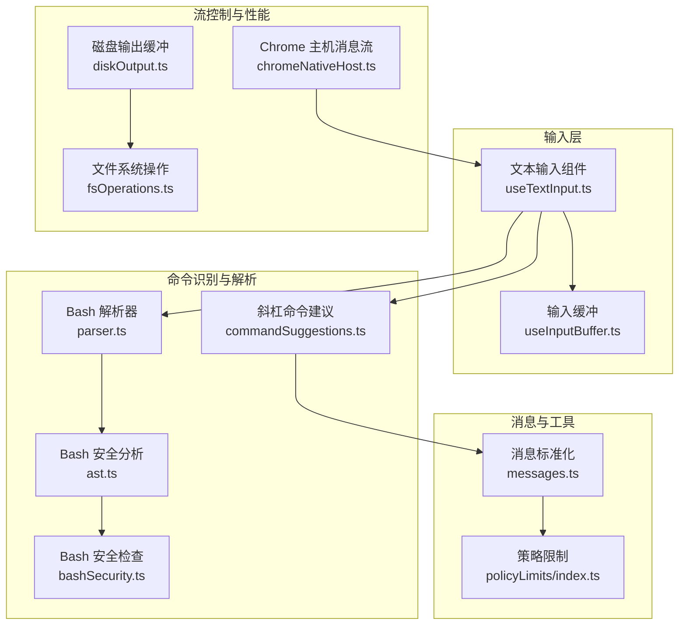
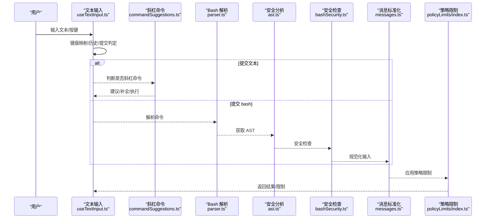
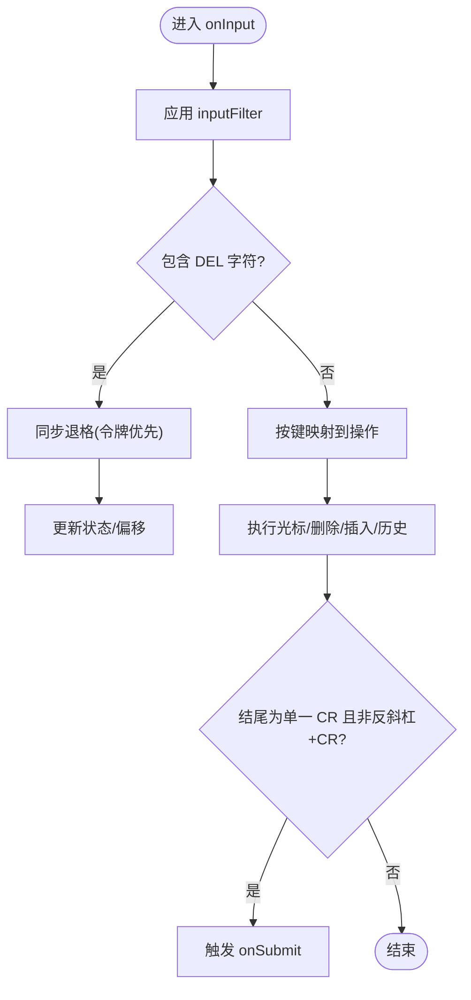
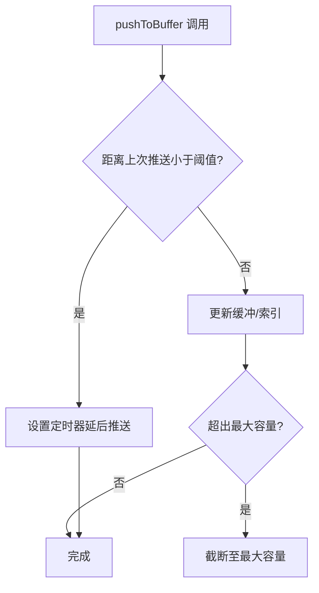
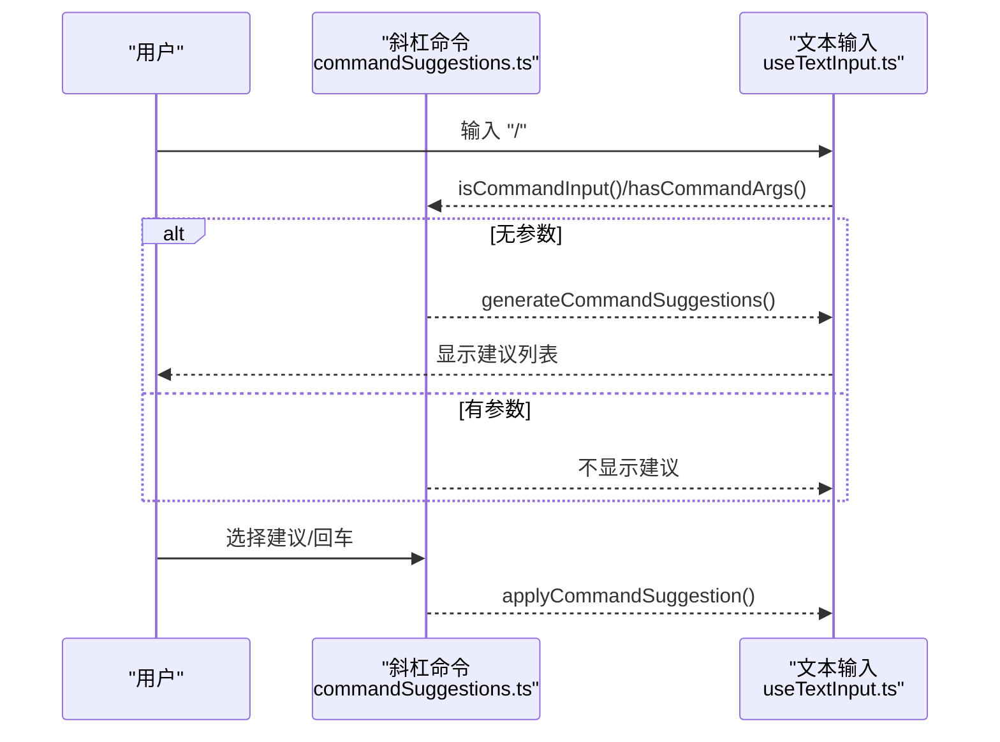
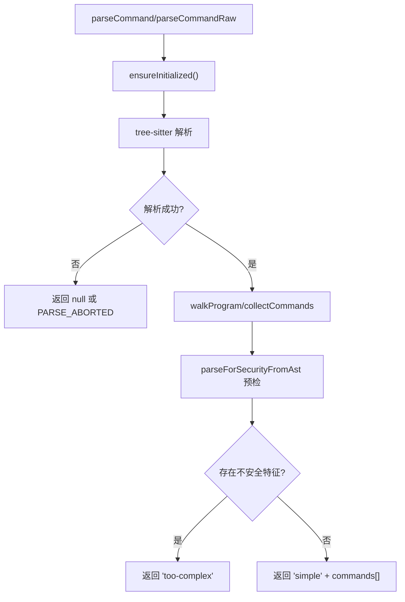
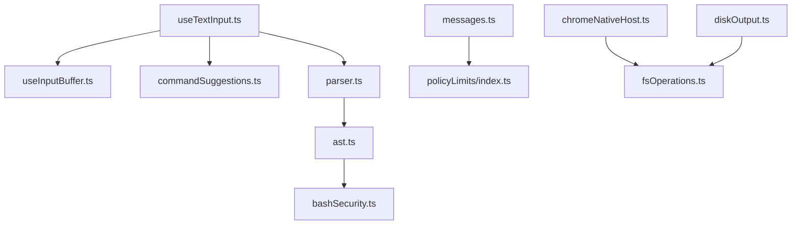

# 进程输入处理

<cite>
**本文引用的文件**
- [useTextInput.ts](file://src/hooks/useTextInput.ts)
- [useInputBuffer.ts](file://src/hooks/useInputBuffer.ts)
- [parser.ts](file://src/utils/bash/parser.ts)
- [ast.ts](file://src/utils/bash/ast.ts)
- [commandSuggestions.ts](file://src/utils/suggestions/commandSuggestions.ts)
- [messages.ts](file://src/utils/messages.ts)
- [bashSecurity.ts](file://src/tools/BashTool/bashSecurity.ts)
- [index.ts](file://src/services/policyLimits/index.ts)
- [chromeNativeHost.ts](file://src/utils/claudeInChrome/chromeNativeHost.ts)
- [diskOutput.ts](file://src/utils/task/diskOutput.ts)
- [fsOperations.ts](file://src/utils/fsOperations.ts)
</cite>

## 目录
1. [简介](#简介)
2. [项目结构](#项目结构)
3. [核心组件](#核心组件)
4. [架构总览](#架构总览)
5. [详细组件分析](#详细组件分析)
6. [依赖关系分析](#依赖关系分析)
7. [性能考量](#性能考量)
8. [故障排查指南](#故障排查指南)
9. [结论](#结论)
10. [附录](#附录)

## 简介
本文件系统性梳理 free-code 的用户输入处理体系，覆盖从原始输入到命令识别与参数提取、斜杠命令处理、文本提示处理、bash 命令处理、输入验证与标准化、输入缓冲与流控制、性能优化以及安全限制等关键环节。文档以循序渐进的方式呈现，既适合开发者深入理解实现细节，也便于非技术读者把握整体流程。

## 项目结构
围绕“输入处理”的关键模块分布如下：
- 文本输入与编辑：useTextInput.ts 提供键盘事件映射、光标移动、历史导航、粘贴/剪切/撤销等能力，并在 Enter 键处触发提交。
- 输入缓冲与撤销：useInputBuffer.ts 提供去抖动、环形缓冲、撤销能力，用于提升交互流畅度与可回溯性。
- 斜杠命令处理：commandSuggestions.ts 负责斜杠命令的识别、补全、建议与执行。
- bash 命令处理：parser.ts 使用 tree-sitter 解析 bash 命令，ast.ts 对 AST 进行安全分析；bashSecurity.ts 执行安全检查策略。
- 消息与工具输入标准化：messages.ts 将模型输出或外部输入进行规范化，确保后续工具调用一致。
- 安全与限制：policyLimits/index.ts 提供策略限制加载与缓存；bashSecurity.ts 与 ast.ts 实施安全策略；chromeNativeHost.ts、diskOutput.ts、fsOperations.ts 展示了输入流控制与磁盘写入优化实践。

图表来源
- [useTextInput.ts:1-530](file://src/hooks/useTextInput.ts#L1-L530)
- [useInputBuffer.ts:1-133](file://src/hooks/useInputBuffer.ts#L1-L133)
- [commandSuggestions.ts:1-568](file://src/utils/suggestions/commandSuggestions.ts#L1-L568)
- [parser.ts:1-231](file://src/utils/bash/parser.ts#L1-L231)
- [ast.ts:1-800](file://src/utils/bash/ast.ts#L1-L800)
- [bashSecurity.ts:974-1018](file://src/tools/BashTool/bashSecurity.ts#L974-L1018)
- [messages.ts:2699-2750](file://src/utils/messages.ts#L2699-L2750)
- [index.ts:50-455](file://src/services/policyLimits/index.ts#L50-L455)
- [chromeNativeHost.ts:487-527](file://src/utils/claudeInChrome/chromeNativeHost.ts#L487-L527)
- [diskOutput.ts:174-205](file://src/utils/task/diskOutput.ts#L174-L205)
- [fsOperations.ts:440-466](file://src/utils/fsOperations.ts#L440-L466)

章节来源
- [useTextInput.ts:1-530](file://src/hooks/useTextInput.ts#L1-L530)
- [useInputBuffer.ts:1-133](file://src/hooks/useInputBuffer.ts#L1-L133)
- [commandSuggestions.ts:1-568](file://src/utils/suggestions/commandSuggestions.ts#L1-L568)
- [parser.ts:1-231](file://src/utils/bash/parser.ts#L1-L231)
- [ast.ts:1-800](file://src/utils/bash/ast.ts#L1-L800)
- [bashSecurity.ts:974-1018](file://src/tools/BashTool/bashSecurity.ts#L974-L1018)
- [messages.ts:2699-2750](file://src/utils/messages.ts#L2699-L2750)
- [index.ts:50-455](file://src/services/policyLimits/index.ts#L50-L455)
- [chromeNativeHost.ts:487-527](file://src/utils/claudeInChrome/chromeNativeHost.ts#L487-L527)
- [diskOutput.ts:174-205](file://src/utils/task/diskOutput.ts#L174-L205)
- [fsOperations.ts:440-466](file://src/utils/fsOperations.ts#L440-L466)

## 核心组件
- 文本输入与编辑（useTextInput）
  - 键盘映射：支持 Ctrl/Meta 组合键、方向键、Home/End、PageUp/PageDown、Enter 等，区分多行模式与单行模式。
  - 光标与历史：提供上下方向键的历史导航、wrapped line 移动、逻辑行移动；支持 ESC 双击清空输入并保存历史。
  - 提交逻辑：处理回车键（含反斜杠续行标记）、Shift/Meta/Apple Terminal 特殊组合键插入换行；对 SSH/Coalesced Enter 场景进行兼容处理。
  - 输入过滤：支持 inputFilter 回调，DEL 字符过滤与同步退格处理，避免 SSH/tmux 干扰。
- 输入缓冲（useInputBuffer）
  - 去抖动：快速变化时延迟推送，减少渲染与状态更新压力。
  - 环形缓冲：记录最近变更，支持撤销与重做；限制最大缓冲大小，自动截断。
  - 状态管理：维护当前索引、时间戳、挂起推送任务，保证一致性。
- 斜杠命令处理（commandSuggestions）
  - 命令识别：支持起始位置与中间位置的斜杠命令识别，正则匹配避免路径误判。
  - 建议生成：基于 Fuse 的模糊匹配，优先级考虑精确名、别名前缀、描述匹配与使用频率。
  - 参数检测：判断命令是否带参、尾随空格等，决定是否展示建议与是否立即执行。
- bash 命令处理（parser/ast）
  - 解析：tree-sitter 初始化与加载，超长命令保护，失败/中止场景区分。
  - 安全分析：AST 遍历，允许白名单节点类型，拒绝未知/危险节点；变量作用域、占位符替换、重定向提取。
  - 安全检查：针对控制字符、Unicode 空白、反斜杠空格、zsh 扩展、花括号与引号组合等进行预检，必要时标记为“过于复杂”。
- 消息与工具输入标准化（messages）
  - 工具输入规范化：按工具类型调用 normalizeToolInput，失败保留原输入并记录错误。
  - 内容块处理：对不同内容块类型进行差异化处理，保持提示缓存一致性。
- 安全与限制（policyLimits）
  - 策略加载：本地缓存 + 重试 + 轮询，失败开路（无缓存时返回 null）。
  - 会话缓存：模块级 sessionCache，避免重复网络请求。
- 流控制与性能（chromeNativeHost/diskOutput/fsOperations）
  - 消息帧：固定长度前缀 + UTF-8 消息体，缓冲区拼接与分片读取。
  - 磁盘写入：队列化缓冲、批量写入、避免内存驻留过久。
  - 文件系统：同步读取包装，慢操作日志埋点。

章节来源
- [useTextInput.ts:1-530](file://src/hooks/useTextInput.ts#L1-L530)
- [useInputBuffer.ts:1-133](file://src/hooks/useInputBuffer.ts#L1-L133)
- [commandSuggestions.ts:1-568](file://src/utils/suggestions/commandSuggestions.ts#L1-L568)
- [parser.ts:1-231](file://src/utils/bash/parser.ts#L1-L231)
- [ast.ts:1-800](file://src/utils/bash/ast.ts#L1-L800)
- [messages.ts:2699-2750](file://src/utils/messages.ts#L2699-L2750)
- [index.ts:50-455](file://src/services/policyLimits/index.ts#L50-L455)
- [chromeNativeHost.ts:487-527](file://src/utils/claudeInChrome/chromeNativeHost.ts#L487-L527)
- [diskOutput.ts:174-205](file://src/utils/task/diskOutput.ts#L174-L205)
- [fsOperations.ts:440-466](file://src/utils/fsOperations.ts#L440-L466)

## 架构总览
下图展示了从用户输入到命令识别、解析与执行的关键路径，以及安全与限制的介入点。

图表来源
- [useTextInput.ts:247-267](file://src/hooks/useTextInput.ts#L247-L267)
- [commandSuggestions.ts:292-380](file://src/utils/suggestions/commandSuggestions.ts#L292-L380)
- [parser.ts:56-84](file://src/utils/bash/parser.ts#L56-L84)
- [ast.ts:381-460](file://src/utils/bash/ast.ts#L381-L460)
- [bashSecurity.ts:974-1018](file://src/tools/BashTool/bashSecurity.ts#L974-L1018)
- [messages.ts:2699-2750](file://src/utils/messages.ts#L2699-L2750)
- [index.ts:432-455](file://src/services/policyLimits/index.ts#L432-L455)

## 详细组件分析

### 文本输入与编辑（useTextInput）
- 关键职责
  - 键盘事件映射：将按键映射到光标移动、删除、剪切/粘贴、历史导航等操作。
  - 多行与单行：根据 multiline 与修饰键组合决定换行行为；反斜杠续行特殊处理。
  - 提交触发：Enter 键触发 onSubmit；对 SSH/Coalesced Enter 场景进行兼容。
  - 输入过滤：DEL 字符过滤、ANSI 去除、回车统一换行、输入模式字符插入。
- 重要流程
  - Enter 键处理：区分反斜杠续行、Shift/Meta/Apple Terminal 特殊组合键插入换行；否则提交。
  - DEL 过滤：在 SSH/tmux 环境中，DEL 与 Backspace 事件可能同时到达，需同步退格处理。
  - 历史导航：wrapped line 上下移动优先，不满足时尝试逻辑行移动，仍不满足则触发历史回调。
- 性能与体验
  - 光标渲染与视口计算，避免大文本时的重排。
  - Ghost 文本与内联提示，减少闪烁与跳变。

图表来源
- [useTextInput.ts:431-501](file://src/hooks/useTextInput.ts#L431-L501)

章节来源
- [useTextInput.ts:1-530](file://src/hooks/useTextInput.ts#L1-L530)

### 输入缓冲（useInputBuffer）
- 关键职责
  - 去抖动：在短时间内多次变更合并，降低渲染与状态更新频率。
  - 环形缓冲：记录最近变更，支持撤销与重做；限制最大容量并自动截断。
  - 状态一致性：维护当前索引、时间戳、挂起推送任务，避免竞态。
- 适用场景
  - 快速打字、连续粘贴、自动补全频繁触发时的性能优化。
  - 支持撤销链式操作，提升可回溯性。

图表来源
- [useInputBuffer.ts:36-96](file://src/hooks/useInputBuffer.ts#L36-L96)

章节来源
- [useInputBuffer.ts:1-133](file://src/hooks/useInputBuffer.ts#L1-L133)

### 斜杠命令处理（commandSuggestions）
- 关键职责
  - 命令识别：支持起始位置与中间位置斜杠命令识别，避免路径误判。
  - 建议生成：基于 Fuse 的模糊匹配，优先级考虑精确名、别名前缀、描述匹配与使用频率。
  - 参数检测：判断命令是否带参、尾随空格等，决定是否展示建议与是否立即执行。
- 重要流程
  - 中间位置斜杠命令：从光标前向后查找最后一个“空白+斜杠”，提取命令片段。
  - 建议排序：精确名 > 精确别名 > 前缀名 > 前缀别名 > 描述模糊匹配，同类型按 Fuse 分数与使用频率排序。
  - 应用建议：格式化命令输入、设置光标偏移、按需立即提交。

图表来源
- [commandSuggestions.ts:198-216](file://src/utils/suggestions/commandSuggestions.ts#L198-L216)
- [commandSuggestions.ts:292-498](file://src/utils/suggestions/commandSuggestions.ts#L292-L498)
- [commandSuggestions.ts:503-539](file://src/utils/suggestions/commandSuggestions.ts#L503-L539)

章节来源
- [commandSuggestions.ts:1-568](file://src/utils/suggestions/commandSuggestions.ts#L1-L568)

### bash 命令处理（parser/ast）
- 关键职责
  - 解析：tree-sitter 初始化与加载，超长命令保护，失败/中止场景区分。
  - 安全分析：AST 遍历，允许白名单节点类型，拒绝未知/危险节点；变量作用域、占位符替换、重定向提取。
  - 安全检查：针对控制字符、Unicode 空白、反斜杠空格、zsh 扩展、花括号与引号组合等进行预检，必要时标记为“过于复杂”。
- 重要流程
  - 解析阶段：feature 开关控制加载，超长保护，异常捕获与失败返回。
  - 安全分析：walkProgram → collectCommands → walkCommand，严格白名单与作用域隔离。
  - 安全检查：parseForSecurityFromAst 预检，遇到不安全特征直接返回“过于复杂”。

图表来源
- [parser.ts:56-136](file://src/utils/bash/parser.ts#L56-L136)
- [ast.ts:381-460](file://src/utils/bash/ast.ts#L381-L460)
- [ast.ts:400-460](file://src/utils/bash/ast.ts#L400-L460)

章节来源
- [parser.ts:1-231](file://src/utils/bash/parser.ts#L1-L231)
- [ast.ts:1-800](file://src/utils/bash/ast.ts#L1-L800)
- [bashSecurity.ts:974-1018](file://src/tools/BashTool/bashSecurity.ts#L974-L1018)

### 消息与工具输入标准化（messages）
- 关键职责
  - 工具输入规范化：按工具类型调用 normalizeToolInput，失败保留原输入并记录错误。
  - 内容块处理：对不同内容块类型进行差异化处理，保持提示缓存一致性。
- 适用场景
  - 模型输出或外部输入进入工具调用前的统一入口，确保下游工具稳定运行。

章节来源
- [messages.ts:2699-2750](file://src/utils/messages.ts#L2699-L2750)

### 安全与限制（policyLimits）
- 关键职责
  - 策略加载：本地缓存 + 重试 + 轮询，失败开路（无缓存时返回 null）。
  - 会话缓存：模块级 sessionCache，避免重复网络请求。
- 适用场景
  - 在命令执行前评估策略限制，决定是否放行或提示用户。

章节来源
- [index.ts:50-455](file://src/services/policyLimits/index.ts#L50-L455)

### 流控制与性能（chromeNativeHost/diskOutput/fsOperations）
- 关键职责
  - 消息帧：固定长度前缀 + UTF-8 消息体，缓冲区拼接与分片读取。
  - 磁盘写入：队列化缓冲、批量写入、避免内存驻留过久。
  - 文件系统：同步读取包装，慢操作日志埋点。
- 适用场景
  - 大数据流的稳定接收与持久化，避免内存峰值与阻塞。

章节来源
- [chromeNativeHost.ts:487-527](file://src/utils/claudeInChrome/chromeNativeHost.ts#L487-L527)
- [diskOutput.ts:174-205](file://src/utils/task/diskOutput.ts#L174-L205)
- [fsOperations.ts:440-466](file://src/utils/fsOperations.ts#L440-L466)

## 依赖关系分析
- 组件耦合
  - useTextInput 与 useInputBuffer：输入层与缓冲层松耦合，通过回调与状态共享实现解耦。
  - commandSuggestions 与 useTextInput：建议生成与输入处理解耦，通过输入字符串与光标偏移交互。
  - parser/ast 与 bashSecurity：解析与安全分析强关联，安全检查依赖解析结果。
  - messages 与 policyLimits：消息标准化与策略限制独立，通过上层调度协调。
- 外部依赖
  - tree-sitter：bash 解析与安全分析的基础。
  - Fuse：斜杠命令建议的模糊匹配引擎。
  - Chrome Native Host：跨进程消息帧协议。
  - 文件系统：磁盘写入与读取的底层抽象。

图表来源
- [useTextInput.ts:1-530](file://src/hooks/useTextInput.ts#L1-L530)
- [useInputBuffer.ts:1-133](file://src/hooks/useInputBuffer.ts#L1-L133)
- [commandSuggestions.ts:1-568](file://src/utils/suggestions/commandSuggestions.ts#L1-L568)
- [parser.ts:1-231](file://src/utils/bash/parser.ts#L1-L231)
- [ast.ts:1-800](file://src/utils/bash/ast.ts#L1-L800)
- [bashSecurity.ts:974-1018](file://src/tools/BashTool/bashSecurity.ts#L974-L1018)
- [messages.ts:2699-2750](file://src/utils/messages.ts#L2699-L2750)
- [index.ts:50-455](file://src/services/policyLimits/index.ts#L50-L455)
- [chromeNativeHost.ts:487-527](file://src/utils/claudeInChrome/chromeNativeHost.ts#L487-L527)
- [diskOutput.ts:174-205](file://src/utils/task/diskOutput.ts#L174-L205)
- [fsOperations.ts:440-466](file://src/utils/fsOperations.ts#L440-L466)

## 性能考量
- 输入层
  - useTextInput：ANSI 去除、回车统一、DEL 同步退格，减少无效渲染与状态抖动。
  - useInputBuffer：去抖动与环形缓冲，显著降低高频输入的渲染压力。
- 解析与安全
  - tree-sitter 初始化与 feature 控制，避免不必要的模块加载。
  - 超长命令保护与异常捕获，防止解析器资源耗尽。
  - 安全分析采用白名单与作用域隔离，避免深度遍历带来的复杂度膨胀。
- I/O 与流控
  - 消息帧协议：固定长度前缀 + UTF-8，避免粘包与半包问题。
  - 磁盘写入：队列化缓冲、批量写入、及时释放内存，避免内存峰值。
  - 文件系统读取：同步包装与慢操作日志，便于定位性能瓶颈。

[本节为通用性能指导，无需特定文件引用]

## 故障排查指南
- 输入无法提交
  - 检查 Enter 键处理逻辑与修饰键组合，确认是否被当作换行而非提交。
  - 关注 SSH/Coalesced Enter 场景，确保仅单一 CR 结尾才触发提交。
- 斜杠命令不生效
  - 确认输入位置与正则匹配规则，避免路径误判。
  - 检查是否有参数导致建议不显示（尾随空格或已包含参数）。
- bash 命令被拒绝
  - 查看安全分析结果，是否存在控制字符、Unicode 空白、反斜杠空格、zsh 扩展等不安全特征。
  - 若解析器加载失败或中止，确认 feature 开关与超长保护设置。
- 输入缓冲异常
  - 检查去抖动阈值与最大容量配置，避免过短阈值导致频繁延迟或过长阈值导致响应迟滞。
  - 确认撤销链索引与当前索引一致性，避免越界访问。
- 流控制问题
  - 消息帧长度与缓冲区拼接逻辑，确保完整消息后再消费。
  - 磁盘写入队列与批量写入时机，避免内存驻留过久。

章节来源
- [useTextInput.ts:431-501](file://src/hooks/useTextInput.ts#L431-L501)
- [commandSuggestions.ts:198-216](file://src/utils/suggestions/commandSuggestions.ts#L198-L216)
- [parser.ts:56-136](file://src/utils/bash/parser.ts#L56-L136)
- [ast.ts:400-460](file://src/utils/bash/ast.ts#L400-L460)
- [useInputBuffer.ts:36-96](file://src/hooks/useInputBuffer.ts#L36-L96)
- [chromeNativeHost.ts:487-527](file://src/utils/claudeInChrome/chromeNativeHost.ts#L487-L527)
- [diskOutput.ts:174-205](file://src/utils/task/diskOutput.ts#L174-L205)

## 结论
free-code 的输入处理体系以“输入层—命令识别—解析与安全—标准化—限制与流控”为主线，形成高可用、可扩展、可审计的闭环。通过去抖动与缓冲、tree-sitter 解析与白名单安全分析、策略限制与流控制等手段，在保证安全性的同时兼顾性能与用户体验。对于扩展与自定义，建议遵循现有接口契约与安全边界，确保新增处理器与自定义命令在统一的输入与安全框架内运行。

[本节为总结性内容，无需特定文件引用]

## 附录
- 输入验证与输入转换
  - 输入过滤：DEL 字符过滤、ANSI 去除、回车统一换行。
  - 工具输入规范化：按工具类型进行参数校验与转换，失败保留原输入。
- 输入安全检查与限制机制
  - bash 安全检查：控制字符、Unicode 空白、反斜杠空格、zsh 扩展、花括号与引号组合等预检。
  - 策略限制：本地缓存 + 重试 + 轮询，失败开路策略。
- 输入处理扩展点与自定义处理器开发
  - 输入过滤回调：inputFilter，支持在输入进入编辑器前进行二次过滤。
  - 命令建议扩展：通过命令注册与 Fuse 索引，新增命令与别名。
  - bash 安全策略：在安全分析与安全检查中增加新的节点类型与规则。
- 输入缓冲与输入流控制
  - 去抖动与环形缓冲：useInputBuffer 提供撤销链与容量限制。
  - 消息帧协议：chromeNativeHost 展示了稳定的跨进程消息收发。
  - 磁盘写入优化：diskOutput 与 fsOperations 提供队列化与批量写入实践。

[本节为概览性内容，无需特定文件引用]