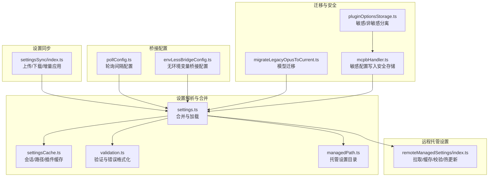
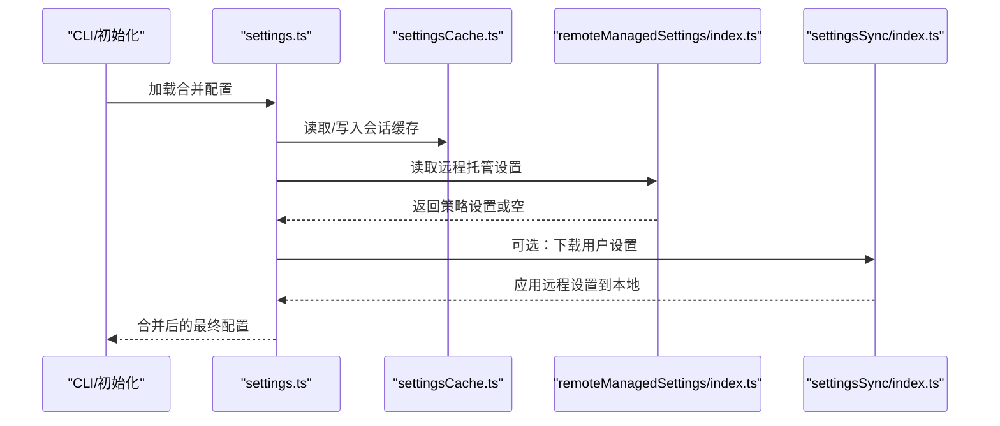
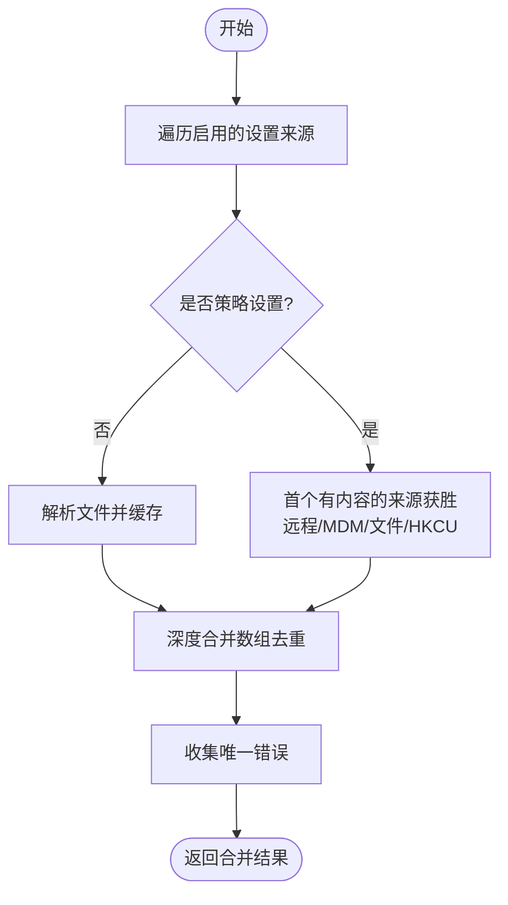
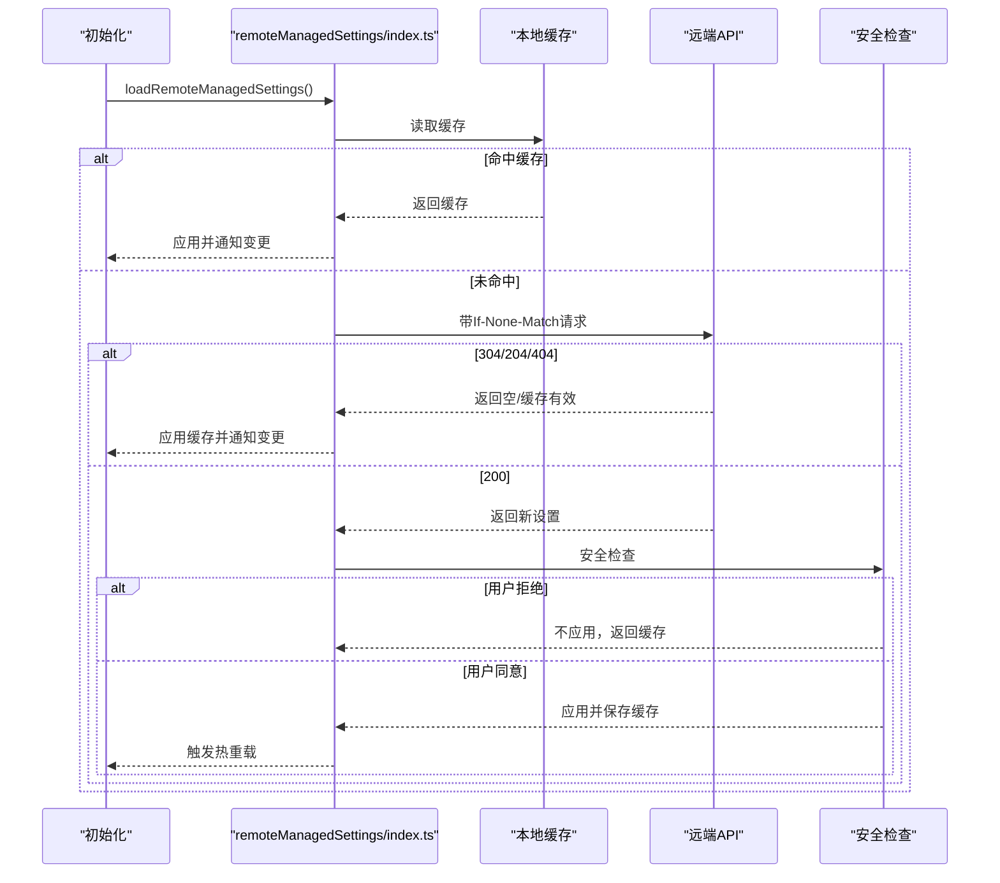
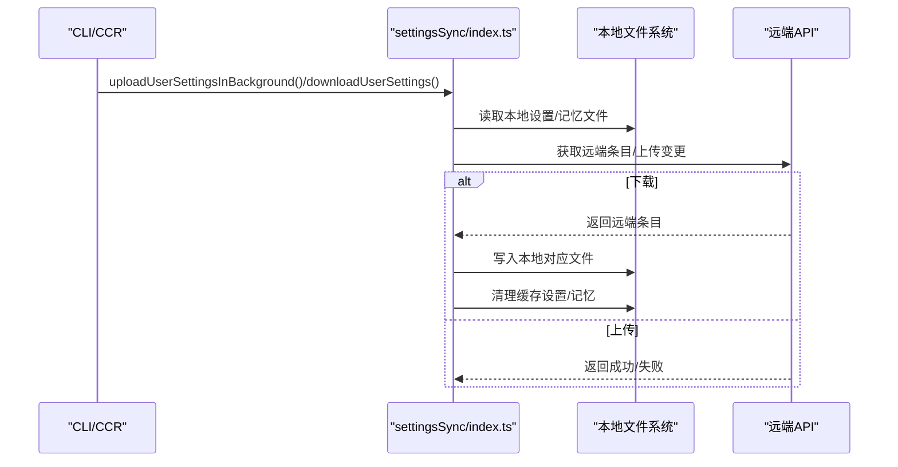
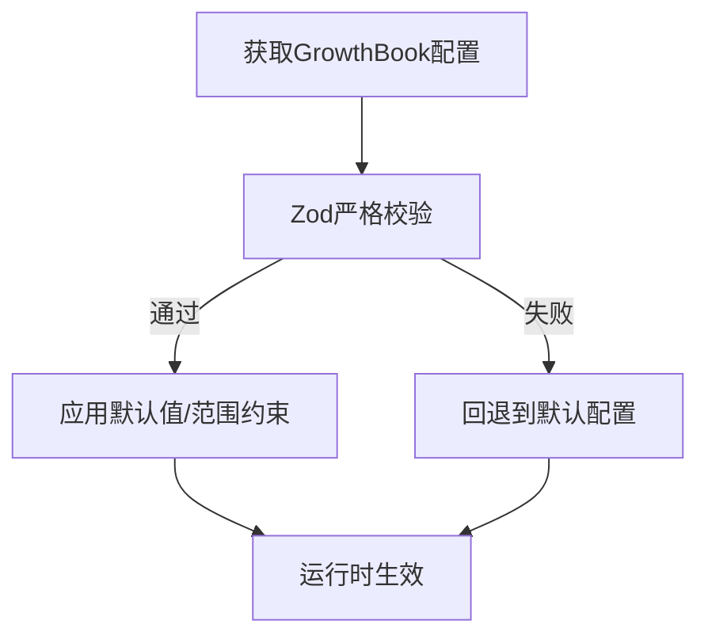
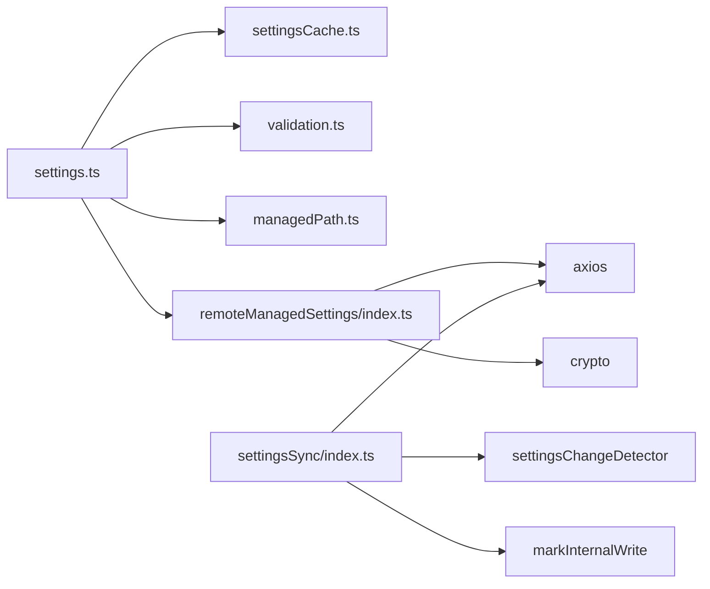

# 配置管理

<cite>
**本文引用的文件**
- [settings.ts](file://src/utils/settings/settings.ts)
- [settingsCache.ts](file://src/utils/settings/settingsCache.ts)
- [validation.ts](file://src/utils/settings/validation.ts)
- [managedPath.ts](file://src/utils/settings/managedPath.ts)
- [index.ts（远程托管设置）](file://src/services/remoteManagedSettings/index.ts)
- [index.ts（设置同步）](file://src/services/settingsSync/index.ts)
- [pollConfig.ts](file://src/bridge/pollConfig.ts)
- [envLessBridgeConfig.ts](file://src/bridge/envLessBridgeConfig.ts)
- [migrateLegacyOpusToCurrent.ts](file://src/migrations/migrateLegacyOpusToCurrent.ts)
- [mcpbHandler.ts](file://src/utils/plugins/mcpbHandler.ts)
- [pluginOptionsStorage.ts](file://src/utils/plugins/pluginOptionsStorage.ts)
</cite>

## 目录
1. [简介](#简介)
2. [项目结构](#项目结构)
3. [核心组件](#核心组件)
4. [架构总览](#架构总览)
5. [详细组件分析](#详细组件分析)
6. [依赖关系分析](#依赖关系分析)
7. [性能考量](#性能考量)
8. [故障排除指南](#故障排除指南)
9. [结论](#结论)
10. [附录](#附录)

## 简介
本文件系统性梳理 free-code 的配置管理系统，覆盖配置文件加载机制、环境变量处理与动态更新、配置验证与默认值、配置缓存策略、配置分类管理、配置同步与迁移、扩展与自定义配置项开发指南、安全存储与敏感信息保护，以及故障排除与性能优化建议。目标是帮助开发者与运维人员在不深入源码的前提下，高效理解并正确使用配置体系。

## 项目结构
配置管理相关代码主要分布在以下模块：
- 设置解析与合并：src/utils/settings/*
- 远程托管设置服务：src/services/remoteManagedSettings/*
- 设置同步服务：src/services/settingsSync/*
- 桥接轮询与桥接配置：src/bridge/pollConfig.ts、src/bridge/envLessBridgeConfig.ts
- 迁移与安全存储：src/migrations/*、src/utils/plugins/*

**图表来源**
- [settings.ts:1-1016](file://src/utils/settings/settings.ts#L1-L1016)
- [settingsCache.ts:1-81](file://src/utils/settings/settingsCache.ts#L1-L81)
- [validation.ts:1-266](file://src/utils/settings/validation.ts#L1-L266)
- [managedPath.ts:1-35](file://src/utils/settings/managedPath.ts#L1-L35)
- [index.ts（远程托管设置）:1-639](file://src/services/remoteManagedSettings/index.ts#L1-L639)
- [index.ts（设置同步）:1-582](file://src/services/settingsSync/index.ts#L1-L582)
- [pollConfig.ts:1-111](file://src/bridge/pollConfig.ts#L1-L111)
- [envLessBridgeConfig.ts:1-166](file://src/bridge/envLessBridgeConfig.ts#L1-L166)
- [migrateLegacyOpusToCurrent.ts:1-58](file://src/migrations/migrateLegacyOpusToCurrent.ts#L1-L58)
- [mcpbHandler.ts:211-276](file://src/utils/plugins/mcpbHandler.ts#L211-L276)
- [pluginOptionsStorage.ts:98-110](file://src/utils/plugins/pluginOptionsStorage.ts#L98-L110)

**章节来源**
- [settings.ts:1-1016](file://src/utils/settings/settings.ts#L1-L1016)
- [settingsCache.ts:1-81](file://src/utils/settings/settingsCache.ts#L1-L81)
- [validation.ts:1-266](file://src/utils/settings/validation.ts#L1-L266)
- [managedPath.ts:1-35](file://src/utils/settings/managedPath.ts#L1-L35)
- [index.ts（远程托管设置）:1-639](file://src/services/remoteManagedSettings/index.ts#L1-L639)
- [index.ts（设置同步）:1-582](file://src/services/settingsSync/index.ts#L1-L582)
- [pollConfig.ts:1-111](file://src/bridge/pollConfig.ts#L1-L111)
- [envLessBridgeConfig.ts:1-166](file://src/bridge/envLessBridgeConfig.ts#L1-L166)
- [migrateLegacyOpusToCurrent.ts:1-58](file://src/migrations/migrateLegacyOpusToCurrent.ts#L1-L58)
- [mcpbHandler.ts:211-276](file://src/utils/plugins/mcpbHandler.ts#L211-L276)
- [pluginOptionsStorage.ts:98-110](file://src/utils/plugins/pluginOptionsStorage.ts#L98-L110)

## 核心组件
- 设置解析与合并：负责从多源读取、解析、合并配置，并提供缓存与错误收集。
- 远程托管设置：支持企业用户通过 API 获取托管配置，带缓存、ETag 校验、失败开路与后台轮询。
- 设置同步：支持用户设置与记忆文件在不同环境间上传/下载与增量应用。
- 桥接配置：提供桥接轮询间隔与无环境变量桥接的参数配置，含严格模式校验与默认值。
- 迁移与安全：提供模型迁移示例与敏感配置写入安全存储的机制。
- 验证与默认值：统一的 Zod 校验、错误格式化、默认值注入与数组合并策略。

**章节来源**
- [settings.ts:641-800](file://src/utils/settings/settings.ts#L641-L800)
- [index.ts（远程托管设置）:414-555](file://src/services/remoteManagedSettings/index.ts#L414-L555)
- [index.ts（设置同步）:157-202](file://src/services/settingsSync/index.ts#L157-L202)
- [pollConfig.ts:28-110](file://src/bridge/pollConfig.ts#L28-L110)
- [envLessBridgeConfig.ts:62-137](file://src/bridge/envLessBridgeConfig.ts#L62-L137)
- [migrateLegacyOpusToCurrent.ts:29-57](file://src/migrations/migrateLegacyOpusToCurrent.ts#L29-L57)
- [validation.ts:97-173](file://src/utils/settings/validation.ts#L97-L173)

## 架构总览
配置系统采用“多源合并 + 缓存 + 动态更新”的架构：
- 多源优先级：插件基础层 → 用户设置 → 项目设置 → 本地设置 → 策略设置（远程/MDM/文件/HKCU） → 标记位设置。
- 缓存策略：会话级合并缓存、按路径解析缓存、插件基础层缓存；写入后统一失效。
- 动态更新：远程托管设置支持后台轮询与热重载；设置同步支持增量上传/下载与应用。
- 安全与验证：严格 Zod 校验、默认值注入、敏感信息分离存储、权限规则过滤。

**图表来源**
- [settings.ts:641-800](file://src/utils/settings/settings.ts#L641-L800)
- [settingsCache.ts:55-59](file://src/utils/settings/settingsCache.ts#L55-L59)
- [index.ts（远程托管设置）:514-555](file://src/services/remoteManagedSettings/index.ts#L514-L555)
- [index.ts（设置同步）:157-202](file://src/services/settingsSync/index.ts#L157-L202)

## 详细组件分析

### 组件一：设置解析与合并（settings.ts）
- 文件加载与合并
  - 支持托管设置文件与 drop-in 目录合并，遵循 systemd/sudoers 的 drop-in 约定，先基线再覆盖。
  - 支持用户设置、项目设置、本地设置、标记位设置与策略设置（远程/MDM/文件/HKCU）。
  - 数组字段采用去重合并策略，对象字段深度合并。
- 解析与缓存
  - 对单文件解析结果进行缓存，避免重复 IO 与解析。
  - 会话级合并缓存与按源缓存，写入后统一失效。
- 错误处理
  - 文件系统错误与 JSON 解析错误分别处理；权限规则中的无效条目会被过滤并给出警告。
- 路径与来源
  - 提供各来源的绝对路径计算逻辑，区分用户、项目、本地、策略与标记位设置。

**图表来源**
- [settings.ts:641-796](file://src/utils/settings/settings.ts#L641-L796)
- [settingsCache.ts:55-59](file://src/utils/settings/settingsCache.ts#L55-L59)

**章节来源**
- [settings.ts:62-121](file://src/utils/settings/settings.ts#L62-L121)
- [settings.ts:309-368](file://src/utils/settings/settings.ts#L309-L368)
- [settings.ts:641-796](file://src/utils/settings/settings.ts#L641-L796)
- [settingsCache.ts:1-81](file://src/utils/settings/settingsCache.ts#L1-L81)

### 组件二：远程托管设置（remoteManagedSettings/index.ts）
- 加载流程
  - 初始化时尝试读取磁盘缓存，若可用则立即应用并通知变更。
  - 发起网络请求，带 ETag 校验与指数退避重试。
  - 成功后进行结构校验与安全检查，必要时弹窗确认，然后写入缓存并触发热重载。
- 缓存与校验
  - 使用 SHA256 校验和匹配服务器端排序后的 JSON 字符串，确保一致性。
  - 失败开路：网络异常时回退到本地缓存；无缓存则继续运行。
- 后台轮询
  - 每小时轮询一次，检测变化后触发热重载。
- 清理与刷新
  - 支持清理缓存、停止轮询、刷新认证状态后重新加载。

**图表来源**
- [index.ts（远程托管设置）:514-555](file://src/services/remoteManagedSettings/index.ts#L514-L555)
- [index.ts（远程托管设置）:414-503](file://src/services/remoteManagedSettings/index.ts#L414-L503)

**章节来源**
- [index.ts（远程托管设置）:1-639](file://src/services/remoteManagedSettings/index.ts#L1-L639)

### 组件三：设置同步（settingsSync/index.ts）
- 上传（交互式 CLI）
  - 仅在交互模式且满足特性开关与 OAuth 条件时执行。
  - 从本地文件构建条目，与远端已存条目对比，仅上传变更。
- 下载（CCR 模式）
  - 在启动阶段或安装插件前触发，支持强制重新下载以获取最新变更。
  - 将远端条目应用到本地对应文件，限制单文件大小，写入时标记内部写入抑制误报。
- 错误处理
  - 失败开路，不影响启动；记录诊断日志与事件。

**图表来源**
- [index.ts（设置同步）:60-111](file://src/services/settingsSync/index.ts#L60-L111)
- [index.ts（设置同步）:157-202](file://src/services/settingsSync/index.ts#L157-L202)
- [index.ts（设置同步）:488-581](file://src/services/settingsSync/index.ts#L488-L581)

**章节来源**
- [index.ts（设置同步）:1-582](file://src/services/settingsSync/index.ts#L1-L582)

### 组件四：桥接配置（pollConfig.ts 与 envLessBridgeConfig.ts）
- 轮询间隔配置
  - 通过 GrowthBook 获取配置，带严格的最小值与互斥校验，防止误配置导致高频轮询。
  - 默认值来自独立常量文件，确保在缺失或异常时有稳定回退。
- 无环境变量桥接配置
  - 包含重试、超时、心跳、连接超时等参数，均带有上下界与默认值，保证稳定性与安全性。
  - 版本下限检查，避免过旧客户端接入。

**图表来源**
- [pollConfig.ts:28-110](file://src/bridge/pollConfig.ts#L28-L110)
- [envLessBridgeConfig.ts:62-137](file://src/bridge/envLessBridgeConfig.ts#L62-L137)

**章节来源**
- [pollConfig.ts:1-111](file://src/bridge/pollConfig.ts#L1-L111)
- [envLessBridgeConfig.ts:1-166](file://src/bridge/envLessBridgeConfig.ts#L1-L166)

### 组件五：验证、默认值与数组合并（validation.ts 与 settings.ts）
- 验证
  - 使用 Zod 对设置结构进行严格校验，错误格式化为可读消息，包含建议与文档链接。
  - 权限规则在进入主校验前被过滤，避免单条规则污染整份设置。
- 默认值
  - 多处配置使用 .default 注入默认值，确保即使部分字段缺失也能正常工作。
- 数组合并
  - 自定义合并器对数组进行去重拼接，对象进行深度合并，保证策略设置的覆盖语义。

**章节来源**
- [validation.ts:97-173](file://src/utils/settings/validation.ts#L97-L173)
- [validation.ts:224-265](file://src/utils/settings/validation.ts#L224-L265)
- [settings.ts:538-547](file://src/utils/settings/settings.ts#L538-L547)

### 组件六：托管设置目录与文件（managedPath.ts 与 settings.ts）
- 托管设置目录
  - 平台相关路径（macOS/windows/Linux），支持测试覆盖。
- 文件与 drop-in
  - managed-settings.json 为基础，managed-settings.d/*.json 为覆盖片段，按字母序合并。

**章节来源**
- [managedPath.ts:1-35](file://src/utils/settings/managedPath.ts#L1-L35)
- [settings.ts:62-121](file://src/utils/settings/settings.ts#L62-L121)

### 组件七：迁移与安全存储（migrateLegacyOpusToCurrent.ts 与 mcpbHandler.ts、pluginOptionsStorage.ts）
- 迁移
  - 示例迁移：将旧版 Opus 模型别名迁移到当前版本，仅影响用户设置，保持幂等。
- 安全存储
  - 将敏感选项（如密钥）写入安全存储，非敏感选项写入设置文件；保存时对另一侧进行清理，避免残留明文。

**章节来源**
- [migrateLegacyOpusToCurrent.ts:29-57](file://src/migrations/migrateLegacyOpusToCurrent.ts#L29-L57)
- [mcpbHandler.ts:211-276](file://src/utils/plugins/mcpbHandler.ts#L211-L276)
- [pluginOptionsStorage.ts:98-110](file://src/utils/plugins/pluginOptionsStorage.ts#L98-L110)

## 依赖关系分析
- settings.ts 依赖：
  - settingsCache.ts（缓存）
  - validation.ts（校验与错误格式化）
  - managedPath.ts（托管目录）
  - remoteManagedSettings/index.ts（策略设置来源）
- remoteManagedSettings/index.ts 依赖：
  - axios（HTTP 请求）
  - crypto（校验和）
  - settingsChangeDetector（热重载）
  - syncCacheState/syncCache（缓存与轮询）
- settingsSync/index.ts 依赖：
  - axios（HTTP 请求）
  - settingsChangeDetector（应用后重置缓存）
  - markInternalWrite（抑制变更检测）

**图表来源**
- [settings.ts:1-54](file://src/utils/settings/settings.ts#L1-L54)
- [settingsCache.ts:1-81](file://src/utils/settings/settingsCache.ts#L1-L81)
- [validation.ts:1-10](file://src/utils/settings/validation.ts#L1-L10)
- [managedPath.ts:1-35](file://src/utils/settings/managedPath.ts#L1-L35)
- [index.ts（远程托管设置）:15-49](file://src/services/remoteManagedSettings/index.ts#L15-L49)
- [index.ts（设置同步）:12-49](file://src/services/settingsSync/index.ts#L12-L49)

**章节来源**
- [settings.ts:1-54](file://src/utils/settings/settings.ts#L1-L54)
- [index.ts（远程托管设置）:15-49](file://src/services/remoteManagedSettings/index.ts#L15-L49)
- [index.ts（设置同步）:12-49](file://src/services/settingsSync/index.ts#L12-L49)

## 性能考量
- 缓存策略
  - 单文件解析缓存与会话级合并缓存显著降低重复 IO 与解析成本。
  - 写入后统一失效，避免脏读。
- 网络与重试
  - 远程托管设置与设置同步均采用指数退避与超时控制，减少抖动与资源占用。
- 合并策略
  - 数组去重合并避免冗余，降低后续处理复杂度。
- 后台轮询
  - 1 小时轮询周期适中，兼顾及时性与资源消耗。

[本节为通用性能讨论，无需具体文件分析]

## 故障排除指南
- 配置加载失败
  - 检查文件是否存在、JSON 是否合法、权限规则是否有效。
  - 查看诊断日志中的错误计数与来源数量，定位问题文件。
- 远程托管设置未生效
  - 确认用户具备资格；查看网络/鉴权错误；关注 304/204/404 的响应语义。
  - 若出现安全检查提示，确认用户选择与缓存状态。
- 设置同步失败
  - 检查 OAuth 令牌与作用域；关注单文件大小限制；确认写入是否被标记为内部写入。
- 桥接配置异常
  - 校验 GrowthBook 配置是否满足最小值与互斥条件；必要时回退到默认值。

**章节来源**
- [settings.ts:641-796](file://src/utils/settings/settings.ts#L641-L796)
- [index.ts（远程托管设置）:209-361](file://src/services/remoteManagedSettings/index.ts#L209-L361)
- [index.ts（设置同步）:247-345](file://src/services/settingsSync/index.ts#L247-L345)

## 结论
该配置管理系统通过“多源合并 + 严格验证 + 缓存 + 动态更新”的设计，在保证安全性与稳定性的同时，提供了灵活的企业级配置能力。远程托管设置与设置同步进一步增强了跨环境一致性与可维护性。建议在扩展新配置项时遵循现有验证、默认值与合并策略，并对敏感信息采用安全存储机制。

[本节为总结，无需具体文件分析]

## 附录

### 配置项分类管理
- 策略设置（policySettings）：远程/MDM/文件/HKCU，首个有内容者获胜。
- 用户设置（userSettings）：用户主目录下的 settings.json 或 coworkers_settings.json。
- 项目设置（projectSettings）：项目根目录下的 .claude/settings.json。
- 本地设置（localSettings）：项目根目录下的 .claude/settings.local.json。
- 标记位设置（flagSettings）：SDK 内联设置与文件设置合并。

**章节来源**
- [settings.ts:309-368](file://src/utils/settings/settings.ts#L309-L368)
- [settings.ts:274-307](file://src/utils/settings/settings.ts#L274-L307)

### 配置验证与默认值
- 使用 Zod 对设置结构进行严格校验，错误格式化为人类可读消息。
- 默认值通过 .default 注入，确保字段完整性。
- 权限规则在进入主校验前被过滤，避免单条规则导致整份设置失效。

**章节来源**
- [validation.ts:97-173](file://src/utils/settings/validation.ts#L97-L173)
- [validation.ts:224-265](file://src/utils/settings/validation.ts#L224-L265)

### 配置缓存策略
- 单文件解析缓存：同一路径多次解析复用结果。
- 会话级合并缓存：合并后的最终结果缓存于会话生命周期内。
- 按源缓存：getSettingsForSource 的结果缓存，随会话缓存一起失效。
- 插件基础层缓存：插件加载完成后写入，作为最低优先级基础层。

**章节来源**
- [settingsCache.ts:1-81](file://src/utils/settings/settingsCache.ts#L1-L81)

### 动态配置更新与热重载
- 远程托管设置：后台轮询检测变化，触发 settingsChangeDetector.notifyChange。
- 设置同步：下载后重置设置缓存并清理记忆文件缓存。
- 写入设置：统一失效缓存，确保下次读取为最新。

**章节来源**
- [index.ts（远程托管设置）:584-606](file://src/services/remoteManagedSettings/index.ts#L584-L606)
- [index.ts（设置同步）:488-581](file://src/services/settingsSync/index.ts#L488-L581)
- [settings.ts:505-524](file://src/utils/settings/settings.ts#L505-L524)

### 配置扩展与自定义配置项开发指南
- 新增字段
  - 在 SettingsSchema 中添加字段并设置默认值与范围约束。
  - 如涉及数组，考虑去重合并策略。
- 验证与错误提示
  - 使用 formatZodError 生成可读错误；必要时提供修复建议与文档链接。
- 安全存储
  - 对敏感字段采用安全存储，非敏感字段写入设置文件；保存时清理另一侧的残留键。
- 测试
  - 提供 parseSettingsFile 的缓存行为测试与合并策略测试。

**章节来源**
- [validation.ts:97-173](file://src/utils/settings/validation.ts#L97-L173)
- [mcpbHandler.ts:211-276](file://src/utils/plugins/mcpbHandler.ts#L211-L276)
- [pluginOptionsStorage.ts:98-110](file://src/utils/plugins/pluginOptionsStorage.ts#L98-L110)

### 安全存储与敏感信息保护
- 分离存储：敏感键写入安全存储，非敏感键写入设置文件。
- 写入时清理：仅清理本次保存涉及的键，避免影响其他键。
- 安全检查：远程托管设置在应用前进行安全检查，必要时弹窗确认。

**章节来源**
- [mcpbHandler.ts:211-276](file://src/utils/plugins/mcpbHandler.ts#L211-L276)
- [pluginOptionsStorage.ts:98-110](file://src/utils/plugins/pluginOptionsStorage.ts#L98-L110)
- [index.ts（远程托管设置）:457-474](file://src/services/remoteManagedSettings/index.ts#L457-L474)

### 配置迁移机制
- 示例迁移：将旧版 Opus 模型别名迁移到当前版本，仅影响用户设置，保留项目/本地/策略设置不变。
- 迁移时机：在初始化或特定命令中执行，记录迁移时间戳以便展示一次性通知。

**章节来源**
- [migrateLegacyOpusToCurrent.ts:29-57](file://src/migrations/migrateLegacyOpusToCurrent.ts#L29-L57)