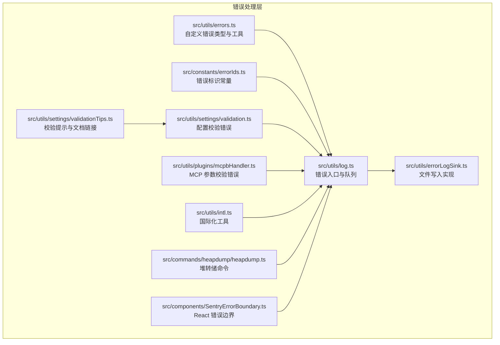
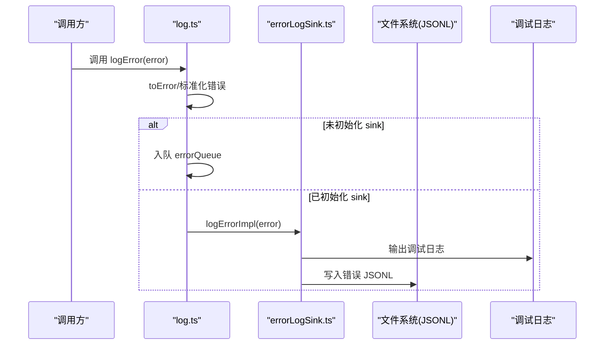
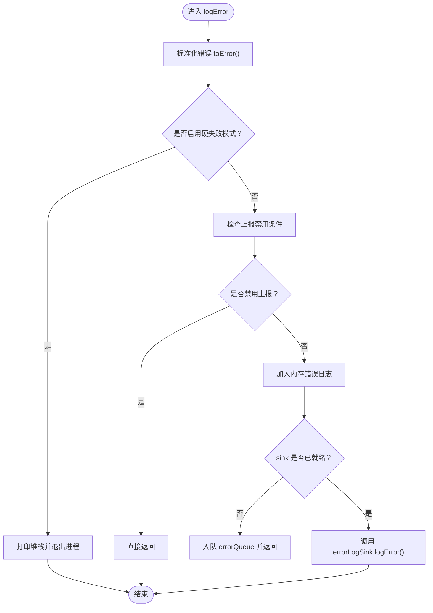
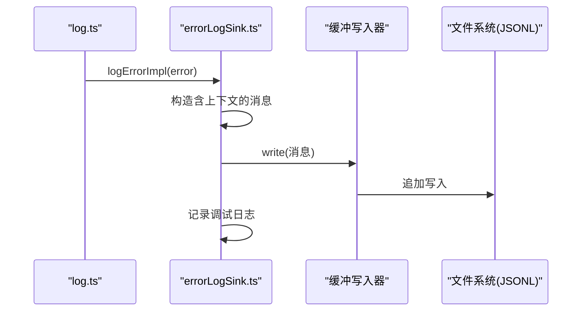
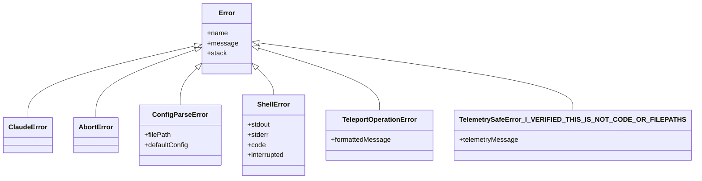
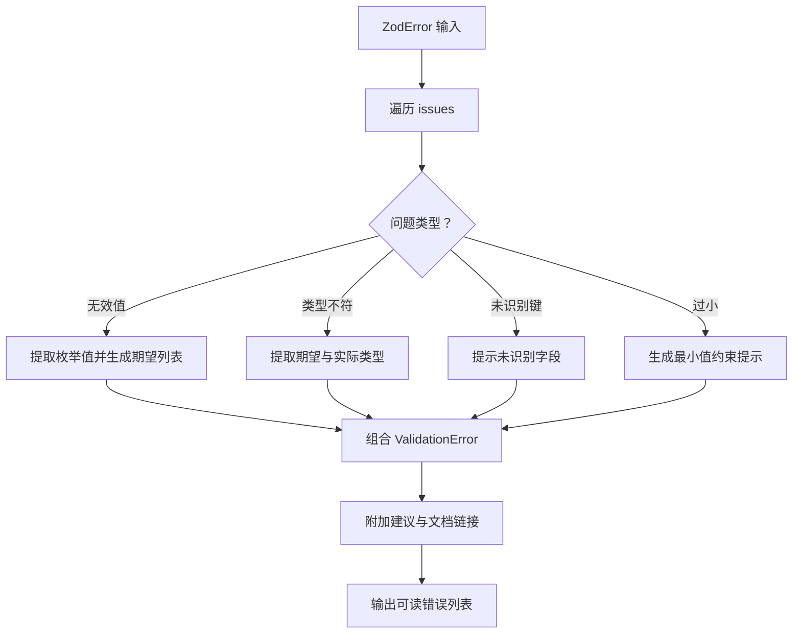
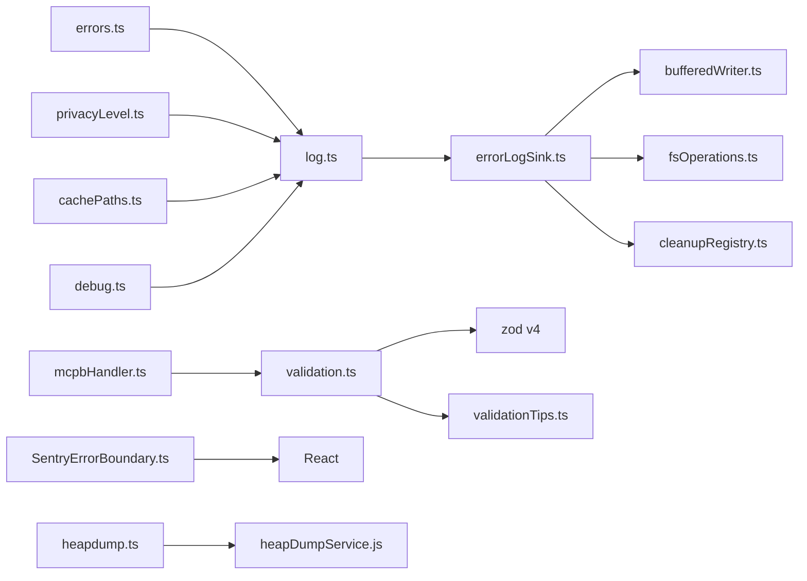

# 错误处理

<cite>
**本文引用的文件**
- [src/utils/log.ts](file://src/utils/log.ts)
- [src/utils/errorLogSink.ts](file://src/utils/errorLogSink.ts)
- [src/utils/errors.ts](file://src/utils/errors.ts)
- [src/constants/errorIds.ts](file://src/constants/errorIds.ts)
- [src/components/SentryErrorBoundary.ts](file://src/components/SentryErrorBoundary.ts)
- [src/utils/settings/validation.ts](file://src/utils/settings/validation.ts)
- [src/utils/settings/validationTips.ts](file://src/utils/settings/validationTips.ts)
- [src/utils/plugins/mcpbHandler.ts](file://src/utils/plugins/mcpbHandler.ts)
- [src/utils/intl.ts](file://src/utils/intl.ts)
- [src/commands/heapdump/heapdump.ts](file://src/commands/heapdump/heapdump.ts)
</cite>

## 目录
1. [简介](#简介)
2. [项目结构](#项目结构)
3. [核心组件](#核心组件)
4. [架构总览](#架构总览)
5. [详细组件分析](#详细组件分析)
6. [依赖关系分析](#依赖关系分析)
7. [性能考量](#性能考量)
8. [故障排查指南](#故障排查指南)
9. [结论](#结论)
10. [附录](#附录)

## 简介
本文件系统性梳理 free-code 的错误处理体系，覆盖错误分类与识别、错误传播与恢复、日志记录与上报、错误监控与可视化、自定义错误类型与上下文捕获、堆栈追踪与调试、国际化与用户友好提示、以及错误预防与容错设计原则。目标是帮助开发者在不深入源码的情况下也能快速理解并正确使用错误处理机制。

## 项目结构
错误处理相关代码主要分布在以下模块：
- 日志与错误上报：src/utils/log.ts（统一入口）、src/utils/errorLogSink.ts（落地实现）
- 自定义错误类型与工具：src/utils/errors.ts、src/constants/errorIds.ts
- UI 错误边界：src/components/SentryErrorBoundary.ts
- 配置与设置校验错误：src/utils/settings/validation.ts、src/utils/settings/validationTips.ts
- 插件与 MCP 参数校验错误：src/utils/plugins/mcpbHandler.ts
- 国际化与本地化支持：src/utils/intl.ts
- 堆内存转储命令：src/commands/heapdump/heapdump.ts（辅助诊断）

**图表来源**
- [src/utils/log.ts:158-223](file://src/utils/log.ts#L158-L223)
- [src/utils/errorLogSink.ts:225-235](file://src/utils/errorLogSink.ts#L225-L235)
- [src/utils/errors.ts:1-239](file://src/utils/errors.ts#L1-L239)
- [src/constants/errorIds.ts:1-16](file://src/constants/errorIds.ts#L1-L16)
- [src/components/SentryErrorBoundary.ts:1-29](file://src/components/SentryErrorBoundary.ts#L1-L29)
- [src/utils/settings/validation.ts:1-266](file://src/utils/settings/validation.ts#L1-L266)
- [src/utils/settings/validationTips.ts:134-164](file://src/utils/settings/validationTips.ts#L134-L164)
- [src/utils/plugins/mcpbHandler.ts:362-390](file://src/utils/plugins/mcpbHandler.ts#L362-L390)
- [src/utils/intl.ts:1-94](file://src/utils/intl.ts#L1-L94)
- [src/commands/heapdump/heapdump.ts:1-17](file://src/commands/heapdump/heapdump.ts#L1-L17)

**章节来源**
- [src/utils/log.ts:1-363](file://src/utils/log.ts#L1-L363)
- [src/utils/errorLogSink.ts:1-236](file://src/utils/errorLogSink.ts#L1-L236)
- [src/utils/errors.ts:1-239](file://src/utils/errors.ts#L1-L239)
- [src/constants/errorIds.ts:1-16](file://src/constants/errorIds.ts#L1-L16)
- [src/components/SentryErrorBoundary.ts:1-29](file://src/components/SentryErrorBoundary.ts#L1-L29)
- [src/utils/settings/validation.ts:1-266](file://src/utils/settings/validation.ts#L1-L266)
- [src/utils/settings/validationTips.ts:134-164](file://src/utils/settings/validationTips.ts#L134-L164)
- [src/utils/plugins/mcpbHandler.ts:362-390](file://src/utils/plugins/mcpbHandler.ts#L362-L390)
- [src/utils/intl.ts:1-94](file://src/utils/intl.ts#L1-L94)
- [src/commands/heapdump/heapdump.ts:1-17](file://src/commands/heapdump/heapdump.ts#L1-L17)

## 核心组件
- 统一错误入口与队列：log.ts 提供 logError、logMCPError、logMCPDebug 等接口，并在未初始化 sink 时将事件入队，初始化后批量冲刷。
- 文件写入实现：errorLogSink.ts 负责将错误写入磁盘 JSONL 文件，带时间戳、会话 ID、版本等上下文信息；同时输出到调试日志。
- 自定义错误类型：errors.ts 定义了 ClaudeError、AbortError、ConfigParseError、ShellError、TeleportOperationError、TelemetrySafeError 等，便于区分与分支处理。
- 错误标识常量：errorIds.ts 提供可追踪的错误 ID，用于生产环境定位来源。
- UI 错误边界：SentryErrorBoundary 在 React 层面拦截渲染异常，避免整页崩溃。
- 配置与设置校验：validation.ts 将 Zod 错误格式化为人类可读的 ValidationError 列表，并结合 validationTips.ts 生成建议与文档链接。
- 插件与 MCP 校验：mcpbHandler.ts 对插件参数进行类型与格式校验，生成明确的错误消息。
- 国际化与本地化：intl.ts 提供文本分段与相对时间格式化等能力，有助于构建一致的用户提示。
- 堆转储命令：heapdump.ts 支持在失败时生成堆快照，辅助定位内存问题。

**章节来源**
- [src/utils/log.ts:158-223](file://src/utils/log.ts#L158-L223)
- [src/utils/errorLogSink.ts:152-213](file://src/utils/errorLogSink.ts#L152-L213)
- [src/utils/errors.ts:3-101](file://src/utils/errors.ts#L3-L101)
- [src/constants/errorIds.ts:1-16](file://src/constants/errorIds.ts#L1-L16)
- [src/components/SentryErrorBoundary.ts:11-28](file://src/components/SentryErrorBoundary.ts#L11-L28)
- [src/utils/settings/validation.ts:48-173](file://src/utils/settings/validation.ts#L48-L173)
- [src/utils/settings/validationTips.ts:140-164](file://src/utils/settings/validationTips.ts#L140-L164)
- [src/utils/plugins/mcpbHandler.ts:362-390](file://src/utils/plugins/mcpbHandler.ts#L362-L390)
- [src/utils/intl.ts:1-94](file://src/utils/intl.ts#L1-L94)
- [src/commands/heapdump/heapdump.ts:1-17](file://src/commands/heapdump/heapdump.ts#L1-L17)

## 架构总览
错误处理采用“入口-队列-落地”的分层设计：
- 入口层：log.ts 暴露统一 API，负责标准化错误对象、注入上下文、入队或直接写入。
- 队列层：在 sink 未就绪时，所有错误事件被暂存于内存队列，确保不会丢失。
- 落地层：errorLogSink.ts 初始化后接管，将错误写入 JSONL 文件并输出调试日志；同时支持 MCP 错误与调试消息的独立落盘。
- 辅助层：errors.ts 提供类型化错误与工具函数；validation.ts 将结构化校验错误转为用户可读；SentryErrorBoundary 提供 UI 层兜底。

**图表来源**
- [src/utils/log.ts:158-199](file://src/utils/log.ts#L158-L199)
- [src/utils/errorLogSink.ts:152-174](file://src/utils/errorLogSink.ts#L152-L174)

**章节来源**
- [src/utils/log.ts:109-134](file://src/utils/log.ts#L109-L134)
- [src/utils/errorLogSink.ts:225-235](file://src/utils/errorLogSink.ts#L225-L235)

## 详细组件分析

### 组件一：统一错误入口与队列（log.ts）
- 功能要点
  - 标准化输入：toError 将任意值转换为 Error 实例，保证后续处理一致性。
  - 上下文注入：在内存日志中记录时间戳；在文件日志中附加会话 ID、版本、工作目录等。
  - 环境开关：支持通过环境变量与特性开关禁用错误上报（如云厂商模式、隐私模式）。
  - 队列机制：sink 未就绪时将事件入队，初始化后立即冲刷，避免丢失。
  - MCP 专用接口：logMCPError/logMCPDebug 分别记录 MCP 错误与调试消息，按服务器名分文件存储。
  - 硬失败模式：--hard-fail 参数触发严格失败，便于 CI 或测试场景。
- 关键路径
  - [logError:158-199](file://src/utils/log.ts#L158-L199)
  - [attachErrorLogSink:109-134](file://src/utils/log.ts#L109-L134)
  - [logMCPError:300-312](file://src/utils/log.ts#L300-L312)
  - [logMCPDebug:314-326](file://src/utils/log.ts#L314-L326)

**图表来源**
- [src/utils/log.ts:158-199](file://src/utils/log.ts#L158-L199)

**章节来源**
- [src/utils/log.ts:158-223](file://src/utils/log.ts#L158-L223)

### 组件二：文件写入实现（errorLogSink.ts）
- 功能要点
  - JSONL 写入：按日期创建文件，缓冲写入，自动创建目录。
  - 上下文增强：对 axios 错误提取 URL、状态码与服务端消息，提升可诊断性。
  - MCP 日志：按服务器名分文件记录错误与调试消息，便于多服务器并行排查。
  - 初始化顺序：initializeErrorLogSink 必须在 analytics sink 之前调用，确保错误日志先就绪。
- 关键路径
  - [initializeErrorLogSink:225-235](file://src/utils/errorLogSink.ts#L225-L235)
  - [logErrorImpl:152-174](file://src/utils/errorLogSink.ts#L152-L174)
  - [logMCPErrorImpl:179-195](file://src/utils/errorLogSink.ts#L179-L195)
  - [logMCPDebugImpl:200-213](file://src/utils/errorLogSink.ts#L200-L213)

**图表来源**
- [src/utils/errorLogSink.ts:152-174](file://src/utils/errorLogSink.ts#L152-L174)

**章节来源**
- [src/utils/errorLogSink.ts:152-213](file://src/utils/errorLogSink.ts#L152-L213)

### 组件三：自定义错误类型与工具（errors.ts）
- 错误类型
  - ClaudeError：通用业务错误基类。
  - AbortError：显式取消语义，兼容 DOM AbortController 与 SDK 的 APIUserAbortError。
  - ConfigParseError：配置解析错误，携带文件路径与默认配置。
  - ShellError：Shell 命令执行失败，携带 stdout/stderr/code/interrupted。
  - TeleportOperationError：传送操作错误，支持格式化消息。
  - TelemetrySafeError_I_VERIFIED_THIS_IS_NOT_CODE_OR_FILEPATHS：仅用于安全可上报的错误，支持用户可见与遥测分离的消息。
- 工具函数
  - isAbortError：统一识别各类取消错误。
  - toError/errorMessage：标准化错误表示。
  - getErrnoCode/getErrnoPath：从 Node 错误中提取 errno 与路径。
  - shortErrorStack：截断堆栈帧，减少模型工具结果中的冗余信息。
  - isFsInaccessible：判断文件系统不可达类错误（ENOENT/EACCES/EPERM/ENOTDIR/ELOOP）。
  - classifyAxiosError：对 axios 错误进行分类（认证/超时/网络/HTTP/其他）。
- 关键路径
  - [AbortError/isAbortError:12-33](file://src/utils/errors.ts#L12-L33)
  - [ConfigParseError:39-49](file://src/utils/errors.ts#L39-L49)
  - [ShellError:51-61](file://src/utils/errors.ts#L51-L61)
  - [TeleportOperationError:63-71](file://src/utils/errors.ts#L63-L71)
  - [TelemetrySafeError_I_VERIFIED_THIS_IS_NOT_CODE_OR_FILEPATHS:93-101](file://src/utils/errors.ts#L93-L101)
  - [toError/errorMessage:111-121](file://src/utils/errors.ts#L111-L121)
  - [shortErrorStack:161-171](file://src/utils/errors.ts#L161-L171)
  - [isFsInaccessible:186-195](file://src/utils/errors.ts#L186-L195)
  - [classifyAxiosError:213-238](file://src/utils/errors.ts#L213-L238)

**图表来源**
- [src/utils/errors.ts:3-101](file://src/utils/errors.ts#L3-L101)

**章节来源**
- [src/utils/errors.ts:3-101](file://src/utils/errors.ts#L3-L101)

### 组件四：错误标识常量（errorIds.ts）
- 用途：为生产环境追踪错误来源提供稳定标识，便于关联日志与埋点。
- 使用建议：新增错误类型时，按序号递增添加常量导出，确保死代码消除生效。

**章节来源**
- [src/constants/errorIds.ts:1-16](file://src/constants/errorIds.ts#L1-L16)

### 组件五：UI 错误边界（SentryErrorBoundary.ts）
- 作用：在 React 渲染阶段捕获异常，避免整页崩溃，保持应用可用性。
- 行为：一旦捕获错误，隐藏子树内容，防止二次渲染异常。

**章节来源**
- [src/components/SentryErrorBoundary.ts:11-28](file://src/components/SentryErrorBoundary.ts#L11-L28)

### 组件六：配置与设置校验错误（validation.ts、validationTips.ts）
- 格式化：将 Zod v4 错误映射为 ValidationError，包含路径、期望值、实际值、建议与文档链接。
- 提示：根据字段路径匹配常见配置域，自动补充文档链接与修复建议。
- 关键路径
  - [formatZodError:97-173](file://src/utils/settings/validation.ts#L97-L173)
  - [getValidationTip:140-164](file://src/utils/settings/validationTips.ts#L140-L164)

**图表来源**
- [src/utils/settings/validation.ts:97-173](file://src/utils/settings/validation.ts#L97-L173)
- [src/utils/settings/validationTips.ts:140-164](file://src/utils/settings/validationTips.ts#L140-L164)

**章节来源**
- [src/utils/settings/validation.ts:48-173](file://src/utils/settings/validation.ts#L48-L173)
- [src/utils/settings/validationTips.ts:134-164](file://src/utils/settings/validationTips.ts#L134-L164)

### 组件七：插件与 MCP 参数校验（mcpbHandler.ts）
- 目标：对插件参数进行类型与格式校验，生成明确的错误消息，避免运行期异常。
- 关键路径
  - [参数类型校验与错误收集:362-390](file://src/utils/plugins/mcpbHandler.ts#L362-L390)

**章节来源**
- [src/utils/plugins/mcpbHandler.ts:362-390](file://src/utils/plugins/mcpbHandler.ts#L362-L390)

### 组件八：国际化与本地化（intl.ts）
- 能力：缓存 Intl.Segmenter、RelativeTimeFormat 等实例，降低开销；提供首尾图元提取等文本处理工具。
- 价值：为错误提示与日志摘要提供一致的语言学基础。

**章节来源**
- [src/utils/intl.ts:1-94](file://src/utils/intl.ts#L1-L94)

### 组件九：堆转储命令（heapdump.ts）
- 作用：在发生严重内存问题时生成堆快照，辅助定位泄漏与异常增长。
- 关键路径
  - [performHeapDump 调用与结果返回:1-17](file://src/commands/heapdump/heapdump.ts#L1-L17)

**章节来源**
- [src/commands/heapdump/heapdump.ts:1-17](file://src/commands/heapdump/heapdump.ts#L1-L17)

## 依赖关系分析
- log.ts 依赖 errors.ts（toError）、privacyLevel（隐私级别）、cachePaths（日志目录）、debug（调试输出）。
- errorLogSink.ts 依赖 log.ts（attachErrorLogSink）、bufferedWriter（缓冲写入）、fsOperations（文件系统）、cleanupRegistry（清理）、debug（调试输出）。
- validation.ts 依赖 zod v4、validationTips.ts（提示与文档链接）、settings 类型与 JSON Schema。
- mcpbHandler.ts 依赖插件字段 schema 与类型定义，进行参数校验。
- SentryErrorBoundary.ts 依赖 React，作为 UI 层兜底。
- intl.ts 为纯工具模块，无外部依赖。
- heapdump.ts 依赖堆转储服务，用于诊断。

**图表来源**
- [src/utils/log.ts:1-363](file://src/utils/log.ts#L1-L363)
- [src/utils/errorLogSink.ts:1-236](file://src/utils/errorLogSink.ts#L1-L236)
- [src/utils/errors.ts:1-239](file://src/utils/errors.ts#L1-L239)
- [src/utils/settings/validation.ts:1-266](file://src/utils/settings/validation.ts#L1-L266)
- [src/utils/settings/validationTips.ts:134-164](file://src/utils/settings/validationTips.ts#L134-L164)
- [src/utils/plugins/mcpbHandler.ts:362-390](file://src/utils/plugins/mcpbHandler.ts#L362-L390)
- [src/components/SentryErrorBoundary.ts:1-29](file://src/components/SentryErrorBoundary.ts#L1-L29)
- [src/commands/heapdump/heapdump.ts:1-17](file://src/commands/heapdump/heapdump.ts#L1-L17)

**章节来源**
- [src/utils/log.ts:1-363](file://src/utils/log.ts#L1-L363)
- [src/utils/errorLogSink.ts:1-236](file://src/utils/errorLogSink.ts#L1-L236)
- [src/utils/errors.ts:1-239](file://src/utils/errors.ts#L1-L239)
- [src/utils/settings/validation.ts:1-266](file://src/utils/settings/validation.ts#L1-L266)
- [src/utils/settings/validationTips.ts:134-164](file://src/utils/settings/validationTips.ts#L134-L164)
- [src/utils/plugins/mcpbHandler.ts:362-390](file://src/utils/plugins/mcpbHandler.ts#L362-L390)
- [src/components/SentryErrorBoundary.ts:1-29](file://src/components/SentryErrorBoundary.ts#L1-L29)
- [src/commands/heapdump/heapdump.ts:1-17](file://src/commands/heapdump/heapdump.ts#L1-L17)

## 性能考量
- 缓冲写入：errorLogSink.ts 使用缓冲写入器，降低频繁 IO 开销，适合高并发错误场景。
- 懒初始化：intl.ts 对昂贵的 Intl 对象进行懒初始化与复用，减少重复构造成本。
- 内存日志上限：log.ts 限制内存错误日志数量，避免长期运行内存膨胀。
- 硬失败模式：--hard-fail 在 CI 中可快速暴露问题，但不适用于生产 UI 场景。
- 建议
  - 对高频错误场景，优先使用内存日志与队列，避免阻塞主流程。
  - 控制短堆栈帧数量，减少模型工具结果中的冗余信息。

[本节为通用指导，无需具体文件分析]

## 故障排查指南
- 如何查看错误日志
  - 调试日志：通过调试开关查看实时输出。
  - 内存日志：获取最近错误列表，便于复制到报告。
  - 文件日志：按日期与会话 ID 查找 JSONL 文件，定位具体错误上下文。
- 常见排查步骤
  - 确认是否处于禁用上报环境（云厂商模式、隐私模式、禁用标志）。
  - 检查 axios 错误上下文（URL、状态码、服务端消息），快速定位接口问题。
  - 使用 TelemetrySafeError 包装可上报消息，避免敏感信息泄露。
  - 配置校验失败时，参考 validationTips.ts 生成的建议与文档链接。
  - MCP 错误按服务器名分文件，逐个核对请求参数与响应。
- 辅助诊断
  - 生成堆转储以分析内存问题。
  - 使用 shortErrorStack 截断堆栈，聚焦关键帧。

**章节来源**
- [src/utils/log.ts:158-223](file://src/utils/log.ts#L158-L223)
- [src/utils/errorLogSink.ts:152-213](file://src/utils/errorLogSink.ts#L152-L213)
- [src/utils/errors.ts:93-101](file://src/utils/errors.ts#L93-L101)
- [src/utils/settings/validationTips.ts:140-164](file://src/utils/settings/validationTips.ts#L140-L164)
- [src/commands/heapdump/heapdump.ts:1-17](file://src/commands/heapdump/heapdump.ts#L1-L17)

## 结论
free-code 的错误处理体系以“入口-队列-落地”为核心，结合自定义错误类型、结构化校验、UI 错误边界与国际化工具，形成了从捕获、记录、诊断到恢复的完整闭环。通过严格的上下文注入与缓冲写入，既保证了可观测性，又兼顾了性能与稳定性。建议在新功能开发中遵循本文档的最佳实践，统一使用 log.ts 与 errors.ts，确保错误处理的一致性与可维护性。

[本节为总结，无需具体文件分析]

## 附录

### 错误分类与识别速查
- 取消类：AbortError、APIUserAbortError
- 配置类：ConfigParseError
- Shell 执行类：ShellError
- 传送类：TeleportOperationError
- 安全可上报类：TelemetrySafeError_I_VERIFIED_THIS_IS_NOT_CODE_OR_FILEPATHS
- 文件系统可达性：isFsInaccessible
- axios 错误分类：classifyAxiosError

**章节来源**
- [src/utils/errors.ts:12-33](file://src/utils/errors.ts#L12-L33)
- [src/utils/errors.ts:39-49](file://src/utils/errors.ts#L39-L49)
- [src/utils/errors.ts:51-61](file://src/utils/errors.ts#L51-L61)
- [src/utils/errors.ts:63-71](file://src/utils/errors.ts#L63-L71)
- [src/utils/errors.ts:93-101](file://src/utils/errors.ts#L93-L101)
- [src/utils/errors.ts:186-195](file://src/utils/errors.ts#L186-L195)
- [src/utils/errors.ts:213-238](file://src/utils/errors.ts#L213-L238)

### 错误传播与恢复策略
- 传播：优先在当前作用域内捕获并转换为业务错误，再通过 logError 上报；必要时抛出给上层处理。
- 恢复：对可预期的文件系统错误（ENOENT/EACCES/EPERM/ENOTDIR/ELOOP）进行降级处理；对网络类错误（超时/拒绝）进行重试或回退。
- 用户提示：结合 validationTips.ts 与 intl.ts，提供可读、可操作的提示与本地化文案。

**章节来源**
- [src/utils/errors.ts:186-195](file://src/utils/errors.ts#L186-L195)
- [src/utils/errors.ts:213-238](file://src/utils/errors.ts#L213-L238)
- [src/utils/settings/validationTips.ts:140-164](file://src/utils/settings/validationTips.ts#L140-L164)
- [src/utils/intl.ts:1-94](file://src/utils/intl.ts#L1-L94)

### 错误日志记录、报告与监控
- 记录：统一通过 log.ts，自动注入时间戳、会话 ID、版本、工作目录等上下文。
- 报告：内存日志与文件日志双通道，便于快速复制与长期归档。
- 监控：结合错误 ID 与日志路径，建立生产环境追踪链路。

**章节来源**
- [src/utils/log.ts:158-223](file://src/utils/log.ts#L158-L223)
- [src/utils/errorLogSink.ts:111-126](file://src/utils/errorLogSink.ts#L111-L126)

### 自定义错误类型定义与堆栈追踪
- 自定义错误：在 errors.ts 中集中定义，便于统一识别与分支处理。
- 堆栈追踪：使用 shortErrorStack 截断模型工具结果中的堆栈，保留调试日志中的完整堆栈。

**章节来源**
- [src/utils/errors.ts:3-101](file://src/utils/errors.ts#L3-L101)
- [src/utils/errors.ts:161-171](file://src/utils/errors.ts#L161-L171)

### 错误国际化与用户友好提示
- 文本处理：使用 intl.ts 的 Segmenter 与 RelativeTimeFormat，确保跨语言一致性。
- 提示生成：validationTips.ts 基于字段路径自动拼接文档链接与修复建议，提升可操作性。

**章节来源**
- [src/utils/intl.ts:1-94](file://src/utils/intl.ts#L1-L94)
- [src/utils/settings/validationTips.ts:140-164](file://src/utils/settings/validationTips.ts#L140-L164)

### 错误预防与容错设计原则
- 预防：在输入端进行严格校验（Zod、MCP 参数），尽早发现并反馈问题。
- 容错：对可预期失败进行降级与回退，避免级联故障；对不可预期异常通过错误边界与日志兜底。
- 可观测：为每类错误提供稳定 ID 与上下文，便于定位与复现。

**章节来源**
- [src/utils/settings/validation.ts:97-173](file://src/utils/settings/validation.ts#L97-L173)
- [src/utils/plugins/mcpbHandler.ts:362-390](file://src/utils/plugins/mcpbHandler.ts#L362-L390)
- [src/constants/errorIds.ts:1-16](file://src/constants/errorIds.ts#L1-L16)