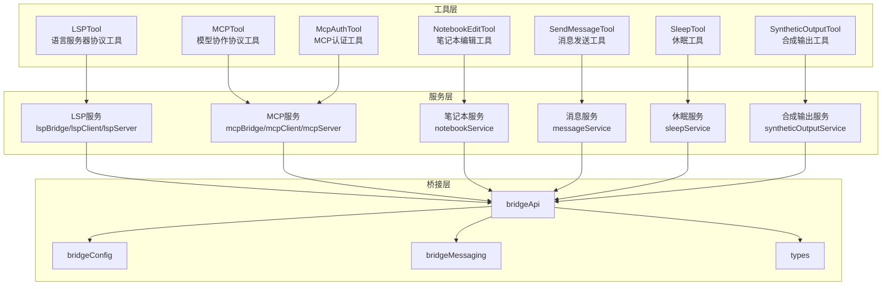
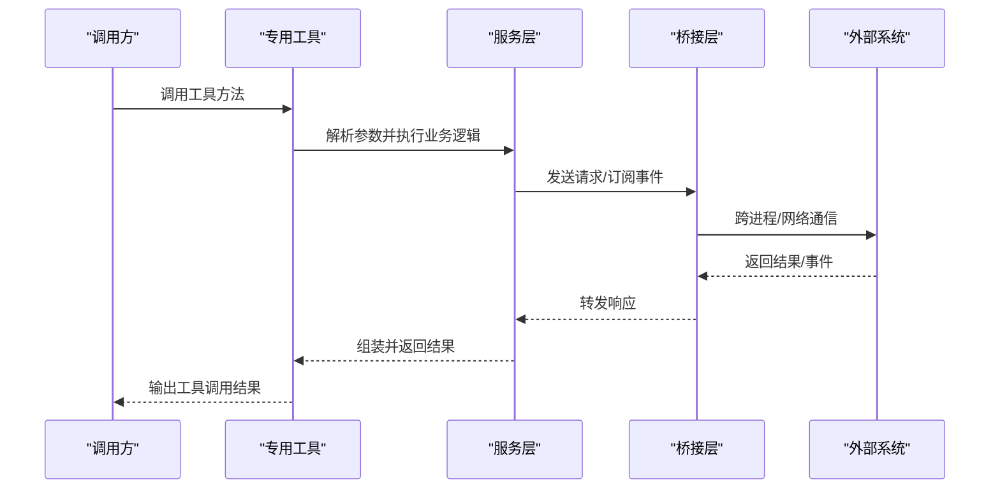
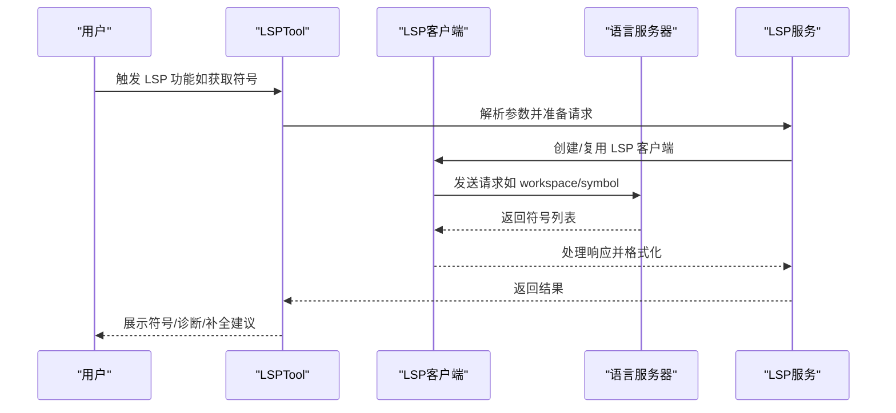
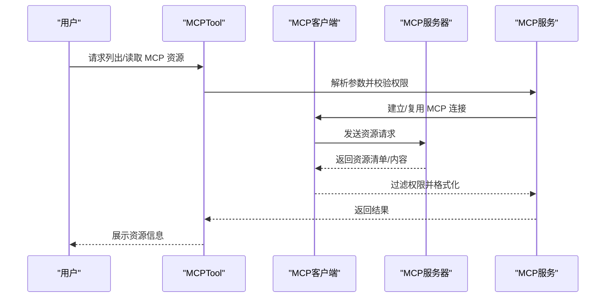
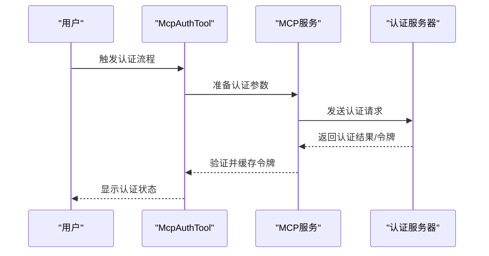
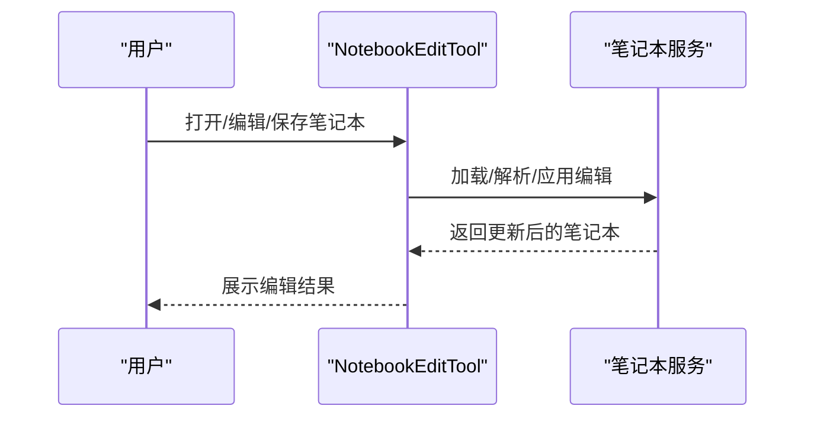
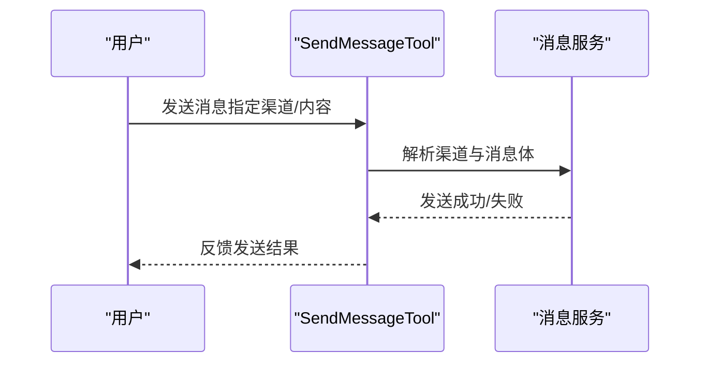
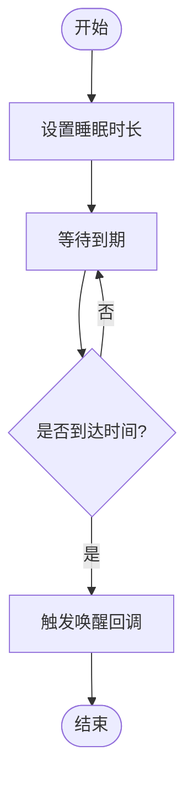
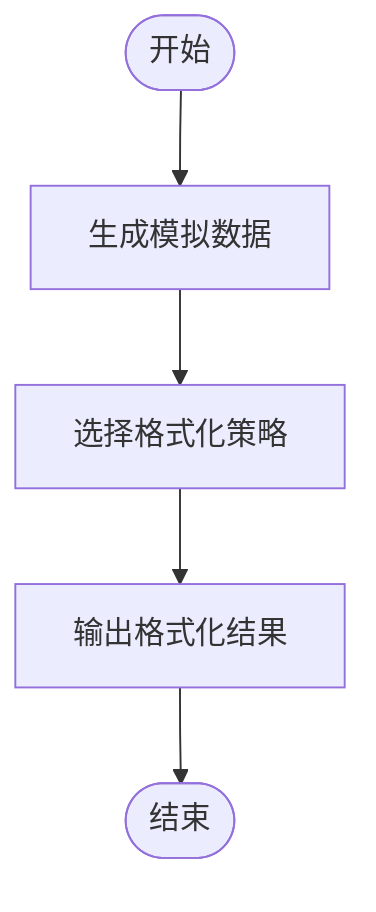
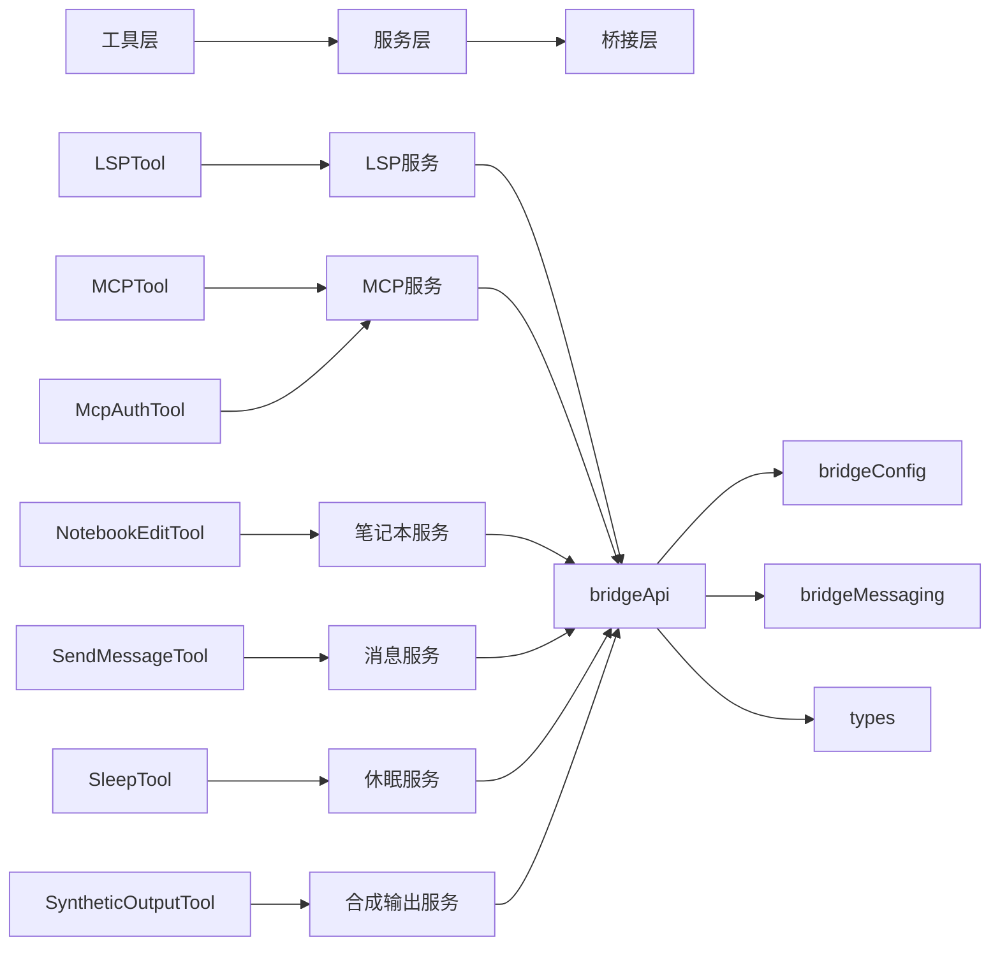

# 专用工具

<cite>
**本文引用的文件**
- [LSPTool.ts](file://src/tools/LSPTool/LSPTool.ts)
- [MCPTool.ts](file://src/tools/MCPTool/MCPTool.ts)
- [McpAuthTool.ts](file://src/tools/McpAuthTool/McpAuthTool.ts)
- [NotebookEditTool.ts](file://src/tools/NotebookEditTool/NotebookEditTool.ts)
- [SendMessageTool.ts](file://src/tools.ts)
- [SleepTool.ts](file://src/tools.ts)
- [SyntheticOutputTool.ts](file://src/tools/SyntheticOutputTool/SyntheticOutputTool.ts)
- [lspBridge.ts](file://src/services/lsp/lspBridge.ts)
- [lspClient.ts](file://src/services/lsp/lspClient.ts)
- [lspServer.ts](file://src/services/lsp/lspServer.ts)
- [mcpBridge.ts](file://src/services/mcp/mcpBridge.ts)
- [mcpClient.ts](file://src/services/mcp/mcpClient.ts)
- [mcpServer.ts](file://src/services/mcp/mcpServer.ts)
- [notebookService.ts](file://src/services/notebook/notebookService.ts)
- [messageService.ts](file://src/services/message/messageService.ts)
- [sleepService.ts](file://src/services/sleep/sleepService.ts)
- [syntheticOutputService.ts](file://src/services/syntheticOutput/syntheticOutputService.ts)
- [bridgeApi.ts](file://src/bridge/bridgeApi.ts)
- [bridgeConfig.ts](file://src/bridge/bridgeConfig.ts)
- [bridgeMessaging.ts](file://src/bridge/bridgeMessaging.ts)
- [types.ts](file://src/bridge/types.ts)
- [tools.ts](file://src/tools.ts)
- [constants.ts](file://src/constants/tools.ts)
</cite>

## 目录
1. [简介](#简介)
2. [项目结构](#项目结构)
3. [核心组件](#核心组件)
4. [架构总览](#架构总览)
5. [详细组件分析](#详细组件分析)
6. [依赖关系分析](#依赖关系分析)
7. [性能考虑](#性能考虑)
8. [故障排除指南](#故障排除指南)
9. [结论](#结论)

## 简介
本文件为专用工具的完整参考文档，涵盖以下专业工具：LSPTool（语言服务器协议）、MCPTool（模型协作协议）、McpAuthTool（MCP认证）、NotebookEditTool（笔记本编辑）、SendMessageTool（消息发送）、SleepTool（休眠）以及 SyntheticOutputTool（合成输出）。文档从系统架构、组件关系、数据流与处理逻辑、集成点与错误处理等方面进行深入解析，并结合实际源码路径帮助读者快速定位实现细节。

## 项目结构
专用工具主要位于 src/tools 目录下，每个工具通过统一的构建器模式封装为可调用的工具实例。同时，各工具的服务层位于 src/services 下，负责与底层桥接层（bridge）交互，实现跨进程或远程通信。桥接层位于 src/bridge 目录，提供配置、消息传递与状态管理能力。

图表来源
- [LSPTool.ts](file://src/tools/LSPTool/LSPTool.ts)
- [MCPTool.ts](file://src/tools/MCPTool/MCPTool.ts)
- [McpAuthTool.ts](file://src/tools/McpAuthTool/McpAuthTool.ts)
- [NotebookEditTool.ts](file://src/tools/NotebookEditTool/NotebookEditTool.ts)
- [SendMessageTool.ts](file://src/tools.ts)
- [SleepTool.ts](file://src/tools.ts)
- [SyntheticOutputTool.ts](file://src/tools/SyntheticOutputTool/SyntheticOutputTool.ts)
- [lspBridge.ts](file://src/services/lsp/lspBridge.ts)
- [mcpBridge.ts](file://src/services/mcp/mcpBridge.ts)
- [notebookService.ts](file://src/services/notebook/notebookService.ts)
- [messageService.ts](file://src/services/message/messageService.ts)
- [sleepService.ts](file://src/services/sleep/sleepService.ts)
- [syntheticOutputService.ts](file://src/services/syntheticOutput/syntheticOutputService.ts)
- [bridgeApi.ts](file://src/bridge/bridgeApi.ts)
- [bridgeConfig.ts](file://src/bridge/bridgeConfig.ts)
- [bridgeMessaging.ts](file://src/bridge/bridgeMessaging.ts)
- [types.ts](file://src/bridge/types.ts)

章节来源
- [tools.ts](file://src/tools.ts)
- [constants.ts](file://src/constants/tools.ts)

## 核心组件
本节概述各专用工具的核心职责与关键接口：

- LSPTool：封装语言服务器协议调用，提供诊断、符号导航与代码补全等能力。
- MCPTool：封装模型协作协议调用，负责连接管理、资源访问与权限控制。
- McpAuthTool：提供 MCP 认证流程，确保安全访问受控资源。
- NotebookEditTool：支持笔记本内容编辑、格式转换与版本控制。
- SendMessageTool：统一路由消息发送，支持多渠道集成与通知机制。
- SleepTool：提供时间控制与唤醒策略，避免过早中断任务。
- SyntheticOutputTool：生成模拟数据并进行格式化输出，便于测试与演示。

章节来源
- [LSPTool.ts](file://src/tools/LSPTool/LSPTool.ts)
- [MCPTool.ts](file://src/tools/MCPTool/MCPTool.ts)
- [McpAuthTool.ts](file://src/tools/McpAuthTool/McpAuthTool.ts)
- [NotebookEditTool.ts](file://src/tools/NotebookEditTool/NotebookEditTool.ts)
- [SendMessageTool.ts](file://src/tools.ts)
- [SleepTool.ts](file://src/tools.ts)
- [SyntheticOutputTool.ts](file://src/tools/SyntheticOutputTool/SyntheticOutputTool.ts)

## 架构总览
专用工具通过统一的构建器模式对外暴露，内部依赖服务层完成具体功能；服务层再通过桥接层与外部系统交互。桥接层提供配置、消息传递与类型定义，保证工具与运行环境解耦。

图表来源
- [bridgeApi.ts](file://src/bridge/bridgeApi.ts)
- [bridgeMessaging.ts](file://src/bridge/bridgeMessaging.ts)
- [bridgeConfig.ts](file://src/bridge/bridgeConfig.ts)
- [types.ts](file://src/bridge/types.ts)

## 详细组件分析

### LSPTool 分析
LSPTool 封装语言服务器协议调用，支持诊断系统、符号导航与代码补全等功能。其核心流程包括：初始化 LSP 客户端、建立与服务器的连接、发送请求并处理响应。

图表来源
- [LSPTool.ts](file://src/tools/LSPTool/LSPTool.ts)
- [lspClient.ts](file://src/services/lsp/lspClient.ts)
- [lspServer.ts](file://src/services/lsp/lspServer.ts)
- [lspBridge.ts](file://src/services/lsp/lspBridge.ts)

章节来源
- [LSPTool.ts](file://src/tools/LSPTool/LSPTool.ts)
- [lspBridge.ts](file://src/services/lsp/lspBridge.ts)
- [lspClient.ts](file://src/services/lsp/lspClient.ts)
- [lspServer.ts](file://src/services/lsp/lspServer.ts)

### MCPTool 分析
MCPTool 负责模型协作协议的连接管理、资源访问与权限控制。其工作流包括：建立 MCP 连接、查询可用资源、按权限过滤后读取资源内容。

图表来源
- [MCPTool.ts](file://src/tools/MCPTool/MCPTool.ts)
- [mcpClient.ts](file://src/services/mcp/mcpClient.ts)
- [mcpServer.ts](file://src/services/mcp/mcpServer.ts)
- [mcpBridge.ts](file://src/services/mcp/mcpBridge.ts)

章节来源
- [MCPTool.ts](file://src/tools/MCPTool/MCPTool.ts)
- [mcpBridge.ts](file://src/services/mcp/mcpBridge.ts)
- [mcpClient.ts](file://src/services/mcp/mcpClient.ts)
- [mcpServer.ts](file://src/services/mcp/mcpServer.ts)

### McpAuthTool 分析
McpAuthTool 提供 MCP 认证流程，确保对受控资源的安全访问。典型流程包括：发起认证请求、等待授权、接收令牌并验证有效性。

图表来源
- [McpAuthTool.ts](file://src/tools/McpAuthTool/McpAuthTool.ts)
- [mcpBridge.ts](file://src/services/mcp/mcpBridge.ts)

章节来源
- [McpAuthTool.ts](file://src/tools/McpAuthTool/McpAuthTool.ts)
- [mcpBridge.ts](file://src/services/mcp/mcpBridge.ts)

### NotebookEditTool 分析
NotebookEditTool 支持笔记本内容编辑、格式支持与版本控制。其核心流程包括：加载笔记本、应用编辑操作、保存并记录版本变更。

图表来源
- [NotebookEditTool.ts](file://src/tools/NotebookEditTool/NotebookEditTool.ts)
- [notebookService.ts](file://src/services/notebook/notebookService.ts)

章节来源
- [NotebookEditTool.ts](file://src/tools/NotebookEditTool/NotebookEditTool.ts)
- [notebookService.ts](file://src/services/notebook/notebookService.ts)

### SendMessageTool 分析
SendMessageTool 统一消息发送渠道，支持多种通知机制与集成场景。其流程包括：解析目标渠道、构造消息体、路由到对应服务并发送。

图表来源
- [SendMessageTool.ts](file://src/tools.ts)
- [messageService.ts](file://src/services/message/messageService.ts)

章节来源
- [SendMessageTool.ts](file://src/tools.ts)
- [messageService.ts](file://src/services/message/messageService.ts)

### SleepTool 分析
SleepTool 提供时间控制与唤醒策略，避免任务被过早中断。其流程包括：设置睡眠时长、等待到期后触发回调。

图表来源
- [SleepTool.ts](file://src/tools.ts)
- [sleepService.ts](file://src/services/sleep/sleepService.ts)

章节来源
- [SleepTool.ts](file://src/tools.ts)
- [sleepService.ts](file://src/services/sleep/sleepService.ts)

### SyntheticOutputTool 分析
SyntheticOutputTool 用于生成模拟数据并进行格式化输出，常用于测试与演示场景。其流程包括：生成数据、选择格式化策略、输出结果。

图表来源
- [SyntheticOutputTool.ts](file://src/tools/SyntheticOutputTool/SyntheticOutputTool.ts)
- [syntheticOutputService.ts](file://src/services/syntheticOutput/syntheticOutputService.ts)

章节来源
- [SyntheticOutputTool.ts](file://src/tools/SyntheticOutputTool/SyntheticOutputTool.ts)
- [syntheticOutputService.ts](file://src/services/syntheticOutput/syntheticOutputService.ts)

## 依赖关系分析
专用工具与其服务层、桥接层之间的依赖关系如下图所示：

图表来源
- [tools.ts](file://src/tools.ts)
- [lspBridge.ts](file://src/services/lsp/lspBridge.ts)
- [mcpBridge.ts](file://src/services/mcp/mcpBridge.ts)
- [notebookService.ts](file://src/services/notebook/notebookService.ts)
- [messageService.ts](file://src/services/message/messageService.ts)
- [sleepService.ts](file://src/services/sleep/sleepService.ts)
- [syntheticOutputService.ts](file://src/services/syntheticOutput/syntheticOutputService.ts)
- [bridgeApi.ts](file://src/bridge/bridgeApi.ts)
- [bridgeConfig.ts](file://src/bridge/bridgeConfig.ts)
- [bridgeMessaging.ts](file://src/bridge/bridgeMessaging.ts)
- [types.ts](file://src/bridge/types.ts)

章节来源
- [tools.ts](file://src/tools.ts)
- [bridgeApi.ts](file://src/bridge/bridgeApi.ts)
- [bridgeConfig.ts](file://src/bridge/bridgeConfig.ts)
- [bridgeMessaging.ts](file://src/bridge/bridgeMessaging.ts)
- [types.ts](file://src/bridge/types.ts)

## 性能考虑
- 工具调用应尽量复用已建立的连接与客户端实例，减少握手与初始化开销。
- 对于频繁调用的工具（如 LSPTool、MCPTool），建议采用异步非阻塞方式处理，避免阻塞主线程。
- 合理设置超时与重试策略，防止网络波动导致长时间等待。
- 在笔记本编辑与消息发送场景中，批量操作应合并以降低通信次数。
- 休眠工具应避免过短间隔唤醒，以免造成系统抖动。

## 故障排除指南
- LSPTool
  - 若诊断无响应，检查 LSP 客户端与服务器连接状态，确认请求参数与工作区路径正确。
  - 符号或补全缺失时，确认语言服务器已正确加载并支持相应功能。
- MCPTool
  - 资源不可见或读取失败时，检查权限配置与服务器可达性。
  - 连接异常时，尝试重建连接并查看日志中的错误码。
- McpAuthTool
  - 认证失败时，确认令牌有效期内且未被撤销；必要时重新发起认证。
- NotebookEditTool
  - 编辑冲突或版本不一致时，检查并发写入策略与版本记录。
- SendMessageTool
  - 渠道不可达时，切换备用通道或检查目标平台状态。
- SleepTool
  - 唤醒不生效时，检查定时器精度与系统电源策略。
- SyntheticOutputTool
  - 数据格式异常时，核对格式化策略与目标消费方要求。

章节来源
- [LSPTool.ts](file://src/tools/LSPTool/LSPTool.ts)
- [MCPTool.ts](file://src/tools/MCPTool/MCPTool.ts)
- [McpAuthTool.ts](file://src/tools/McpAuthTool/McpAuthTool.ts)
- [NotebookEditTool.ts](file://src/tools/NotebookEditTool/NotebookEditTool.ts)
- [SendMessageTool.ts](file://src/tools.ts)
- [SleepTool.ts](file://src/tools.ts)
- [SyntheticOutputTool.ts](file://src/tools/SyntheticOutputTool/SyntheticOutputTool.ts)

## 结论
专用工具通过统一的构建器模式与分层架构实现了高内聚、低耦合的设计。LSPTool、MCPTool、McpAuthTool、NotebookEditTool、SendMessageTool、SleepTool 与 SyntheticOutputTool 各司其职，配合服务层与桥接层，为复杂场景下的自动化与智能化提供了坚实基础。建议在实际使用中遵循性能与故障排除指南，以获得更稳定可靠的体验。