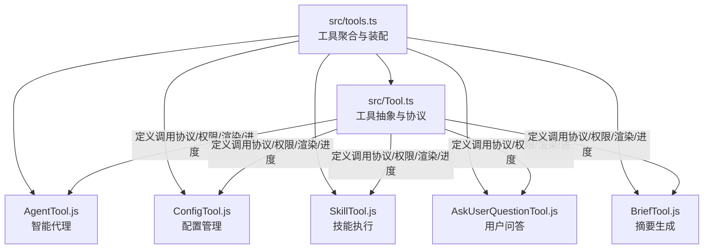
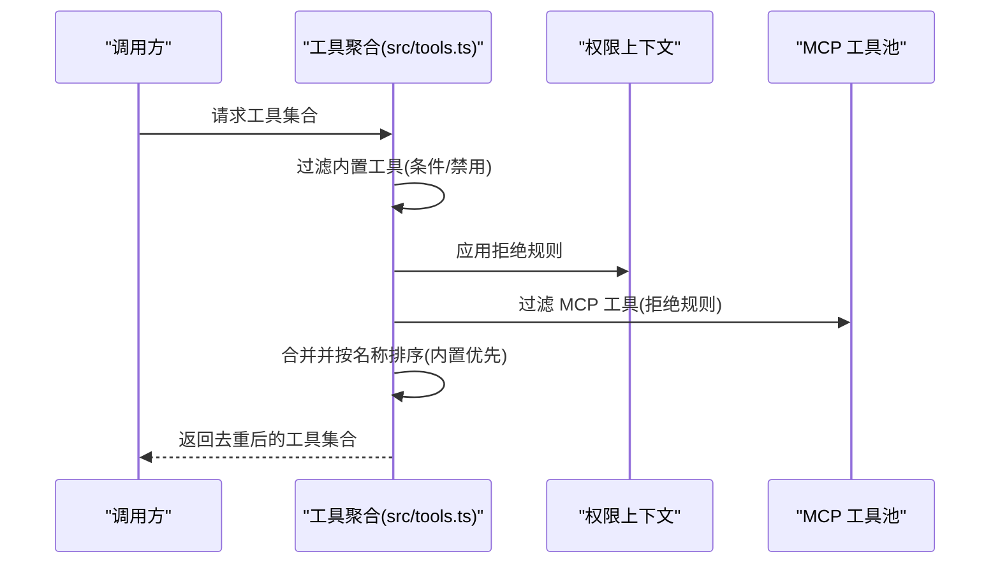
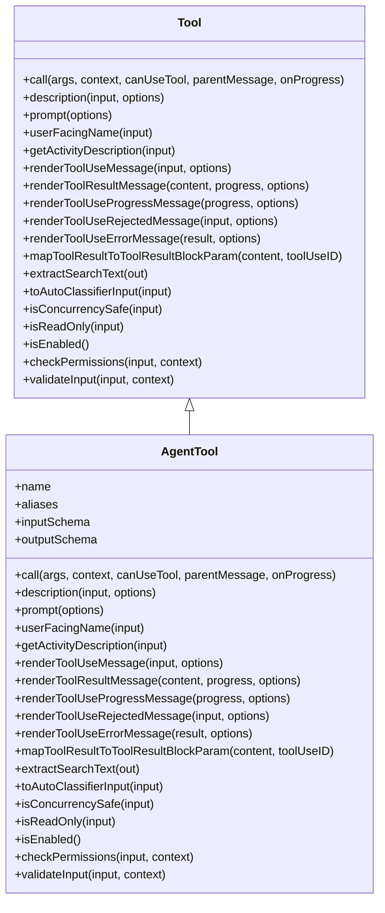
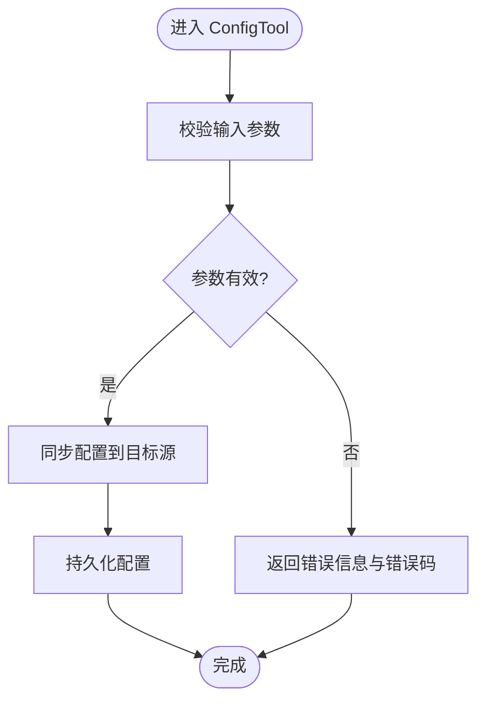
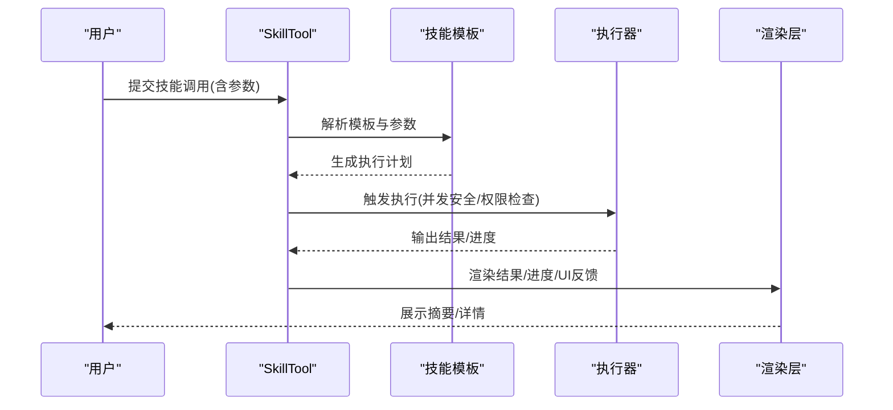
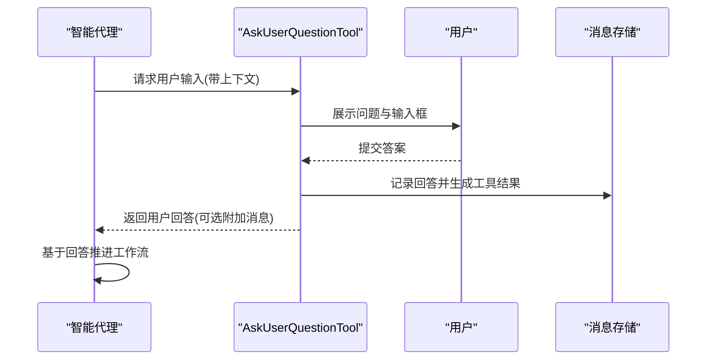
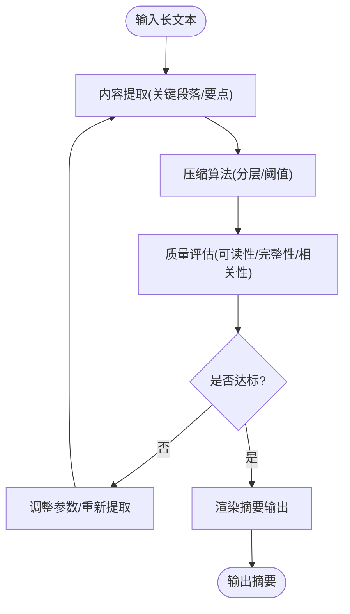
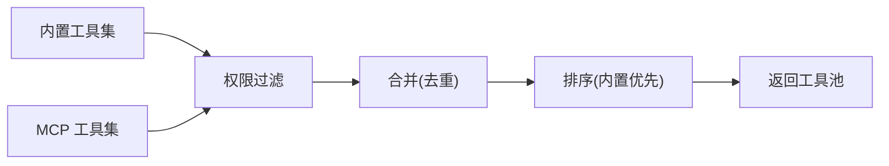

# 代理和配置工具

<cite>
**本文引用的文件**
- [src/tools.ts](file://src/tools.ts)
- [src/Tool.ts](file://src/Tool.ts)
- [src/tools/AgentTool/AgentTool.js](file://src/tools/AgentTool/AgentTool.js)
- [src/tools/ConfigTool/ConfigTool.js](file://src/tools/ConfigTool/ConfigTool.js)
- [src/tools/SkillTool/SkillTool.js](file://src/tools/SkillTool/SkillTool.js)
- [src/tools/AskUserQuestionTool/AskUserQuestionTool.js](file://src/tools/AskUserQuestionTool/AskUserQuestionTool.js)
- [src/tools/BriefTool/BriefTool.js](file://src/tools/BriefTool/BriefTool.js)
</cite>

## 目录
1. [简介](#简介)
2. [项目结构](#项目结构)
3. [核心组件](#核心组件)
4. [架构总览](#架构总览)
5. [详细组件分析](#详细组件分析)
6. [依赖分析](#依赖分析)
7. [性能考虑](#性能考虑)
8. [故障排查指南](#故障排查指南)
9. [结论](#结论)
10. [附录](#附录)

## 简介
本文件为代理与配置工具的详细参考文档，聚焦以下核心工具：AgentTool（智能代理）、ConfigTool（配置管理）、SkillTool（技能执行）、AskUserQuestionTool（用户问答）与 BriefTool（摘要生成）。文档从系统架构、组件关系、数据与处理逻辑、集成点、错误处理与性能特征等方面进行深入解析，并通过图示展示这些工具在复杂工作流中的协同使用模式。

## 项目结构
工具体系由统一的工具抽象层与具体工具实现组成。工具注册与装配位于工具聚合入口，工具抽象定义了调用协议、权限校验、进度渲染、结果映射等通用接口；各工具在此基础上实现自身能力与行为。

图表来源
- [src/tools.ts:193-251](file://src/tools.ts#L193-L251)
- [src/Tool.ts:362-695](file://src/Tool.ts#L362-L695)

章节来源
- [src/tools.ts:193-251](file://src/tools.ts#L193-L251)
- [src/Tool.ts:362-695](file://src/Tool.ts#L362-L695)

## 核心组件
本节概述五大工具的职责边界与协作方式：
- AgentTool：封装智能代理的启动、会话与任务编排，支持多代理协同与后台任务生命周期管理。
- ConfigTool：面向特定构建类型（如 ant）提供的配置读写与同步工具，负责设置项的持久化与一致性。
- SkillTool：基于技能模板与参数传递执行可复用能力，支持动态加载与发现。
- AskUserQuestionTool：提供交互式提问与回答收集，支持上下文感知与响应策略。
- BriefTool：对长文本进行内容抽取、压缩与质量评估，输出简洁摘要。

章节来源
- [src/tools.ts:3-13](file://src/tools.ts#L3-L13)
- [src/tools.ts:73-81](file://src/tools.ts#L73-L81)
- [src/tools.ts:211-212](file://src/tools.ts#L211-L212)
- [src/tools.ts:238](file://src/tools.ts#L238)

## 架构总览
工具聚合层负责：
- 汇总内置工具与 MCP 工具，按名称去重并保持提示缓存稳定性；
- 基于权限上下文过滤工具，屏蔽被拒绝的工具；
- 在 REPL 模式下隐藏原始工具，仅允许通过虚拟机访问；
- 提供默认预设与工具集合查询接口。

图表来源
- [src/tools.ts:345-367](file://src/tools.ts#L345-L367)
- [src/tools.ts:262-269](file://src/tools.ts#L262-L269)

章节来源
- [src/tools.ts:271-327](file://src/tools.ts#L271-L327)
- [src/tools.ts:345-367](file://src/tools.ts#L345-L367)

## 详细组件分析

### AgentTool 分析
AgentTool 负责智能代理的生命周期与任务编排，其核心职责包括：
- 代理定义与加载：从目录加载代理定义，支持多代理类型与参数化配置。
- 会话与任务：创建/管理会话，调度任务，处理后台任务与中断。
- 上下文与内存：与会话内存、文件状态缓存、消息历史等集成，确保上下文一致性。
- 权限与安全：结合权限上下文进行输入校验与权限决策，必要时触发用户确认或自动分类器评估。

图表来源
- [src/Tool.ts:362-695](file://src/Tool.ts#L362-L695)
- [src/tools/AgentTool/AgentTool.js](file://src/tools/AgentTool/AgentTool.js)

章节来源
- [src/tools/AgentTool/AgentTool.js](file://src/tools/AgentTool/AgentTool.js)
- [src/Tool.ts:362-695](file://src/Tool.ts#L362-L695)

### ConfigTool 分析
ConfigTool 面向特定构建类型（如 ant）提供配置管理能力，主要特性：
- 设置项：集中管理配置键值，支持读取、更新与持久化。
- 验证规则：对输入进行校验，返回明确的错误信息与错误码。
- 同步机制：与远程/本地配置源同步，保证一致性与回滚能力。
- 条件启用：仅在满足环境变量或功能开关时暴露工具。

图表来源
- [src/tools/ConfigTool/ConfigTool.js](file://src/tools/ConfigTool/ConfigTool.js)
- [src/Tool.ts:489-503](file://src/Tool.ts#L489-L503)

章节来源
- [src/tools/ConfigTool/ConfigTool.js](file://src/tools/ConfigTool/ConfigTool.js)
- [src/Tool.ts:489-503](file://src/Tool.ts#L489-L503)

### SkillTool 分析
SkillTool 支持以模板驱动的方式执行可复用技能，关键点：
- 模板系统：通过技能模板与参数占位符组织执行逻辑。
- 参数传递：将用户输入与上下文参数注入模板，形成最终执行请求。
- 执行流程：描述符生成、参数校验、权限检查、并发安全判定、进度渲染与结果映射。
- 动态加载：支持运行时发现与加载新技能，提升扩展性。

图表来源
- [src/tools/SkillTool/SkillTool.js](file://src/tools/SkillTool/SkillTool.js)
- [src/Tool.ts:379-385](file://src/Tool.ts#L379-L385)

章节来源
- [src/tools/SkillTool/SkillTool.js](file://src/tools/SkillTool/SkillTool.js)
- [src/Tool.ts:379-385](file://src/Tool.ts#L379-L385)

### AskUserQuestionTool 分析
AskUserQuestionTool 提供交互式问答能力，强调：
- 交互设计：在会话中插入可交互的问题块，支持多轮问答与上下文关联。
- 响应策略：根据问题类型与上下文选择合适的回答格式与后续动作。
- 权限与安全：在需要时触发权限确认，避免敏感操作未经同意执行。
- 结果整合：将用户回答作为工具结果注入消息流，驱动后续工具链继续执行。

图表来源
- [src/tools/AskUserQuestionTool/AskUserQuestionTool.js](file://src/tools/AskUserQuestionTool/AskUserQuestionTool.js)
- [src/Tool.ts:321-336](file://src/Tool.ts#L321-L336)

章节来源
- [src/tools/AskUserQuestionTool/AskUserQuestionTool.js](file://src/tools/AskUserQuestionTool/AskUserQuestionTool.js)
- [src/Tool.ts:321-336](file://src/Tool.ts#L321-L336)

### BriefTool 分析
BriefTool 负责对长文本进行摘要生成，包含：
- 内容提取：识别关键段落、标题、要点与元信息。
- 压缩算法：采用分层压缩策略，在长度与信息保留间权衡。
- 质量评估：通过可读性、完整性与相关性指标评估摘要质量。
- 输出渲染：将摘要以简洁、可读的形式呈现，并支持进一步展开。

图表来源
- [src/tools/BriefTool/BriefTool.js](file://src/tools/BriefTool/BriefTool.js)

章节来源
- [src/tools/BriefTool/BriefTool.js](file://src/tools/BriefTool/BriefTool.js)

## 依赖分析
工具聚合层通过统一接口连接工具抽象与具体实现，并在装配阶段完成：
- 条件工具：依据环境变量与功能开关决定是否包含某些工具。
- 权限过滤：应用拒绝规则，屏蔽不被允许的工具。
- 去重与排序：内置工具优先，MCP 工具次之，按名称稳定排序以维持提示缓存命中。

图表来源
- [src/tools.ts:345-367](file://src/tools.ts#L345-L367)
- [src/tools.ts:262-269](file://src/tools.ts#L262-L269)

章节来源
- [src/tools.ts:345-367](file://src/tools.ts#L345-L367)
- [src/tools.ts:262-269](file://src/tools.ts#L262-L269)

## 性能考虑
- 工具装配稳定性：通过固定排序与内置优先策略，降低提示缓存失效概率，提升系统整体响应速度。
- 并发安全：工具接口提供并发安全判定方法，避免资源竞争导致的性能退化与错误。
- 结果大小控制：工具接口提供最大结果字符数限制，防止超大输出造成传输与渲染压力。
- 条件加载：按需启用工具，减少不必要的初始化开销。

## 故障排查指南
- 输入校验失败：当工具的输入校验返回错误时，检查错误信息与错误码，修正参数后重试。
- 权限被拒绝：若工具被权限系统拒绝，请检查权限规则与用户交互策略，必要时调整策略或获得授权。
- 进度与渲染异常：若进度显示异常或渲染不完整，检查工具的进度回调与渲染函数实现，确保与 UI 协议一致。
- 工具缺失：若某工具未出现在工具池中，检查条件启用逻辑与装配顺序，确认是否被权限过滤或去重覆盖。

章节来源
- [src/Tool.ts:95-101](file://src/Tool.ts#L95-L101)
- [src/Tool.ts:489-503](file://src/Tool.ts#L489-L503)
- [src/tools.ts:262-269](file://src/tools.ts#L262-L269)

## 结论
本文档系统梳理了 AgentTool、ConfigTool、SkillTool、AskUserQuestionTool 与 BriefTool 的架构与实现要点，明确了它们在工具抽象层之上的职责边界与协作方式。通过统一的工具协议、严格的权限与校验机制、稳定的装配与排序策略，以及针对性能与可用性的优化，这些工具能够在复杂工作流中高效协同，支撑从代理编排、配置管理、技能执行、用户交互到内容摘要的全链路场景。

## 附录
- 工具聚合入口与装配逻辑：参见工具聚合文件中的工具列表与装配函数。
- 工具抽象协议：参见工具抽象文件中的工具接口定义与默认实现。
- 具体工具实现：参见各工具目录下的实现文件，了解其输入/输出、权限与渲染细节。