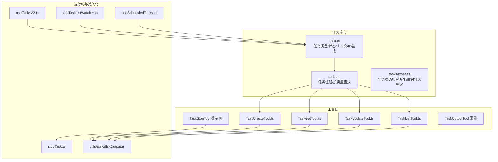
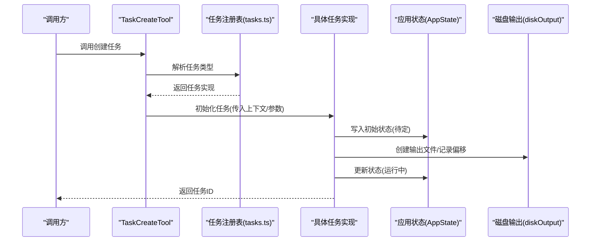
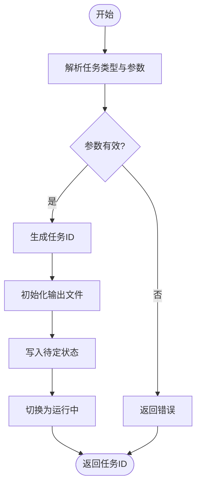
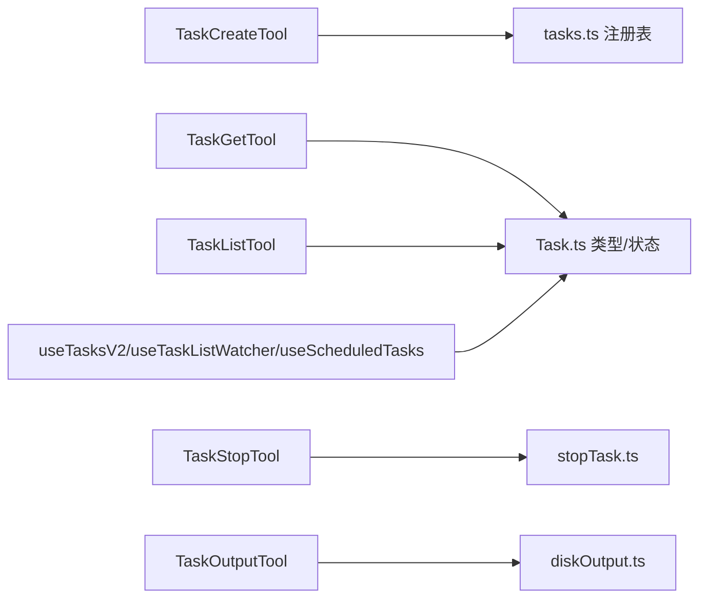

# 任务管理工具

<cite>
**本文引用的文件**
- [Task.ts](file://src/Task.ts)
- [tasks.ts](file://src/tasks.ts)
- [types.ts](file://src/tasks/types.ts)
- [stopTask.ts](file://src/tasks/stopTask.ts)
- [TaskCreateTool.ts](file://src/tools/TaskCreateTool/TaskCreateTool.ts)
- [TaskCreateTool 常量](file://src/tools/TaskCreateTool/constants.ts)
- [TaskCreateTool 提示词](file://src/tools/TaskCreateTool/prompt.ts)
- [TaskGetTool.ts](file://src/tools/TaskGetTool/TaskGetTool.ts)
- [TaskGetTool 常量](file://src/tools/TaskGetTool/constants.ts)
- [TaskUpdateTool.ts](file://src/tools/TaskUpdateTool/TaskUpdateTool.ts)
- [TaskListTool.ts](file://src/tools/TaskListTool/TaskListTool.ts)
- [TaskStopTool 提示词](file://src/tools/TaskStopTool/prompt.ts)
- [TaskOutputTool 常量](file://src/tools/TaskOutputTool/constants.ts)
- [useTasksV2.ts](file://src/hooks/useTasksV2.ts)
- [useTaskListWatcher.ts](file://src/hooks/useTaskListWatcher.ts)
- [useScheduledTasks.ts](file://src/hooks/useScheduledTasks.ts)
- [diskOutput.ts](file://src/utils/task/diskOutput.ts)
</cite>

## 目录
1. [简介](#简介)
2. [项目结构](#项目结构)
3. [核心组件](#核心组件)
4. [架构总览](#架构总览)
5. [详细组件分析](#详细组件分析)
6. [依赖关系分析](#依赖关系分析)
7. [性能考量](#性能考量)
8. [故障排查指南](#故障排查指南)
9. [结论](#结论)
10. [附录](#附录)

## 简介
本文件为任务管理工具的完整参考文档，聚焦于以下工具：TaskCreateTool（任务创建）、TaskGetTool（任务获取）、TaskUpdateTool（任务更新）、TaskListTool（任务列表）、TaskStopTool（任务停止）与 TaskOutputTool（任务输出）。文档从系统架构、数据模型、生命周期管理、并发控制、调度与优先级、依赖关系、持久化与错误恢复、超时处理、监控与进度报告到性能优化与复杂编排场景进行深入解析，并提供可视化图示帮助理解。

## 项目结构
围绕任务管理的核心代码分布在如下模块：
- 任务基础类型与工具注册：Task.ts、tasks.ts、tasks/types.ts
- 工具实现：TaskCreateTool、TaskGetTool、TaskUpdateTool、TaskListTool、TaskStopTool、TaskOutputTool
- 任务钩子与观察器：useTasksV2.ts、useTaskListWatcher.ts、useScheduledTasks.ts
- 任务停止与清理：stopTask.ts
- 输出持久化：utils/task/diskOutput.ts

图表来源
- [Task.ts:1-126](file://src/Task.ts#L1-L126)
- [tasks.ts:1-40](file://src/tasks.ts#L1-L40)
- [tasks/types.ts:1-47](file://src/tasks/types.ts#L1-L47)
- [TaskCreateTool.ts](file://src/tools/TaskCreateTool/TaskCreateTool.ts)
- [TaskGetTool.ts](file://src/tools/TaskGetTool/TaskGetTool.ts)
- [TaskUpdateTool.ts](file://src/tools/TaskUpdateTool/TaskUpdateTool.ts)
- [TaskListTool.ts](file://src/tools/TaskListTool/TaskListTool.ts)
- [TaskStopTool 提示词:1-8](file://src/tools/TaskStopTool/prompt.ts#L1-L8)
- [TaskOutputTool 常量:1-1](file://src/tools/TaskOutputTool/constants.ts#L1-L1)
- [useTasksV2.ts](file://src/hooks/useTasksV2.ts)
- [useTaskListWatcher.ts](file://src/hooks/useTaskListWatcher.ts)
- [useScheduledTasks.ts](file://src/hooks/useScheduledTasks.ts)
- [stopTask.ts](file://src/tasks/stopTask.ts)
- [diskOutput.ts](file://src/utils/task/diskOutput.ts)

章节来源
- [Task.ts:1-126](file://src/Task.ts#L1-L126)
- [tasks.ts:1-40](file://src/tasks.ts#L1-L40)
- [tasks/types.ts:1-47](file://src/tasks/types.ts#L1-L47)

## 核心组件
- 任务类型与状态
  - 任务类型：本地 Shell、本地 Agent、远程 Agent、在制队友、本地工作流、监控 MCP、梦境任务等。
  - 任务状态：待定、运行中、已完成、失败、被终止。
  - 终止态判断：用于避免对已完成/失败/被终止的任务继续注入消息或清理路径。
- 任务上下文与句柄
  - 上下文包含 AbortController、获取应用状态与设置应用状态的回调。
  - 句柄包含任务 ID 与可选清理函数。
- 任务状态基线字段
  - 包含任务 ID、类型、状态、描述、工具调用 ID、开始时间、结束时间、暂停累计毫秒数、输出文件路径、输出偏移、是否已通知等。
- 任务 ID 生成
  - 按任务类型分配前缀，使用安全随机字节生成唯一 ID，兼顾向后兼容与抗符号链接暴力破解。
- 任务注册与按类型查找
  - getAllTasks 返回可用任务集合；getTaskByType 按类型查找对应任务实现。

章节来源
- [Task.ts:6-29](file://src/Task.ts#L6-L29)
- [Task.ts:31-57](file://src/Task.ts#L31-L57)
- [Task.ts:108-125](file://src/Task.ts#L108-L125)
- [Task.ts:98-106](file://src/Task.ts#L98-L106)
- [tasks.ts:22-39](file://src/tasks.ts#L22-L39)

## 架构总览
任务管理采用“任务类型 + 工具接口 + 运行时钩子”的分层设计：
- 类型层：定义任务类型、状态与通用字段，确保跨任务的一致性。
- 工具层：通过工具封装任务生命周期操作（创建、获取、更新、列出、停止、输出），面向外部调用者暴露统一接口。
- 运行时层：通过钩子订阅任务列表变化、调度与监控任务，结合持久化输出实现可观测与可恢复。

图表来源
- [TaskCreateTool.ts](file://src/tools/TaskCreateTool/TaskCreateTool.ts)
- [tasks.ts:22-39](file://src/tasks.ts#L22-L39)
- [Task.ts:38-42](file://src/Task.ts#L38-L42)
- [diskOutput.ts](file://src/utils/task/diskOutput.ts)

## 详细组件分析

### TaskCreateTool（任务创建）
- 功能概述
  - 接收任务类型、描述、可选超时、工具调用 ID、代理 ID 等参数，创建并启动任务。
  - 通过任务注册表按类型定位具体实现，初始化任务状态，写入输出文件，返回任务 ID。
- 关键流程
  - 参数校验与默认值填充。
  - 生成任务 ID 并创建输出文件。
  - 将任务放入待定状态，随后进入运行中。
  - 记录开始时间、输出偏移与通知标记。
- 并发与安全
  - 使用 AbortController 支持取消。
  - 任务 ID 使用安全随机生成，避免冲突与攻击面。
- 错误处理
  - 对无效类型、参数缺失、IO 失败等情况返回明确错误信息。
- 性能建议
  - 合理设置超时，避免长时间阻塞。
  - 批量创建时合并状态更新以减少渲染抖动。

图表来源
- [TaskCreateTool.ts](file://src/tools/TaskCreateTool/TaskCreateTool.ts)
- [Task.ts:98-106](file://src/Task.ts#L98-L106)
- [Task.ts:108-125](file://src/Task.ts#L108-L125)
- [diskOutput.ts](file://src/utils/task/diskOutput.ts)

章节来源
- [TaskCreateTool.ts](file://src/tools/TaskCreateTool/TaskCreateTool.ts)
- [TaskCreateTool 常量:1-1](file://src/tools/TaskCreateTool/constants.ts#L1-L1)
- [TaskCreateTool 提示词:1-1](file://src/tools/TaskCreateTool/prompt.ts#L1-L1)
- [Task.ts:98-106](file://src/Task.ts#L98-L106)
- [Task.ts:108-125](file://src/Task.ts#L108-L125)

### TaskGetTool（任务获取）
- 功能概述
  - 根据任务 ID 获取任务当前状态、描述、时间戳、输出位置等信息。
- 实现要点
  - 读取应用状态中的任务条目，返回只读视图。
  - 对不存在的任务返回明确错误码。
- 使用建议
  - 在轮询场景中注意频率控制，避免过度查询。

章节来源
- [TaskGetTool.ts](file://src/tools/TaskGetTool/TaskGetTool.ts)
- [TaskGetTool 常量:1-1](file://src/tools/TaskGetTool/constants.ts#L1-L1)

### TaskUpdateTool（任务更新）
- 功能概述
  - 允许外部调用更新任务描述、元数据或触发特定状态变更（如暂停/恢复）。
- 实现要点
  - 通过上下文写入应用状态，保证一致性。
  - 对不支持的更新组合进行拒绝并返回错误。

章节来源
- [TaskUpdateTool.ts](file://src/tools/TaskUpdateTool/TaskUpdateTool.ts)

### TaskListTool（任务列表）
- 功能概述
  - 列出所有正在运行或待定的任务，支持过滤与排序。
- 实现要点
  - 基于后台任务判定逻辑筛选显示项。
  - 结合钩子实时刷新列表。

章节来源
- [TaskListTool.ts](file://src/tools/TaskListTool/TaskListTool.ts)
- [tasks/types.ts:31-46](file://src/tasks/types.ts#L31-L46)

### TaskStopTool（任务停止）
- 功能概述
  - 停止指定 ID 的运行中任务，支持强制终止与资源回收。
- 实现要点
  - 通过 AbortController 触发取消。
  - 调用统一停止入口，确保清理流程一致。
- 安全性
  - 仅允许停止运行中任务，防止对已完成/失败任务重复终止。

章节来源
- [TaskStopTool 提示词:1-8](file://src/tools/TaskStopTool/prompt.ts#L1-L8)
- [stopTask.ts](file://src/tasks/stopTask.ts)

### TaskOutputTool（任务输出）
- 功能概述
  - 读取任务输出文件内容，支持偏移增量拉取与尾部追加监控。
- 实现要点
  - 基于任务输出文件路径与偏移量实现增量读取。
  - 配合钩子实现输出变更通知。

章节来源
- [TaskOutputTool 常量:1-1](file://src/tools/TaskOutputTool/constants.ts#L1-L1)
- [diskOutput.ts](file://src/utils/task/diskOutput.ts)

## 依赖关系分析
- 任务类型与状态
  - 任务类型与状态在 Task.ts 中集中定义，供工具与运行时共享。
  - 任务状态联合类型在 tasks/types.ts 中声明，便于 UI 与业务逻辑统一处理。
- 工具与任务实现
  - 工具通过 tasks.ts 的注册表按类型查找具体任务实现，解耦工具与实现细节。
- 运行时钩子
  - useTasksV2.ts、useTaskListWatcher.ts、useScheduledTasks.ts 提供任务列表监听、后台任务导航与定时任务调度能力。
- 停止与清理
  - stopTask.ts 提供统一停止入口，确保 AbortController 与资源回收的一致性。

图表来源
- [tasks.ts:22-39](file://src/tasks.ts#L22-L39)
- [Task.ts:6-29](file://src/Task.ts#L6-L29)
- [Task.ts:38-42](file://src/Task.ts#L38-L42)
- [stopTask.ts](file://src/tasks/stopTask.ts)
- [diskOutput.ts](file://src/utils/task/diskOutput.ts)
- [useTasksV2.ts](file://src/hooks/useTasksV2.ts)
- [useTaskListWatcher.ts](file://src/hooks/useTaskListWatcher.ts)
- [useScheduledTasks.ts](file://src/hooks/useScheduledTasks.ts)

章节来源
- [tasks.ts:22-39](file://src/tasks.ts#L22-L39)
- [Task.ts:6-29](file://src/Task.ts#L6-L29)
- [Task.ts:38-42](file://src/Task.ts#L38-L42)
- [stopTask.ts](file://src/tasks/stopTask.ts)
- [diskOutput.ts](file://src/utils/task/diskOutput.ts)
- [useTasksV2.ts](file://src/hooks/useTasksV2.ts)
- [useTaskListWatcher.ts](file://src/hooks/useTaskListWatcher.ts)
- [useScheduledTasks.ts](file://src/hooks/useScheduledTasks.ts)

## 性能考量
- 任务生命周期管理
  - 使用统一的状态机与终止态判断，避免对已完成任务的无效操作。
- 并发控制
  - 通过 AbortController 控制任务取消，避免资源泄漏。
  - 批量任务创建时合并状态更新，降低渲染压力。
- 调度与优先级
  - 利用钩子与调度器实现任务队列与优先级调度，避免高优先级任务阻塞低优先级任务。
- 依赖关系处理
  - 通过任务间依赖声明与完成回调，实现串行/并行组合，减少等待时间。
- 持久化与 IO
  - 输出文件采用偏移增量写入，减少全量读取开销。
- 监控与进度报告
  - 通过钩子周期性读取输出文件，上报进度与日志，便于用户感知。
- 超时与重试
  - 为长耗时任务设置合理超时，失败时自动重试并记录错误上下文。
- 编排与批处理
  - 使用工作流任务与批量工具，将多个小任务聚合为大任务，提升吞吐。

## 故障排查指南
- 任务无法停止
  - 检查任务状态是否仍为运行中；确认 AbortController 是否被正确传递。
  - 查看停止入口是否被调用。
- 输出为空或不更新
  - 校验输出文件路径与偏移量；确认工具是否正确写入增量内容。
  - 检查钩子是否正常触发输出读取。
- 任务状态异常
  - 检查状态转换是否符合终止态判断；避免对已完成任务重复操作。
- 资源泄漏
  - 确认任务句柄的清理函数是否被调用；检查输出文件句柄是否关闭。

章节来源
- [Task.ts:27-29](file://src/Task.ts#L27-L29)
- [Task.ts:31-34](file://src/Task.ts#L31-L34)
- [TaskStopTool 提示词:1-8](file://src/tools/TaskStopTool/prompt.ts#L1-L8)
- [diskOutput.ts](file://src/utils/task/diskOutput.ts)

## 结论
该任务管理工具体系以类型与状态为中心，通过工具层封装任务生命周期操作，借助运行时钩子实现可观测与可恢复的执行环境。配合统一的停止入口、持久化输出与调度机制，能够支撑复杂任务编排与批量处理场景。建议在生产环境中结合超时、重试与监控策略，持续优化性能与稳定性。

## 附录
- 术语
  - 任务类型：任务执行的类别标识（如本地 Shell、本地 Agent 等）。
  - 任务状态：任务在生命周期内的阶段（待定、运行中、已完成、失败、被终止）。
  - 终止态：不可再发生状态转移的状态集合。
  - 输出文件：任务执行产生的持久化输出，支持偏移增量读取。
- 最佳实践
  - 明确任务超时与重试策略，避免无限等待。
  - 使用工作流与批量工具合并相似任务，提升吞吐。
  - 通过钩子实现输出监控与进度上报，增强用户体验。
  - 对关键任务启用持久化与审计日志，便于回溯与诊断。