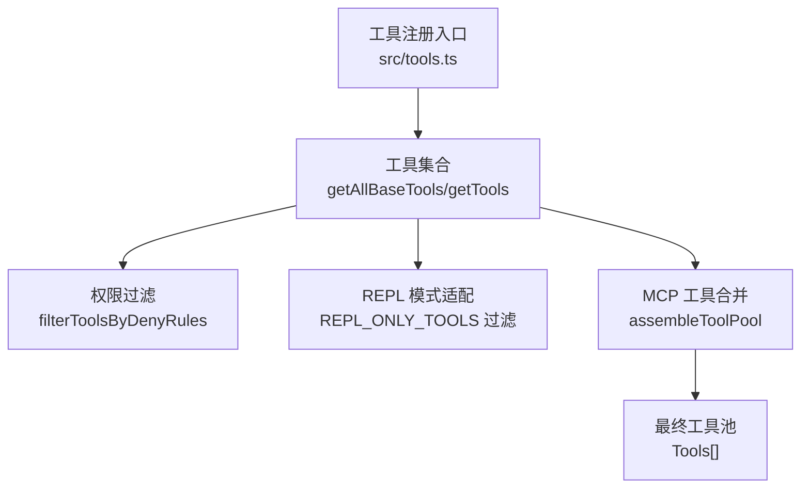
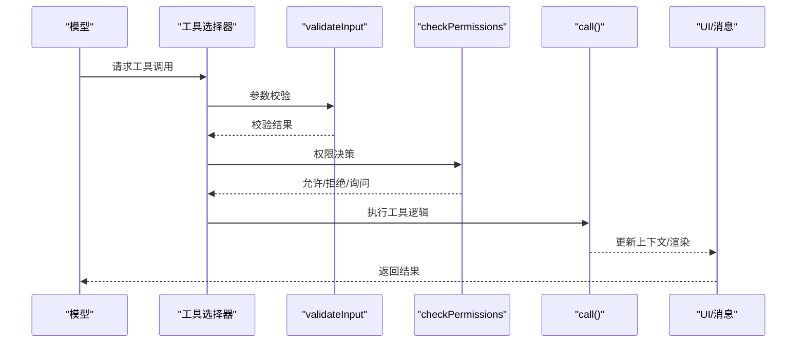
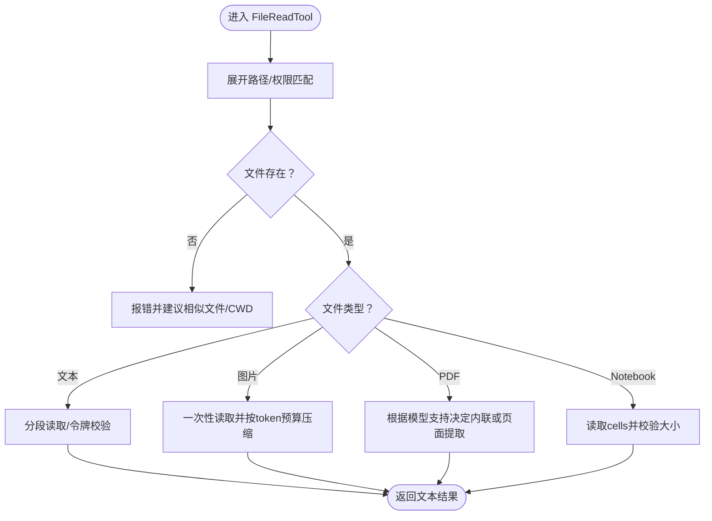
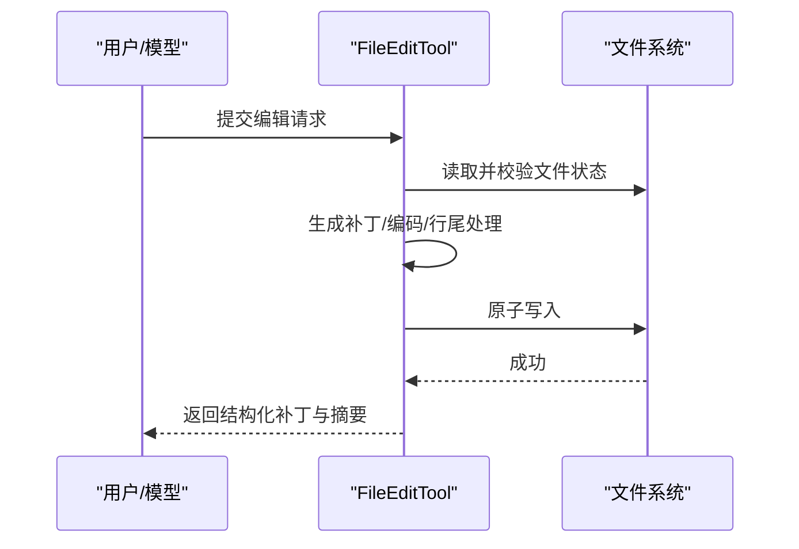
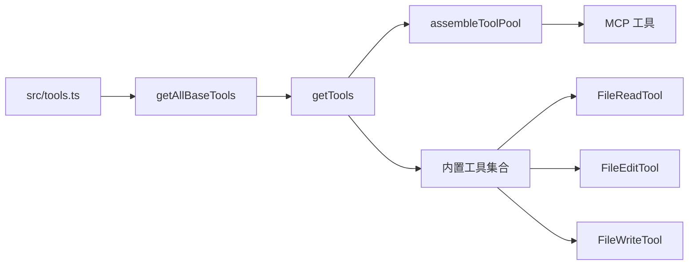

# 内置工具参考

<cite>
**本文档引用的文件**
- [src/Tool.ts](file://src/Tool.ts)
- [src/tools.ts](file://src/tools.ts)
- [src/tools/FileReadTool/FileReadTool.ts](file://src/tools/FileReadTool/FileReadTool.ts)
- [src/tools/FileEditTool/FileEditTool.ts](file://src/tools/FileEditTool/FileEditTool.ts)
- [src/tools/FileWriteTool/FileWriteTool.ts](file://src/tools/FileWriteTool/FileWriteTool.ts)
- [src/tools/BashTool/BashTool.ts](file://src/tools/BashTool/BashTool.ts)
- [src/tools/WebFetchTool/WebFetchTool.ts](file://src/tools/WebFetchTool/WebFetchTool.ts)
- [src/tools/WebSearchTool/WebSearchTool.ts](file://src/tools/WebSearchTool/WebSearchTool.ts)
- [src/tools/TaskCreateTool/TaskCreateTool.ts](file://src/tools/TaskCreateTool/TaskCreateTool.ts)
- [src/tools/TaskGetTool/TaskGetTool.ts](file://src/tools/TaskGetTool/TaskGetTool.ts)
- [src/tools/TaskUpdateTool/TaskUpdateTool.ts](file://src/tools/TaskUpdateTool/TaskUpdateTool.ts)
- [src/tools/TaskListTool/TaskListTool.ts](file://src/tools/TaskListTool/TaskListTool.ts)
- [src/tools/TaskStopTool/TaskStopTool.ts](file://src/tools/TaskStopTool/TaskStopTool.ts)
- [src/tools/AgentTool/AgentTool.ts](file://src/tools/AgentTool/AgentTool.ts)
- [src/tools/ConfigTool/ConfigTool.ts](file://src/tools/ConfigTool/ConfigTool.ts)
- [src/tools/SkillTool/SkillTool.ts](file://src/tools/SkillTool/SkillTool.ts)
</cite>

## 目录
1. [简介](#简介)
2. [项目结构](#项目结构)
3. [核心组件](#核心组件)
4. [架构总览](#架构总览)
5. [详细组件分析](#详细组件分析)
6. [依赖关系分析](#依赖关系分析)
7. [性能考量](#性能考量)
8. [故障排查指南](#故障排查指南)
9. [结论](#结论)

## 简介
本参考文档面向 free-code 的内置工具体系，系统性梳理并说明以下工具类别与能力边界：文件操作工具（FileReadTool、FileEditTool、FileWriteTool）、命令执行工具（BashTool）、网络工具（WebFetchTool、WebSearchTool）、任务管理工具（TaskCreateTool、TaskGetTool、TaskUpdateTool、TaskListTool、TaskStopTool）、代理工具（AgentTool）、配置工具（ConfigTool）与技能工具（SkillTool）。文档覆盖各工具的功能定位、输入参数、输出结构、权限与安全限制、错误处理策略、UI 渲染与摘要展示、并发与只读特性、以及典型组合使用场景与最佳实践。

## 项目结构
- 工具注册与装配
  - 工具清单由统一入口集中注册与过滤，支持按权限上下文动态筛选、按 REPL 模式隐藏原始工具、按特性开关启用/禁用特定工具，并与 MCP 工具合并去重。
  - 关键入口：[src/tools.ts](file://src/tools.ts)
- 工具基类与协议
  - 所有工具遵循统一的 Tool 接口规范，定义输入/输出模式、权限校验、并发安全、UI 渲染、摘要与活动描述等扩展点。
  - 基类与协议：[src/Tool.ts](file://src/Tool.ts)

图表来源
- [src/tools.ts:193-367](file://src/tools.ts#L193-L367)

章节来源
- [src/tools.ts:193-367](file://src/tools.ts#L193-L367)
- [src/Tool.ts:362-695](file://src/Tool.ts#L362-L695)

## 核心组件
- 工具接口与生命周期
  - 输入/输出模式：通过 Zod 或 JSON Schema 定义严格输入输出结构，支持延迟求值与运行时回填。
  - 权限与校验：validateInput + checkPermissions 双层校验；支持通配匹配器与规则匹配。
  - 并发与只读：isConcurrencySafe/isReadOnly/isDestructive 控制并发安全与破坏性行为。
  - UI 与摘要：renderToolUseMessage/renderToolResultMessage/extractSearchText 提供一致的 UI 表达与可检索文本。
  - 结果映射：mapToolResultToToolResultBlockParam 将内部结果映射为模型消息块。
- 工具池装配
  - getTools：按环境与权限过滤内置工具。
  - assembleToolPool：内置工具与 MCP 工具合并，保持内置工具前缀顺序以稳定提示缓存。
  - getMergedTools：返回包含 MCP 的完整工具集。

章节来源
- [src/Tool.ts:362-695](file://src/Tool.ts#L362-L695)
- [src/tools.ts:271-389](file://src/tools.ts#L271-L389)

## 架构总览
- 工具调用链路
  - 模型请求 → 工具选择与权限校验 → validateInput → 用户交互（必要时）→ checkPermissions → 调用 call → 更新上下文/状态 → 渲染 UI/消息 → 返回结果。
- 安全与权限
  - 统一的 ToolPermissionContext 提供权限模式、附加工作目录、允许/拒绝规则、自动模式可用性等。
  - 文件系统工具支持路径展开、UNC 路径安全、设备文件阻断、二进制文件限制、PDF/图片读取阈值与压缩策略。
- 并发与一致性
  - 文件写入采用“读取-校验-原子写入”流程，避免竞态；编辑工具支持行尾与编码保留、LSP 通知、VSCode Diff 通知。

图表来源
- [src/Tool.ts:379-385](file://src/Tool.ts#L379-L385)
- [src/tools.ts:271-327](file://src/tools.ts#L271-L327)

## 详细组件分析

### 文件读取工具：FileReadTool
- 功能概述
  - 支持文本、图片、PDF、Jupyter Notebook 多种格式读取；对超大文件进行分段读取或页面提取；对图片按 token 预算进行压缩；对 PDF 在不支持模型上进行页面提取。
- 输入参数
  - file_path：绝对路径
  - offset：起始行号（用于大文件分段）
  - limit：读取行数
  - pages：PDF 页面范围（如 "1-5"、"3"）
- 输出结构
  - 文本：包含文件路径、内容、行数统计、起止行号
  - 图片：base64 数据、MIME 类型、原尺寸与显示尺寸
  - Notebook：cells 数组
  - PDF：base64 数据与原大小；或页面提取结果（多图）
  - 未变更：当内容未变时返回“文件未变更”占位
- 错误处理
  - 路径不存在：提供相似文件建议与 CWD 提示
  - 设备文件阻断：/dev/zero、/dev/random 等
  - 二进制文件：除 PDF/图片/SVG 外禁止读取
  - PDF：超过阈值或页数限制时报错；不支持模型时提示升级或使用 pages 参数
- 安全与权限
  - 路径展开与权限规则匹配；UNC 路径仅做规则检查，不立即访问
  - 自动记忆文件时间戳与新鲜度提示
- 性能与限制
  - 令牌上限与字节上限双重控制；图片按 token 预算压缩；Notebook 体积过大给出替代命令
- 使用示例
  - 读取大文件分段：offset=1001, limit=200
  - 读取 PDF 指定页：pages="1-5"
  - 读取图片并压缩：自动按 token 预算调整分辨率与质量

图表来源
- [src/tools/FileReadTool/FileReadTool.ts:496-1086](file://src/tools/FileReadTool/FileReadTool.ts#L496-L1086)

章节来源
- [src/tools/FileReadTool/FileReadTool.ts:227-335](file://src/tools/FileReadTool/FileReadTool.ts#L227-L335)
- [src/tools/FileReadTool/FileReadTool.ts:395-495](file://src/tools/FileReadTool/FileReadTool.ts#L395-L495)
- [src/tools/FileReadTool/FileReadTool.ts:496-1086](file://src/tools/FileReadTool/FileReadTool.ts#L496-L1086)

### 文件编辑工具：FileEditTool
- 功能概述
  - 在已读取文件基础上进行字符串替换，支持“全部替换”与“单次替换”，自动处理换行与引号风格，生成结构化补丁并通知 LSP/VSCode。
- 输入参数
  - file_path：目标文件绝对路径
  - old_string：要被替换的字符串
  - new_string：新内容
  - replace_all：是否替换全部匹配项
- 输出结构
  - filePath、oldString、newString、originalFile、structuredPatch、userModified、replaceAll、gitDiff（可选）
- 错误处理
  - 无变化、路径被拒、文件不存在、非文本（.ipynb）、未读取即写、文件被意外修改、多处匹配但未开启 replace_all、设置文件内容校验失败
- 安全与权限
  - UNC 路径跳过 FS 操作；团队记忆敏感内容检测；路径展开与权限匹配
- 并发与一致性
  - 读取-校验-原子写入；写后更新 readFileState 时间戳；触发 LSP didChange/didSave；VSCode Diff 通知
- 使用示例
  - 替换单个实例：replace_all=false，提供足够上下文
  - 全部替换：replace_all=true

图表来源
- [src/tools/FileEditTool/FileEditTool.ts:387-574](file://src/tools/FileEditTool/FileEditTool.ts#L387-L574)

章节来源
- [src/tools/FileEditTool/FileEditTool.ts:137-362](file://src/tools/FileEditTool/FileEditTool.ts#L137-L362)
- [src/tools/FileEditTool/FileEditTool.ts:387-574](file://src/tools/FileEditTool/FileEditTool.ts#L387-L574)

### 文件写入工具：FileWriteTool
- 功能概述
  - 直接覆盖写入文件，要求文件必须已读取且未被外部修改；写入后通知 LSP/VSCode 并记录差异。
- 输入参数
  - file_path：绝对路径
  - content：完整新内容（含期望的行结尾）
- 输出结构
  - type（create/update）、filePath、content、structuredPatch、originalFile、gitDiff（可选）
- 错误处理
  - 未读取即写、文件被意外修改、路径被拒、团队记忆敏感内容
- 安全与权限
  - UNC 路径跳过 FS 操作；路径展开与权限匹配
- 使用示例
  - 覆盖写入：提供完整 content
  - 新建文件：确保目标路径不存在旧文件

章节来源
- [src/tools/FileWriteTool/FileWriteTool.ts:56-91](file://src/tools/FileWriteTool/FileWriteTool.ts#L56-L91)
- [src/tools/FileWriteTool/FileWriteTool.ts:153-222](file://src/tools/FileWriteTool/FileWriteTool.ts#L153-L222)
- [src/tools/FileWriteTool/FileWriteTool.ts:223-417](file://src/tools/FileWriteTool/FileWriteTool.ts#L223-L417)

### 命令执行工具：BashTool
- 功能概述
  - 在受控环境中执行 shell 命令，支持令牌与大小限制、进度回调、中断行为、只读与破坏性标记。
- 输入参数
  - 命令字符串（具体字段名以实现为准）
- 输出结构
  - 命令执行结果（标准输出/错误、退出码、耗时等）
- 安全与权限
  - 严格的权限校验与规则匹配；支持只读/破坏性标记；可配置中断行为
- 使用示例
  - 列出文件：ls -la
  - 搜索内容：grep "pattern" *.txt

章节来源
- [src/tools/BashTool/BashTool.ts](file://src/tools/BashTool/BashTool.ts)
- [src/Tool.ts:402-416](file://src/Tool.ts#L402-L416)

### 网络工具：WebFetchTool、WebSearchTool
- WebFetchTool
  - 功能：抓取指定 URL 的网页内容，支持令牌与大小限制、错误处理与内容类型识别。
  - 输入参数：URL、可选 headers、超时等
  - 输出结构：文本内容、元数据、错误信息
  - 安全与权限：需遵循权限规则与反爬策略
- WebSearchTool
  - 功能：基于搜索引擎进行关键词检索，返回摘要与链接列表
  - 输入参数：查询词、结果数量、语言区域等
  - 输出结构：结果列表（标题、摘要、链接）
  - 安全与权限：需遵循权限规则与服务端限制

章节来源
- [src/tools/WebFetchTool/WebFetchTool.ts](file://src/tools/WebFetchTool/WebFetchTool.ts)
- [src/tools/WebSearchTool/WebSearchTool.ts](file://src/tools/WebSearchTool/WebSearchTool.ts)

### 任务管理工具：TaskCreateTool、TaskGetTool、TaskUpdateTool、TaskListTool、TaskStopTool
- TaskCreateTool
  - 创建新任务，返回任务标识与初始状态
- TaskGetTool
  - 获取指定任务详情
- TaskUpdateTool
  - 更新任务状态/参数
- TaskListTool
  - 列举当前会话或全局任务
- TaskStopTool
  - 停止运行中的任务
- 安全与权限
  - 任务操作需具备相应权限；支持中断行为与并发控制

章节来源
- [src/tools/TaskCreateTool/TaskCreateTool.ts](file://src/tools/TaskCreateTool/TaskCreateTool.ts)
- [src/tools/TaskGetTool/TaskGetTool.ts](file://src/tools/TaskGetTool/TaskGetTool.ts)
- [src/tools/TaskUpdateTool/TaskUpdateTool.ts](file://src/tools/TaskUpdateTool/TaskUpdateTool.ts)
- [src/tools/TaskListTool/TaskListTool.ts](file://src/tools/TaskListTool/TaskListTool.ts)
- [src/tools/TaskStopTool/TaskStopTool.ts](file://src/tools/TaskStopTool/TaskStopTool.ts)

### 代理工具：AgentTool
- 功能概述
  - 管理与调度代理，支持代理定义加载、颜色管理、UI 展示与交互
- 输入参数
  - 代理名称/别名、参数映射等
- 输出结构
  - 代理执行结果与消息流
- 安全与权限
  - 代理工具需遵循统一权限规则与 UI 交互约束

章节来源
- [src/tools/AgentTool/AgentTool.ts](file://src/tools/AgentTool/AgentTool.ts)

### 配置工具：ConfigTool
- 功能概述
  - 在特定构建（如 ant）中提供配置读取/写入能力，支持严格模式与 UI 渲染
- 输入参数
  - 配置键、值、作用域等
- 输出结构
  - 配置读取/写入结果与消息

章节来源
- [src/tools/ConfigTool/ConfigTool.ts](file://src/tools/ConfigTool/ConfigTool.ts)

### 技能工具：SkillTool
- 功能概述
  - 管理与发现技能目录，支持条件激活与动态加载
- 输入参数
  - 技能名称/路径、触发条件等
- 输出结构
  - 技能加载状态与可用技能列表

章节来源
- [src/tools/SkillTool/SkillTool.ts](file://src/tools/SkillTool/SkillTool.ts)

## 依赖关系分析
- 工具注册与装配
  - 工具清单集中于 [src/tools.ts](file://src/tools.ts)，通过 getAllBaseTools 组合内置工具，再经 getTools 过滤权限与 REPL 模式，最后与 MCP 工具合并。
- 工具基类与协议
  - 所有工具实现遵循 [src/Tool.ts](file://src/Tool.ts) 中的 Tool 接口，统一输入/输出、权限、UI、摘要与活动描述等扩展点。
- 文件工具链
  - FileReadTool 与 FileEditTool/FileWriteTool 共享 readFileState 与路径展开策略，保证读写一致性与去重优化。

图表来源
- [src/tools.ts:193-367](file://src/tools.ts#L193-L367)

章节来源
- [src/tools.ts:193-367](file://src/tools.ts#L193-L367)
- [src/Tool.ts:362-695](file://src/Tool.ts#L362-L695)

## 性能考量
- 令牌与大小限制
  - 文件读取工具对文本/图片/PDF 设置最大令牌数与最大字节数，避免内存与传输压力。
- 去重与缓存
  - FileReadTool 对未变更文件返回“文件未变更”占位，减少重复传输与缓存开销。
- 压缩与降采样
  - 图片读取按 token 预算进行降采样与压缩，必要时回退到低质量 JPEG。
- 合并去重
  - 工具池按名称去重，内置工具优先，保证提示缓存稳定性。

## 故障排查指南
- 文件读取
  - “文件不存在”：检查路径是否正确、是否在 CWD 下、是否存在相似文件名；macOS 截图文件的空格字符差异。
  - “超出令牌上限”：使用 offset/limit 分段读取或 pages 参数缩小范围。
  - “设备文件阻断”：避免读取 /dev/zero、/dev/random 等。
- 文件编辑/写入
  - “文件未读取即写”：先调用 FileReadTool 读取目标文件。
  - “文件被意外修改”：重新读取后再写入。
  - “多处匹配但未开启 replace_all”：提供更精确的 old_string 上下文或设置 replace_all=true。
- 网络工具
  - “抓取失败”：检查 URL、网络连通性、服务端限制与超时设置。
  - “搜索无结果”：调整关键词、语言区域或结果数量。
- 任务工具
  - “任务不存在/状态异常”：先使用 TaskListTool 查看任务列表，再用 TaskGetTool 获取详情。
- 代理/配置/技能工具
  - “权限不足”：检查权限规则与 UI 交互提示；必要时切换权限模式或调整规则。

章节来源
- [src/tools/FileReadTool/FileReadTool.ts:418-495](file://src/tools/FileReadTool/FileReadTool.ts#L418-L495)
- [src/tools/FileEditTool/FileEditTool.ts:137-362](file://src/tools/FileEditTool/FileEditTool.ts#L137-L362)
- [src/tools/FileWriteTool/FileWriteTool.ts:153-222](file://src/tools/FileWriteTool/FileWriteTool.ts#L153-L222)

## 结论
free-code 的内置工具体系以统一的 Tool 接口为核心，结合严格的权限与安全策略、完善的 UI 与摘要展示、以及针对不同场景的性能优化（令牌限制、图片压缩、文件去重），为复杂任务编排提供了高可靠、可审计、可扩展的能力基础。建议在实际使用中：
- 明确工具职责边界，优先使用 FileReadTool 作为前置读取步骤；
- 编辑/写入前确保文件已读取且未被外部修改；
- 对大文件与多媒体资源合理设置 offset/limit/pages；
- 在受限环境中谨慎使用 BashTool 与网络工具，配合权限规则与只读标记；
- 通过工具组合（如 FileReadTool + FileEditTool + TaskListTool）实现端到端自动化流程。