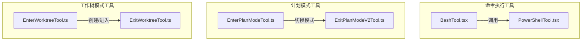
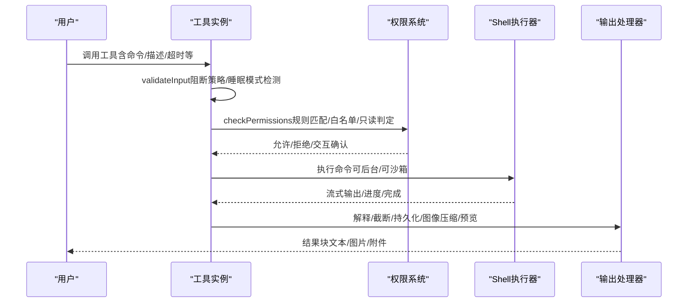
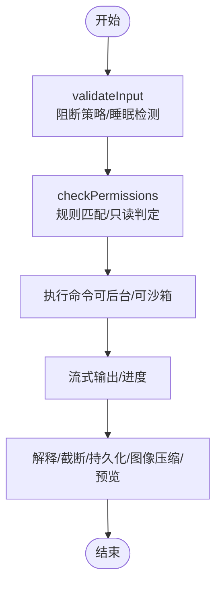
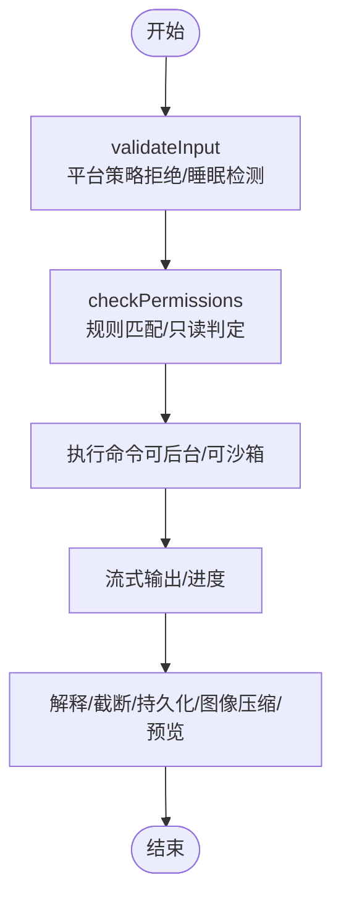
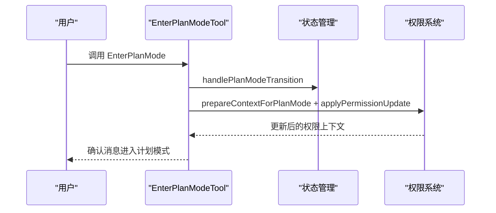
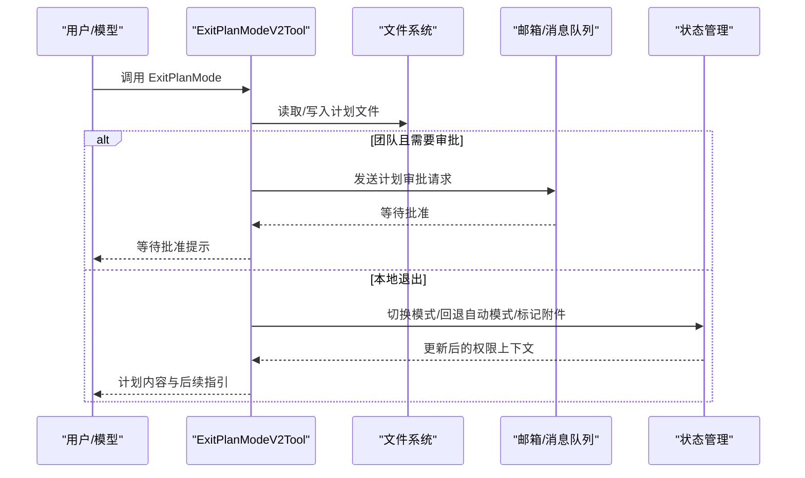
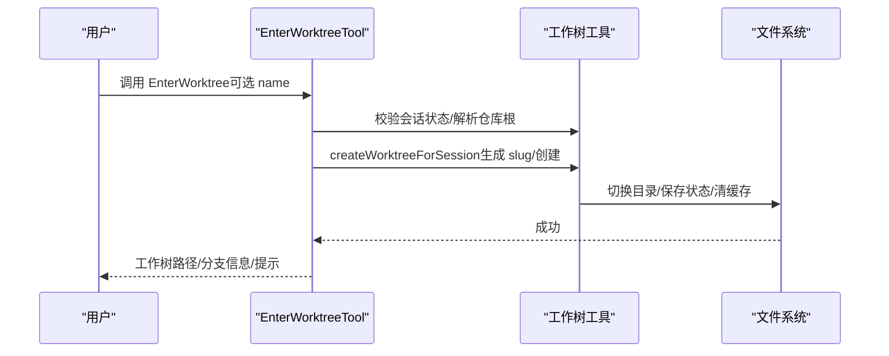
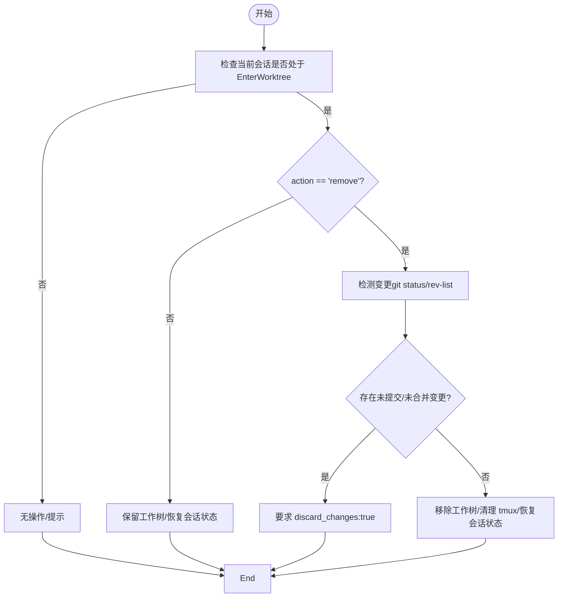
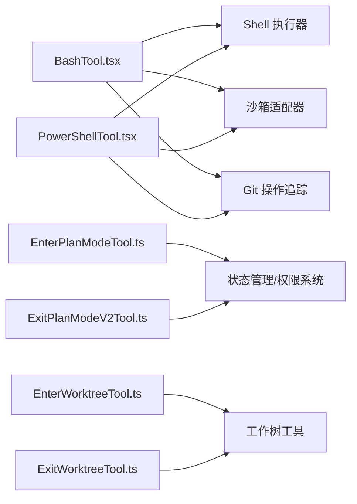

# 命令执行工具

<cite>
**本文引用的文件**
- [BashTool.tsx](file://src/tools/BashTool/BashTool.tsx)
- [PowerShellTool.tsx](file://src/tools/PowerShellTool/PowerShellTool.tsx)
- [EnterPlanModeTool.ts](file://src/tools/EnterPlanModeTool/EnterPlanModeTool.ts)
- [ExitPlanModeV2Tool.ts](file://src/tools/ExitPlanModeTool/ExitPlanModeV2Tool.ts)
- [EnterWorktreeTool.ts](file://src/tools/EnterWorktreeTool/EnterWorktreeTool.ts)
- [ExitWorktreeTool.ts](file://src/tools/ExitWorktreeTool/ExitWorktreeTool.ts)
- [constants.ts（EnterPlanMode）](file://src/tools/EnterPlanModeTool/constants.ts)
- [constants.ts（ExitPlanMode）](file://src/tools/ExitPlanModeTool/constants.ts)
- [constants.ts（EnterWorktree）](file://src/tools/EnterWorktreeTool/constants.ts)
- [constants.ts（ExitWorktree）](file://src/tools/ExitWorktreeTool/constants.ts)
</cite>

## 目录
1. [简介](#简介)
2. [项目结构](#项目结构)
3. [核心组件](#核心组件)
4. [架构总览](#架构总览)
5. [详细组件分析](#详细组件分析)
6. [依赖关系分析](#依赖关系分析)
7. [性能考量](#性能考量)
8. [故障排查指南](#故障排查指南)
9. [结论](#结论)
10. [附录](#附录)

## 简介
本文件为命令执行工具的完整参考文档，覆盖以下能力与主题：
- Bash 工具与 PowerShell 工具：功能、参数、安全机制、权限校验、沙箱策略、只读检测、后台任务与超时控制、输出截断与持久化、破坏性命令提示与调试技巧。
- 计划模式工具：EnterPlanMode 与 ExitPlanMode（V2），包括模式切换、权限请求、计划文件管理、团队协作审批流程。
- 工作树模式工具：EnterWorktree 与 ExitWorktree，包括工作树创建、作用域约束、变更检测、保留或移除、tmux 会话清理、会话状态恢复。
- 安全特性：路径与作用域验证、破坏性操作确认、只读模式检查、沙箱策略、平台限制（如 Windows 原生不支持沙箱）、通道限制（KAIROS/KAIROS_CHANNELS）。

## 项目结构
命令执行工具位于 src/tools 下，按功能模块划分：
- BashTool：Linux/macOS/WSL 环境下的通用 Shell 执行器，支持权限规则、只读检测、沙箱、后台任务、输出截断与持久化。
- PowerShellTool：Windows 环境下的 PowerShell 执行器，支持权限规则、只读检测、后台任务、输出截断与持久化，并对“企业策略要求沙箱但原生 Windows 不可用”的场景进行拒绝。
- EnterPlanModeTool / ExitPlanModeV2Tool：计划模式入口与出口，负责模式切换、权限上下文更新、计划文件读写、团队审批与自动模式回退。
- EnterWorktreeTool / ExitWorktreeTool：工作树模式入口与出口，负责工作树创建/清理、作用域约束、变更检测、tmux 清理、会话状态恢复。

**图表来源**
- [BashTool.tsx:420-800](file://src/tools/BashTool/BashTool.tsx#L420-L800)
- [PowerShellTool.tsx:272-662](file://src/tools/PowerShellTool/PowerShellTool.tsx#L272-L662)
- [EnterPlanModeTool.ts:36-126](file://src/tools/EnterPlanModeTool/EnterPlanModeTool.ts#L36-L126)
- [ExitPlanModeV2Tool.ts:147-493](file://src/tools/ExitPlanModeTool/ExitPlanModeV2Tool.ts#L147-L493)
- [EnterWorktreeTool.ts:52-127](file://src/tools/EnterWorktreeTool/EnterWorktreeTool.ts#L52-L127)
- [ExitWorktreeTool.ts:148-329](file://src/tools/ExitWorktreeTool/ExitWorktreeTool.ts#L148-L329)

**章节来源**
- [BashTool.tsx:1-1144](file://src/tools/BashTool/BashTool.tsx#L1-L1144)
- [PowerShellTool.tsx:1-1001](file://src/tools/PowerShellTool/PowerShellTool.tsx#L1-L1001)
- [EnterPlanModeTool.ts:1-127](file://src/tools/EnterPlanModeTool/EnterPlanModeTool.ts#L1-L127)
- [ExitPlanModeV2Tool.ts:1-494](file://src/tools/ExitPlanModeTool/ExitPlanModeV2Tool.ts#L1-L494)
- [EnterWorktreeTool.ts:1-128](file://src/tools/EnterWorktreeTool/EnterWorktreeTool.ts#L1-L128)
- [ExitWorktreeTool.ts:1-330](file://src/tools/ExitWorktreeTool/ExitWorktreeTool.ts#L1-L330)

## 核心组件
- BashTool：面向 POSIX 系统的命令执行器，具备输入校验、权限检查、只读判定、沙箱策略、后台任务、输出截断与持久化、错误语义解释、图像输出压缩、进度回调、大结果落盘与预览、代码索引工具使用统计、Git 操作追踪、破坏性命令提示等能力。
- PowerShellTool：面向 Windows 的命令执行器，具备输入校验、权限检查、只读判定、后台任务、输出截断与持久化、错误语义解释、图像输出压缩、进度回调、大结果落盘与预览、平台策略拒绝（企业策略要求沙箱且原生 Windows 不可用）、破坏性命令提示等能力。
- EnterPlanModeTool：将当前工具权限模式切换至“计划模式”，用于复杂任务的探索与设计；在特定通道下禁用以避免用户无法退出。
- ExitPlanModeV2Tool：将当前工具权限模式从“计划模式”退出，支持本地退出与团队审批两种路径，处理自动模式回退、附件标记、计划文件读取/写入、通知与 UI 提示。
- EnterWorktreeTool：在当前会话中创建隔离的工作树（git 或钩子包装），切换到该工作树并保存会话状态，清缓存与系统提示段，记录事件。
- ExitWorktreeTool：退出工作树会话，支持“保留”或“移除”两种动作；在移除前进行变更检测与确认，必要时要求 discard_changes 显式确认；清理 tmux 会话，恢复会话状态，记录事件。

**章节来源**
- [BashTool.tsx:420-800](file://src/tools/BashTool/BashTool.tsx#L420-L800)
- [PowerShellTool.tsx:272-662](file://src/tools/PowerShellTool/PowerShellTool.tsx#L272-L662)
- [EnterPlanModeTool.ts:36-126](file://src/tools/EnterPlanModeTool/EnterPlanModeTool.ts#L36-L126)
- [ExitPlanModeV2Tool.ts:147-493](file://src/tools/ExitPlanModeTool/ExitPlanModeV2Tool.ts#L147-L493)
- [EnterWorktreeTool.ts:52-127](file://src/tools/EnterWorktreeTool/EnterWorktreeTool.ts#L52-L127)
- [ExitWorktreeTool.ts:148-329](file://src/tools/ExitWorktreeTool/ExitWorktreeTool.ts#L148-L329)

## 架构总览
命令执行工具遵循统一的 Tool 接口规范，通过 buildTool 构建，支持：
- 输入/输出模式定义（Zod 懒加载 Schema）
- 权限检查与自动分类输入
- 只读判定与并发安全
- 用户界面消息渲染与进度回调
- 大输出落盘与预览
- 进程执行、中断、超时、后台任务注册
- 错误语义解释与日志事件上报

**图表来源**
- [BashTool.tsx:524-723](file://src/tools/BashTool/BashTool.tsx#L524-L723)
- [PowerShellTool.tsx:352-657](file://src/tools/PowerShellTool/PowerShellTool.tsx#L352-L657)

**章节来源**
- [BashTool.tsx:524-723](file://src/tools/BashTool/BashTool.tsx#L524-L723)
- [PowerShellTool.tsx:352-657](file://src/tools/PowerShellTool/PowerShellTool.tsx#L352-L657)

## 详细组件分析

### BashTool 组件分析
- 功能要点
  - 输入/输出模式：严格模式，支持命令、超时、描述、后台运行、危险地禁用沙箱等字段；根据环境动态隐藏后台运行字段。
  - 只读判定：基于命令解析与安全约束判断是否只读，影响并发安全与 UI 行为。
  - 权限检查：解析命令子序列，匹配安全规则与通配模式，支持复合命令的细粒度匹配。
  - 沙箱策略：根据设置与命令特征决定是否启用沙箱；支持危险地禁用沙箱。
  - 后台任务：长耗时命令自动后台化，支持用户手动后台化；提供任务 ID 与输出路径。
  - 输出处理：流式输出累积、截断、图像压缩、大结果落盘与预览、结构化内容、进度回调。
  - 错误处理：合并标准错误到标准输出，语义化解释非零退出码，支持中断与预生成错误。
  - Git 操作追踪与代码索引工具使用统计。
  - 睡眠阻断：检测长时间 sleep 并建议使用 Monitor 或后台运行。
- 参数说明（节选）
  - command：要执行的命令字符串
  - timeout：毫秒级超时（最大值受全局限制）
  - description：命令用途的简明描述
  - run_in_background：是否后台运行
  - dangerouslyDisableSandbox：是否禁用沙箱
  - _simulatedSedEdit：内部预计算的 sed 编辑结果（仅权限对话后生效）
- 安全机制
  - 作用域与只读：只读命令自动允许，破坏性命令需显式确认或权限许可。
  - 沙箱：默认启用，可通过设置与危险禁用开关调整。
  - 路径与工作目录：主进程线程外禁止更改 CWD，防止会话漂移。
  - 破坏性命令提示：对可能删除/修改关键文件/分支的操作给出明确提示。
- 最佳实践
  - 对长耗时命令使用 run_in_background，避免阻塞主线程。
  - 使用 description 提供清晰的意图描述，便于审计与复现。
  - 在需要时开启 dangerouslyDisableSandbox，但应充分评估风险。
  - 避免长时间 sleep，优先使用 Monitor 工具或后台任务。
- 调试技巧
  - 查看 persistedOutputPath 与 persistedOutputSize，结合 FileRead 工具查看完整输出。
  - 关注 returnCodeInterpretation 获取语义化解释。
  - 使用进度回调观察实时输出与耗时。

**图表来源**
- [BashTool.tsx:524-723](file://src/tools/BashTool/BashTool.tsx#L524-L723)
- [BashTool.tsx:624-800](file://src/tools/BashTool/BashTool.tsx#L624-L800)

**章节来源**
- [BashTool.tsx:227-296](file://src/tools/BashTool/BashTool.tsx#L227-L296)
- [BashTool.tsx:437-441](file://src/tools/BashTool/BashTool.tsx#L437-L441)
- [BashTool.tsx:539-541](file://src/tools/BashTool/BashTool.tsx#L539-L541)
- [BashTool.tsx:624-723](file://src/tools/BashTool/BashTool.tsx#L624-L723)
- [BashTool.tsx:724-800](file://src/tools/BashTool/BashTool.tsx#L724-L800)

### PowerShellTool 组件分析
- 功能要点
  - 输入/输出模式：严格模式，支持命令、超时、描述、后台运行、危险地禁用沙箱等字段；根据环境动态隐藏后台运行字段。
  - 只读判定：同步安全启发式与只读命令检测，最终以异步 AST 分析为准。
  - 权限检查：基于 PowerShell 规则与安全启发式进行匹配与判定。
  - 平台策略拒绝：当企业策略要求沙箱而原生 Windows 不支持时，直接拒绝执行。
  - 后台任务：长耗时命令自动后台化，支持用户手动后台化；提供任务 ID 与输出路径。
  - 输出处理：流式输出累积、截断、图像压缩、大结果落盘与预览、进度回调。
  - 错误处理：语义化解释非零退出码，支持中断与预生成错误。
  - 睡眠阻断：检测长时间 Start-Sleep/sleep 并建议使用 Monitor 或后台运行。
- 参数说明（节选）
  - command：要执行的 PowerShell 命令字符串
  - timeout：毫秒级超时（最大值受全局限制）
  - description：命令用途的简明描述
  - run_in_background：是否后台运行
  - dangerouslyDisableSandbox：是否禁用沙箱
- 安全机制
  - 企业策略拒绝：在 Windows 原生环境下，若策略要求沙箱而不可用，则直接拒绝。
  - 只读命令检测：同步启发式快速过滤高风险命令，最终以权限系统判定为准。
  - 沙箱：在非 Windows 平台默认启用，Windows 原生不支持沙箱。
- 最佳实践
  - 在 Windows 原生环境中避免依赖沙箱策略，改用其他安全手段。
  - 对长耗时命令使用 run_in_background，避免阻塞主线程。
  - 使用 description 提供清晰的意图描述，便于审计与复现。
- 调试技巧
  - 查看 persistedOutputPath 与 persistedOutputSize，结合 FileRead 工具查看完整输出。
  - 关注 returnCodeInterpretation 获取语义化解释。
  - 使用进度回调观察实时输出与耗时。

**图表来源**
- [PowerShellTool.tsx:352-377](file://src/tools/PowerShellTool/PowerShellTool.tsx#L352-L377)
- [PowerShellTool.tsx:437-657](file://src/tools/PowerShellTool/PowerShellTool.tsx#L437-L657)

**章节来源**
- [PowerShellTool.tsx:228-256](file://src/tools/PowerShellTool/PowerShellTool.tsx#L228-L256)
- [PowerShellTool.tsx:300-316](file://src/tools/PowerShellTool/PowerShellTool.tsx#L300-L316)
- [PowerShellTool.tsx:352-377](file://src/tools/PowerShellTool/PowerShellTool.tsx#L352-L377)
- [PowerShellTool.tsx:437-657](file://src/tools/PowerShellTool/PowerShellTool.tsx#L437-L657)

### EnterPlanModeTool 组件分析
- 功能要点
  - 将工具权限模式切换至“计划模式”，用于复杂任务的探索与设计。
  - 在 KAIROS/KAIROS_CHANNELS 场景下禁用，避免用户无法退出。
  - 更新权限上下文，准备计划模式的分类器激活副作用。
  - 返回确认消息，指导后续使用 ExitPlanMode。
- 参数说明
  - 无输入参数。
- 安全机制
  - 通道限制：在允许的通道列表存在时禁用入口与出口，防止用户被“陷阱”。
  - 只读：入口工具声明为只读，避免写入。
- 最佳实践
  - 在需要深入探索与设计时使用，完成后使用 ExitPlanMode。
  - 在受限通道场景下，遵循系统限制。

**图表来源**
- [EnterPlanModeTool.ts:77-102](file://src/tools/EnterPlanModeTool/EnterPlanModeTool.ts#L77-L102)
- [EnterPlanModeTool.ts:88-94](file://src/tools/EnterPlanModeTool/EnterPlanModeTool.ts#L88-L94)

**章节来源**
- [EnterPlanModeTool.ts:36-102](file://src/tools/EnterPlanModeTool/EnterPlanModeTool.ts#L36-L102)
- [constants.ts（EnterPlanMode）:1-2](file://src/tools/EnterPlanModeTool/constants.ts#L1-L2)

### ExitPlanModeV2Tool 组件分析
- 功能要点
  - 退出计划模式，支持本地退出与团队审批两种路径。
  - 读取/写入计划文件，同步编辑后的计划内容。
  - 团队场景下向领导邮箱发送计划审批请求，等待批准。
  - 自动模式回退：若预设模式为 auto 且门禁关闭，回退到 default。
  - 附件标记：根据是否使用自动模式与是否需要退出附件进行标记。
  - 返回计划内容、文件路径、是否已编辑、是否等待批准等信息。
- 参数说明（节选）
  - allowedPrompts：计划中请求的语义权限类别（Bash 等工具类别与行为描述）。
  - plan：SDK 注入的计划内容（来自磁盘或编辑）。
  - planFilePath：计划文件路径。
- 安全机制
  - 仅在计划模式下调用有效，否则拒绝。
  - 团队场景下强制审批，避免未授权实现。
  - 自动模式门禁：若门禁关闭，退出时回退到 default。
- 最佳实践
  - 在团队协作中，先写好计划再退出，确保审批流程顺畅。
  - 若计划被编辑，确保保存后再退出，以便后续实现。

**图表来源**
- [ExitPlanModeV2Tool.ts:243-418](file://src/tools/ExitPlanModeTool/ExitPlanModeV2Tool.ts#L243-L418)
- [ExitPlanModeV2Tool.ts:357-403](file://src/tools/ExitPlanModeTool/ExitPlanModeV2Tool.ts#L357-L403)

**章节来源**
- [ExitPlanModeV2Tool.ts:147-418](file://src/tools/ExitPlanModeTool/ExitPlanModeV2Tool.ts#L147-L418)
- [constants.ts（ExitPlanMode）:1-3](file://src/tools/ExitPlanModeTool/constants.ts#L1-L3)

### EnterWorktreeTool 组件分析
- 功能要点
  - 在当前会话中创建隔离的工作树（git 或钩子包装），切换到该工作树。
  - 保存会话状态，清缓存与系统提示段，记录事件。
  - 输入参数 name 支持自定义名称，否则生成随机名称；名称进行合法性校验。
  - 作用域约束：禁止在同一会话中重复进入工作树。
- 参数说明（节选）
  - name：可选的工作树名称（合法字符与长度限制）。
- 安全机制
  - 作用域约束：仅允许由 EnterWorktree 创建的工作树进入。
  - 路径与根目录：在工作树内执行时，确保从仓库根目录创建，避免相对路径问题。
- 最佳实践
  - 在需要隔离实验或并行开发时使用工作树。
  - 使用 ExitWorktree 退出时选择“保留”以继续后续工作。

**图表来源**
- [EnterWorktreeTool.ts:77-118](file://src/tools/EnterWorktreeTool/EnterWorktreeTool.ts#L77-L118)

**章节来源**
- [EnterWorktreeTool.ts:23-50](file://src/tools/EnterWorktreeTool/EnterWorktreeTool.ts#L23-L50)
- [EnterWorktreeTool.ts:77-118](file://src/tools/EnterWorktreeTool/EnterWorktreeTool.ts#L77-L118)
- [constants.ts（EnterWorktree）:1-2](file://src/tools/EnterWorktreeTool/constants.ts#L1-L2)

### ExitWorktreeTool 组件分析
- 功能要点
  - 退出工作树会话，支持“保留”或“移除”两种动作。
  - 在移除前进行变更检测：统计未提交文件与提交数量，必要时要求 discard_changes 显式确认。
  - 清理 tmux 会话（如有），恢复原始工作目录与项目根，清缓存与系统提示段。
  - 记录事件，统计丢弃的文件与提交数。
- 参数说明（节选）
  - action：'keep' 或 'remove'
  - discard_changes：当 action 为 'remove' 且存在未提交/未合并变更时必需为 true。
- 安全机制
  - 作用域约束：仅允许退出当前会话创建的工作树；对历史/手动创建工作树进行保护。
  - 变更检测：通过 git status/rev-list 统计变更，失败时采用 fail-closed 策略。
  - 破坏性操作确认：移除工作树前必须显式确认。
- 最佳实践
  - 在移除前先查看变更情况，必要时先提交或暂存。
  - 保留工作树以继续后续实验或并行开发。

**图表来源**
- [ExitWorktreeTool.ts:174-224](file://src/tools/ExitWorktreeTool/ExitWorktreeTool.ts#L174-L224)
- [ExitWorktreeTool.ts:227-321](file://src/tools/ExitWorktreeTool/ExitWorktreeTool.ts#L227-L321)

**章节来源**
- [ExitWorktreeTool.ts:30-60](file://src/tools/ExitWorktreeTool/ExitWorktreeTool.ts#L30-L60)
- [ExitWorktreeTool.ts:174-224](file://src/tools/ExitWorktreeTool/ExitWorktreeTool.ts#L174-L224)
- [ExitWorktreeTool.ts:227-321](file://src/tools/ExitWorktreeTool/ExitWorktreeTool.ts#L227-L321)
- [constants.ts（ExitWorktree）:1-1](file://src/tools/ExitWorktreeTool/constants.ts#L1-L1)

## 依赖关系分析
- 工具间耦合
  - BashTool 与 PowerShellTool 共享部分通用能力（后台任务、输出处理、进度回调、大结果落盘、图像压缩、错误解释）。
  - 计划模式工具与工作树工具均依赖状态管理与权限系统，确保模式切换与作用域约束。
- 外部依赖与集成点
  - Shell 执行器：统一的 exec/任务管理接口，支持超时、中断、后台任务注册。
  - 沙箱适配器：跨平台沙箱策略，Windows 原生不支持沙箱。
  - Git 操作追踪：对 git/gh/glab/curl 等外部命令进行正则识别与统计。
  - 文件系统：大结果落盘、文件历史跟踪、VS Code 通知。
- 循环依赖与风险
  - 工具通过 buildTool 与 Tool 接口解耦，避免循环导入。
  - 状态管理与权限系统通过模块化注入，降低耦合度。

**图表来源**
- [BashTool.tsx:33-33](file://src/tools/BashTool/BashTool.tsx#L33-L33)
- [PowerShellTool.tsx:27-27](file://src/tools/PowerShellTool/PowerShellTool.tsx#L27-L27)
- [EnterPlanModeTool.ts:4-11](file://src/tools/EnterPlanModeTool/EnterPlanModeTool.ts#L4-L11)
- [ExitPlanModeV2Tool.ts:10-41](file://src/tools/ExitPlanModeTool/ExitPlanModeV2Tool.ts#L10-L41)
- [EnterWorktreeTool.ts:14-25](file://src/tools/EnterWorktreeTool/EnterWorktreeTool.ts#L14-L25)
- [ExitWorktreeTool.ts:17-25](file://src/tools/ExitWorktreeTool/ExitWorktreeTool.ts#L17-L25)

**章节来源**
- [BashTool.tsx:1-1144](file://src/tools/BashTool/BashTool.tsx#L1-L1144)
- [PowerShellTool.tsx:1-1001](file://src/tools/PowerShellTool/PowerShellTool.tsx#L1-L1001)
- [EnterPlanModeTool.ts:1-127](file://src/tools/EnterPlanModeTool/EnterPlanModeTool.ts#L1-L127)
- [ExitPlanModeV2Tool.ts:1-494](file://src/tools/ExitPlanModeTool/ExitPlanModeV2Tool.ts#L1-L494)
- [EnterWorktreeTool.ts:1-128](file://src/tools/EnterWorktreeTool/EnterWorktreeTool.ts#L1-L128)
- [ExitWorktreeTool.ts:1-330](file://src/tools/ExitWorktreeTool/ExitWorktreeTool.ts#L1-L330)

## 性能考量
- 后台任务与自动后台化：长耗时命令自动后台化，减少主线程阻塞；支持用户手动后台化。
- 输出截断与大结果落盘：超过阈值的输出自动落盘并提供预览，避免内存占用过高。
- 图像输出压缩：对图像数据进行尺寸与大小压缩，提升传输与显示效率。
- 进度回调与流式处理：通过流式输出与进度回调，及时反馈执行状态，避免长时间无响应。
- 并发安全：只读命令默认并发安全，破坏性命令需权限许可或显式确认。

## 故障排查指南
- 命令被阻断
  - BashTool：长时间 sleep 被阻断，建议使用 run_in_background 或 Monitor 工具。
  - PowerShellTool：长时间 Start-Sleep/sleep 被阻断，建议使用 run_in_background 或 Monitor 工具。
- Windows 原生不支持沙箱
  - PowerShellTool：若企业策略要求沙箱而原生 Windows 不可用，将直接拒绝执行。请在 WSL2 或 macOS/Linux 上运行。
- 计划模式异常
  - EnterPlanMode/ExitPlanMode：在 KAIROS/KAIROS_CHANNELS 场景下入口/出口被禁用，需在支持的通道中使用。
  - ExitPlanMode：若不在计划模式下调用，会被拒绝；团队场景下需等待审批。
- 工作树模式异常
  - EnterWorktree：已在工作树会话中再次进入会被拒绝；需先退出。
  - ExitWorktree：移除前必须确认 discard_changes=true 且无未提交/未合并变更；失败时采用 fail-closed 策略。
- 输出过大
  - 查看 persistedOutputPath 与 persistedOutputSize，使用 FileRead 工具读取完整输出。
- 中断与超时
  - 关注 interrupted 字段与进度回调，区分用户中断与超时/进程终止。

**章节来源**
- [BashTool.tsx:524-538](file://src/tools/BashTool/BashTool.tsx#L524-L538)
- [PowerShellTool.tsx:352-374](file://src/tools/PowerShellTool/PowerShellTool.tsx#L352-L374)
- [PowerShellTool.tsx:220-222](file://src/tools/PowerShellTool/PowerShellTool.tsx#L220-L222)
- [EnterPlanModeTool.ts:56-67](file://src/tools/EnterPlanModeTool/EnterPlanModeTool.ts#L56-L67)
- [ExitPlanModeV2Tool.ts:167-178](file://src/tools/ExitPlanModeTool/ExitPlanModeV2Tool.ts#L167-L178)
- [ExitWorktreeTool.ts:190-221](file://src/tools/ExitWorktreeTool/ExitWorktreeTool.ts#L190-L221)

## 结论
命令执行工具提供了跨平台、可扩展、安全可控的 Shell 执行能力。通过严格的输入校验、权限检查、只读判定、沙箱策略与后台任务机制，既能满足日常开发需求，又能有效规避破坏性操作与资源占用风险。计划模式与工作树模式进一步增强了探索、设计与隔离开发的能力，配合团队审批与自动模式回退，形成完整的协作与安全闭环。

## 附录
- 实际应用场景
  - 计划模式：复杂任务的探索与设计阶段，避免过早实现导致方向偏差。
  - 工作树模式：并行实验、隔离修复、多分支对比，提高开发效率与安全性。
- 最佳实践清单
  - 使用描述字段清晰表达命令意图。
  - 对长耗时命令使用后台运行，保持对话流畅。
  - 在 Windows 原生环境中谨慎使用沙箱策略，优先考虑替代方案。
  - 移除工作树前务必确认变更，必要时先提交或暂存。
  - 在团队协作中，先写好计划并通过审批再进入实现阶段。