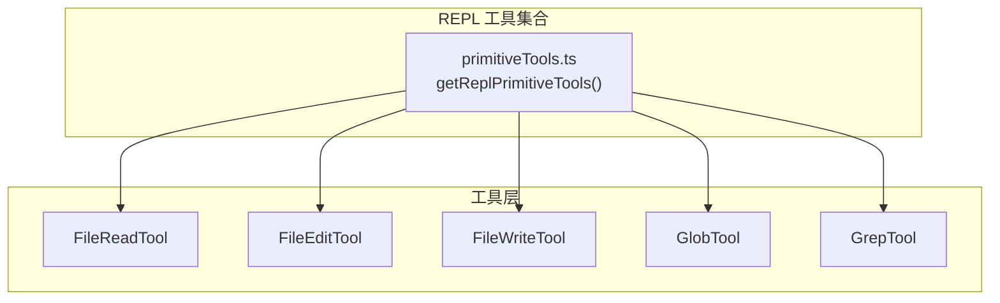
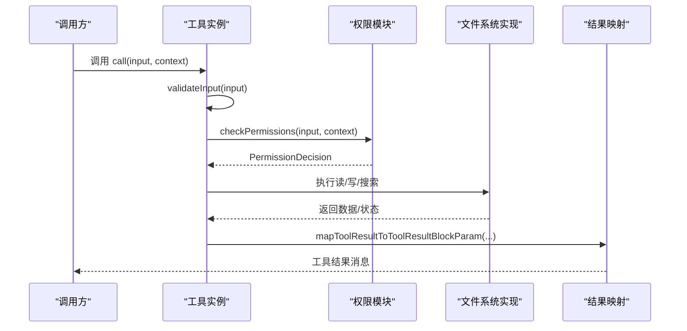
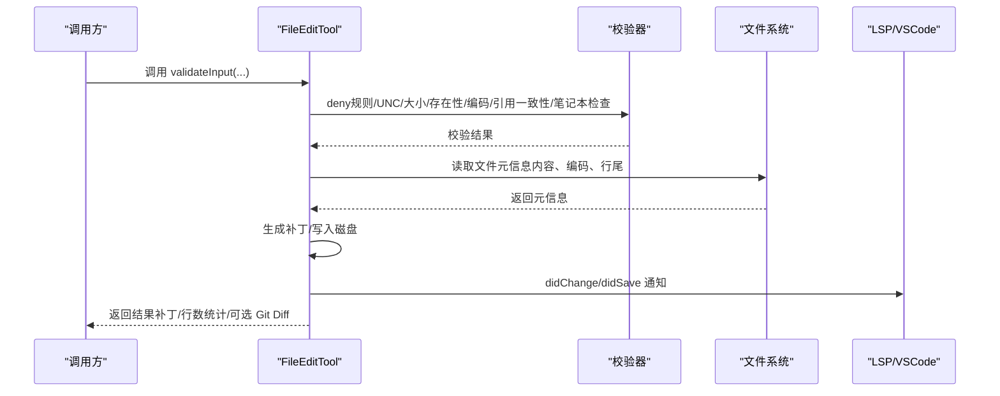
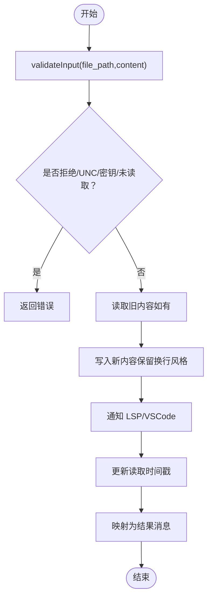
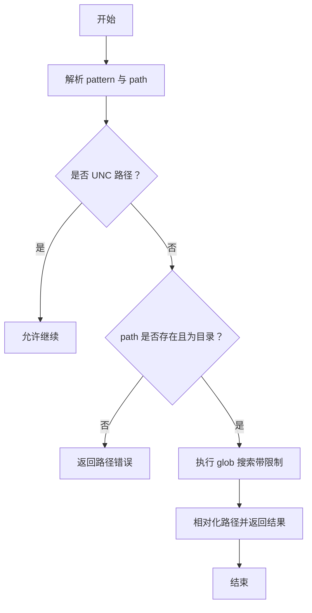
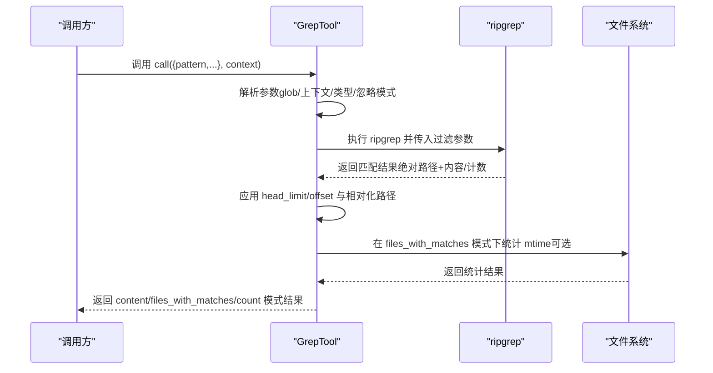
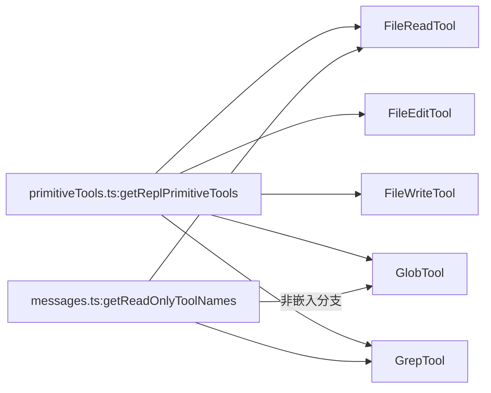

# 文件操作工具

<cite>
**本文引用的文件**
- [FileReadTool.ts](file://src/tools/FileReadTool/FileReadTool.ts)
- [FileEditTool.ts](file://src/tools/FileEditTool/FileEditTool.ts)
- [FileWriteTool.ts](file://src/tools/FileWriteTool/FileWriteTool.ts)
- [GlobTool.ts](file://src/tools/GlobTool/GlobTool.ts)
- [GrepTool.ts](file://src/tools/GrepTool/GrepTool.ts)
- [primitiveTools.ts](file://src/tools/REPLTool/primitiveTools.ts)
- [messages.ts](file://src/utils/messages.ts)
</cite>

## 目录
1. [简介](#简介)
2. [项目结构](#项目结构)
3. [核心组件](#核心组件)
4. [架构总览](#架构总览)
5. [详细组件分析](#详细组件分析)
6. [依赖关系分析](#依赖关系分析)
7. [性能考量](#性能考量)
8. [故障排查指南](#故障排查指南)
9. [结论](#结论)
10. [附录](#附录)

## 简介
本文件为本地文件系统操作工具的权威参考文档，覆盖以下五大工具：
- FileReadTool：文件读取（支持文本、图片、PDF、Jupyter Notebook 等）
- FileEditTool：文件原地编辑（基于字符串替换与补丁生成）
- FileWriteTool：文件创建或覆盖写入（全量内容替换）
- GlobTool：通配符/模式匹配查找文件
- GrepTool：基于 ripgrep 的正则搜索（支持上下文、计数、类型过滤）

文档将从参数定义、路径处理、权限控制与安全限制入手，结合错误处理机制、性能特性与最佳实践，提供可直接落地的使用示例与排障建议。

## 项目结构
文件操作工具位于 src/tools 下，每个工具均实现统一的 ToolDef 接口，具备输入/输出模式校验、权限检查、调用执行与结果映射等能力。REPL 模式下会显式注册这些基础工具以供内部 VM 使用。

图表来源
- [primitiveTools.ts:28-39](file://src/tools/REPLTool/primitiveTools.ts#L28-L39)

章节来源
- [primitiveTools.ts:28-39](file://src/tools/REPLTool/primitiveTools.ts#L28-L39)

## 核心组件
- 统一接口：所有工具通过 buildTool 构建，具备 inputSchema、outputSchema、validateInput、checkPermissions、call、mapToolResultToToolResultBlockParam 等标准生命周期方法。
- 权限模型：读取类工具使用 checkReadPermissionForTool，写入类工具使用 checkWritePermissionForTool；均基于工具权限上下文进行规则匹配。
- 路径处理：统一使用 expandPath 进行路径展开与规范化，避免相对路径与波浪号带来的绕过风险。
- 安全限制：UNC 路径跳过早期文件系统操作以防止 NTLM 凭据泄露；对设备文件路径进行阻断；对二进制文件读取进行扩展名限制；对超大文件设置上限。
- 结果映射：各工具将内部输出映射为 UI 或消息块参数，确保传输最小化且面向用户可见的信息。

章节来源
- [FileReadTool.ts:337-718](file://src/tools/FileReadTool/FileReadTool.ts#L337-L718)
- [FileEditTool.ts:86-595](file://src/tools/FileEditTool/FileEditTool.ts#L86-L595)
- [FileWriteTool.ts:94-434](file://src/tools/FileWriteTool/FileWriteTool.ts#L94-L434)
- [GlobTool.ts:57-198](file://src/tools/GlobTool/GlobTool.ts#L57-L198)
- [GrepTool.ts:160-577](file://src/tools/GrepTool/GrepTool.ts#L160-L577)

## 架构总览
工具调用链路遵循“输入校验 → 权限检查 → 执行 → 结果映射”的通用流程，并在必要时进行路径规范化、大小/令牌限制与安全防护。

图表来源
- [FileReadTool.ts:398-718](file://src/tools/FileReadTool/FileReadTool.ts#L398-L718)
- [FileEditTool.ts:125-595](file://src/tools/FileEditTool/FileEditTool.ts#L125-L595)
- [FileWriteTool.ts:135-434](file://src/tools/FileWriteTool/FileWriteTool.ts#L135-L434)
- [GlobTool.ts:135-198](file://src/tools/GlobTool/GlobTool.ts#L135-L198)
- [GrepTool.ts:233-577](file://src/tools/GrepTool/GrepTool.ts#L233-L577)

## 详细组件分析

### FileReadTool（文件读取）
- 功能要点
  - 支持文本、图片、PDF、Notebook 等多类型文件读取与响应。
  - 提供分段读取（offset/limit）与 PDF 页面范围（pages）参数，避免一次性读取超大文件导致的内存与令牌压力。
  - 内置“文件未变更”去重：若上次完整读取后文件未变化，则返回占位消息，减少重复传输。
  - 对二进制文件进行扩展名限制，阻断设备文件路径（如 /dev/zero），并针对 macOS 截图的空格差异提供替代路径尝试。
  - 令牌与大小限制：根据默认或自定义限额估算/校验内容长度，超过阈值抛出异常。
- 参数与行为
  - file_path：绝对路径（内部会展开为绝对路径）
  - offset/limit：行级分段读取
  - pages：PDF 页面范围（如 "1-5"）
  - 输出类型：text、image、pdf、parts、notebook、file_unchanged
- 安全与权限
  - deny 规则检查、UNC 路径跳过早期 I/O、二进制扩展名白名单、设备路径阻断
  - 读取前进行权限匹配与 deny 规则判定
- 错误处理
  - 文件不存在：提供相似文件建议与当前工作目录提示
  - 令牌超限：抛出 MaxFileReadTokenExceededError
  - 去重命中：返回 file_unchanged 占位
- 性能与最佳实践
  - 大文件优先使用 offset/limit 分段读取
  - PDF 使用 pages 指定范围，避免整页提取
  - 启用去重可显著降低重复读取成本

图表来源
- [FileReadTool.ts:418-718](file://src/tools/FileReadTool/FileReadTool.ts#L418-L718)

章节来源
- [FileReadTool.ts:227-718](file://src/tools/FileReadTool/FileReadTool.ts#L227-L718)

### FileEditTool（文件编辑）
- 功能要点
  - 基于旧字符串到新字符串的替换，支持 replace_all 控制全部替换。
  - 自动发现技能目录并激活条件技能，写入前后通知 LSP 与 VSCode。
  - 写入前进行“意外修改”检测：若自上次读取后文件被外部修改，将拒绝写入。
  - 对笔记本文件（.ipynb）进行专门拦截，引导使用 NotebookEditTool。
  - 对超大文件（>1GiB）进行拒绝，防止内存溢出。
- 参数与行为
  - file_path：绝对路径
  - old_string/new_string：替换目标与新内容
  - replace_all：是否全部替换
  - 输出：包含原始文件、补丁、行数统计、可选 Git Diff
- 安全与权限
  - 写入权限检查、UNC 路径跳过早期 I/O、团队记忆密钥检查
  - 仅允许已读取过的文件进行编辑
- 错误处理
  - 无变化、拒绝规则、文件不存在、多处匹配但未开启 replace_all、笔记本文件、意外修改、过大文件等均有明确错误码与提示
- 性能与最佳实践
  - 先 Read 再 Edit，避免意外修改导致失败
  - 小范围精确替换，必要时开启 replace_all
  - 避免对超大文件执行编辑

图表来源
- [FileEditTool.ts:137-595](file://src/tools/FileEditTool/FileEditTool.ts#L137-L595)

章节来源
- [FileEditTool.ts:86-595](file://src/tools/FileEditTool/FileEditTool.ts#L86-L595)

### FileWriteTool（文件写入）
- 功能要点
  - 全量内容覆盖写入，保留调用方提供的换行风格（不强制重写行尾）。
  - 写入前后通知 LSP 与 VSCode，更新读取时间戳以失效旧缓存。
  - 对笔记本文件与团队记忆密钥进行拦截。
  - 对已读取文件进行“意外修改”检测，避免并发写入冲突。
- 参数与行为
  - file_path：绝对路径
  - content：完整内容
  - 输出：create/update（新建/更新），包含补丁、原始内容、可选 Git Diff
- 安全与权限
  - 写入权限检查、UNC 路径跳过早期 I/O、密钥检查、拒绝规则
- 错误处理
  - 未读取即写、意外修改、拒绝规则、UNC 路径等均有明确错误码
- 性能与最佳实践
  - 先 Read 再 Write，确保一致性
  - 大文件建议使用 FileEditTool 进行增量修改

图表来源
- [FileWriteTool.ts:153-434](file://src/tools/FileWriteTool/FileWriteTool.ts#L153-L434)

章节来源
- [FileWriteTool.ts:94-434](file://src/tools/FileWriteTool/FileWriteTool.ts#L94-L434)

### GlobTool（文件模式匹配）
- 功能要点
  - 基于通配符/glob 模式在指定目录内查找文件，默认使用当前工作目录。
  - 结果按相对路径展示，带耗时与截断标记（默认最多 100 项）。
  - 可用于快速定位文件集合，作为后续读取/编辑的前置步骤。
- 参数与行为
  - pattern：glob 模式（如 *.ts、*.{js,jsx}）
  - path：可选目录（省略则使用当前工作目录）
  - 输出：durationMs、numFiles、filenames、truncated
- 安全与权限
  - 读取权限检查、UNC 路径跳过早期 I/O、路径存在性校验（目录）
- 错误处理
  - 目录不存在：提供当前工作目录提示与相似路径建议
- 性能与最佳实践
  - 使用更具体的 path 与 pattern 缩小结果集
  - 结果截断时建议缩小范围或增加过滤条件

图表来源
- [GlobTool.ts:94-176](file://src/tools/GlobTool/GlobTool.ts#L94-L176)

章节来源
- [GlobTool.ts:57-198](file://src/tools/GlobTool/GlobTool.ts#L57-L198)

### GrepTool（文本搜索）
- 功能要点
  - 基于 ripgrep 的正则搜索，支持上下文（-B/-A/-C）、行号、大小写忽略、文件类型过滤、多 glob 过滤、计数模式等。
  - 默认 head_limit 为 250，避免结果过大；支持 offset 与 head_limit 实现分页。
  - 自动排除版本控制目录与插件孤儿版本目录，减少噪声。
  - 输出模式：content（显示匹配行）、files_with_matches（显示文件列表）、count（显示计数）。
- 参数与行为
  - pattern：正则表达式
  - path：搜索根目录（默认当前工作目录）
  - glob：文件 glob 过滤（支持逗号/花括号）
  - output_mode：content/files_with_matches/count
  - 上下文与行号：-B/-A/-C/context/-n
  - 大小写：-i
  - 类型：type（如 js/py/rust/go/java 等）
  - head_limit/offset：分页控制
  - multiline：启用多行模式
  - 输出：mode、numFiles、filenames/content/numLines/numMatches、appliedLimit/appliedOffset
- 安全与权限
  - 读取权限检查、UNC 路径跳过早期 I/O、忽略模式与 VCS 目录排除
- 错误处理
  - 路径不存在：提供当前工作目录提示与相似路径建议
  - ripgrep 超时：由上游传播超时错误
- 性能与最佳实践
  - 使用 glob 与 type 过滤缩小范围
  - content 模式配合 head_limit 与 offset 实现分页
  - 多行模式谨慎使用，避免匹配大文件造成性能问题

图表来源
- [GrepTool.ts:310-577](file://src/tools/GrepTool/GrepTool.ts#L310-L577)

章节来源
- [GrepTool.ts:160-577](file://src/tools/GrepTool/GrepTool.ts#L160-L577)

## 依赖关系分析
- REPL 模式工具集合：getReplPrimitiveTools 显式导出 FileReadTool、FileWriteTool、FileEditTool、GlobTool、GrepTool 等基础工具，便于在 REPL VM 中使用。
- 工具注册与可用性：在某些构建中，find/grep 可能被嵌入工具替代，此时只暴露 BashTool 与 FileReadTool；但在非嵌入分支，GlobTool 与 GrepTool 会出现在工具注册表中。
- 工具间协作：GlobTool/GrepTool 常用于“先搜后读/改”，FileReadTool 用于读取具体内容，FileEditTool/FileWriteTool 用于修改或覆盖写入。

图表来源
- [primitiveTools.ts:28-39](file://src/tools/REPLTool/primitiveTools.ts#L28-L39)
- [messages.ts:3300-3314](file://src/utils/messages.ts#L3300-L3314)

章节来源
- [primitiveTools.ts:28-39](file://src/tools/REPLTool/primitiveTools.ts#L28-L39)
- [messages.ts:3300-3314](file://src/utils/messages.ts#L3300-L3314)

## 性能考量
- 结果截断与分页
  - GlobTool 默认最多返回 100 项，避免结果过大。
  - GrepTool content/files_with_matches/count 模式均支持 head_limit/offset 分页，content 模式优先应用 head_limit 再相对化路径，减少无效处理。
- 令牌与大小限制
  - FileReadTool 对文本内容进行粗估与 API 计数双重校验，超过阈值抛错，避免上下文污染。
- I/O 优化
  - FileReadTool 的“文件未变更”去重可显著降低重复读取开销。
  - GrepTool 自动排除 .git/.svn 等版本控制目录与孤儿插件目录，减少噪声与 I/O。
- 并发与原子性
  - FileEditTool/FileWriteTool 在写入前后进行“意外修改”检测，保证并发安全；写入前确保父目录存在，避免中间态错误。
- 平台差异
  - WSL 场景下文件读取性能较差，工具通过 ripgrep 超时与错误传播保障稳定性。

章节来源
- [GlobTool.ts:154-176](file://src/tools/GlobTool/GlobTool.ts#L154-L176)
- [GrepTool.ts:110-128](file://src/tools/GrepTool/GrepTool.ts#L110-L128)
- [FileReadTool.ts:536-573](file://src/tools/FileReadTool/FileReadTool.ts#L536-L573)
- [FileEditTool.ts:442-468](file://src/tools/FileEditTool/FileEditTool.ts#L442-L468)
- [FileWriteTool.ts:266-295](file://src/tools/FileWriteTool/FileWriteTool.ts#L266-L295)

## 故障排查指南
- 文件不存在
  - FileReadTool/GlobTool/GrepTool：提供当前工作目录提示与相似文件建议；GlobTool/GrepTool 还会给出 UNC 路径跳过的说明。
- 无法读取二进制文件
  - FileReadTool：二进制扩展名检查失败，提示使用合适工具。
- 设备路径阻断
  - FileReadTool：阻断无限输出或阻塞输入的设备文件路径。
- 未读取即写
  - FileEditTool/FileWriteTool：要求先 Read 再 Edit/Write，否则提示“文件尚未读取”。
- 意外修改
  - FileEditTool/FileWriteTool：若自上次读取后文件被外部修改，拒绝写入，提示重新读取。
- 超大文件
  - FileEditTool：>1GiB 直接拒绝；FileReadTool：超过令牌/大小限制抛错。
- UNC 路径
  - 三类工具均对 UNC 路径跳过早期 I/O，以避免 NTLM 凭据泄露风险。
- 正则搜索无结果
  - GrepTool：检查 pattern 是否需要 -i、是否应使用 glob/type 过滤，或增大 head_limit/offset。

章节来源
- [FileReadTool.ts:418-650](file://src/tools/FileReadTool/FileReadTool.ts#L418-L650)
- [FileEditTool.ts:137-362](file://src/tools/FileEditTool/FileEditTool.ts#L137-L362)
- [FileWriteTool.ts:153-222](file://src/tools/FileWriteTool/FileWriteTool.ts#L153-L222)
- [GlobTool.ts:94-134](file://src/tools/GlobTool/GlobTool.ts#L94-L134)
- [GrepTool.ts:201-232](file://src/tools/GrepTool/GrepTool.ts#L201-L232)

## 结论
上述五大工具围绕“安全、可控、可观测”的原则设计：严格的路径展开与权限检查、UNC 路径与设备路径的安全防护、超大文件与令牌限制、以及“意外修改”检测与去重优化。推荐使用“先搜后读/改”的工作流：GlobTool/GrepTool 快速定位，FileReadTool 获取内容，FileEditTool/FileWriteTool 执行修改或覆盖写入，并结合分页与过滤参数提升性能与稳定性。

## 附录

### 使用示例（场景化）
- 正则表达式搜索
  - 使用 GrepTool，设置 pattern 为正则，output_mode 为 content 并配合 head_limit/offset 实现分页；必要时添加 glob/type 过滤。
  - 示例路径参考：[GrepTool 调用与参数解析:310-410](file://src/tools/GrepTool/GrepTool.ts#L310-L410)
- 文件内容修改
  - 先使用 FileReadTool 读取目标文件，再使用 FileEditTool 执行字符串替换（可开启 replace_all），最后由 LSP/VSCode 同步。
  - 示例路径参考：[FileEditTool 写入与通知:490-518](file://src/tools/FileEditTool/FileEditTool.ts#L490-L518)
- 批量文件操作
  - 使用 GlobTool 获取文件列表，再循环调用 FileReadTool/或 FileEditTool/FileWriteTool；注意结果截断与路径相对化。
  - 示例路径参考：[GlobTool 调用与相对化:154-166](file://src/tools/GlobTool/GlobTool.ts#L154-L166)
- 大文件处理
  - 使用 FileReadTool 的 offset/limit 或 pages 参数分段读取；避免一次性读取超大文件。
  - 示例路径参考：[FileReadTool 分段与令牌校验:594-650](file://src/tools/FileReadTool/FileReadTool.ts#L594-L650)
- 权限与安全
  - 确保路径为绝对路径并通过 expandPath 展开；遵守拒绝规则；对 UNC 路径与设备路径保持警惕。
  - 示例路径参考：[FileReadTool 路径与拒绝规则:442-494](file://src/tools/FileReadTool/FileReadTool.ts#L442-L494)