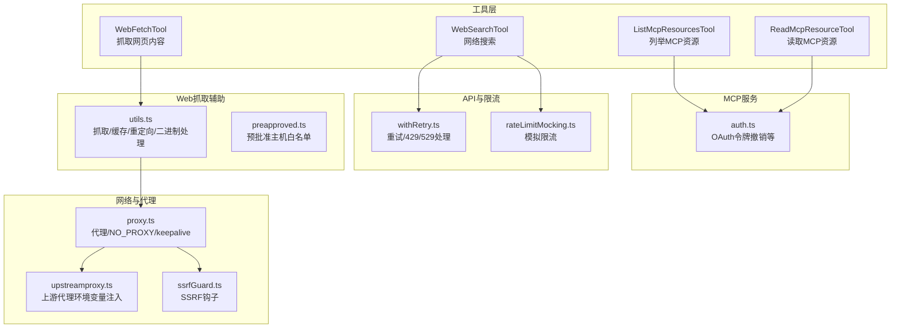
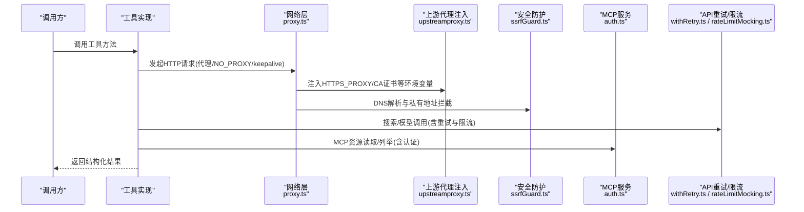
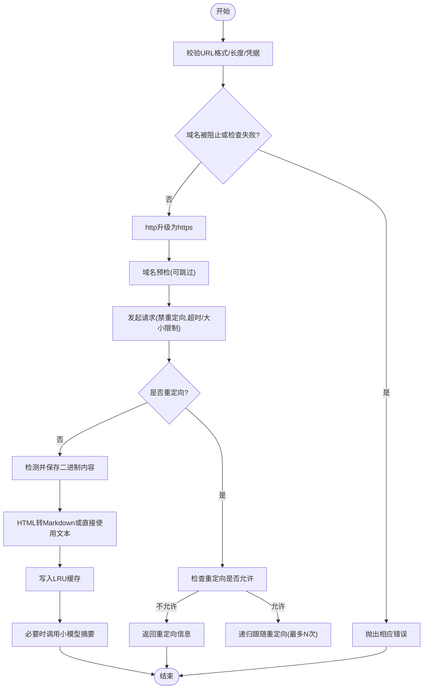
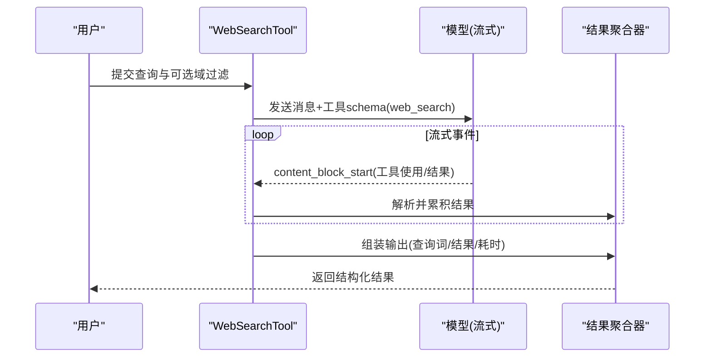
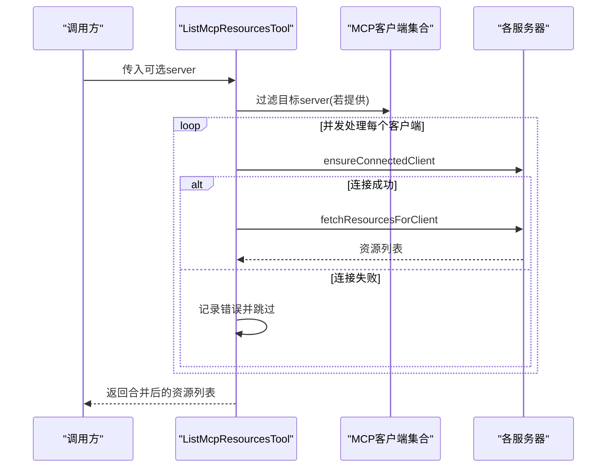
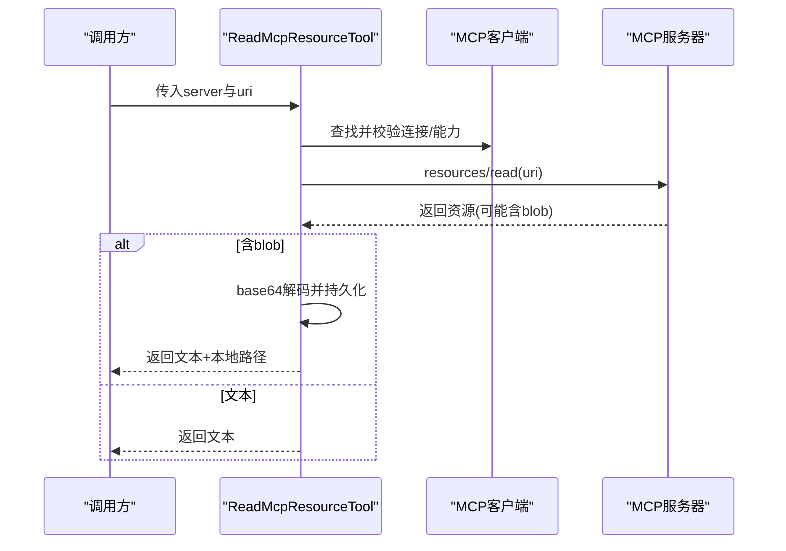
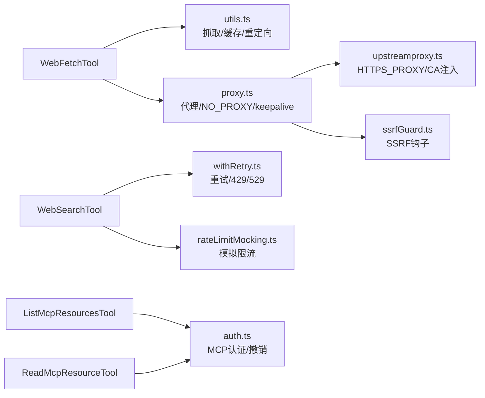

# 网络和网页工具

<cite>
**本文引用的文件**
- [WebFetchTool.ts](file://src/tools/WebFetchTool/WebFetchTool.ts)
- [WebSearchTool.ts](file://src/tools/WebSearchTool/WebSearchTool.ts)
- [ListMcpResourcesTool.ts](file://src/tools/ListMcpResourcesTool/ListMcpResourcesTool.ts)
- [ReadMcpResourceTool.ts](file://src/tools/ReadMcpResourceTool/ReadMcpResourceTool.ts)
- [utils.ts](file://src/tools/WebFetchTool/utils.ts)
- [preapproved.ts](file://src/tools/WebFetchTool/preapproved.ts)
- [proxy.ts](file://src/utils/proxy.ts)
- [upstreamproxy.ts](file://src/upstreamproxy/upstreamproxy.ts)
- [withRetry.ts](file://src/services/api/withRetry.ts)
- [rateLimitMocking.ts](file://src/services/rateLimitMocking.ts)
- [ssrfGuard.ts](file://src/utils/hooks/ssrfGuard.ts)
- [auth.ts](file://src/services/mcp/auth.ts)
</cite>

## 目录
1. [简介](#简介)
2. [项目结构](#项目结构)
3. [核心组件](#核心组件)
4. [架构总览](#架构总览)
5. [详细组件分析](#详细组件分析)
6. [依赖关系分析](#依赖关系分析)
7. [性能考量](#性能考量)
8. [故障排查指南](#故障排查指南)
9. [结论](#结论)
10. [附录](#附录)

## 简介
本文件为网络与网页工具的权威参考，覆盖以下工具：
- WebFetchTool：抓取网页内容并按提示进行提取或摘要
- WebSearchTool：通过模型执行网络搜索，返回结果链接与总结
- ListMcpResourcesTool：列出已连接 MCP 服务器提供的资源清单
- ReadMcpResourceTool：读取指定 MCP 资源，支持二进制内容落盘与文本内容返回

文档重点说明：
- 网络请求配置、代理设置与认证机制
- 网页内容提取、搜索结果处理与 MCP 资源访问流程
- 安全性（HTTPS 验证、SSRF 防护、域名白名单/黑名单、私有地址拦截）
- 速率限制处理与错误重试策略
- 内容过滤与隐私保护
- 实际请求示例与响应处理模式

## 项目结构
四个工具均位于 src/tools 下，分别对应独立目录；网络与代理相关逻辑集中在 src/utils/proxy.ts；MCP 认证与客户端交互在 src/services/mcp；速率限制与重试策略在 src/services/api 与 src/services/rateLimitMocking。

图示来源
- [WebFetchTool.ts:1-319](file://src/tools/WebFetchTool/WebFetchTool.ts#L1-L319)
- [WebSearchTool.ts:1-436](file://src/tools/WebSearchTool/WebSearchTool.ts#L1-L436)
- [ListMcpResourcesTool.ts:1-124](file://src/tools/ListMcpResourcesTool/ListMcpResourcesTool.ts#L1-L124)
- [ReadMcpResourceTool.ts:1-159](file://src/tools/ReadMcpResourceTool/ReadMcpResourceTool.ts#L1-L159)
- [utils.ts:1-531](file://src/tools/WebFetchTool/utils.ts#L1-L531)
- [preapproved.ts:127-166](file://src/tools/WebFetchTool/preapproved.ts#L127-L166)
- [proxy.ts:1-427](file://src/utils/proxy.ts#L1-L427)
- [upstreamproxy.ts:187-218](file://src/upstreamproxy/upstreamproxy.ts#L187-L218)
- [withRetry.ts:261-463](file://src/services/api/withRetry.ts#L261-L463)
- [rateLimitMocking.ts:50-144](file://src/services/rateLimitMocking.ts#L50-L144)
- [ssrfGuard.ts:227-294](file://src/utils/hooks/ssrfGuard.ts#L227-L294)
- [auth.ts:492-521](file://src/services/mcp/auth.ts#L492-L521)

章节来源
- [WebFetchTool.ts:1-319](file://src/tools/WebFetchTool/WebFetchTool.ts#L1-L319)
- [WebSearchTool.ts:1-436](file://src/tools/WebSearchTool/WebSearchTool.ts#L1-L436)
- [ListMcpResourcesTool.ts:1-124](file://src/tools/ListMcpResourcesTool/ListMcpResourcesTool.ts#L1-L124)
- [ReadMcpResourceTool.ts:1-159](file://src/tools/ReadMcpResourceTool/ReadMcpResourceTool.ts#L1-L159)
- [utils.ts:1-531](file://src/tools/WebFetchTool/utils.ts#L1-L531)
- [preapproved.ts:127-166](file://src/tools/WebFetchTool/preapproved.ts#L127-L166)
- [proxy.ts:1-427](file://src/utils/proxy.ts#L1-L427)
- [upstreamproxy.ts:187-218](file://src/upstreamproxy/upstreamproxy.ts#L187-L218)
- [withRetry.ts:261-463](file://src/services/api/withRetry.ts#L261-L463)
- [rateLimitMocking.ts:50-144](file://src/services/rateLimitMocking.ts#L50-L144)
- [ssrfGuard.ts:227-294](file://src/utils/hooks/ssrfGuard.ts#L227-L294)
- [auth.ts:492-521](file://src/services/mcp/auth.ts#L492-L521)

## 核心组件
- WebFetchTool：输入包含目标 URL 与提示词，输出包含字节数、HTTP 状态码、处理时长、最终结果文本，并在需要时提示用户改用 MCP 工具以访问需认证的内容。
- WebSearchTool：输入查询词及可选的允许/禁止域名列表，输出搜索命中标题与链接数组以及模型生成的总结文本。
- ListMcpResourcesTool：输入可选服务器名，输出该服务器或所有服务器的资源清单（URI、名称、MIME 类型、描述、服务器名）。
- ReadMcpResourceTool：输入服务器名与资源 URI，输出资源内容（文本或二进制），二进制内容会保存到磁盘并返回路径。

章节来源
- [WebFetchTool.ts:24-46](file://src/tools/WebFetchTool/WebFetchTool.ts#L24-L46)
- [WebSearchTool.ts:25-67](file://src/tools/WebSearchTool/WebSearchTool.ts#L25-L67)
- [ListMcpResourcesTool.ts:15-36](file://src/tools/ListMcpResourcesTool/ListMcpResourcesTool.ts#L15-L36)
- [ReadMcpResourceTool.ts:22-45](file://src/tools/ReadMcpResourceTool/ReadMcpResourceTool.ts#L22-L45)

## 架构总览
下图展示从调用到响应的关键路径，包括网络代理、安全检查、MCP 认证与重试策略。

图示来源
- [proxy.ts:327-388](file://src/utils/proxy.ts#L327-L388)
- [upstreamproxy.ts:187-218](file://src/upstreamproxy/upstreamproxy.ts#L187-L218)
- [ssrfGuard.ts:227-294](file://src/utils/hooks/ssrfGuard.ts#L227-L294)
- [withRetry.ts:261-463](file://src/services/api/withRetry.ts#L261-L463)
- [rateLimitMocking.ts:50-144](file://src/services/rateLimitMocking.ts#L50-L144)
- [auth.ts:492-521](file://src/services/mcp/auth.ts#L492-L521)

## 详细组件分析

### WebFetchTool（网页抓取）
- 输入校验：URL 必须可解析且长度不超过上限；禁止包含用户名/密码；域名必须可公开解析。
- 域名预检：默认调用外部接口检查是否允许抓取；可通过设置跳过；失败时抛出明确错误类型。
- 重定向策略：仅允许同源变更（如添加/移除 www 或路径/查询参数变化），超过最大重定向次数则报错。
- 缓存与超时：URL 级 LRU 缓存（容量与 TTL 受控），单次请求超时与最大内容长度限制。
- 内容处理：HTML 自动转 Markdown；二进制内容落地磁盘并返回路径；对长内容截断后交由小模型摘要。
- 输出：包含原始字节、状态码、状态文本、处理耗时、最终结果文本，必要时提示改用 MCP 工具。

图示来源
- [utils.ts:139-169](file://src/tools/WebFetchTool/utils.ts#L139-L169)
- [utils.ts:176-203](file://src/tools/WebFetchTool/utils.ts#L176-L203)
- [utils.ts:262-329](file://src/tools/WebFetchTool/utils.ts#L262-L329)
- [utils.ts:347-482](file://src/tools/WebFetchTool/utils.ts#L347-L482)
- [utils.ts:484-531](file://src/tools/WebFetchTool/utils.ts#L484-L531)

章节来源
- [WebFetchTool.ts:104-180](file://src/tools/WebFetchTool/WebFetchTool.ts#L104-L180)
- [utils.ts:1-531](file://src/tools/WebFetchTool/utils.ts#L1-L531)
- [preapproved.ts:127-166](file://src/tools/WebFetchTool/preapproved.ts#L127-L166)

### WebSearchTool（网页搜索）
- 输入：查询词（必填，最小长度限制），可选 allowed_domains 与 blocked_domains（二者互斥）。
- 执行：构造系统提示与用户消息，启用工具模式，流式接收内容块；解析 server_tool_use 与 web_search_tool_result，聚合结果与文本注释。
- 输出：包含查询词、结果数组（链接条目或文本总结）、耗时秒数。
- 权限：需要显式授权规则；工具启用受提供商与模型能力影响。

图示来源
- [WebSearchTool.ts:254-400](file://src/tools/WebSearchTool/WebSearchTool.ts#L254-L400)
- [WebSearchTool.ts:86-150](file://src/tools/WebSearchTool/WebSearchTool.ts#L86-L150)

章节来源
- [WebSearchTool.ts:25-67](file://src/tools/WebSearchTool/WebSearchTool.ts#L25-L67)
- [WebSearchTool.ts:152-222](file://src/tools/WebSearchTool/WebSearchTool.ts#L152-L222)
- [WebSearchTool.ts:254-400](file://src/tools/WebSearchTool/WebSearchTool.ts#L254-L400)

### ListMcpResourcesTool（MCP资源列表）
- 输入：可选 server 名称用于筛选。
- 执行：遍历 mcpClients，确保连接健康并拉取资源；对失败的服务器单独记录日志但不影响整体结果。
- 输出：展平后的资源数组（URI、名称、MIME、描述、服务器名）。

图示来源
- [ListMcpResourcesTool.ts:66-101](file://src/tools/ListMcpResourcesTool/ListMcpResourcesTool.ts#L66-L101)

章节来源
- [ListMcpResourcesTool.ts:15-36](file://src/tools/ListMcpResourcesTool/ListMcpResourcesTool.ts#L15-L36)
- [ListMcpResourcesTool.ts:66-101](file://src/tools/ListMcpResourcesTool/ListMcpResourcesTool.ts#L66-L101)

### ReadMcpResourceTool（MCP资源读取）
- 输入：server 与 uri。
- 执行：定位客户端并校验连接与 capabilities；调用 resources/read；对 blob 字段进行 base64 解码并保存到磁盘，替换为本地路径以便查看。
- 输出：包含每个资源的 URI、MIME、文本内容或二进制保存路径。

图示来源
- [ReadMcpResourceTool.ts:75-144](file://src/tools/ReadMcpResourceTool/ReadMcpResourceTool.ts#L75-L144)

章节来源
- [ReadMcpResourceTool.ts:22-45](file://src/tools/ReadMcpResourceTool/ReadMcpResourceTool.ts#L22-L45)
- [ReadMcpResourceTool.ts:75-144](file://src/tools/ReadMcpResourceTool/ReadMcpResourceTool.ts#L75-L144)

## 依赖关系分析
- Web 抓取工具依赖：
  - 网络代理与 NO_PROXY：通过 proxy.ts 的全局代理配置与 EnvHttpProxyAgent 实现，同时支持 mTLS 与 CA 证书注入。
  - 上游代理环境变量：upstreamproxy.ts 注入 HTTPS_PROXY、NO_PROXY 与证书链环境变量，确保进程级一致性。
  - SSRF 防护：ssrfGuard.ts 在 DNS 层拦截私有/环回地址，避免内部网络暴露。
  - 缓存与超时：utils.ts 中 LRU 缓存与请求超时/大小限制保障资源消耗可控。
- 搜索工具依赖：
  - 重试与限流：withRetry.ts 处理 429/529 与持久会话场景下的退避；rateLimitMocking.ts 支持测试场景下的模拟限流。
- MCP 工具依赖：
  - 认证与令牌管理：auth.ts 提供令牌撤销等能力，配合工具侧的连接与能力校验。

图示来源
- [utils.ts:1-531](file://src/tools/WebFetchTool/utils.ts#L1-L531)
- [proxy.ts:1-427](file://src/utils/proxy.ts#L1-L427)
- [upstreamproxy.ts:187-218](file://src/upstreamproxy/upstreamproxy.ts#L187-L218)
- [ssrfGuard.ts:227-294](file://src/utils/hooks/ssrfGuard.ts#L227-L294)
- [withRetry.ts:261-463](file://src/services/api/withRetry.ts#L261-L463)
- [rateLimitMocking.ts:50-144](file://src/services/rateLimitMocking.ts#L50-L144)
- [auth.ts:492-521](file://src/services/mcp/auth.ts#L492-L521)

章节来源
- [proxy.ts:327-388](file://src/utils/proxy.ts#L327-L388)
- [upstreamproxy.ts:187-218](file://src/upstreamproxy/upstreamproxy.ts#L187-L218)
- [ssrfGuard.ts:227-294](file://src/utils/hooks/ssrfGuard.ts#L227-L294)
- [withRetry.ts:261-463](file://src/services/api/withRetry.ts#L261-L463)
- [rateLimitMocking.ts:50-144](file://src/services/rateLimitMocking.ts#L50-L144)
- [auth.ts:492-521](file://src/services/mcp/auth.ts#L492-L521)

## 性能考量
- 请求超时与内容大小限制：防止慢响应与大体积内容导致资源耗尽。
- LRU 缓存：降低重复请求开销，控制内存占用。
- 代理 keepalive 策略：在出现“陈旧连接池”错误时自动禁用 keepalive，避免复用坏连接。
- 并发与幂等：MCP 列举工具对单个服务器失败不阻塞整体结果。
- 小模型摘要：对长内容进行截断后摘要，减少上下文成本。

章节来源
- [utils.ts:112-128](file://src/tools/WebFetchTool/utils.ts#L112-L128)
- [utils.ts:61-83](file://src/tools/WebFetchTool/utils.ts#L61-L83)
- [proxy.ts:21-35](file://src/utils/proxy.ts#L21-L35)
- [ListMcpResourcesTool.ts:84-96](file://src/tools/ListMcpResourcesTool/ListMcpResourcesTool.ts#L84-L96)

## 故障排查指南
- 代理与 NO_PROXY
  - 确认 HTTPS_PROXY/NO_PROXY 设置正确；NO_PROXY 支持通配符、后缀匹配、端口特定匹配与 IP 地址。
  - 若需要让代理解析主机名（沙箱环境），可设置 CLAUDE_CODE_PROXY_RESOLVES_HOSTS。
- 上游代理证书
  - upstreamproxy.ts 会注入 SSL_CERT_FILE/NODE_EXTRA_CA_CERTS/REQUESTS_CA_BUNDLE/CURL_CA_BUNDLE 环境变量，确保 HTTPS 验证链完整。
- SSRF 防护
  - 若 DNS 解析到私有/环回地址，将被拦截并返回明确错误；请检查目标域名解析与网络策略。
- 速率限制与重试
  - 429/529 错误会根据 Retry-After、窗口重置时间与持久会话策略进行退避；模拟限流可在测试中启用。
- MCP 认证
  - 若服务器支持令牌撤销，将按元数据选择合适方式执行；确认服务器配置与令牌状态。

章节来源
- [proxy.ts:64-129](file://src/utils/proxy.ts#L64-L129)
- [proxy.ts:151-158](file://src/utils/proxy.ts#L151-L158)
- [upstreamproxy.ts:187-198](file://src/upstreamproxy/upstreamproxy.ts#L187-L198)
- [ssrfGuard.ts:227-294](file://src/utils/hooks/ssrfGuard.ts#L227-L294)
- [withRetry.ts:261-463](file://src/services/api/withRetry.ts#L261-L463)
- [rateLimitMocking.ts:50-144](file://src/services/rateLimitMocking.ts#L50-L144)
- [auth.ts:492-521](file://src/services/mcp/auth.ts#L492-L521)

## 结论
上述工具围绕“安全、可控、可观测”的原则设计：WebFetchTool 在抓取前进行域名预检与重定向约束，结合缓存与摘要能力提升效率；WebSearchTool 通过模型流式聚合结果并强调引用来源；MCP 工具通过严格的连接与能力校验、二进制内容落盘与认证管理保障资源访问的安全与可审计。网络层统一通过代理与证书注入、NO_PROXY 与 SSRF 防护实现企业级合规；API 层提供稳健的重试与限流策略，适配多场景需求。

## 附录

### 网络请求配置与代理设置
- 代理来源优先级：https_proxy > HTTPS_PROXY > http_proxy > HTTP_PROXY
- NO_PROXY 支持：通配符、后缀匹配、端口特定匹配、IP 地址
- mTLS 与 CA：支持证书/密钥/口令与额外 CA 注入
- keepalive：在连接异常时自动禁用以避免复用坏连接
- WebSocket：Node 使用 agent，Bun 使用 proxy 字符串

章节来源
- [proxy.ts:64-129](file://src/utils/proxy.ts#L64-L129)
- [proxy.ts:135-161](file://src/utils/proxy.ts#L135-L161)
- [proxy.ts:198-237](file://src/utils/proxy.ts#L198-L237)
- [proxy.ts:243-275](file://src/utils/proxy.ts#L243-L275)
- [proxy.ts:288-319](file://src/utils/proxy.ts#L288-L319)
- [proxy.ts:327-388](file://src/utils/proxy.ts#L327-L388)

### HTTPS 与证书链
- 进程级注入 SSL_CERT_FILE/NODE_EXTRA_CA_CERTS/REQUESTS_CA_BUNDLE/CURL_CA_BUNDLE
- 代理与直连均应用 CA 与 mTLS 配置

章节来源
- [upstreamproxy.ts:187-198](file://src/upstreamproxy/upstreamproxy.ts#L187-L198)
- [proxy.ts:223-234](file://src/utils/proxy.ts#L223-L234)

### 安全与隐私
- 域名白名单/黑名单：预批准主机与域名预检
- 私有地址拦截：SSRF 钩子在 DNS 层拦截
- 内容截断与摘要：避免过长上下文与敏感信息泄露
- 二进制内容落盘：避免将大体量二进制直接放入上下文

章节来源
- [preapproved.ts:127-166](file://src/tools/WebFetchTool/preapproved.ts#L127-L166)
- [utils.ts:176-203](file://src/tools/WebFetchTool/utils.ts#L176-L203)
- [ssrfGuard.ts:227-294](file://src/utils/hooks/ssrfGuard.ts#L227-L294)
- [utils.ts:484-531](file://src/tools/WebFetchTool/utils.ts#L484-L531)

### 速率限制与重试策略
- 429/529：基于 Retry-After、窗口重置时间与持久会话退避
- 模拟限流：测试场景下可启用，支持多种限流头与条件分支

章节来源
- [withRetry.ts:261-463](file://src/services/api/withRetry.ts#L261-L463)
- [rateLimitMocking.ts:50-144](file://src/services/rateLimitMocking.ts#L50-L144)