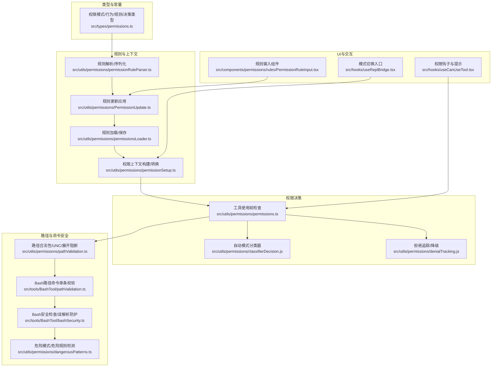
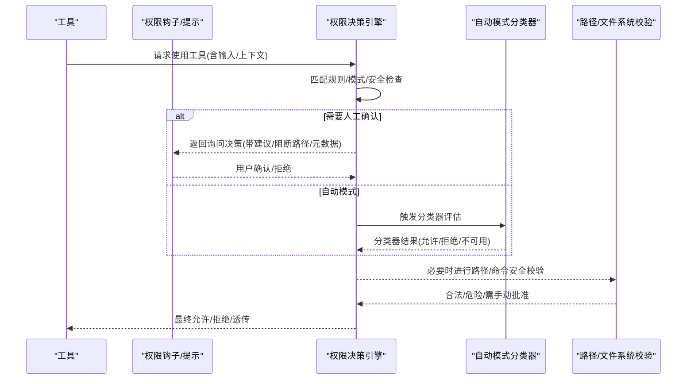
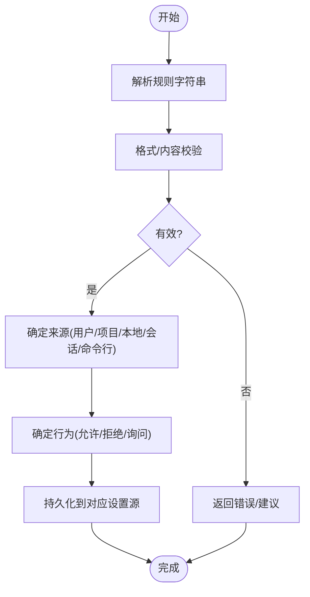
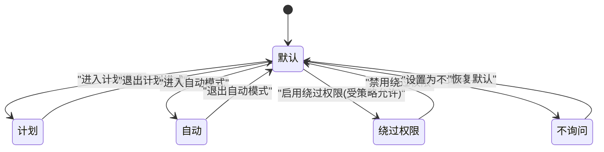
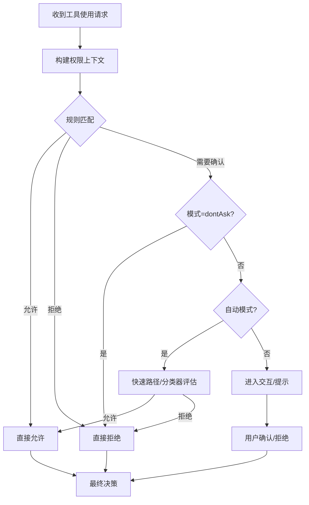
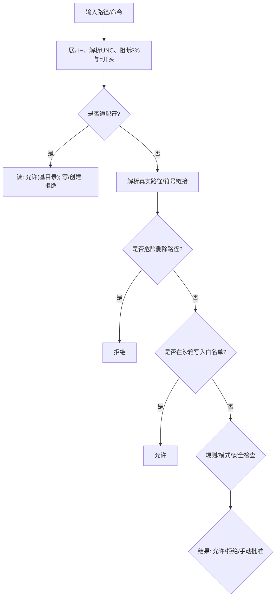
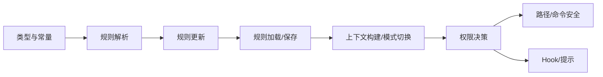

# 工具权限与安全

<cite>
**本文引用的文件**
- [src/types/permissions.ts](file://src/types/permissions.ts)
- [src/utils/permissions/permissionSetup.ts](file://src/utils/permissions/permissionSetup.ts)
- [src/utils/permissions/PermissionUpdate.ts](file://src/utils/permissions/PermissionUpdate.ts)
- [src/utils/permissions/pathValidation.ts](file://src/utils/permissions/pathValidation.ts)
- [src/utils/permissions/permissions.ts](file://src/utils/permissions/permissions.ts)
- [src/utils/permissions/permissionValidation.ts](file://src/utils/permissions/permissionValidation.ts)
- [src/utils/permissions/dangerousPatterns.ts](file://src/utils/permissions/dangerousPatterns.ts)
- [src/utils/permissions/permissionsLoader.ts](file://src/utils/permissions/permissionsLoader.ts)
- [src/components/permissions/rules/PermissionRuleInput.tsx](file://src/components/permissions/rules/PermissionRuleInput.tsx)
- [src/hooks/useCanUseTool.tsx](file://src/hooks/useCanUseTool.tsx)
- [src/tools/BashTool/pathValidation.ts](file://src/tools/BashTool/pathValidation.ts)
- [src/tools/BashTool/bashSecurity.ts](file://src/tools/BashTool/bashSecurity.ts)
- [src/hooks/useReplBridge.tsx](file://src/hooks/useReplBridge.tsx)
</cite>

## 目录
1. [简介](#简介)
2. [项目结构](#项目结构)
3. [核心组件](#核心组件)
4. [架构总览](#架构总览)
5. [详细组件分析](#详细组件分析)
6. [依赖关系分析](#依赖关系分析)
7. [性能考量](#性能考量)
8. [故障排查指南](#故障排查指南)
9. [结论](#结论)
10. [附录](#附录)

## 简介
本文件系统化阐述 free-code 的工具权限与安全体系，覆盖权限模型、规则定义、路径与命令安全校验、危险模式检测、自动模式（auto）与计划模式（plan）的切换、权限上下文管理、提示与授权流程、配置示例、最佳实践、常见问题与扩展方法，并给出审计与监控建议。

## 项目结构
权限与安全相关代码主要分布在以下模块：
- 类型与常量：权限模式、行为、规则值、决策类型等统一定义于类型文件
- 规则解析与持久化：规则解析、更新应用、设置加载与保存
- 权限决策：工具使用前的权限检查、自动模式分类器、拒绝追踪与降级策略
- 路径与命令安全：路径合法性、UNC/环境变量/展开语法阻断、Bash/PowerShell 安全检查
- UI 与交互：规则输入组件、权限提示与授权流程钩子
- 模式切换：默认/绕过/自动/计划模式的进入与退出逻辑

图表来源
- [src/types/permissions.ts:1-442](file://src/types/permissions.ts#L1-L442)
- [src/utils/permissions/PermissionUpdate.ts:1-390](file://src/utils/permissions/PermissionUpdate.ts#L1-L390)
- [src/utils/permissions/permissionsLoader.ts:1-297](file://src/utils/permissions/permissionsLoader.ts#L1-L297)
- [src/utils/permissions/permissionSetup.ts:1-800](file://src/utils/permissions/permissionSetup.ts#L1-L800)
- [src/utils/permissions/permissions.ts:1-800](file://src/utils/permissions/permissions.ts#L1-L800)
- [src/utils/permissions/pathValidation.ts:1-486](file://src/utils/permissions/pathValidation.ts#L1-L486)
- [src/tools/BashTool/pathValidation.ts:816-845](file://src/tools/BashTool/pathValidation.ts#L816-L845)
- [src/tools/BashTool/bashSecurity.ts:2308-2346](file://src/tools/BashTool/bashSecurity.ts#L2308-L2346)
- [src/utils/permissions/dangerousPatterns.ts:1-81](file://src/utils/permissions/dangerousPatterns.ts#L1-L81)
- [src/components/permissions/rules/PermissionRuleInput.tsx:1-138](file://src/components/permissions/rules/PermissionRuleInput.tsx#L1-L138)
- [src/hooks/useCanUseTool.tsx:1-204](file://src/hooks/useCanUseTool.tsx#L1-L204)
- [src/hooks/useReplBridge.tsx:425-450](file://src/hooks/useReplBridge.tsx#L425-L450)

章节来源
- [src/types/permissions.ts:1-442](file://src/types/permissions.ts#L1-L442)
- [src/utils/permissions/permissionSetup.ts:1-800](file://src/utils/permissions/permissionSetup.ts#L1-L800)

## 核心组件
- 权限模式与行为
  - 模式：默认(default)、绕过权限(bypassPermissions)、不询问(dontAsk)、自动(auto)、计划(plan)、外部接受编辑(acceptEdits)
  - 行为：允许(allow)、拒绝(deny)、询问(ask)
- 权限规则与来源
  - 规则值：工具名+可选内容；规则来源：用户设置、项目设置、本地设置、会话、命令行参数、策略设置、标志位设置
  - 规则更新操作：添加/替换/移除规则、设置模式、增删工作目录
- 决策与结果
  - 决策：允许、询问、拒绝；结果：允许/询问/拒绝或透传(passthrough)
  - 决策原因：规则命中、模式、子命令结果集合、Hook、异步代理、沙箱覆盖、工作目录、安全检查、其他
- 上下文
  - 权限上下文包含当前模式、额外工作目录、三类规则集合、是否可用绕过权限模式、剥离的危险规则、避免权限提示、自动化前置检查开关、进入计划模式前的模式等

章节来源
- [src/types/permissions.ts:16-32](file://src/types/permissions.ts#L16-L32)
- [src/types/permissions.ts:44-79](file://src/types/permissions.ts#L44-L79)
- [src/types/permissions.ts:88-132](file://src/types/permissions.ts#L88-L132)
- [src/types/permissions.ts:241-266](file://src/types/permissions.ts#L241-L266)
- [src/types/permissions.ts:271-325](file://src/types/permissions.ts#L271-L325)
- [src/types/permissions.ts:427-442](file://src/types/permissions.ts#L427-L442)

## 架构总览
权限系统围绕“规则 + 上下文 + 决策”展开，工具在执行前调用统一的权限检查函数，按优先级匹配规则、模式与安全检查，必要时触发自动模式分类器或交互提示。

图表来源
- [src/utils/permissions/permissions.ts:473-800](file://src/utils/permissions/permissions.ts#L473-L800)
- [src/hooks/useCanUseTool.tsx:1-204](file://src/hooks/useCanUseTool.tsx#L1-L204)
- [src/utils/permissions/pathValidation.ts:1-486](file://src/utils/permissions/pathValidation.ts#L1-L486)

## 详细组件分析

### 权限模型与规则系统
- 规则解析与格式校验
  - 支持工具名后可选括号内容，如 Bash(ls:*)、Read(src/**)
  - 对空括号、括号不匹配、大小写、通配位置等进行严格校验
  - MCP 规则仅支持服务器级/工具级/通配，不支持内容
- 规则持久化与去重
  - 允许/拒绝/询问三类规则分别存储
  - 添加规则时去重并保留原始键值以兼容未知字段
- 规则来源与覆盖
  - 支持多来源合并，受策略限制时仅使用受管设置
  - 提供“仅受管规则”模式，隐藏“总是允许”选项

图表来源
- [src/utils/permissions/permissionValidation.ts:58-239](file://src/utils/permissions/permissionValidation.ts#L58-L239)
- [src/utils/permissions/permissionsLoader.ts:229-297](file://src/utils/permissions/permissionsLoader.ts#L229-L297)

章节来源
- [src/utils/permissions/permissionValidation.ts:1-263](file://src/utils/permissions/permissionValidation.ts#L1-L263)
- [src/utils/permissions/permissionsLoader.ts:1-297](file://src/utils/permissions/permissionsLoader.ts#L1-L297)

### 权限上下文与模式切换
- 上下文组成
  - 当前模式、额外工作目录映射、三类规则集合、是否可用绕过权限模式、剥离的危险规则、避免权限提示、自动化前置检查开关、进入计划模式前的模式
- 模式切换
  - 默认/绕过/自动/计划/不询问模式
  - 进入/退出计划模式时附加附件处理
  - 自动模式进入时剥离危险规则，退出时恢复
  - 绕过权限模式受组织策略门控

图表来源
- [src/utils/permissions/permissionSetup.ts:597-646](file://src/utils/permissions/permissionSetup.ts#L597-L646)
- [src/hooks/useReplBridge.tsx:425-450](file://src/hooks/useReplBridge.tsx#L425-L450)

章节来源
- [src/utils/permissions/permissionSetup.ts:582-646](file://src/utils/permissions/permissionSetup.ts#L582-L646)
- [src/hooks/useReplBridge.tsx:425-450](file://src/hooks/useReplBridge.tsx#L425-L450)

### 权限决策流程
- 规则匹配优先级
  - 工具级允许规则直接放行
  - 工具级拒绝规则直接拒绝
  - 子命令结果集合中存在需要确认的部分时，汇总为询问
  - 模式影响：dontAsk 将询问转为拒绝
- 自动模式
  - 在 acceptEdits 快速路径、安全工具白名单、分类器评估之间择优
  - 分类器不可用时降级为交互或拒绝
  - 连续拒绝计数用于统计与成本控制
- Hook 与异步代理
  - 头等/异步代理可通过 Hook 在无 UI 场景下提前决定

图表来源
- [src/utils/permissions/permissions.ts:473-800](file://src/utils/permissions/permissions.ts#L473-L800)
- [src/hooks/useCanUseTool.tsx:1-204](file://src/hooks/useCanUseTool.tsx#L1-L204)

章节来源
- [src/utils/permissions/permissions.ts:473-800](file://src/utils/permissions/permissions.ts#L473-L800)
- [src/hooks/useCanUseTool.tsx:1-204](file://src/hooks/useCanUseTool.tsx#L1-L204)

### 路径与命令安全校验
- 路径合法性
  - 展开波浪号、UNC 路径阻断、环境变量/展开语法阻断($、%、=开头)
  - 通配符仅读场景允许，写/创建场景禁止
  - 危险删除路径识别：根目录、家目录、驱动器根、关键系统目录
  - 沙箱写入白名单：对沙箱允许写入的目录视为额外允许
- Bash/PowerShell 安全
  - 单条命令解析与剥离包装器，识别危险前缀/解释器/远程执行
  - 早期安全检查：空命令、未完成命令、安全命令替换、git 提交等
  - 危险模式检测：Bash/PowerShell/Agent 允许规则可能绕过分类器，进入自动模式时剥离

图表来源
- [src/utils/permissions/pathValidation.ts:373-486](file://src/utils/permissions/pathValidation.ts#L373-L486)
- [src/tools/BashTool/pathValidation.ts:834-845](file://src/tools/BashTool/pathValidation.ts#L834-L845)
- [src/tools/BashTool/bashSecurity.ts:2308-2346](file://src/tools/BashTool/bashSecurity.ts#L2308-L2346)
- [src/utils/permissions/dangerousPatterns.ts:1-81](file://src/utils/permissions/dangerousPatterns.ts#L1-L81)

章节来源
- [src/utils/permissions/pathValidation.ts:1-486](file://src/utils/permissions/pathValidation.ts#L1-L486)
- [src/tools/BashTool/pathValidation.ts:816-845](file://src/tools/BashTool/pathValidation.ts#L816-L845)
- [src/tools/BashTool/bashSecurity.ts:2308-2346](file://src/tools/BashTool/bashSecurity.ts#L2308-L2346)
- [src/utils/permissions/dangerousPatterns.ts:1-81](file://src/utils/permissions/dangerousPatterns.ts#L1-L81)

### 权限提示与用户授权
- 规则输入组件
  - 提示规则格式与示例，支持回车提交、Esc 取消
- 授权流程
  - 生成权限请求消息，展示规则/模式/Hook/分类器等决策原因
  - 支持桥接/通道回调，适配不同运行环境
  - 自动模式下可显示分类器审批状态

章节来源
- [src/components/permissions/rules/PermissionRuleInput.tsx:1-138](file://src/components/permissions/rules/PermissionRuleInput.tsx#L1-L138)
- [src/hooks/useCanUseTool.tsx:1-204](file://src/hooks/useCanUseTool.tsx#L1-L204)

### 权限配置示例与最佳实践
- 配置示例
  - Bash(ls:*)：允许 ls 前缀命令
  - Read(src/**)：允许读取 src 下所有文件
  - PowerShell(iex:*)：高危，建议不要在自动模式下允许
  - Agent(Explore)：拒绝特定子代理
- 最佳实践
  - 优先使用最小权限原则，避免 Bash(*) 或 PowerShell(*)
  - 使用通配符限定范围，如 src/**、*.ts
  - 在自动模式下避免允许解释器/远程执行/进程启动等高危前缀
  - 通过策略设置限制仅受管规则，隐藏“总是允许”选项
  - 使用沙箱写入白名单减少写操作提示

章节来源
- [src/utils/permissions/permissionValidation.ts:156-239](file://src/utils/permissions/permissionValidation.ts#L156-L239)
- [src/utils/permissions/permissionSetup.ts:295-342](file://src/utils/permissions/permissionSetup.ts#L295-L342)

### 扩展与自定义
- 自定义规则校验
  - 通过工具验证配置注册自定义规则内容校验
- 自定义 Hook
  - 注册权限请求 Hook，在无 UI 场景下自动决策
- 自定义分类器
  - 在自动模式下集成自定义分类器，支持快速路径与白名单

章节来源
- [src/utils/permissions/permissionValidation.ts:146-154](file://src/utils/permissions/permissionValidation.ts#L146-L154)
- [src/utils/permissions/permissions.ts:400-471](file://src/utils/permissions/permissions.ts#L400-L471)

## 依赖关系分析
- 类型层
  - 权限类型与常量集中定义，避免循环依赖
- 规则层
  - 解析/更新/加载/持久化解耦，便于扩展新来源与行为
- 决策层
  - 统一决策入口，自动模式与交互提示分离
- 安全层
  - 路径/命令安全检查独立封装，便于维护与升级

图表来源
- [src/types/permissions.ts:1-442](file://src/types/permissions.ts#L1-L442)
- [src/utils/permissions/PermissionUpdate.ts:1-390](file://src/utils/permissions/PermissionUpdate.ts#L1-L390)
- [src/utils/permissions/permissionsLoader.ts:1-297](file://src/utils/permissions/permissionsLoader.ts#L1-L297)
- [src/utils/permissions/permissionSetup.ts:1-800](file://src/utils/permissions/permissionSetup.ts#L1-L800)
- [src/utils/permissions/permissions.ts:1-800](file://src/utils/permissions/permissions.ts#L1-L800)
- [src/utils/permissions/pathValidation.ts:1-486](file://src/utils/permissions/pathValidation.ts#L1-L486)

章节来源
- [src/utils/permissions/PermissionUpdate.ts:1-390](file://src/utils/permissions/PermissionUpdate.ts#L1-L390)
- [src/utils/permissions/permissionsLoader.ts:1-297](file://src/utils/permissions/permissionsLoader.ts#L1-L297)
- [src/utils/permissions/permissions.ts:1-800](file://src/utils/permissions/permissions.ts#L1-L800)

## 性能考量
- 缓存与去重
  - 规则去重与规范化减少重复匹配
  - 沙箱写入白名单路径解析结果缓存，降低系统调用次数
- 快速路径
  - acceptEdits 快速路径、安全工具白名单减少分类器调用
  - 连续拒绝计数用于统计与成本控制
- I/O 优化
  - 设置文件读取与解析采用惰性/容错策略，避免因个别字段错误导致整体失败

## 故障排查指南
- 规则无效或被忽略
  - 检查规则格式与内容校验结果，修正括号/通配符/大小写
  - 确认规则来源是否受“仅受管规则”限制
- 自动模式无法进入
  - 检查组织策略门控与电路断路器状态
  - 确认是否存在危险规则被剥离
- 路径被拒绝
  - 检查 UNC、环境变量/展开语法、通配符使用、危险删除路径
  - 查看沙箱写入白名单是否覆盖
- 分类器不可用
  - 关注分类器不可用通知与错误提示，等待刷新或降级为交互

章节来源
- [src/utils/permissions/permissionValidation.ts:58-239](file://src/utils/permissions/permissionValidation.ts#L58-L239)
- [src/utils/permissions/permissionSetup.ts:689-799](file://src/utils/permissions/permissionSetup.ts#L689-L799)
- [src/utils/permissions/pathValidation.ts:382-454](file://src/utils/permissions/pathValidation.ts#L382-L454)
- [src/utils/permissions/permissions.ts:688-800](file://src/utils/permissions/permissions.ts#L688-L800)

## 结论
该权限与安全系统通过“规则 + 上下文 + 决策”的清晰分层，结合路径与命令安全校验、自动模式分类器与交互提示，实现了可控、可观测且可扩展的工具权限治理。遵循最小权限、规则显式化与自动模式谨慎使用的原则，可显著提升安全性与开发体验。

## 附录
- 常见规则示例
  - Bash(ls:*)、Read(src/**)、PowerShell(iex:*)（高危）
- 常见危险前缀
  - Bash: python/node/ruby/php/ssh 等解释器与 sudo/env/exec/xargs 等
  - PowerShell: iex/Invoke-Expression/Start-Process 等
- 审计与监控
  - 记录权限决策来源、分类器使用情况、连续拒绝计数与成本
  - 分类器不可用时输出错误提示与 dump 路径，便于定位问题