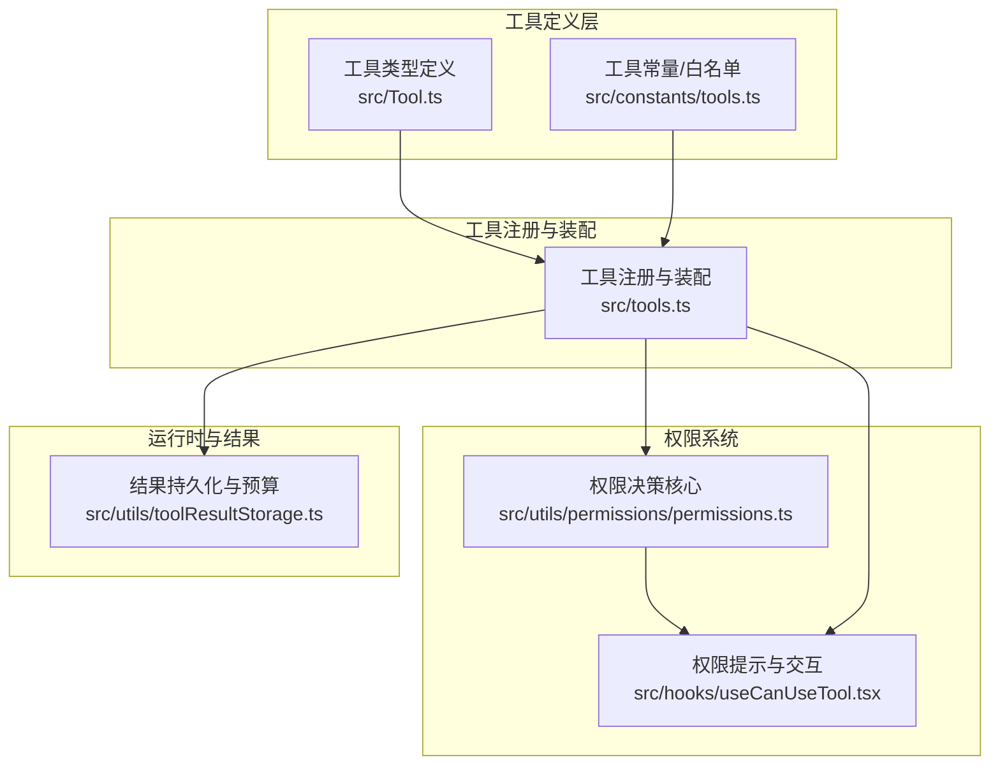
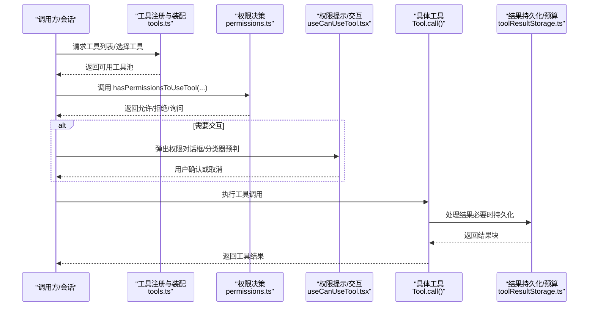
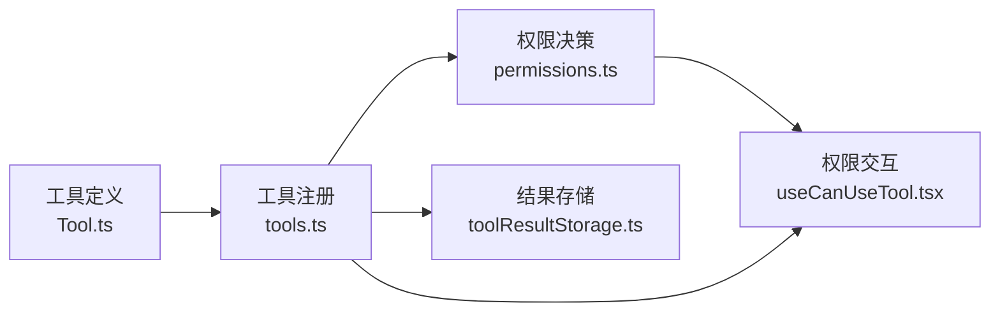

# 工具系统

<cite>
**本文引用的文件**
- [src/tools.ts](file://src/tools.ts)
- [src/Tool.ts](file://src/Tool.ts)
- [src/constants/tools.ts](file://src/constants/tools.ts)
- [src/tools/FileEditTool/FileEditTool.ts](file://src/tools/FileEditTool/FileEditTool.ts)
- [src/tools/WebFetchTool/WebFetchTool.ts](file://src/tools/WebFetchTool/WebFetchTool.ts)
- [src/tools/TaskListTool/TaskListTool.ts](file://src/tools/TaskListTool/TaskListTool.ts)
- [src/utils/permissions/permissions.ts](file://src/utils/permissions/permissions.ts)
- [src/hooks/useCanUseTool.tsx](file://src/hooks/useCanUseTool.tsx)
- [src/utils/toolResultStorage.ts](file://src/utils/toolResultStorage.ts)
</cite>

## 目录
1. [简介](#简介)
2. [项目结构](#项目结构)
3. [核心组件](#核心组件)
4. [架构总览](#架构总览)
5. [详细组件分析](#详细组件分析)
6. [依赖分析](#依赖分析)
7. [性能考量](#性能考量)
8. [故障排查指南](#故障排查指南)
9. [结论](#结论)
10. [附录](#附录)

## 简介
本文件系统性阐述 free-code 的工具系统：从设计理念到实现机制，覆盖工具注册、权限控制、执行流程、内置工具参考、自定义工具开发指南、工具与命令系统的区别与关系，并结合安全考虑与最佳实践给出可操作的建议与图示。

## 项目结构
工具系统围绕“工具类型定义”“工具注册与装配”“权限决策与提示”“结果持久化与展示”四大维度组织，核心入口与类型定义如下：
- 工具类型与默认行为：[src/Tool.ts](file://src/Tool.ts)
- 工具注册与装配（内置工具池）：[src/tools.ts](file://src/tools.ts)
- 权限规则与决策：[src/utils/permissions/permissions.ts](file://src/utils/permissions/permissions.ts)
- 权限提示与交互：[src/hooks/useCanUseTool.tsx](file://src/hooks/useCanUseTool.tsx)
- 结果持久化与预算控制：[src/utils/toolResultStorage.ts](file://src/utils/toolResultStorage.ts)
- 工具能力白名单与限制：[src/constants/tools.ts](file://src/constants/tools.ts)

图表来源
- [src/Tool.ts:1-793](file://src/Tool.ts#L1-L793)
- [src/tools.ts:1-390](file://src/tools.ts#L1-L390)
- [src/utils/permissions/permissions.ts:1-800](file://src/utils/permissions/permissions.ts#L1-L800)
- [src/hooks/useCanUseTool.tsx:1-204](file://src/hooks/useCanUseTool.tsx#L1-L204)
- [src/utils/toolResultStorage.ts:1-800](file://src/utils/toolResultStorage.ts#L1-L800)
- [src/constants/tools.ts:1-113](file://src/constants/tools.ts#L1-L113)

章节来源
- [src/tools.ts:1-390](file://src/tools.ts#L1-L390)
- [src/Tool.ts:1-793](file://src/Tool.ts#L1-L793)
- [src/constants/tools.ts:1-113](file://src/constants/tools.ts#L1-L113)

## 核心组件
- 工具类型与默认行为
  - 工具接口定义、输入输出模式、进度与渲染钩子、并发安全与只读标记、权限校验、结果映射等均在工具类型中统一约束，便于扩展与一致性保障。
  - 参考路径：[src/Tool.ts:362-695](file://src/Tool.ts#L362-L695)

- 工具注册与装配
  - 工具注册入口负责聚合所有内置工具、按环境特性启用/禁用、过滤拒绝规则、合并 MCP 工具、去重与排序，形成最终可用工具池。
  - 参考路径：[src/tools.ts:193-390](file://src/tools.ts#L193-L390)

- 权限系统
  - 权限决策贯穿“规则匹配—自动化—交互确认”三阶段；支持自动模式分类器、拒绝追踪、规则来源与优先级、MCP 服务器级规则等。
  - 参考路径：[src/utils/permissions/permissions.ts:473-800](file://src/utils/permissions/permissions.ts#L473-L800)

- 权限提示与交互
  - 提供统一的 canUseTool 入口，封装交互式/非交互式场景下的权限提示、分类器预判、协调者/群集工作流处理等。
  - 参考路径：[src/hooks/useCanUseTool.tsx:28-191](file://src/hooks/useCanUseTool.tsx#L28-L191)

- 结果持久化与预算
  - 对超大工具结果进行磁盘持久化与预览替换，避免截断；同时提供消息级聚合预算控制，确保提示词缓存前缀稳定。
  - 参考路径：[src/utils/toolResultStorage.ts:137-334](file://src/utils/toolResultStorage.ts#L137-L334)

章节来源
- [src/Tool.ts:362-695](file://src/Tool.ts#L362-L695)
- [src/tools.ts:193-390](file://src/tools.ts#L193-L390)
- [src/utils/permissions/permissions.ts:473-800](file://src/utils/permissions/permissions.ts#L473-L800)
- [src/hooks/useCanUseTool.tsx:28-191](file://src/hooks/useCanUseTool.tsx#L28-L191)
- [src/utils/toolResultStorage.ts:137-334](file://src/utils/toolResultStorage.ts#L137-L334)

## 架构总览
工具系统以“类型驱动 + 规则优先 + 交互可控”的方式组织，核心流程如下：

图表来源
- [src/tools.ts:271-327](file://src/tools.ts#L271-L327)
- [src/utils/permissions/permissions.ts:473-800](file://src/utils/permissions/permissions.ts#L473-L800)
- [src/hooks/useCanUseTool.tsx:32-191](file://src/hooks/useCanUseTool.tsx#L32-L191)
- [src/utils/toolResultStorage.ts:205-242](file://src/utils/toolResultStorage.ts#L205-L242)

## 详细组件分析

### 工具类型与默认行为（Tool 接口）
- 关键点
  - 统一的工具签名：call(args, context, canUseTool, parentMessage, onProgress)
  - 输入/输出模式：Zod schema 或 JSON Schema，支持严格模式与等价输入检测
  - 权限与安全：checkPermissions、isReadOnly、isDestructive、isConcurrencySafe
  - 渲染与展示：renderToolUseMessage/renderToolResultMessage 等钩子
  - 结果映射：mapToolResultToToolResultBlockParam
  - 默认行为：buildTool 填充 isEnabled/isReadOnly/isDestructive/checkPermissions 等默认值
- 参考路径
  - [src/Tool.ts:362-695](file://src/Tool.ts#L362-L695)
  - [src/Tool.ts:783-792](file://src/Tool.ts#L783-L792)

章节来源
- [src/Tool.ts:362-695](file://src/Tool.ts#L362-L695)
- [src/Tool.ts:783-792](file://src/Tool.ts#L783-L792)

### 工具注册与装配（工具池）
- 关键点
  - getAllBaseTools：聚合所有内置工具，按特性开关与环境变量启用/禁用
  - getTools：按权限上下文过滤、REPL 模式隐藏原始工具、按 isEnabled 过滤
  - assembleToolPool：合并内置与 MCP 工具，按名称去重，内置工具优先
  - filterToolsByDenyRules：基于拒绝规则过滤工具
- 参考路径
  - [src/tools.ts:193-251](file://src/tools.ts#L193-L251)
  - [src/tools.ts:271-327](file://src/tools.ts#L271-L327)
  - [src/tools.ts:345-367](file://src/tools.ts#L345-L367)

章节来源
- [src/tools.ts:193-251](file://src/tools.ts#L193-L251)
- [src/tools.ts:271-327](file://src/tools.ts#L271-L327)
- [src/tools.ts:345-367](file://src/tools.ts#L345-L367)

### 权限系统（规则、自动化与交互）
- 关键点
  - 规则来源与优先级：allow > deny > ask；支持多来源（设置、命令行、会话等）
  - 自动模式：分类器快速判定、接受编辑模式豁免、安全工具白名单
  - 拒绝追踪：连续拒绝计数与阈值触发，避免无限拒绝
  - MCP 服务器级规则：支持 mcp__server* 前缀规则
  - 交互式提示：针对 ask 场景弹窗/桥接/通道回调
- 参考路径
  - [src/utils/permissions/permissions.ts:122-390](file://src/utils/permissions/permissions.ts#L122-L390)
  - [src/utils/permissions/permissions.ts:473-800](file://src/utils/permissions/permissions.ts#L473-L800)

章节来源
- [src/utils/permissions/permissions.ts:122-390](file://src/utils/permissions/permissions.ts#L122-L390)
- [src/utils/permissions/permissions.ts:473-800](file://src/utils/permissions/permissions.ts#L473-L800)

### 权限提示与交互（useCanUseTool）
- 关键点
  - 统一入口 hasPermissionsToUseTool，封装自动模式、分类器预判、协调者/群集处理
  - 非交互场景（后台代理）的自动化检查与拒绝
  - 分类器审批状态记录与 UI 展示
- 参考路径
  - [src/hooks/useCanUseTool.tsx:28-191](file://src/hooks/useCanUseTool.tsx#L28-L191)

章节来源
- [src/hooks/useCanUseTool.tsx:28-191](file://src/hooks/useCanUseTool.tsx#L28-L191)

### 结果持久化与预算（toolResultStorage）
- 关键点
  - 大结果磁盘持久化：超过阈值自动落盘，返回预览消息
  - 预算控制：按消息聚合预算，保证提示词缓存前缀稳定
  - 空结果处理：注入占位文本避免模型误终止
- 参考路径
  - [src/utils/toolResultStorage.ts:137-334](file://src/utils/toolResultStorage.ts#L137-L334)
  - [src/utils/toolResultStorage.ts:769-800](file://src/utils/toolResultStorage.ts#L769-L800)

章节来源
- [src/utils/toolResultStorage.ts:137-334](file://src/utils/toolResultStorage.ts#L137-L334)
- [src/utils/toolResultStorage.ts:769-800](file://src/utils/toolResultStorage.ts#L769-L800)

### 内置工具参考

#### 文件编辑工具（FileEditTool）
- 功能要点
  - 严格输入校验：路径存在性、大小限制、内容一致性、字符串匹配与替换策略
  - 权限校验：写入权限、禁止目录、UNC 路径安全、笔记文件专用工具提示
  - 安全与可观测：读取时间戳对比、文件历史备份、LSP 通知、统计事件
  - 输出：结构化补丁、用户修改标记、可选 Git Diff
- 参考路径
  - [src/tools/FileEditTool/FileEditTool.ts:137-595](file://src/tools/FileEditTool/FileEditTool.ts#L137-L595)

章节来源
- [src/tools/FileEditTool/FileEditTool.ts:137-595](file://src/tools/FileEditTool/FileEditTool.ts#L137-L595)

#### 网络请求工具（WebFetchTool）
- 功能要点
  - URL 校验与重定向检测；预批准主机豁免；内容提取与提示词应用
  - 权限规则：按域名生成规则内容，支持 allow/deny/ask；自动提示建议
  - 输出：字节大小、HTTP 状态、处理耗时、结果文本；二进制内容落盘并提示
- 参考路径
  - [src/tools/WebFetchTool/WebFetchTool.ts:191-307](file://src/tools/WebFetchTool/WebFetchTool.ts#L191-L307)

章节来源
- [src/tools/WebFetchTool/WebFetchTool.ts:191-307](file://src/tools/WebFetchTool/WebFetchTool.ts#L191-L307)

#### 任务管理工具（TaskListTool）
- 功能要点
  - 列表任务：过滤内部任务、阻塞关系解析、状态汇总
  - 输出：简洁文本列表；空任务提示
- 参考路径
  - [src/tools/TaskListTool/TaskListTool.ts:65-116](file://src/tools/TaskListTool/TaskListTool.ts#L65-L116)

章节来源
- [src/tools/TaskListTool/TaskListTool.ts:65-116](file://src/tools/TaskListTool/TaskListTool.ts#L65-L116)

### 自定义工具开发指南
- 工具定义
  - 使用 buildTool 包装工具定义，提供 name、inputSchema、outputSchema、call、checkPermissions、render 系列钩子等
  - 参考路径：[src/Tool.ts:783-792](file://src/Tool.ts#L783-L792)
- 权限声明
  - 在 checkPermissions 中实现规则匹配与建议；必要时通过 getRuleByContentsForTool 生成规则内容
  - 参考路径：[src/utils/permissions/permissions.ts:349-390](file://src/utils/permissions/permissions.ts#L349-L390)
- 结果处理
  - 实现 mapToolResultToToolResultBlockParam；对大结果交由 processToolResultBlock 自动持久化
  - 参考路径：[src/utils/toolResultStorage.ts:205-242](file://src/utils/toolResultStorage.ts#L205-L242)
- 错误处理
  - validateInput 返回明确错误码与元信息；renderToolUseErrorMessage 提供定制化错误 UI
  - 参考路径：[src/Tool.ts:489-503](file://src/Tool.ts#L489-L503)

章节来源
- [src/Tool.ts:783-792](file://src/Tool.ts#L783-L792)
- [src/utils/permissions/permissions.ts:349-390](file://src/utils/permissions/permissions.ts#L349-L390)
- [src/utils/toolResultStorage.ts:205-242](file://src/utils/toolResultStorage.ts#L205-L242)
- [src/Tool.ts:489-503](file://src/Tool.ts#L489-L503)

### 工具与命令系统的区别与关系
- 工具（Tool）
  - 面向“能力执行”，强调输入输出、权限、并发安全、渲染与结果持久化
  - 通过工具池装配，支持内置与 MCP 合并
- 命令（Command）
  - 面向“会话控制与配置”，通常不直接产生外部副作用
  - 与工具系统互补：命令影响工具可用性（如 --tools 预设）、权限模式、工作目录等
- 关系
  - 工具池装配时会考虑命令行参数与会话状态；权限提示与交互在工具调用前统一处理
- 参考路径
  - [src/tools.ts:165-183](file://src/tools.ts#L165-L183)
  - [src/tools.ts:345-367](file://src/tools.ts#L345-L367)

章节来源
- [src/tools.ts:165-183](file://src/tools.ts#L165-L183)
- [src/tools.ts:345-367](file://src/tools.ts#L345-L367)

## 依赖分析
- 组件耦合
  - 工具类型与工具实现强耦合（必须实现 inputSchema/outputSchema/call 等）
  - 工具池依赖权限系统与结果存储；权限系统依赖规则来源与分类器
- 外部依赖
  - MCP 工具通过工具池合并；权限系统支持多来源规则与分类器
- 循环依赖规避
  - 工具池中对 TeamCreateTool/TeamDeleteTool/SendMessageTool 采用延迟 require，避免循环导入

图表来源
- [src/Tool.ts:362-695](file://src/Tool.ts#L362-L695)
- [src/tools.ts:193-390](file://src/tools.ts#L193-L390)
- [src/utils/permissions/permissions.ts:473-800](file://src/utils/permissions/permissions.ts#L473-L800)
- [src/hooks/useCanUseTool.tsx:28-191](file://src/hooks/useCanUseTool.tsx#L28-L191)
- [src/utils/toolResultStorage.ts:137-334](file://src/utils/toolResultStorage.ts#L137-L334)

章节来源
- [src/tools.ts:63-72](file://src/tools.ts#L63-L72)

## 性能考量
- 工具池装配
  - 使用 uniqBy 保持内置工具前缀连续，避免 MCP 工具打乱导致提示词缓存失效
  - 参考路径：[src/tools.ts:363-366](file://src/tools.ts#L363-L366)
- 权限决策
  - 自动模式下优先 acceptEdits 白名单与安全工具豁免，减少分类器调用
  - 参考路径：[src/utils/permissions/permissions.ts:593-686](file://src/utils/permissions/permissions.ts#L593-L686)
- 结果持久化
  - 预览模板与预估令牌数用于成本分析；仅对超阈值内容落盘
  - 参考路径：[src/utils/toolResultStorage.ts:324-334](file://src/utils/toolResultStorage.ts#L324-L334)

章节来源
- [src/tools.ts:363-366](file://src/tools.ts#L363-L366)
- [src/utils/permissions/permissions.ts:593-686](file://src/utils/permissions/permissions.ts#L593-L686)
- [src/utils/toolResultStorage.ts:324-334](file://src/utils/toolResultStorage.ts#L324-L334)

## 故障排查指南
- 权限相关
  - 检查规则来源与优先级：allow/deny/ask；确认是否命中 MCP 服务器级规则
  - 自动模式被拒：查看分类器原因与拒绝计数；必要时调整规则或切换模式
  - 参考路径：[src/utils/permissions/permissions.ts:122-390](file://src/utils/permissions/permissions.ts#L122-L390)
- 工具调用失败
  - validateInput 报错：根据错误码与元信息定位（路径、大小、内容一致性等）
  - 权限提示未出现：确认 shouldAvoidPermissionPrompts 与 awaitAutomatedChecksBeforeDialog
  - 参考路径：[src/Tool.ts:489-503](file://src/Tool.ts#L489-L503)
- 结果过大
  - 检查持久化阈值与特征开关；确认预览内容与落盘路径
  - 参考路径：[src/utils/toolResultStorage.ts:137-334](file://src/utils/toolResultStorage.ts#L137-L334)

章节来源
- [src/utils/permissions/permissions.ts:122-390](file://src/utils/permissions/permissions.ts#L122-L390)
- [src/Tool.ts:489-503](file://src/Tool.ts#L489-L503)
- [src/utils/toolResultStorage.ts:137-334](file://src/utils/toolResultStorage.ts#L137-L334)

## 结论
工具系统通过“类型驱动 + 规则优先 + 交互可控”的设计，在保证安全性的同时提供了强大的扩展性与可维护性。工具注册与装配、权限决策与交互、结果持久化与预算控制三大支柱协同工作，既满足复杂场景需求，又兼顾性能与稳定性。建议在自定义工具开发中遵循统一的类型与权限约定，并充分利用内置工具的渲染与结果处理能力。

## 附录
- 工具能力白名单与限制
  - 参考路径：[src/constants/tools.ts:36-113](file://src/constants/tools.ts#L36-L113)
- 工具池装配流程（简化）
  - 参考路径：[src/tools.ts:193-390](file://src/tools.ts#L193-L390)