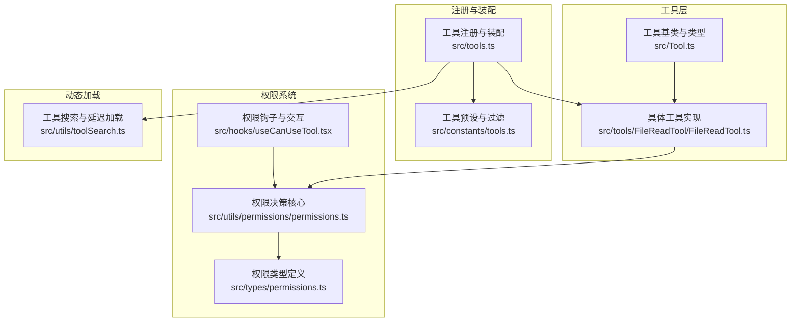
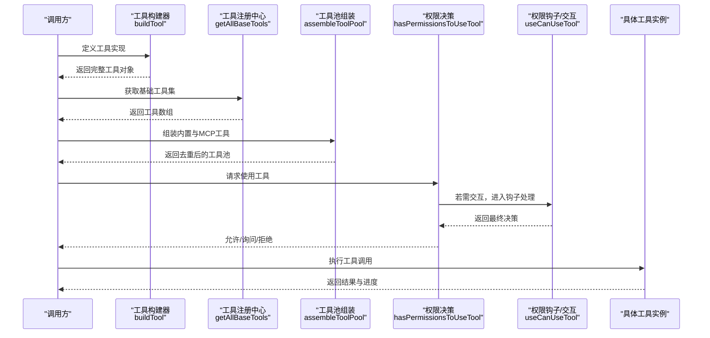
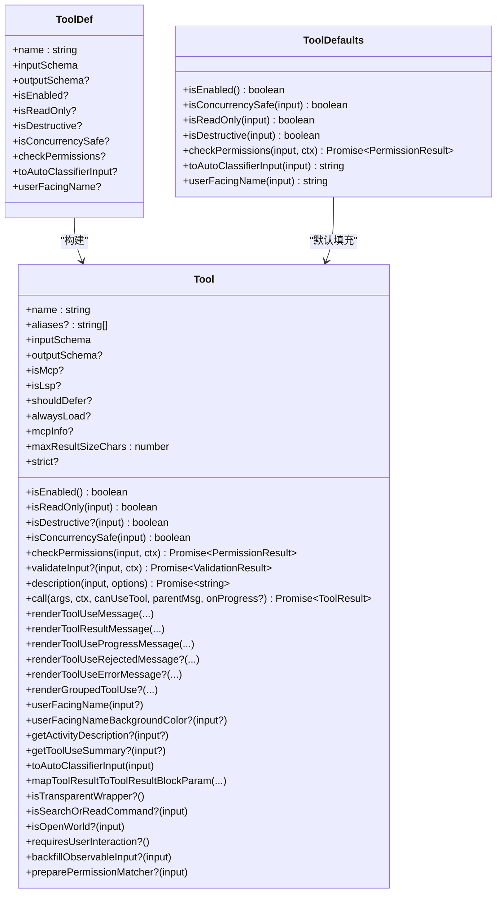
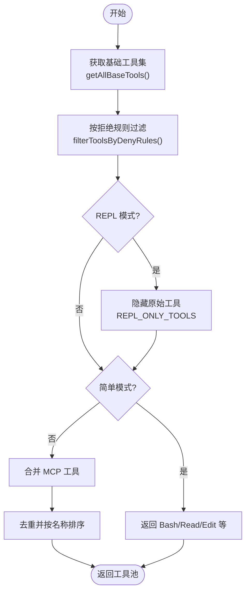
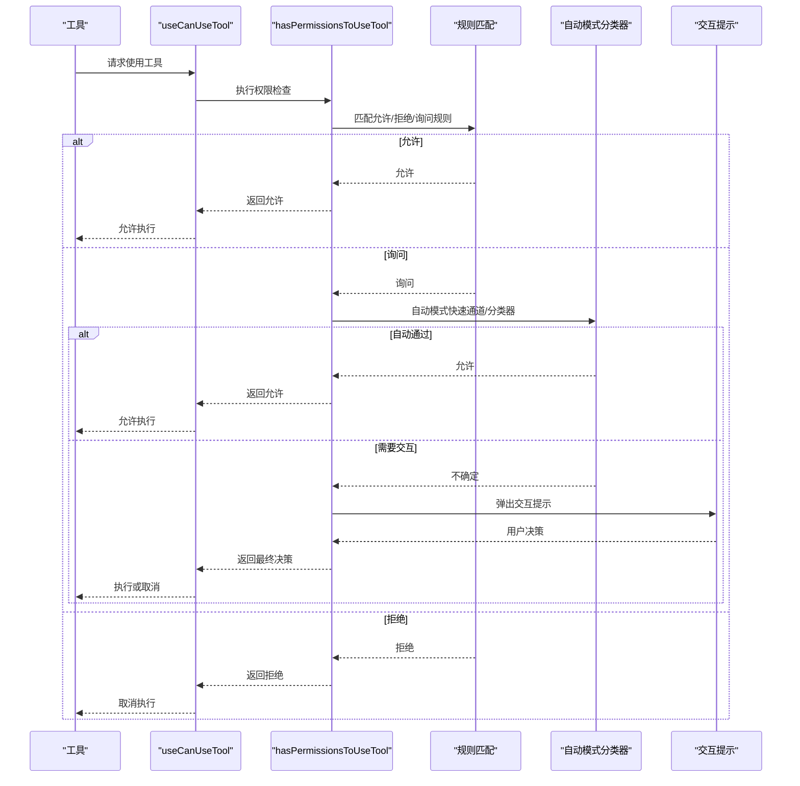
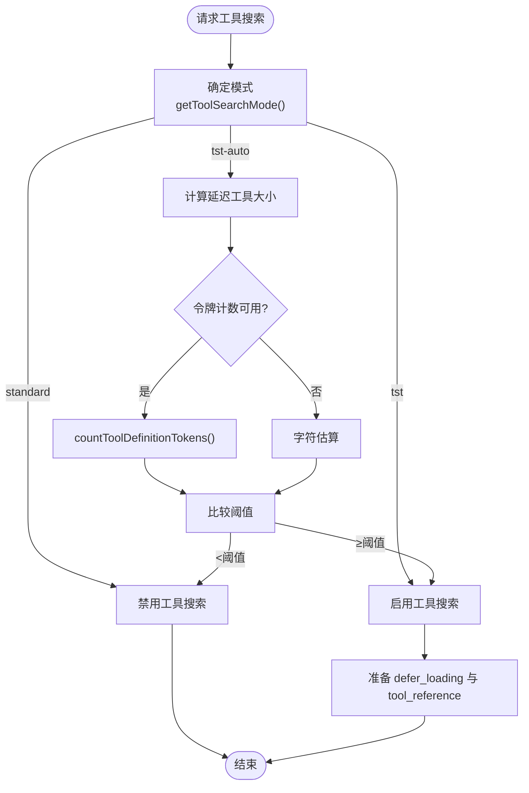
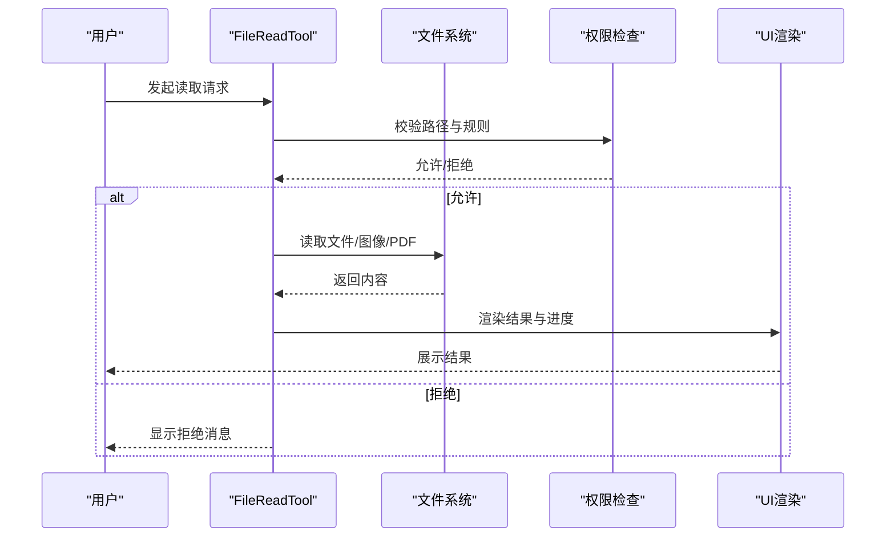
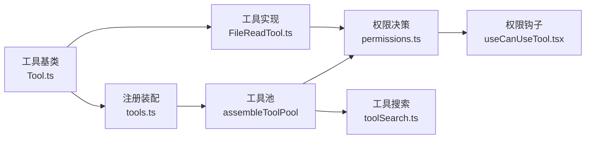

# 工具系统架构

<cite>
**本文引用的文件**
- [src/Tool.ts](file://src/Tool.ts)
- [src/tools.ts](file://src/tools.ts)
- [src/constants/tools.ts](file://src/constants/tools.ts)
- [src/utils/permissions/permissions.ts](file://src/utils/permissions/permissions.ts)
- [src/hooks/useCanUseTool.tsx](file://src/hooks/useCanUseTool.tsx)
- [src/types/permissions.ts](file://src/types/permissions.ts)
- [src/utils/toolSearch.ts](file://src/utils/toolSearch.ts)
- [src/tools/FileReadTool/FileReadTool.ts](file://src/tools/FileReadTool/FileReadTool.ts)
</cite>

## 目录
1. [简介](#简介)
2. [项目结构](#项目结构)
3. [核心组件](#核心组件)
4. [架构总览](#架构总览)
5. [详细组件分析](#详细组件分析)
6. [依赖关系分析](#依赖关系分析)
7. [性能考量](#性能考量)
8. [故障排查指南](#故障排查指南)
9. [结论](#结论)
10. [附录](#附录)

## 简介
本文件系统性阐述 free-code 的工具系统架构，围绕工具基类设计、工具注册机制、工具池组装流程展开；深入解析工具生命周期管理、权限控制系统与动态加载机制；覆盖工具接口定义、工具元数据结构与状态管理；解释工具与权限系统的集成方式（权限规则匹配、工具过滤与访问控制）；并给出工具系统的核心概念：工具预设、条件工具加载与工具去重机制。文末提供基于源码路径的实际示例，帮助读者理解内部工作原理与扩展点。

## 项目结构
工具系统主要由以下模块构成：
- 工具基类与类型定义：统一的工具接口、默认实现与工具集合类型
- 工具注册与装配：按环境与特性条件动态组装工具列表
- 权限系统：规则匹配、决策流、自动模式与交互式提示
- 动态加载：工具搜索与延迟加载（ToolSearch）
- 工具实现样例：以文件读取工具为例展示工具的输入校验、权限检查与渲染

**图表来源**
- [src/Tool.ts:1-793](file://src/Tool.ts#L1-L793)
- [src/tools.ts:1-390](file://src/tools.ts#L1-L390)
- [src/constants/tools.ts:1-113](file://src/constants/tools.ts#L1-L113)
- [src/utils/permissions/permissions.ts:1-800](file://src/utils/permissions/permissions.ts#L1-L800)
- [src/hooks/useCanUseTool.tsx:1-204](file://src/hooks/useCanUseTool.tsx#L1-L204)
- [src/types/permissions.ts:1-442](file://src/types/permissions.ts#L1-L442)
- [src/utils/toolSearch.ts:1-757](file://src/utils/toolSearch.ts#L1-L757)

**章节来源**
- [src/Tool.ts:1-793](file://src/Tool.ts#L1-L793)
- [src/tools.ts:1-390](file://src/tools.ts#L1-L390)
- [src/constants/tools.ts:1-113](file://src/constants/tools.ts#L1-L113)
- [src/utils/permissions/permissions.ts:1-800](file://src/utils/permissions/permissions.ts#L1-L800)
- [src/hooks/useCanUseTool.tsx:1-204](file://src/hooks/useCanUseTool.tsx#L1-L204)
- [src/types/permissions.ts:1-442](file://src/types/permissions.ts#L1-L442)
- [src/utils/toolSearch.ts:1-757](file://src/utils/toolSearch.ts#L1-L757)

## 核心组件
- 工具基类与接口
  - 工具类型定义、输入输出模式、进度与结果结构、工具能力标记（并发安全、只读、破坏性等）
  - 工具构建器 buildTool：统一填充默认方法，确保一致性与安全性
  - 工具匹配与查找工具名的辅助函数
- 工具注册与装配
  - 工具集合 Tools：工具数组的类型别名，便于追踪与传递
  - 工具注册入口：getAllBaseTools 按环境与特性条件聚合内置工具
  - 工具过滤：按权限上下文过滤、REPL 模式隐藏、简单模式裁剪
  - 工具池组装：assembleToolPool 合并内置与 MCP 工具，去重并排序
- 权限系统
  - 权限上下文 ToolPermissionContext：模式、额外工作目录、规则来源映射
  - 规则匹配：工具级与内容级规则、MCP 服务器前缀规则
  - 决策流：允许/询问/拒绝，支持自动模式与交互式提示
- 动态加载
  - 工具搜索模式：标准、TST（ToolSearchTool）、TST-Auto（阈值触发）
  - 延迟加载：defer_loading 与 tool_reference，按需加载 MCP 工具
  - 阈值计算：基于令牌计数或字符估算，结合模型上下文窗口

**章节来源**
- [src/Tool.ts:362-793](file://src/Tool.ts#L362-L793)
- [src/tools.ts:190-390](file://src/tools.ts#L190-L390)
- [src/utils/permissions/permissions.ts:233-800](file://src/utils/permissions/permissions.ts#L233-L800)
- [src/utils/toolSearch.ts:154-473](file://src/utils/toolSearch.ts#L154-L473)

## 架构总览
工具系统通过“基类 + 构建器 + 注册装配 + 权限决策 + 动态加载”的分层设计，实现可扩展、可配置、可审计的工具生态。下图展示了从工具定义到运行时调用的关键交互：

**图表来源**
- [src/Tool.ts:783-793](file://src/Tool.ts#L783-L793)
- [src/tools.ts:190-390](file://src/tools.ts#L190-L390)
- [src/utils/permissions/permissions.ts:473-800](file://src/utils/permissions/permissions.ts#L473-L800)
- [src/hooks/useCanUseTool.tsx:28-191](file://src/hooks/useCanUseTool.tsx#L28-L191)

## 详细组件分析

### 工具基类与构建器
- 工具接口要点
  - 输入/输出模式：使用 Zod 类型或 JSON Schema 描述参数与返回
  - 能力标记：并发安全、只读、破坏性、是否需要用户交互、是否 MCP/LSP 等
  - 生命周期钩子：描述生成、输入校验、权限检查、渲染、进度回调、结果消息渲染等
  - 结果与消息：ToolResult、进度消息、UI 渲染节点、错误/拒绝 UI
- 工具构建器
  - 默认策略：失败闭合（如并发不安全、只写、非破坏性默认 false），权限检查默认放行
  - 用户名显示：默认使用工具名，可自定义用户可见名称与主题色
  - 保证一致性：所有工具导出均通过 buildTool，避免遗漏关键方法

**图表来源**
- [src/Tool.ts:362-793](file://src/Tool.ts#L362-L793)

**章节来源**
- [src/Tool.ts:362-793](file://src/Tool.ts#L362-L793)

### 工具注册与装配机制
- 工具注册
  - getAllBaseTools：按环境变量与特性开关聚合内置工具，剔除冗余（如嵌入搜索工具时跳过独立工具）
  - 条件工具：根据 NODE_ENV、USER_TYPE、特性开关（feature）动态引入
  - 特殊工具：ListMcpResourcesTool、ReadMcpResourceTool、SyntheticOutputTool 等特殊处理
- 工具过滤
  - 拒绝规则过滤：filterToolsByDenyRules 基于规则匹配直接剔除
  - REPL 模式：隐藏仅 REPL 可用的原始工具，保留 REPL 包裹工具
  - 简单模式：仅返回 Bash、FileRead、FileEdit 等核心工具
- 工具池组装
  - assembleToolPool：合并内置与 MCP 工具，按名称排序并去重，内置优先
  - getMergedTools：返回内置与 MCP 工具拼接（不进行去重）

**图表来源**
- [src/tools.ts:190-390](file://src/tools.ts#L190-L390)

**章节来源**
- [src/tools.ts:190-390](file://src/tools.ts#L190-L390)

### 权限控制系统与集成
- 权限上下文
  - ToolPermissionContext：包含模式、额外工作目录、三类规则映射、是否可绕过权限等
  - 权限类型：模式（default、dontAsk、auto、plan 等）、行为（allow/deny/ask）、规则来源（设置、命令行、会话等）
- 权限决策流程
  - hasPermissionsToUseTool：综合规则匹配、工具自定义检查、自动模式分类器、交互式提示
  - 步骤概览：规则匹配 → 工具自检 → 自动模式快速通道 → 分类器评估 → 交互式确认
- 与工具的集成
  - 工具在 call 前通过 useCanUseTool 进行权限检查，必要时阻断或要求用户确认
  - 工具可提供 preparePermissionMatcher 以支持更细粒度的规则匹配

**图表来源**
- [src/hooks/useCanUseTool.tsx:28-191](file://src/hooks/useCanUseTool.tsx#L28-L191)
- [src/utils/permissions/permissions.ts:473-800](file://src/utils/permissions/permissions.ts#L473-L800)

**章节来源**
- [src/types/permissions.ts:1-442](file://src/types/permissions.ts#L1-L442)
- [src/utils/permissions/permissions.ts:233-800](file://src/utils/permissions/permissions.ts#L233-L800)
- [src/hooks/useCanUseTool.tsx:1-204](file://src/hooks/useCanUseTool.tsx#L1-L204)

### 动态加载与工具搜索
- 工具搜索模式
  - 模式：标准（禁用）、TST（总是启用 ToolSearchTool）、TST-Auto（阈值触发）
  - 模型兼容：基于 tool_reference 支持检测（如部分模型不支持）
  - 乐观启用：isToolSearchEnabledOptimistic 用于提前注入 ToolSearchTool
- 延迟加载
  - defer_loading：工具定义延迟加载
  - tool_reference：ToolSearchTool 返回工具引用，模型上下文中展开为完整定义
- 阈值计算
  - 使用令牌计数 API 计算延迟工具总大小；不可用时回退字符估算
  - 结合模型上下文窗口与百分比阈值决定是否启用

**图表来源**
- [src/utils/toolSearch.ts:154-473](file://src/utils/toolSearch.ts#L154-L473)

**章节来源**
- [src/utils/toolSearch.ts:1-757](file://src/utils/toolSearch.ts#L1-L757)

### 工具生命周期与状态管理
- 生命周期阶段
  - 定义阶段：通过 buildTool 注册，填充默认方法
  - 装配阶段：getAllBaseTools 与 assembleToolPool 组装工具池
  - 权限阶段：useCanUseTool 与 hasPermissionsToUseTool 决策
  - 执行阶段：工具 call，支持进度回调与 UI 渲染
  - 结束阶段：记录统计、清理资源、更新状态（如拒绝计数）
- 状态与上下文
  - ToolUseContext：会话上下文、文件读取缓存、通知与消息管理
  - ToolPermissionContext：权限模式、规则来源、额外工作目录
  - DenialTrackingState：自动模式下的连续拒绝计数与持久化

**章节来源**
- [src/Tool.ts:158-300](file://src/Tool.ts#L158-L300)
- [src/utils/permissions/permissions.ts:473-800](file://src/utils/permissions/permissions.ts#L473-L800)

### 工具与权限系统的集成示例
- 文件读取工具（FileReadTool）
  - 输入校验：路径合法性、设备文件阻断、macOS 截图路径变体处理
  - 权限检查：基于文件系统规则匹配与通配符规则
  - 渲染与结果：支持行号、图像缩放、PDF 提取、令牌计数估算
  - UI 行为：注册文件读取监听器、错误消息与标签渲染

**图表来源**
- [src/tools/FileReadTool/FileReadTool.ts:1-200](file://src/tools/FileReadTool/FileReadTool.ts#L1-L200)
- [src/utils/permissions/permissions.ts:233-800](file://src/utils/permissions/permissions.ts#L233-L800)

**章节来源**
- [src/tools/FileReadTool/FileReadTool.ts:1-200](file://src/tools/FileReadTool/FileReadTool.ts#L1-L200)

## 依赖关系分析
- 模块耦合
  - 工具基类与实现：通过 buildTool 与工具接口强耦合，确保一致行为
  - 权限系统：工具通过 ToolPermissionContext 与权限决策解耦，工具仅暴露检查点
  - 动态加载：工具搜索与 MCP 工具通过统一的工具池接口集成
- 外部依赖
  - 特性开关（feature）：按构建特性动态引入工具与功能
  - 环境变量：控制工具可用性与行为（如 SIMPLE 模式、REPL 模式）
  - 分析与日志：令牌计数、统计事件、调试日志

**图表来源**
- [src/Tool.ts:1-793](file://src/Tool.ts#L1-L793)
- [src/tools.ts:1-390](file://src/tools.ts#L1-L390)
- [src/utils/permissions/permissions.ts:1-800](file://src/utils/permissions/permissions.ts#L1-L800)
- [src/hooks/useCanUseTool.tsx:1-204](file://src/hooks/useCanUseTool.tsx#L1-L204)
- [src/utils/toolSearch.ts:1-757](file://src/utils/toolSearch.ts#L1-L757)

**章节来源**
- [src/Tool.ts:1-793](file://src/Tool.ts#L1-L793)
- [src/tools.ts:1-390](file://src/tools.ts#L1-L390)
- [src/utils/permissions/permissions.ts:1-800](file://src/utils/permissions/permissions.ts#L1-L800)
- [src/hooks/useCanUseTool.tsx:1-204](file://src/hooks/useCanUseTool.tsx#L1-L204)
- [src/utils/toolSearch.ts:1-757](file://src/utils/toolSearch.ts#L1-L757)

## 性能考量
- 工具池排序与去重：使用稳定排序与 uniqBy 保持提示缓存稳定性，避免因 MCP 工具插入导致缓存失效
- 令牌计数缓存：工具搜索的令牌计数通过 memoize 缓存，减少重复计算
- 自动模式快速通道：acceptEdits 快速路径与安全工具白名单减少分类器调用开销
- I/O 限制：文件读取工具内置令牌上限与大小限制，避免大文件读取造成内存压力

## 故障排查指南
- 工具未出现
  - 检查是否被拒绝规则过滤：使用 getDenyRuleForTool 排查
  - 检查是否处于 REPL 模式且被隐藏：REPL_ONLY_TOOLS 逻辑
  - 检查是否处于 SIMPLE 模式：仅返回核心工具
- 权限被拒
  - 查看权限决策原因：PermissionDecisionReason 中的类型与描述
  - 检查自动模式分类器是否可用：TRANSCRIPT_CLASSIFIER 开关
  - 检查交互提示是否被禁用：shouldAvoidPermissionPrompts
- 动态加载异常
  - 检查模型是否支持 tool_reference：modelSupportsToolReference
  - 检查 ToolSearchTool 是否可用：isToolSearchToolAvailable
  - 检查阈值计算是否正确：令牌计数 API 可用性与字符估算回退

**章节来源**
- [src/utils/permissions/permissions.ts:233-800](file://src/utils/permissions/permissions.ts#L233-L800)
- [src/utils/toolSearch.ts:239-473](file://src/utils/toolSearch.ts#L239-L473)

## 结论
free-code 的工具系统通过清晰的基类设计、严格的构建器默认策略、灵活的注册与装配机制、完善的权限控制与动态加载能力，实现了高可扩展性与强安全性。工具接口统一、权限决策可审计、动态加载按需触发，既满足复杂场景需求，又保持了良好的性能与可维护性。开发者可通过 buildTool 快速扩展新工具，并利用权限系统与工具搜索实现细粒度的安全控制与用户体验优化。

## 附录
- 实际代码示例（以路径代替代码片段）
  - 工具基类与构建器
    - [工具接口定义与默认方法:362-793](file://src/Tool.ts#L362-L793)
  - 工具注册与装配
    - [基础工具聚合与条件引入:190-251](file://src/tools.ts#L190-L251)
    - [按权限过滤与 REPL/简单模式处理:253-327](file://src/tools.ts#L253-L327)
    - [工具池组装与去重排序:330-367](file://src/tools.ts#L330-L367)
  - 权限系统
    - [权限上下文与规则类型:419-442](file://src/types/permissions.ts#L419-L442)
    - [权限决策主流程:473-800](file://src/utils/permissions/permissions.ts#L473-L800)
    - [权限钩子与交互:28-191](file://src/hooks/useCanUseTool.tsx#L28-L191)
  - 动态加载与工具搜索
    - [工具搜索模式与阈值计算:154-473](file://src/utils/toolSearch.ts#L154-L473)
  - 工具实现示例
    - [文件读取工具：输入校验、权限检查与渲染:1-200](file://src/tools/FileReadTool/FileReadTool.ts#L1-L200)