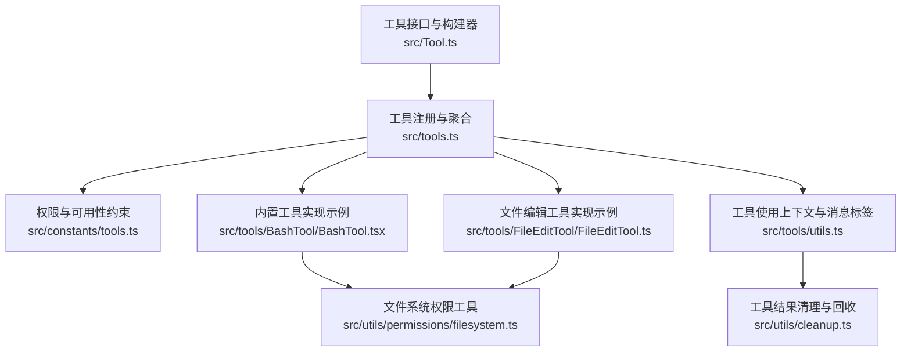
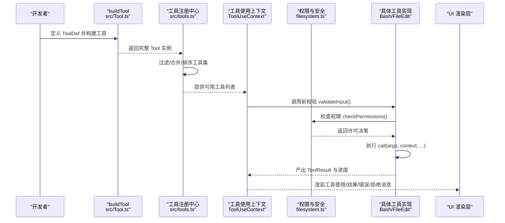
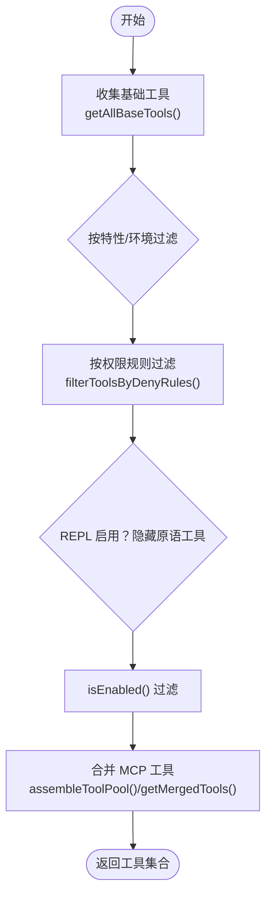
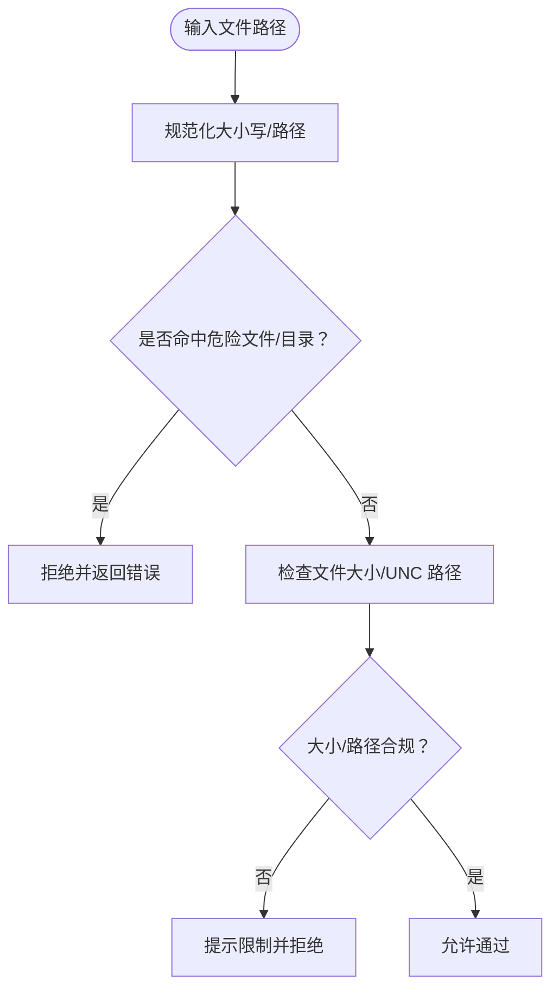
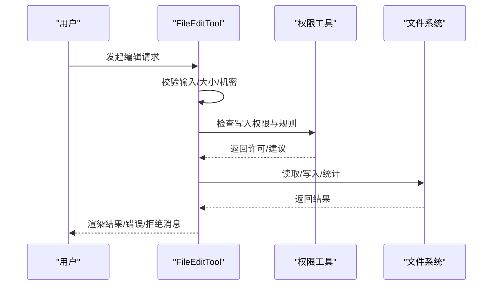
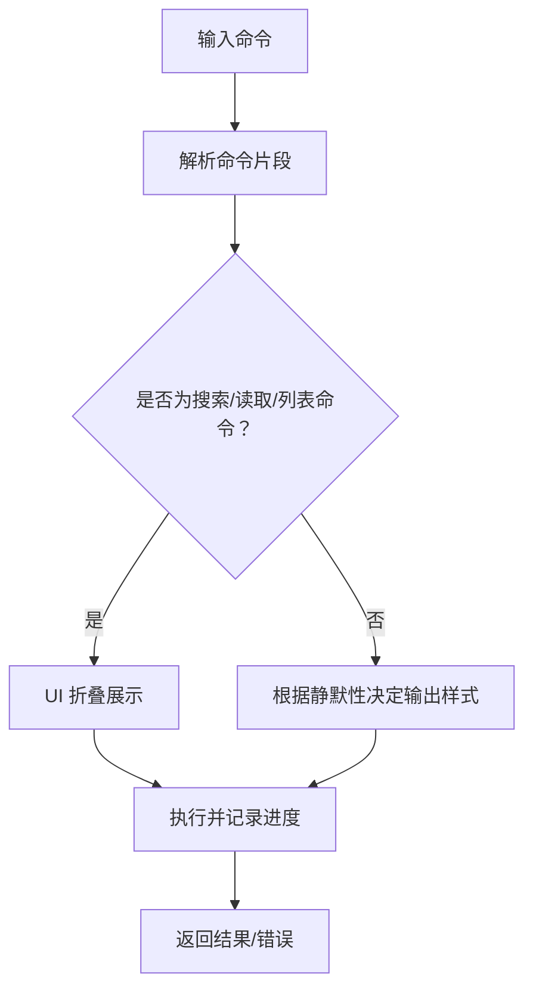
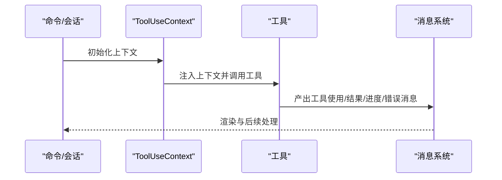
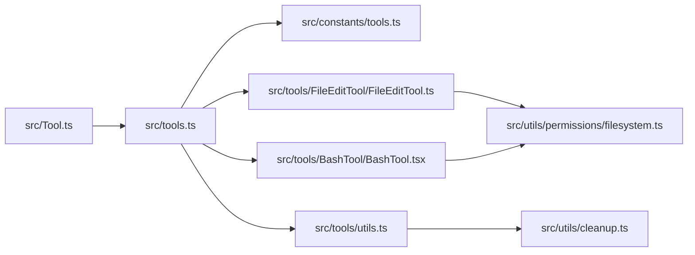

# 自定义工具开发

<cite>
**本文引用的文件**
- [src/Tool.ts](file://src/Tool.ts)
- [src/tools.ts](file://src/tools.ts)
- [src/constants/tools.ts](file://src/constants/tools.ts)
- [src/tools/FileEditTool/FileEditTool.ts](file://src/tools/FileEditTool/FileEditTool.ts)
- [src/tools/BashTool/BashTool.tsx](file://src/tools/BashTool/BashTool.tsx)
- [src/utils/permissions/filesystem.ts](file://src/utils/permissions/filesystem.ts)
- [src/tools/utils.ts](file://src/tools/utils.ts)
- [src/utils/cleanup.ts](file://src/utils/cleanup.ts)
</cite>

## 目录
1. [简介](#简介)
2. [项目结构](#项目结构)
3. [核心组件](#核心组件)
4. [架构总览](#架构总览)
5. [详细组件分析](#详细组件分析)
6. [依赖关系分析](#依赖关系分析)
7. [性能考量](#性能考量)
8. [故障排查指南](#故障排查指南)
9. [结论](#结论)
10. [附录](#附录)

## 简介
本指南面向在 free-code 平台上开发“自定义工具”的工程师，系统讲解如何创建新的代理工具（Tool），包括工具类继承与组合、必需方法与可选扩展、参数校验、结果处理、错误处理、权限声明与安全检查、工具注册流程、与命令系统的集成、测试与调试、性能优化、版本管理与发布等。文档以仓库现有工具体系为依据，提供从简单到复杂的实现范式，并给出可视化图示帮助理解。

## 项目结构
free-code 的工具系统围绕统一的工具接口与构建器展开：所有工具实现遵循统一的 Tool 接口，通过 buildTool 构建器填充默认行为；工具集合由 tools.ts 汇总，按环境与权限过滤后注入到会话上下文；权限规则集中于 constants/tools.ts 与权限工具模块中；典型工具如 BashTool、FileEditTool 展示了输入校验、权限检查、进度渲染、结果消息与错误消息的完整实现路径。



**图表来源**
- [src/Tool.ts:1-793](file://src/Tool.ts#L1-L793)
- [src/tools.ts:1-390](file://src/tools.ts#L1-L390)
- [src/constants/tools.ts:1-113](file://src/constants/tools.ts#L1-L113)
- [src/tools/BashTool/BashTool.tsx:1-200](file://src/tools/BashTool/BashTool.tsx#L1-L200)
- [src/tools/FileEditTool/FileEditTool.ts:1-200](file://src/tools/FileEditTool/FileEditTool.ts#L1-L200)
- [src/utils/permissions/filesystem.ts:1-200](file://src/utils/permissions/filesystem.ts#L1-L200)
- [src/tools/utils.ts:1-41](file://src/tools/utils.ts#L1-L41)
- [src/utils/cleanup.ts:218-252](file://src/utils/cleanup.ts#L218-L252)

**章节来源**
- [src/Tool.ts:1-793](file://src/Tool.ts#L1-L793)
- [src/tools.ts:1-390](file://src/tools.ts#L1-L390)
- [src/constants/tools.ts:1-113](file://src/constants/tools.ts#L1-L113)
- [src/tools/BashTool/BashTool.tsx:1-200](file://src/tools/BashTool/BashTool.tsx#L1-L200)
- [src/tools/FileEditTool/FileEditTool.ts:1-200](file://src/tools/FileEditTool/FileEditTool.ts#L1-L200)
- [src/utils/permissions/filesystem.ts:1-200](file://src/utils/permissions/filesystem.ts#L1-L200)
- [src/tools/utils.ts:1-41](file://src/tools/utils.ts#L1-L41)
- [src/utils/cleanup.ts:218-252](file://src/utils/cleanup.ts#L218-L252)

## 核心组件
- 工具接口与构建器
  - Tool 定义了工具的名称、输入/输出模式、描述、调用、权限、渲染、摘要、活动描述、自动分类输入、结果映射、并发安全、只读/破坏性标记、中断行为、是否延迟加载/始终加载、MCP/LSP 标识、最大结果大小、严格模式、观察输入回填、输入校验、权限检查、路径提取、匹配器准备、提示生成、用户可见名、透明包装器、分组渲染等能力。
  - buildTool 提供默认实现，确保工具在缺少可选方法时仍具备一致行为（例如默认允许、非并发安全、非只读、非破坏性、默认权限放行、空自动分类输入、名称作为用户可见名）。
- 工具注册与聚合
  - tools.ts 负责收集内置工具、按特性开关与环境变量裁剪、按权限规则过滤、合并 MCP 工具、去重排序、导出工具池与预设。
  - constants/tools.ts 提供异步代理/协调者/进程内队友等场景下的工具白名单/黑名单集合。
- 权限与安全
  - 权限上下文与规则在 Tool.ts 中定义；文件系统权限工具负责危险路径识别、大小限制、UNC 路径防护、技能目录范围建议等。
- 工具使用上下文与消息
  - 工具调用上下文 ToolUseContext 提供命令、调试、思考配置、MCP 客户端与资源、交互回调、通知、文件历史与归属状态更新、查询链追踪、内容替换预算、请求提示等能力；tools/utils.ts 提供消息打标与父消息中提取工具使用 ID 的辅助。

**章节来源**
- [src/Tool.ts:362-792](file://src/Tool.ts#L362-L792)
- [src/Tool.ts:783-792](file://src/Tool.ts#L783-L792)
- [src/tools.ts:193-390](file://src/tools.ts#L193-L390)
- [src/constants/tools.ts:36-113](file://src/constants/tools.ts#L36-L113)
- [src/utils/permissions/filesystem.ts:53-198](file://src/utils/permissions/filesystem.ts#L53-L198)
- [src/tools/utils.ts:12-41](file://src/tools/utils.ts#L12-L41)

## 架构总览
下图展示了工具从定义到运行的关键流转：工具通过 buildTool 注册，经 tools.ts 聚合与过滤，进入会话上下文；调用前进行输入校验与权限检查，执行过程中产生进度与结果，最终渲染为消息块或错误/拒绝 UI。



**图表来源**
- [src/Tool.ts:783-792](file://src/Tool.ts#L783-L792)
- [src/tools.ts:271-327](file://src/tools.ts#L271-L327)
- [src/utils/permissions/filesystem.ts:122-157](file://src/utils/permissions/filesystem.ts#L122-L157)
- [src/tools/BashTool/BashTool.tsx:1-200](file://src/tools/BashTool/BashTool.tsx#L1-L200)
- [src/tools/FileEditTool/FileEditTool.ts:137-200](file://src/tools/FileEditTool/FileEditTool.ts#L137-L200)

## 详细组件分析

### 工具接口与构建器（Tool 与 buildTool）
- 必需字段与方法
  - 名称与别名、输入/输出模式（Zod）、描述、调用、是否并发安全、是否只读、是否破坏性、中断行为、是否延迟加载/始终加载、MCP/LSP 标识、最大结果大小、严格模式、输入校验、权限检查、路径提取、匹配器准备、提示生成、用户可见名、透明包装器、分组渲染等。
- 可选扩展
  - 搜索提示、输入等价判断、搜索/读取/列表判定、开放世界判定、需要用户交互、输入 JSON Schema、观察输入回填、自动分类输入、结果映射、渲染相关（使用/结果/拒绝/错误/进度/排队）、摘要与活动描述、内容替换预算、渲染分组等。
- 默认行为
  - buildTool 将常用可选方法填充为安全默认，避免遗漏导致的不一致。

```mermaid
classDiagram
class Tool {
+name : string
+aliases? : string[]
+searchHint? : string
+inputSchema
+outputSchema?
+call(args, context, canUseTool, parentMessage, onProgress?)
+description(input, options)
+isEnabled() : boolean
+isConcurrencySafe(input) : boolean
+isReadOnly(input) : boolean
+isDestructive?(input) : boolean
+interruptBehavior?() : "cancel"|"block"
+isSearchOrReadCommand?(input) : {isSearch,isRead,isList?}
+isOpenWorld?(input) : boolean
+requiresUserInteraction?() : boolean
+isMcp? : boolean
+isLsp? : boolean
+shouldDefer? : boolean
+alwaysLoad? : boolean
+mcpInfo? : {serverName,toolName}
+maxResultSizeChars : number
+strict? : boolean
+backfillObservableInput?(input)
+validateInput?(input, context) : Promise<ValidationResult>
+checkPermissions(input, context) : Promise<PermissionResult>
+getPath?(input) : string
+preparePermissionMatcher?(input) : Promise<(pattern)=>boolean>
+prompt(options) : Promise<string>
+userFacingName(input?) : string
+userFacingNameBackgroundColor?(input?) : ThemeKey
+isTransparentWrapper?() : boolean
+getToolUseSummary?(input?) : string|null
+getActivityDescription?(input?) : string|null
+toAutoClassifierInput(input) : unknown
+mapToolResultToToolResultBlockParam(content, toolUseID)
+renderToolResultMessage?(content, progress, options)
+extractSearchText?(out) : string
+renderToolUseMessage(input, options)
+isResultTruncated?(output) : boolean
+renderToolUseTag?(input)
+renderToolUseProgressMessage?(progress, options)
+renderToolUseQueuedMessage?()
+renderToolUseRejectedMessage?(input, options)
+renderToolUseErrorMessage?(result, options)
+renderGroupedToolUse?(toolUses, options)
}
class ToolDef {
<<类型>>
}
class BuiltTool {
<<类型>>
}
ToolDef --> Tool : "构建为"
BuiltTool --> Tool : "实例化"
```

**图表来源**
- [src/Tool.ts:362-792](file://src/Tool.ts#L362-L792)
- [src/Tool.ts:716-792](file://src/Tool.ts#L716-L792)

**章节来源**
- [src/Tool.ts:362-792](file://src/Tool.ts#L362-L792)
- [src/Tool.ts:716-792](file://src/Tool.ts#L716-L792)

### 工具注册与聚合（tools.ts）
- 工具来源
  - getAllBaseTools：汇总所有内置工具，按特性开关与环境变量条件化引入。
  - getTools：根据权限上下文过滤工具，隐藏 REPL 专用工具，应用 isEnabled 判定。
  - assembleToolPool/getMergedTools：合并内置与 MCP 工具，去重并保持提示缓存稳定顺序。
- 权限过滤
  - filterToolsByDenyRules：基于权限规则对工具进行全局屏蔽。



**图表来源**
- [src/tools.ts:193-390](file://src/tools.ts#L193-L390)

**章节来源**
- [src/tools.ts:193-390](file://src/tools.ts#L193-L390)

### 权限声明与安全检查（filesystem.ts）
- 危险路径与目录保护
  - 定义危险文件与目录清单，防止误改配置与敏感元信息。
- 路径归一化与大小写处理
  - 统一大小写比较，避免大小写绕过。
- 技能目录范围建议
  - 针对 .claude/skills 下的特定技能目录，提供更窄的允许范围建议，降低授权面。
- UNC 路径与大小限制
  - 对 UNC 路径跳过文件系统操作以避免凭据泄露；对超大文件设置上限并提示。



**图表来源**
- [src/utils/permissions/filesystem.ts:53-198](file://src/utils/permissions/filesystem.ts#L53-L198)

**章节来源**
- [src/utils/permissions/filesystem.ts:53-198](file://src/utils/permissions/filesystem.ts#L53-L198)

### 典型工具实现范式

#### 文件编辑工具（FileEditTool）
- 输入校验
  - 比较新旧字符串、拒绝相同内容、检查权限规则、忽略团队内存中的机密、限制最大文件大小、处理 UNC 路径。
- 权限检查
  - 使用文件系统权限工具进行写入权限判定与规则匹配。
- 结果与渲染
  - 提供工具使用消息、结果消息、拒绝/错误消息的渲染函数；支持自动分类输入（用于安全分类器）。
- 用户体验
  - 提供摘要与活动描述，便于 UI 展示。



**图表来源**
- [src/tools/FileEditTool/FileEditTool.ts:137-200](file://src/tools/FileEditTool/FileEditTool.ts#L137-L200)
- [src/utils/permissions/filesystem.ts:122-157](file://src/utils/permissions/filesystem.ts#L122-L157)

**章节来源**
- [src/tools/FileEditTool/FileEditTool.ts:137-200](file://src/tools/FileEditTool/FileEditTool.ts#L137-L200)
- [src/utils/permissions/filesystem.ts:122-157](file://src/utils/permissions/filesystem.ts#L122-L157)

#### 命令行工具（BashTool）
- 搜索/读取/列表命令识别
  - 通过命令解析与集合判断，决定 UI 是否折叠为“搜索/读取/列出”视图。
- 进度与静默命令
  - 长耗时命令显示进度；对无标准输出的成功命令显示“完成”而非“(无输出)”。
- 安全与只读约束
  - 结合只读校验与权限规则，避免危险操作。



**图表来源**
- [src/tools/BashTool/BashTool.tsx:95-172](file://src/tools/BashTool/BashTool.tsx#L95-L172)
- [src/tools/BashTool/BashTool.tsx:178-200](file://src/tools/BashTool/BashTool.tsx#L178-L200)

**章节来源**
- [src/tools/BashTool/BashTool.tsx:95-172](file://src/tools/BashTool/BashTool.tsx#L95-L172)
- [src/tools/BashTool/BashTool.tsx:178-200](file://src/tools/BashTool/BashTool.tsx#L178-L200)

### 工具与命令系统的集成
- 工具使用上下文
  - ToolUseContext 提供命令列表、调试/详细模式、思考配置、MCP 客户端/资源、交互回调（通知、系统消息、OS 通知、请求提示）、文件历史与归属状态更新、查询链追踪、内容替换预算、SDK 状态、消息列表等，确保工具在不同运行模式（REPL/SDK/查询引擎）下行为一致。
- 消息标签与父子关联
  - tools/utils.ts 提供将用户消息与工具使用 ID 关联的能力，避免重复“正在运行”消息；并支持从父消息中提取工具使用 ID。



**图表来源**
- [src/Tool.ts:158-300](file://src/Tool.ts#L158-L300)
- [src/tools/utils.ts:12-41](file://src/tools/utils.ts#L12-L41)

**章节来源**
- [src/Tool.ts:158-300](file://src/Tool.ts#L158-L300)
- [src/tools/utils.ts:12-41](file://src/tools/utils.ts#L12-L41)

## 依赖关系分析
- 工具接口与实现
  - 所有工具实现均依赖 Tool 接口与 buildTool 构建器；典型工具如 BashTool、FileEditTool 分别覆盖命令执行与文件操作两大场景。
- 注册与过滤
  - tools.ts 依赖特性开关、环境变量、权限上下文与工具集合，形成稳定的工具池装配逻辑。
- 权限与安全
  - filesystem.ts 为工具提供跨平台路径处理、危险路径识别、大小限制与 UNC 防护等安全基线。
- 上下文与消息
  - 工具使用上下文贯穿工具生命周期；tools/utils.ts 提供消息层面的辅助能力。



**图表来源**
- [src/Tool.ts:1-793](file://src/Tool.ts#L1-L793)
- [src/tools.ts:1-390](file://src/tools.ts#L1-L390)
- [src/constants/tools.ts:1-113](file://src/constants/tools.ts#L1-L113)
- [src/tools/BashTool/BashTool.tsx:1-200](file://src/tools/BashTool/BashTool.tsx#L1-L200)
- [src/tools/FileEditTool/FileEditTool.ts:1-200](file://src/tools/FileEditTool/FileEditTool.ts#L1-L200)
- [src/utils/permissions/filesystem.ts:1-200](file://src/utils/permissions/filesystem.ts#L1-L200)
- [src/tools/utils.ts:1-41](file://src/tools/utils.ts#L1-L41)
- [src/utils/cleanup.ts:218-252](file://src/utils/cleanup.ts#L218-L252)

**章节来源**
- [src/Tool.ts:1-793](file://src/Tool.ts#L1-L793)
- [src/tools.ts:1-390](file://src/tools.ts#L1-L390)
- [src/constants/tools.ts:1-113](file://src/constants/tools.ts#L1-L113)
- [src/tools/BashTool/BashTool.tsx:1-200](file://src/tools/BashTool/BashTool.tsx#L1-L200)
- [src/tools/FileEditTool/FileEditTool.ts:1-200](file://src/tools/FileEditTool/FileEditTool.ts#L1-L200)
- [src/utils/permissions/filesystem.ts:1-200](file://src/utils/permissions/filesystem.ts#L1-L200)
- [src/tools/utils.ts:1-41](file://src/tools/utils.ts#L1-L41)
- [src/utils/cleanup.ts:218-252](file://src/utils/cleanup.ts#L218-L252)

## 性能考量
- 工具结果大小控制
  - 工具接口提供 maxResultSizeChars 控制，超过阈值的结果将持久化到磁盘并通过预览展示，避免内存与传输压力。
- 进度与 UI 响应
  - 长耗时工具应提供进度回调与 UI 展示，提升交互体验；静默命令可简化输出。
- 缓存与提示稳定性
  - 工具池合并时按名称排序并优先保留内置工具前缀，避免缓存键被打乱导致的缓存失效。
- 资源清理
  - 工具结果目录定期清理，避免磁盘占用增长。

**章节来源**
- [src/Tool.ts:466-466](file://src/Tool.ts#L466-L466)
- [src/tools.ts:362-366](file://src/tools.ts#L362-L366)
- [src/utils/cleanup.ts:218-252](file://src/utils/cleanup.ts#L218-L252)

## 故障排查指南
- 输入校验失败
  - 检查 validateInput 的返回值与错误码，确认路径规范化、大小限制、机密检测与权限规则是否触发。
- 权限被拒绝
  - 查看权限上下文与 deny 规则匹配情况，必要时使用 preparePermissionMatcher 提升匹配粒度。
- UNC 路径问题
  - UNC 路径不会进行文件系统操作，需通过权限检查流程处理。
- 结果过大
  - 超过 maxResultSizeChars 的结果会被持久化，检查预览与磁盘路径。
- 消息重复或丢失
  - 使用 tools/utils.ts 的消息打标与父消息提取能力，确保 UI 正确关联工具使用与消息。

**章节来源**
- [src/tools/FileEditTool/FileEditTool.ts:137-200](file://src/tools/FileEditTool/FileEditTool.ts#L137-L200)
- [src/utils/permissions/filesystem.ts:170-198](file://src/utils/permissions/filesystem.ts#L170-L198)
- [src/tools/utils.ts:12-41](file://src/tools/utils.ts#L12-L41)

## 结论
通过统一的工具接口与构建器、严格的权限与安全基线、完善的注册与聚合机制，free-code 提供了可扩展、可维护、可审计的工具开发框架。开发者只需关注业务逻辑与用户体验，其余由基础设施保障一致性与安全性。

## 附录

### 开发步骤速览（从零到一）
- 定义工具
  - 使用 buildTool 构建工具，至少实现名称、输入模式、描述、调用、权限检查与渲染相关方法。
- 参数校验
  - 在 validateInput 中完成路径、大小、机密与规则匹配等校验。
- 权限与安全
  - 在 checkPermissions 中结合权限上下文与规则工具进行判定；必要时实现 preparePermissionMatcher。
- 结果与 UI
  - 实现渲染工具使用/结果/拒绝/错误消息，提供摘要与活动描述，合理设置 maxResultSizeChars。
- 注册与发布
  - 将工具加入工具集合（tools.ts），按需添加特性开关与环境变量控制；在 constants/tools.ts 中维护场景白名单/黑名单；发布前进行回归测试与性能评估。

**章节来源**
- [src/Tool.ts:783-792](file://src/Tool.ts#L783-L792)
- [src/tools.ts:193-390](file://src/tools.ts#L193-L390)
- [src/constants/tools.ts:36-113](file://src/constants/tools.ts#L36-L113)