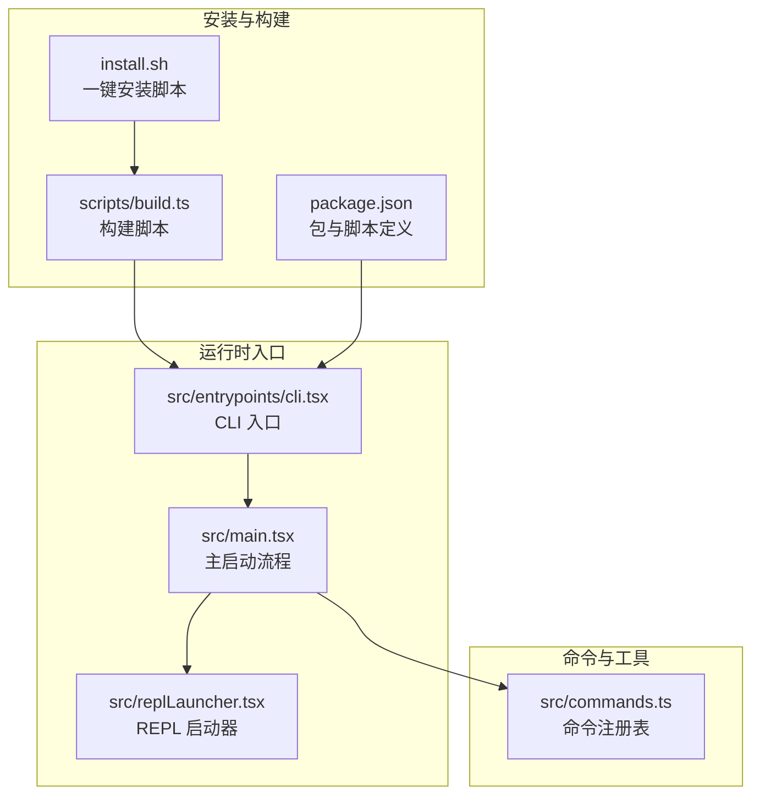
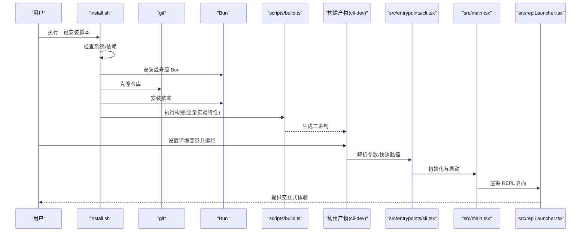
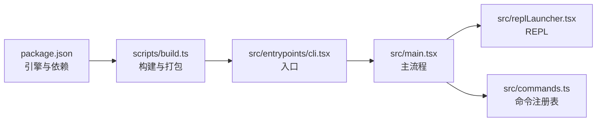

# 快速开始

<cite>
**本文引用的文件**
- [README.md](file://README.md)
- [install.sh](file://install.sh)
- [scripts/build.ts](file://scripts/build.ts)
- [package.json](file://package.json)
- [src/entrypoints/cli.tsx](file://src/entrypoints/cli.tsx)
- [src/main.tsx](file://src/main.tsx)
- [src/commands.ts](file://src/commands.ts)
- [src/replLauncher.tsx](file://src/replLauncher.tsx)
- [src/utils/errors.ts](file://src/utils/errors.ts)
- [FEATURES.md](file://FEATURES.md)
</cite>

## 目录
1. [简介](#简介)
2. [项目结构](#项目结构)
3. [核心组件](#核心组件)
4. [架构总览](#架构总览)
5. [详细组件分析](#详细组件分析)
6. [依赖关系分析](#依赖关系分析)
7. [性能考量](#性能考量)
8. [故障排除指南](#故障排除指南)
9. [结论](#结论)
10. [附录](#附录)

## 简介
本指南面向首次接触 free-code（Claude Code 的自由构建版本）的用户，帮助你在最短时间内完成安装、配置与首次运行。你将学会：
- 检查系统要求与前置条件
- 使用一键安装脚本安装 Bun、拉取源码、安装依赖并构建二进制
- 获取并设置 Anthropic API 密钥
- 运行一次性模式与交互式 REPL 模式
- 常见问题与故障排除

## 项目结构
free-code 是基于 Bun 的终端原生 AI 编程助手，采用 TypeScript + React + Ink 构建，支持丰富的实验性功能与插件体系。其核心入口为 CLI，通过命令注册表与工具系统驱动交互与执行。

图表来源
- [install.sh:1-180](file://install.sh#L1-L180)
- [scripts/build.ts:1-205](file://scripts/build.ts#L1-L205)
- [package.json:1-122](file://package.json#L1-L122)
- [src/entrypoints/cli.tsx:1-304](file://src/entrypoints/cli.tsx#L1-L304)
- [src/main.tsx:1-800](file://src/main.tsx#L1-L800)
- [src/replLauncher.tsx:1-23](file://src/replLauncher.tsx#L1-L23)
- [src/commands.ts:1-755](file://src/commands.ts#L1-L755)

章节来源
- [README.md:179-205](file://README.md#L179-L205)
- [package.json:15-21](file://package.json#L15-L21)

## 核心组件
- 安装脚本：自动检测系统、安装 Bun、拉取仓库、安装依赖、构建二进制并创建可执行链接
- 构建脚本：根据传入的特性标志打包二进制，支持默认与全量实验特性
- CLI 入口：解析参数、快速路径优化、按需加载模块
- 主启动流程：初始化配置、权限与策略、遥测与分析、延迟预取等
- REPL 启动器：渲染交互式界面
- 命令注册表：集中管理内置命令、技能、插件与工作流命令

章节来源
- [install.sh:122-161](file://install.sh#L122-L161)
- [scripts/build.ts:112-120](file://scripts/build.ts#L112-L120)
- [src/entrypoints/cli.tsx:34-300](file://src/entrypoints/cli.tsx#L34-L300)
- [src/main.tsx:585-800](file://src/main.tsx#L585-L800)
- [src/replLauncher.tsx:12-22](file://src/replLauncher.tsx#L12-L22)
- [src/commands.ts:257-346](file://src/commands.ts#L257-L346)

## 架构总览
从安装到运行的关键流程如下：

图表来源
- [install.sh:153-161](file://install.sh#L153-L161)
- [scripts/build.ts:158-198](file://scripts/build.ts#L158-L198)
- [src/entrypoints/cli.tsx:34-300](file://src/entrypoints/cli.tsx#L34-L300)
- [src/main.tsx:585-800](file://src/main.tsx#L585-L800)
- [src/replLauncher.tsx:12-22](file://src/replLauncher.tsx#L12-L22)

## 详细组件分析

### 1) 安装与系统要求
- 系统要求
  - Bun 版本：≥ 1.3.11
  - 操作系统：macOS 或 Linux（Windows 可通过 WSL）
  - 依赖：git
- 一键安装脚本会：
  - 检查 OS 与 git
  - 自动安装/升级 Bun
  - 克隆仓库、安装依赖
  - 使用构建脚本以“全量实验特性”构建二进制
  - 在用户家目录创建软链，将二进制加入 PATH

章节来源
- [README.md:86-95](file://README.md#L86-L95)
- [install.sh:44-93](file://install.sh#L44-L93)
- [install.sh:153-161](file://install.sh#L153-L161)

### 2) 构建与二进制
- 构建脚本支持多种变体：
  - 默认：仅启用 VOICE_MODE
  - 开发版：带开发版本号与实验性 GrowthBook 键
  - 全量实验特性：启用 45+ 实验特性
  - 编译输出：可选择输出路径
- 构建时通过命令行参数传递特性标志，最终由 Bun 打包成可执行二进制

章节来源
- [README.md:122-141](file://README.md#L122-L141)
- [scripts/build.ts:13-50](file://scripts/build.ts#L13-L50)
- [scripts/build.ts:158-198](file://scripts/build.ts#L158-L198)

### 3) CLI 入口与启动流程
- CLI 入口在启动早期进行快速路径判断：
  - 版本查询、系统提示导出、MCP/Chrome/Computer Use 等特殊子命令
  - 远程控制桥接、守护进程、后台会话管理等特性分支
  - 非特殊参数则进入完整启动流程
- 完整启动流程负责：
  - 初始化警告处理器、信号处理
  - 处理深度链接与协议唤醒
  - 解析 SSH/远程连接等早期参数
  - 初始化配置、策略限制、分析门控
  - 延迟预取：用户上下文、提示、模型能力、变更检测等
  - 启动 REPL 界面

章节来源
- [src/entrypoints/cli.tsx:34-300](file://src/entrypoints/cli.tsx#L34-L300)
- [src/main.tsx:585-800](file://src/main.tsx#L585-L800)

### 4) REPL 启动器
- 负责动态导入应用与 REPL 组件，并通过 Ink 渲染运行
- 将初始状态与统计信息注入应用树

章节来源
- [src/replLauncher.tsx:12-22](file://src/replLauncher.tsx#L12-L22)

### 5) 命令系统
- 命令注册表集中管理所有可用命令，支持：
  - 内置命令（如 help、clear、session 等）
  - 技能命令（来自 /skills/）
  - 插件命令（来自已启用插件）
  - 工作流命令（来自 WorkflowTool）
  - MCP 提供的命令（当启用相关特性）
- 支持按可用性与启用状态过滤命令，便于在不同环境与权限下呈现一致的可用命令集

章节来源
- [src/commands.ts:257-346](file://src/commands.ts#L257-L346)
- [src/commands.ts:449-469](file://src/commands.ts#L449-L469)

### 6) 运行你的第一个命令
- 一次性模式（非交互）
  - 示例：直接传入提示文本，程序在启动后立即执行并退出
  - 适合自动化与脚本调用
- 交互式 REPL 模式（默认）
  - 启动后进入交互界面，输入自然语言指令或使用斜杠命令
  - 支持多轮对话、上下文压缩、成本与用量统计等

章节来源
- [README.md:164-175](file://README.md#L164-L175)
- [src/main.tsx:797-800](file://src/main.tsx#L797-L800)

## 依赖关系分析
- 包管理与引擎约束
  - package.json 指定 Bun 引擎版本与常用依赖
  - 构建脚本通过 Bun 的打包能力生成可执行二进制
- 特性开关与死代码消除
  - 构建脚本根据特性标志动态注入 define，实现编译期死代码消除
  - CLI 入口与主流程中大量 feature() 判断，确保外部构建不包含未授权功能

图表来源
- [package.json:12-14](file://package.json#L12-L14)
- [package.json:15-21](file://package.json#L15-L21)
- [scripts/build.ts:158-198](file://scripts/build.ts#L158-L198)
- [src/entrypoints/cli.tsx:34-300](file://src/entrypoints/cli.tsx#L34-L300)
- [src/main.tsx:585-800](file://src/main.tsx#L585-L800)
- [src/replLauncher.tsx:12-22](file://src/replLauncher.tsx#L12-L22)
- [src/commands.ts:257-346](file://src/commands.ts#L257-L346)

章节来源
- [package.json:22-116](file://package.json#L22-L116)
- [scripts/build.ts:132-156](file://scripts/build.ts#L132-L156)
- [src/entrypoints/cli.tsx:1-30](file://src/entrypoints/cli.tsx#L1-L30)

## 性能考量
- 启动性能优化
  - CLI 入口采用“快速路径”策略，避免不必要的模块加载
  - 主流程延迟预取：将非关键任务推迟至首帧渲染之后，减少阻塞
- 构建优化
  - 使用 Bun 打包与字节码，提升冷启动速度
  - 死代码消除：仅保留启用的特性，减小体积与加载时间

章节来源
- [src/entrypoints/cli.tsx:34-300](file://src/entrypoints/cli.tsx#L34-L300)
- [src/main.tsx:388-431](file://src/main.tsx#L388-L431)
- [scripts/build.ts:158-198](file://scripts/build.ts#L158-L198)

## 故障排除指南
- 安装阶段
  - Bun 未找到或版本过低
    - 现象：安装脚本提示需要安装或升级 Bun
    - 处理：按照脚本提示安装/升级，确保 PATH 生效
  - git 未安装
    - 现象：安装脚本报错提示缺少 git
    - 处理：在 macOS 上使用 xcode-select --install，在 Linux 上使用发行版包管理器安装 git
  - 依赖安装失败
    - 现象：bun install 失败
    - 处理：检查网络与锁文件一致性；必要时删除锁文件重试
- 运行阶段
  - 无 API 密钥
    - 现象：请求被拒绝或出现认证错误
    - 处理：设置 ANTHROPIC_API_KEY 环境变量；或使用内置登录命令
  - 权限与策略限制
    - 现象：某些功能不可用或被组织策略禁用
    - 处理：检查策略限制与组织策略配置
  - 文件系统错误
    - 现象：ENOENT/EACCES/EPERM 等错误
    - 处理：确认路径存在、权限正确、无循环符号链接等问题
  - 网络/超时错误
    - 现象：Axios 分类为 auth/network/timeout/http
    - 处理：检查网络连通性、代理设置、服务端状态与超时配置

章节来源
- [install.sh:53-60](file://install.sh#L53-L60)
- [install.sh:82-93](file://install.sh#L82-L93)
- [src/utils/errors.ts:197-239](file://src/utils/errors.ts#L197-L239)
- [src/utils/errors.ts:186-195](file://src/utils/errors.ts#L186-L195)

## 结论
通过一键安装脚本与构建脚本，你可以快速获得一个功能完备的 free-code 二进制。结合本指南中的安装、配置与运行步骤，即可在本地体验一次性模式与交互式 REPL。遇到问题时，可依据故障排除章节定位并解决常见问题。

## 附录

### A. 安装与运行步骤清单
- 检查系统要求
  - 确认操作系统为 macOS 或 Linux（Windows 可通过 WSL）
  - 确认已安装 git
  - 确认 Bun 版本 ≥ 1.3.11
- 使用一键安装脚本
  - 执行安装脚本，它会自动安装/升级 Bun、克隆仓库、安装依赖并构建二进制
  - 安装完成后，将二进制加入 PATH 并创建软链
- 设置 API 密钥
  - 设置环境变量 ANTHROPIC_API_KEY
  - 或使用内置登录命令进行认证
- 运行
  - 一次性模式：传入提示文本
  - 交互式 REPL：直接运行二进制进入交互界面

章节来源
- [README.md:86-95](file://README.md#L86-L95)
- [README.md:70-82](file://README.md#L70-L82)
- [install.sh:153-179](file://install.sh#L153-L179)
- [README.md:164-175](file://README.md#L164-L175)

### B. 常用命令与特性参考
- 常用命令
  - /help：查看可用命令列表
  - /session：管理会话
  - /clear：清屏
  - /exit：退出 REPL
- 实验特性（全量构建）
  - VOICE_MODE、ULTRAPLAN、ULTRATHINK、BRIDGE_MODE、TOKEN_BUDGET 等
  - 更多特性与说明请参阅特性审计文档

章节来源
- [src/commands.ts:257-346](file://src/commands.ts#L257-L346)
- [FEATURES.md:38-128](file://FEATURES.md#L38-L128)