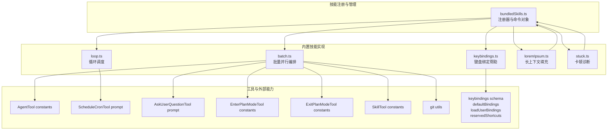
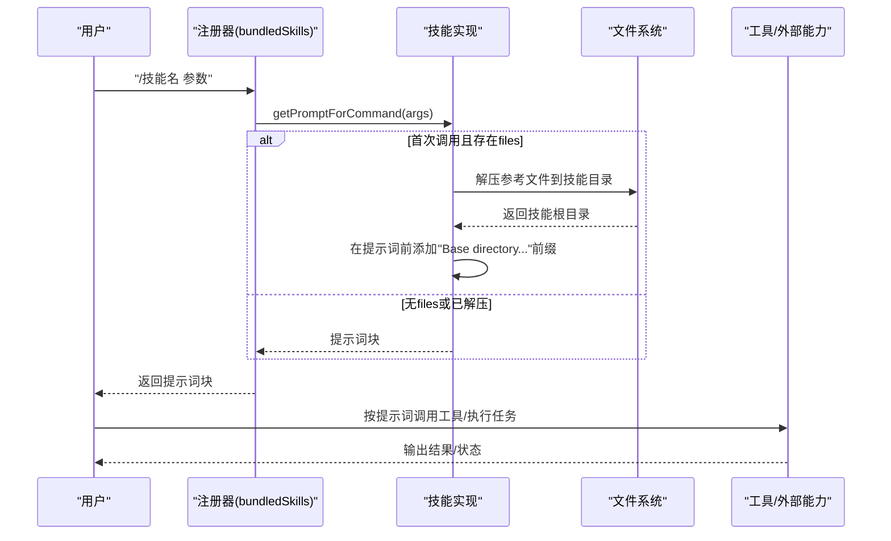
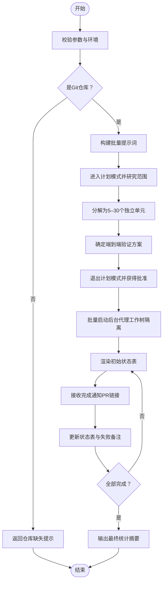
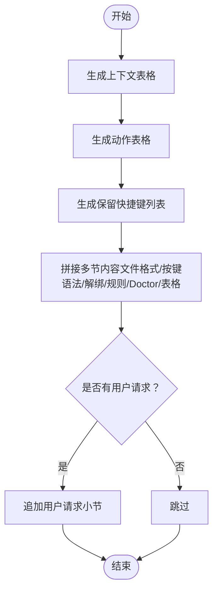
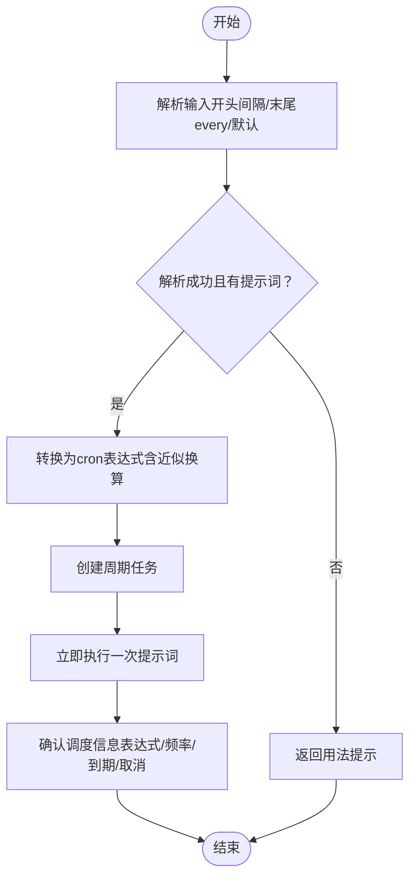
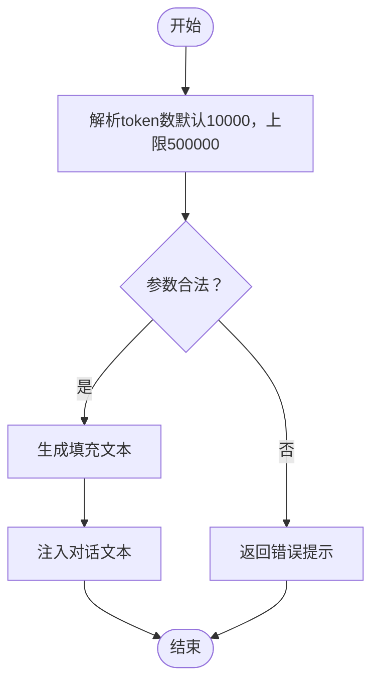
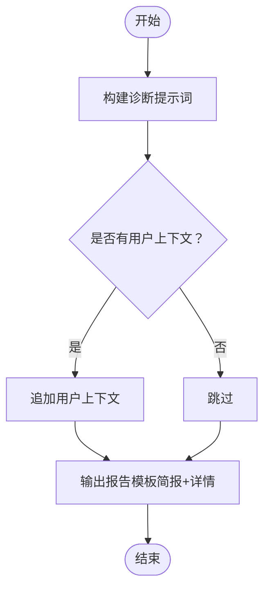
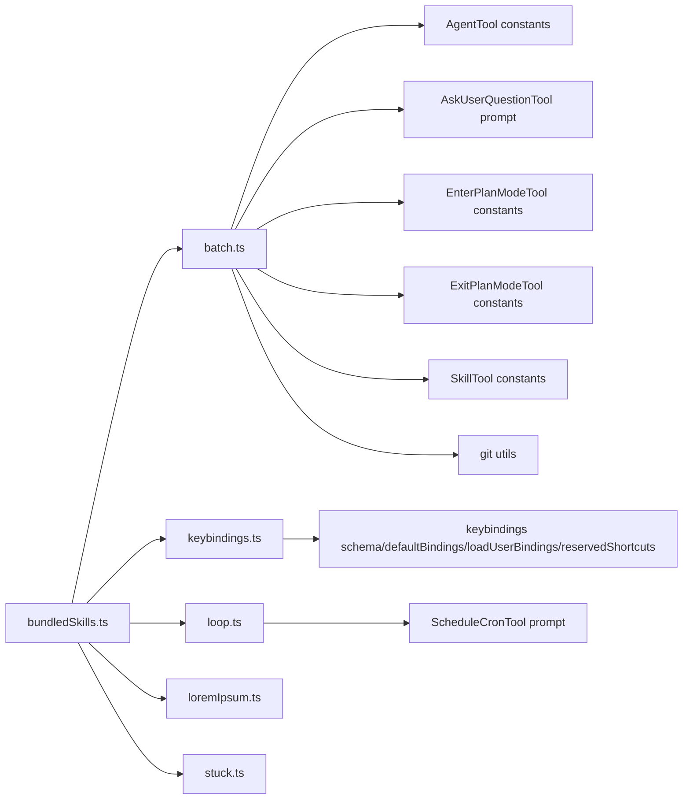

# 内置技能参考

<cite>
**本文引用的文件**
- [bundledSkills.ts](file://src/skills/bundledSkills.ts)
- [batch.ts](file://src/skills/bundled/batch.ts)
- [keybindings.ts](file://src/skills/bundled/keybindings.ts)
- [loop.ts](file://src/skills/bundled/loop.ts)
- [loremIpsum.ts](file://src/skills/bundled/loremIpsum.ts)
- [stuck.ts](file://src/skills/bundled/stuck.ts)
- [scheduleCronTool prompt](file://src/tools/ScheduleCronTool/prompt.js)
- [agentTool constants](file://src/tools/AgentTool/constants.js)
- [askUserQuestionTool prompt](file://src/tools/AskUserQuestionTool/prompt.js)
- [enterPlanModeTool constants](file://src/tools/EnterPlanModeTool/constants.js)
- [exitPlanModeTool constants](file://src/tools/ExitPlanModeTool/constants.js)
- [skillTool constants](file://src/tools/SkillTool/constants.js)
- [git utils](file://src/utils/git.js)
- [keybindings schema](file://src/keybindings/schema.js)
- [keybindings reserved shortcuts](file://src/keybindings/reservedShortcuts.js)
- [keybindings default bindings](file://src/keybindings/defaultBindings.js)
- [keybindings load user bindings](file://src/keybindings/loadUserBindings.js)
- [slow operations utils](file://src/utils/slowOperations.js)
</cite>

## 目录
1. [简介](#简介)
2. [项目结构](#项目结构)
3. [核心组件](#核心组件)
4. [架构总览](#架构总览)
5. [详细组件分析](#详细组件分析)
6. [依赖关系分析](#依赖关系分析)
7. [性能考量](#性能考量)
8. [故障排查指南](#故障排查指南)
9. [结论](#结论)
10. [附录](#附录)

## 简介
本参考文档面向 free-code（Claude Code）内置技能，系统性梳理并说明以下技能：batch、claudeApi、keybindings、loop、loremIpsum、remember、scheduleRemoteAgents、simplify、skillify、stuck、updateConfig、verify、verifyContent。文档覆盖每个技能的功能特性、适用场景、参数说明、执行流程与输出预期，并提供最佳实践与注意事项。由于仓库中仅包含部分技能的具体实现，本文将以已实现技能（batch、keybindings、loop、lorem-ipsum、stuck）为基础进行深入解析；其他技能在本仓库中未找到对应源码实现，因此不纳入本参考范围。

## 项目结构
内置技能通过统一的“捆绑技能注册器”集中管理，技能以“提示词模板 + 工具调用”的方式工作。关键结构如下：
- 捆绑技能注册器：定义技能元数据、提示词生成函数、运行时行为控制（是否允许模型直接调用、上下文模式等）
- 具体技能实现：每个技能文件负责构建提示词文本、校验输入、调用相关工具或外部能力
- 工具集成：技能通过工具常量名与具体工具交互（如 AgentTool、ScheduleCronTool 等）

图表来源
- [bundledSkills.ts:75-108](file://src/skills/bundledSkills.ts#L75-L108)
- [batch.ts:1-125](file://src/skills/bundled/batch.ts#L1-L125)
- [keybindings.ts:1-340](file://src/skills/bundled/keybindings.ts#L1-L340)
- [loop.ts:1-93](file://src/skills/bundled/loop.ts#L1-L93)
- [loremIpsum.ts:1-283](file://src/skills/bundled/loremIpsum.ts#L1-L283)
- [stuck.ts:1-80](file://src/skills/bundled/stuck.ts#L1-L80)

章节来源
- [bundledSkills.ts:75-108](file://src/skills/bundledSkills.ts#L75-L108)
- [batch.ts:100-125](file://src/skills/bundled/batch.ts#L100-L125)
- [keybindings.ts:292-327](file://src/skills/bundled/keybindings.ts#L292-L327)
- [loop.ts:74-92](file://src/skills/bundled/loop.ts#L74-L92)
- [loremIpsum.ts:234-282](file://src/skills/bundled/loremIpsum.ts#L234-L282)
- [stuck.ts:61-79](file://src/skills/bundled/stuck.ts#L61-L79)

## 核心组件
- 捆绑技能注册器（bundledSkills.ts）
  - 职责：定义 BundledSkillDefinition 类型、注册技能、导出已注册技能列表、处理首次调用时的参考文件提取与提示词前缀注入
  - 关键点：支持 files 字段在首次调用时解压到磁盘，为模型提供“技能根目录”前缀，便于后续 Read/Grep 文件
  - 命令对象字段：name、description、aliases、allowedTools、argumentHint、whenToUse、model、disableModelInvocation、userInvocable、hooks、context、agent、isEnabled、skillRoot、getPromptForCommand 等
- 技能命令对象（Command）
  - 来自注册器，类型为 prompt，source/loadedFrom 固定为 bundled，contentLength 对捆绑技能无意义
  - 支持按需启用（isEnabled）、隐藏（isHidden）与进度消息（progressMessage）

章节来源
- [bundledSkills.ts:15-41](file://src/skills/bundledSkills.ts#L15-L41)
- [bundledSkills.ts:75-98](file://src/skills/bundledSkills.ts#L75-L98)
- [bundledSkills.ts:106-108](file://src/skills/bundledSkills.ts#L106-L108)
- [bundledSkills.ts:120-122](file://src/skills/bundledSkills.ts#L120-L122)
- [bundledSkills.ts:131-145](file://src/skills/bundledSkills.ts#L131-L145)
- [bundledSkills.ts:147-167](file://src/skills/bundledSkills.ts#L147-L167)
- [bundledSkills.ts:186-193](file://src/skills/bundledSkills.ts#L186-L193)
- [bundledSkills.ts:195-206](file://src/skills/bundledSkills.ts#L195-L206)
- [bundledSkills.ts:208-220](file://src/skills/bundledSkills.ts#L208-L220)

## 架构总览
下图展示从用户输入到技能执行的关键路径：解析参数、构建提示词、可选文件解压、工具调用与最终输出。

图表来源
- [bundledSkills.ts:66-72](file://src/skills/bundledSkills.ts#L66-L72)
- [bundledSkills.ts:131-145](file://src/skills/bundledSkills.ts#L131-L145)
- [bundledSkills.ts:208-220](file://src/skills/bundledSkills.ts#L208-L220)

## 详细组件分析

### 技能：batch（批量并行编排）
- 功能概述
  - 面向大规模、可分解的机械式变更，自动研究与规划，随后在 5–30 个隔离工作树代理中并行执行，每个代理独立提交 PR
- 适用场景
  - 跨代码库的大规模迁移、重构、批量重命名等
- 参数与输入
  - 必填：指令字符串（instruction），描述要做的变更
  - 限制：需要处于 Git 仓库中，否则返回错误提示
- 执行流程
  1) 校验参数与环境（是否 Git 仓库）
  2) 构建提示词（包含研究计划阶段、spawn 工作者、跟踪进度等步骤）
  3) 使用工具：进入/退出计划模式、启动后台代理、调用 simplify 技能、运行测试、提交 PR 并汇总结果
- 输出与结果
  - 初始/最终状态表，记录各单元状态与 PR 链接
  - 成功/失败统计摘要
- 最佳实践
  - 明确 e2e 验证方案，避免仅依赖单元测试
  - 合理拆分工作单元，确保独立可合并
  - 使用“工作树隔离”避免共享状态
- 注意事项
  - 不适用于一次性任务；应使用 /loop 或其他工具
  - 需要 gh 工具可用以创建 PR

图表来源
- [batch.ts:110-122](file://src/skills/bundled/batch.ts#L110-L122)
- [batch.ts:19-89](file://src/skills/bundled/batch.ts#L19-L89)
- [agentTool constants](file://src/tools/AgentTool/constants.js)
- [askUserQuestionTool prompt](file://src/tools/AskUserQuestionTool/prompt.js)
- [enterPlanModeTool constants](file://src/tools/EnterPlanModeTool/constants.js)
- [exitPlanModeTool constants](file://src/tools/ExitPlanModeTool/constants.js)
- [skillTool constants](file://src/tools/SkillTool/constants.js)
- [git utils](file://src/utils/git.js)

章节来源
- [batch.ts:9-17](file://src/skills/bundled/batch.ts#L9-L17)
- [batch.ts:19-89](file://src/skills/bundled/batch.ts#L19-L89)
- [batch.ts:100-125](file://src/skills/bundled/batch.ts#L100-L125)

### 技能：keybindings（键盘绑定帮助）
- 功能概述
  - 生成完整的键盘绑定参考文档，指导用户安全地修改 ~/.claude/keybindings.json
- 适用场景
  - 用户希望重新绑定快捷键、添加组合键、或排查绑定冲突
- 参数与输入
  - 可选：用户请求说明，将作为“用户请求”小节插入
- 执行流程
  1) 动态生成“上下文/动作”表格
  2) 生成“保留快捷键”列表（非可重绑定、终端保留、macOS 保留）
  3) 组合多节内容（文件格式、按键语法、解绑、交互规则、常见模式、Doctor 校验、预留表格、可用上下文、可用动作）
  4) 若提供用户请求，则追加“用户请求”小节
- 输出与结果
  - 完整的 Markdown 参考文档，包含示例与校验规则
- 最佳实践
  - 仅覆盖需要更改的上下文，最小化覆盖
  - 严格遵循已知上下文与动作列表
  - 避免与终端/操作系统保留快捷键冲突
- 注意事项
  - 该技能默认不可由用户直接调用（userInvocable=false），但会根据开关启用

图表来源
- [keybindings.ts:20-56](file://src/skills/bundled/keybindings.ts#L20-L56)
- [keybindings.ts:89-112](file://src/skills/bundled/keybindings.ts#L89-L112)
- [keybindings.ts:306-325](file://src/skills/bundled/keybindings.ts#L306-L325)
- [keybindings schema](file://src/keybindings/schema.js)
- [keybindings reserved shortcuts](file://src/keybindings/reservedShortcuts.js)
- [keybindings default bindings](file://src/keybindings/defaultBindings.js)
- [keybindings load user bindings](file://src/keybindings/loadUserBindings.js)
- [slow operations utils](file://src/utils/slowOperations.js)

章节来源
- [keybindings.ts:292-327](file://src/skills/bundled/keybindings.ts#L292-L327)

### 技能：loop（循环调度）
- 功能概述
  - 将提示词或斜杠命令按周期调度执行，支持秒/分钟/小时/天粒度
- 适用场景
  - 定期轮询状态、持续监控、重复性任务
- 参数与输入
  - 可选：时间间隔（N[s|m|h|d] 或 “every …” 语法），默认 10 分钟
  - 必填：要执行的提示词或斜杠命令
- 执行流程
  1) 解析输入，优先匹配“开头数字+单位”或末尾“every …”
  2) 将解析后的间隔转换为 cron 表达式（含近似换算与用户提示）
  3) 调用定时任务工具创建周期任务
  4) 立即执行一次解析后的提示词
- 输出与结果
  - 确认调度信息（表达式、人类可读频率、到期时间、取消方式）
  - 立即执行的结果
- 最佳实践
  - 使用“every …”语法明确意图
  - 避免过于频繁的任务导致资源压力
- 注意事项
  - 仅在启用相关功能时可用（isEnabled 由工具配置决定）

图表来源
- [loop.ts:25-72](file://src/skills/bundled/loop.ts#L25-L72)
- [loop.ts:74-92](file://src/skills/bundled/loop.ts#L74-L92)
- [scheduleCronTool prompt](file://src/tools/ScheduleCronTool/prompt.js)

章节来源
- [loop.ts:11-23](file://src/skills/bundled/loop.ts#L11-L23)
- [loop.ts:25-72](file://src/skills/bundled/loop.ts#L25-L72)
- [loop.ts:74-92](file://src/skills/bundled/loop.ts#L74-L92)

### 技能：lorem-ipsum（长上下文填充）
- 功能概述
  - 生成近似指定 token 数量的英文填充文本，用于长上下文测试
- 适用场景
  - 测试模型上下文窗口、评估 token 计数与性能
- 参数与输入
  - 可选：目标 token 数（正整数，默认 10000，上限 500000）
- 执行流程
  1) 校验参数合法性
  2) 计算安全上限并生成文本
  3) 直接将文本注入对话
- 输出与结果
  - 生成的填充文本
- 最佳实践
  - 控制 token 数量，避免过大影响性能
- 注意事项
  - 仅在特定用户类型下可用（ANT-only）

图表来源
- [loremIpsum.ts:245-281](file://src/skills/bundled/loremIpsum.ts#L245-L281)

章节来源
- [loremIpsum.ts:234-282](file://src/skills/bundled/loremIpsum.ts#L234-L282)

### 技能：stuck（卡顿诊断）
- 功能概述
  - 诊断本机上冻结/卡顿/缓慢的 Claude Code 会话，收集进程信息并报告给反馈渠道
- 适用场景
  - 会话无响应、CPU 占用异常、I/O 阻塞、僵尸进程等
- 参数与输入
  - 可选：用户提供的上下文（如特定 PID 或症状）
- 执行流程
  1) 构建诊断提示词（扫描进程、识别可疑状态、采集上下文）
  2) 可选：追加用户上下文
  3) 输出报告模板（两段式：简报 + 详情线程）
- 输出与结果
  - 报告模板（可在 Slack 中发送或复制粘贴）
- 最佳实践
  - 仅在确实发现异常时才上报
  - 保持诊断性质，不主动终止进程
- 注意事项
  - 仅在特定用户类型下可用（ANT-only）

图表来源
- [stuck.ts:71-77](file://src/skills/bundled/stuck.ts#L71-L77)

章节来源
- [stuck.ts:61-79](file://src/skills/bundled/stuck.ts#L61-L79)

## 依赖关系分析
- 注册器与技能实现
  - 注册器负责将技能定义转为命令对象，统一管理 userInvocable、isEnabled、context、agent 等属性
  - 技能实现通过 getPromptForCommand 构建提示词，必要时调用工具常量名与外部能力
- 工具与外部能力
  - batch 依赖 AgentTool、AskUserQuestionTool、Enter/ExitPlanModeTool、SkillTool 以及 Git 检测
  - loop 依赖 ScheduleCronTool 的提示词与常量
  - keybindings 依赖键位配置与校验工具
- 文件系统与安全
  - 注册器在首次调用时将 files 解压至受控目录，采用安全写入策略与路径校验，防止路径穿越

图表来源
- [bundledSkills.ts:75-98](file://src/skills/bundledSkills.ts#L75-L98)
- [batch.ts:1-125](file://src/skills/bundled/batch.ts#L1-L125)
- [keybindings.ts:1-340](file://src/skills/bundled/keybindings.ts#L1-L340)
- [loop.ts:1-93](file://src/skills/bundled/loop.ts#L1-L93)
- [loremIpsum.ts:1-283](file://src/skills/bundled/loremIpsum.ts#L1-L283)
- [stuck.ts:1-80](file://src/skills/bundled/stuck.ts#L1-L80)

章节来源
- [bundledSkills.ts:131-145](file://src/skills/bundledSkills.ts#L131-L145)
- [bundledSkills.ts:195-206](file://src/skills/bundledSkills.ts#L195-L206)

## 性能考量
- 长上下文填充
  - 通过预定义的一词 token 集合与随机采样生成文本，避免复杂语言模型参与，降低计算开销
  - 设有上限（500k token）以保护系统资源
- 批量并行
  - 使用工作树隔离减少冲突，提高吞吐；合理拆分单元避免单代理负担过重
- 循环调度
  - cron 表达式转换时进行近似换算，避免不均匀间隔导致的抖动
- 文件系统安全
  - 解压时采用递归目录创建与独占写入，避免竞态与路径穿越风险

## 故障排查指南
- /batch：非 Git 仓库
  - 现象：直接返回提示，要求初始化仓库
  - 处理：在仓库根目录执行
- /keybindings：绑定冲突或无效
  - 现象：/doctor 输出错误/警告
  - 处理：修正上下文名称、按键语法，避开保留快捷键
- /loop：间隔解析失败
  - 现象：返回用法提示
  - 处理：使用“N[m|h|d]”或“every …”语法
- /lorem-ipsum：参数非法
  - 现象：返回错误提示
  - 处理：提供正整数，不超过上限
- /stuck：无异常
  - 现象：不发送报告
  - 处理：仅在发现异常时上报

章节来源
- [batch.ts:91-98](file://src/skills/bundled/batch.ts#L91-L98)
- [keybindings.ts:231-290](file://src/skills/bundled/keybindings.ts#L231-L290)
- [loop.ts:84-88](file://src/skills/bundled/loop.ts#L84-L88)
- [loremIpsum.ts:248-255](file://src/skills/bundled/loremIpsum.ts#L248-L255)
- [stuck.ts:70-76](file://src/skills/bundled/stuck.ts#L70-L76)

## 结论
本文基于仓库中的现有实现，对 batch、keybindings、loop、lorem-ipsum、stuck 五项内置技能进行了系统性解析，涵盖功能、参数、流程与最佳实践。对于未在仓库中实现的技能（如 claudeApi、remember、scheduleRemoteAgents、simplify、skillify、updateConfig、verify、verifyContent），本文不提供具体细节，建议在后续版本中补充相应源码后再行完善。

## 附录
- 术语
  - 工作树（worktree）：Git 隔离的工作副本，用于并行开发与测试
  - 近似换算：当间隔无法精确映射到 cron 时，选择最近的“干净”间隔并向用户提示
- 参考
  - 工具常量与提示词文件路径见各技能实现文件的导入处