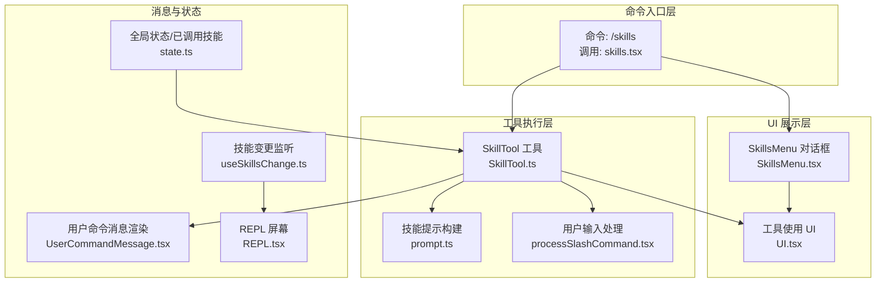
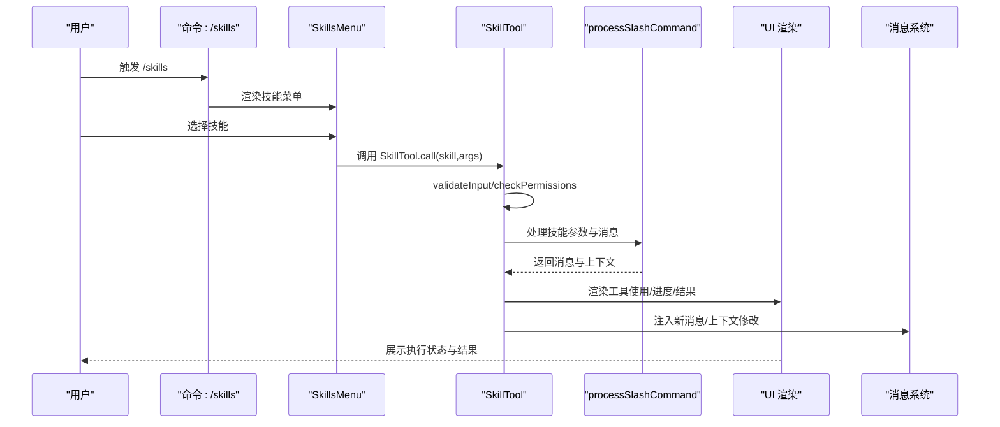
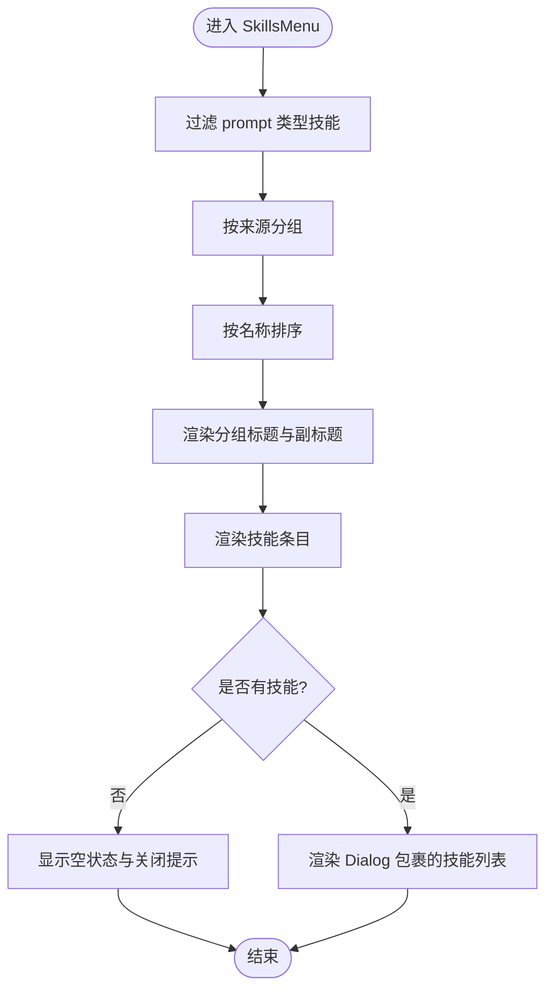
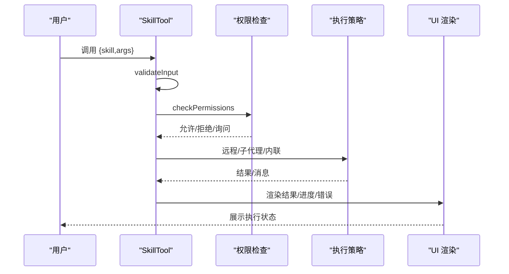
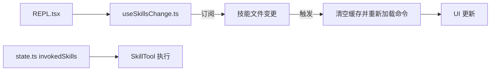
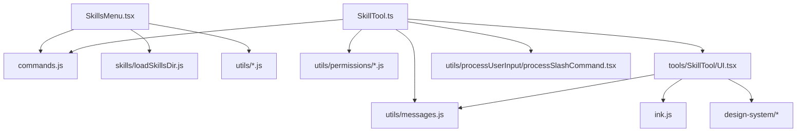

# 技能 UI 组件

<cite>
**本文档引用的文件**
- [SkillsMenu.tsx](file://src/components/skills/SkillsMenu.tsx)
- [skills.tsx](file://src/commands/skills/skills.tsx)
- [SkillTool.ts](file://src/tools/SkillTool/SkillTool.ts)
- [prompt.ts](file://src/tools/SkillTool/prompt.ts)
- [UI.tsx](file://src/tools/SkillTool/UI.tsx)
- [processSlashCommand.tsx](file://src/utils/processUserInput/processSlashCommand.tsx)
- [UserCommandMessage.tsx](file://src/components/messages/UserCommandMessage.tsx)
- [useSkillsChange.ts](file://src/hooks/useSkillsChange.ts)
- [state.ts](file://src/bootstrap/state.ts)
- [REPL.tsx](file://src/screens/REPL.tsx)
</cite>

## 目录
1. [简介](#简介)
2. [项目结构](#项目结构)
3. [核心组件](#核心组件)
4. [架构总览](#架构总览)
5. [详细组件分析](#详细组件分析)
6. [依赖关系分析](#依赖关系分析)
7. [性能考虑](#性能考虑)
8. [故障排除指南](#故障排除指南)
9. [结论](#结论)
10. [附录](#附录)

## 简介
本文件面向 free-code 的技能 UI 组件，系统性阐述技能菜单与技能命令界面的设计与实现。内容涵盖：
- 技能菜单的结构与交互：按来源分组、标题与副标题生成、无技能时的提示与快捷键提示。
- 技能命令界面：参数输入、执行状态显示、结果呈现与错误处理。
- 组件间通信与状态管理：从命令入口到 UI 渲染、工具调用链路、消息流与进度反馈。
- 定制化选项与样式配置：基于现有组件的可扩展点与最佳实践。
- 用户体验与无障碍：交互提示、键盘快捷键、视觉层次与可读性建议。

## 项目结构
技能 UI 组件由三层构成：
- 命令入口层：负责触发技能菜单或技能工具调用。
- UI 展示层：技能菜单对话框与工具使用 UI（加载、进度、结果、错误）。
- 工具执行层：技能验证、权限决策、远程/本地技能执行、消息注入与上下文修改。

**图表来源**
- [skills.tsx:1-8](file://src/commands/skills/skills.tsx#L1-L8)
- [SkillsMenu.tsx:1-237](file://src/components/skills/SkillsMenu.tsx#L1-L237)
- [UI.tsx:1-128](file://src/tools/SkillTool/UI.tsx#L1-L128)
- [SkillTool.ts:1-800](file://src/tools/SkillTool/SkillTool.ts#L1-L800)
- [prompt.ts:1-242](file://src/tools/SkillTool/prompt.ts#L1-L242)
- [processSlashCommand.tsx:782-869](file://src/utils/processUserInput/processSlashCommand.tsx#L782-L869)
- [UserCommandMessage.tsx:1-55](file://src/components/messages/UserCommandMessage.tsx#L1-L55)
- [useSkillsChange.ts:1-43](file://src/hooks/useSkillsChange.ts#L1-L43)
- [state.ts:1501-1541](file://src/bootstrap/state.ts#L1501-L1541)
- [REPL.tsx:679-690](file://src/screens/REPL.tsx#L679-L690)

**章节来源**
- [skills.tsx:1-8](file://src/commands/skills/skills.tsx#L1-L8)
- [SkillsMenu.tsx:1-237](file://src/components/skills/SkillsMenu.tsx#L1-L237)

## 核心组件
- SkillsMenu：技能菜单对话框，按来源分组展示技能，提供关闭提示与快捷键提示。
- SkillTool：技能工具，负责技能验证、权限检查、远程/本地执行、消息注入与 UI 渲染。
- UI 渲染模块：工具结果、使用消息、进度消息、拒绝/错误消息的 UI 表达。
- 用户输入处理：将技能名称与参数转换为消息与上下文修改。
- 消息渲染：在聊天界面中以“技能”格式展示用户命令消息。
- 技能变更监听：响应技能文件变化，热更新命令列表。

**章节来源**
- [SkillsMenu.tsx:1-237](file://src/components/skills/SkillsMenu.tsx#L1-L237)
- [SkillTool.ts:1-800](file://src/tools/SkillTool/SkillTool.ts#L1-L800)
- [UI.tsx:1-128](file://src/tools/SkillTool/UI.tsx#L1-L128)
- [processSlashCommand.tsx:782-869](file://src/utils/processUserInput/processSlashCommand.tsx#L782-L869)
- [UserCommandMessage.tsx:1-55](file://src/components/messages/UserCommandMessage.tsx#L1-L55)
- [useSkillsChange.ts:1-43](file://src/hooks/useSkillsChange.ts#L1-L43)

## 架构总览
技能 UI 的端到端流程如下：

**图表来源**
- [skills.tsx:1-8](file://src/commands/skills/skills.tsx#L1-L8)
- [SkillsMenu.tsx:1-237](file://src/components/skills/SkillsMenu.tsx#L1-L237)
- [SkillTool.ts:580-766](file://src/tools/SkillTool/SkillTool.ts#L580-L766)
- [processSlashCommand.tsx:838-869](file://src/utils/processUserInput/processSlashCommand.tsx#L838-L869)
- [UI.tsx:47-93](file://src/tools/SkillTool/UI.tsx#L47-L93)

## 详细组件分析

### SkillsMenu 组件
- 功能概述
  - 过滤出类型为 prompt 的技能命令，并按来源分组（策略设置、用户设置、项目设置、本地设置、标志设置、插件、MCP）。
  - 生成各分组的标题与副标题：插件与 MCP 使用特殊规则；其他来源显示路径信息。
  - 渲染技能条目：显示名称、插件名（当适用）、估算描述 token 数量。
  - 当无技能时，显示“未找到技能”的提示与关闭快捷键。
  - 提供取消回调，用于返回上层命令上下文。

- 关键实现要点
  - 分组与排序：按来源聚合后对名称进行本地化比较排序。
  - 标题与副标题：来源标题统一大小写；副标题根据来源类型动态生成。
  - 条目渲染：结合命令名称、插件信息与估算 token 显示。
  - 无技能场景：使用 Dialog 组件展示提示与快捷键。

- 交互与状态
  - 接收 commands 列表与 onExit 回调，内部通过 useMemo 缓存过滤与分组结果，减少重渲染。
  - 取消时通过 onExit 传递系统级显示结果，便于上层命令处理。

**图表来源**
- [SkillsMenu.tsx:47-224](file://src/components/skills/SkillsMenu.tsx#L47-L224)

**章节来源**
- [SkillsMenu.tsx:1-237](file://src/components/skills/SkillsMenu.tsx#L1-L237)

### 技能命令界面（SkillTool）
- 输入与输出
  - 输入：skill（技能名，如 "pdf"、"commit"、"ms-office-suite:pdf"），args（可选参数字符串）。
  - 输出：内联执行返回成功标志、允许的工具列表、模型覆盖；子代理执行返回成功标志、代理 ID、结果文本。

- 验证与权限
  - 格式校验：去除前导斜杠兼容、非空校验。
  - 存在性与类型校验：查找命令对象，确保为 prompt 类型且未禁用模型调用。
  - 权限决策：支持 deny/allow 规则匹配，自动建议添加规则，必要时询问用户。

- 执行策略
  - 远程规范技能（ant 专用实验特性）：直接加载远程内容并注入消息。
  - 子代理执行：为高耗时/复杂技能创建独立代理，隔离 token 预算与上下文。
  - 内联执行：通过 processSlashCommand 将技能转换为消息与上下文修改，注入到主会话。

- UI 渲染
  - 工具结果消息：内联执行显示“已加载技能”，可选显示允许工具数量与模型；子代理执行显示“完成”。
  - 使用消息：根据命令来源决定是否显示前导斜杠。
  - 进度消息：显示最近若干条工具使用进度，支持非详细模式折叠隐藏数量。
  - 拒绝/错误消息：在拒绝与错误场景下叠加进度消息与回退 UI。

**图表来源**
- [SkillTool.ts:354-430](file://src/tools/SkillTool/SkillTool.ts#L354-L430)
- [SkillTool.ts:432-578](file://src/tools/SkillTool/SkillTool.ts#L432-L578)
- [SkillTool.ts:580-766](file://src/tools/SkillTool/SkillTool.ts#L580-L766)
- [UI.tsx:20-93](file://src/tools/SkillTool/UI.tsx#L20-L93)

**章节来源**
- [SkillTool.ts:291-327](file://src/tools/SkillTool/SkillTool.ts#L291-L327)
- [SkillTool.ts:354-430](file://src/tools/SkillTool/SkillTool.ts#L354-L430)
- [SkillTool.ts:432-578](file://src/tools/SkillTool/SkillTool.ts#L432-L578)
- [SkillTool.ts:580-766](file://src/tools/SkillTool/SkillTool.ts#L580-L766)
- [UI.tsx:1-128](file://src/tools/SkillTool/UI.tsx#L1-L128)

### 用户输入处理与消息注入
- 加载元数据格式
  - 技能加载元数据：包含命令标签、命令名标签、技能格式标记，用于消息渲染与后续处理。
  - 斜杠命令加载元数据：包含命令标签、命令名标签、可选参数标签。

- 消息注入
  - 通过 processSlashCommand 将技能转换为用户消息与系统消息，注入到会话中。
  - 在工具调用链中，SkillTool 负责清理与过滤特定消息类型，确保显示正确。

- 消息渲染
  - UserCommandMessage 根据标签渲染“技能”格式的消息，支持带参数与前导斜杠的显示差异。

**章节来源**
- [processSlashCommand.tsx:782-796](file://src/utils/processUserInput/processSlashCommand.tsx#L782-L796)
- [processSlashCommand.tsx:838-869](file://src/utils/processUserInput/processSlashCommand.tsx#L838-L869)
- [UserCommandMessage.tsx:1-55](file://src/components/messages/UserCommandMessage.tsx#L1-L55)

### 组件间通信与状态管理
- 命令入口到 UI
  - /skills 命令直接渲染 SkillsMenu，传入 commands 与 onExit 回调。
- 技能变更监听
  - useSkillsChange 订阅技能文件变化，清空缓存并重新加载命令，更新 UI。
- 全局状态
  - invokedSkills 用于跨压缩保留已调用技能内容，避免丢失。
- REPL 屏幕
  - 热加载本地命令，保持与技能文件同步。

**图表来源**
- [useSkillsChange.ts:1-43](file://src/hooks/useSkillsChange.ts#L1-L43)
- [state.ts:1501-1541](file://src/bootstrap/state.ts#L1501-L1541)
- [REPL.tsx:679-690](file://src/screens/REPL.tsx#L679-L690)

**章节来源**
- [skills.tsx:1-8](file://src/commands/skills/skills.tsx#L1-L8)
- [SkillsMenu.tsx:1-237](file://src/components/skills/SkillsMenu.tsx#L1-L237)
- [useSkillsChange.ts:1-43](file://src/hooks/useSkillsChange.ts#L1-L43)
- [state.ts:1501-1541](file://src/bootstrap/state.ts#L1501-L1541)
- [REPL.tsx:679-690](file://src/screens/REPL.tsx#L679-L690)

## 依赖关系分析
- 组件耦合
  - SkillsMenu 依赖命令类型与来源常量、路径显示工具、令牌估算与格式化工具。
  - SkillTool 依赖命令解析、权限系统、远程技能模块（实验特性）、消息工具与 UI 渲染。
  - UI 渲染依赖消息组件、子代理提供器与进度消息构建。
- 外部依赖
  - Ink 组件库用于终端 UI 布局与文本渲染。
  - 设计系统组件（Dialog、Byline 等）用于一致的视觉与交互体验。
- 循环依赖风险
  - 通过延迟导入与条件加载（如远程技能模块）降低循环依赖风险。

**图表来源**
- [SkillsMenu.tsx:1-237](file://src/components/skills/SkillsMenu.tsx#L1-L237)
- [SkillTool.ts:1-800](file://src/tools/SkillTool/SkillTool.ts#L1-L800)
- [UI.tsx:1-128](file://src/tools/SkillTool/UI.tsx#L1-L128)

**章节来源**
- [SkillsMenu.tsx:1-237](file://src/components/skills/SkillsMenu.tsx#L1-L237)
- [SkillTool.ts:1-800](file://src/tools/SkillTool/SkillTool.ts#L1-L800)
- [UI.tsx:1-128](file://src/tools/SkillTool/UI.tsx#L1-L128)

## 性能考虑
- 渲染优化
  - SkillsMenu 使用 useMemo 缓存过滤与分组结果，避免重复计算。
  - UI 渲染在非详细模式下限制进度消息数量，减少渲染开销。
- 执行优化
  - 子代理执行隔离 token 预算，避免主线程阻塞。
  - 技能提示预算按上下文窗口比例计算，避免过度占用上下文。
- 文件监听
  - 技能变更采用去抖动策略，批量触发重载，防止事件风暴导致的死锁。

[本节为通用指导，无需具体文件引用]

## 故障排除指南
- 无技能可用
  - 现象：SkillsMenu 显示“未找到技能”与关闭提示。
  - 处理：确认技能目录存在、权限正确、命令缓存已刷新。
- 技能名称无效
  - 现象：SkillTool 验证失败，提示未知技能或非 prompt 类型。
  - 处理：检查技能名拼写、是否带有前导斜杠、是否被禁用模型调用。
- 权限被拒绝
  - 现象：权限检查返回拒绝，需要手动授权或添加规则。
  - 处理：查看建议规则，添加 allow/deny 规则或在设置中调整。
- 远程技能不可用
  - 现象：ant 用户尝试使用远程规范技能但未发现或未发现会话中。
  - 处理：先使用“发现技能”功能，再调用远程技能。
- 进度消息过多
  - 现象：UI 中进度消息堆积，影响阅读。
  - 处理：切换详细/非详细模式，或等待子代理执行完成。

**章节来源**
- [SkillsMenu.tsx:101-125](file://src/components/skills/SkillsMenu.tsx#L101-L125)
- [SkillTool.ts:354-430](file://src/tools/SkillTool/SkillTool.ts#L354-L430)
- [SkillTool.ts:432-578](file://src/tools/SkillTool/SkillTool.ts#L432-L578)
- [SkillTool.ts:969-986](file://src/tools/SkillTool/SkillTool.ts#L969-L986)
- [UI.tsx:62-93](file://src/tools/SkillTool/UI.tsx#L62-L93)

## 结论
技能 UI 组件通过清晰的职责分离与稳定的工具链实现了从菜单选择到命令执行的完整闭环。SkillsMenu 提供直观的技能浏览与分组展示，SkillTool 则在安全与性能之间取得平衡，既支持本地技能的快速执行，也支持远程与子代理执行的复杂场景。配合 UI 渲染与消息系统，用户可以清晰地感知技能执行状态与结果。未来可在搜索过滤、快捷键增强与无障碍方面进一步优化。

[本节为总结性内容，无需具体文件引用]

## 附录

### 定制化选项与样式配置
- 样式与布局
  - 使用 Ink 的 Box/Text 组件控制布局与文本样式，支持斜体、强调等视觉修饰。
  - Dialog 组件用于模态展示，支持标题、副标题与取消回调。
- 可扩展点
  - 自定义来源标题与副标题：通过 getSourceTitle/getSourceSubtitle 扩展新的来源类型。
  - 自定义条目渲染：在条目渲染函数中增加额外信息（如作者、版本）。
  - 自定义 UI：在 UI.tsx 中扩展工具使用、进度、结果与错误的渲染逻辑。

**章节来源**
- [SkillsMenu.tsx:24-46](file://src/components/skills/SkillsMenu.tsx#L24-L46)
- [SkillsMenu.tsx:225-230](file://src/components/skills/SkillsMenu.tsx#L225-L230)
- [UI.tsx:1-128](file://src/tools/SkillTool/UI.tsx#L1-L128)

### 用户体验与无障碍
- 键盘快捷键
  - 使用可配置快捷键提示组件，明确关闭与确认操作。
- 语义化与可读性
  - 插件来源显示插件名称，MCP 来源显示服务器列表，帮助用户识别来源。
  - 进度消息支持折叠与隐藏数量，避免信息过载。
- 一致性
  - 统一使用设计系统组件，保证跨平台一致的交互与视觉体验。

**章节来源**
- [SkillsMenu.tsx:109-111](file://src/components/skills/SkillsMenu.tsx#L109-L111)
- [SkillsMenu.tsx:207-212](file://src/components/skills/SkillsMenu.tsx#L207-L212)
- [UI.tsx:62-93](file://src/tools/SkillTool/UI.tsx#L62-L93)