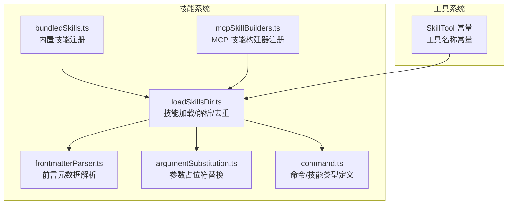
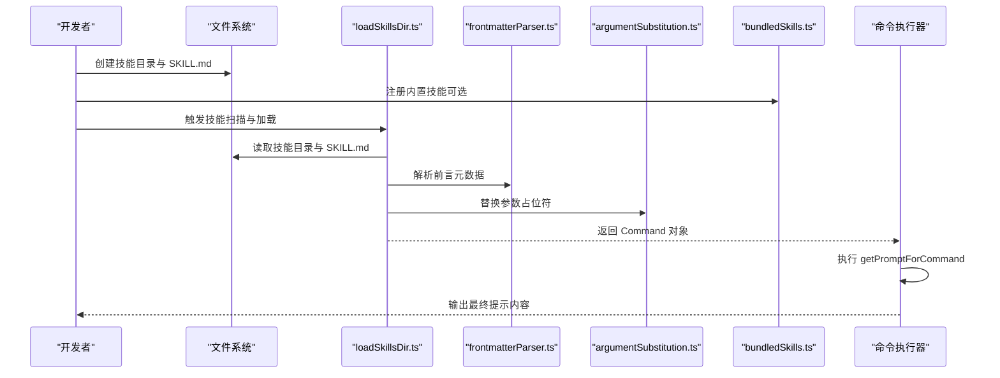
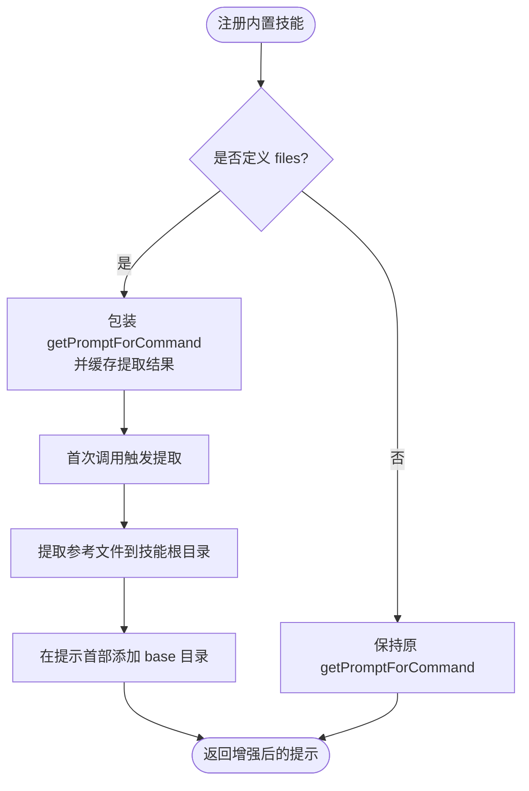
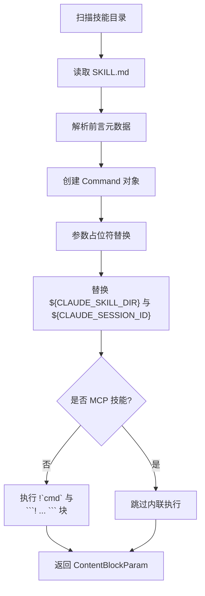
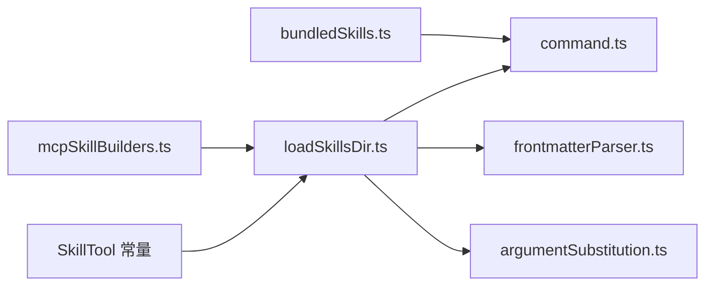

# 技能开发指南

<cite>
**本文引用的文件**
- [bundledSkills.ts](file://src/skills/bundledSkills.ts)
- [loadSkillsDir.ts](file://src/skills/loadSkillsDir.ts)
- [mcpSkillBuilders.ts](file://src/skills/mcpSkillBuilders.ts)
- [frontmatterParser.ts](file://src/utils/frontmatterParser.ts)
- [argumentSubstitution.ts](file://src/utils/argumentSubstitution.ts)
- [command.ts](file://src/types/command.ts)
- [SkillTool 常量](file://src/tools/SkillTool/constants.ts)
- [CLAUDE.md](file://CLAUDE.md)
- [README.md](file://README.md)
</cite>

## 目录
1. [简介](#简介)
2. [项目结构](#项目结构)
3. [核心组件](#核心组件)
4. [架构总览](#架构总览)
5. [详细组件分析](#详细组件分析)
6. [依赖关系分析](#依赖关系分析)
7. [性能考量](#性能考量)
8. [故障排查指南](#故障排查指南)
9. [结论](#结论)
10. [附录](#附录)

## 简介
本指南面向在 free-code（Claude Code 的自由构建版本）中开发“技能”（Skill）的开发者，系统讲解如何从零创建、组织、注册、测试与发布自定义技能。内容覆盖：
- 技能文件的组织结构与命名规范
- 从定义到注册、加载、执行的完整流程
- 参数设计、错误处理与性能优化最佳实践
- 与工具系统的集成（工具调用与权限控制）
- 调试与测试方法
- 实际开发示例与模板
- 技能的打包与分发机制

## 项目结构
free-code 将“技能”作为一类特殊的命令（Command），通过统一的命令体系进行注册与调度。技能主要位于以下模块：
- 技能定义与内置技能注册：src/skills/bundledSkills.ts
- 技能加载与解析：src/skills/loadSkillsDir.ts
- 前言元数据解析：src/utils/frontmatterParser.ts
- 参数占位符替换：src/utils/argumentSubstitution.ts
- 技能类型定义：src/types/command.ts
- MCP 技能构建器注册：src/skills/mcpSkillBuilders.ts
- 技能工具常量：src/tools/SkillTool/constants.ts
- 架构与入口参考：CLAUDE.md



图表来源
- [bundledSkills.ts:1-221](file://src/skills/bundledSkills.ts#L1-L221)
- [loadSkillsDir.ts:1-800](file://src/skills/loadSkillsDir.ts#L1-L800)
- [frontmatterParser.ts:1-200](file://src/utils/frontmatterParser.ts#L1-L200)
- [argumentSubstitution.ts:1-146](file://src/utils/argumentSubstitution.ts#L1-L146)
- [command.ts:1-200](file://src/types/command.ts#L1-L200)
- [mcpSkillBuilders.ts:1-45](file://src/skills/mcpSkillBuilders.ts#L1-L45)
- [SkillTool 常量:1-1](file://src/tools/SkillTool/constants.ts#L1-L1)

章节来源
- [CLAUDE.md:29-47](file://CLAUDE.md#L29-L47)

## 核心组件
- 内置技能注册与运行时增强
  - 提供 BundledSkillDefinition 类型与 registerBundledSkill 注册函数，支持延迟提取参考文件、前置 base 目录提示、模型禁用调用等能力。
- 技能加载与解析
  - 支持多来源：策略管理目录、用户目录、项目目录、附加目录、以及兼容的旧版 commands 目录；具备去重、条件技能（基于路径）存储与激活、令牌估算等能力。
- 前言元数据解析
  - 解析 YAML 前言块，支持 allowed-tools、user-invocable、context、agent、paths、shell、hooks、effort 等字段。
- 参数占位符替换
  - 支持 $ARGUMENTS、$ARGUMENTS[n]、$n、命名参数等占位符，按命名映射到索引位置，提供渐进式参数提示。
- 技能类型定义
  - 统一的 Command/PromptCommand 结构，包含 getPromptForCommand、allowedTools、context、agent、paths、hooks 等字段。
- MCP 技能构建器
  - 以只读注册表形式暴露 createSkillCommand 与 parseSkillFrontmatterFields，避免循环依赖，供 MCP 发现使用。

章节来源
- [bundledSkills.ts:15-108](file://src/skills/bundledSkills.ts#L15-L108)
- [loadSkillsDir.ts:67-401](file://src/skills/loadSkillsDir.ts#L67-L401)
- [frontmatterParser.ts:10-60](file://src/utils/frontmatterParser.ts#L10-L60)
- [argumentSubstitution.ts:13-146](file://src/utils/argumentSubstitution.ts#L13-L146)
- [command.ts:25-79](file://src/types/command.ts#L25-L79)
- [mcpSkillBuilders.ts:26-45](file://src/skills/mcpSkillBuilders.ts#L26-L45)

## 架构总览
技能系统围绕“命令（Command）”抽象展开，技能是其中一种特殊类型（type: 'prompt'）。其工作流如下：



图表来源
- [loadSkillsDir.ts:407-480](file://src/skills/loadSkillsDir.ts#L407-L480)
- [frontmatterParser.ts:130-175](file://src/utils/frontmatterParser.ts#L130-L175)
- [argumentSubstitution.ts:94-145](file://src/utils/argumentSubstitution.ts#L94-L145)
- [bundledSkills.ts:53-100](file://src/skills/bundledSkills.ts#L53-L100)

## 详细组件分析

### 组件一：内置技能注册（bundledSkills.ts）
- 职责
  - 定义 BundledSkillDefinition 接口，封装技能元信息与动态提示生成函数。
  - 注册内置技能，自动包装 getPromptForCommand，实现首次调用时的参考文件提取与 base 目录前缀注入。
  - 提供查询与清理内置技能列表的能力。
- 关键点
  - files 字段用于声明首次调用时需要解压到磁盘的参考文件，形成“技能根目录”，便于后续模型按需读取/搜索。
  - prependBaseDir 在提示文本首部添加 base 目录，确保模型能直接引用该目录下的文件。
  - extractBundledSkillFiles 使用安全写入策略，防止符号链接穿越与竞态写入。
- 最佳实践
  - 将体积较大的参考文件放入 files，减少每次调用的提示长度。
  - 对于需要跨平台使用的脚本或资源，注意路径分隔符与权限模式设置。



图表来源
- [bundledSkills.ts:53-100](file://src/skills/bundledSkills.ts#L53-L100)
- [bundledSkills.ts:131-145](file://src/skills/bundledSkills.ts#L131-L145)
- [bundledSkills.ts:208-220](file://src/skills/bundledSkills.ts#L208-L220)

章节来源
- [bundledSkills.ts:15-221](file://src/skills/bundledSkills.ts#L15-L221)

### 组件二：技能加载与解析（loadSkillsDir.ts）
- 职责
  - 从多个来源并行加载技能：策略管理、用户、项目、附加目录、旧版 commands。
  - 解析前言元数据，生成 Command 对象，支持参数占位符替换、环境变量替换、条件技能（paths）与执行上下文（context/fork）。
  - 去重：基于文件真实路径识别重复项，优先保留首次出现来源。
  - 条件技能：仅在匹配到指定路径的文件被触碰后激活。
- 关键点
  - createSkillCommand 将基础内容与参数替换后的最终内容封装为 ContentBlockParam。
  - executeShellCommandsInPrompt 支持在非 MCP 场景下执行 !`cmd` 与 ```! ... ``` 块，但对 MCP 技能禁止内联执行以保证安全。
  - paths 前言字段支持通配符与花括号扩展，格式与 CLAUDE.md 一致。
- 最佳实践
  - 合理使用 paths 限制技能可见性，提升交互效率。
  - 对可能执行外部命令的技能，明确 shell 指定与 allowed-tools 列表，降低风险。



图表来源
- [loadSkillsDir.ts:269-401](file://src/skills/loadSkillsDir.ts#L269-L401)
- [loadSkillsDir.ts:407-480](file://src/skills/loadSkillsDir.ts#L407-L480)
- [frontmatterParser.ts:189-200](file://src/utils/frontmatterParser.ts#L189-L200)

章节来源
- [loadSkillsDir.ts:67-800](file://src/skills/loadSkillsDir.ts#L67-L800)
- [frontmatterParser.ts:10-60](file://src/utils/frontmatterParser.ts#L10-L60)

### 组件三：前言元数据解析（frontmatterParser.ts）
- 职责
  - 提取并解析 YAML 前言块，支持复杂值转义与花括号扩展。
  - 定义 FrontmatterData 字段集合，涵盖 allowed-tools、user-invocable、context、agent、paths、shell、hooks、effort 等。
- 关键点
  - splitPathInFrontmatter 支持逗号分隔与花括号组合，自动展开为具体路径模式。
  - quoteProblematicValues 针对包含特殊字符的值进行自动加引号，提高解析稳定性。
- 最佳实践
  - paths 使用清晰的相对路径与通配符，避免 ../ 跳出技能根目录。
  - hooks 使用受控的事件与匹配器配置，确保仅在必要时机触发。

章节来源
- [frontmatterParser.ts:10-60](file://src/utils/frontmatterParser.ts#L10-L60)
- [frontmatterParser.ts:189-200](file://src/utils/frontmatterParser.ts#L189-L200)

### 组件四：参数占位符替换（argumentSubstitution.ts）
- 职责
  - 解析用户输入参数，支持命名参数与索引参数，提供渐进式参数提示。
  - 将参数替换到提示内容中，若未发现占位符且允许追加，则在末尾追加 ARGUMENTS 行。
- 关键点
  - parseArguments 使用 shell-quote 进行健壮解析，支持带引号的参数。
  - generateProgressiveArgumentHint 动态提示剩余未填参数，改善用户体验。
- 最佳实践
  - 在 frontmatter 中显式声明 arguments，使参数名与索引一一对应。
  - 对敏感参数使用 isSensitive 标记（在 CommandBase 中定义），避免历史记录泄露。

章节来源
- [argumentSubstitution.ts:13-146](file://src/utils/argumentSubstitution.ts#L13-L146)
- [command.ts:175-200](file://src/types/command.ts#L175-L200)

### 组件五：MCP 技能构建器（mcpSkillBuilders.ts）
- 职责
  - 以只读注册表形式暴露 createSkillCommand 与 parseSkillFrontmatterFields，供 MCP 发现模块使用，避免循环依赖。
- 最佳实践
  - 在模块初始化时完成注册，确保在任何 MCP 连接建立之前可用。

章节来源
- [mcpSkillBuilders.ts:26-45](file://src/skills/mcpSkillBuilders.ts#L26-L45)

### 组件六：工具系统集成（SkillTool 常量）
- 职责
  - 提供技能工具名称常量，作为工具调用入口标识。
- 最佳实践
  - 在技能的 allowed-tools 中声明所需工具，结合权限轮询与权限回调，确保最小权限原则。

章节来源
- [SkillTool 常量:1-1](file://src/tools/SkillTool/constants.ts#L1-L1)

## 依赖关系分析
- 模块耦合
  - bundledSkills.ts 与 loadSkillsDir.ts 通过 Command 抽象耦合，前者负责内置技能注册，后者负责通用加载与解析。
  - mcpSkillBuilders.ts 作为中间层，避免 loadSkillsDir.ts 与 MCP 客户端之间产生循环依赖。
  - frontmatterParser.ts 与 argumentSubstitution.ts 为 loadSkillsDir.ts 的纯函数依赖，职责清晰。
- 外部依赖
  - 文件系统操作、路径解析、YAML 解析、令牌估算等均通过工具函数模块化，便于替换与测试。



图表来源
- [bundledSkills.ts:1-221](file://src/skills/bundledSkills.ts#L1-L221)
- [loadSkillsDir.ts:1-800](file://src/skills/loadSkillsDir.ts#L1-L800)
- [frontmatterParser.ts:1-200](file://src/utils/frontmatterParser.ts#L1-L200)
- [argumentSubstitution.ts:1-146](file://src/utils/argumentSubstitution.ts#L1-L146)
- [command.ts:1-200](file://src/types/command.ts#L1-L200)
- [mcpSkillBuilders.ts:1-45](file://src/skills/mcpSkillBuilders.ts#L1-L45)
- [SkillTool 常量:1-1](file://src/tools/SkillTool/constants.ts#L1-L1)

## 性能考量
- 令牌估算
  - 仅基于 frontmatter 的粗略估算，避免在加载阶段读取完整内容，降低 IO 开销。
- 延迟提取
  - 内置技能首次调用才提取参考文件，减少启动时长与磁盘占用。
- 并行加载
  - 多来源并行扫描与解析，充分利用 I/O 并行度。
- 去重与条件技能
  - 基于真实路径去重，避免重复计算；条件技能仅在匹配文件被触碰时激活，降低无关技能的可见性与内存占用。

章节来源
- [loadSkillsDir.ts:100-105](file://src/skills/loadSkillsDir.ts#L100-L105)
- [bundledSkills.ts:66-73](file://src/skills/bundledSkills.ts#L66-L73)

## 故障排查指南
- 前言元数据解析失败
  - 现象：日志警告显示 YAML 解析失败。
  - 处理：检查特殊字符是否需要加引号；确认缩进与键值格式正确。
- 路径跳脱或访问受限
  - 现象：提取参考文件时报错或无 base 目录前缀。
  - 处理：确保 files 中的相对路径不包含 ..；确认目标目录权限与安全写入策略。
- 参数占位符未生效
  - 现象：提示中未替换 $ARGUMENTS、$n 或命名参数。
  - 处理：确认 frontmatter 中 arguments 声明与占位符一致；检查参数字符串是否被 shell-quote 正确解析。
- 条件技能未激活
  - 现象：设置了 paths 却未在文件触碰后激活。
  - 处理：确认 paths 模式与实际文件路径匹配；检查是否已记录到条件技能集合。

章节来源
- [frontmatterParser.ts:154-175](file://src/utils/frontmatterParser.ts#L154-L175)
- [bundledSkills.ts:195-206](file://src/skills/bundledSkills.ts#L195-L206)
- [argumentSubstitution.ts:94-145](file://src/utils/argumentSubstitution.ts#L94-L145)
- [loadSkillsDir.ts:771-796](file://src/skills/loadSkillsDir.ts#L771-L796)

## 结论
free-code 的技能系统以统一的命令抽象为核心，结合前言元数据、参数替换、条件技能与安全策略，提供了灵活、可扩展且高性能的技能开发框架。遵循本文的组织规范、参数设计与安全实践，即可高效地创建高质量的自定义技能，并与工具系统无缝集成。

## 附录

### 技能文件组织结构与命名规范
- 目录布局
  - 用户技能：~/.claude/skills/<技能名>/SKILL.md
  - 策略管理技能：/managed/.claude/skills/<技能名>/SKILL.md
  - 项目技能：项目根目录 .claude/skills/<技能名>/SKILL.md
  - 附加目录：--add-dir 指定路径下的 .claude/skills/<技能名>/SKILL.md
  - 兼容旧版：commands 目录中的 SKILL.md 或单个 .md 文件（目录格式优先）
- 文件要求
  - 必须包含 YAML 前言块与正文内容。
  - 建议在 frontmatter 中声明 description、when_to_use、arguments、allowed-tools、context、agent、paths、shell、hooks、effort 等字段。
- 命名建议
  - 技能名使用小写与连字符，避免空格与特殊字符。
  - 目录名与技能名一致，便于识别与维护。

章节来源
- [loadSkillsDir.ts:407-480](file://src/skills/loadSkillsDir.ts#L407-L480)
- [frontmatterParser.ts:10-60](file://src/utils/frontmatterParser.ts#L10-L60)

### 技能开发步骤（从定义到注册与测试）
- 定义
  - 新建目录 ~/.claude/skills/<技能名>，并在其中放置 SKILL.md。
  - 在 frontmatter 中填写描述、使用场景、参数、工具、上下文、代理、路径、钩子等。
- 注册（内置技能）
  - 在初始化阶段调用 registerBundledSkill，传入定义对象与 getPromptForCommand。
- 加载与解析
  - 系统会并行扫描多来源，解析前言元数据，创建 Command 对象。
- 执行
  - getPromptForCommand 会在首次调用时进行参数替换、环境变量替换与可选的 shell 命令执行。
- 测试
  - 使用 /skills 命令查看可用技能列表。
  - 在 REPL 中输入 /<技能名> 并传入参数进行验证。
  - 检查日志输出与错误提示，定位问题。

章节来源
- [bundledSkills.ts:53-100](file://src/skills/bundledSkills.ts#L53-L100)
- [loadSkillsDir.ts:638-800](file://src/skills/loadSkillsDir.ts#L638-L800)
- [README.md:35-49](file://README.md#L35-L49)

### 参数设计最佳实践
- 明确 arguments 顺序与命名，确保占位符与索引一一对应。
- 使用 generateProgressiveArgumentHint 提示剩余参数，提升交互体验。
- 对敏感参数使用 isSensitive 标记，避免历史记录泄露。
- 在 frontmatter 中声明 allowed-tools 与 context/agent，明确工具边界与执行环境。

章节来源
- [argumentSubstitution.ts:76-83](file://src/utils/argumentSubstitution.ts#L76-L83)
- [command.ts:175-200](file://src/types/command.ts#L175-L200)

### 错误处理与安全
- 前言元数据解析失败：检查 YAML 格式与特殊字符转义。
- 参考文件提取失败：检查路径合法性与权限模式，避免符号链接穿越。
- 内联 shell 命令：MCP 技能禁止内联执行，确保远程不可信内容的安全性。
- 条件技能：仅在匹配文件被触碰后激活，避免不必要的可见性。

章节来源
- [frontmatterParser.ts:154-175](file://src/utils/frontmatterParser.ts#L154-L175)
- [bundledSkills.ts:195-206](file://src/skills/bundledSkills.ts#L195-L206)
- [loadSkillsDir.ts:371-396](file://src/skills/loadSkillsDir.ts#L371-L396)

### 性能优化建议
- 使用 paths 限制技能可见范围，减少无关技能参与匹配。
- 将大体量参考文件放入 files，利用延迟提取与 base 目录前缀。
- 并行加载多来源技能，减少等待时间。
- 仅在必要时启用 hooks，避免过度干预执行流程。

章节来源
- [loadSkillsDir.ts:771-796](file://src/skills/loadSkillsDir.ts#L771-L796)
- [bundledSkills.ts:66-73](file://src/skills/bundledSkills.ts#L66-L73)

### 技能与工具系统的集成
- 工具调用
  - 在 frontmatter 中声明 allowed-tools，确保技能执行时具备相应工具权限。
  - 使用工具名称常量（如 SkillTool）作为工具标识，便于统一管理。
- 权限控制
  - 结合权限轮询与权限回调，遵循最小权限原则。
  - 对外部命令执行进行严格限制，避免高危操作。

章节来源
- [SkillTool 常量:1-1](file://src/tools/SkillTool/constants.ts#L1-L1)
- [loadSkillsDir.ts:371-396](file://src/skills/loadSkillsDir.ts#L371-L396)

### 调试与测试方法
- 日志与诊断
  - 使用 logForDebugging 记录加载、解析与执行过程中的关键信息。
  - 检查日志中关于重复文件、无效 effort 值、YAML 解析失败等提示。
- REPL 测试
  - 使用 /skills 查看技能列表，输入 /<技能名> 验证参数与提示生成。
- 分布式与 MCP
  - 通过 mcpSkillBuilders 注册构建器，确保 MCP 发现模块可稳定获取 createSkillCommand 与 parseSkillFrontmatterFields。

章节来源
- [loadSkillsDir.ts:146-153](file://src/skills/loadSkillsDir.ts#L146-L153)
- [mcpSkillBuilders.ts:33-44](file://src/skills/mcpSkillBuilders.ts#L33-L44)

### 实际开发示例与模板
- 示例模板（路径指引）
  - 用户技能目录：~/.claude/skills/<技能名>/SKILL.md
  - 内置技能注册：registerBundledSkill(...)
  - 前言元数据字段：description、when_to_use、arguments、allowed-tools、context、agent、paths、shell、hooks、effort
- 建议流程
  - 先编写 SKILL.md 的前言与正文，再实现 getPromptForCommand 或 createSkillCommand。
  - 使用参数占位符与环境变量替换，最后在 REPL 中反复测试与迭代。

章节来源
- [loadSkillsDir.ts:269-401](file://src/skills/loadSkillsDir.ts#L269-L401)
- [frontmatterParser.ts:10-60](file://src/utils/frontmatterParser.ts#L10-L60)

### 技能的打包与分发机制
- 内置技能（bundled）
  - 编译到 CLI 二进制中，随应用分发，无需额外安装。
- 文件系统技能（用户/项目/策略管理/附加目录）
  - 通过目录结构与 SKILL.md 分发，用户本地安装即可使用。
- MCP 技能
  - 通过 mcpSkillBuilders 注册构建器，由 MCP 服务器提供技能清单与内容，客户端按需加载。

章节来源
- [bundledSkills.ts:53-100](file://src/skills/bundledSkills.ts#L53-L100)
- [mcpSkillBuilders.ts:33-44](file://src/skills/mcpSkillBuilders.ts#L33-L44)
- [loadSkillsDir.ts:638-714](file://src/skills/loadSkillsDir.ts#L638-L714)