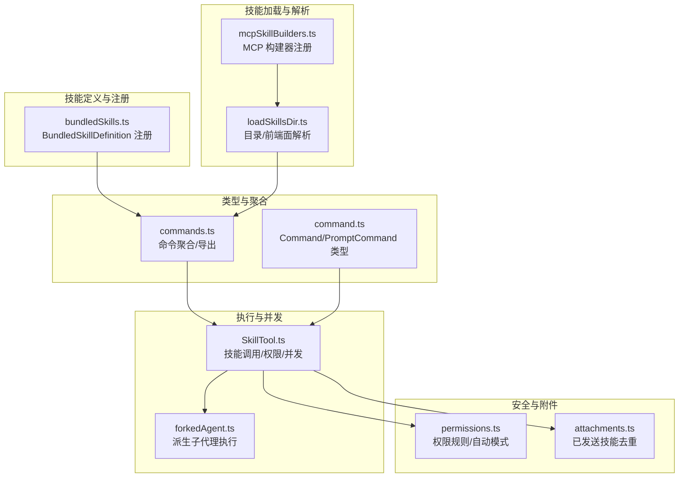
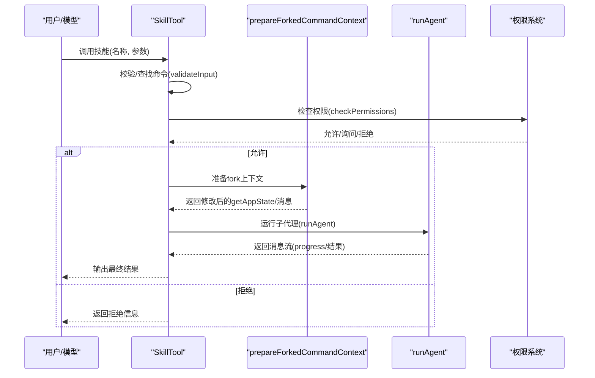
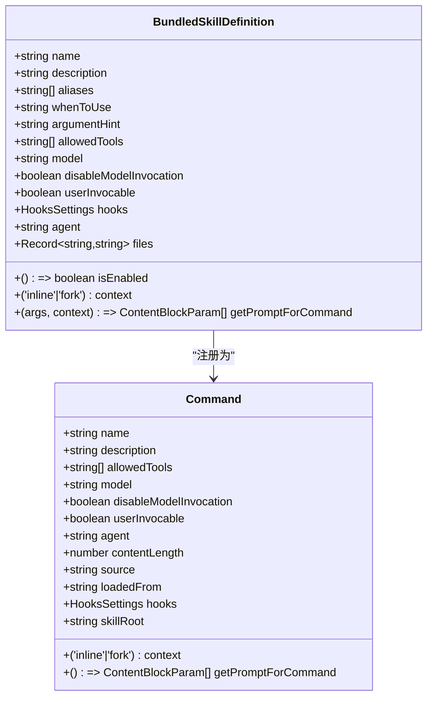
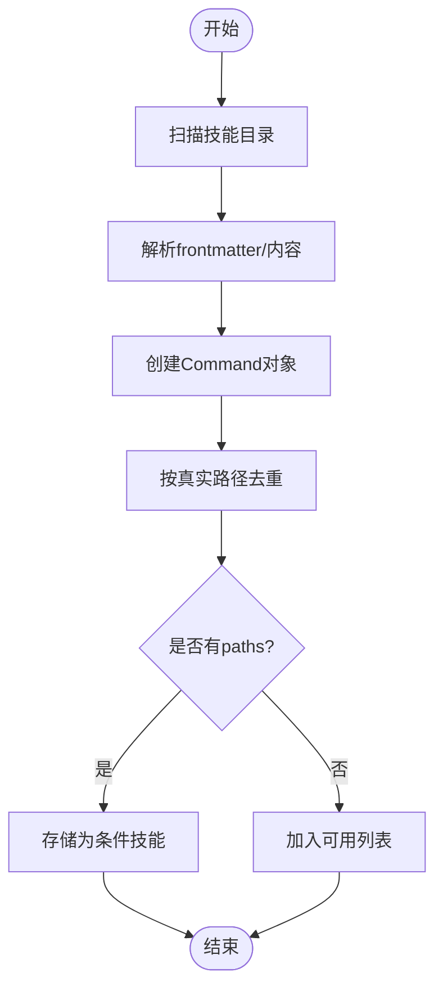
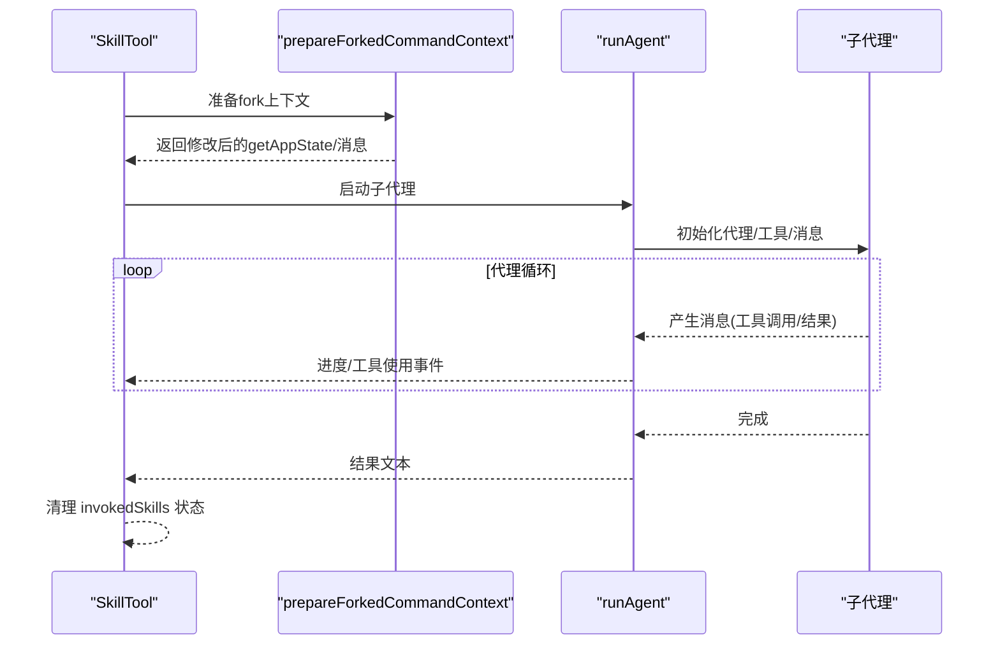
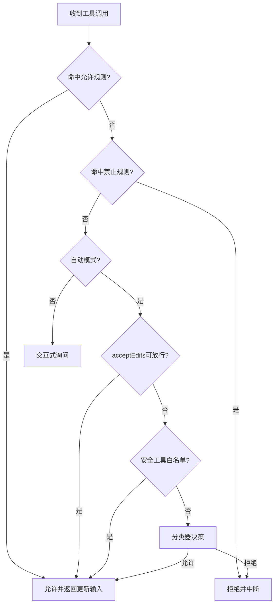
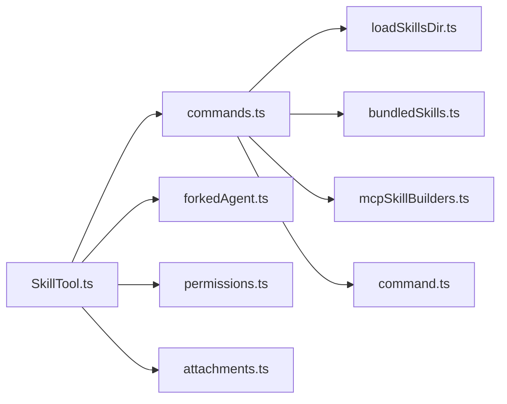

# 技能架构设计

<cite>
**本文引用的文件**
- [bundledSkills.ts](file://src/skills/bundledSkills.ts)
- [loadSkillsDir.ts](file://src/skills/loadSkillsDir.ts)
- [mcpSkillBuilders.ts](file://src/skills/mcpSkillBuilders.ts)
- [SkillTool.ts](file://src/tools/SkillTool/SkillTool.ts)
- [forkedAgent.ts](file://src/utils/forkedAgent.ts)
- [command.ts](file://src/types/command.ts)
- [commands.ts](file://src/commands.ts)
- [permissions.ts](file://src/utils/permissions/permissions.ts)
- [attachments.ts](file://src/utils/attachments.ts)
</cite>

## 目录
1. [引言](#引言)
2. [项目结构](#项目结构)
3. [核心组件](#核心组件)
4. [架构总览](#架构总览)
5. [详细组件分析](#详细组件分析)
6. [依赖关系分析](#依赖关系分析)
7. [性能考量](#性能考量)
8. [故障排查指南](#故障排查指南)
9. [结论](#结论)
10. [附录](#附录)

## 引言
本文件系统性阐述 free-code 的“技能”（Skill）架构设计与实现，覆盖技能定义的数据结构、注册与生命周期、存储与加载、执行上下文与并发控制、以及安全与最佳实践。重点围绕 BundledSkillDefinition 接口的设计理念与使用方式，解释技能从注册到执行的全链路行为，并提供可视化图示帮助读者快速把握整体架构。

## 项目结构
技能系统主要分布在以下模块：
- 技能定义与注册：src/skills/bundledSkills.ts
- 技能加载与解析：src/skills/loadSkillsDir.ts
- MCP 技能构建器注册：src/skills/mcpSkillBuilders.ts
- 技能执行入口与并发控制：src/tools/SkillTool/SkillTool.ts、src/utils/forkedAgent.ts
- 类型与命令模型：src/types/command.ts
- 命令聚合与导出：src/commands.ts
- 权限与安全控制：src/utils/permissions/permissions.ts
- 附件与技能发送去重：src/utils/attachments.ts

图表来源
- [bundledSkills.ts:15-100](file://src/skills/bundledSkills.ts#L15-L100)
- [loadSkillsDir.ts:638-800](file://src/skills/loadSkillsDir.ts#L638-L800)
- [mcpSkillBuilders.ts:26-44](file://src/skills/mcpSkillBuilders.ts#L26-L44)
- [SkillTool.ts:118-289](file://src/tools/SkillTool/SkillTool.ts#L118-L289)
- [forkedAgent.ts:143-232](file://src/utils/forkedAgent.ts#L143-L232)
- [command.ts:25-57](file://src/types/command.ts#L25-L57)
- [commands.ts:353-398](file://src/commands.ts#L353-L398)
- [permissions.ts:473-501](file://src/utils/permissions/permissions.ts#L473-L501)
- [attachments.ts:2597-2615](file://src/utils/attachments.ts#L2597-L2615)

章节来源
- [bundledSkills.ts:15-122](file://src/skills/bundledSkills.ts#L15-L122)
- [loadSkillsDir.ts:638-800](file://src/skills/loadSkillsDir.ts#L638-L800)
- [SkillTool.ts:118-289](file://src/tools/SkillTool/SkillTool.ts#L118-L289)
- [command.ts:25-57](file://src/types/command.ts#L25-L57)
- [commands.ts:353-398](file://src/commands.ts#L353-L398)

## 核心组件
- BundledSkillDefinition：内置技能的声明式定义接口，支持名称、描述、别名、工具限制、模型配置、是否允许用户调用、执行上下文、代理类型、钩子、条件启用、参考文件提取等。
- 注册与存储：registerBundledSkill 将定义转换为 Command 并写入内存注册表；getBundledSkills 提供只读副本；clearBundledSkills 支持测试清理。
- 加载与解析：loadSkillsDir 负责从多源目录加载技能，解析 frontmatter，去重与条件技能管理，生成 Command。
- 执行入口：SkillTool 统一接收技能调用请求，进行校验、权限决策、并发控制与执行（内联或派生子代理）。
- 并发与隔离：prepareForkedCommandContext 与 runAgent 配合，确保 fork 执行在独立代理中进行，避免污染主会话。
- 安全与权限：权限规则、自动模式分类器、拒绝追踪与建议策略共同保障安全可控。

章节来源
- [bundledSkills.ts:15-100](file://src/skills/bundledSkills.ts#L15-L100)
- [loadSkillsDir.ts:185-401](file://src/skills/loadSkillsDir.ts#L185-L401)
- [SkillTool.ts:354-578](file://src/tools/SkillTool/SkillTool.ts#L354-L578)
- [forkedAgent.ts:143-232](file://src/utils/forkedAgent.ts#L143-L232)
- [permissions.ts:473-501](file://src/utils/permissions/permissions.ts#L473-L501)

## 架构总览
技能系统采用“声明式定义 + 多源加载 + 统一执行入口”的分层架构：
- 定义层：BundledSkillDefinition 与 frontmatter 字段映射到 Command。
- 存储层：内存注册表（bundledSkills）与磁盘目录（/skills/）并存，MCP 技能通过构建器注册。
- 执行层：SkillTool 作为统一入口，结合权限与并发控制，选择内联或 fork 执行路径。
- 安全层：权限规则、自动模式分类器、拒绝追踪与去重机制贯穿执行链路。

图表来源
- [SkillTool.ts:354-578](file://src/tools/SkillTool/SkillTool.ts#L354-L578)
- [forkedAgent.ts:191-232](file://src/utils/forkedAgent.ts#L191-L232)
- [permissions.ts:473-501](file://src/utils/permissions/permissions.ts#L473-L501)

## 详细组件分析

### BundledSkillDefinition 设计与数据结构
- 设计目标：以最小接口承载技能元数据与动态提示生成能力，同时支持可选的参考文件提取与前置目录注入。
- 关键字段：
  - 基础属性：name、description、aliases、whenToUse、argumentHint
  - 工具与模型：allowedTools、model、disableModelInvocation、userInvocable
  - 生命周期与上下文：isEnabled、hooks、context('inline'|'fork')、agent
  - 文件系统：files（首次调用时解压到确定性目录），getPromptForCommand(args, context) -> ContentBlockParam[]
- 注册流程：
  - registerBundledSkill 接收定义，若存在 files 则包装 getPromptForCommand，实现首次调用时的惰性解压与前缀注入。
  - 将定义映射为 Command，设置 source='bundled'、loadedFrom='bundled' 等标识，加入内存注册表。
  - getBundledSkills 返回副本，防止外部修改；clearBundledSkills 用于测试。
- 安全与健壮性：
  - 解压过程对路径进行规范化与逃逸检测，防止目录穿越。
  - 使用 owner-only 权限写入，避免受 umask 影响。
  - 写入采用 O_EXCL/O_NOFOLLOW 等标志，减少竞态风险。

图表来源
- [bundledSkills.ts:15-41](file://src/skills/bundledSkills.ts#L15-L41)
- [bundledSkills.ts:75-99](file://src/skills/bundledSkills.ts#L75-L99)
- [command.ts:25-57](file://src/types/command.ts#L25-L57)

章节来源
- [bundledSkills.ts:15-122](file://src/skills/bundledSkills.ts#L15-L122)
- [command.ts:25-57](file://src/types/command.ts#L25-L57)

### 技能注册与存储机制
- 内存注册表：bundledSkills 数组保存已注册的 Command；getBundledSkills 返回副本；clearBundledSkills 清空（测试用途）。
- 持久化存储：技能文件位于磁盘目录（/skills/），由 loadSkillsDir 递归扫描、解析 frontmatter、去重与条件技能管理。
- 去重策略：基于文件真实路径（realpath）识别同一文件的不同访问路径（符号链接、父目录重叠等）。
- 条件技能：frontmatter 中的 paths 字段用于延迟激活，仅在匹配文件被触及时加入可用集合。

图表来源
- [loadSkillsDir.ts:407-480](file://src/skills/loadSkillsDir.ts#L407-L480)
- [loadSkillsDir.ts:725-797](file://src/skills/loadSkillsDir.ts#L725-L797)

章节来源
- [loadSkillsDir.ts:407-480](file://src/skills/loadSkillsDir.ts#L407-L480)
- [loadSkillsDir.ts:725-797](file://src/skills/loadSkillsDir.ts#L725-L797)

### 技能执行上下文与并发处理
- 内联执行：直接扩展技能提示到当前对话，适合轻量、低风险操作。
- fork 执行：在独立子代理中运行，拥有独立 token 预算与工具权限，适合复杂任务与潜在高开销操作。
- 上下文准备：prepareForkedCommandContext 负责：
  - 从命令获取技能提示文本
  - 解析 allowedTools 并创建带允许规则的 getAppState
  - 选择 agent 或默认通用代理
  - 构造初始消息列表
- 并发控制：SkillTool 在一次调用中串行处理，避免资源竞争；fork 执行在子代理内部隔离。

图表来源
- [SkillTool.ts:118-289](file://src/tools/SkillTool/SkillTool.ts#L118-L289)
- [forkedAgent.ts:191-232](file://src/utils/forkedAgent.ts#L191-L232)

章节来源
- [SkillTool.ts:118-289](file://src/tools/SkillTool/SkillTool.ts#L118-L289)
- [forkedAgent.ts:143-232](file://src/utils/forkedAgent.ts#L143-L232)

### 权限与安全考虑
- 规则匹配：基于工具名与规则内容（精确/前缀:*）匹配，支持 allow/deny/ask 三类规则。
- 自动模式：在 auto/plan 模式下，优先尝试 acceptEdits 快速放行、安全工具白名单跳过分类器，最后使用分类器做最终决策。
- 拒绝追踪：记录连续拒绝次数与总拒绝数，影响后续自动决策。
- 建议与提示：当无法命中规则时，提供添加规则的建议，便于用户快速授权。
- 分离去重：已发送技能集合按 agentId 分离，避免主会话与子代理互相影响。

图表来源
- [permissions.ts:473-501](file://src/utils/permissions/permissions.ts#L473-L501)
- [permissions.ts:600-793](file://src/utils/permissions/permissions.ts#L600-L793)
- [SkillTool.ts:432-578](file://src/tools/SkillTool/SkillTool.ts#L432-L578)
- [attachments.ts:2597-2615](file://src/utils/attachments.ts#L2597-L2615)

章节来源
- [permissions.ts:473-501](file://src/utils/permissions/permissions.ts#L473-L501)
- [permissions.ts:600-793](file://src/utils/permissions/permissions.ts#L600-L793)
- [SkillTool.ts:432-578](file://src/tools/SkillTool/SkillTool.ts#L432-L578)
- [attachments.ts:2597-2615](file://src/utils/attachments.ts#L2597-L2615)

## 依赖关系分析
- 命令聚合：commands.ts 从多源收集技能命令（目录技能、插件技能、内置技能、MCP 技能），统一暴露给上层使用。
- 类型约束：command.ts 定义 Command/PromptCommand，确保所有技能具备一致的字段与行为契约。
- MCP 协作：mcpSkillBuilders.ts 通过注册表向 MCP 客户端暴露 loadSkillsDir 的关键函数，避免循环依赖。

图表来源
- [commands.ts:353-398](file://src/commands.ts#L353-L398)
- [loadSkillsDir.ts:638-800](file://src/skills/loadSkillsDir.ts#L638-L800)
- [bundledSkills.ts:106-108](file://src/skills/bundledSkills.ts#L106-L108)
- [mcpSkillBuilders.ts:31-44](file://src/skills/mcpSkillBuilders.ts#L31-L44)
- [SkillTool.ts:81-94](file://src/tools/SkillTool/SkillTool.ts#L81-L94)
- [command.ts:25-57](file://src/types/command.ts#L25-L57)

章节来源
- [commands.ts:353-398](file://src/commands.ts#L353-L398)
- [SkillTool.ts:81-94](file://src/tools/SkillTool/SkillTool.ts#L81-L94)

## 性能考量
- 惰性解压与缓存：bundled skills 的参考文件仅在首次调用时解压，且进程内缓存 promise，避免重复写入与竞态。
- 去重与缓存：loadSkillsDir 对文件身份进行 realpath 去重，减少重复 IO；memoize 缓存目录扫描结果。
- 并发隔离：fork 执行在子代理中进行，避免阻塞主会话；进度事件按消息粒度上报，降低 UI 压力。
- 前缀注入成本：为技能提示注入 base directory 前缀，便于模型按需读取文件，但需注意首块文本拼接的开销。

章节来源
- [bundledSkills.ts:64-73](file://src/skills/bundledSkills.ts#L64-L73)
- [loadSkillsDir.ts:638-800](file://src/skills/loadSkillsDir.ts#L638-L800)
- [SkillTool.ts:240-262](file://src/tools/SkillTool/SkillTool.ts#L240-L262)

## 故障排查指南
- 技能未显示或不可用
  - 检查 frontmatter 是否正确（description、user-invocable、allowed-tools 等）
  - 确认是否被路径过滤(paths)限制，等待匹配文件触达后再激活
  - 查看日志中的去重提示，确认是否因符号链接导致重复被忽略
- fork 执行失败
  - 检查 agent 可用性与 effort 设置是否冲突
  - 确认 allowedTools 是否正确传入子代理上下文
  - 关注进度事件，定位工具调用阶段的异常
- 权限被拒绝
  - 使用建议规则快速授权（exact 与 prefix:*）
  - 检查自动模式下的分类器决策与拒绝追踪状态
  - 确认 deny 规则是否覆盖了预期行为
- 已发送技能去重问题
  - 若主会话与子代理互相看不到彼此发送的技能，检查 sentSkillNames 的 agentId 隔离逻辑

章节来源
- [loadSkillsDir.ts:725-797](file://src/skills/loadSkillsDir.ts#L725-L797)
- [SkillTool.ts:205-289](file://src/tools/SkillTool/SkillTool.ts#L205-L289)
- [permissions.ts:473-501](file://src/utils/permissions/permissions.ts#L473-L501)
- [attachments.ts:2597-2615](file://src/utils/attachments.ts#L2597-L2615)

## 结论
该技能架构以“声明式定义 + 多源加载 + 统一执行入口 + 安全可控”的设计实现了灵活、可扩展、可审计的技能体系。BundledSkillDefinition 与 frontmatter 的组合提供了强大的表达能力，配合内存注册表、磁盘目录与 MCP 的统一聚合，满足从内置到生态扩展的多样化需求。执行层面通过 fork 隔离与权限系统保障安全，结合去重与缓存优化提升性能与稳定性。

## 附录
- 最佳实践
  - 优先使用 frontmatter 明确 allowed-tools、model、context、agent、effort 等关键属性
  - 对可能产生大量 IO 的技能启用 context='fork'，并合理设置 effort
  - 使用 files 字段提供参考文件时，严格控制相对路径，避免目录穿越
  - 为敏感技能配置 deny 规则或要求交互式授权
  - 定期清理与验证去重逻辑，避免符号链接导致的重复加载