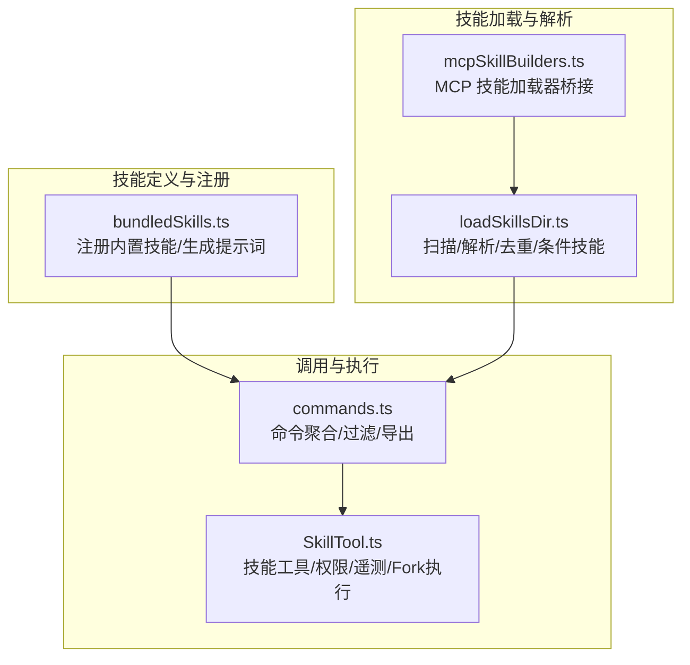
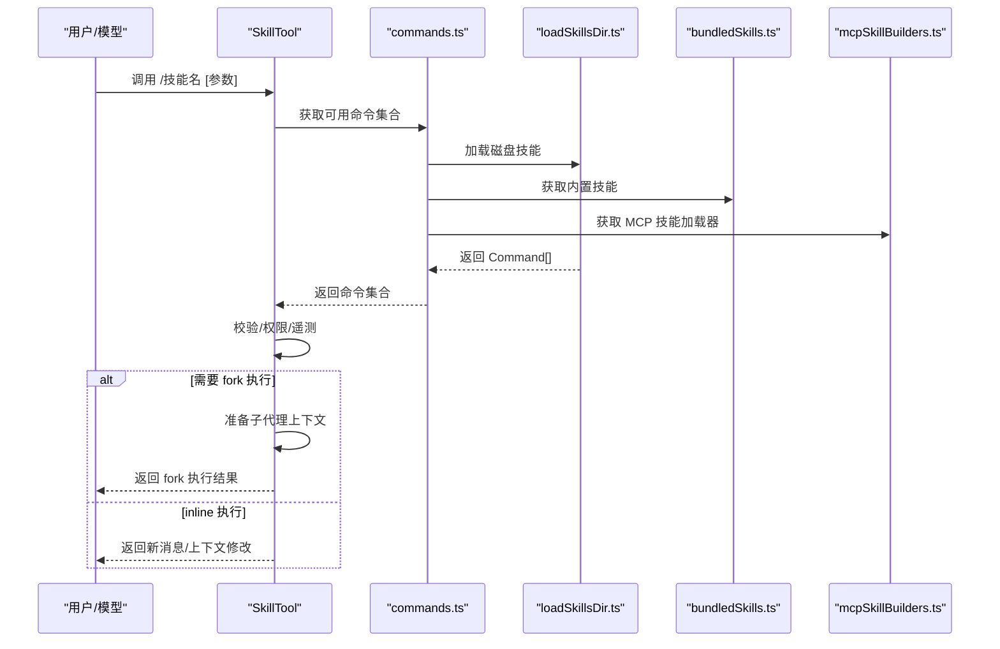
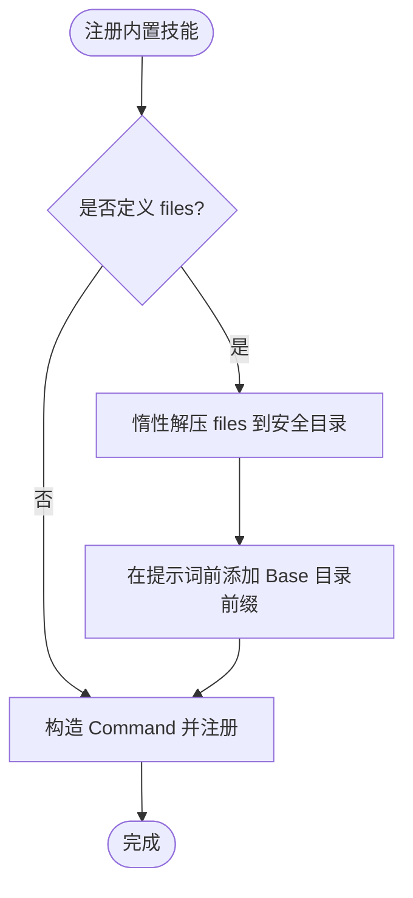
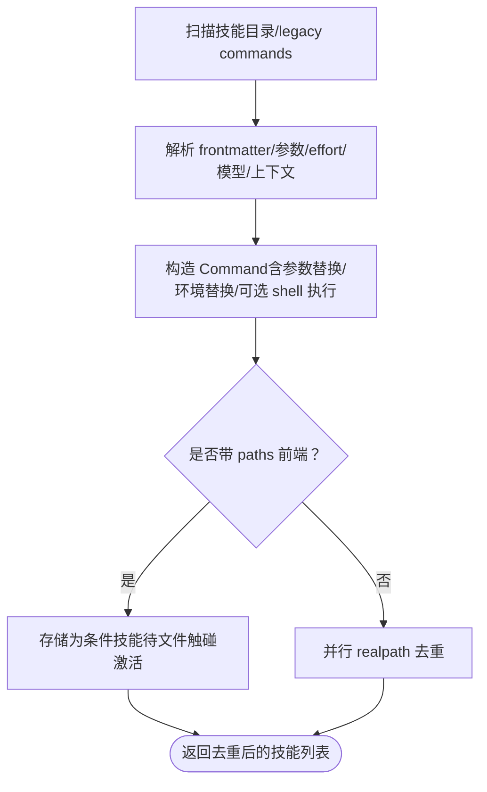
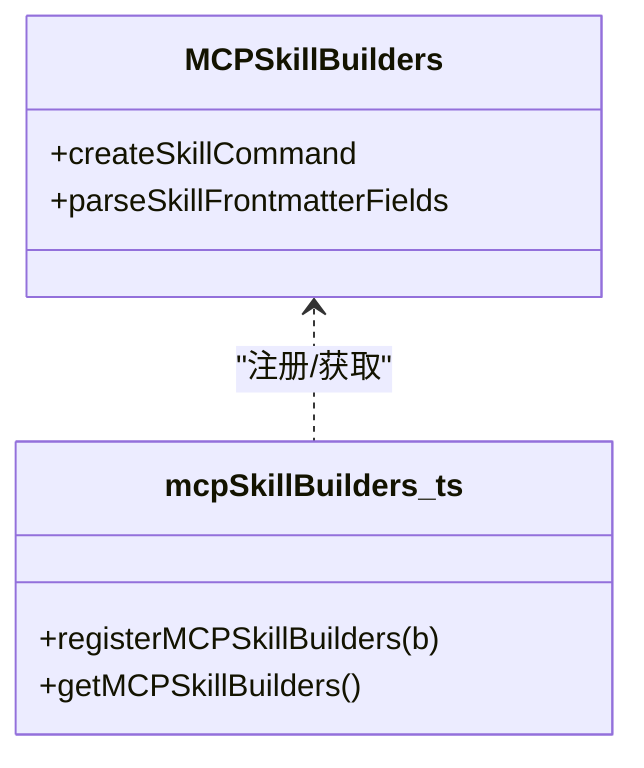
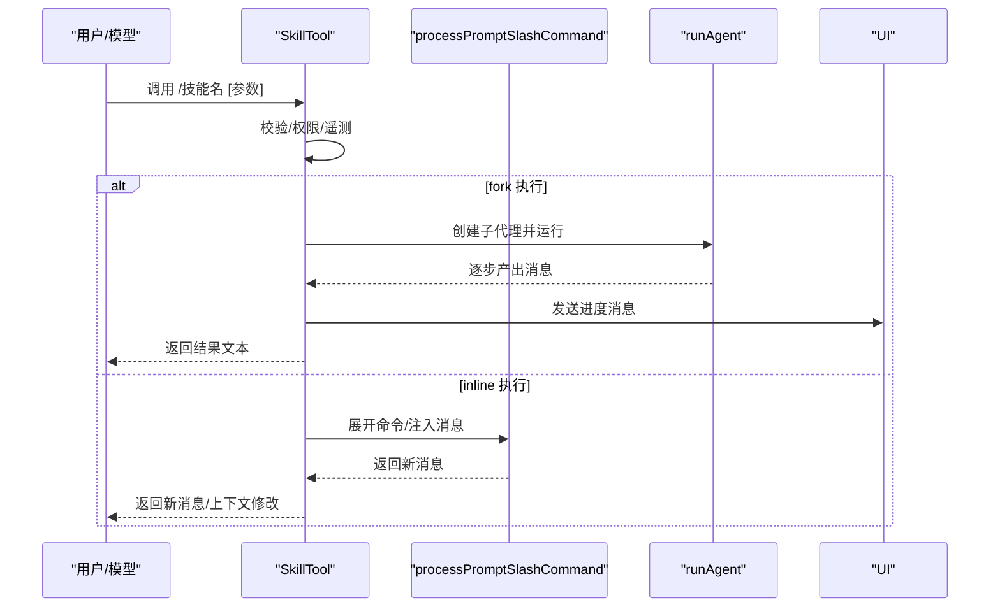
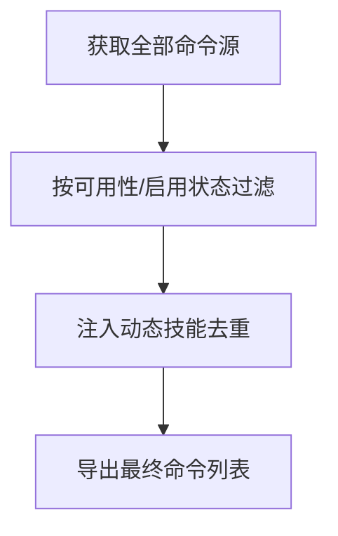
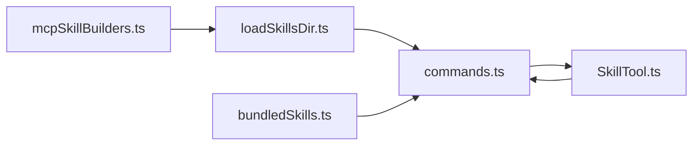

# 技能系统

<cite>
**本文引用的文件**
- [bundledSkills.ts](file://src/skills/bundledSkills.ts)
- [loadSkillsDir.ts](file://src/skills/loadSkillsDir.ts)
- [mcpSkillBuilders.ts](file://src/skills/mcpSkillBuilders.ts)
- [SkillTool.ts](file://src/tools/SkillTool/SkillTool.ts)
- [commands.ts](file://src/commands.ts)
- [init.ts](file://src/commands/init.ts)
</cite>

## 目录
1. [简介](#简介)
2. [项目结构](#项目结构)
3. [核心组件](#核心组件)
4. [架构总览](#架构总览)
5. [详细组件分析](#详细组件分析)
6. [依赖关系分析](#依赖关系分析)
7. [性能考量](#性能考量)
8. [故障排查指南](#故障排查指南)
9. [结论](#结论)
10. [附录](#附录)

## 简介
本文件系统性阐述 free-code 的“技能系统”（Skill System）：从架构设计到工作流模板的实现机制；从内置技能结构、预定义工作流到技能开发指南（定义、参数配置、执行逻辑）；覆盖技能的创建、编辑与管理流程，并解释与工具系统的集成方式及扩展机制。同时给出最佳实践与典型应用场景，帮助开发者快速上手并安全地扩展技能生态。

## 项目结构
技能系统围绕以下关键模块协同工作：
- 技能注册与内置技能：bundledSkills.ts 提供“打包进二进制”的内置技能注册与运行时提示词生成。
- 技能加载与解析：loadSkillsDir.ts 负责从用户/策略/项目/插件等多来源加载技能，解析 frontmatter，构建 Command 对象。
- MCP 技能桥接：mcpSkillBuilders.ts 以类型安全的方式在循环依赖中注入加载器函数。
- 技能调用工具：SkillTool.ts 将技能作为工具暴露给模型与用户，支持 fork 执行、权限校验、遥测与进度反馈。
- 命令体系聚合：commands.ts 汇聚所有命令源（内置、技能、插件、工作流），统一对外提供可用命令列表。

图示来源
- [bundledSkills.ts:1-221](file://src/skills/bundledSkills.ts#L1-L221)
- [loadSkillsDir.ts:1-800](file://src/skills/loadSkillsDir.ts#L1-L800)
- [mcpSkillBuilders.ts:1-45](file://src/skills/mcpSkillBuilders.ts#L1-L45)
- [SkillTool.ts:1-800](file://src/tools/SkillTool/SkillTool.ts#L1-L800)
- [commands.ts:1-755](file://src/commands.ts#L1-L755)

章节来源
- [bundledSkills.ts:1-221](file://src/skills/bundledSkills.ts#L1-L221)
- [loadSkillsDir.ts:1-800](file://src/skills/loadSkillsDir.ts#L1-L800)
- [mcpSkillBuilders.ts:1-45](file://src/skills/mcpSkillBuilders.ts#L1-L45)
- [SkillTool.ts:1-800](file://src/tools/SkillTool/SkillTool.ts#L1-L800)
- [commands.ts:1-755](file://src/commands.ts#L1-L755)

## 核心组件
- 内置技能注册与提示词生成
  - 通过 registerBundledSkill 注册打包技能，支持首次调用时惰性解压参考文件，自动在提示词前添加“技能根目录”前缀，便于模型按需读取/搜索。
  - 支持禁用模型直接调用、指定上下文（fork/inline）、代理/钩子等高级属性。
- 技能加载与解析
  - 从策略/用户/项目/附加目录/遗留 commands 目录并行加载，解析 frontmatter（描述、允许工具、参数、effort、模型、上下文、agent、hooks 等），构造 Command。
  - 去重：基于真实路径 identity 避免符号链接/重复父目录导致的重复加载。
  - 条件技能：带 paths frontmatter 的技能在匹配文件被触碰时激活。
- MCP 技能桥接
  - 以类型安全的注册表避免循环依赖，供 MCP 发现流程复用本地解析与命令构造逻辑。
- 技能工具（SkillTool）
  - 校验输入、权限决策、遥测、进度反馈；支持 fork 子代理执行；对远程/官方/内置/打包技能进行来源标记与统计。
- 命令聚合
  - 统一汇聚内置命令、技能、插件、工作流，提供过滤、可用性检查、动态技能插入、缓存清理等能力。

章节来源
- [bundledSkills.ts:15-108](file://src/skills/bundledSkills.ts#L15-L108)
- [loadSkillsDir.ts:185-401](file://src/skills/loadSkillsDir.ts#L185-L401)
- [mcpSkillBuilders.ts:26-44](file://src/skills/mcpSkillBuilders.ts#L26-L44)
- [SkillTool.ts:354-578](file://src/tools/SkillTool/SkillTool.ts#L354-L578)
- [commands.ts:449-517](file://src/commands.ts#L449-L517)

## 架构总览
技能系统采用“多源聚合 + 类型安全桥接 + 工具化调用”的分层架构：
- 数据层：技能文件（SKILL.md）与 frontmatter 定义。
- 解析层：统一解析 frontmatter、参数、路径、effort、模型、上下文、hooks 等。
- 注册层：内置技能静态注册；磁盘技能动态注册；MCP 技能发现后注册。
- 调用层：SkillTool 作为统一入口，负责权限、遥测、进度、fork 执行与消息输出。
- 展示层：commands.ts 提供命令列表、过滤、格式化来源标注。

图示来源
- [SkillTool.ts:580-799](file://src/tools/SkillTool/SkillTool.ts#L580-L799)
- [commands.ts:449-517](file://src/commands.ts#L449-L517)
- [loadSkillsDir.ts:638-800](file://src/skills/loadSkillsDir.ts#L638-L800)
- [bundledSkills.ts:106-108](file://src/skills/bundledSkills.ts#L106-L108)
- [mcpSkillBuilders.ts:33-44](file://src/skills/mcpSkillBuilders.ts#L33-L44)

## 详细组件分析

### 内置技能注册与运行时提示词生成（bundledSkills.ts）
- 关键点
  - BundledSkillDefinition 描述技能元数据（名称、描述、别名、使用场景、参数提示、允许工具、模型、是否可由用户调用、上下文、agent、hooks、files 等）。
  - registerBundledSkill 将定义转换为 Command 并注册；若定义了 files，则在首次调用时惰性解压到安全目录，并在提示词前添加“Base directory for this skill: …”前缀。
  - getBundledSkills 返回副本，避免外部修改；clearBundledSkills 用于测试。
  - 文件写入采用安全模式（O_EXCL/O_NOFOLLOW、0o700/0o600、Windows 字符串标志），防止符号链接攻击与竞态。
- 复杂度与性能
  - 惰性解压仅发生一次（进程内 promise 缓存），后续调用复用已解压目录。
  - 写入阶段按父目录分组并行 mkdir/write，减少 IO 次数。
- 错误处理
  - 解压失败会记录调试日志并继续运行（无 base 目录前缀）。

图示来源
- [bundledSkills.ts:53-100](file://src/skills/bundledSkills.ts#L53-L100)
- [bundledSkills.ts:131-145](file://src/skills/bundledSkills.ts#L131-L145)
- [bundledSkills.ts:208-220](file://src/skills/bundledSkills.ts#L208-L220)

章节来源
- [bundledSkills.ts:15-108](file://src/skills/bundledSkills.ts#L15-L108)
- [bundledSkills.ts:131-145](file://src/skills/bundledSkills.ts#L131-L145)
- [bundledSkills.ts:208-220](file://src/skills/bundledSkills.ts#L208-L220)

### 技能加载与解析（loadSkillsDir.ts）
- 关键点
  - getSkillDirCommands 并行加载策略/用户/项目/附加目录/遗留 commands，返回去重后的 Command 列表。
  - parseSkillFrontmatterFields 解析通用 frontmatter 字段（名称、描述、允许工具、参数、effort、模型、是否禁用模型调用、是否用户可调用、hooks、上下文、agent、shell 等）。
  - createSkillCommand 构造 Command，支持参数替换、环境变量替换（如 CLAUDE_SKILL_DIR、CLAUDE_SESSION_ID）、shell 命令执行（MCP 技能不执行 inline shell）。
  - 条件技能：当 frontmatter 中 paths 非空且未激活时，先存储，待匹配文件被触碰再激活。
- 复杂度与性能
  - 并行加载不同来源，去重使用 realpath 预计算，同步去重，时间复杂度近似 O(n)。
  - 前景估计：仅基于 frontmatter 文本估算 token 数量，避免全量加载。
- 安全性
  - shell 命令执行受工具权限上下文控制，MCP 技能禁止 inline 执行 shell。
  - 路径解析严格禁止路径穿越（normalize 后仍不允许 .. 或绝对路径）。

图示来源
- [loadSkillsDir.ts:407-480](file://src/skills/loadSkillsDir.ts#L407-L480)
- [loadSkillsDir.ts:453-471](file://src/skills/loadSkillsDir.ts#L453-L471)
- [loadSkillsDir.ts:638-800](file://src/skills/loadSkillsDir.ts#L638-L800)

章节来源
- [loadSkillsDir.ts:185-401](file://src/skills/loadSkillsDir.ts#L185-L401)
- [loadSkillsDir.ts:638-800](file://src/skills/loadSkillsDir.ts#L638-L800)

### MCP 技能加载器桥接（mcpSkillBuilders.ts）
- 关键点
  - 以只导出类型的安全注册表，避免 loadSkillsDir.ts 与 mcpSkills.ts 之间的循环依赖。
  - 在模块初始化时注册 createSkillCommand 与 parseSkillFrontmatterFields，供 MCP 发现流程复用。
- 适用场景
  - 当 MCP 服务器提供技能时，通过该注册表复用本地解析与命令构造逻辑，确保一致性。

图示来源
- [mcpSkillBuilders.ts:26-44](file://src/skills/mcpSkillBuilders.ts#L26-L44)

章节来源
- [mcpSkillBuilders.ts:26-44](file://src/skills/mcpSkillBuilders.ts#L26-L44)

### 技能工具（SkillTool）与调用流程（SkillTool.ts）
- 关键点
  - 输入校验：去除前导斜杠兼容、远程“规范技能”拦截、命令存在性与类型检查、禁用模型调用检查。
  - 权限决策：支持 deny/allow 规则、前缀规则、自动允许仅使用“安全属性”的技能、建议添加规则。
  - 执行路径：
    - fork 执行：为技能创建独立子代理，隔离 token 预算与工具权限，收集进度消息并返回结果文本。
    - inline 执行：通过 processPromptSlashCommand 展开命令，注入消息、更新上下文（允许工具、模型、effort 等），返回新消息。
  - 遥测与追踪：记录技能来源、加载来源、插件信息、是否被发现、查询深度、父代理 ID 等。
- 进度与 UI
  - fork 执行时，将工具使用 ID 与技能内容关联，向 UI 发送进度消息，便于可视化展示中间状态。

图示来源
- [SkillTool.ts:580-799](file://src/tools/SkillTool/SkillTool.ts#L580-L799)
- [SkillTool.ts:118-289](file://src/tools/SkillTool/SkillTool.ts#L118-L289)

章节来源
- [SkillTool.ts:354-578](file://src/tools/SkillTool/SkillTool.ts#L354-L578)
- [SkillTool.ts:580-799](file://src/tools/SkillTool/SkillTool.ts#L580-L799)

### 命令聚合与导出（commands.ts）
- 关键点
  - 聚合内置命令、技能（磁盘/插件/内置插件/打包）、工作流，统一过滤可用命令、动态技能插入、来源标注。
  - 提供 getSkillToolCommands 与 getSlashCommandToolSkills 两类筛选视图，分别面向“可被模型调用的技能”与“面向用户可见的技能”。
  - 清理缓存：clearCommandMemoizationCaches/clearCommandsCache 支持在动态技能变更后刷新。
- 可用性与远程安全
  - isBridgeSafeCommand 与 filterCommandsForRemoteMode 保障远端模式下命令安全。

图示来源
- [commands.ts:449-517](file://src/commands.ts#L449-L517)
- [commands.ts:563-608](file://src/commands.ts#L563-L608)

章节来源
- [commands.ts:449-517](file://src/commands.ts#L449-L517)
- [commands.ts:563-608](file://src/commands.ts#L563-L608)

## 依赖关系分析
- 模块耦合
  - loadSkillsDir.ts 与 mcpSkillBuilders.ts 通过类型注册避免循环依赖，MCP 发现流程可直接复用本地解析逻辑。
  - SkillTool 依赖 commands.ts 提供的命令集合，间接依赖 bundledSkills.ts 与 loadSkillsDir.ts 的注册结果。
  - commands.ts 统一聚合各来源命令，提供稳定的命令导出接口。
- 外部依赖
  - frontmatter 解析、路径解析、文件系统操作、权限规则、遥测服务等均在内部封装，降低对外部库的耦合风险。

图示来源
- [loadSkillsDir.ts:638-800](file://src/skills/loadSkillsDir.ts#L638-L800)
- [bundledSkills.ts:106-108](file://src/skills/bundledSkills.ts#L106-L108)
- [mcpSkillBuilders.ts:33-44](file://src/skills/mcpSkillBuilders.ts#L33-L44)
- [SkillTool.ts:81-94](file://src/tools/SkillTool/SkillTool.ts#L81-L94)
- [commands.ts:449-517](file://src/commands.ts#L449-L517)

章节来源
- [loadSkillsDir.ts:638-800](file://src/skills/loadSkillsDir.ts#L638-L800)
- [SkillTool.ts:81-94](file://src/tools/SkillTool/SkillTool.ts#L81-L94)
- [commands.ts:449-517](file://src/commands.ts#L449-L517)

## 性能考量
- 惰性解压与缓存
  - 内置技能首次调用才解压 files，后续复用；进程内 promise 缓存避免并发写入竞争。
- 并行加载
  - 不同来源的技能目录并行扫描与解析，显著缩短启动时间。
- 去重与估算
  - realpath 预计算 + 同步去重，避免重复文件多次加载；frontmatter token 估算避免全量加载。
- 执行路径选择
  - fork 执行适合长耗时或需要隔离的技能；inline 执行适合轻量、快速响应的技能。

## 故障排查指南
- 技能未显示或不可调用
  - 检查 frontmatter 是否包含用户可描述或“使用场景”，否则可能不会出现在可调用技能列表中。
  - 若设置了 disable-model-invocation，则仅用户可触发，模型无法直接调用。
- 权限被拒绝
  - 检查 deny/allow 规则与前缀规则；必要时通过建议的“添加规则”快速放行。
- 路径穿越或写入失败
  - 内置技能 files 写入采用安全模式；若失败会记录调试日志但不影响运行。
- 兼容性问题
  - 命令名支持前导斜杠；远程“规范技能”名称以特定前缀识别，需先发现再执行。

章节来源
- [SkillTool.ts:354-578](file://src/tools/SkillTool/SkillTool.ts#L354-L578)
- [bundledSkills.ts:131-145](file://src/skills/bundledSkills.ts#L131-L145)

## 结论
free-code 的技能系统通过“多源聚合 + 类型安全桥接 + 工具化调用”的架构，实现了从内置技能到磁盘/插件/MCP 技能的统一管理与高效执行。其设计兼顾安全性（路径校验、权限规则、fork 隔离）、可观测性（遥测、进度反馈）与可扩展性（MCP 桥接、动态技能）。开发者可据此快速创建、编辑与管理技能，并将其无缝集成到工具链中。

## 附录

### 技能开发指南（从零到一）
- 技能定义与文件组织
  - 使用目录式结构：skill-name/SKILL.md，其中 SKILL.md 包含 frontmatter 与正文。
  - frontmatter 常用字段：name、description、when_to_use、arguments、argument-hint、allowed-tools、model、disable-model-invocation、user-invocable、context、agent、hooks、paths、effort、shell 等。
- 参数配置与执行逻辑
  - 参数：通过 arguments/argumentNames/argumentHint 定义；运行时通过 $ARGUMENTS 注入。
  - 模型与上下文：可通过 model/agent/context 控制执行环境；fork 上下文适合长任务。
  - 路径与条件：paths 限定生效范围；未激活的条件技能会在匹配文件被触碰时激活。
  - Shell：支持在非 MCP 技能中执行 inline shell 命令（受工具权限上下文控制）。
- 创建、编辑与管理流程
  - 创建：在 .claude/skills/<skill-name>/ 下新建 SKILL.md，填写 frontmatter 与正文。
  - 编辑：修改 SKILL.md 后重新加载命令缓存；动态技能变更需清理缓存以生效。
  - 管理：通过 /skills 命令查看与管理；结合 hooks 实现自动化（如保存/格式化/测试）。
- 与工具系统的集成
  - 通过 SkillTool 调用：/技能名 [参数]；支持 fork 执行与进度反馈。
  - 与插件/内置插件技能共存：commands.ts 统一聚合，来源标注清晰。
- 最佳实践
  - 明确“何时使用”与“如何使用”，提升模型与用户的理解成本。
  - 将副作用操作（如部署/提交）设置为 disable-model-invocation，仅用户可触发。
  - 使用 paths 限制技能作用域，避免误触发。
  - 对长耗时任务使用 fork 上下文，隔离资源与权限。
  - 优先使用“安全属性”的技能，减少权限弹窗与阻塞。
- 实际应用场景
  - 代码审查：定义 review-pr 技能，自动拉取差异、定位问题、生成建议。
  - 测试验证：定义 verify 技能，按项目约定运行测试与静态检查。
  - 部署流程：定义 deploy-sandbox 技能，封装部署步骤与回滚策略。
  - 会话报告：定义 session-report 技能，自动生成阶段性总结与下一步建议。

章节来源
- [loadSkillsDir.ts:185-401](file://src/skills/loadSkillsDir.ts#L185-L401)
- [SkillTool.ts:580-799](file://src/tools/SkillTool/SkillTool.ts#L580-L799)
- [commands.ts:563-608](file://src/commands.ts#L563-L608)
- [init.ts:154-182](file://src/commands/init.ts#L154-L182)