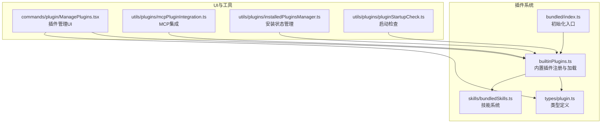
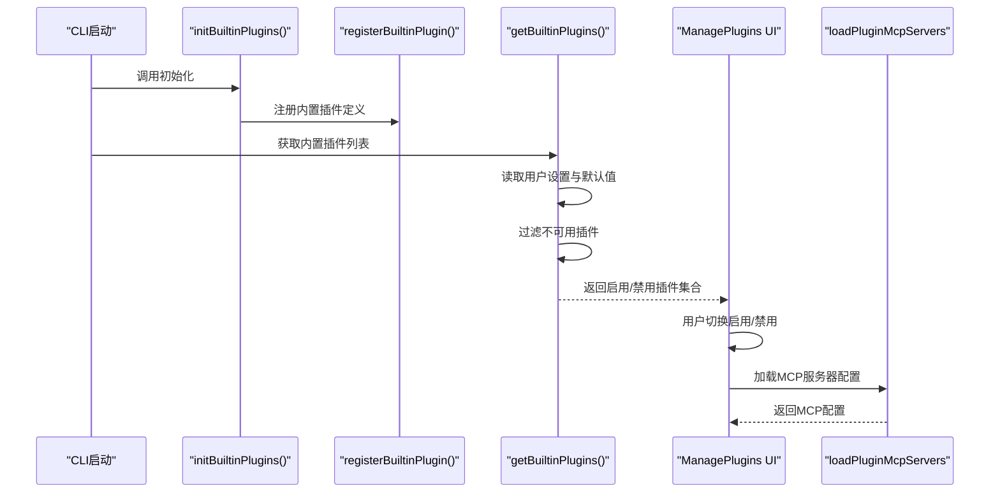
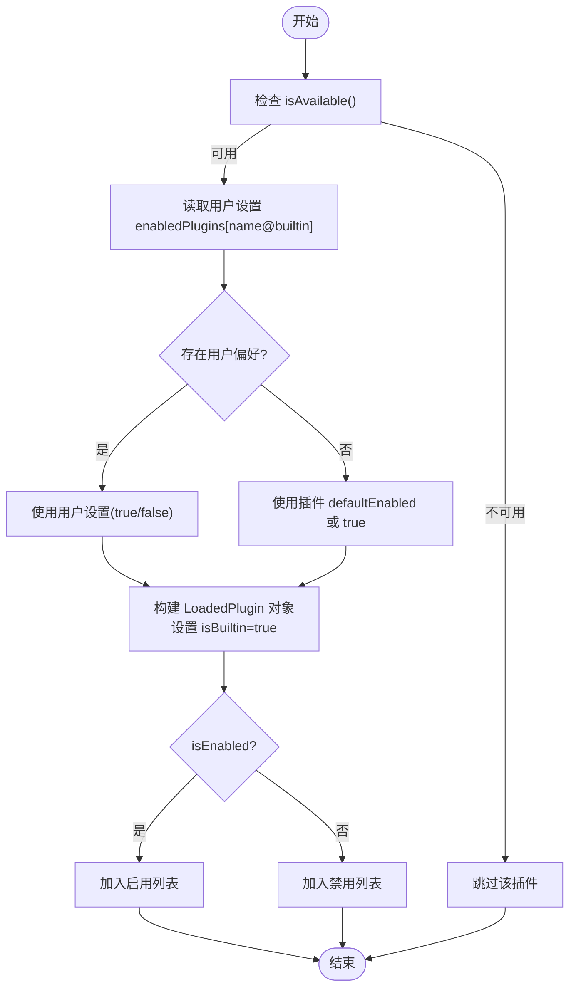
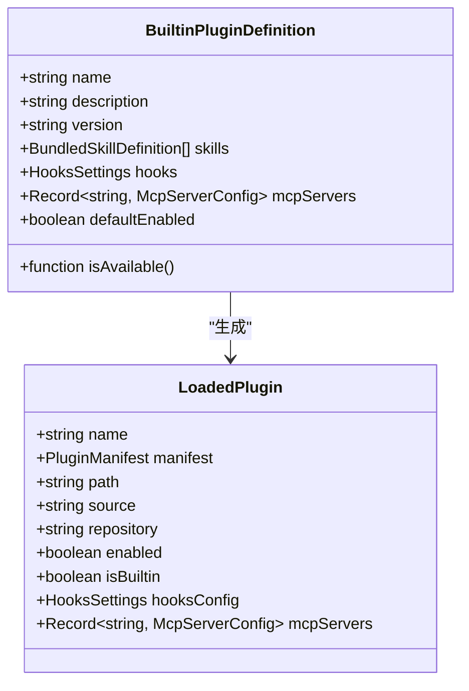
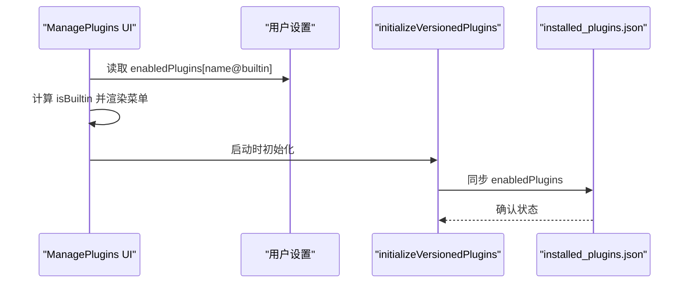
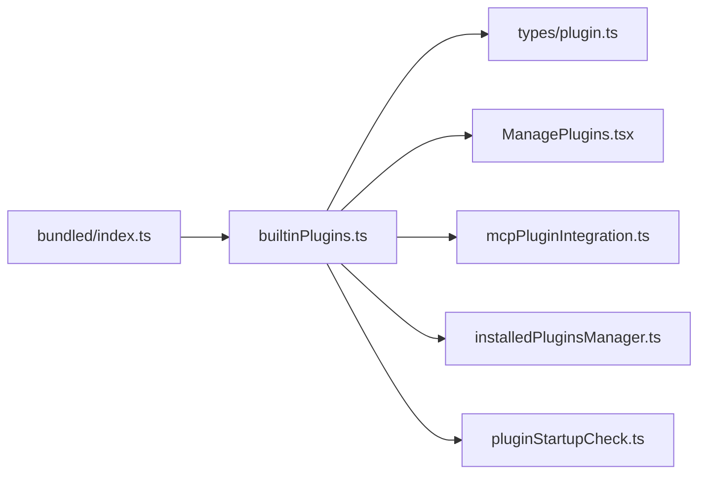

# 内置插件参考

<cite>
**本文档引用的文件**
- [builtinPlugins.ts](file://src/plugins/builtinPlugins.ts)
- [index.ts](file://src/plugins/bundled/index.ts)
- [plugin.ts](file://src/types/plugin.ts)
- [bundledSkills.ts](file://src/skills/bundledSkills.ts)
- [ManagePlugins.tsx](file://src/commands/plugin/ManagePlugins.tsx)
- [mcpPluginIntegration.ts](file://src/utils/plugins/mcpPluginIntegration.ts)
- [installedPluginsManager.ts](file://src/utils/plugins/installedPluginsManager.ts)
- [pluginStartupCheck.ts](file://src/utils/plugins/pluginStartupCheck.ts)
</cite>

## 目录
1. [简介](#简介)
2. [项目结构](#项目结构)
3. [核心组件](#核心组件)
4. [架构总览](#架构总览)
5. [详细组件分析](#详细组件分析)
6. [依赖关系分析](#依赖关系分析)
7. [性能考量](#性能考量)
8. [故障排查指南](#故障排查指南)
9. [结论](#结论)
10. [附录](#附录)

## 简介
本参考文档面向 free-code 的内置插件体系，系统梳理内置插件的注册机制、作用域、组件类型、默认启用状态、标识符格式、与市场插件的区别、可用性检查与平台兼容性、配置选项与使用示例等。当前仓库中内置插件处于“迁移准备”阶段：已提供完整的注册与加载框架，但尚未有具体内置插件被注册到系统中。

## 项目结构
内置插件相关的核心文件分布于以下模块：
- 插件注册与加载：src/plugins/builtinPlugins.ts
- 初始化入口：src/plugins/bundled/index.ts
- 类型定义：src/types/plugin.ts
- 技能系统（与内置插件共享“技能”组件）：src/skills/bundledSkills.ts
- UI 管理界面：src/commands/plugin/ManagePlugins.tsx
- MCP 集成工具：src/utils/plugins/mcpPluginIntegration.ts
- 插件安装与状态同步：src/utils/plugins/installedPluginsManager.ts、src/utils/plugins/pluginStartupCheck.ts

**图表来源**
- [builtinPlugins.ts:1-160](file://src/plugins/builtinPlugins.ts#L1-L160)
- [index.ts:1-24](file://src/plugins/bundled/index.ts#L1-L24)
- [plugin.ts:1-364](file://src/types/plugin.ts#L1-L364)
- [bundledSkills.ts:1-221](file://src/skills/bundledSkills.ts#L1-L221)
- [ManagePlugins.tsx:1296-1310](file://src/commands/plugin/ManagePlugins.tsx#L1296-L1310)
- [mcpPluginIntegration.ts:122-148](file://src/utils/plugins/mcpPluginIntegration.ts#L122-L148)
- [installedPluginsManager.ts:706-734](file://src/utils/plugins/installedPluginsManager.ts#L706-L734)
- [pluginStartupCheck.ts:187-220](file://src/utils/plugins/pluginStartupCheck.ts#L187-L220)

**章节来源**
- [builtinPlugins.ts:1-160](file://src/plugins/builtinPlugins.ts#L1-L160)
- [index.ts:1-24](file://src/plugins/bundled/index.ts#L1-L24)

## 核心组件
- 内置插件注册表与工具函数
  - 注册：registerBuiltinPlugin(definition)
  - 查询：getBuiltinPluginDefinition(name)、getBuiltinPlugins()
  - 辅助：isBuiltinPluginId(pluginId)、clearBuiltinPlugins()
- 初始化入口
  - initBuiltinPlugins()：在 CLI 启动时调用，用于注册内置插件
- 类型定义
  - BuiltinPluginDefinition：内置插件定义，包含 name、description、version、skills、hooks、mcpServers、isAvailable、defaultEnabled 等字段
  - LoadedPlugin：已加载的插件对象，包含 manifest、source、repository、enabled、isBuiltin、hooksConfig、mcpServers 等
- 技能系统
  - BundledSkillDefinition：与内置插件共享“技能”组件类型，支持用户可调用性、工具限制、模型选择等
- UI 管理
  - ManagePlugins.tsx：展示内置插件列表，支持启用/禁用操作
- MCP 集成
  - mcpPluginIntegration.ts：从插件清单加载 MCP 服务器配置
- 安装与状态
  - installedPluginsManager.ts：版本化插件系统初始化、启用状态同步
  - pluginStartupCheck.ts：插件缺失检测与安装状态查询

**章节来源**
- [builtinPlugins.ts:25-128](file://src/plugins/builtinPlugins.ts#L25-L128)
- [index.ts:18-23](file://src/plugins/bundled/index.ts#L18-L23)
- [plugin.ts:18-70](file://src/types/plugin.ts#L18-L70)
- [bundledSkills.ts:15-41](file://src/skills/bundledSkills.ts#L15-L41)
- [ManagePlugins.tsx:1296-1310](file://src/commands/plugin/ManagePlugins.tsx#L1296-L1310)
- [mcpPluginIntegration.ts:122-148](file://src/utils/plugins/mcpPluginIntegration.ts#L122-L148)
- [installedPluginsManager.ts:706-734](file://src/utils/plugins/installedPluginsManager.ts#L706-L734)
- [pluginStartupCheck.ts:187-220](file://src/utils/plugins/pluginStartupCheck.ts#L187-L220)

## 架构总览
内置插件的生命周期从初始化开始，通过注册表收集定义，再根据用户设置与可用性过滤生成最终的启用/禁用列表。UI 展示这些插件并允许切换；MCP 服务器配置可由插件清单或文件加载；安装状态与启用状态在系统初始化时完成同步。

**图表来源**
- [index.ts:18-23](file://src/plugins/bundled/index.ts#L18-L23)
- [builtinPlugins.ts:28-102](file://src/plugins/builtinPlugins.ts#L28-L102)
- [ManagePlugins.tsx:1296-1310](file://src/commands/plugin/ManagePlugins.tsx#L1296-L1310)
- [mcpPluginIntegration.ts:122-148](file://src/utils/plugins/mcpPluginIntegration.ts#L122-L148)

## 详细组件分析

### 内置插件注册与加载
- 注册流程
  - 在 initBuiltinPlugins() 中调用 registerBuiltinPlugin() 将插件定义写入内存注册表
  - 注册表以 Map 存储，键为插件名，值为 BuiltinPluginDefinition
- 加载流程
  - getBuiltinPlugins() 读取用户设置中的 enabledPlugins 映射
  - 优先级：用户设置 > 插件默认值 > true
  - 可用性检查：若 isAvailable() 返回 false，则该插件不参与加载
  - 生成 LoadedPlugin 对象，标记 isBuiltin=true，source/repository 使用“名称@builtin”格式
- 技能命令转换
  - getBuiltinPluginSkillCommands() 将启用插件中的技能定义转换为 Command 对象，供 UI 与工具链使用

**图表来源**
- [builtinPlugins.ts:57-102](file://src/plugins/builtinPlugins.ts#L57-L102)

**章节来源**
- [builtinPlugins.ts:25-128](file://src/plugins/builtinPlugins.ts#L25-L128)
- [plugin.ts:18-70](file://src/types/plugin.ts#L18-L70)

### 初始化入口与扩展点
- initBuiltinPlugins() 当前为空实现，预留扩展点
- 添加新内置插件步骤
  - 在 initBuiltinPlugins() 中导入 registerBuiltinPlugin
  - 调用 registerBuiltinPlugin() 并传入插件定义（包含 name、description、version、skills、hooks、mcpServers、isAvailable、defaultEnabled）

**章节来源**
- [index.ts:18-23](file://src/plugins/bundled/index.ts#L18-L23)

### 类型系统与数据模型
- BuiltinPluginDefinition 字段
  - name：插件唯一标识（用于“名称@builtin”）
  - description：UI 展示描述
  - version：可选版本号
  - skills：技能数组（与 BundledSkillDefinition 共享结构）
  - hooks：钩子配置（与 HooksSettings 类型一致）
  - mcpServers：MCP 服务器配置映射
  - isAvailable：运行时可用性检查函数
  - defaultEnabled：默认启用状态
- LoadedPlugin 字段
  - manifest：包含 name、description、version
  - source/repository：统一使用“名称@builtin”
  - enabled/isBuiltin：启用状态与内置标识
  - hooksConfig/mcpServers：组件配置

**图表来源**
- [plugin.ts:18-70](file://src/types/plugin.ts#L18-L70)

**章节来源**
- [plugin.ts:18-70](file://src/types/plugin.ts#L18-L70)

### 与市场插件的区别
- 标识符格式
  - 内置插件：名称@builtin
  - 市场插件：名称@市场名
- 管理方式
  - 内置插件：通过 /plugin UI 显示，用户可启用/禁用，状态持久化至用户设置
  - 市场插件：通过市场源安装，支持版本、依赖、缓存等复杂管理
- 组件能力
  - 内置插件：可在同一插件中同时提供技能、钩子、MCP 服务器
  - 市场插件：组件类型与加载路径由清单与市场元数据决定

**章节来源**
- [builtinPlugins.ts:12-13](file://src/plugins/builtinPlugins.ts#L12-L13)
- [plugin.ts:101-289](file://src/types/plugin.ts#L101-L289)

### 可用性检查与平台兼容性
- isAvailable() 作为可选函数，用于在运行时判断插件是否可用（例如基于系统能力）
- 不可用插件将被完全隐藏，不会出现在启用/禁用列表中
- 平台兼容性建议：在 isAvailable() 中进行环境探测（如命令行工具、系统版本、权限等）

**章节来源**
- [builtinPlugins.ts:31-32](file://src/plugins/builtinPlugins.ts#L31-L32)
- [builtinPlugins.ts:66-68](file://src/plugins/builtinPlugins.ts#L66-L68)

### 配置选项与使用示例
- 配置项（BuiltinPluginDefinition）
  - name：插件名（必填）
  - description：描述（必填）
  - version：版本（可选）
  - skills：技能数组（可选）
  - hooks：钩子配置（可选）
  - mcpServers：MCP 服务器映射（可选）
  - isAvailable：可用性检查函数（可选）
  - defaultEnabled：默认启用状态（可选，默认 true）
- 使用示例（概念性）
  - 在 initBuiltinPlugins() 中注册一个内置插件，设置 description、version、defaultEnabled
  - 为插件提供 skills（与 BundledSkillDefinition 结构一致），以便在 UI 中显示为可调用技能
  - 为插件提供 hooks（与 HooksSettings 类型一致），用于在特定事件触发时执行
  - 为插件提供 mcpServers（与 McpServerConfig 类型一致），用于在 UI 中显示并允许用户启用/禁用

**章节来源**
- [plugin.ts:18-35](file://src/types/plugin.ts#L18-L35)
- [bundledSkills.ts:15-41](file://src/skills/bundledSkills.ts#L15-L41)
- [builtinPlugins.ts:78-92](file://src/plugins/builtinPlugins.ts#L78-L92)

### UI 交互与状态同步
- UI 展示
  - ManagePlugins.tsx 根据 marketplace 是否为 'builtin' 判断是否显示启用/禁用菜单项
- 状态同步
  - initializeVersionedPlugins() 在启动时迁移并同步 enabledPlugins 到 installed_plugins.json
  - getInstalledPlugins()/findMissingPlugins() 支持插件缺失检测与安装状态查询

**图表来源**
- [ManagePlugins.tsx:1296-1310](file://src/commands/plugin/ManagePlugins.tsx#L1296-L1310)
- [installedPluginsManager.ts:706-734](file://src/utils/plugins/installedPluginsManager.ts#L706-L734)

**章节来源**
- [ManagePlugins.tsx:1296-1310](file://src/commands/plugin/ManagePlugins.tsx#L1296-L1310)
- [installedPluginsManager.ts:706-734](file://src/utils/plugins/installedPluginsManager.ts#L706-L734)
- [pluginStartupCheck.ts:187-220](file://src/utils/plugins/pluginStartupCheck.ts#L187-L220)

## 依赖关系分析
- 模块耦合
  - builtinPlugins.ts 依赖 settings 读取用户偏好，依赖类型定义 plugin.ts
  - index.ts 作为初始化入口，依赖 builtinPlugins.ts 的注册接口
  - ManagePlugins.tsx 依赖 builtinPlugins.ts 的查询与 UI 渲染逻辑
  - mcpPluginIntegration.ts 依赖 LoadedPlugin 的 mcpServers 字段
  - installedPluginsManager.ts 与 pluginStartupCheck.ts 与插件安装状态相关
- 外部依赖
  - 设置系统：用于持久化 enabledPlugins
  - UI 组件：用于展示与交互
  - MCP 工具：用于加载服务器配置

**图表来源**
- [index.ts:18-23](file://src/plugins/bundled/index.ts#L18-L23)
- [builtinPlugins.ts:16-19](file://src/plugins/builtinPlugins.ts#L16-L19)
- [ManagePlugins.tsx:1296-1310](file://src/commands/plugin/ManagePlugins.tsx#L1296-L1310)
- [mcpPluginIntegration.ts:122-148](file://src/utils/plugins/mcpPluginIntegration.ts#L122-L148)
- [installedPluginsManager.ts:706-734](file://src/utils/plugins/installedPluginsManager.ts#L706-L734)
- [pluginStartupCheck.ts:187-220](file://src/utils/plugins/pluginStartupCheck.ts#L187-L220)

**章节来源**
- [builtinPlugins.ts:16-19](file://src/plugins/builtinPlugins.ts#L16-L19)
- [plugin.ts:1-11](file://src/types/plugin.ts#L1-L11)

## 性能考量
- 注册表为 Map，注册与查询时间复杂度为 O(1)
- 加载时仅遍历已注册插件，避免对磁盘或网络的不必要访问
- 技能命令转换仅针对启用插件，减少不必要的对象构造
- 建议在 isAvailable() 中进行轻量级检查，避免阻塞启动

## 故障排查指南
- 常见问题与定位
  - 插件未显示：检查 isAvailable() 返回值；确认插件是否被注册到 initBuiltinPlugins()
  - 启用状态异常：检查用户设置中的 enabledPlugins 映射；确认 defaultEnabled 是否符合预期
  - MCP 服务器未生效：检查插件 mcpServers 配置；确认 loadPluginMcpServers 的返回结果
  - 插件缺失：使用 getInstalledPlugins()/findMissingPlugins() 检查安装状态
- 错误类型与提示
  - 插件错误类型覆盖路径不存在、网络错误、清单解析/校验失败、MCP/LSP 配置无效、请求超时/失败等
  - 可通过 getPluginErrorMessage(error) 获取人类可读的错误消息

**章节来源**
- [builtinPlugins.ts:66-68](file://src/plugins/builtinPlugins.ts#L66-L68)
- [plugin.ts:101-289](file://src/types/plugin.ts#L101-L289)
- [plugin.ts:295-363](file://src/types/plugin.ts#L295-L363)
- [pluginStartupCheck.ts:187-220](file://src/utils/plugins/pluginStartupCheck.ts#L187-L220)

## 结论
当前内置插件系统已具备完整的注册、加载、UI 管理与 MCP 集成能力，处于“迁移准备”阶段。开发者可通过 initBuiltinPlugins() 扩展内置插件，利用统一的标识符格式与类型系统，为用户提供可启用/禁用的功能模块。随着后续插件的注册，系统将逐步完善内置插件生态。

## 附录
- 当前内置插件数量：0（initBuiltinPlugins() 为空实现）
- 建议的内置插件注册步骤已在初始化入口注释中给出
- 技能、钩子、MCP 服务器三类组件均可在单个内置插件中提供，便于统一管理与切换