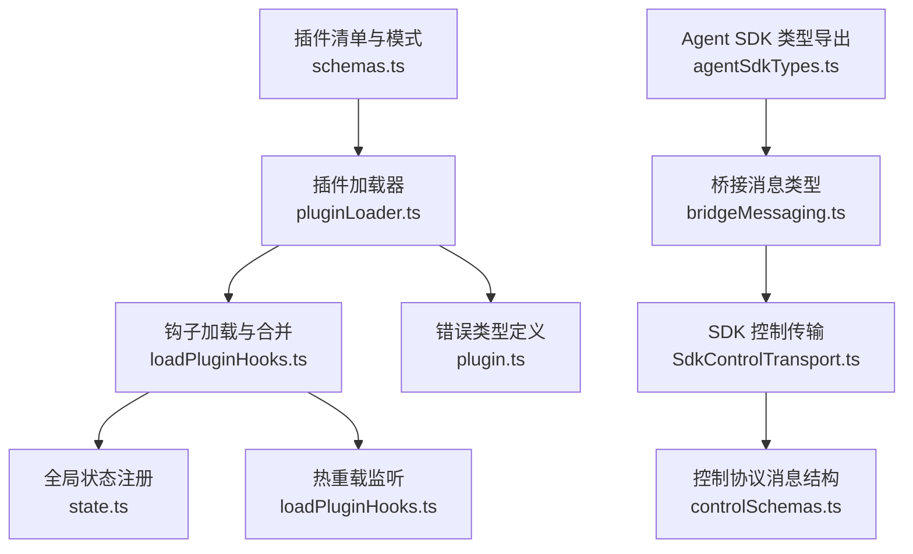
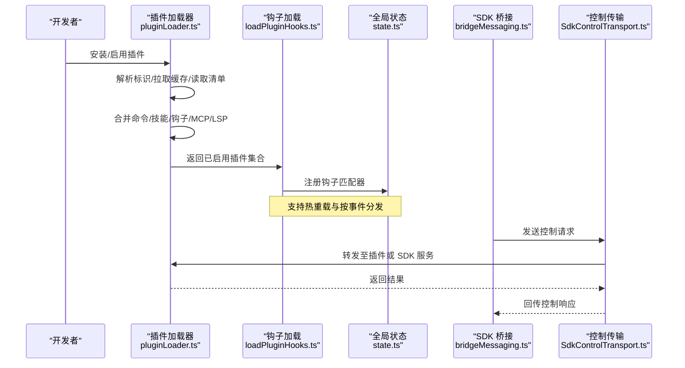
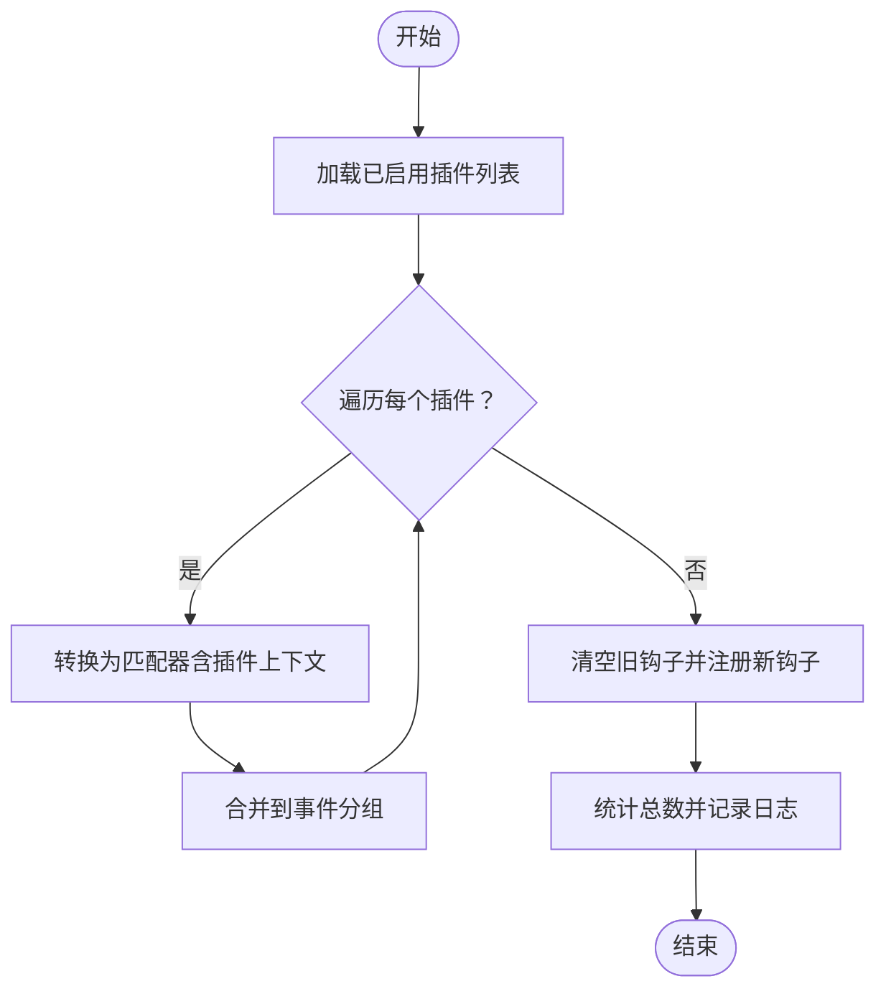
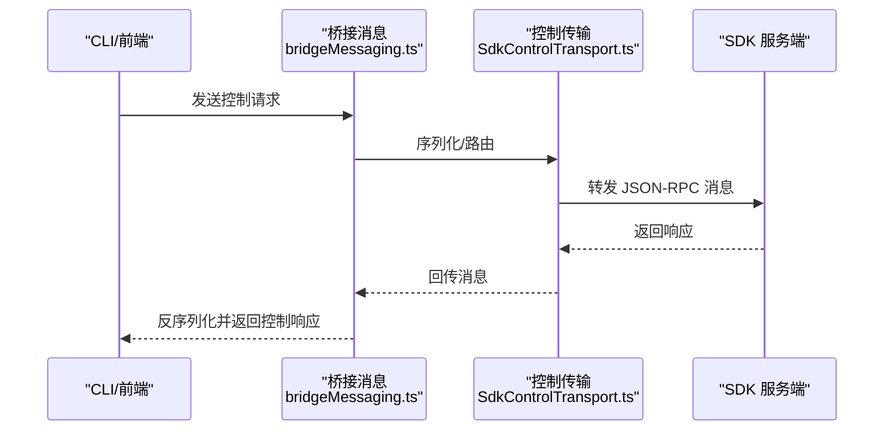
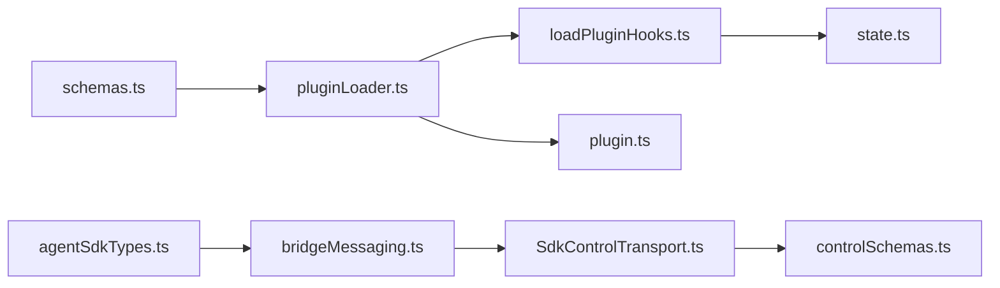

# 插件开发指南

<cite>
**本文引用的文件**
- [plugin.ts](file://src/types/plugin.ts)
- [loadPluginHooks.ts](file://src/utils/plugins/loadPluginHooks.ts)
- [pluginLoader.ts](file://src/utils/plugins/pluginLoader.ts)
- [schemas.ts](file://src/utils/plugins/schemas.ts)
- [agentSdkTypes.ts](file://src/entrypoints/agentSdkTypes.ts)
- [state.ts](file://src/bootstrap/state.ts)
- [bridgeMessaging.ts](file://src/bridge/bridgeMessaging.ts)
- [SdkControlTransport.ts](file://src/services/mcp/SdkControlTransport.ts)
- [controlSchemas.ts](file://src/entrypoints/sdk/controlSchemas.ts)
</cite>

## 目录
1. [简介](#简介)
2. [项目结构](#项目结构)
3. [核心组件](#核心组件)
4. [架构总览](#架构总览)
5. [详细组件分析](#详细组件分析)
6. [依赖关系分析](#依赖关系分析)
7. [性能考量](#性能考量)
8. [故障排查指南](#故障排查指南)
9. [结论](#结论)
10. [附录](#附录)

## 简介
本指南面向 free-code 插件开发者，系统讲解如何在现有代码库基础上构建、调试、打包与发布 Claude Code 插件。内容覆盖插件清单文件、入口点、配置选项、生命周期钩子、事件处理与异步操作支持；同时给出最佳实践（错误处理、性能优化、安全考虑）、与 SDK 的集成方式（控制模式与运行时类型），并提供从开发到发布的完整流程。

## 项目结构
Claude Code 的插件体系由“清单与模式校验”“加载与缓存”“钩子注册与热重载”“SDK 控制协议桥接”等模块组成。下图展示与插件开发相关的核心文件与职责：

图表来源
- [schemas.ts](file://src/utils/plugins/schemas.ts)
- [pluginLoader.ts](file://src/utils/plugins/pluginLoader.ts)
- [loadPluginHooks.ts](file://src/utils/plugins/loadPluginHooks.ts)
- [state.ts](file://src/bootstrap/state.ts)
- [plugin.ts](file://src/types/plugin.ts)
- [agentSdkTypes.ts](file://src/entrypoints/agentSdkTypes.ts)
- [bridgeMessaging.ts](file://src/bridge/bridgeMessaging.ts)
- [SdkControlTransport.ts](file://src/services/mcp/SdkControlTransport.ts)
- [controlSchemas.ts](file://src/entrypoints/sdk/controlSchemas.ts)

章节来源
- [pluginLoader.ts](file://src/utils/plugins/pluginLoader.ts)
- [schemas.ts](file://src/utils/plugins/schemas.ts)
- [loadPluginHooks.ts](file://src/utils/plugins/loadPluginHooks.ts)
- [state.ts](file://src/bootstrap/state.ts)
- [plugin.ts](file://src/types/plugin.ts)
- [agentSdkTypes.ts](file://src/entrypoints/agentSdkTypes.ts)
- [bridgeMessaging.ts](file://src/bridge/bridgeMessaging.ts)
- [SdkControlTransport.ts](file://src/services/mcp/SdkControlTransport.ts)
- [controlSchemas.ts](file://src/entrypoints/sdk/controlSchemas.ts)

## 核心组件
- 插件清单与模式校验：负责验证插件元数据、命令、技能、钩子、MCP/LSP 配置、用户配置等，确保安装与加载前的数据正确性。
- 插件加载器：解析插件标识、拉取/缓存、读取清单、合并组件（命令、技能、钩子、MCP/LSP）、处理依赖与错误收集。
- 钩子系统：将插件钩子转换为匹配器并注册到全局状态，支持按事件分发与热重载。
- 错误类型：统一的插件错误类型与消息映射，便于 UI 展示与日志定位。
- SDK 集成：通过桥接消息与控制传输实现与 SDK 的通信，支持控制请求/响应、环境变量更新、心跳等。

章节来源
- [plugin.ts](file://src/types/plugin.ts)
- [pluginLoader.ts](file://src/utils/plugins/pluginLoader.ts)
- [loadPluginHooks.ts](file://src/utils/plugins/loadPluginHooks.ts)
- [schemas.ts](file://src/utils/plugins/schemas.ts)
- [bridgeMessaging.ts](file://src/bridge/bridgeMessaging.ts)
- [SdkControlTransport.ts](file://src/services/mcp/SdkControlTransport.ts)
- [controlSchemas.ts](file://src/entrypoints/sdk/controlSchemas.ts)

## 架构总览
下图展示插件从“被发现/安装”到“注册钩子/执行”的端到端流程，以及与 SDK 的控制通道交互：

图表来源
- [pluginLoader.ts](file://src/utils/plugins/pluginLoader.ts)
- [loadPluginHooks.ts](file://src/utils/plugins/loadPluginHooks.ts)
- [state.ts](file://src/bootstrap/state.ts)
- [bridgeMessaging.ts](file://src/bridge/bridgeMessaging.ts)
- [SdkControlTransport.ts](file://src/services/mcp/SdkControlTransport.ts)

## 详细组件分析

### 插件清单与模式校验（schemas.ts）
- 清单元数据：名称、版本、描述、作者、主页、仓库、许可证、关键词、依赖等字段的校验规则。
- 钩子配置：hooks.json 的包装结构与事件映射校验，支持外部文件路径或内联对象。
- 命令与技能：命令源（文件或内联）与元数据映射格式校验。
- MCP/LSP：MCP 服务器配置、MCPB 文件路径、LSP 服务器配置的严格字段校验。
- 用户配置：声明可配置项（字符串/数字/布尔/目录/文件），含标题、描述、是否必填、默认值、敏感标记等。
- 市场商店：保留名与来源校验、自动更新策略、非 ASCII 名称阻断、路径与空格限制等。

章节来源
- [schemas.ts](file://src/utils/plugins/schemas.ts)

### 插件加载器（pluginLoader.ts）
- 插件发现与来源：优先市场商店插件，其次会话级插件（--plugin-dir）。
- 目录结构：标准清单文件、commands/agents/hooks 等目录约定。
- 加载流程要点：
  - 读取并校验清单
  - 合并 hooks：标准 hooks/hooks.json 与 manifest.hooks（内联/外部文件）
  - 组件合并：commands、agents、skills、output-styles、mcpServers、lspServers
  - 依赖解析与版本计算
  - 缓存与 ZIP 缓存路径管理
  - 错误收集与类型化错误映射
- 异步与并发：使用 memoize 缓存加载结果，避免重复 IO；对钩子加载采用原子替换以保证一致性。

章节来源
- [pluginLoader.ts](file://src/utils/plugins/pluginLoader.ts)

### 钩子系统（loadPluginHooks.ts + state.ts）
- 钩子事件枚举：PreToolUse、PostToolUse、PostToolUseFailure、PermissionDenied、Notification、UserPromptSubmit、SessionStart、SessionEnd、Stop、StopFailure、SubagentStart、SubagentStop、PreCompact、PostCompact、PermissionRequest、Setup、TeammateIdle、TaskCreated、TaskCompleted、Elicitation、ElicitationResult、ConfigChange、WorktreeCreate、WorktreeRemove、InstructionsLoaded、CwdChanged、FileChanged 等。
- 匹配器转换：将插件 hooksConfig 转换为带插件上下文的匹配器数组。
- 注册与替换：清空旧钩子后一次性注册新钩子，保证切换过程原子性。
- 热重载：基于设置变更检测，仅在影响插件的设置发生实际变化时触发缓存清理与重新加载。
- 全局状态：注册到 state.registeredHooks，按事件分发给回调或 SDK 回调。

图表来源
- [loadPluginHooks.ts](file://src/utils/plugins/loadPluginHooks.ts)
- [state.ts](file://src/bootstrap/state.ts)

章节来源
- [loadPluginHooks.ts](file://src/utils/plugins/loadPluginHooks.ts)
- [state.ts](file://src/bootstrap/state.ts)

### 错误类型与消息映射（plugin.ts）
- 错误类型覆盖路径不存在、Git 认证失败、网络错误、清单解析/校验失败、插件未找到、市场商店阻断、MCP/LSP 配置无效/启动失败/超时、依赖不满足、缓存缺失、通用错误等。
- 提供统一的消息映射函数，便于日志与 UI 展示。

章节来源
- [plugin.ts](file://src/types/plugin.ts)

### SDK 集成（agentSdkTypes.ts + bridgeMessaging.ts + SdkControlTransport.ts + controlSchemas.ts）
- 类型导出：SDK 控制请求/响应、核心与运行时类型、设置类型、工具类型等。
- 消息类型守卫：区分 control_request 与 control_response，确保桥接层类型安全。
- 控制传输：客户端与服务端传输封装，负责消息转发、连接关闭、回调回传。
- 控制协议消息结构：错误响应、取消请求、心跳、环境变量更新等消息结构。

图表来源
- [bridgeMessaging.ts](file://src/bridge/bridgeMessaging.ts)
- [SdkControlTransport.ts](file://src/services/mcp/SdkControlTransport.ts)
- [controlSchemas.ts](file://src/entrypoints/sdk/controlSchemas.ts)

章节来源
- [agentSdkTypes.ts](file://src/entrypoints/agentSdkTypes.ts)
- [bridgeMessaging.ts](file://src/bridge/bridgeMessaging.ts)
- [SdkControlTransport.ts](file://src/services/mcp/SdkControlTransport.ts)
- [controlSchemas.ts](file://src/entrypoints/sdk/controlSchemas.ts)

## 依赖关系分析
- 插件清单与模式校验为加载器与钩子系统提供强类型输入，确保后续流程的健壮性。
- 加载器输出“已启用插件集合”，钩子系统消费该集合进行匹配器转换与注册。
- 全局状态集中管理钩子匹配器，按事件分发；SDK 桥接与传输作为外部扩展通道参与控制流。
- 错误类型贯穿加载、合并、注册各阶段，形成统一的可观测与可诊断能力。

图表来源
- [schemas.ts](file://src/utils/plugins/schemas.ts)
- [pluginLoader.ts](file://src/utils/plugins/pluginLoader.ts)
- [loadPluginHooks.ts](file://src/utils/plugins/loadPluginHooks.ts)
- [state.ts](file://src/bootstrap/state.ts)
- [plugin.ts](file://src/types/plugin.ts)
- [agentSdkTypes.ts](file://src/entrypoints/agentSdkTypes.ts)
- [bridgeMessaging.ts](file://src/bridge/bridgeMessaging.ts)
- [SdkControlTransport.ts](file://src/services/mcp/SdkControlTransport.ts)
- [controlSchemas.ts](file://src/entrypoints/sdk/controlSchemas.ts)

章节来源
- [schemas.ts](file://src/utils/plugins/schemas.ts)
- [pluginLoader.ts](file://src/utils/plugins/pluginLoader.ts)
- [loadPluginHooks.ts](file://src/utils/plugins/loadPluginHooks.ts)
- [state.ts](file://src/bootstrap/state.ts)
- [plugin.ts](file://src/types/plugin.ts)
- [agentSdkTypes.ts](file://src/entrypoints/agentSdkTypes.ts)
- [bridgeMessaging.ts](file://src/bridge/bridgeMessaging.ts)
- [SdkControlTransport.ts](file://src/services/mcp/SdkControlTransport.ts)
- [controlSchemas.ts](file://src/entrypoints/sdk/controlSchemas.ts)

## 性能考量
- 缓存与去重：加载器与钩子加载均使用 memoize 缓存，避免重复 IO；钩子注册采用“清空+一次性注册”的原子交换，减少中间态开销。
- 热重载节流：基于稳定快照比较，仅在影响插件的设置实际变化时触发重载，降低不必要的全量刷新。
- 并发与顺序：钩子加载在获取启用插件列表后并行处理，但注册阶段保持原子性，确保一致性与可预测性。
- I/O 优化：ZIP 缓存与版本化缓存路径设计，减少磁盘扫描与路径拼接成本。

章节来源
- [pluginLoader.ts](file://src/utils/plugins/pluginLoader.ts)
- [loadPluginHooks.ts](file://src/utils/plugins/loadPluginHooks.ts)

## 故障排查指南
- 常见错误类型与定位
  - 清单解析/校验失败：检查清单字段与模式校验规则，确认路径与命名规范。
  - 钩子加载失败：确认 hooks.json 存在且结构符合模式；检查合并逻辑与重复文件。
  - 市场商店阻断：检查保留名与来源校验、策略设置与黑名单。
  - MCP/LSP 配置无效/启动失败/超时：核对命令、参数、初始化选项、工作区路径与超时设置。
  - 依赖不满足：确认依赖插件已启用且存在于已配置市场商店。
  - 缓存缺失：执行插件刷新命令，重建缓存。
- 日志与消息映射
  - 使用统一错误消息映射函数，结合日志输出快速定位问题根因。
- 调试建议
  - 开启调试日志，观察钩子注册数量与事件分发情况。
  - 在热重载场景下，确认设置快照比较逻辑是否触发重载。
  - 对 SDK 控制流，使用消息守卫与传输层回调验证消息往返。

章节来源
- [plugin.ts](file://src/types/plugin.ts)
- [pluginLoader.ts](file://src/utils/plugins/pluginLoader.ts)
- [loadPluginHooks.ts](file://src/utils/plugins/loadPluginHooks.ts)
- [bridgeMessaging.ts](file://src/bridge/bridgeMessaging.ts)
- [SdkControlTransport.ts](file://src/services/mcp/SdkControlTransport.ts)

## 结论
本指南基于现有代码库梳理了插件开发的关键路径：从清单与模式校验、加载与缓存、钩子注册与热重载，到 SDK 控制协议桥接。遵循本文档的结构与最佳实践，可高效构建稳定、可维护、可观测的插件，并与 Claude Code 生态无缝集成。

## 附录

### 插件清单文件（plugin.json）关键字段
- 元数据：name、version、description、author、homepage、repository、license、keywords、dependencies
- 组件声明：commands、agents、skills、outputStyles、hooks、mcpServers、lspServers、userConfig
- 依赖：以声明式方式指定必须启用的其他插件

章节来源
- [schemas.ts](file://src/utils/plugins/schemas.ts)

### 生命周期钩子与事件
- 事件集合：PreToolUse、PostToolUse、PostToolUseFailure、PermissionDenied、Notification、UserPromptSubmit、SessionStart、SessionEnd、Stop、StopFailure、SubagentStart、SubagentStop、PreCompact、PostCompact、PermissionRequest、Setup、TeammateIdle、TaskCreated、TaskCompleted、Elicitation、ElicitationResult、ConfigChange、WorktreeCreate、WorktreeRemove、InstructionsLoaded、CwdChanged、FileChanged
- 匹配器上下文：包含插件根路径、插件名、插件标识，便于事件回调中进行插件特定处理

章节来源
- [loadPluginHooks.ts](file://src/utils/plugins/loadPluginHooks.ts)
- [state.ts](file://src/bootstrap/state.ts)

### SDK 集成要点
- 控制请求/响应：通过桥接消息与传输层完成消息序列化/反序列化与回调回传
- 环境变量更新：支持运行时动态更新环境变量
- 心跳与取消：保持长连接与请求取消能力
- 类型安全：使用类型守卫与模式校验确保消息结构正确

章节来源
- [agentSdkTypes.ts](file://src/entrypoints/agentSdkTypes.ts)
- [bridgeMessaging.ts](file://src/bridge/bridgeMessaging.ts)
- [SdkControlTransport.ts](file://src/services/mcp/SdkControlTransport.ts)
- [controlSchemas.ts](file://src/entrypoints/sdk/controlSchemas.ts)

### 开发、调试与发布流程（建议）
- 开发
  - 创建标准目录结构与清单文件，编写 hooks.json 与组件文件
  - 使用模式校验确保清单与配置合法
- 调试
  - 启用调试日志，观察钩子注册与事件分发
  - 利用热重载功能在策略变更时自动重载钩子
  - 对 SDK 控制流，使用消息守卫与传输层回调验证消息往返
- 打包与发布
  - 构建 ZIP 缓存（如启用），生成版本化缓存路径
  - 遵循市场商店命名与来源规则，确保保留名与来源校验通过
  - 提供清晰的依赖声明与用户配置项，便于用户启用与配置

章节来源
- [pluginLoader.ts](file://src/utils/plugins/pluginLoader.ts)
- [schemas.ts](file://src/utils/plugins/schemas.ts)
- [loadPluginHooks.ts](file://src/utils/plugins/loadPluginHooks.ts)
- [bridgeMessaging.ts](file://src/bridge/bridgeMessaging.ts)
- [SdkControlTransport.ts](file://src/services/mcp/SdkControlTransport.ts)