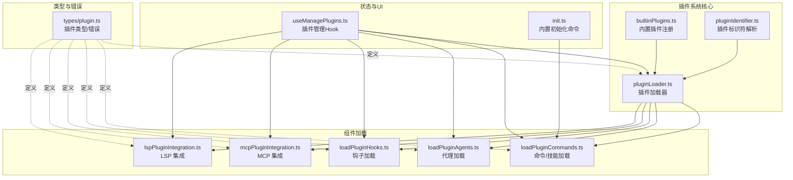
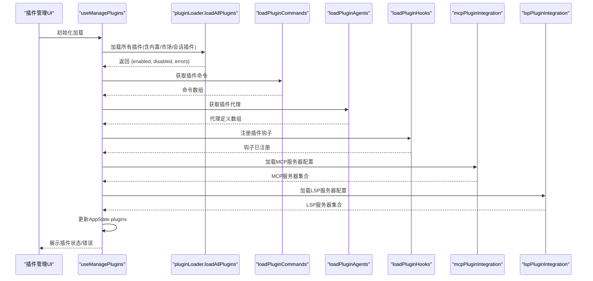
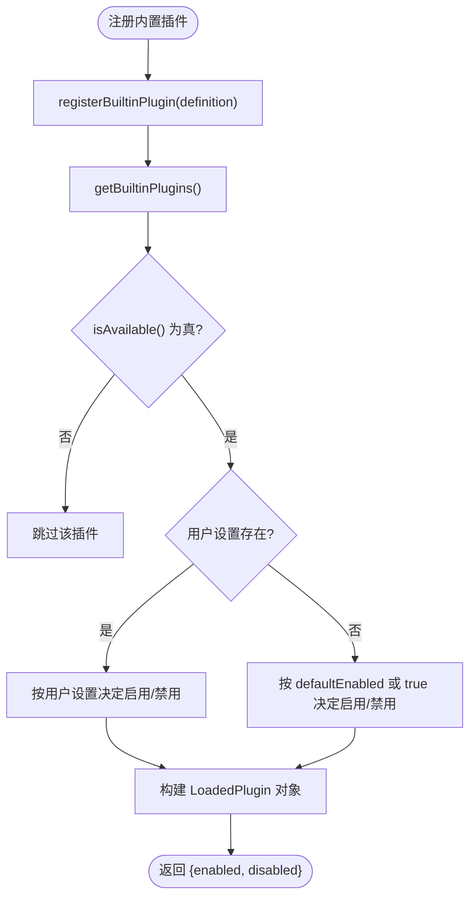
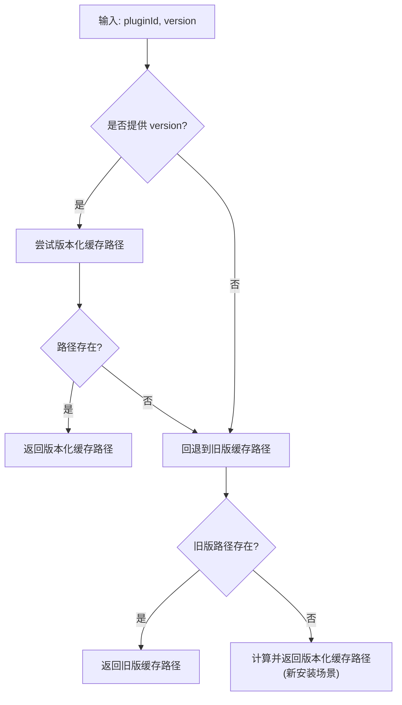
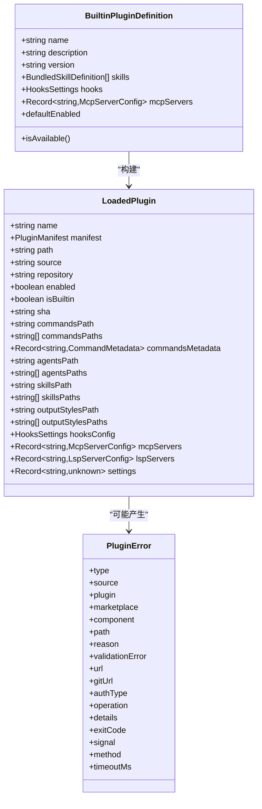

# 插件架构设计

<cite>
**本文档引用的文件**
- [builtinPlugins.ts](file://src/plugins/builtinPlugins.ts)
- [plugin.ts](file://src/types/plugin.ts)
- [useManagePlugins.ts](file://src/hooks/useManagePlugins.ts)
- [pluginLoader.ts](file://src/utils/plugins/pluginLoader.ts)
- [loadPluginCommands.ts](file://src/utils/plugins/loadPluginCommands.ts)
- [loadPluginAgents.ts](file://src/utils/plugins/loadPluginAgents.ts)
- [loadPluginHooks.ts](file://src/utils/plugins/loadPluginHooks.ts)
- [mcpPluginIntegration.ts](file://src/utils/plugins/mcpPluginIntegration.ts)
- [lspPluginIntegration.ts](file://src/utils/plugins/lspPluginIntegration.ts)
- [pluginIdentifier.ts](file://src/utils/plugins/pluginIdentifier.ts)
- [init.ts](file://src/commands/init.ts)
</cite>

## 目录
1. [简介](#简介)
2. [项目结构](#项目结构)
3. [核心组件](#核心组件)
4. [架构总览](#架构总览)
5. [详细组件分析](#详细组件分析)
6. [依赖关系分析](#依赖关系分析)
7. [性能考量](#性能考量)
8. [故障排查指南](#故障排查指南)
9. [结论](#结论)

## 简介
本文件系统性阐述 free-code 的插件架构设计，覆盖插件注册机制、加载流程、生命周期管理、插件定义接口、插件标识符格式、插件分类（内置插件 vs 市场插件）、与命令系统、工具系统、技能系统的集成方式，以及插件配置管理、启用/禁用机制与持久化存储策略。文档同时提供架构图与组件交互关系说明，帮助开发者快速理解与扩展插件体系。

## 项目结构
free-code 的插件系统围绕“插件发现—加载—验证—注册—运行时集成”展开，核心代码位于 src/utils/plugins 下，配合 src/plugins、src/hooks、src/types 等模块完成端到端能力。

**图表来源**
- [pluginLoader.ts](file://src/utils/plugins/pluginLoader.ts)
- [builtinPlugins.ts](file://src/plugins/builtinPlugins.ts)
- [pluginIdentifier.ts](file://src/utils/plugins/pluginIdentifier.ts)
- [loadPluginCommands.ts](file://src/utils/plugins/loadPluginCommands.ts)
- [loadPluginAgents.ts](file://src/utils/plugins/loadPluginAgents.ts)
- [loadPluginHooks.ts](file://src/utils/plugins/loadPluginHooks.ts)
- [mcpPluginIntegration.ts](file://src/utils/plugins/mcpPluginIntegration.ts)
- [lspPluginIntegration.ts](file://src/utils/plugins/lspPluginIntegration.ts)
- [useManagePlugins.ts](file://src/hooks/useManagePlugins.ts)
- [init.ts](file://src/commands/init.ts)
- [plugin.ts](file://src/types/plugin.ts)

**章节来源**
- [pluginLoader.ts](file://src/utils/plugins/pluginLoader.ts)
- [builtinPlugins.ts](file://src/plugins/builtinPlugins.ts)
- [pluginIdentifier.ts](file://src/utils/plugins/pluginIdentifier.ts)
- [loadPluginCommands.ts](file://src/utils/plugins/loadPluginCommands.ts)
- [loadPluginAgents.ts](file://src/utils/plugins/loadPluginAgents.ts)
- [loadPluginHooks.ts](file://src/utils/plugins/loadPluginHooks.ts)
- [mcpPluginIntegration.ts](file://src/utils/plugins/mcpPluginIntegration.ts)
- [lspPluginIntegration.ts](file://src/utils/plugins/lspPluginIntegration.ts)
- [useManagePlugins.ts](file://src/hooks/useManagePlugins.ts)
- [init.ts](file://src/commands/init.ts)
- [plugin.ts](file://src/types/plugin.ts)

## 核心组件
- 插件加载器：负责从市场/本地源发现、安装、缓存、校验与加载插件，统一产出 LoadedPlugin 结构。
- 内置插件注册：集中管理随 CLI 发布的内置插件，支持用户在 /plugin 界面启用/禁用。
- 组件加载器：分别处理命令/技能、代理、钩子、MCP/LSP 服务器的加载与环境变量解析。
- 插件管理 Hook：在应用启动与刷新时协调各组件加载，并维护 AppState.plugins 状态。
- 类型与错误：统一定义 LoadedPlugin、BuiltinPluginDefinition、PluginError 等类型，提供可读性强的错误消息映射。

**章节来源**
- [pluginLoader.ts](file://src/utils/plugins/pluginLoader.ts)
- [builtinPlugins.ts](file://src/plugins/builtinPlugins.ts)
- [loadPluginCommands.ts](file://src/utils/plugins/loadPluginCommands.ts)
- [loadPluginAgents.ts](file://src/utils/plugins/loadPluginAgents.ts)
- [loadPluginHooks.ts](file://src/utils/plugins/loadPluginHooks.ts)
- [mcpPluginIntegration.ts](file://src/utils/plugins/mcpPluginIntegration.ts)
- [lspPluginIntegration.ts](file://src/utils/plugins/lspPluginIntegration.ts)
- [useManagePlugins.ts](file://src/hooks/useManagePlugins.ts)
- [plugin.ts](file://src/types/plugin.ts)

## 架构总览
插件系统采用“声明式 + 运行时装配”的模式：
- 启动阶段：useManagePlugins 调用 loadAllPlugins 加载所有插件，随后分别加载命令、代理、钩子、MCP/LSP。
- 运行阶段：根据插件启用状态与配置，动态注入命令、代理、钩子回调、MCP/LSP 服务器。
- 刷新阶段：通过 /reload-plugins 触发 refreshActivePlugins，确保变更生效且保持一致性。

**图表来源**
- [useManagePlugins.ts](file://src/hooks/useManagePlugins.ts)
- [pluginLoader.ts](file://src/utils/plugins/pluginLoader.ts)
- [loadPluginCommands.ts](file://src/utils/plugins/loadPluginCommands.ts)
- [loadPluginAgents.ts](file://src/utils/plugins/loadPluginAgents.ts)
- [loadPluginHooks.ts](file://src/utils/plugins/loadPluginHooks.ts)
- [mcpPluginIntegration.ts](file://src/utils/plugins/mcpPluginIntegration.ts)
- [lspPluginIntegration.ts](file://src/utils/plugins/lspPluginIntegration.ts)

## 详细组件分析

### 插件注册与内置插件管理
- 内置插件注册：通过 registerBuiltinPlugin 在启动时注册；getBuiltinPlugins 将内置插件转换为 LoadedPlugin，结合用户设置与默认值决定启用状态。
- 标识符格式：内置插件使用 {name}@builtin；市场插件使用 {name}@{marketplace}。
- 与命令系统集成：内置插件的技能通过 skillDefinitionToCommand 转换为 Command，供 /help、/clear 等命令工具识别与执行。

**图表来源**
- [builtinPlugins.ts](file://src/plugins/builtinPlugins.ts)

**章节来源**
- [builtinPlugins.ts](file://src/plugins/builtinPlugins.ts)
- [plugin.ts](file://src/types/plugin.ts)

### 插件标识符与作用域
- 解析与构建：parsePluginIdentifier 与 buildPluginId 支持 name 与 name@marketplace 的互转。
- 作用域映射：SETTING_SOURCE_TO_SCOPE 将设置来源映射到插件安装作用域（user/project/local/managed/flag），其中 flag 仅用于会话级插件不持久化。
- 官方市场检测：isOfficialMarketplaceName 用于区分官方与第三方市场，便于遥测与日志脱敏。

**章节来源**
- [pluginIdentifier.ts](file://src/utils/plugins/pluginIdentifier.ts)
- [plugin.ts](file://src/types/plugin.ts)

### 插件加载器与缓存策略
- 发现与安装：支持从市场/本地目录/种子缓存/ZIP 缓存等多种来源；对远程插件进行版本化缓存，避免重复下载。
- 版本路径解析：getVersionedCachePath/getVersionedZipCachePath 提供带版本的缓存路径；probeSeedCache/probeSeedCacheAnyVersion 支持多种子目录命中。
- 兼容性：getLegacyCachePath 保留旧版非版本化缓存路径，保证迁移平滑。
- 错误收集：统一记录路径不存在、网络错误、清单解析/校验失败等错误，便于 UI 诊断。

**图表来源**
- [pluginLoader.ts](file://src/utils/plugins/pluginLoader.ts)

**章节来源**
- [pluginLoader.ts](file://src/utils/plugins/pluginLoader.ts)

### 命令/技能加载与模板替换
- 目录扫描：walkPluginMarkdown 递归扫描 commands/ 与 skills/ 子目录，支持命名空间前缀与技能目录合并。
- 模板替换：支持 ${CLAUDE_PLUGIN_ROOT}、${CLAUDE_PLUGIN_DATA}、${CLAUDE_SESSION_ID}、${user_config.X} 等变量替换；支持 shell 执行与参数注入。
- 输出：生成 Command 对象，包含描述、工具限制、模型选择、努力等级、可见性等元数据。

**章节来源**
- [loadPluginCommands.ts](file://src/utils/plugins/loadPluginCommands.ts)
- [plugin.ts](file://src/types/plugin.ts)

### 代理加载与内存集成
- 代理定义：从 agents/ 目录加载 .md 文件，解析 frontmatter 中的工具、技能、颜色、模型、记忆范围、隔离模式、最大轮次等字段。
- 记忆集成：当自动记忆开启时，自动注入文件写入/编辑/读取工具以支持代理记忆。
- 安全约束：禁止在插件代理中直接声明权限模式、钩子、MCP 服务器等高风险字段，需在用户目录中显式配置。

**章节来源**
- [loadPluginAgents.ts](file://src/utils/plugins/loadPluginAgents.ts)
- [plugin.ts](file://src/types/plugin.ts)

### 钩子加载与热重载
- 匹配器转换：convertPluginHooksToMatchers 将插件 hooksConfig 转为事件驱动的匹配器列表，并附带插件上下文。
- 注册与清理：loadPluginHooks 清理旧钩子后原子性注册新钩子；pruneRemovedPluginHooks 在卸载/禁用时移除不再启用的钩子。
- 热重载：setupPluginHookHotReload 基于设置快照比较，仅在影响插件的策略设置变化时触发重载，避免缓存污染。

**章节来源**
- [loadPluginHooks.ts](file://src/utils/plugins/loadPluginHooks.ts)
- [plugin.ts](file://src/types/plugin.ts)

### MCP 服务器集成
- 多源加载：支持 .mcp.json、manifest.mcpServers、MCPB 文件；MCPB 自动下载/解压/转换为 MCP 配置。
- 用户配置：manifest.userConfig 与 channel.userConfig 合并为用户配置，支持 ${user_config.X} 替换。
- 环境变量解析：resolvePluginMcpEnvironment 优先替换插件变量与用户配置，再扩展通用环境变量，记录缺失变量以便错误上报。
- 作用域与缓存：addPluginScopeToServers 为服务器名加前缀避免冲突；缓存未解析配置以便后续复用。

**章节来源**
- [mcpPluginIntegration.ts](file://src/utils/plugins/mcpPluginIntegration.ts)
- [plugin.ts](file://src/types/plugin.ts)

### LSP 服务器集成
- 多源加载：支持 .lsp.json 与 manifest.lspServers；manifest 支持字符串路径（相对插件根目录）与内联配置。
- 安全校验：validatePathWithinPlugin 防止路径穿越攻击；Zod 校验确保配置结构正确。
- 环境变量解析：resolvePluginLspEnvironment 与 MCP 类似，支持插件变量、用户配置与通用环境变量替换。
- 作用域与缓存：addPluginScopeToLspServers 为服务器名加前缀；缓存未解析配置。

**章节来源**
- [lspPluginIntegration.ts](file://src/utils/plugins/lspPluginIntegration.ts)
- [plugin.ts](file://src/types/plugin.ts)

### 插件管理 Hook 与生命周期
- 初始加载：useManagePlugins 在挂载时调用 loadAllPlugins，执行去列装、标记插件、加载命令/代理/钩子/MCP/LSP，并更新 AppState.plugins。
- 错误聚合：将各组件加载错误合并到 AppState.plugins.errors，保留 LSP 非插件错误。
- 刷新机制：detectAndUninstallDelistedPlugins 与 flagged 插件通知；needsRefresh 触发提示用户执行 /reload-plugins。
- 统计指标：统计启用/禁用数量、内联/市场插件数量、错误数量、技能/代理/钩子/MCP/LSP 数量等。

**章节来源**
- [useManagePlugins.ts](file://src/hooks/useManagePlugins.ts)
- [plugin.ts](file://src/types/plugin.ts)

### 与命令系统、工具系统、技能系统的集成
- 命令系统：插件命令通过 loadPluginCommands 生成 Command，参与命令注册与执行；内置插件技能通过 skillDefinitionToCommand 转换为 Command，纳入技能工具列表。
- 工具系统：命令 frontmatter 中的 allowed-tools 与 disallowed-tools 控制可用工具集；工具权限上下文在 getPromptForCommand 中动态注入。
- 技能系统：插件 skills/ 目录中的 SKILL.md 被识别为技能，支持参数注入与 shell 执行；内置插件技能通过内置命令源标识，便于统计与日志。

**章节来源**
- [loadPluginCommands.ts](file://src/utils/plugins/loadPluginCommands.ts)
- [builtinPlugins.ts](file://src/plugins/builtinPlugins.ts)
- [init.ts](file://src/commands/init.ts)

## 依赖关系分析

**图表来源**
- [plugin.ts](file://src/types/plugin.ts)
- [builtinPlugins.ts](file://src/plugins/builtinPlugins.ts)

**章节来源**
- [plugin.ts](file://src/types/plugin.ts)
- [builtinPlugins.ts](file://src/plugins/builtinPlugins.ts)

## 性能考量
- 并行加载：命令、代理、MCP/LSP 等组件加载均采用 Promise.all 并行处理，显著降低冷启动时间。
- 缓存策略：版本化缓存与 ZIP 缓存减少重复下载与解压；memoize 缓存命令/代理/钩子加载结果；插件缓存独立管理，支持按需清理。
- 路径安全：严格校验与限制插件目录内的文件访问，避免路径穿越与无效 IO。
- 错误短路：对单个组件加载失败进行局部捕获与错误聚合，不影响其他组件加载。

## 故障排查指南
- 常见错误类型：路径不存在、网络错误、清单解析/校验失败、MCP/LSP 配置无效、钩子加载失败、依赖不满足、插件缓存缺失等。
- 错误消息映射：getPluginErrorMessage 将 PluginError 转换为可读提示，便于 UI 展示与日志定位。
- 诊断入口：Doctor UI 可查看聚合错误；/reload-plugins 刷新后重新加载受影响组件；检查 AppState.plugins.errors 与日志输出。
- 策略设置热重载：若企业策略变更导致市场受限或允许列表变化，setupPluginHookHotReload 会在设置变化时触发钩子重载，避免缓存污染。

**章节来源**
- [plugin.ts](file://src/types/plugin.ts)
- [useManagePlugins.ts](file://src/hooks/useManagePlugins.ts)
- [loadPluginHooks.ts](file://src/utils/plugins/loadPluginHooks.ts)

## 结论
free-code 的插件架构以“类型安全 + 声明式 + 运行时装配”为核心，通过统一的加载器与组件加载器实现内置插件与市场插件的一致体验；借助 Hook 与 AppState 的协作，实现插件生命周期的可控管理与热重载支持。该设计在保证安全性的同时，提供了良好的扩展性与可观测性，适合团队与个人持续演进插件生态。