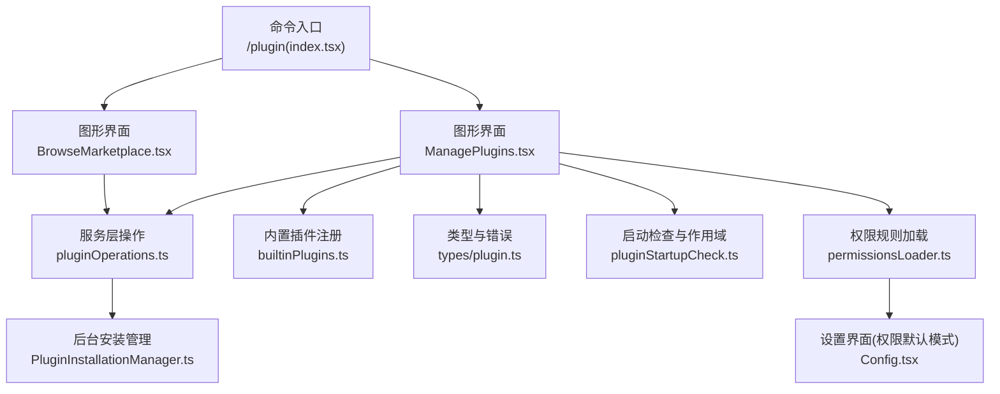
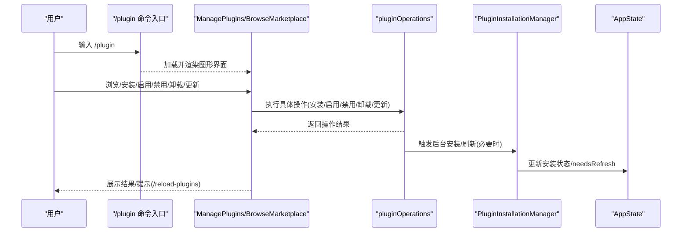
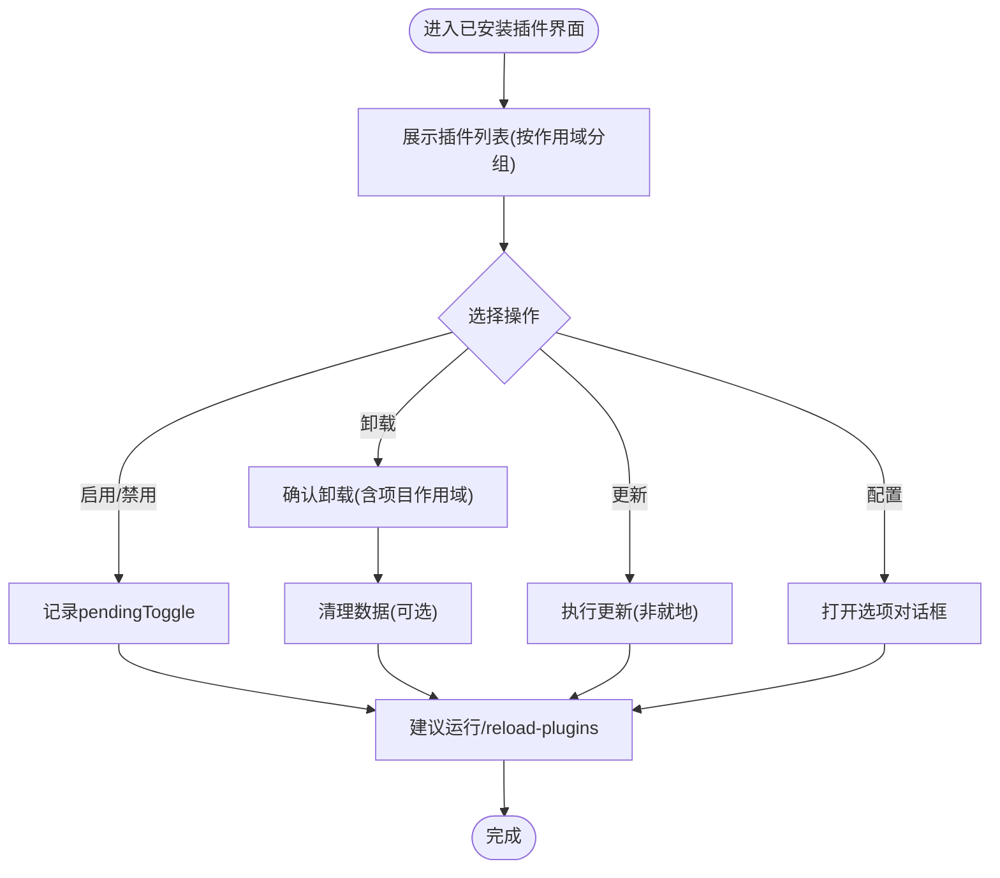
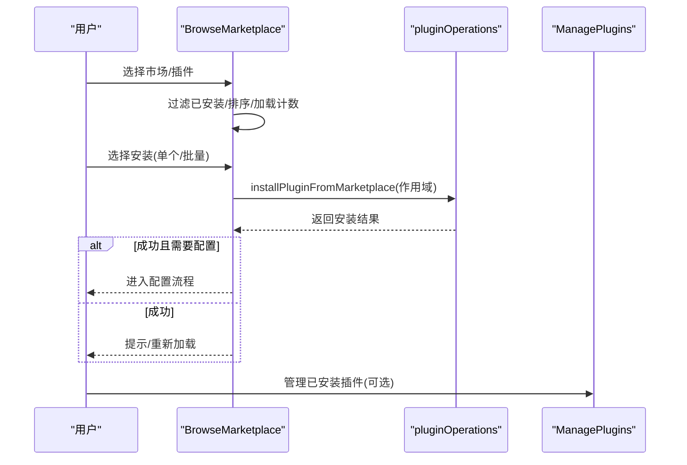
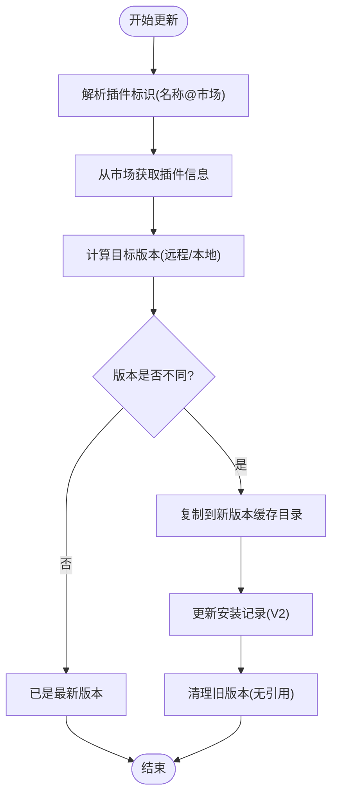
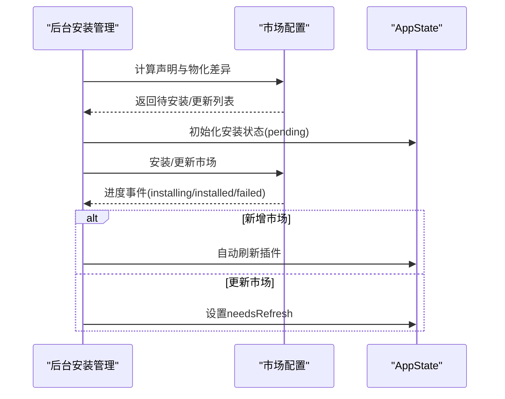
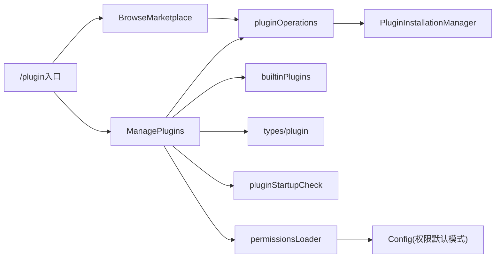

# 插件管理操作

<cite>
**本文引用的文件**
- [src/commands/plugin/index.tsx](file://src/commands/plugin/index.tsx)
- [src/commands/plugin/ManagePlugins.tsx](file://src/commands/plugin/ManagePlugins.tsx)
- [src/commands/plugin/BrowseMarketplace.tsx](file://src/commands/plugin/BrowseMarketplace.tsx)
- [src/services/plugins/pluginOperations.ts](file://src/services/plugins/pluginOperations.ts)
- [src/services/plugins/PluginInstallationManager.ts](file://src/services/plugins/PluginInstallationManager.ts)
- [src/plugins/builtinPlugins.ts](file://src/plugins/builtinPlugins.ts)
- [src/types/plugin.ts](file://src/types/plugin.ts)
- [src/utils/plugins/pluginStartupCheck.ts](file://src/utils/plugins/pluginStartupCheck.ts)
- [src/utils/permissions/permissionsLoader.ts](file://src/utils/permissions/permissionsLoader.ts)
- [src/components/Settings/Config.tsx](file://src/components/Settings/Config.tsx)
</cite>

## 目录
1. [简介](#简介)
2. [项目结构](#项目结构)
3. [核心组件](#核心组件)
4. [架构总览](#架构总览)
5. [详细组件分析](#详细组件分析)
6. [依赖关系分析](#依赖关系分析)
7. [性能考量](#性能考量)
8. [故障排除指南](#故障排除指南)
9. [结论](#结论)
10. [附录](#附录)

## 简介
本文件系统性阐述 free-code 中通过 /plugin 命令进行插件管理的完整流程与实现细节，覆盖安装、启用/禁用、卸载、更新等操作；介绍插件市场（Marketplace）的浏览与安装；解释自动更新机制与版本管理策略；提供插件配置管理（用户设置、权限配置、个性化选项）说明；并给出故障排除与常见问题解决方案，以及命令行与图形界面的操作示例。

## 项目结构
围绕 /plugin 命令的插件管理由“命令入口 + 图形界面 + 服务层 + 类型与工具”构成：
- 命令入口：定义 /plugin 命令及其别名，立即加载 JSX 实现。
- 图形界面：ManagePlugins.tsx 提供已安装插件列表、详情、启用/禁用、卸载、更新、MCP 配置、选项配置等交互。
- 插件市场：BrowseMarketplace.tsx 提供市场选择、插件列表、安装、跳转主页/GitHub 等。
- 服务层：pluginOperations.ts 提供安装、启用/禁用、卸载、更新等操作；PluginInstallationManager.ts 负责后台自动安装与刷新。
- 类型与工具：types/plugin.ts 定义 LoadedPlugin、PluginError 等类型；builtinPlugins.ts 管理内置插件注册与状态；pluginStartupCheck.ts 处理启动时的启用优先级；permissionsLoader.ts/Config.tsx 管理权限默认模式与来源。

图表来源
- [src/commands/plugin/index.tsx:1-11](file://src/commands/plugin/index.tsx#L1-L11)
- [src/commands/plugin/ManagePlugins.tsx:1-120](file://src/commands/plugin/ManagePlugins.tsx#L1-L120)
- [src/commands/plugin/BrowseMarketplace.tsx:1-120](file://src/commands/plugin/BrowseMarketplace.tsx#L1-L120)
- [src/services/plugins/pluginOperations.ts:808-847](file://src/services/plugins/pluginOperations.ts#L808-L847)
- [src/services/plugins/PluginInstallationManager.ts:60-185](file://src/services/plugins/PluginInstallationManager.ts#L60-L185)
- [src/plugins/builtinPlugins.ts:1-160](file://src/plugins/builtinPlugins.ts#L1-L160)
- [src/types/plugin.ts:48-100](file://src/types/plugin.ts#L48-L100)
- [src/utils/plugins/pluginStartupCheck.ts:99-134](file://src/utils/plugins/pluginStartupCheck.ts#L99-L134)
- [src/utils/permissions/permissionsLoader.ts:129-177](file://src/utils/permissions/permissionsLoader.ts#L129-L177)
- [src/components/Settings/Config.tsx:508-521](file://src/components/Settings/Config.tsx#L508-L521)

章节来源
- [src/commands/plugin/index.tsx:1-11](file://src/commands/plugin/index.tsx#L1-L11)

## 核心组件
- 命令入口与别名：/plugin、/plugins、/marketplace，立即加载 JSX 实现，便于快速进入图形化管理界面。
- 已安装插件管理（ManagePlugins.tsx）
  - 列表与筛选：支持按名称/描述搜索、分作用域展示（项目/本地/用户/企业/托管/内置）、失败插件与被标记插件提示。
  - 操作：启用/禁用、卸载、更新、查看组件、MCP 服务器详情与工具列表、配置选项。
  - 与 AppState 同步：记录 pendingToggle/pendingUpdate 状态，支持回退与结果提示。
- 插件市场浏览（BrowseMarketplace.tsx）
  - 市场选择：支持多市场聚合，自动排序与警告提示。
  - 插件列表：按流行度或字母序排列，显示安装计数、标签、版本等。
  - 安装：单个/批量安装，支持用户/项目/本地三种安装作用域；安装后可进入配置流程。
- 服务层操作（pluginOperations.ts）
  - 安装/启用/禁用/卸载/更新：封装对 V2 安装记录与缓存的变更，返回统一结果。
  - 更新策略：非就地更新，先下载/解析版本，再写入新目录并更新安装记录，旧版本清理。
- 后台安装与刷新（PluginInstallationManager.ts）
  - 自动安装声明的市场源；在新市场安装后自动刷新插件；更新后提示 /reload-plugins。
- 内置插件（builtinPlugins.ts）
  - 注册与查询；根据用户设置与默认值生成 LoadedPlugin；区分 @builtin 标识。
- 类型与错误（types/plugin.ts）
  - LoadedPlugin、PluginError 及其消息格式化函数，覆盖网络、Git、清单、MCP/LSP、策略等错误场景。
- 启动检查与作用域（pluginStartupCheck.ts）
  - 解析多来源设置（策略/用户/项目/本地/标志），合并启用状态，内置插件特殊处理。
- 权限与设置（permissionsLoader.ts、Config.tsx）
  - 权限规则来源与删除；设置界面中权限默认模式转换与保存。

章节来源
- [src/commands/plugin/ManagePlugins.tsx:397-800](file://src/commands/plugin/ManagePlugins.tsx#L397-L800)
- [src/commands/plugin/BrowseMarketplace.tsx:49-243](file://src/commands/plugin/BrowseMarketplace.tsx#L49-L243)
- [src/services/plugins/pluginOperations.ts:808-847](file://src/services/plugins/pluginOperations.ts#L808-L847)
- [src/services/plugins/PluginInstallationManager.ts:60-185](file://src/services/plugins/PluginInstallationManager.ts#L60-L185)
- [src/plugins/builtinPlugins.ts:18-102](file://src/plugins/builtinPlugins.ts#L18-L102)
- [src/types/plugin.ts:101-289](file://src/types/plugin.ts#L101-L289)
- [src/utils/plugins/pluginStartupCheck.ts:99-134](file://src/utils/plugins/pluginStartupCheck.ts#L99-L134)
- [src/utils/permissions/permissionsLoader.ts:129-177](file://src/utils/permissions/permissionsLoader.ts#L129-L177)
- [src/components/Settings/Config.tsx:508-521](file://src/components/Settings/Config.tsx#L508-L521)

## 架构总览
下图展示从命令入口到图形界面、服务层与后台安装的整体调用链路。

图表来源
- [src/commands/plugin/index.tsx:1-11](file://src/commands/plugin/index.tsx#L1-L11)
- [src/commands/plugin/ManagePlugins.tsx:405-500](file://src/commands/plugin/ManagePlugins.tsx#L405-L500)
- [src/commands/plugin/BrowseMarketplace.tsx:313-368](file://src/commands/plugin/BrowseMarketplace.tsx#L313-L368)
- [src/services/plugins/pluginOperations.ts:808-847](file://src/services/plugins/pluginOperations.ts#L808-L847)
- [src/services/plugins/PluginInstallationManager.ts:60-185](file://src/services/plugins/PluginInstallationManager.ts#L60-L185)

## 详细组件分析

### /plugin 命令入口与别名
- 定义 type: 'local-jsx'，立即加载 JSX 实现，提供 /plugin、/plugins、/marketplace 三个别名，便于快速进入插件管理与市场浏览。

章节来源
- [src/commands/plugin/index.tsx:1-11](file://src/commands/plugin/index.tsx#L1-L11)

### 已安装插件管理（ManagePlugins.tsx）
- 视图与状态
  - 支持插件列表、详情、配置、失败插件、MCP 详情/工具列表等视图切换。
  - 搜索模式与终端焦点控制，ESC 返回上一级视图。
- 统一项构建
  - 将插件与其子 MCP 服务器组合展示，按作用域排序，内置插件以用户态显示。
  - 失败插件与被标记插件单独分组，便于定位问题。
- 操作流程
  - 启用/禁用：记录 pendingToggle，等待 /reload-plugins 应用。
  - 卸载：支持项目作用域确认与数据清理大小提示。
  - 更新：远程插件走非就地更新流程，本地插件提示无法远程更新。
  - 配置：支持进入选项对话框，保存后建议运行 /reload-plugins 生效。
- MCP 集成
  - 展示 MCP 客户端连接状态，支持启用/禁用与工具查看。

图表来源
- [src/commands/plugin/ManagePlugins.tsx:405-500](file://src/commands/plugin/ManagePlugins.tsx#L405-L500)
- [src/commands/plugin/ManagePlugins.tsx:1074-1101](file://src/commands/plugin/ManagePlugins.tsx#L1074-L1101)
- [src/commands/plugin/ManagePlugins.tsx:1660-1673](file://src/commands/plugin/ManagePlugins.tsx#L1660-L1673)

章节来源
- [src/commands/plugin/ManagePlugins.tsx:397-800](file://src/commands/plugin/ManagePlugins.tsx#L397-L800)
- [src/commands/plugin/ManagePlugins.tsx:1074-1101](file://src/commands/plugin/ManagePlugins.tsx#L1074-L1101)
- [src/commands/plugin/ManagePlugins.tsx:1660-1673](file://src/commands/plugin/ManagePlugins.tsx#L1660-L1673)

### 插件市场浏览（BrowseMarketplace.tsx）
- 市场选择与插件列表
  - 自动加载已配置市场，过滤已安装插件，按流行度或字母序排序。
  - 显示安装计数、标签、版本、作者等元信息。
- 安装流程
  - 支持单个安装（用户/项目/本地作用域）与批量安装。
  - 安装后可进入配置流程或直接提示 /reload-plugins。
- 详情与信任提示
  - 展示将要安装的组件概要；对远程插件提示组件摘要不可用，需安装后发现。
  - 安装前显示信任警告与菜单选项（主页/GitHub/返回）。

图表来源
- [src/commands/plugin/BrowseMarketplace.tsx:245-311](file://src/commands/plugin/BrowseMarketplace.tsx#L245-L311)
- [src/commands/plugin/BrowseMarketplace.tsx:313-368](file://src/commands/plugin/BrowseMarketplace.tsx#L313-L368)
- [src/commands/plugin/BrowseMarketplace.tsx:370-402](file://src/commands/plugin/BrowseMarketplace.tsx#L370-L402)

章节来源
- [src/commands/plugin/BrowseMarketplace.tsx:49-243](file://src/commands/plugin/BrowseMarketplace.tsx#L49-L243)
- [src/commands/plugin/BrowseMarketplace.tsx:245-311](file://src/commands/plugin/BrowseMarketplace.tsx#L245-L311)
- [src/commands/plugin/BrowseMarketplace.tsx:313-368](file://src/commands/plugin/BrowseMarketplace.tsx#L313-L368)

### 服务层操作（pluginOperations.ts）
- 更新策略（非就地更新）
  - 获取市场插件信息，远程插件下载至临时目录计算版本，本地插件从市场源计算版本。
  - 若版本不同，复制到带版本号的新缓存目录，更新安装记录（内存未变更，需重启生效）。
  - 清理不再被任何安装引用的旧版本目录。
- 其他操作
  - 安装/启用/禁用/卸载均返回统一结构，包含成功与否、消息与上下文信息。

图表来源
- [src/services/plugins/pluginOperations.ts:814-847](file://src/services/plugins/pluginOperations.ts#L814-L847)

章节来源
- [src/services/plugins/pluginOperations.ts:808-847](file://src/services/plugins/pluginOperations.ts#L808-L847)

### 后台安装与刷新（PluginInstallationManager.ts）
- 背景安装
  - 计算声明市场与已物化市场的差异，初始化 AppState 的安装状态。
  - 对缺失或源变更的市场执行安装，映射进度事件到 UI。
- 新市场安装后的自动刷新
  - 清理缓存并自动刷新插件，修复首次缓存加载导致的“插件未找到”问题。
- 市场更新后的提示
  - 仅更新不新增时，设置 needsRefresh 并提示用户运行 /reload-plugins。

图表来源
- [src/services/plugins/PluginInstallationManager.ts:60-185](file://src/services/plugins/PluginInstallationManager.ts#L60-L185)

章节来源
- [src/services/plugins/PluginInstallationManager.ts:60-185](file://src/services/plugins/PluginInstallationManager.ts#L60-L185)

### 内置插件（builtinPlugins.ts）
- 注册与查询
  - registerBuiltinPlugin 注册内置插件；getBuiltinPluginDefinition 查询定义。
- 状态生成
  - getBuiltinPlugins 根据用户设置与默认值生成 LoadedPlugin，isBuiltin 标记用于 UI 区分。
- 格式约定
  - 内置插件 ID 使用 {name}@builtin，与市场插件区分。

章节来源
- [src/plugins/builtinPlugins.ts:18-102](file://src/plugins/builtinPlugins.ts#L18-L102)

### 类型与错误（types/plugin.ts）
- 数据模型
  - LoadedPlugin：包含 manifest、路径、来源、仓库、启用状态、组件路径、MCP/LSP 配置、设置等。
  - PluginError：覆盖路径、Git、网络、清单、市场、MCP/LSP、策略、依赖等错误类型。
- 错误消息格式化
  - getPluginErrorMessage 将错误类型映射为用户可读消息，便于 UI 展示与日志记录。

章节来源
- [src/types/plugin.ts:48-100](file://src/types/plugin.ts#L48-L100)
- [src/types/plugin.ts:101-289](file://src/types/plugin.ts#L101-L289)
- [src/types/plugin.ts:295-363](file://src/types/plugin.ts#L295-L363)

### 启动检查与作用域（pluginStartupCheck.ts）
- 启用优先级
  - 顺序处理策略/用户/项目/本地/标志设置源，后者覆盖前者；内置插件特殊处理。
- 添加目录优先
  - --add-dir 目录优先级最低，可被标准来源覆盖。

章节来源
- [src/utils/plugins/pluginStartupCheck.ts:99-134](file://src/utils/plugins/pluginStartupCheck.ts#L99-L134)

### 权限与设置（permissionsLoader.ts、Config.tsx）
- 权限规则来源
  - getPermissionRulesForSource 从指定来源加载规则；支持删除规则（仅编辑型来源）。
- 设置界面
  - Config.tsx 中权限默认模式转换与保存，确保内部模式与外部模式一致。

章节来源
- [src/utils/permissions/permissionsLoader.ts:129-177](file://src/utils/permissions/permissionsLoader.ts#L129-L177)
- [src/components/Settings/Config.tsx:508-521](file://src/components/Settings/Config.tsx#L508-L521)

## 依赖关系分析
- 命令入口依赖图形界面模块；图形界面依赖服务层与工具模块；服务层依赖后台安装管理与市场配置；类型与工具贯穿各层。
- 关键耦合点
  - ManagePlugins 与 pluginOperations：操作结果驱动 UI 状态与提示。
  - BrowseMarketplace 与 pluginOperations：安装流程与配置流程衔接。
  - PluginInstallationManager 与 AppState：后台安装状态与刷新通知。
  - builtinPlugins 与 ManagePlugins：内置插件 UI 与状态展示。
  - pluginStartupCheck 与 ManagePlugins：作用域与启用优先级影响 UI 展示。

图表来源
- [src/commands/plugin/index.tsx:1-11](file://src/commands/plugin/index.tsx#L1-L11)
- [src/commands/plugin/ManagePlugins.tsx:1-120](file://src/commands/plugin/ManagePlugins.tsx#L1-L120)
- [src/commands/plugin/BrowseMarketplace.tsx:1-120](file://src/commands/plugin/BrowseMarketplace.tsx#L1-L120)
- [src/services/plugins/pluginOperations.ts:808-847](file://src/services/plugins/pluginOperations.ts#L808-L847)
- [src/services/plugins/PluginInstallationManager.ts:60-185](file://src/services/plugins/PluginInstallationManager.ts#L60-L185)
- [src/plugins/builtinPlugins.ts:18-102](file://src/plugins/builtinPlugins.ts#L18-L102)
- [src/types/plugin.ts:48-100](file://src/types/plugin.ts#L48-L100)
- [src/utils/plugins/pluginStartupCheck.ts:99-134](file://src/utils/plugins/pluginStartupCheck.ts#L99-L134)
- [src/utils/permissions/permissionsLoader.ts:129-177](file://src/utils/permissions/permissionsLoader.ts#L129-L177)
- [src/components/Settings/Config.tsx:508-521](file://src/components/Settings/Config.tsx#L508-L521)

## 性能考量
- 后台安装与刷新
  - 仅在新增市场时自动刷新插件，避免频繁全量刷新；更新时不强制刷新，减少阻塞。
- 缓存与增量更新
  - 市场克隆与插件加载采用缓存与差异比较，降低网络与磁盘 IO。
- UI 响应
  - 分页与虚拟滚动提升大列表渲染性能；仅在必要时触发重渲染（如搜索、视图切换）。

## 故障排除指南
- 插件未找到/加载失败
  - 检查市场是否可用、网络是否正常；查看 AppState 中的 pluginErrors，结合 getPluginErrorMessage 获取详细原因。
- 无法远程更新
  - 本地插件提示“无法远程更新”，需修改源地址；远程插件遵循非就地更新策略。
- 市场被策略阻止
  - 检查 isPluginBlockedByPolicy，确认企业策略限制；必要时调整策略或来源。
- 需要手动刷新
  - 后台仅更新但未新增市场时，AppState.needsRefresh 为真，需运行 /reload-plugins。
- 配置保存失败
  - ManagePlugins 的配置保存异常会回退到“已启用但跳过配置”的提示，建议重新进入配置流程或检查权限。

章节来源
- [src/types/plugin.ts:295-363](file://src/types/plugin.ts#L295-L363)
- [src/commands/plugin/ManagePlugins.tsx:376-383](file://src/commands/plugin/ManagePlugins.tsx#L376-L383)
- [src/services/plugins/PluginInstallationManager.ts:166-180](file://src/services/plugins/PluginInstallationManager.ts#L166-L180)

## 结论
free-code 的 /plugin 插件管理体系以命令入口为核心，结合图形界面与服务层操作，实现了从市场浏览、安装、启用/禁用、卸载、更新到后台自动安装与刷新的完整闭环。类型与工具层提供了强健的错误处理与状态管理，内置插件与启动检查确保了用户体验与一致性。通过合理使用 /reload-plugins 与配置流程，用户可以安全高效地管理插件生态。

## 附录

### 命令行与图形界面操作示例
- 命令行
  - /plugin：进入插件管理主界面。
  - /plugins：同上。
  - /marketplace：进入插件市场浏览。
  - /reload-plugins：应用启用/禁用/更新等变更。
- 图形界面
  - 已安装插件界面：支持搜索、启用/禁用、卸载、更新、查看组件、MCP 详情与配置。
  - 市场浏览界面：选择市场、查看插件列表、安装（用户/项目/本地）、跳转主页/GitHub。

章节来源
- [src/commands/plugin/index.tsx:1-11](file://src/commands/plugin/index.tsx#L1-L11)
- [src/commands/plugin/ManagePlugins.tsx:397-800](file://src/commands/plugin/ManagePlugins.tsx#L397-L800)
- [src/commands/plugin/BrowseMarketplace.tsx:49-243](file://src/commands/plugin/BrowseMarketplace.tsx#L49-L243)