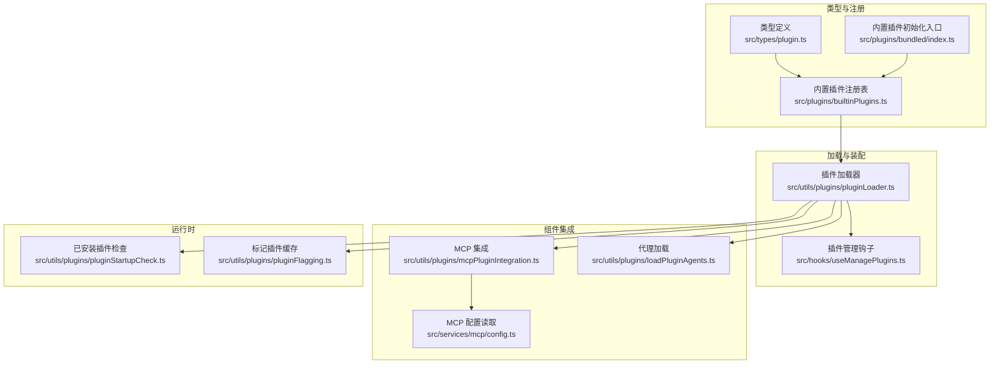
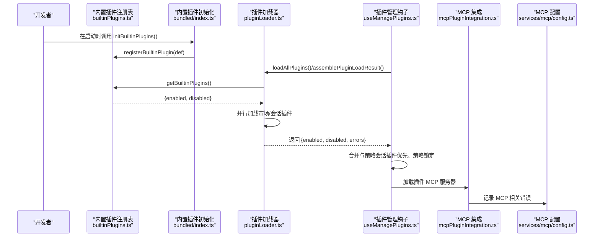
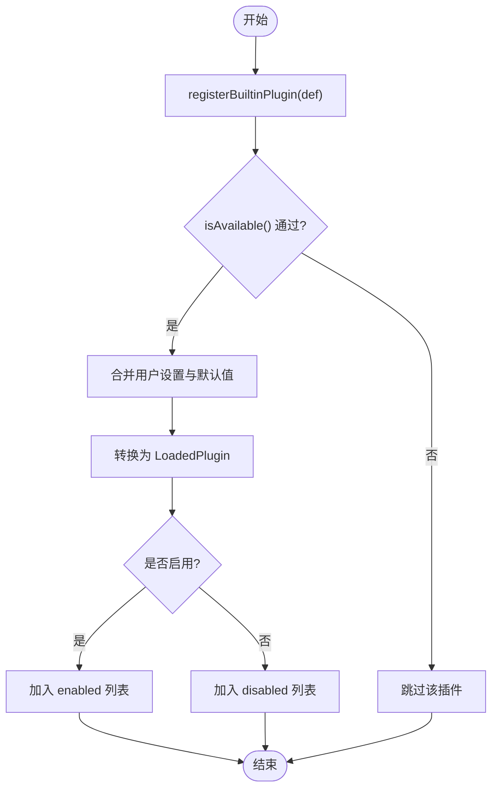
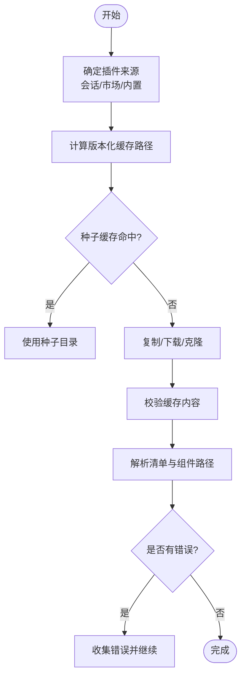
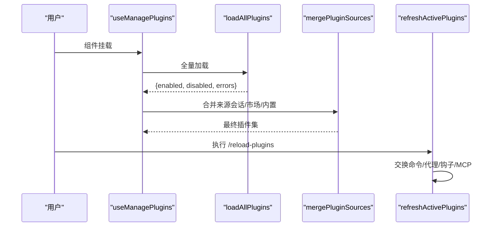
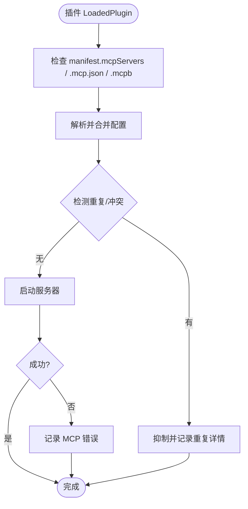
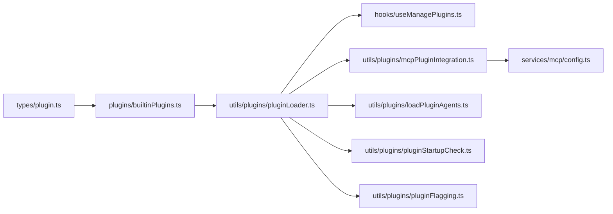

# 插件系统

<cite>
**本文引用的文件**
- [builtinPlugins.ts](file://src/plugins/builtinPlugins.ts)
- [index.ts](file://src/plugins/bundled/index.ts)
- [plugin.ts](file://src/types/plugin.ts)
- [pluginLoader.ts](file://src/utils/plugins/pluginLoader.ts)
- [useManagePlugins.ts](file://src/hooks/useManagePlugins.ts)
- [mcpPluginIntegration.ts](file://src/utils/plugins/mcpPluginIntegration.ts)
- [config.ts](file://src/services/mcp/config.ts)
- [loadPluginAgents.ts](file://src/utils/plugins/loadPluginAgents.ts)
- [pluginStartupCheck.ts](file://src/utils/plugins/pluginStartupCheck.ts)
- [pluginFlagging.ts](file://src/utils/plugins/pluginFlagging.ts)
</cite>

## 目录
1. [简介](#简介)
2. [项目结构](#项目结构)
3. [核心组件](#核心组件)
4. [架构总览](#架构总览)
5. [详细组件分析](#详细组件分析)
6. [依赖关系分析](#依赖关系分析)
7. [性能考量](#性能考量)
8. [故障排查指南](#故障排查指南)
9. [结论](#结论)
10. [附录](#附录)

## 简介
本文件系统性阐述 free-code 的插件体系：插件架构设计、内置插件注册与管理、加载机制、与命令系统/工具系统的集成、错误模型与可观测性，以及插件开发最佳实践与安全注意事项。目标是帮助开发者快速理解如何在该系统中开发、安装、配置、启用/禁用、卸载与调试插件，并确保与命令、代理、MCP/LSP 等能力的正确衔接。

## 项目结构
围绕插件系统的关键目录与文件如下：
- 插件类型与内置插件注册
  - 类型定义：[plugin.ts](file://src/types/plugin.ts)
  - 内置插件注册表与装配：[builtinPlugins.ts](file://src/plugins/builtinPlugins.ts)
  - 内置插件初始化入口（占位）：[index.ts](file://src/plugins/bundled/index.ts)
- 插件加载与装配
  - 插件加载器与多源合并：[pluginLoader.ts](file://src/utils/plugins/pluginLoader.ts)
  - 插件生命周期钩子：[useManagePlugins.ts](file://src/hooks/useManagePlugins.ts)
- 组件集成
  - MCP 集成与服务器加载：[mcpPluginIntegration.ts](file://src/utils/plugins/mcpPluginIntegration.ts)
  - MCP 配置读取与错误日志：[config.ts](file://src/services/mcp/config.ts)
  - 代理加载（来自插件）：[loadPluginAgents.ts](file://src/utils/plugins/loadPluginAgents.ts)
- 运行时状态与策略
  - 已安装插件查询与迁移：[pluginStartupCheck.ts](file://src/utils/plugins/pluginStartupCheck.ts)
  - 标记/过期插件缓存：[pluginFlagging.ts](file://src/utils/plugins/pluginFlagging.ts)

**图表来源**
- [plugin.ts:1-364](file://src/types/plugin.ts#L1-L364)
- [builtinPlugins.ts:1-160](file://src/plugins/builtinPlugins.ts#L1-L160)
- [index.ts:1-24](file://src/plugins/bundled/index.ts#L1-L24)
- [pluginLoader.ts:1-800](file://src/utils/plugins/pluginLoader.ts#L1-L800)
- [useManagePlugins.ts:23-304](file://src/hooks/useManagePlugins.ts#L23-L304)
- [mcpPluginIntegration.ts:116-163](file://src/utils/plugins/mcpPluginIntegration.ts#L116-L163)
- [config.ts:1110-1145](file://src/services/mcp/config.ts#L1110-L1145)
- [loadPluginAgents.ts:243-348](file://src/utils/plugins/loadPluginAgents.ts#L243-L348)
- [pluginStartupCheck.ts:189-224](file://src/utils/plugins/pluginStartupCheck.ts#L189-L224)
- [pluginFlagging.ts:76-129](file://src/utils/plugins/pluginFlagging.ts#L76-L129)

**章节来源**
- [plugin.ts:1-364](file://src/types/plugin.ts#L1-L364)
- [builtinPlugins.ts:1-160](file://src/plugins/builtinPlugins.ts#L1-L160)
- [index.ts:1-24](file://src/plugins/bundled/index.ts#L1-L24)
- [pluginLoader.ts:1-800](file://src/utils/plugins/pluginLoader.ts#L1-L800)
- [useManagePlugins.ts:23-304](file://src/hooks/useManagePlugins.ts#L23-L304)
- [mcpPluginIntegration.ts:116-163](file://src/utils/plugins/mcpPluginIntegration.ts#L116-L163)
- [config.ts:1110-1145](file://src/services/mcp/config.ts#L1110-L1145)
- [loadPluginAgents.ts:243-348](file://src/utils/plugins/loadPluginAgents.ts#L243-L348)
- [pluginStartupCheck.ts:189-224](file://src/utils/plugins/pluginStartupCheck.ts#L189-L224)
- [pluginFlagging.ts:76-129](file://src/utils/plugins/pluginFlagging.ts#L76-L129)

## 核心组件
- 插件类型与元数据
  - LoadedPlugin：统一承载插件的清单、路径、来源、启用状态、组件路径等信息，用于后续命令/代理/MCP/LSP 加载。
  - BuiltinPluginDefinition：内置插件定义，支持技能、钩子、MCP 服务器等多组件声明。
  - PluginError：类型化错误模型，覆盖路径、网络、清单解析/校验、市场、MCP/LSP 启动/超时/崩溃、依赖缺失等场景。
- 内置插件注册与装配
  - 注册表：以 Map 存储内置插件定义；提供按名查询、可用性过滤、默认启用态合并用户设置等。
  - 装配：将注册表中的定义转换为 LoadedPlugin，注入 hooksConfig、mcpServers 等字段，区分 enabled/disabled。
- 插件加载器
  - 多源发现：会话内插件（--plugin-dir）、市场插件（settings 中的 plugin@marketplace）、内置插件。
  - 版本化缓存：支持版本化目录/ZIP 缓存、种子缓存命中、本地源复制、远程下载/解压。
  - 安装与拉取：支持 git 仓库/子目录、GitHub 快捷格式、NPM 包（经由市场条目）。
  - 错误收集：对各阶段失败进行分类记录，便于 UI 呈现与排障。
- 生命周期与刷新
  - 初始加载：useManagePlugins 在挂载时执行一次性全量加载、去列处理、标记插件通知、写入 AppState。
  - 刷新激活：通过 /reload-plugins 触发 refreshActivePlugins，统一交换命令/代理/钩子/MCP 等层。
- 组件集成
  - MCP：从插件清单或 .mcp.json/.mcpb 加载服务器配置，集中错误上报。
  - 代理：从插件 agents 目录或自定义路径加载代理定义。
  - 命令：内置插件的技能被转换为命令对象，参与命令注册与调度。

**章节来源**
- [plugin.ts:18-70](file://src/types/plugin.ts#L18-L70)
- [builtinPlugins.ts:21-102](file://src/plugins/builtinPlugins.ts#L21-L102)
- [pluginLoader.ts:1-800](file://src/utils/plugins/pluginLoader.ts#L1-L800)
- [useManagePlugins.ts:23-304](file://src/hooks/useManagePlugins.ts#L23-L304)
- [mcpPluginIntegration.ts:116-163](file://src/utils/plugins/mcpPluginIntegration.ts#L116-L163)
- [loadPluginAgents.ts:243-348](file://src/utils/plugins/loadPluginAgents.ts#L243-L348)

## 架构总览
下图展示插件系统从“注册/装配”到“加载/合并/集成”的端到端流程。

**图表来源**
- [builtinPlugins.ts:28-102](file://src/plugins/builtinPlugins.ts#L28-L102)
- [index.ts:20-23](file://src/plugins/bundled/index.ts#L20-L23)
- [pluginLoader.ts:3096-3188](file://src/utils/plugins/pluginLoader.ts#L3096-L3188)
- [useManagePlugins.ts:46-304](file://src/hooks/useManagePlugins.ts#L46-L304)
- [mcpPluginIntegration.ts:131-163](file://src/utils/plugins/mcpPluginIntegration.ts#L131-L163)
- [config.ts:1114-1145](file://src/services/mcp/config.ts#L1114-L1145)

## 详细组件分析

### 内置插件注册与装配
- 设计要点
  - 内置插件 ID 采用 {name}@builtin 格式，与市场插件区分。
  - 可声明 skills、hooks、mcpServers 等组件；isAvailable 支持按环境/能力过滤。
  - 用户设置优先于默认值；未设置时默认启用。
- 关键函数
  - registerBuiltinPlugin：注册插件定义。
  - getBuiltinPlugins：返回 enabled/disabled 列表，转换为 LoadedPlugin。
  - getBuiltinPluginSkillCommands：将内置插件技能转为命令对象，供命令系统使用。
- 数据流
  - 注册表 Map -> 过滤可用 -> 合并用户设置 -> 转换 LoadedPlugin -> 命令/代理/MCP 加载。

**图表来源**
- [builtinPlugins.ts:28-102](file://src/plugins/builtinPlugins.ts#L28-L102)

**章节来源**
- [builtinPlugins.ts:1-160](file://src/plugins/builtinPlugins.ts#L1-L160)
- [index.ts:1-24](file://src/plugins/bundled/index.ts#L1-L24)

### 插件加载器与多源合并
- 发现与来源
  - 会话内插件：--plugin-dir 或 SDK 选项提供的目录，优先级高于已安装同名插件（受策略锁定影响）。
  - 市场插件：settings 中的 plugin@marketplace，支持版本/分支/SHA 指定。
  - 内置插件：CLI 自带，用户可启/禁用。
- 缓存与复制
  - 版本化缓存目录/ZIP；支持种子缓存命中；本地源直接复制；远程下载后解压。
  - .git 目录移除，避免污染缓存。
- 安装与拉取
  - git 仓库/子目录（partial clone + sparse-checkout）；GitHub 快捷格式；NPM 包（经市场条目）。
- 错误收集
  - 分类记录路径、网络、清单、市场、MCP/LSP、依赖等错误，统一消息化输出。

**图表来源**
- [pluginLoader.ts:126-465](file://src/utils/plugins/pluginLoader.ts#L126-L465)
- [pluginLoader.ts:645-800](file://src/utils/plugins/pluginLoader.ts#L645-L800)
- [pluginLoader.ts:2191-2221](file://src/utils/plugins/pluginLoader.ts#L2191-L2221)
- [pluginLoader.ts:3096-3188](file://src/utils/plugins/pluginLoader.ts#L3096-L3188)

**章节来源**
- [pluginLoader.ts:1-800](file://src/utils/plugins/pluginLoader.ts#L1-L800)
- [pluginLoader.ts:2186-3188](file://src/utils/plugins/pluginLoader.ts#L2186-L3188)

### 生命周期与刷新（/reload-plugins）
- 初始加载
  - useManagePlugins 在挂载时执行一次性全量加载，运行去列处理、标记插件通知、填充 AppState。
- 刷新激活
  - 通过 /reload-plugins 触发 refreshActivePlugins，统一交换命令/代理/钩子/MCP 等层，避免自动刷新与状态不一致。
- 策略与优先级
  - 会话插件优先于已安装同名插件；企业策略（force-enable/disable）优先于 --plugin-dir。

**图表来源**
- [useManagePlugins.ts:46-304](file://src/hooks/useManagePlugins.ts#L46-L304)
- [pluginLoader.ts:3155-3188](file://src/utils/plugins/pluginLoader.ts#L3155-L3188)

**章节来源**
- [useManagePlugins.ts:23-304](file://src/hooks/useManagePlugins.ts#L23-L304)
- [pluginLoader.ts:3096-3188](file://src/utils/plugins/pluginLoader.ts#L3096-L3188)

### MCP 集成与错误处理
- 服务器加载
  - 从插件清单、.mcp.json、.mcpb 文件加载 MCP 服务器配置；支持字符串或对象格式。
  - 对重复/冲突进行抑制与提示。
- 错误上报
  - MCP 相关错误在服务端集中记录，非 MCP 相关错误仅调试日志。
- 运行时策略
  - 若插件不可用或不存在，记录调试日志而非致命错误。

**图表来源**
- [mcpPluginIntegration.ts:131-163](file://src/utils/plugins/mcpPluginIntegration.ts#L131-L163)
- [config.ts:1114-1145](file://src/services/mcp/config.ts#L1114-L1145)

**章节来源**
- [mcpPluginIntegration.ts:116-163](file://src/utils/plugins/mcpPluginIntegration.ts#L116-L163)
- [config.ts:1110-1145](file://src/services/mcp/config.ts#L1110-L1145)

### 代理加载（来自插件）
- 默认 agents 目录与自定义路径并行加载，去重与容错处理，最终汇总为全局代理列表。
- 与插件加载器配合，确保代理在刷新后同步生效。

**章节来源**
- [loadPluginAgents.ts:243-348](file://src/utils/plugins/loadPluginAgents.ts#L243-L348)

### 已安装插件与标记插件
- 已安装插件查询与迁移：首次调用触发从 settings.json 同步至 installed_plugins.json，并返回当前已安装插件 ID 列表。
- 标记插件缓存：从磁盘读取标记插件数据，按过期时间清理，保证 UI 与通知一致性。

**章节来源**
- [pluginStartupCheck.ts:189-224](file://src/utils/plugins/pluginStartupCheck.ts#L189-L224)
- [pluginFlagging.ts:76-129](file://src/utils/plugins/pluginFlagging.ts#L76-L129)

## 依赖关系分析
- 组件耦合
  - builtinPlugins.ts 与 types/plugin.ts 强耦合（类型与定义）。
  - pluginLoader.ts 依赖 marketplace、git、zip、fs 等模块，承担主要 IO 与错误聚合。
  - useManagePlugins.ts 作为生命周期协调者，串联加载与刷新。
  - mcpPluginIntegration.ts 与 config.ts 协作，集中 MCP 错误处理。
- 外部依赖
  - git、npm（通过 execFileNoThrow 调用），文件系统操作（fs/promises）。
- 循环依赖
  - 当前结构以“类型定义 -> 注册表 -> 加载器 -> 集成”单向依赖为主，未见循环。

**图表来源**
- [plugin.ts:1-364](file://src/types/plugin.ts#L1-L364)
- [builtinPlugins.ts:1-160](file://src/plugins/builtinPlugins.ts#L1-L160)
- [pluginLoader.ts:1-800](file://src/utils/plugins/pluginLoader.ts#L1-L800)
- [useManagePlugins.ts:23-304](file://src/hooks/useManagePlugins.ts#L23-L304)
- [mcpPluginIntegration.ts:116-163](file://src/utils/plugins/mcpPluginIntegration.ts#L116-L163)
- [config.ts:1110-1145](file://src/services/mcp/config.ts#L1110-L1145)
- [loadPluginAgents.ts:243-348](file://src/utils/plugins/loadPluginAgents.ts#L243-L348)
- [pluginStartupCheck.ts:189-224](file://src/utils/plugins/pluginStartupCheck.ts#L189-L224)
- [pluginFlagging.ts:76-129](file://src/utils/plugins/pluginFlagging.ts#L76-L129)

**章节来源**
- [plugin.ts:1-364](file://src/types/plugin.ts#L1-L364)
- [builtinPlugins.ts:1-160](file://src/plugins/builtinPlugins.ts#L1-L160)
- [pluginLoader.ts:1-800](file://src/utils/plugins/pluginLoader.ts#L1-L800)
- [useManagePlugins.ts:23-304](file://src/hooks/useManagePlugins.ts#L23-L304)
- [mcpPluginIntegration.ts:116-163](file://src/utils/plugins/mcpPluginIntegration.ts#L116-L163)
- [config.ts:1110-1145](file://src/services/mcp/config.ts#L1110-L1145)
- [loadPluginAgents.ts:243-348](file://src/utils/plugins/loadPluginAgents.ts#L243-L348)
- [pluginStartupCheck.ts:189-224](file://src/utils/plugins/pluginStartupCheck.ts#L189-L224)
- [pluginFlagging.ts:76-129](file://src/utils/plugins/pluginFlagging.ts#L76-L129)

## 性能考量
- 缓存与压缩
  - 版本化缓存与 ZIP 缓存减少重复下载与解压开销；种子缓存命中可显著降低冷启动时间。
- 部分克隆与稀疏检出
  - git-subdir 使用 partial clone + sparse-checkout，大幅减少大仓库下载体积。
- 并行加载
  - 市场/会话插件与内置插件并行装配，提升整体加载效率。
- 错误短路
  - 非致命错误收集但不阻断整体流程，避免单点故障放大。

[本节为通用指导，无需列出具体文件来源]

## 故障排查指南
- 常见错误类型与定位
  - 路径/清单/网络/MCP/LSP 等错误均有明确类型与上下文字段，可通过 getPluginErrorMessage 获取用户可读消息。
  - MCP 相关错误在服务端集中记录，便于定位服务器配置与启动问题。
- 排查步骤
  - 查看 /plugin UI 的错误列表与消息。
  - 使用 /reload-plugins 刷新激活，确认是否为旧状态导致。
  - 检查插件缓存目录与 ZIP 缓存，必要时清理后重试。
  - 校验市场/仓库访问权限、网络连通性与 git 可用性。
- 相关实现参考
  - 错误类型与消息映射：[plugin.ts:101-363](file://src/types/plugin.ts#L101-L363)
  - MCP 错误记录位置：[config.ts:1114-1145](file://src/services/mcp/config.ts#L1114-L1145)
  - 插件加载错误收集与返回：[pluginLoader.ts:3096-3188](file://src/utils/plugins/pluginLoader.ts#L3096-L3188)

**章节来源**
- [plugin.ts:101-363](file://src/types/plugin.ts#L101-L363)
- [config.ts:1114-1145](file://src/services/mcp/config.ts#L1114-L1145)
- [pluginLoader.ts:3096-3188](file://src/utils/plugins/pluginLoader.ts#L3096-L3188)

## 结论
free-code 的插件系统以类型化定义为核心，结合内置插件注册表、多源加载与版本化缓存、统一错误模型与生命周期钩子，实现了可扩展、可观测、可维护的插件生态。通过 /reload-plugins 的刷新机制，确保命令、代理、钩子与 MCP/LSP 等组件的一致性更新。开发者可基于内置插件模式与加载器能力，快速构建并发布插件，同时借助错误模型与日志体系高效定位问题。

[本节为总结，无需列出具体文件来源]

## 附录

### 插件开发指南（面向开发者）
- 插件结构
  - 清单：plugin.json（可选，承载元数据与组件路径声明）。
  - 组件：commands/、agents/、hooks/ 等目录按需提供。
- 生命周期管理
  - 初始化：在启动时调用 initBuiltinPlugins()，通过 registerBuiltinPlugin() 注册插件定义。
  - 启用/禁用：通过用户设置控制；内置插件默认启用，可按需调整。
  - 刷新激活：通过 /reload-plugins 触发，确保命令/代理/MCP/LSP 生效。
- API 使用
  - 技能转命令：内置插件的技能定义会被转换为命令对象，参与命令注册。
  - MCP 服务器：在清单或 .mcp.json/.mcpb 中声明，由加载器与集成模块自动装配。
  - 代理：在 agents 目录或自定义路径提供，加载器统一收集。
- 安装、配置与卸载流程（概念流程）
  - 安装：通过 settings 中的 plugin@marketplace 指定来源与版本；加载器负责下载/克隆/复制与缓存。
  - 配置：在 hooks、MCP、代理等组件中按需配置；错误将被分类记录以便修复。
  - 卸载：移除 settings 中的插件条目或禁用，刷新后生效。
- 最佳实践
  - 明确组件边界：命令/代理/钩子/MCP/LSP 各司其职，避免功能重叠。
  - 健壮性：提供清晰的错误消息与回退逻辑，充分利用类型化错误模型。
  - 性能：优先使用缓存与增量更新，避免不必要的重复下载与解析。
- 安全考虑
  - 来源校验：仅允许受策略允许的市场与来源；避免不受信任的会话内插件覆盖。
  - 权限与沙箱：MCP/LSP 服务器应遵循最小权限原则，严格校验配置。
  - 输入验证：对用户输入与外部来源进行严格校验，防止路径遍历与注入攻击。

[本节为通用指导，无需列出具体文件来源]