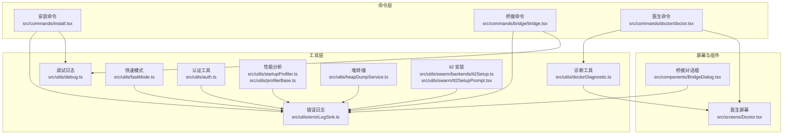
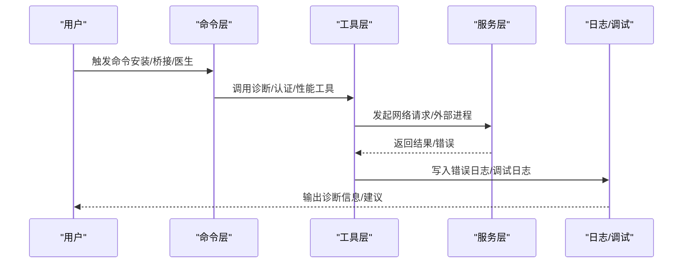
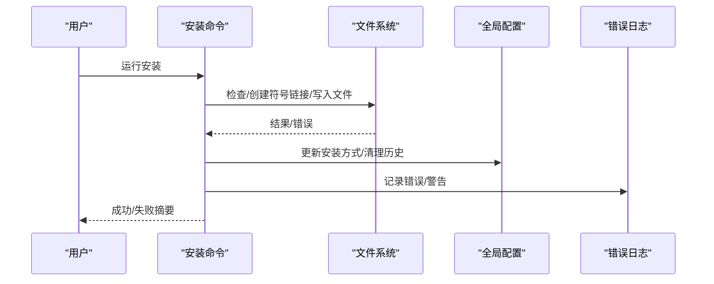
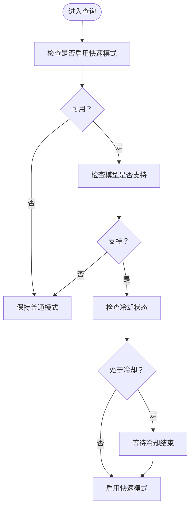
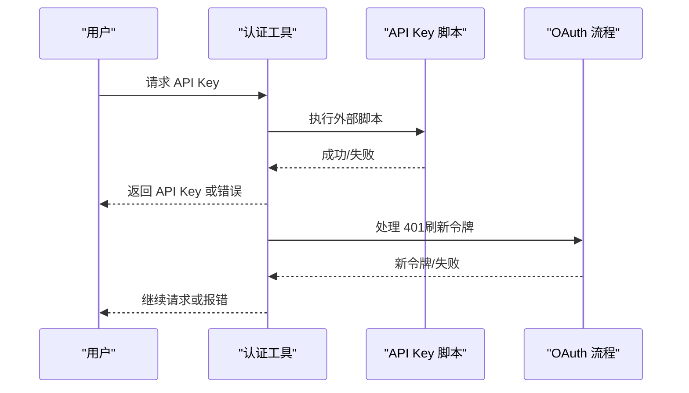
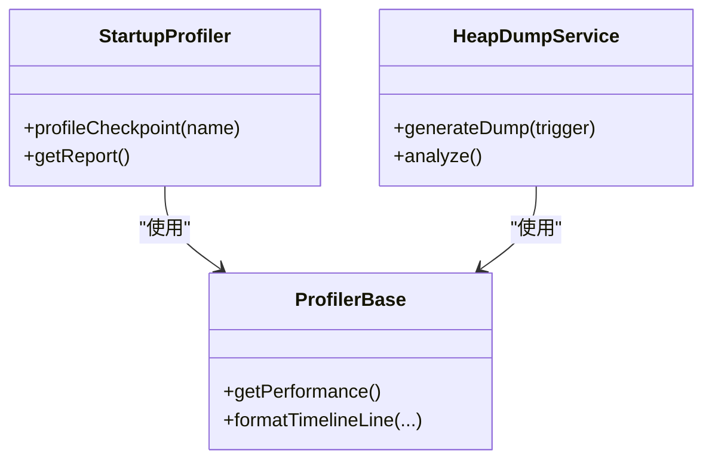
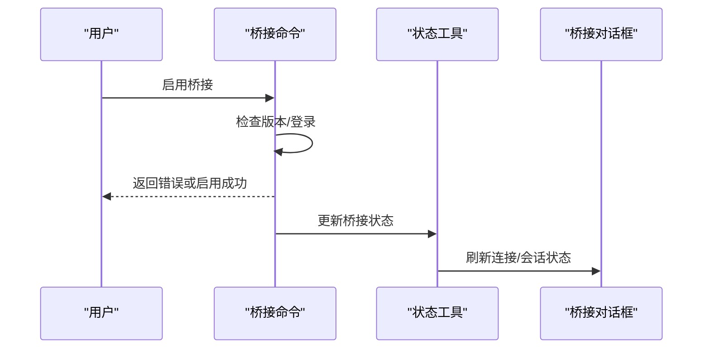
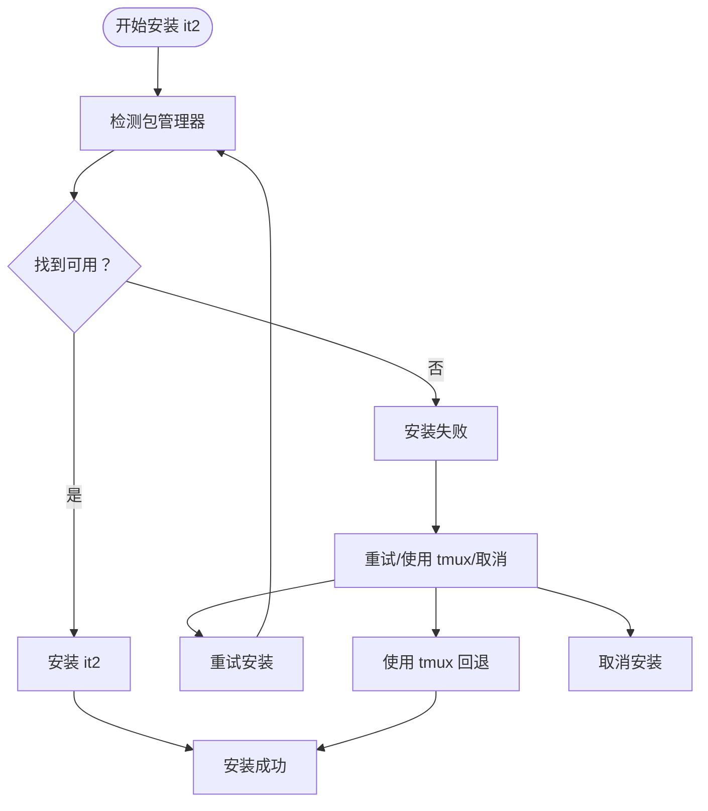
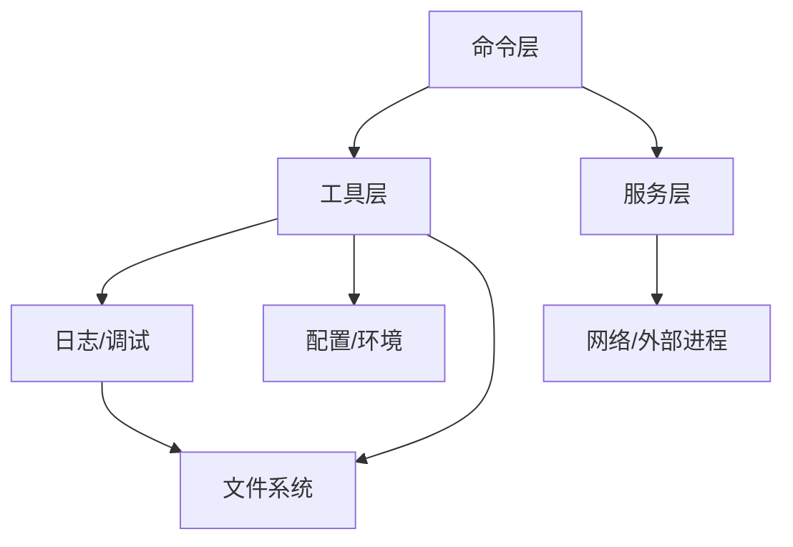

# 故障排除和常见问题

<cite>
**本文档引用的文件**
- [README.md](file://README.md)
- [errorLogSink.ts](file://src/utils/errorLogSink.ts)
- [debug.ts](file://src/utils/debug.ts)
- [doctorDiagnostic.ts](file://src/utils/doctorDiagnostic.ts)
- [Doctor.tsx](file://src/screens/Doctor.tsx)
- [fastMode.ts](file://src/utils/fastMode.ts)
- [auth.ts](file://src/utils/auth.ts)
- [startupProfiler.ts](file://src/utils/startupProfiler.ts)
- [profilerBase.ts](file://src/utils/profilerBase.ts)
- [heapDumpService.ts](file://src/utils/heapDumpService.ts)
- [install.tsx](file://src/commands/install.tsx)
- [bridge.tsx](file://src/commands/bridge/bridge.tsx)
- [BridgeDialog.tsx](file://src/components/BridgeDialog.tsx)
- [it2Setup.ts](file://src/utils/swarm/backends/it2Setup.ts)
- [It2SetupPrompt.tsx](file://src/utils/swarm/It2SetupPrompt.tsx)
</cite>

## 目录
1. [简介](#简介)
2. [项目结构](#项目结构)
3. [核心组件](#核心组件)
4. [架构总览](#架构总览)
5. [详细组件分析](#详细组件分析)
6. [依赖关系分析](#依赖关系分析)
7. [性能考虑](#性能考虑)
8. [故障排除指南](#故障排除指南)
9. [结论](#结论)
10. [附录](#附录)

## 简介
本指南面向 free-code 用户，系统化地整理了安装、配置与使用过程中可能遇到的常见问题及解决方案。内容涵盖安装问题、运行时错误、性能问题与集成故障的诊断与修复方法，并提供日志分析、错误追踪与性能监控的实用步骤，帮助快速定位与解决问题。

## 项目结构
free-code 是基于 Bun 的终端原生 AI 编码代理，采用模块化设计，核心能力通过命令、工具、服务与状态管理协同实现。关键目录与职责概览：
- src/commands：命令注册与实现（如安装、桥接、医生诊断等）
- src/utils：通用工具（日志、调试、诊断、性能分析、认证等）
- src/services：外部服务封装（API、OAuth、分析等）
- src/components：Ink/React 终端 UI 组件
- src/screens：主界面与诊断屏幕
- scripts：构建脚本与特性开关

**图表来源**
- [install.tsx:120-222](file://src/commands/install.tsx#L120-L222)
- [bridge.tsx:492-508](file://src/commands/bridge/bridge.tsx#L492-L508)
- [doctor.tsx:1-7](file://src/commands/doctor/doctor.tsx#L1-L7)
- [errorLogSink.ts:1-236](file://src/utils/errorLogSink.ts#L1-L236)
- [debug.ts:1-269](file://src/utils/debug.ts#L1-L269)
- [doctorDiagnostic.ts:1-626](file://src/utils/doctorDiagnostic.ts#L1-L626)
- [Doctor.tsx:1-575](file://src/screens/Doctor.tsx#L1-L575)
- [fastMode.ts:1-533](file://src/utils/fastMode.ts#L1-L533)
- [auth.ts:513-584](file://src/utils/auth.ts#L513-L584)
- [startupProfiler.ts:53-105](file://src/utils/startupProfiler.ts#L53-L105)
- [profilerBase.ts:1-46](file://src/utils/profilerBase.ts#L1-L46)
- [heapDumpService.ts:163-204](file://src/utils/heapDumpService.ts#L163-L204)
- [it2Setup.ts:1-45](file://src/utils/swarm/backends/it2Setup.ts#L1-L45)
- [It2SetupPrompt.tsx:203-234](file://src/utils/swarm/It2SetupPrompt.tsx#L203-L234)
- [BridgeDialog.tsx:1-30](file://src/components/BridgeDialog.tsx#L1-L30)

**章节来源**
- [README.md:179-205](file://README.md#L179-L205)

## 核心组件
- 错误与调试日志：统一错误记录与调试输出，支持文件落盘与标准错误输出，便于问题复现与追踪。
- 医生诊断：自动检测安装类型、版本、路径、多实例冲突、环境变量与权限等问题，并给出修复建议。
- 快速模式：根据组织策略与模型支持情况动态启用或降级，遇限流或过载进入冷却。
- 认证与授权：支持 API Key 与 OAuth，处理令牌失效与安全提示。
- 性能分析：启动阶段时间线与内存快照，辅助定位启动慢与内存增长问题。
- 堆转储：在内存异常时生成堆快照，辅助定位潜在泄漏。
- 桥接与 IDE 集成：桥接命令与 UI 对话框，检查前置条件与登录状态。
- it2 安装：Python 包管理器检测与安装流程，失败时提供重试与回退选项。

**章节来源**
- [errorLogSink.ts:1-236](file://src/utils/errorLogSink.ts#L1-L236)
- [debug.ts:1-269](file://src/utils/debug.ts#L1-L269)
- [doctorDiagnostic.ts:1-626](file://src/utils/doctorDiagnostic.ts#L1-L626)
- [Doctor.tsx:1-575](file://src/screens/Doctor.tsx#L1-L575)
- [fastMode.ts:1-533](file://src/utils/fastMode.ts#L1-L533)
- [auth.ts:513-584](file://src/utils/auth.ts#L513-L584)
- [startupProfiler.ts:53-105](file://src/utils/startupProfiler.ts#L53-L105)
- [profilerBase.ts:1-46](file://src/utils/profilerBase.ts#L1-L46)
- [heapDumpService.ts:163-204](file://src/utils/heapDumpService.ts#L163-L204)
- [bridge.tsx:492-508](file://src/commands/bridge/bridge.tsx#L492-L508)
- [BridgeDialog.tsx:1-30](file://src/components/BridgeDialog.tsx#L1-L30)
- [it2Setup.ts:1-45](file://src/utils/swarm/backends/it2Setup.ts#L1-L45)
- [It2SetupPrompt.tsx:203-234](file://src/utils/swarm/It2SetupPrompt.tsx#L203-L234)

## 架构总览
下图展示从命令到工具与服务的整体交互，以及关键错误与日志路径：

**图表来源**
- [install.tsx:120-222](file://src/commands/install.tsx#L120-L222)
- [bridge.tsx:492-508](file://src/commands/bridge/bridge.tsx#L492-L508)
- [doctor.tsx:1-7](file://src/commands/doctor/doctor.tsx#L1-L7)
- [errorLogSink.ts:152-174](file://src/utils/errorLogSink.ts#L152-L174)
- [debug.ts:203-228](file://src/utils/debug.ts#L203-L228)

## 详细组件分析

### 安装与诊断组件
- 安装命令负责拉起安装流程、设置启动器、清理旧安装与别名，并在成功后输出总结消息。
- 医生命令与屏幕负责收集安装类型、版本、路径、多实例、权限与环境变量等信息，并汇总警告与修复建议。

**图表来源**
- [install.tsx:120-222](file://src/commands/install.tsx#L120-L222)
- [errorLogSink.ts:78-98](file://src/utils/errorLogSink.ts#L78-L98)

**章节来源**
- [install.tsx:120-222](file://src/commands/install.tsx#L120-L222)
- [doctorDiagnostic.ts:514-625](file://src/utils/doctorDiagnostic.ts#L514-L625)
- [Doctor.tsx:100-501](file://src/screens/Doctor.tsx#L100-L501)

### 快速模式与冷却机制
- 快速模式根据组织策略、API 提供方、模型支持与会话类型决定可用性；当触发速率限制或过载时进入冷却，冷却结束后自动恢复。
- 提供事件订阅用于 UI 或逻辑响应。

**图表来源**
- [fastMode.ts:199-233](file://src/utils/fastMode.ts#L199-L233)

**章节来源**
- [fastMode.ts:38-140](file://src/utils/fastMode.ts#L38-L140)
- [fastMode.ts:199-233](file://src/utils/fastMode.ts#L199-L233)

### 认证与授权
- 支持 API Key 与 OAuth 两种认证方式；当执行外部脚本获取 API Key 失败时，记录错误并避免回退到 OAuth。
- 处理 OAuth 401 场景，刷新令牌并重试。

**图表来源**
- [auth.ts:538-574](file://src/utils/auth.ts#L538-L574)

**章节来源**
- [auth.ts:513-584](file://src/utils/auth.ts#L513-L584)

### 性能分析与内存监控
- 启动性能分析器记录关键时间点与内存快照，格式化报告便于对比。
- 基础性能工具提供统一的时间线格式化与内存信息输出。
- 堆转储服务在内存异常时生成快照，包含内存使用、V8 堆空间与资源使用统计。

**图表来源**
- [startupProfiler.ts:53-105](file://src/utils/startupProfiler.ts#L53-L105)
- [profilerBase.ts:1-46](file://src/utils/profilerBase.ts#L1-L46)
- [heapDumpService.ts:163-204](file://src/utils/heapDumpService.ts#L163-L204)

**章节来源**
- [startupProfiler.ts:53-105](file://src/utils/startupProfiler.ts#L53-L105)
- [profilerBase.ts:1-46](file://src/utils/profilerBase.ts#L1-L46)
- [heapDumpService.ts:163-204](file://src/utils/heapDumpService.ts#L163-L204)

### 桥接与 IDE 集成
- 桥接命令在前置条件满足后启用桥接；若未登录则返回登录指引。
- 桥接对话框显示连接状态、会话 URL 与断开操作，配合状态工具进行 UI 更新。

**图表来源**
- [bridge.tsx:492-508](file://src/commands/bridge/bridge.tsx#L492-L508)
- [BridgeDialog.tsx:1-30](file://src/components/BridgeDialog.tsx#L1-L30)

**章节来源**
- [bridge.tsx:492-508](file://src/commands/bridge/bridge.tsx#L492-L508)
- [BridgeDialog.tsx:1-30](file://src/components/BridgeDialog.tsx#L1-L30)

### it2 安装与回退
- 自动检测可用的 Python 包管理器（uvx/pipx/pip），按优先级尝试安装 it2。
- 失败时提供重试、使用 tmux 回退或取消选项。

**图表来源**
- [it2Setup.ts:40-45](file://src/utils/swarm/backends/it2Setup.ts#L40-L45)
- [It2SetupPrompt.tsx:203-234](file://src/utils/swarm/It2SetupPrompt.tsx#L203-L234)

**章节来源**
- [it2Setup.ts:1-45](file://src/utils/swarm/backends/it2Setup.ts#L1-L45)
- [It2SetupPrompt.tsx:203-234](file://src/utils/swarm/It2SetupPrompt.tsx#L203-L234)

## 依赖关系分析
- 命令层依赖工具层与服务层；工具层依赖日志与调试模块以保证可观测性。
- 医生诊断依赖配置、环境与文件系统，输出统一的诊断信息。
- 快速模式依赖认证与设置，受组织策略与网络状况影响。
- 桥接与 it2 安装分别依赖外部进程与包管理器，失败时提供回退路径。

**图表来源**
- [install.tsx:120-222](file://src/commands/install.tsx#L120-L222)
- [doctorDiagnostic.ts:1-626](file://src/utils/doctorDiagnostic.ts#L1-L626)
- [fastMode.ts:1-533](file://src/utils/fastMode.ts#L1-L533)
- [bridge.tsx:492-508](file://src/commands/bridge/bridge.tsx#L492-L508)
- [it2Setup.ts:1-45](file://src/utils/swarm/backends/it2Setup.ts#L1-L45)

**章节来源**
- [install.tsx:120-222](file://src/commands/install.tsx#L120-L222)
- [doctorDiagnostic.ts:1-626](file://src/utils/doctorDiagnostic.ts#L1-L626)
- [fastMode.ts:1-533](file://src/utils/fastMode.ts#L1-L533)
- [bridge.tsx:492-508](file://src/commands/bridge/bridge.tsx#L492-L508)
- [it2Setup.ts:1-45](file://src/utils/swarm/backends/it2Setup.ts#L1-L45)

## 性能考虑
- 启动性能：使用启动分析器记录关键时间点与内存快照，结合格式化报告定位瓶颈。
- 查询性能：可扩展查询分析器（与启动分析器共享基础设施）。
- 内存监控：定期生成堆转储，分析内存增长与泄漏迹象。
- 日志缓冲：调试日志采用缓冲写入，避免频繁 IO；错误日志落盘以便离线分析。

[本节为通用指导，无需具体文件分析]

## 故障排除指南

### 安装问题
- 症状：安装后无法运行或 PATH 未更新
  - 排查：使用医生命令查看安装类型、路径与多实例冲突；确认 ~/.local/bin 是否在 PATH 中（Linux/macOS）或系统 PATH（Windows）。
  - 修复：按医生建议添加 PATH，或使用本地安装替代方案。
- 症状：残留 npm 安装导致冲突
  - 排查：医生会列出遗留的 npm 全局/本地安装。
  - 修复：按提示卸载或删除对应目录。
- 症状：符号链接创建失败
  - 排查：检查临时符号链接与最终替换过程中的错误日志。
  - 修复：确保目标路径存在且有写权限，重试安装。

**章节来源**
- [doctorDiagnostic.ts:317-484](file://src/utils/doctorDiagnostic.ts#L317-L484)
- [doctorDiagnostic.ts:514-625](file://src/utils/doctorDiagnostic.ts#L514-L625)
- [install.tsx:120-222](file://src/commands/install.tsx#L120-L222)
- [errorLogSink.ts:774-798](file://src/utils/errorLogSink.ts#L774-L798)

### 运行时错误
- 症状：API 请求失败（含状态码与服务器消息）
  - 排查：错误日志会附加请求 URL、状态码与服务器消息，便于定位上游问题。
  - 修复：根据状态码与消息调整请求参数或网络配置。
- 症状：认证失败（API Key 脚本执行失败/超时）
  - 排查：查看认证工具的错误记录与缓存行为。
  - 修复：修正脚本或手动设置 API Key；OAuth 401 将自动刷新令牌并重试。
- 症状：MCP 服务器错误
  - 排查：MCP 错误日志按服务器分文件存储，包含时间戳与会话信息。
  - 修复：根据错误消息定位 MCP 服务问题并重启。

**章节来源**
- [errorLogSink.ts:152-174](file://src/utils/errorLogSink.ts#L152-L174)
- [errorLogSink.ts:179-195](file://src/utils/errorLogSink.ts#L179-L195)
- [auth.ts:538-574](file://src/utils/auth.ts#L538-L574)

### 性能问题
- 症状：启动缓慢
  - 排查：使用启动性能分析器生成报告，关注关键时间点与内存快照。
  - 修复：优化依赖加载、减少不必要的初始化任务。
- 症状：内存持续增长
  - 排查：生成堆转储，分析各空间使用与资源占用。
  - 修复：定位泄漏源，优化对象生命周期与缓存策略。

**章节来源**
- [startupProfiler.ts:53-105](file://src/utils/startupProfiler.ts#L53-L105)
- [profilerBase.ts:1-46](file://src/utils/profilerBase.ts#L1-L46)
- [heapDumpService.ts:163-204](file://src/utils/heapDumpService.ts#L163-L204)

### 集成故障
- 症状：桥接不可用或未登录
  - 排查：检查桥接前置条件与登录状态。
  - 修复：按提示完成登录或升级版本。
- 症状：it2 安装失败
  - 排查：检测可用包管理器与安装过程。
  - 修复：选择重试、使用 tmux 回退或取消。

**章节来源**
- [bridge.tsx:492-508](file://src/commands/bridge/bridge.tsx#L492-L508)
- [BridgeDialog.tsx:1-30](file://src/components/BridgeDialog.tsx#L1-L30)
- [it2Setup.ts:40-45](file://src/utils/swarm/backends/it2Setup.ts#L40-L45)
- [It2SetupPrompt.tsx:203-234](file://src/utils/swarm/It2SetupPrompt.tsx#L203-L234)

### 系统化调试步骤
- 启用调试日志：通过命令行参数或环境变量开启调试模式与过滤器，必要时输出到标准错误。
- 查看医生诊断：运行医生命令，按警告逐项修复。
- 分析错误日志：定位错误上下文（URL/状态/消息），核对会话 ID 与工作目录。
- 性能分析：生成启动/查询报告与堆转储，对比修复前后指标。
- 重现与验证：在最小化场景下重复问题，确认修复有效。

**章节来源**
- [debug.ts:44-102](file://src/utils/debug.ts#L44-L102)
- [debug.ts:203-228](file://src/utils/debug.ts#L203-L228)
- [doctor.tsx:1-7](file://src/commands/doctor/doctor.tsx#L1-L7)
- [Doctor.tsx:100-501](file://src/screens/Doctor.tsx#L100-L501)
- [errorLogSink.ts:152-174](file://src/utils/errorLogSink.ts#L152-L174)

### 常见错误信息与处理
- “API 请求失败”：检查网络连通性与上游状态码，必要时重试或降级。
- “API Key 脚本失败/超时”：修正脚本或手动设置密钥；OAuth 401 自动处理。
- “MCP 服务器错误”：查看对应服务器日志，重启服务或检查配置。
- “快速模式不可用”：根据原因（免费账户/组织策略/额外用量）采取相应措施。
- “it2 安装失败”：选择重试、使用 tmux 或取消。

**章节来源**
- [errorLogSink.ts:152-174](file://src/utils/errorLogSink.ts#L152-L174)
- [auth.ts:538-574](file://src/utils/auth.ts#L538-L574)
- [fastMode.ts:51-70](file://src/utils/fastMode.ts#L51-L70)
- [It2SetupPrompt.tsx:203-234](file://src/utils/swarm/It2SetupPrompt.tsx#L203-L234)

### 预防措施与最佳实践
- 使用医生命令定期自检，及时发现 PATH、多实例与权限问题。
- 在开发/测试环境中启用调试日志，生产环境仅保留必要日志。
- 启用性能分析与堆转储，建立基线并持续监控。
- 严格区分 API Key 与 OAuth 的使用场景，避免凭据泄露。
- 对外部依赖（如 it2、包管理器）进行版本锁定与回退策略。

[本节为通用指导，无需具体文件分析]

## 结论
通过统一的日志与调试体系、系统化的医生诊断、性能分析与内存监控工具，以及针对安装、认证、桥接与外部依赖的专项处理，free-code 能够高效定位与解决安装、运行与性能问题。建议在日常使用中养成定期运行医生命令与启用调试日志的习惯，并结合性能分析工具建立长期的健康度监控。

[本节为总结性内容，无需具体文件分析]

## 附录
- 快速参考
  - 启用调试：--debug 或设置 CLAUDE_CODE_DEBUG_LOG_LEVEL
  - 查看医生：/doctor
  - 重新安装：/install
  - 桥接：/bridge
  - it2 安装：按提示选择重试/回退/取消

[本节为通用指导，无需具体文件分析]