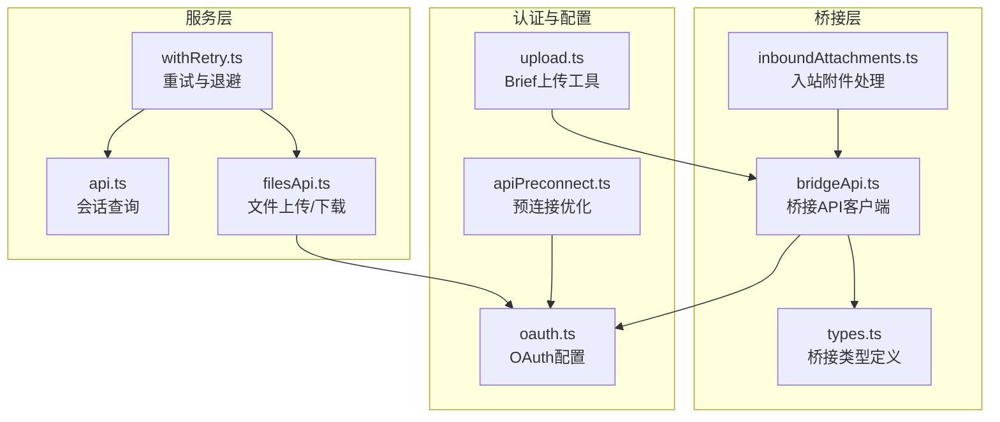
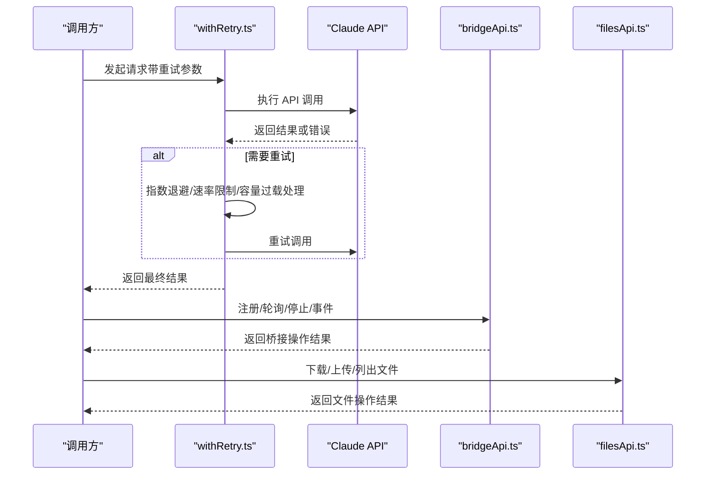
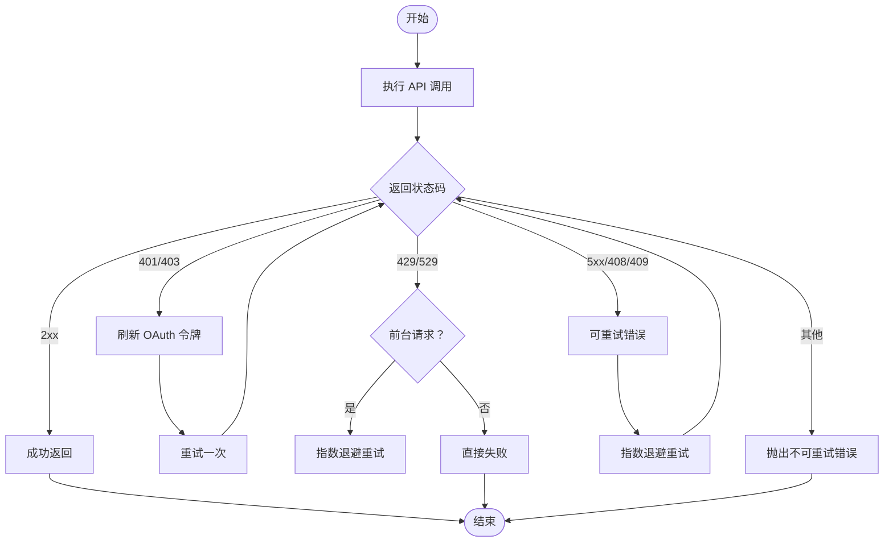
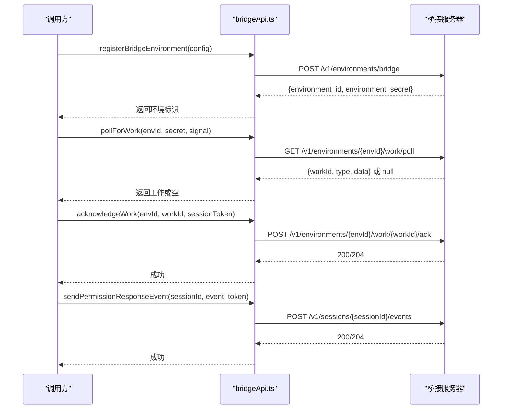
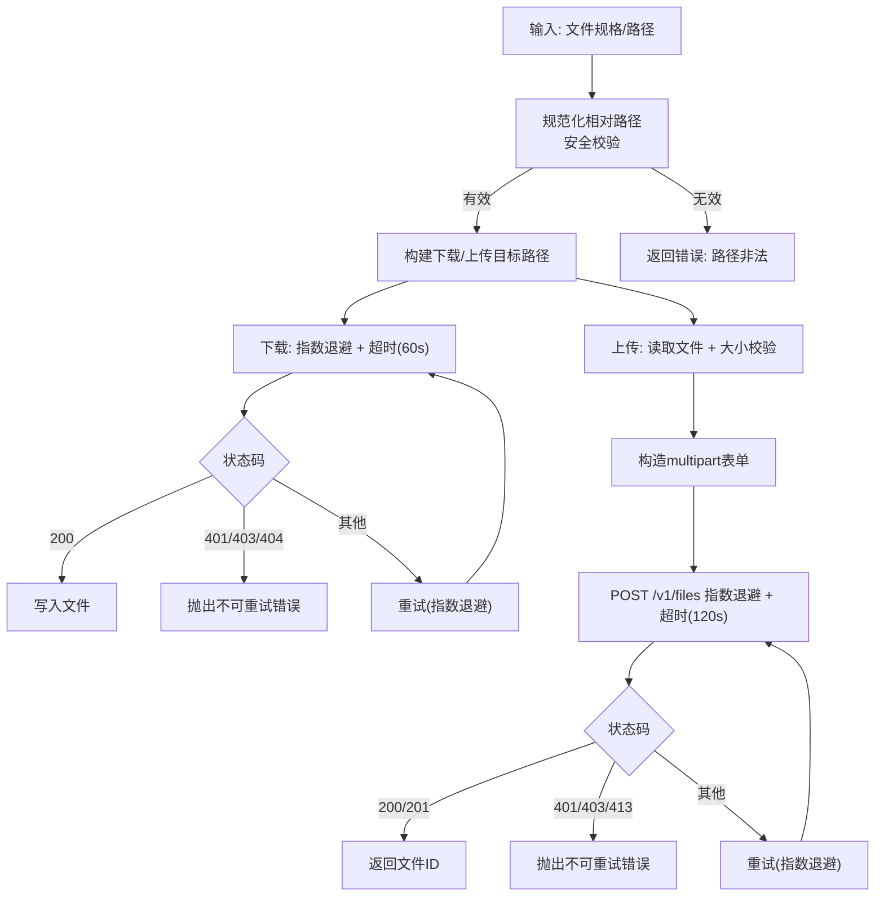
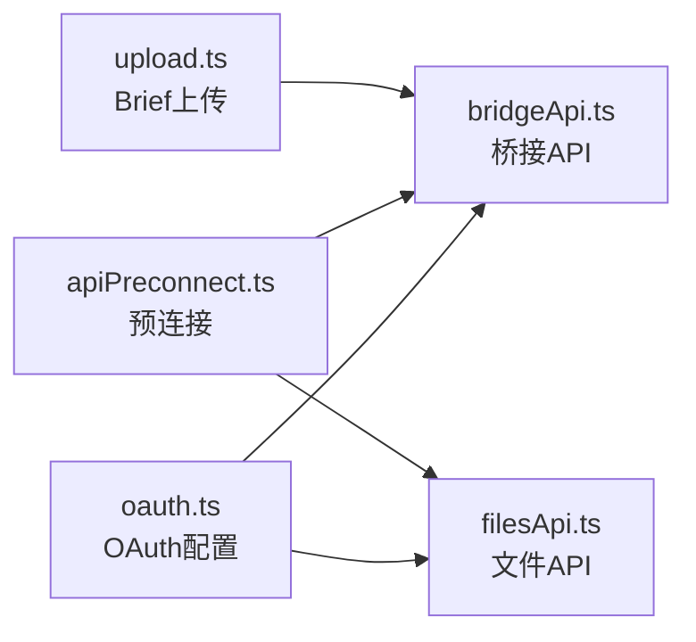
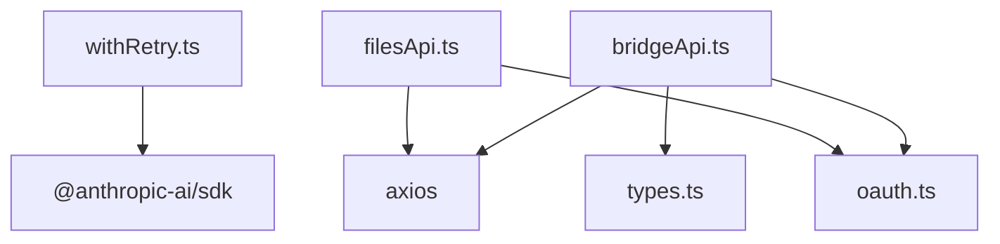

# API 客户端

<cite>
**本文引用的文件**
- [filesApi.ts](file://src/services/api/filesApi.ts)
- [bridgeApi.ts](file://src/bridge/bridgeApi.ts)
- [types.ts](file://src/bridge/types.ts)
- [oauth.ts](file://src/constants/oauth.ts)
- [withRetry.ts](file://src/services/api/withRetry.ts)
- [api.ts](file://src/utils/teleport/api.ts)
- [RemoteSessionManager.ts](file://src/remote/RemoteSessionManager.ts)
- [apiPreconnect.ts](file://src/utils/apiPreconnect.ts)
- [inboundAttachments.ts](file://src/bridge/inboundAttachments.ts)
- [upload.ts](file://src/tools/BriefTool/upload.ts)
</cite>

## 目录
1. [简介](#简介)
2. [项目结构](#项目结构)
3. [核心组件](#核心组件)
4. [架构总览](#架构总览)
5. [详细组件分析](#详细组件分析)
6. [依赖关系分析](#依赖关系分析)
7. [性能考量](#性能考量)
8. [故障排查指南](#故障排查指南)
9. [结论](#结论)
10. [附录](#附录)

## 简介
本文件面向 free-code 项目中的 API 客户端，系统性阐述其设计架构、请求处理机制与响应管理策略。重点覆盖以下方面：
- Claude API 客户端的初始化、认证与重试机制
- 会话管理 API（桥接环境、工作轮询、权限事件）的实现与使用
- 文件上传与下载 API 的实现与并发控制
- 错误处理策略、重试与超时配置
- 配置项与环境变量对客户端行为的影响
- 实际调用示例与最佳实践

## 项目结构
围绕 API 客户端的关键模块如下：
- 服务层 API：Claude API 重试与退避、会话与文件相关工具
- 桥接层 API：远程控制（Remote Control）的桥接 API 客户端
- 认证与配置：OAuth 配置、预连接优化、令牌刷新
- 工具与实用函数：文件解析、路径安全校验、并发下载/上传

**图表来源**
- [withRetry.ts:170-517](file://src/services/api/withRetry.ts#L170-L517)
- [api.ts:284-327](file://src/utils/teleport/api.ts#L284-L327)
- [filesApi.ts:1-749](file://src/services/api/filesApi.ts#L1-L749)
- [bridgeApi.ts:1-540](file://src/bridge/bridgeApi.ts#L1-L540)
- [types.ts:1-263](file://src/bridge/types.ts#L1-L263)
- [inboundAttachments.ts:39-73](file://src/bridge/inboundAttachments.ts#L39-L73)
- [oauth.ts:1-267](file://src/constants/oauth.ts#L1-L267)
- [apiPreconnect.ts:1-33](file://src/utils/apiPreconnect.ts#L1-L33)
- [upload.ts:83-125](file://src/tools/BriefTool/upload.ts#L83-L125)

**章节来源**
- [filesApi.ts:1-749](file://src/services/api/filesApi.ts#L1-L749)
- [bridgeApi.ts:1-540](file://src/bridge/bridgeApi.ts#L1-L540)
- [types.ts:1-263](file://src/bridge/types.ts#L1-L263)
- [oauth.ts:1-267](file://src/constants/oauth.ts#L1-L267)
- [withRetry.ts:1-823](file://src/services/api/withRetry.ts#L1-L823)
- [api.ts:284-327](file://src/utils/teleport/api.ts#L284-L327)
- [apiPreconnect.ts:1-33](file://src/utils/apiPreconnect.ts#L1-L33)
- [inboundAttachments.ts:39-73](file://src/bridge/inboundAttachments.ts#L39-L73)
- [upload.ts:83-125](file://src/tools/BriefTool/upload.ts#L83-L125)

## 核心组件
- Claude API 客户端与重试机制
  - 基于 withRetry.ts 提供的通用重试生成器，支持指数退避、速率限制与容量过载处理、模型回退、最大重试次数等。
  - 支持持久模式（unattended）下的长等待与心跳输出，避免宿主环境误判空闲。
- 桥接 API 客户端（Remote Control）
  - 提供注册环境、轮询工作、确认工作、停止工作、注销环境、归档会话、重连会话、心跳等接口。
  - 内置 OAuth 401 自动刷新与致命错误分类（如 401/403/404/410/429）。
- 文件 API 客户端
  - 下载：带指数退避与超时、路径规范化与安全校验、并发下载。
  - 上传：多部分表单上传、大小限制、并发上传、非可重试错误快速失败。
  - 列表：按时间过滤分页列表。
- 认证与配置
  - OAuth 配置（生产/预发/本地）、自定义 OAuth 基础地址、客户端 ID 覆盖。
  - 预连接优化：在启动阶段预热与 Anthropic API 的 TCP+TLS 握手。

**章节来源**
- [withRetry.ts:170-517](file://src/services/api/withRetry.ts#L170-L517)
- [bridgeApi.ts:68-451](file://src/bridge/bridgeApi.ts#L68-L451)
- [filesApi.ts:97-123](file://src/services/api/filesApi.ts#L97-L123)
- [oauth.ts:218-266](file://src/constants/oauth.ts#L218-L266)
- [apiPreconnect.ts:31-33](file://src/utils/apiPreconnect.ts#L31-L33)

## 架构总览
下图展示从调用方到各 API 层的交互路径与职责边界：

**图表来源**
- [withRetry.ts:170-517](file://src/services/api/withRetry.ts#L170-L517)
- [bridgeApi.ts:141-451](file://src/bridge/bridgeApi.ts#L141-L451)
- [filesApi.ts:132-709](file://src/services/api/filesApi.ts#L132-L709)

## 详细组件分析

### Claude API 客户端与重试机制
- 设计要点
  - 通过 withRetry 生成器统一处理重试、退避、速率限制与容量过载。
  - 对 401/403（OAuth 令牌问题）触发令牌刷新后重试一次。
  - 对 429/529（容量过载）在前台场景默认重试，后台场景直接放弃以避免放大效应。
  - 支持持久模式（unattended），在长时间等待中周期性输出心跳消息，防止宿主误判空闲。
  - 对“最大令牌超出上下文”错误进行自动调整，减少后续失败。
- 关键配置
  - 默认最大重试次数、基础退避延迟、抖动范围。
  - 可通过环境变量覆盖最大重试次数。
- 使用建议
  - 在需要用户可见的前台请求中启用 529 重试；后台任务保持默认不重试。
  - 对可能产生缓存抖动的场景（如快模）谨慎使用短退避，必要时切换标准速度以保护缓存。

**图表来源**
- [withRetry.ts:170-517](file://src/services/api/withRetry.ts#L170-L517)

**章节来源**
- [withRetry.ts:52-104](file://src/services/api/withRetry.ts#L52-L104)
- [withRetry.ts:170-517](file://src/services/api/withRetry.ts#L170-L517)

### 会话管理 API（桥接）
- 组件职责
  - 注册桥接环境、轮询工作、确认工作、停止工作、注销环境、发送权限事件、归档会话、重连会话、心跳。
  - 对 401 自动尝试 OAuth 刷新，失败则抛出致命错误。
  - 对常见状态码进行分类处理：401/403/404/410/429 等。
- 关键类型
  - BridgeApiClient 接口定义所有桥接 API 方法。
  - WorkResponse、WorkSecret、PermissionResponseEvent 等协议类型。
- 最佳实践
  - 在轮询前校验环境 ID 与工作 ID 的安全性（仅允许安全字符）。
  - 对 409 归档幂等处理（已归档视为成功）。
  - 使用 AbortSignal 控制长轮询与停止操作。

**图表来源**
- [bridgeApi.ts:141-451](file://src/bridge/bridgeApi.ts#L141-L451)
- [types.ts:133-176](file://src/bridge/types.ts#L133-L176)

**章节来源**
- [bridgeApi.ts:68-451](file://src/bridge/bridgeApi.ts#L68-L451)
- [types.ts:16-176](file://src/bridge/types.ts#L16-L176)

### 文件上传与下载 API
- 下载流程
  - 规范化相对路径，避免路径穿越；构建会话专属下载目录。
  - 使用指数退避与超时（60 秒）；区分可重试与不可重试错误（401/403/404 等）。
  - 并发下载：通过限流并发器控制同时下载数量，默认 5。
- 上传流程（BYOC 模式）
  - 读取文件内容后进行大小校验（最大 500MB）。
  - 构造 multipart/form-data 表单，设置 purpose=user_data。
  - 指数退避与超时（120 秒），区分可重试网络错误与不可重试认证/权限/过大错误。
  - 并发上传：同上。
- 列表流程（1P/Cloud 模式）
  - 基于 after_created_at 分页查询，使用 after_id 游标继续。
  - 指数退避与超时（60 秒），处理认证/权限错误。
- 入站附件处理
  - 从入站消息提取 file_attachments，清洗文件名，写入本地 uploads 目录。
  - 通过桥接访问令牌获取文件并落盘，失败时记录调试信息。

**图表来源**
- [filesApi.ts:132-552](file://src/services/api/filesApi.ts#L132-L552)
- [filesApi.ts:570-709](file://src/services/api/filesApi.ts#L570-L709)
- [inboundAttachments.ts:68-73](file://src/bridge/inboundAttachments.ts#L68-L73)

**章节来源**
- [filesApi.ts:80-123](file://src/services/api/filesApi.ts#L80-L123)
- [filesApi.ts:132-345](file://src/services/api/filesApi.ts#L132-L345)
- [filesApi.ts:378-593](file://src/services/api/filesApi.ts#L378-L593)
- [filesApi.ts:617-709](file://src/services/api/filesApi.ts#L617-L709)
- [inboundAttachments.ts:39-73](file://src/bridge/inboundAttachments.ts#L39-L73)

### 认证机制与配置
- OAuth 配置
  - 支持生产/预发/本地三套配置，可通过环境变量切换。
  - 支持自定义 OAuth 基础地址（仅允许白名单域名），以及客户端 ID 覆盖。
- 预连接优化
  - 启动阶段发起一次无阻塞预连接，复用全局连接池，缩短首次请求握手耗时。
- Brief 上传工具
  - 在桥接模式下，基于桥接访问令牌与文件大小限制进行上传，失败时优雅降级。

**图表来源**
- [oauth.ts:218-266](file://src/constants/oauth.ts#L218-L266)
- [apiPreconnect.ts:31-33](file://src/utils/apiPreconnect.ts#L31-L33)
- [upload.ts:83-125](file://src/tools/BriefTool/upload.ts#L83-L125)
- [bridgeApi.ts:68-97](file://src/bridge/bridgeApi.ts#L68-L97)
- [filesApi.ts:30-38](file://src/services/api/filesApi.ts#L30-L38)

**章节来源**
- [oauth.ts:1-267](file://src/constants/oauth.ts#L1-L267)
- [apiPreconnect.ts:1-33](file://src/utils/apiPreconnect.ts#L1-L33)
- [upload.ts:83-125](file://src/tools/BriefTool/upload.ts#L83-L125)

### 会话查询与远程会话管理
- 会话查询
  - 通过 OAuth 访问令牌与组织 UUID 查询指定会话资源，处理 401/404 等错误。
- 远程会话管理
  - 通过 WebSocket 接收消息、HTTP 发送消息、权限请求/响应流程。
  - 支持断线重连与错误回调。

**章节来源**
- [api.ts:284-327](file://src/utils/teleport/api.ts#L284-L327)
- [RemoteSessionManager.ts:87-131](file://src/remote/RemoteSessionManager.ts#L87-L131)

## 依赖关系分析
- 组件耦合
  - withRetry.ts 作为通用重试引擎，被 Claude API 调用路径广泛使用。
  - bridgeApi.ts 依赖 oauth.ts 获取认证头与版本头，类型定义来自 types.ts。
  - filesApi.ts 依赖 oauth.ts 与日志/分析模块，路径安全与并发控制由内部工具函数提供。
- 外部依赖
  - axios 用于 HTTP 请求与超时控制。
  - @anthropic-ai/sdk 提供 Claude API 客户端与错误类型。
- 循环依赖
  - 未发现直接循环依赖；桥接与文件 API 通过公共类型与常量解耦。

**图表来源**
- [withRetry.ts:1-48](file://src/services/api/withRetry.ts#L1-L48)
- [bridgeApi.ts:1-10](file://src/bridge/bridgeApi.ts#L1-L10)
- [filesApi.ts:10-23](file://src/services/api/filesApi.ts#L10-L23)
- [oauth.ts:1-267](file://src/constants/oauth.ts#L1-L267)
- [types.ts:1-263](file://src/bridge/types.ts#L1-L263)

**章节来源**
- [withRetry.ts:1-48](file://src/services/api/withRetry.ts#L1-L48)
- [bridgeApi.ts:1-10](file://src/bridge/bridgeApi.ts#L1-L10)
- [filesApi.ts:10-23](file://src/services/api/filesApi.ts#L10-L23)

## 性能考量
- 预连接优化
  - 在启动阶段预热连接，显著降低首次请求的握手延迟。
- 并发控制
  - 文件下载/上传默认并发 5，可根据网络与磁盘能力调整。
- 退避策略
  - 指数退避 + 抖动，避免雪崩；对 429/529 在持久模式下采用更保守的上限与重置窗口。
- 快速失败
  - 对认证/权限/过大等不可重试错误立即失败，减少资源浪费。

[本节为通用指导，无需特定文件来源]

## 故障排查指南
- 常见错误与处理
  - 401/403：检查 OAuth 令牌是否有效或已撤销，必要时触发刷新。
  - 404：检查资源是否存在或路径是否正确。
  - 413：文件过大，调整文件大小或拆分。
  - 429/529：前台请求可重试，后台请求建议直接失败；持久模式下耐心等待。
- 日志与诊断
  - 使用调试日志查看连接细节（SSL/错误码）与请求 ID，便于定位问题。
  - 桥接 API 将 403 中的过期错误类型进行识别，给出明确提示。
- 超时与取消
  - 下载/列表超时 60 秒，上传超时 120 秒；通过 AbortSignal 取消长请求。

**章节来源**
- [withRetry.ts:254-259](file://src/services/api/withRetry.ts#L254-L259)
- [bridgeApi.ts:454-500](file://src/bridge/bridgeApi.ts#L454-L500)
- [filesApi.ts:149-179](file://src/services/api/filesApi.ts#L149-L179)
- [filesApi.ts:460-533](file://src/services/api/filesApi.ts#L460-L533)

## 结论
free-code 的 API 客户端通过统一的重试与退避机制、严谨的错误分类与路径安全校验、以及桥接与文件 API 的清晰职责划分，实现了稳定可靠的 Claude 与 Remote Control 能力。结合预连接优化与并发控制，能够在复杂网络环境下保持高效与鲁棒。建议在实际使用中遵循本文的最佳实践，合理配置重试与并发参数，并充分利用调试日志与错误类型信息进行问题定位。

[本节为总结，无需特定文件来源]

## 附录

### API 调用示例与最佳实践
- Claude API 调用（含重试）
  - 使用 withRetry 包裹请求，根据场景选择前台/后台重试策略。
  - 对 429/529：前台请求可重试，后台直接失败；持久模式下耐心等待。
  - 对 401/403：自动刷新令牌后重试一次。
- 桥接 API 调用
  - 注册环境后保存 environment_id 与 environment_secret。
  - 轮询工作时使用 AbortSignal 控制长轮询；收到工作后及时 ack。
  - 权限事件通过 sendPermissionResponseEvent 回传。
- 文件 API 调用
  - 下载前先规范化路径，避免路径穿越；并发下载时注意磁盘 IO 与网络带宽。
  - 上传前检查文件大小；并发上传时避免过度竞争。
- 认证与配置
  - 生产/预发/本地 OAuth 配置按需切换；自定义 OAuth 基础地址需在白名单内。
  - 启用预连接优化以缩短首次请求耗时。

**章节来源**
- [withRetry.ts:170-517](file://src/services/api/withRetry.ts#L170-L517)
- [bridgeApi.ts:141-451](file://src/bridge/bridgeApi.ts#L141-L451)
- [filesApi.ts:187-267](file://src/services/api/filesApi.ts#L187-L267)
- [oauth.ts:218-266](file://src/constants/oauth.ts#L218-L266)
- [apiPreconnect.ts:31-33](file://src/utils/apiPreconnect.ts#L31-L33)