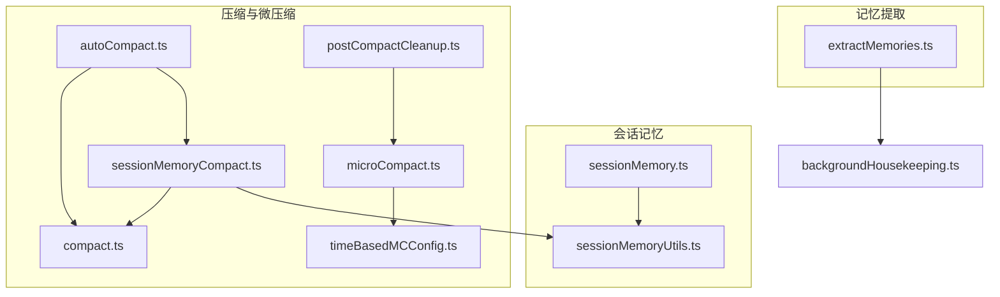
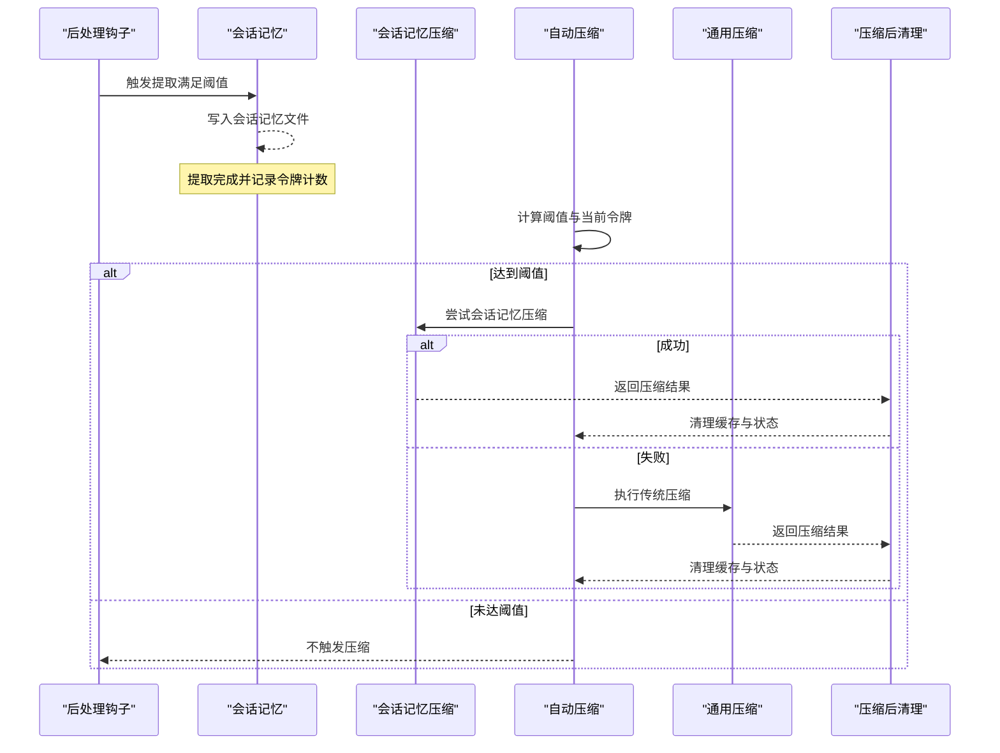
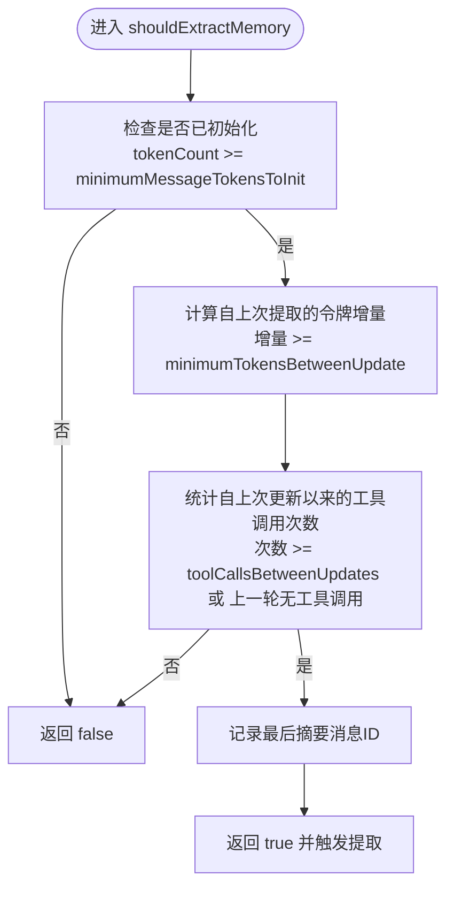
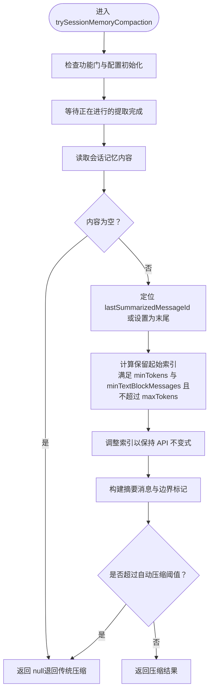
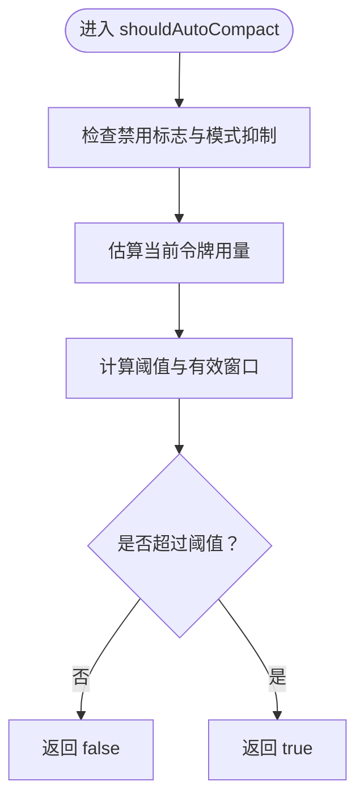
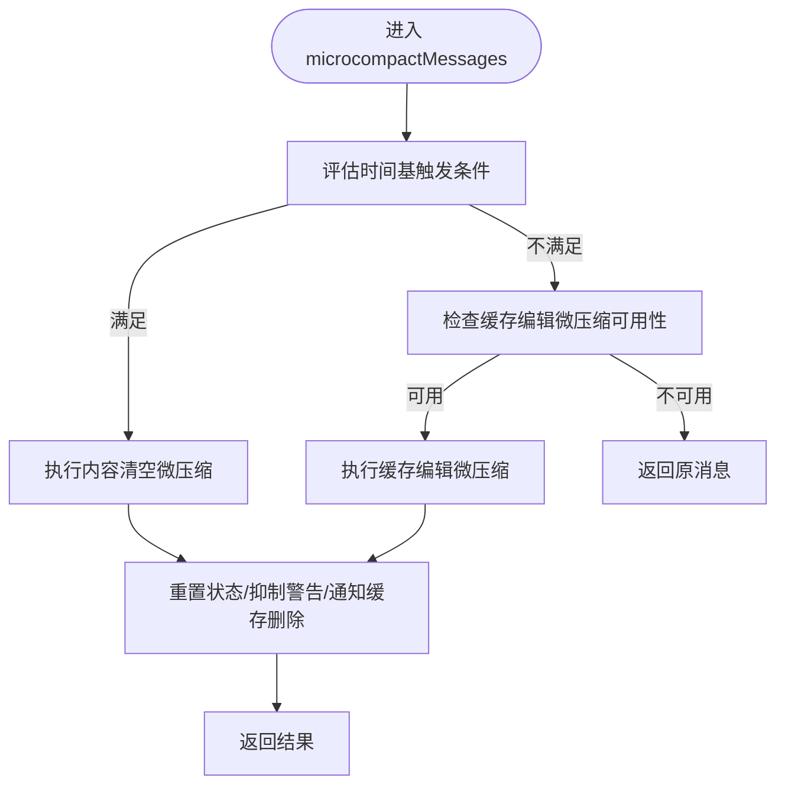
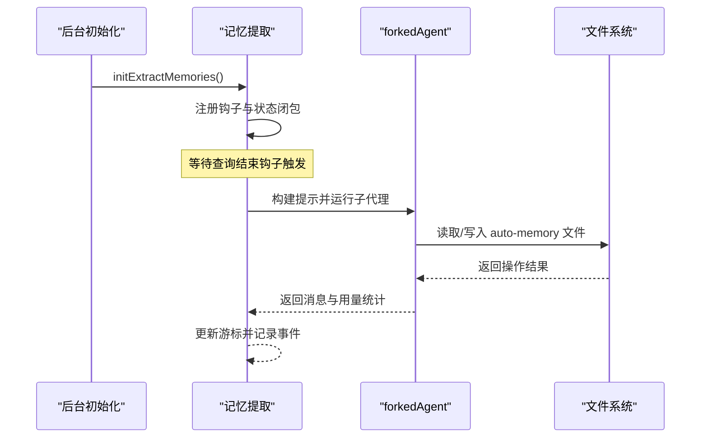
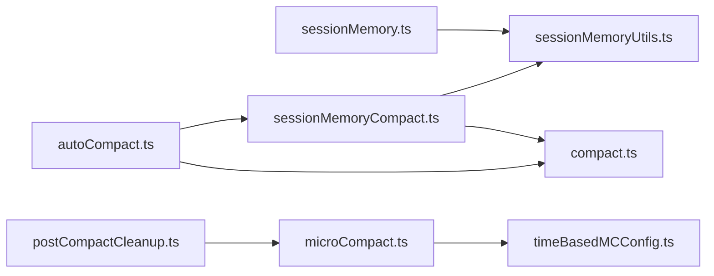

# 内存管理服务

<cite>
**本文档引用的文件**
- [sessionMemory.ts](file://src/services/SessionMemory/sessionMemory.ts)
- [sessionMemoryUtils.ts](file://src/services/SessionMemory/sessionMemoryUtils.ts)
- [sessionMemoryCompact.ts](file://src/services/compact/sessionMemoryCompact.ts)
- [compact.ts](file://src/services/compact/compact.ts)
- [microCompact.ts](file://src/services/compact/microCompact.ts)
- [timeBasedMCConfig.ts](file://src/services/compact/timeBasedMCConfig.ts)
- [autoCompact.ts](file://src/services/compact/autoCompact.ts)
- [postCompactCleanup.ts](file://src/services/compact/postCompactCleanup.ts)
- [extractMemories.ts](file://src/services/extractMemories/extractMemories.ts)
- [backgroundHousekeeping.ts](file://src/utils/backgroundHousekeeping.ts)
</cite>

## 目录
1. [简介](#简介)
2. [项目结构](#项目结构)
3. [核心组件](#核心组件)
4. [架构总览](#架构总览)
5. [详细组件分析](#详细组件分析)
6. [依赖关系分析](#依赖关系分析)
7. [性能考量](#性能考量)
8. [故障排查指南](#故障排查指南)
9. [结论](#结论)
10. [附录](#附录)

## 简介
本文件系统性阐述 free-code 的内存管理服务，覆盖会话内存的存储与检索、自动压缩与时间基微压缩策略、会话记忆提取与清理机制，并提供优化配置示例与性能调优建议。文档面向不同技术背景的读者，既包含代码级细节，也提供可视化流程帮助理解。

## 项目结构
内存管理相关模块主要分布在以下路径：
- 会话记忆：src/services/SessionMemory（会话记忆提取与读取）
- 会话记忆压缩：src/services/compact/sessionMemoryCompact.ts（基于会话记忆的压缩）
- 通用压缩与微压缩：src/services/compact/compact.ts、src/services/compact/microCompact.ts
- 时间基微压缩配置：src/services/compact/timeBasedMCConfig.ts
- 自动压缩与阈值：src/services/compact/autoCompact.ts
- 压缩后清理：src/services/compact/postCompactCleanup.ts
- 记忆提取（持久化）：src/services/extractMemories/extractMemories.ts
- 后台任务初始化：src/utils/backgroundHousekeeping.ts

**图表来源**
- [sessionMemory.ts:1-496](file://src/services/SessionMemory/sessionMemory.ts#L1-L496)
- [sessionMemoryUtils.ts:1-208](file://src/services/SessionMemory/sessionMemoryUtils.ts#L1-L208)
- [sessionMemoryCompact.ts:1-631](file://src/services/compact/sessionMemoryCompact.ts#L1-L631)
- [compact.ts:1-800](file://src/services/compact/compact.ts#L1-L800)
- [microCompact.ts:1-531](file://src/services/compact/microCompact.ts#L1-L531)
- [timeBasedMCConfig.ts:1-44](file://src/services/compact/timeBasedMCConfig.ts#L1-L44)
- [autoCompact.ts:1-352](file://src/services/compact/autoCompact.ts#L1-L352)
- [postCompactCleanup.ts:1-78](file://src/services/compact/postCompactCleanup.ts#L1-L78)
- [extractMemories.ts:1-616](file://src/services/extractMemories/extractMemories.ts#L1-L616)
- [backgroundHousekeeping.ts:28-75](file://src/utils/backgroundHousekeeping.ts#L28-L75)

**章节来源**
- [sessionMemory.ts:1-496](file://src/services/SessionMemory/sessionMemory.ts#L1-L496)
- [sessionMemoryUtils.ts:1-208](file://src/services/SessionMemory/sessionMemoryUtils.ts#L1-L208)
- [sessionMemoryCompact.ts:1-631](file://src/services/compact/sessionMemoryCompact.ts#L1-L631)
- [compact.ts:1-800](file://src/services/compact/compact.ts#L1-L800)
- [microCompact.ts:1-531](file://src/services/compact/microCompact.ts#L1-L531)
- [timeBasedMCConfig.ts:1-44](file://src/services/compact/timeBasedMCConfig.ts#L1-L44)
- [autoCompact.ts:1-352](file://src/services/compact/autoCompact.ts#L1-L352)
- [postCompactCleanup.ts:1-78](file://src/services/compact/postCompactCleanup.ts#L1-L78)
- [extractMemories.ts:1-616](file://src/services/extractMemories/extractMemories.ts#L1-L616)
- [backgroundHousekeeping.ts:28-75](file://src/utils/backgroundHousekeeping.ts#L28-L75)

## 核心组件
- 会话记忆提取与读取：负责在后台周期性提取对话要点到本地文件，支持手动触发与阈值控制；提供内容读取与配置管理。
- 会话记忆压缩：在满足条件时，使用会话记忆摘要替代历史消息，减少上下文占用。
- 微压缩与时间基策略：通过缓存编辑或内容清空方式，在不破坏前缀缓存的前提下清理工具结果，或基于时间间隙强制清理。
- 自动压缩与阈值：根据模型上下文窗口动态计算阈值，触发压缩并处理失败回退。
- 压缩后清理：释放压缩过程中产生的缓存与状态，避免内存泄漏。
- 记忆提取（持久化）：在查询结束时从会话中抽取可持久化的知识到 auto-memory 目录。

**章节来源**
- [sessionMemory.ts:134-181](file://src/services/SessionMemory/sessionMemory.ts#L134-L181)
- [sessionMemoryUtils.ts:18-36](file://src/services/SessionMemory/sessionMemoryUtils.ts#L18-L36)
- [sessionMemoryCompact.ts:514-630](file://src/services/compact/sessionMemoryCompact.ts#L514-L630)
- [microCompact.ts:253-293](file://src/services/compact/microCompact.ts#L253-L293)
- [autoCompact.ts:160-239](file://src/services/compact/autoCompact.ts#L160-L239)
- [postCompactCleanup.ts:31-77](file://src/services/compact/postCompactCleanup.ts#L31-L77)
- [extractMemories.ts:296-587](file://src/services/extractMemories/extractMemories.ts#L296-L587)

## 架构总览
内存管理服务围绕“会话记忆”与“压缩”两条主线协同工作：
- 会话记忆提取：在合适的时机写入本地会话记忆文件，供后续压缩使用。
- 会话记忆压缩：优先尝试以会话记忆摘要替代旧消息，否则退回传统压缩。
- 微压缩：在请求前进行缓存编辑或内容清空，降低上下文压力。
- 自动压缩：当达到阈值时触发压缩，失败则采用电路保护策略。
- 清理：压缩完成后清理缓存与状态，确保内存回收。

**图表来源**
- [sessionMemory.ts:272-350](file://src/services/SessionMemory/sessionMemory.ts#L272-L350)
- [sessionMemoryCompact.ts:514-630](file://src/services/compact/sessionMemoryCompact.ts#L514-L630)
- [autoCompact.ts:241-351](file://src/services/compact/autoCompact.ts#L241-L351)
- [compact.ts:387-763](file://src/services/compact/compact.ts#L387-L763)
- [postCompactCleanup.ts:31-77](file://src/services/compact/postCompactCleanup.ts#L31-L77)

## 详细组件分析

### 会话内存存储与检索
- 阈值与触发逻辑
  - 初始化阈值：当上下文窗口令牌达到最小初始化阈值时才开始初始化会话记忆。
  - 更新阈值：基于自上次提取以来的令牌增长量判断是否需要再次提取。
  - 工具调用阈值：在满足令牌增长阈值的前提下，还需满足工具调用次数阈值，或上一轮无工具调用。
- 文件读取与写入
  - 使用独立的文件系统实现读取会话记忆内容。
  - 首次创建时写入模板，后续读取时丢弃缓存条目以确保获取最新内容。
- 配置管理
  - 支持远程配置合并与默认值回退，保证稳定性。
  - 提供运行时修改与重置接口，便于测试与调试。

**图表来源**
- [sessionMemory.ts:134-181](file://src/services/SessionMemory/sessionMemory.ts#L134-L181)
- [sessionMemoryUtils.ts:173-189](file://src/services/SessionMemory/sessionMemoryUtils.ts#L173-L189)

**章节来源**
- [sessionMemory.ts:134-181](file://src/services/SessionMemory/sessionMemory.ts#L134-L181)
- [sessionMemoryUtils.ts:18-36](file://src/services/SessionMemory/sessionMemoryUtils.ts#L18-L36)
- [sessionMemoryUtils.ts:173-189](file://src/services/SessionMemory/sessionMemoryUtils.ts#L173-L189)
- [sessionMemoryUtils.ts:107-126](file://src/services/SessionMemory/sessionMemoryUtils.ts#L107-L126)

### 会话记忆压缩（基于摘要）
- 启用条件
  - 需同时开启会话记忆与会话记忆压缩功能门。
  - 支持环境变量覆盖以便评估与测试。
- 压缩策略
  - 从“最后摘要消息ID”开始保留消息，向前扩展至满足最小令牌数与最少文本块消息数，且不超过最大令牌上限。
  - 对工具调用/结果配对与思考块进行边界调整，确保 API 兼容性。
  - 将会话记忆内容截断后生成用户可见摘要消息，必要时附加路径提示。
- 结果构建
  - 创建边界标记与保留段元数据，确保加载器能正确重建链路。
  - 与附件、钩子结果组合形成最终消息序列。

**图表来源**
- [sessionMemoryCompact.ts:514-630](file://src/services/compact/sessionMemoryCompact.ts#L514-L630)
- [sessionMemoryCompact.ts:324-397](file://src/services/compact/sessionMemoryCompact.ts#L324-L397)
- [sessionMemoryCompact.ts:437-503](file://src/services/compact/sessionMemoryCompact.ts#L437-L503)

**章节来源**
- [sessionMemoryCompact.ts:403-432](file://src/services/compact/sessionMemoryCompact.ts#L403-L432)
- [sessionMemoryCompact.ts:514-630](file://src/services/compact/sessionMemoryCompact.ts#L514-L630)
- [sessionMemoryCompact.ts:324-397](file://src/services/compact/sessionMemoryCompact.ts#L324-L397)

### 自动压缩与阈值控制
- 阈值计算
  - 基于模型上下文窗口与最大输出令牌预留，得到有效上下文窗口。
  - 在此基础上减去缓冲区得到自动压缩阈值；支持环境变量百分比覆盖。
- 警告与阻断
  - 提供警告阈值与错误阈值，用于 UI 提示与阻断逻辑。
  - 阻断阈值可通过环境变量覆盖，便于测试。
- 触发条件
  - 当令牌使用量超过阈值且满足功能开关与模式抑制条件时触发。
  - 支持电路保护：连续失败超过阈值后停止尝试，避免无效 API 调用。
- 优先策略
  - 自动压缩优先尝试会话记忆压缩，失败后再执行传统压缩。

**图表来源**
- [autoCompact.ts:160-239](file://src/services/compact/autoCompact.ts#L160-L239)
- [autoCompact.ts:93-145](file://src/services/compact/autoCompact.ts#L93-L145)

**章节来源**
- [autoCompact.ts:32-91](file://src/services/compact/autoCompact.ts#L32-L91)
- [autoCompact.ts:93-145](file://src/services/compact/autoCompact.ts#L93-L145)
- [autoCompact.ts:160-239](file://src/services/compact/autoCompact.ts#L160-L239)
- [autoCompact.ts:241-351](file://src/services/compact/autoCompact.ts#L241-L351)

### 微压缩与时间基策略
- 缓存编辑微压缩（缓存型）
  - 仅在主线程且模型受支持时启用。
  - 维护工具结果注册状态，按配置阈值与保留数量删除缓存中的工具结果，不改变本地消息内容。
  - 通过边界消息延迟插入边界标记，使用实际 API 删除令牌统计。
- 时间基微压缩
  - 基于自上次主循环助手消息以来的时间间隔触发。
  - 清理除最近若干个工具结果外的所有内容，直接修改消息内容。
  - 触发后重置缓存编辑状态，抑制压缩警告，并通知缓存删除检测。

**图表来源**
- [microCompact.ts:253-293](file://src/services/compact/microCompact.ts#L253-L293)
- [microCompact.ts:412-444](file://src/services/compact/microCompact.ts#L412-L444)
- [microCompact.ts:446-530](file://src/services/compact/microCompact.ts#L446-L530)
- [timeBasedMCConfig.ts:18-44](file://src/services/compact/timeBasedMCConfig.ts#L18-L44)

**章节来源**
- [microCompact.ts:253-293](file://src/services/compact/microCompact.ts#L253-L293)
- [microCompact.ts:412-444](file://src/services/compact/microCompact.ts#L412-L444)
- [microCompact.ts:446-530](file://src/services/compact/microCompact.ts#L446-L530)
- [timeBasedMCConfig.ts:18-44](file://src/services/compact/timeBasedMCConfig.ts#L18-L44)

### 压缩后清理机制
- 主线程隔离
  - 子代理（agent:*）与主线程共享模块级状态，仅在主线程场景清理上下文折叠与内存文件缓存。
- 清理范围
  - 重置微压缩状态、上下文折叠状态、系统提示片段、分类器审批、推测检查、Beta 会话追踪、会话消息缓存等。
  - 明确不清理已调用技能内容，以保证后续压缩附件仍可包含完整技能文本。

**章节来源**
- [postCompactCleanup.ts:31-77](file://src/services/compact/postCompactCleanup.ts#L31-L77)

### 记忆提取（持久化）与后台初始化
- 后台初始化
  - 在启动时初始化自动记忆提取与自动做白日梦等后台任务。
- 提取流程
  - 通过 forked agent 模式在查询结束钩子处抽取知识到 auto-memory 目录。
  - 限制工具权限，仅允许受限读写与只读 Shell 命令。
  - 支持节流与去重，避免重复提取与并发冲突。
  - 提供“尾随运行”机制，将挂起的上下文在当前运行结束后继续处理。

**图表来源**
- [backgroundHousekeeping.ts:34-36](file://src/utils/backgroundHousekeeping.ts#L34-L36)
- [extractMemories.ts:296-587](file://src/services/extractMemories/extractMemories.ts#L296-L587)

**章节来源**
- [backgroundHousekeeping.ts:31-75](file://src/utils/backgroundHousekeeping.ts#L31-L75)
- [extractMemories.ts:296-587](file://src/services/extractMemories/extractMemories.ts#L296-L587)

## 依赖关系分析
- 低耦合高内聚
  - 会话记忆与压缩模块通过工具函数与配置接口交互，避免直接导入导致的循环依赖。
  - 微压缩与时间基配置相互独立，分别服务于不同场景。
- 关键依赖链
  - sessionMemory.ts 依赖 sessionMemoryUtils.ts 进行配置与状态管理。
  - sessionMemoryCompact.ts 依赖 sessionMemoryUtils.ts 读取会话记忆内容与等待提取完成。
  - autoCompact.ts 依赖 sessionMemoryCompact.ts 与 compact.ts 实现优先策略与回退。
  - microCompact.ts 依赖 timeBasedMCConfig.ts 与缓存编辑模块。
  - postCompactCleanup.ts 在压缩后统一清理多类缓存与状态。

**图表来源**
- [sessionMemory.ts:44-62](file://src/services/SessionMemory/sessionMemory.ts#L44-L62)
- [sessionMemoryCompact.ts:29-42](file://src/services/compact/sessionMemoryCompact.ts#L29-L42)
- [autoCompact.ts:24-26](file://src/services/compact/autoCompact.ts#L24-L26)
- [microCompact.ts:28-30](file://src/services/compact/microCompact.ts#L28-L30)
- [postCompactCleanup.ts:1-11](file://src/services/compact/postCompactCleanup.ts#L1-L11)

**章节来源**
- [sessionMemory.ts:44-62](file://src/services/SessionMemory/sessionMemory.ts#L44-L62)
- [sessionMemoryCompact.ts:29-42](file://src/services/compact/sessionMemoryCompact.ts#L29-L42)
- [autoCompact.ts:24-26](file://src/services/compact/autoCompact.ts#L24-L26)
- [microCompact.ts:28-30](file://src/services/compact/microCompact.ts#L28-L30)
- [postCompactCleanup.ts:1-11](file://src/services/compact/postCompactCleanup.ts#L1-L11)

## 性能考量
- 令牌估算与保守估计
  - 微压缩中对消息内容进行粗略令牌估算并乘以保守系数，避免过度压缩导致的 API 错误。
- 缓存编辑优先
  - 在缓存热状态下优先使用缓存编辑微压缩，避免内容变更带来的缓存失效。
- 时间基触发
  - 当服务器端提示缓存几乎过期时，提前清理旧工具结果，减少后续重写成本。
- 电路保护
  - 自动压缩失败超过阈值后停止重试，防止无效 API 调用消耗资源。
- 后台节流
  - 记忆提取支持节流与去重，避免频繁扫描与写入。

**章节来源**
- [microCompact.ts:164-205](file://src/services/compact/microCompact.ts#L164-L205)
- [microCompact.ts:412-444](file://src/services/compact/microCompact.ts#L412-L444)
- [autoCompact.ts:67-91](file://src/services/compact/autoCompact.ts#L67-L91)
- [autoCompact.ts:257-265](file://src/services/compact/autoCompact.ts#L257-L265)
- [extractMemories.ts:377-386](file://src/services/extractMemories/extractMemories.ts#L377-L386)

## 故障排查指南
- 会话记忆未提取
  - 检查功能门与远程配置是否生效；确认令牌增量与工具调用阈值是否满足。
  - 使用等待函数避免并发提取导致的状态竞争。
- 会话记忆压缩失败
  - 确认会话记忆文件是否存在且非模板内容；检查边界索引定位逻辑。
  - 若阈值过高导致无法触发，适当降低阈值或增加上下文增长。
- 自动压缩未触发
  - 检查禁用标志与模式抑制（如上下文折叠、响应式压缩）；核对阈值计算与当前令牌用量。
- 微压缩无效
  - 确认主线程来源与模型支持情况；检查时间基配置与触发条件。
- 压缩后内存未释放
  - 确保调用压缩后清理函数；注意子代理与主线程的清理差异。

**章节来源**
- [sessionMemory.ts:272-350](file://src/services/SessionMemory/sessionMemory.ts#L272-L350)
- [sessionMemoryCompact.ts:514-630](file://src/services/compact/sessionMemoryCompact.ts#L514-L630)
- [autoCompact.ts:160-239](file://src/services/compact/autoCompact.ts#L160-L239)
- [microCompact.ts:253-293](file://src/services/compact/microCompact.ts#L253-L293)
- [postCompactCleanup.ts:31-77](file://src/services/compact/postCompactCleanup.ts#L31-L77)

## 结论
该内存管理服务通过“会话记忆提取—会话记忆压缩—微压缩—自动压缩—清理”的闭环设计，实现了对长上下文的高效管理。其关键特性包括：
- 可配置的阈值与远程配置合并，兼顾灵活性与稳定性；
- 会话记忆优先压缩策略，显著降低上下文占用；
- 缓存编辑与时间基微压缩双通道，适应不同场景；
- 完善的清理与电路保护机制，保障系统健康运行。

## 附录

### 自动压缩配置示例
- 基础阈值
  - 有效上下文窗口 = 模型上下文窗口 - 最大输出令牌预留
  - 自动压缩阈值 = 有效上下文窗口 - 缓冲区
- 环境变量覆盖
  - CLAUDE_CODE_AUTO_COMPACT_WINDOW：限制有效上下文窗口
  - CLAUDE_AUTOCOMPACT_PCT_OVERRIDE：按百分比覆盖阈值
  - CLAUDE_CODE_BLOCKING_LIMIT_OVERRIDE：覆盖阻断阈值
- 功能开关
  - DISABLE_COMPACT：完全禁用压缩
  - DISABLE_AUTO_COMPACT：仅禁用自动压缩

**章节来源**
- [autoCompact.ts:32-91](file://src/services/compact/autoCompact.ts#L32-L91)
- [autoCompact.ts:147-158](file://src/services/compact/autoCompact.ts#L147-L158)

### 时间基微压缩策略
- 触发条件
  - 功能门开启、主线程来源、自上次助手消息的时间间隔超过阈值。
- 行为
  - 清理除最近若干个工具结果外的内容，直接修改消息内容。
  - 重置缓存编辑状态，抑制压缩警告，通知缓存删除检测。

**章节来源**
- [timeBasedMCConfig.ts:18-44](file://src/services/compact/timeBasedMCConfig.ts#L18-L44)
- [microCompact.ts:412-444](file://src/services/compact/microCompact.ts#L412-L444)
- [microCompact.ts:446-530](file://src/services/compact/microCompact.ts#L446-L530)

### 会话记忆提取功能
- 触发时机
  - 查询结束钩子（handleStopHooks），与会话记忆钩子配合。
- 权限控制
  - 严格限制工具权限，仅允许受限读写与只读 Shell 命令。
- 节流与去重
  - 支持轮询节流与“尾随运行”，避免重复与并发问题。

**章节来源**
- [extractMemories.ts:598-615](file://src/services/extractMemories/extractMemories.ts#L598-L615)
- [extractMemories.ts:171-222](file://src/services/extractMemories/extractMemories.ts#L171-L222)
- [extractMemories.ts:377-386](file://src/services/extractMemories/extractMemories.ts#L377-L386)