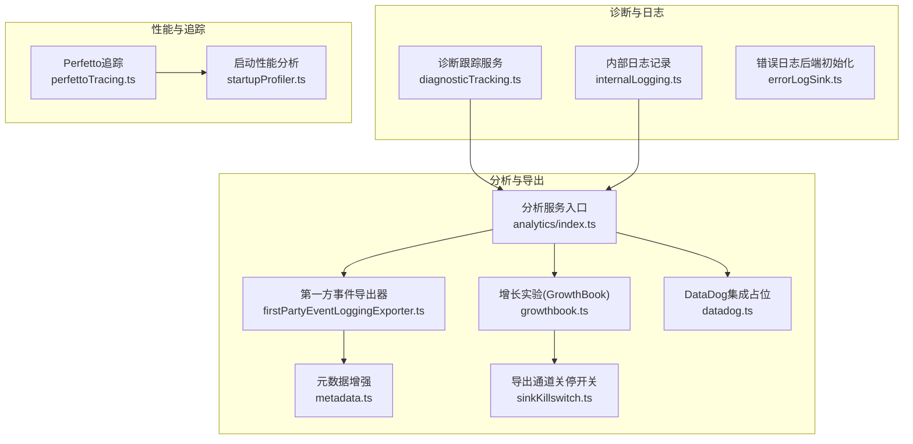
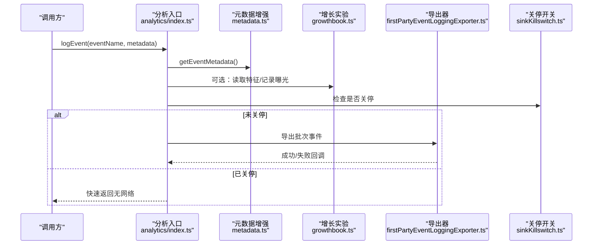
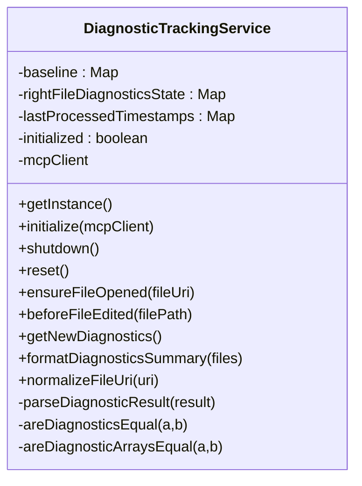
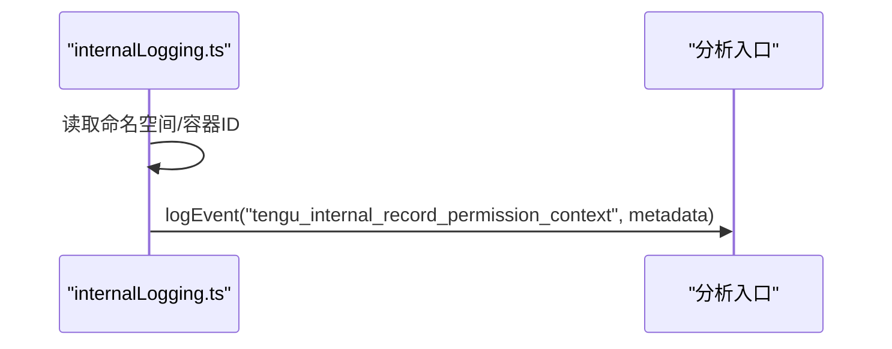
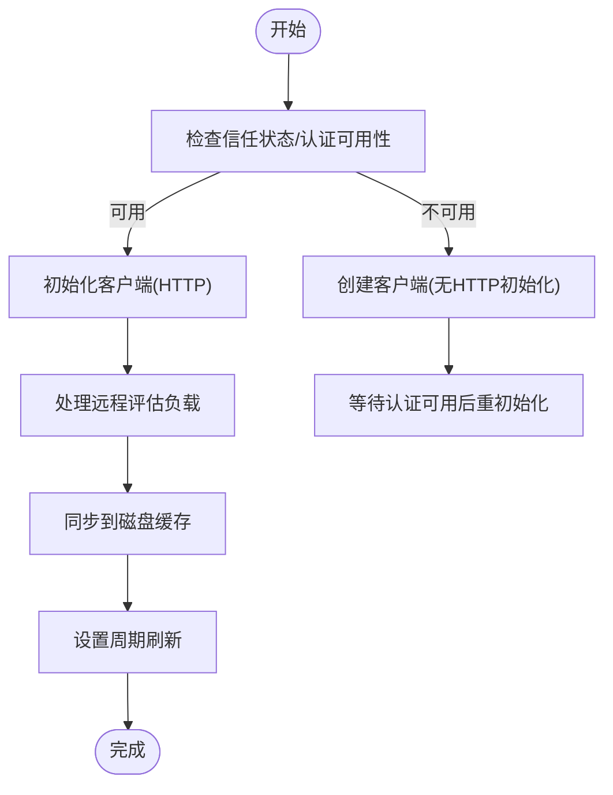
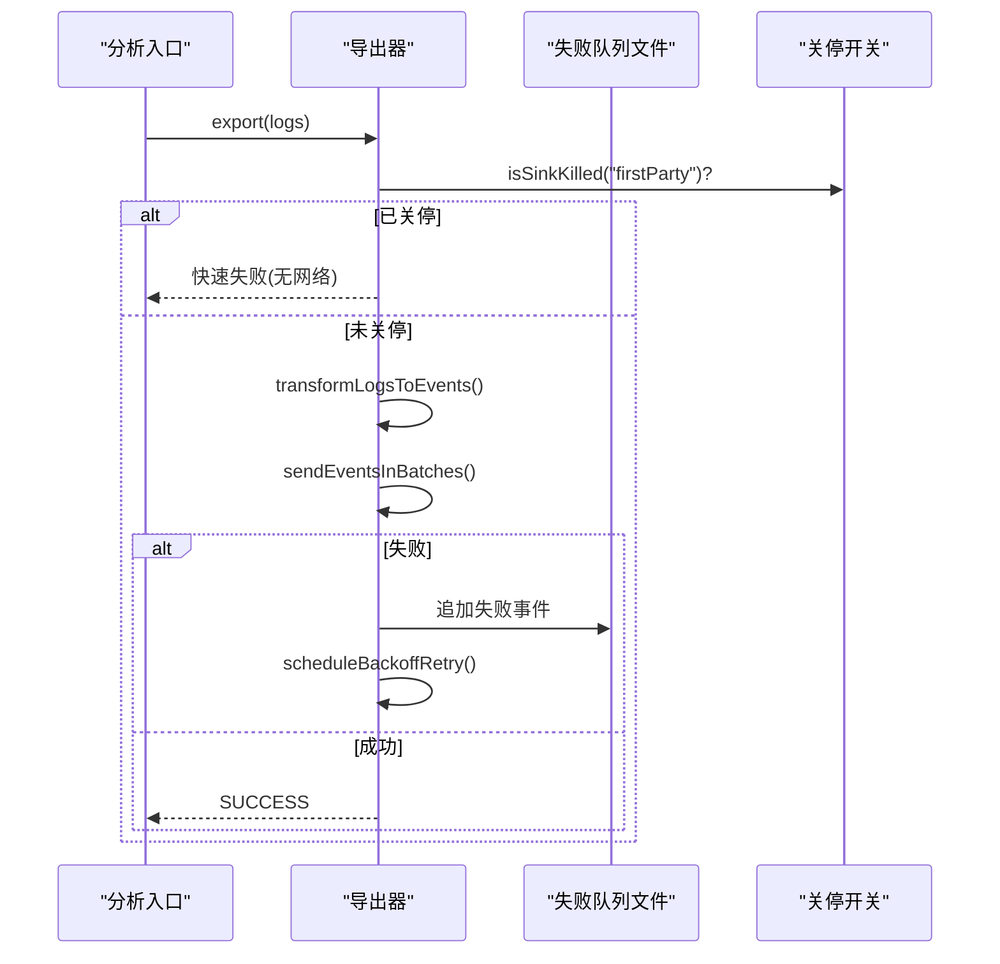
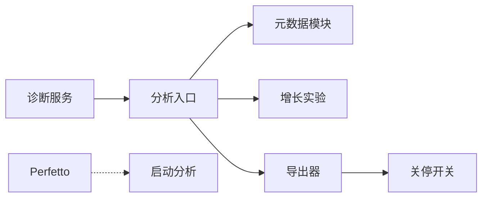

# 分析监控服务

<cite>
**本文档引用的文件**
- [src/services/diagnosticTracking.ts](file://src/services/diagnosticTracking.ts)
- [src/services/internalLogging.ts](file://src/services/internalLogging.ts)
- [src/services/analytics/index.ts](file://src/services/analytics/index.ts)
- [src/services/analytics/datadog.ts](file://src/services/analytics/datadog.ts)
- [src/services/analytics/firstPartyEventLogger.ts](file://src/services/analytics/firstPartyEventLogger.ts)
- [src/services/analytics/firstPartyEventLoggingExporter.ts](file://src/services/analytics/firstPartyEventLoggingExporter.ts)
- [src/services/analytics/growthbook.ts](file://src/services/analytics/growthbook.ts)
- [src/services/analytics/metadata.ts](file://src/services/analytics/metadata.ts)
- [src/services/analytics/sink.ts](file://src/services/analytics/sink.ts)
- [src/services/analytics/sinkKillswitch.ts](file://src/services/analytics/sinkKillswitch.ts)
- [src/utils/errorLogSink.ts](file://src/utils/errorLogSink.ts)
- [src/utils/telemetry/perfettoTracing.ts](file://src/utils/telemetry/perfettoTracing.ts)
- [src/utils/startupProfiler.ts](file://src/utils/startupProfiler.ts)
</cite>

## 目录
1. [简介](#简介)
2. [项目结构](#项目结构)
3. [核心组件](#核心组件)
4. [架构总览](#架构总览)
5. [详细组件分析](#详细组件分析)
6. [依赖关系分析](#依赖关系分析)
7. [性能考量](#性能考量)
8. [故障排查指南](#故障排查指南)
9. [结论](#结论)
10. [附录](#附录)

## 简介
本文件面向 free-code 的分析监控服务，系统性阐述数据分析服务的架构设计、事件收集机制与数据导出流程；详解诊断跟踪系统的实现、内部日志记录配置与性能监控指标；并给出 DataDog 集成现状、增长实验服务（GrowthBook）与事件日志的使用方法、监控配置示例与数据分析最佳实践。

## 项目结构
分析监控相关代码主要分布在以下模块：
- 诊断跟踪：负责从 IDE 获取诊断信息并进行增量对比，输出可读摘要
- 内部日志：在受控环境下记录权限上下文等内部指标
- 分析服务：统一的事件日志入口（OSS 构建中为兼容边界，实际不产生遥测）
- 增长实验：GrowthBook 客户端初始化、特征读取、实验曝光记录
- 事件导出：第一方事件日志导出器，支持批量、重试、失败队列与认证降级
- 性能与追踪：Perfetto 跟踪与启动性能分析工具

图表来源
- [src/services/diagnosticTracking.ts:30-398](file://src/services/diagnosticTracking.ts#L30-L398)
- [src/services/internalLogging.ts:1-91](file://src/services/internalLogging.ts#L1-L91)
- [src/services/analytics/index.ts:1-41](file://src/services/analytics/index.ts#L1-L41)
- [src/services/analytics/growthbook.ts:1-120](file://src/services/analytics/growthbook.ts#L1-L120)
- [src/services/analytics/firstPartyEventLoggingExporter.ts:73-139](file://src/services/analytics/firstPartyEventLoggingExporter.ts#L73-L139)
- [src/services/analytics/metadata.ts:693-743](file://src/services/analytics/metadata.ts#L693-L743)
- [src/services/analytics/datadog.ts:1-13](file://src/services/analytics/datadog.ts#L1-L13)
- [src/services/analytics/sinkKillswitch.ts:1-26](file://src/services/analytics/sinkKillswitch.ts#L1-L26)
- [src/utils/errorLogSink.ts:225-235](file://src/utils/errorLogSink.ts#L225-L235)
- [src/utils/telemetry/perfettoTracing.ts:253-335](file://src/utils/telemetry/perfettoTracing.ts#L253-L335)
- [src/utils/startupProfiler.ts:68-128](file://src/utils/startupProfiler.ts#L68-L128)

章节来源
- [src/services/analytics/index.ts:1-41](file://src/services/analytics/index.ts#L1-L41)
- [src/services/analytics/sink.ts:1-11](file://src/services/analytics/sink.ts#L1-L11)

## 核心组件
- 分析服务入口：提供事件记录 API，OSS 构建中为兼容边界，函数体为空实现
- 增长实验（GrowthBook）：客户端初始化、特征值读取、实验曝光记录、周期刷新与安全重置
- 第一方事件导出器：基于 OpenTelemetry 批处理器，支持批量、指数退避重试、失败队列持久化与认证降级
- 诊断跟踪服务：从 IDE 获取诊断，比较基线与变更，生成人类可读摘要
- 内部日志：在特定运行环境（如蚂蚁用户）记录命名空间、容器 ID、权限上下文等
- Perfetto 追踪：按进程/线程维度记录 API 调用等事件，支持写盘与清理策略
- 启动性能分析：基于 Performance API 记录关键时间点与内存快照，生成报告

章节来源
- [src/services/analytics/index.ts:9-41](file://src/services/analytics/index.ts#L9-L41)
- [src/services/analytics/growthbook.ts:490-664](file://src/services/analytics/growthbook.ts#L490-L664)
- [src/services/analytics/firstPartyEventLoggingExporter.ts:73-139](file://src/services/analytics/firstPartyEventLoggingExporter.ts#L73-L139)
- [src/services/diagnosticTracking.ts:30-398](file://src/services/diagnosticTracking.ts#L30-L398)
- [src/services/internalLogging.ts:68-91](file://src/services/internalLogging.ts#L68-L91)
- [src/utils/telemetry/perfettoTracing.ts:253-335](file://src/utils/telemetry/perfettoTracing.ts#L253-L335)
- [src/utils/startupProfiler.ts:68-128](file://src/utils/startupProfiler.ts#L68-L128)

## 架构总览
整体架构采用“事件收集—元数据增强—导出/关停—可观测性”的分层设计。事件通过统一入口进入，经元数据增强后，根据关停开关决定是否进入导出链路；同时保留诊断与性能追踪能力。

图表来源
- [src/services/analytics/index.ts:30-38](file://src/services/analytics/index.ts#L30-L38)
- [src/services/analytics/metadata.ts:693-743](file://src/services/analytics/metadata.ts#L693-L743)
- [src/services/analytics/growthbook.ts:670-775](file://src/services/analytics/growthbook.ts#L670-L775)
- [src/services/analytics/firstPartyEventLoggingExporter.ts:277-377](file://src/services/analytics/firstPartyEventLoggingExporter.ts#L277-L377)
- [src/services/analytics/sinkKillswitch.ts:18-25](file://src/services/analytics/sinkKillswitch.ts#L18-L25)

## 详细组件分析

### 诊断跟踪系统
- 功能要点
  - 初始化与生命周期管理：单例模式，支持重置与关闭
  - 文件路径归一化：处理协议前缀与平台差异
  - 编辑前后基线：beforeFileEdited 捕获编辑前诊断，用于后续增量对比
  - 新诊断提取：getNewDiagnostics 对比基线，过滤右文件视图变化，生成增量诊断集合
  - 人类可读摘要：格式化输出，带截断保护
  - IDE 集成：确保文件打开后再获取诊断，避免语言服务不可用

图表来源
- [src/services/diagnosticTracking.ts:30-398](file://src/services/diagnosticTracking.ts#L30-L398)

章节来源
- [src/services/diagnosticTracking.ts:103-182](file://src/services/diagnosticTracking.ts#L103-L182)
- [src/services/diagnosticTracking.ts:188-283](file://src/services/diagnosticTracking.ts#L188-L283)
- [src/services/diagnosticTracking.ts:352-394](file://src/services/diagnosticTracking.ts#L352-L394)

### 内部日志记录
- 适用场景：仅在蚂蚁用户类型下启用，记录命名空间、容器 ID、工具权限上下文等
- 实现方式：异步读取 Kubernetes 命名空间与容器 ID，序列化后通过分析入口记录事件

图表来源
- [src/services/internalLogging.ts:68-91](file://src/services/internalLogging.ts#L68-L91)
- [src/services/analytics/index.ts:30-38](file://src/services/analytics/index.ts#L30-L38)

章节来源
- [src/services/internalLogging.ts:17-66](file://src/services/internalLogging.ts#L17-L66)
- [src/services/internalLogging.ts:71-91](file://src/services/internalLogging.ts#L71-L91)

### 增长实验服务（GrowthBook）
- 客户端初始化：按信任状态与认证可用性动态创建，支持重初始化与销毁
- 特征读取：优先环境变量覆盖，其次配置覆盖，再走远程评估缓存或磁盘缓存
- 实验曝光：对访问到的特征记录一次性的实验曝光，避免会话内重复上报
- 刷新与持久化：成功加载远程评估后同步至磁盘，周期刷新并通知订阅者

图表来源
- [src/services/analytics/growthbook.ts:490-664](file://src/services/analytics/growthbook.ts#L490-L664)
- [src/services/analytics/growthbook.ts:327-417](file://src/services/analytics/growthbook.ts#L327-L417)

章节来源
- [src/services/analytics/growthbook.ts:622-664](file://src/services/analytics/growthbook.ts#L622-L664)
- [src/services/analytics/growthbook.ts:734-775](file://src/services/analytics/growthbook.ts#L734-L775)
- [src/services/analytics/growthbook.ts:296-314](file://src/services/analytics/growthbook.ts#L296-L314)

### 事件导出与关停开关
- 导出器特性
  - 批量导出：基于 OpenTelemetry 批处理器，定时或达量触发
  - 失败重试：指数退避（平方），最大尝试次数限制
  - 失败队列：失败事件追加到当前会话批文件，进程重启后自动重试
  - 认证降级：401 时自动切换为无认证请求
  - 关停开关：通过 GrowthBook 配置禁用单个导出通道（如 firstParty）
- 元数据增强
  - 统一环境上下文、进程指标、订阅等级、SWE-Bench 任务标识等
  - PII 敏感字段剥离，工具名称与 MCP 名称按策略脱敏

图表来源
- [src/services/analytics/firstPartyEventLoggingExporter.ts:277-377](file://src/services/analytics/firstPartyEventLoggingExporter.ts#L277-L377)
- [src/services/analytics/firstPartyEventLoggingExporter.ts:429-517](file://src/services/analytics/firstPartyEventLoggingExporter.ts#L429-L517)
- [src/services/analytics/sinkKillswitch.ts:18-25](file://src/services/analytics/sinkKillswitch.ts#L18-L25)

章节来源
- [src/services/analytics/firstPartyEventLoggingExporter.ts:73-139](file://src/services/analytics/firstPartyEventLoggingExporter.ts#L73-L139)
- [src/services/analytics/firstPartyEventLoggingExporter.ts:379-428](file://src/services/analytics/firstPartyEventLoggingExporter.ts#L379-L428)
- [src/services/analytics/firstPartyEventLoggingExporter.ts:519-580](file://src/services/analytics/firstPartyEventLoggingExporter.ts#L519-L580)
- [src/services/analytics/metadata.ts:693-743](file://src/services/analytics/metadata.ts#L693-L743)

### DataDog 集成现状
- 在 OSS 构建中，DataDog 初始化与事件上报函数均为空实现，不会产生网络流量
- 保留接口以保持调用方兼容性

章节来源
- [src/services/analytics/datadog.ts:1-13](file://src/services/analytics/datadog.ts#L1-L13)

### 错误日志后端初始化
- 提供错误日志后端初始化入口，支持多次调用（幂等）
- 初始化顺序要求：应在分析导出器之前调用，以便捕获早期错误

章节来源
- [src/utils/errorLogSink.ts:225-235](file://src/utils/errorLogSink.ts#L225-L235)

### 性能与追踪
- Perfetto 追踪
  - 支持注册/注销代理、开启/关闭、写盘与清理
  - 事件上限与陈旧跨度清理，保证长期运行稳定性
- 启动性能分析
  - 基于 Performance API 标记关键节点，可选采集内存快照
  - 生成带累计耗时与总耗时的报告，并可上报采样统计

章节来源
- [src/utils/telemetry/perfettoTracing.ts:253-335](file://src/utils/telemetry/perfettoTracing.ts#L253-L335)
- [src/utils/telemetry/perfettoTracing.ts:1011-1071](file://src/utils/telemetry/perfettoTracing.ts#L1011-L1071)
- [src/utils/startupProfiler.ts:68-128](file://src/utils/startupProfiler.ts#L68-L128)

## 依赖关系分析
- 分析入口与导出器解耦：通过关停开关控制导出链路，避免硬编码分支
- 元数据模块独立：提供统一的环境与进程指标，降低各导出器重复实现成本
- 诊断服务与 IDE 通信：通过 MCP 客户端获取诊断，避免直接耦合 IDE 实现
- Perfetto 与启动分析：与业务逻辑解耦，仅在启用时生效

图表来源
- [src/services/analytics/index.ts:18-38](file://src/services/analytics/index.ts#L18-L38)
- [src/services/analytics/metadata.ts:693-743](file://src/services/analytics/metadata.ts#L693-L743)
- [src/services/analytics/sinkKillswitch.ts:18-25](file://src/services/analytics/sinkKillswitch.ts#L18-L25)
- [src/services/diagnosticTracking.ts:30-66](file://src/services/diagnosticTracking.ts#L30-L66)
- [src/utils/telemetry/perfettoTracing.ts:253-335](file://src/utils/telemetry/perfettoTracing.ts#L253-L335)

## 性能考量
- 导出器批处理与退避：合理设置批大小与延迟，避免峰值抖动
- 关停开关：在高风险配置下发时可快速阻断导出链路
- 元数据缓存：环境与进程指标采用记忆化，减少重复计算
- Perfetto 限流：事件上限与定期清理，防止长期运行内存膨胀
- 启动分析：仅在启用时采集内存快照，避免不必要的开销

## 故障排查指南
- 事件未到达后端
  - 检查关停开关：确认 firstParty 通道未被禁用
  - 查看失败队列：确认是否存在历史失败文件并被重试
  - 认证问题：关注 401 自动降级逻辑
- 诊断摘要为空
  - 确认已调用 beforeFileEdited 并正确归一化文件 URI
  - 检查 IDE 是否支持诊断 RPC
- 启动慢
  - 使用启动性能分析报告定位瓶颈
  - 检查 Perfetto 写盘与清理间隔是否合理
- 错误日志缺失
  - 确保在分析导出器初始化前调用了错误日志后端初始化

章节来源
- [src/services/analytics/firstPartyEventLoggingExporter.ts:220-275](file://src/services/analytics/firstPartyEventLoggingExporter.ts#L220-L275)
- [src/services/analytics/firstPartyEventLoggingExporter.ts:587-614](file://src/services/analytics/firstPartyEventLoggingExporter.ts#L587-L614)
- [src/services/diagnosticTracking.ts:135-182](file://src/services/diagnosticTracking.ts#L135-L182)
- [src/utils/errorLogSink.ts:225-235](file://src/utils/errorLogSink.ts#L225-L235)
- [src/utils/startupProfiler.ts:123-128](file://src/utils/startupProfiler.ts#L123-L128)

## 结论
该分析监控体系以“兼容边界 + 可关停 + 可观测”为核心设计，既满足 OSS 构建的合规要求，又保留了生产环境所需的弹性与韧性。通过统一的元数据增强与关停开关，事件导出具备良好的可控性；诊断与性能追踪则提供了端到端的可观测能力。

## 附录

### 监控配置示例（概念性）
- 启用诊断跟踪：在查询开始时调用诊断跟踪服务初始化
- 启用 Perfetto 追踪：设置环境变量并尽早初始化
- 启用启动性能分析：设置环境变量并调用报告生成
- 关停导出通道：通过 GrowthBook 配置项禁用对应通道
- 错误日志后端：在应用启动早期初始化，确保捕获早期错误

章节来源
- [src/services/diagnosticTracking.ts:330-343](file://src/services/diagnosticTracking.ts#L330-L343)
- [src/utils/telemetry/perfettoTracing.ts:253-335](file://src/utils/telemetry/perfettoTracing.ts#L253-L335)
- [src/utils/startupProfiler.ts:123-128](file://src/utils/startupProfiler.ts#L123-L128)
- [src/services/analytics/sinkKillswitch.ts:18-25](file://src/services/analytics/sinkKillswitch.ts#L18-L25)
- [src/utils/errorLogSink.ts:225-235](file://src/utils/errorLogSink.ts#L225-L235)