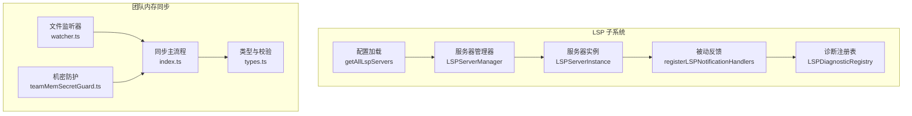
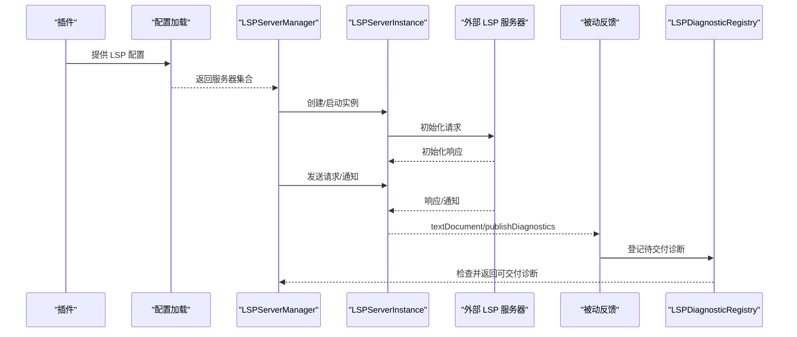
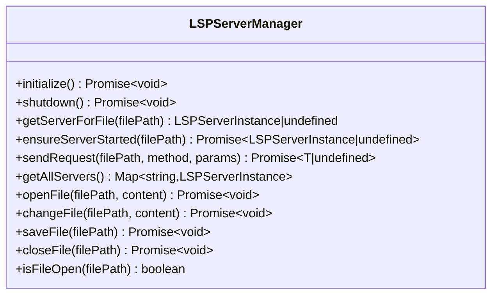
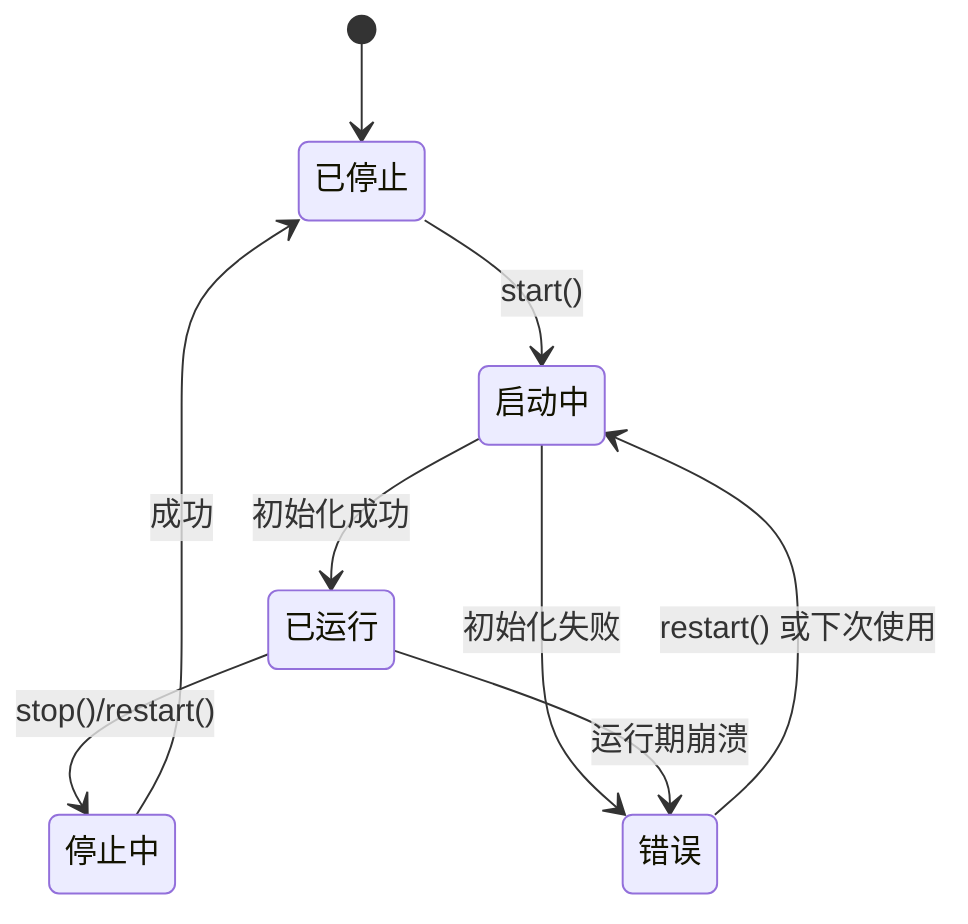
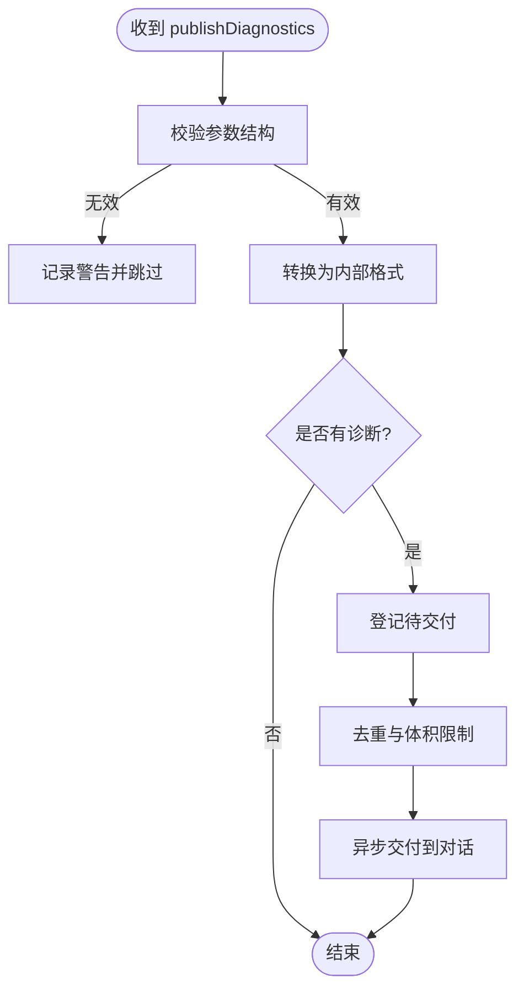
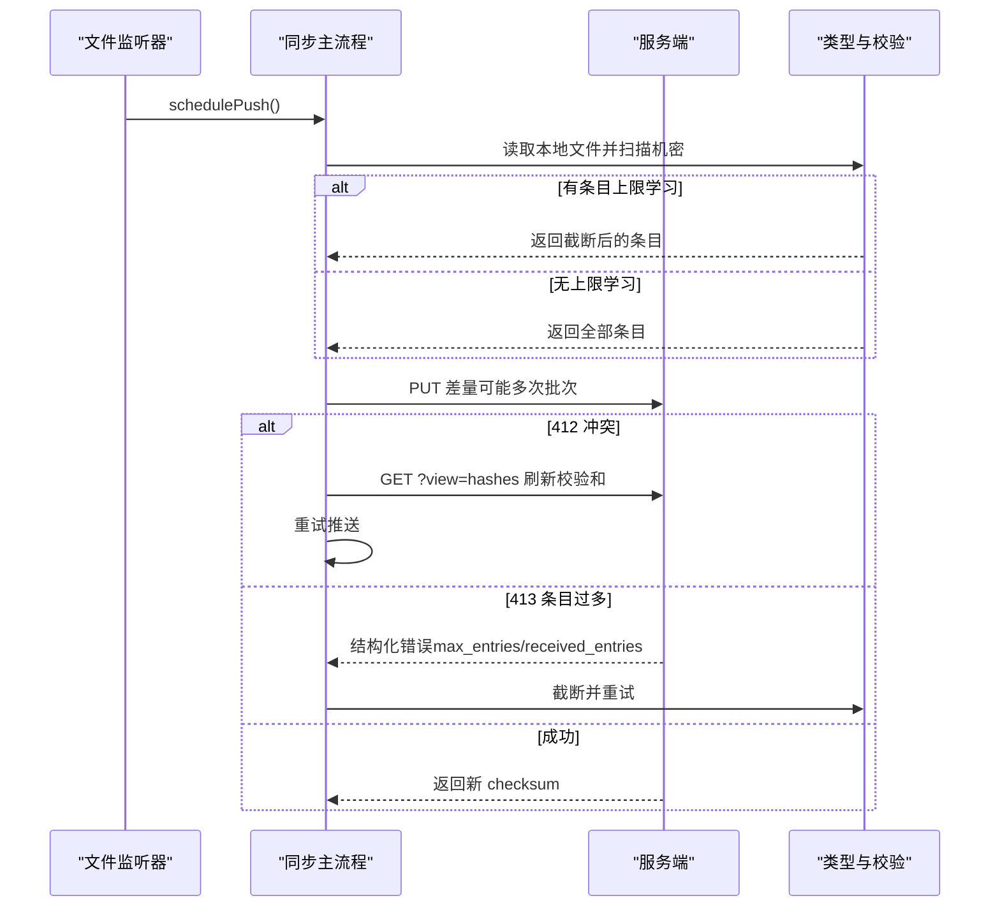
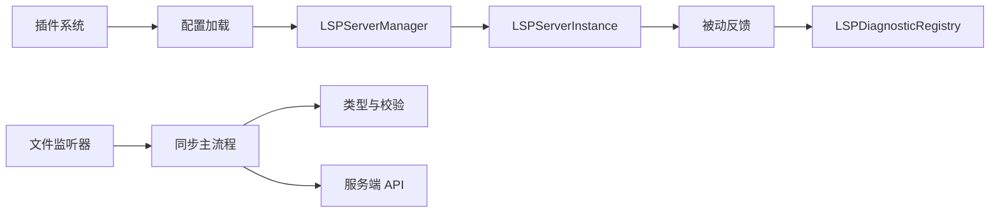

# 协议服务

<cite>
**本文引用的文件**
- [LSPServerManager.ts](file://src/services/lsp/LSPServerManager.ts)
- [LSPServerInstance.ts](file://src/services/lsp/LSPServerInstance.ts)
- [LSPDiagnosticRegistry.ts](file://src/services/lsp/LSPDiagnosticRegistry.ts)
- [passiveFeedback.ts](file://src/services/lsp/passiveFeedback.ts)
- [config.ts](file://src/services/lsp/config.ts)
- [index.ts](file://src/services/teamMemorySync/index.ts)
- [watcher.ts](file://src/services/teamMemorySync/watcher.ts)
- [teamMemSecretGuard.ts](file://src/services/teamMemorySync/teamMemSecretGuard.ts)
- [types.ts](file://src/services/teamMemorySync/types.ts)
</cite>

## 目录
1. [简介](#简介)
2. [项目结构](#项目结构)
3. [核心组件](#核心组件)
4. [架构总览](#架构总览)
5. [详细组件分析](#详细组件分析)
6. [依赖关系分析](#依赖关系分析)
7. [性能考量](#性能考量)
8. [故障排查指南](#故障排查指南)
9. [结论](#结论)

## 简介
本文件系统性梳理 free-code 项目的“协议服务”能力，重点覆盖以下三个方面：
- MCP（Model Context Protocol）服务：仓库中存在大量与 MCP 相关的命令、工具与类型定义，但当前工作区未包含 MCP 服务端或传输层的具体实现代码；因此本节以概念性说明为主，并给出后续扩展建议。
- LSP（Language Server Protocol）集成：提供多语言服务器管理、生命周期控制、请求/通知路由、诊断注册与被动反馈、文件同步等完整能力。
- 团队内存同步机制：实现基于 Git 仓库标识的团队级共享记忆同步，包含拉取/推送、冲突处理、体积与条目限制、安全扫描与机密保护等。

## 项目结构
围绕协议服务的关键模块组织如下：
- LSP 子系统
  - 服务器配置加载：从插件聚合 LSP 配置
  - 服务器实例管理：启动/停止/重启、健康检查、请求重试
  - 服务器管理器：按文件扩展名路由到具体服务器、文件同步（open/change/save/close）
  - 诊断注册与被动反馈：捕获 publishDiagnostics 并异步交付
- 团队内存同步子系统
  - 同步状态与 API 调用：拉取/推送、ETag 条件请求、冲突处理
  - 文件系统操作：本地读取、写入、路径校验、大小限制
  - 安全扫描与机密保护：推送前扫描机密、禁止写入团队内存的机密内容
  - 文件监听器：去抖动推送、抑制策略、恢复逻辑

图示来源
- [config.ts:15-79](file://src/services/lsp/config.ts#L15-L79)
- [LSPServerManager.ts:59-421](file://src/services/lsp/LSPServerManager.ts#L59-L421)
- [LSPServerInstance.ts:90-493](file://src/services/lsp/LSPServerInstance.ts#L90-L493)
- [passiveFeedback.ts:125-329](file://src/services/lsp/passiveFeedback.ts#L125-L329)
- [LSPDiagnosticRegistry.ts:48-387](file://src/services/lsp/LSPDiagnosticRegistry.ts#L48-L387)
- [index.ts:188-800](file://src/services/teamMemorySync/index.ts#L188-L800)
- [watcher.ts:167-305](file://src/services/teamMemorySync/watcher.ts#L167-L305)
- [teamMemSecretGuard.ts:15-44](file://src/services/teamMemorySync/teamMemSecretGuard.ts#L15-L44)
- [types.ts:11-157](file://src/services/teamMemorySync/types.ts#L11-L157)

章节来源
- [config.ts:15-79](file://src/services/lsp/config.ts#L15-L79)
- [LSPServerManager.ts:59-421](file://src/services/lsp/LSPServerManager.ts#L59-L421)
- [LSPServerInstance.ts:90-493](file://src/services/lsp/LSPServerInstance.ts#L90-L493)
- [LSPDiagnosticRegistry.ts:48-387](file://src/services/lsp/LSPDiagnosticRegistry.ts#L48-L387)
- [passiveFeedback.ts:125-329](file://src/services/lsp/passiveFeedback.ts#L125-L329)
- [index.ts:188-800](file://src/services/teamMemorySync/index.ts#L188-L800)
- [watcher.ts:167-305](file://src/services/teamMemorySync/watcher.ts#L167-L305)
- [teamMemSecretGuard.ts:15-44](file://src/services/teamMemorySync/teamMemSecretGuard.ts#L15-L44)
- [types.ts:11-157](file://src/services/teamMemorySync/types.ts#L11-L157)

## 核心组件
- LSP 服务器管理器（LSPServerManager）
  - 职责：加载配置、按扩展名映射服务器、确保服务器启动、发送请求、文件同步（open/change/save/close）、跟踪已打开文件
  - 关键接口：initialize、shutdown、getServerForFile、ensureServerStarted、sendRequest、openFile、changeFile、saveFile、closeFile、isFileOpen
- LSP 服务器实例（LSPServerInstance）
  - 职责：单实例生命周期管理（start/stop/restart）、健康检查、请求重试（针对“内容修改”类瞬时错误）、通知/请求处理器注册
  - 特性：带超时的初始化、指数退避重试、崩溃恢复计数、状态机（stopped/starting/running/stopping/error）
- LSP 诊断注册表与被动反馈（LSPDiagnosticRegistry、passiveFeedback）
  - 职责：接收 LSP publishDiagnostics 通知，进行去重、跨轮次去重、体积限制、排序与截断，最终以附件形式异步交付给对话
  - 被动反馈：在所有服务器上注册 textDocument/publishDiagnostics 处理器，统一转换格式并登记待交付
- 团队内存同步（index.ts、watcher.ts、teamMemSecretGuard.ts、types.ts）
  - 职责：按仓库维度同步团队记忆（服务端/本地双向），支持条件请求（ETag）、冲突处理（412）、批量上传（按字节上限拆分）、条目上限学习与截断、机密扫描与防护
  - 监听器：对团队内存目录递归监听，去抖动触发推送，具备永久失败抑制与恢复逻辑

章节来源
- [LSPServerManager.ts:16-43](file://src/services/lsp/LSPServerManager.ts#L16-L43)
- [LSPServerInstance.ts:33-65](file://src/services/lsp/LSPServerInstance.ts#L33-L65)
- [LSPDiagnosticRegistry.ts:24-39](file://src/services/lsp/LSPDiagnosticRegistry.ts#L24-L39)
- [passiveFeedback.ts:117-124](file://src/services/lsp/passiveFeedback.ts#L117-L124)
- [index.ts:95-127](file://src/services/teamMemorySync/index.ts#L95-L127)
- [watcher.ts:35-51](file://src/services/teamMemorySync/watcher.ts#L35-L51)
- [teamMemSecretGuard.ts:15-44](file://src/services/teamMemorySync/teamMemSecretGuard.ts#L15-L44)
- [types.ts:77-157](file://src/services/teamMemorySync/types.ts#L77-L157)

## 架构总览
下图展示 LSP 与团队内存同步两大协议服务的运行时交互与数据流：

图示来源
- [config.ts:15-79](file://src/services/lsp/config.ts#L15-L79)
- [LSPServerManager.ts:71-148](file://src/services/lsp/LSPServerManager.ts#L71-L148)
- [LSPServerInstance.ts:135-264](file://src/services/lsp/LSPServerInstance.ts#L135-L264)
- [passiveFeedback.ts:125-329](file://src/services/lsp/passiveFeedback.ts#L125-L329)
- [LSPDiagnosticRegistry.ts:65-85](file://src/services/lsp/LSPDiagnosticRegistry.ts#L65-L85)

## 详细组件分析

### LSP 服务器管理器（LSPServerManager）
- 扩展名到服务器映射：根据配置中的 extensionToLanguage 构建映射，支持多服务器处理同一扩展时的优先选择
- 生命周期与健康检查：通过 ensureServerStarted 确保服务器处于 running 状态；openFile/changeFile/saveFile/closeFile 提供文件同步
- 请求路由：sendRequest 自动选择服务器并转发请求，异常时记录并抛出
- 配置请求处理：注册 workspace/configuration 处理器，返回空配置以满足部分服务器的协议需求

图示来源
- [LSPServerManager.ts:16-43](file://src/services/lsp/LSPServerManager.ts#L16-L43)

章节来源
- [LSPServerManager.ts:59-421](file://src/services/lsp/LSPServerManager.ts#L59-L421)

### LSP 服务器实例（LSPServerInstance）
- 状态机与健康检查：stopped/starting/running/stopping/error，isHealthy 仅当 state 为 running 且 client 已初始化
- 请求重试：对 LSP_ERROR_CONTENT_MODIFIED（-32801）进行最多 3 次指数退避重试（基础延迟 500ms）
- 初始化参数：声明客户端能力、工作区信息、兼容旧字段（rootPath/rootUri），避免不必要特性导致服务器行为异常
- 错误处理：捕获启动/停止/请求过程中的异常，设置 state 为 error 并记录 lastError

图示来源
- [LSPServerInstance.ts:74-79](file://src/services/lsp/LSPServerInstance.ts#L74-L79)
- [LSPServerInstance.ts:135-264](file://src/services/lsp/LSPServerInstance.ts#L135-L264)

章节来源
- [LSPServerInstance.ts:90-493](file://src/services/lsp/LSPServerInstance.ts#L90-L493)

### LSP 诊断注册与被动反馈
- 被动反馈：遍历所有服务器实例，注册 textDocument/publishDiagnostics 处理器；对无效参数进行严格校验与日志记录
- 格式转换：将 LSP PublishDiagnosticsParams 转换为内部 DiagnosticFile[]，并映射严重级别
- 注册表：去重（同批与跨轮次）、体积限制（每文件与总量）、排序（按严重级别），最终异步交付

图示来源
- [passiveFeedback.ts:163-278](file://src/services/lsp/passiveFeedback.ts#L163-L278)
- [LSPDiagnosticRegistry.ts:136-184](file://src/services/lsp/LSPDiagnosticRegistry.ts#L136-L184)
- [LSPDiagnosticRegistry.ts:256-289](file://src/services/lsp/LSPDiagnosticRegistry.ts#L256-L289)

章节来源
- [passiveFeedback.ts:117-329](file://src/services/lsp/passiveFeedback.ts#L117-L329)
- [LSPDiagnosticRegistry.ts:48-387](file://src/services/lsp/LSPDiagnosticRegistry.ts#L48-L387)

### 团队内存同步（拉取/推送/监听）
- 拉取（Pull）
  - 支持条件请求（If-None-Match），处理 304/404 场景；解析响应体并提取 checksum/etag
  - 初次启动时强制拉取，确保新仓库能尽快进入可用状态
- 推送（Push）
  - 计算本地内容哈希，与 serverChecksums 对比生成差量；按 MAX_PUT_BODY_BYTES 拆分为多个批次
  - 冲突处理：412 Precondition Failed 时刷新哈希并重试；学习服务器条目上限后截断
  - 结构化 413（too_many_entries）：记录 max_entries 与 received_entries，用于后续截断策略
- 文件系统与安全
  - 读取：遍历目录，过滤超大文件与不可读文件；PSR M22174：扫描机密并跳过上传
  - 写入：路径边界校验、跳过内容一致文件、递归创建父目录
  - 机密防护：FileWriteTool/FileEditTool 输入校验，阻止将机密写入团队内存
- 监听器（Watcher）
  - 递归监听团队内存目录，2 秒去抖动后触发推送；对 no_oauth/no_repo 等永久失败进行抑制，删除文件可清除抑制

图示来源
- [watcher.ts:132-145](file://src/services/teamMemorySync/watcher.ts#L132-L145)
- [index.ts:462-553](file://src/services/teamMemorySync/index.ts#L462-L553)
- [index.ts:556-673](file://src/services/teamMemorySync/index.ts#L556-L673)
- [index.ts:689-755](file://src/services/teamMemorySync/index.ts#L689-L755)
- [types.ts:47-57](file://src/services/teamMemorySync/types.ts#L47-L57)

章节来源
- [index.ts:188-800](file://src/services/teamMemorySync/index.ts#L188-L800)
- [watcher.ts:167-305](file://src/services/teamMemorySync/watcher.ts#L167-L305)
- [teamMemSecretGuard.ts:15-44](file://src/services/teamMemorySync/teamMemSecretGuard.ts#L15-L44)
- [types.ts:77-157](file://src/services/teamMemorySync/types.ts#L77-L157)

## 依赖关系分析
- LSP
  - 配置来源：插件系统（lspPluginIntegration、pluginLoader）
  - 通信层：通过 LSPClient（在 LSPServerInstance 中懒加载）封装底层传输
  - 诊断链路：服务器通知 → 被动反馈处理器 → 诊断注册表 → 对话附件
- 团队内存同步
  - 认证：OAuth 令牌与作用域检查
  - API：基于 axios 的 GET/PUT，支持条件请求与结构化解析
  - 安全：推送前扫描机密，输入校验阻止机密写入

图示来源
- [config.ts:15-79](file://src/services/lsp/config.ts#L15-L79)
- [LSPServerManager.ts:59-148](file://src/services/lsp/LSPServerManager.ts#L59-L148)
- [LSPServerInstance.ts:106-126](file://src/services/lsp/LSPServerInstance.ts#L106-L126)
- [passiveFeedback.ts:125-329](file://src/services/lsp/passiveFeedback.ts#L125-L329)
- [LSPDiagnosticRegistry.ts:48-85](file://src/services/lsp/LSPDiagnosticRegistry.ts#L48-L85)
- [watcher.ts:167-305](file://src/services/teamMemorySync/watcher.ts#L167-L305)
- [index.ts:188-800](file://src/services/teamMemorySync/index.ts#L188-L800)
- [types.ts:11-157](file://src/services/teamMemorySync/types.ts#L11-L157)

章节来源
- [config.ts:15-79](file://src/services/lsp/config.ts#L15-L79)
- [LSPServerManager.ts:59-148](file://src/services/lsp/LSPServerManager.ts#L59-L148)
- [LSPServerInstance.ts:106-126](file://src/services/lsp/LSPServerInstance.ts#L106-L126)
- [passiveFeedback.ts:125-329](file://src/services/lsp/passiveFeedback.ts#L125-L329)
- [LSPDiagnosticRegistry.ts:48-85](file://src/services/lsp/LSPDiagnosticRegistry.ts#L48-L85)
- [watcher.ts:167-305](file://src/services/teamMemorySync/watcher.ts#L167-L305)
- [index.ts:188-800](file://src/services/teamMemorySync/index.ts#L188-L800)
- [types.ts:11-157](file://src/services/teamMemorySync/types.ts#L11-L157)

## 性能考量
- LSP
  - 请求重试与指数退避：对瞬时“内容修改”错误进行有限次数重试，避免阻塞用户交互
  - 初始化超时：可配置 startupTimeout，防止卡死
  - 文件同步：didOpen/didChange 顺序要求严格，需先 open 再 change
- 团队内存同步
  - 批量上传：按 MAX_PUT_BODY_BYTES 拆分，减少单次请求体积
  - 条目上限学习：首次遇到 413 结构化错误后缓存 max_entries，后续推送自动截断
  - 去抖动与抑制：2 秒去抖动降低频繁写入压力；永久失败抑制避免无限重试风暴
  - 路径与 IO：并发写入、mkdir 递归、跳过不变文件，减少磁盘与网络开销

## 故障排查指南
- LSP
  - 服务器无法启动：检查配置 command/args/workspaceFolder/env 是否正确；查看 lastError；确认 maxRestarts 限制
  - 请求失败：确认服务器 isHealthy；关注“内容修改”瞬时错误并观察自动重试日志
  - 诊断未显示：确认被动反馈处理器已注册；检查 formatDiagnosticsForAttachment 是否抛错；查看注册表去重/截断结果
- 团队内存同步
  - 无认证：检查 OAuth 令牌与作用域；isUsingOAuth 返回 false 时不会启用同步
  - 412 冲突：刷新哈希后重试；确认 If-Match 头是否匹配
  - 413 条目过多：等待服务器返回的 max_entries；截断后重试；必要时清理团队内存文件
  - 永久失败抑制：no_oauth/no_repo 等 4xx（非 409/429）会抑制推送，直到删除文件或会话重启
  - 机密扫描：若文件被跳过，检查扫描规则与首条匹配项；修正后再尝试

章节来源
- [LSPServerInstance.ts:142-150](file://src/services/lsp/LSPServerInstance.ts#L142-L150)
- [LSPServerInstance.ts:355-410](file://src/services/lsp/LSPServerInstance.ts#L355-L410)
- [passiveFeedback.ts:168-183](file://src/services/lsp/passiveFeedback.ts#L168-L183)
- [LSPDiagnosticRegistry.ts:256-289](file://src/services/lsp/LSPDiagnosticRegistry.ts#L256-L289)
- [index.ts:151-161](file://src/services/teamMemorySync/index.ts#L151-L161)
- [index.ts:495-500](file://src/services/teamMemorySync/index.ts#L495-L500)
- [index.ts:533-542](file://src/services/teamMemorySync/index.ts#L533-L542)
- [watcher.ts:61-73](file://src/services/teamMemorySync/watcher.ts#L61-L73)
- [watcher.ts:103-117](file://src/services/teamMemorySync/watcher.ts#L103-L117)
- [teamMemSecretGuard.ts:15-44](file://src/services/teamMemorySync/teamMemSecretGuard.ts#L15-L44)

## 结论
本协议服务在 LSP 与团队内存同步两个方向均提供了稳健的工程实现：
- LSP：通过管理器与实例的清晰职责划分，结合被动反馈与诊断注册表，实现了跨语言服务器的统一接入与高质量诊断交付
- 团队内存同步：以条件请求、冲突处理、体积与条目限制、机密扫描为核心，兼顾可靠性与安全性

关于 MCP（Model Context Protocol）服务，当前工作区未包含其服务端或传输层实现代码。建议后续在现有桥接与传输抽象基础上，复用 LSP 的模式（配置加载、实例管理、请求路由、错误处理）来扩展 MCP 能力，并保持与现有插件生态的一致性。