# 工具服务

<cite>
**本文引用的文件**
- [src/tools.ts](file://src/tools.ts)
- [src/Tool.ts](file://src/Tool.ts)
- [src/services/tools/toolOrchestration.ts](file://src/services/tools/toolOrchestration.ts)
- [src/services/tools/StreamingToolExecutor.ts](file://src/services/tools/StreamingToolExecutor.ts)
- [src/services/tools/toolExecution.ts](file://src/services/tools/toolExecution.ts)
- [src/services/notifier.ts](file://src/services/notifier.ts)
- [src/services/tokenEstimation.ts](file://src/services/tokenEstimation.ts)
- [src/query.ts](file://src/query.ts)
- [src/utils/hooks.ts](file://src/utils/hooks.ts)
- [src/constants/tools.ts](file://src/constants/tools.ts)
</cite>

## 目录
1. [简介](#简介)
2. [项目结构](#项目结构)
3. [核心组件](#核心组件)
4. [架构总览](#架构总览)
5. [详细组件分析](#详细组件分析)
6. [依赖关系分析](#依赖关系分析)
7. [性能考量](#性能考量)
8. [故障排查指南](#故障排查指南)
9. [结论](#结论)
10. [附录：开发与集成指南](#附录开发与集成指南)

## 简介
本文件系统性阐述 free-code 的“工具服务”体系，覆盖工具执行器、工具钩子机制、工具编排系统、提示调度器、通知服务与令牌估算功能，并给出工具生命周期管理、错误处理与性能监控的实践建议与可视化图示。目标是帮助开发者快速理解并高效扩展工具生态。

## 项目结构
工具服务由以下层次构成：
- 工具定义与类型系统：统一的工具接口、权限上下文、进度与结果抽象
- 工具池装配：按权限与特性动态组装内置工具与 MCP 工具
- 执行编排：并发/串行调度、流式执行器、上下文传播与中断控制
- 钩子系统：预/后置工具钩子、权限决策钩子、会话钩子等
- 提示调度与查询循环：消息压缩、令牌预算、自动紧凑化与恢复路径
- 通知与估算：跨终端通知通道、令牌计数估算与回退策略

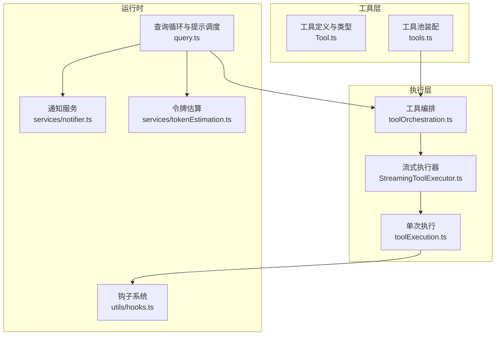

图表来源
- [src/Tool.ts:1-793](file://src/Tool.ts#L1-L793)
- [src/tools.ts:193-390](file://src/tools.ts#L193-L390)
- [src/services/tools/toolOrchestration.ts:19-82](file://src/services/tools/toolOrchestration.ts#L19-L82)
- [src/services/tools/StreamingToolExecutor.ts:40-531](file://src/services/tools/StreamingToolExecutor.ts#L40-L531)
- [src/services/tools/toolExecution.ts:337-490](file://src/services/tools/toolExecution.ts#L337-L490)
- [src/query.ts:219-800](file://src/query.ts#L219-L800)
- [src/utils/hooks.ts:1-800](file://src/utils/hooks.ts#L1-L800)
- [src/services/notifier.ts:18-157](file://src/services/notifier.ts#L18-L157)
- [src/services/tokenEstimation.ts:124-496](file://src/services/tokenEstimation.ts#L124-L496)

章节来源
- [src/tools.ts:193-390](file://src/tools.ts#L193-L390)
- [src/Tool.ts:158-300](file://src/Tool.ts#L158-L300)
- [src/services/tools/toolOrchestration.ts:19-82](file://src/services/tools/toolOrchestration.ts#L19-L82)
- [src/services/tools/StreamingToolExecutor.ts:40-531](file://src/services/tools/StreamingToolExecutor.ts#L40-L531)
- [src/services/tools/toolExecution.ts:337-490](file://src/services/tools/toolExecution.ts#L337-L490)
- [src/query.ts:219-800](file://src/query.ts#L219-L800)
- [src/utils/hooks.ts:1-800](file://src/utils/hooks.ts#L1-L800)
- [src/services/notifier.ts:18-157](file://src/services/notifier.ts#L18-L157)
- [src/services/tokenEstimation.ts:124-496](file://src/services/tokenEstimation.ts#L124-L496)

## 核心组件
- 工具类型与上下文
  - 工具接口定义了输入/输出模式、并发安全、权限校验、进度渲染、结果渲染、中断行为等契约；工具上下文承载运行期状态（消息、文件读写限制、工作目录、权限上下文、回调等）
- 工具池装配
  - 按环境特性与权限规则过滤内置工具，合并 MCP 工具，去重并保持提示缓存稳定顺序
- 工具编排
  - 将连续只读工具批量并发执行，非并发安全工具串行执行；支持上下文修改器在批次间有序应用
- 流式执行器
  - 基于到达顺序的并发控制，保证非并发安全工具独占执行；支持进度消息优先投递、兄弟进程错误级联取消、用户中断策略
- 钩子系统
  - 支持命令型、HTTP 型与函数型钩子；统一解析 JSON 输出、聚合多钩子结果、注入额外上下文、阻断或允许继续
- 提示调度与查询循环
  - 自动紧凑化、微紧凑化、历史裁剪、令牌预算与恢复路径；流式模型调用与工具执行交错
- 通知服务
  - 跨终端通知通道选择与回退，支持 iTerm2/Kitty/Ghostty/bell 等
- 令牌估算
  - API 计数、粗略估算、按文件类型调整、思考块支持、Bedrock/Vi…te 回退策略

章节来源
- [src/Tool.ts:362-695](file://src/Tool.ts#L362-L695)
- [src/tools.ts:271-390](file://src/tools.ts#L271-L390)
- [src/services/tools/toolOrchestration.ts:19-82](file://src/services/tools/toolOrchestration.ts#L19-L82)
- [src/services/tools/StreamingToolExecutor.ts:40-531](file://src/services/tools/StreamingToolExecutor.ts#L40-L531)
- [src/utils/hooks.ts:1-800](file://src/utils/hooks.ts#L1-L800)
- [src/query.ts:219-800](file://src/query.ts#L219-L800)
- [src/services/notifier.ts:18-157](file://src/services/notifier.ts#L18-L157)
- [src/services/tokenEstimation.ts:124-496](file://src/services/tokenEstimation.ts#L124-L496)

## 架构总览
下图展示从查询循环到工具执行的关键交互路径，包括令牌估算、自动紧凑化、流式工具执行与钩子决策。

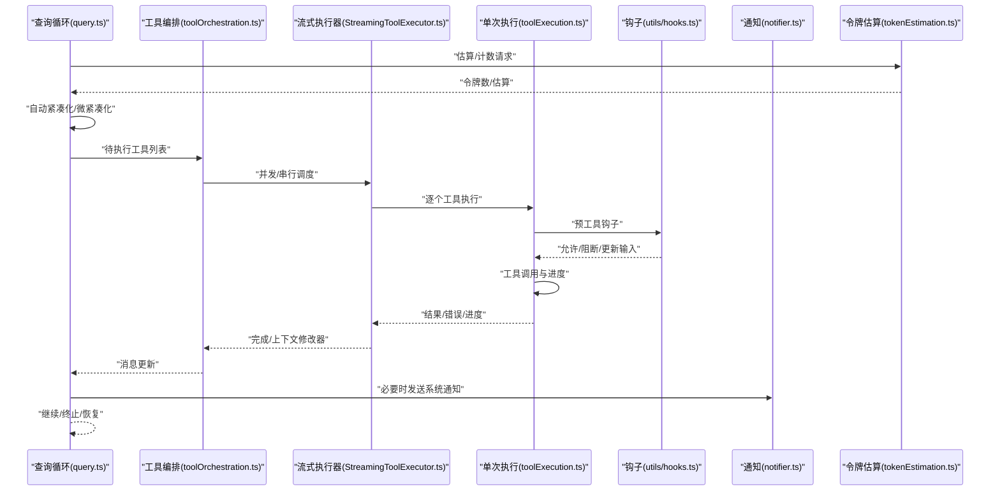

图表来源
- [src/query.ts:219-800](file://src/query.ts#L219-L800)
- [src/services/tools/toolOrchestration.ts:19-82](file://src/services/tools/toolOrchestration.ts#L19-L82)
- [src/services/tools/StreamingToolExecutor.ts:40-531](file://src/services/tools/StreamingToolExecutor.ts#L40-L531)
- [src/services/tools/toolExecution.ts:337-490](file://src/services/tools/toolExecution.ts#L337-L490)
- [src/utils/hooks.ts:1-800](file://src/utils/hooks.ts#L1-L800)
- [src/services/notifier.ts:18-157](file://src/services/notifier.ts#L18-L157)
- [src/services/tokenEstimation.ts:124-496](file://src/services/tokenEstimation.ts#L124-L496)

## 详细组件分析

### 工具定义与生命周期
- 工具契约
  - 输入/输出模式：使用 Zod 或 JSON Schema 描述
  - 并发安全：isConcurrencySafe 控制是否可并发
  - 权限校验：validateInput + checkPermissions
  - 生命周期钩子：renderToolUseMessage/renderToolResultMessage/进度渲染
  - 中断行为：interruptBehavior 控制用户打断策略
- 工具上下文
  - 携带消息、文件读写限制、工作目录、权限上下文、回调（进度、通知、JSX 渲染）等
- 生命周期阶段
  - 解析输入 → 校验 → 钩子决策 → 工具调用 → 结果处理 → 进度/结果渲染 → 上下文修改器应用

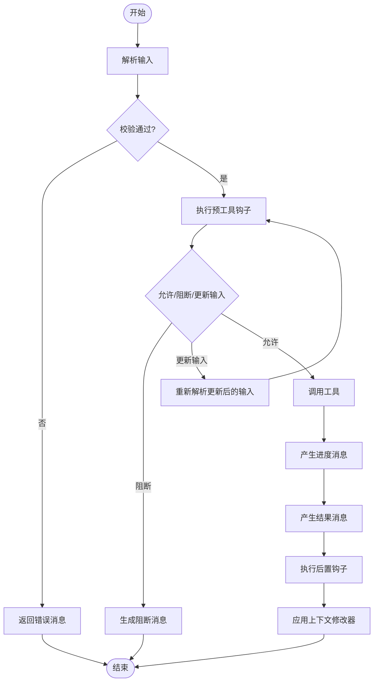

图表来源
- [src/Tool.ts:362-695](file://src/Tool.ts#L362-L695)
- [src/services/tools/toolExecution.ts:599-750](file://src/services/tools/toolExecution.ts#L599-L750)

章节来源
- [src/Tool.ts:362-695](file://src/Tool.ts#L362-L695)
- [src/services/tools/toolExecution.ts:599-750](file://src/services/tools/toolExecution.ts#L599-L750)

### 工具池装配与权限过滤
- 动态装配
  - 按特性开关与环境变量启用/禁用工具
  - 合并 MCP 工具并按权限规则过滤
  - 去重策略：内置工具优先，名称排序以稳定提示缓存
- 权限过滤
  - 基于 deny 规则与权限上下文过滤工具
  - REPL 模式隐藏原语工具，保留封装工具

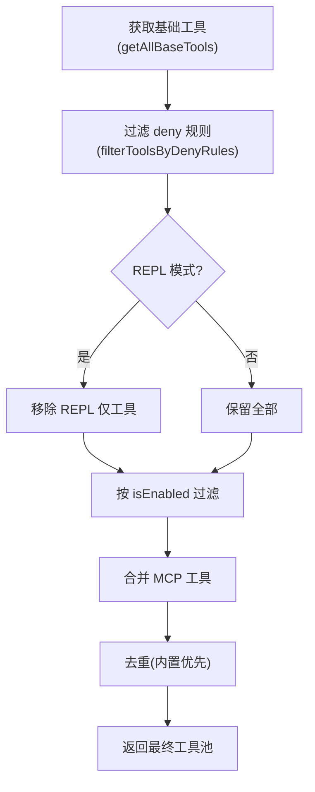

图表来源
- [src/tools.ts:193-390](file://src/tools.ts#L193-L390)
- [src/constants/tools.ts:36-113](file://src/constants/tools.ts#L36-L113)

章节来源
- [src/tools.ts:193-390](file://src/tools.ts#L193-L390)
- [src/constants/tools.ts:36-113](file://src/constants/tools.ts#L36-L113)

### 工具编排与并发策略
- 分批策略
  - 连续只读工具组成批次并发执行
  - 非并发安全工具单独串行执行
- 上下文修改器
  - 并发安全批次不支持修改器；串行批次在完成后顺序应用修改器
- 并发上限
  - 可通过环境变量配置最大并发数

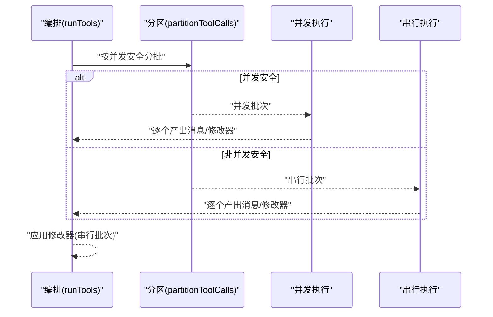

图表来源
- [src/services/tools/toolOrchestration.ts:19-82](file://src/services/tools/toolOrchestration.ts#L19-L82)

章节来源
- [src/services/tools/toolOrchestration.ts:19-82](file://src/services/tools/toolOrchestration.ts#L19-L82)

### 流式执行器与中断控制
- 并发控制
  - 非并发安全工具独占执行；并发安全工具与同质并发工具可并行
- 进度优先
  - 进度消息优先投递，确保 UI 实时反馈
- 兄弟进程级联
  - Bash 错误触发 siblingAbortController，级联取消其他兄弟进程
- 用户中断
  - 根据工具中断行为决定取消或阻塞
- 弃用与收尾
  - 流式回退时丢弃未完成结果；等待剩余任务完成并产出最终消息

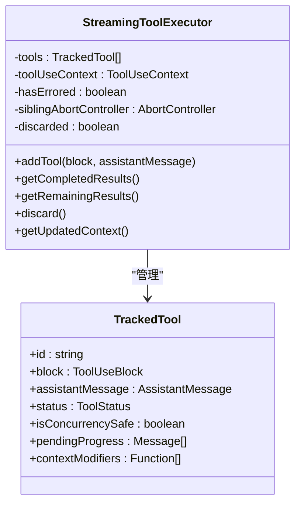

图表来源
- [src/services/tools/StreamingToolExecutor.ts:40-531](file://src/services/tools/StreamingToolExecutor.ts#L40-L531)

章节来源
- [src/services/tools/StreamingToolExecutor.ts:40-531](file://src/services/tools/StreamingToolExecutor.ts#L40-L531)

### 钩子机制与权限决策
- 钩子类型
  - 命令型、HTTP 型、函数型钩子；支持同步/异步输出
- 统一输出解析
  - JSON Schema 校验，提取 continue/stopReason/permissionDecision/updatedInput 等字段
- 多钩子聚合
  - 聚合阻止/允许/阻断原因，注入附加上下文，支持 watchPaths、retry 等
- 与工具执行的协作
  - 预工具钩子可更新输入、阻断执行；后置钩子用于记录与上下文扩展

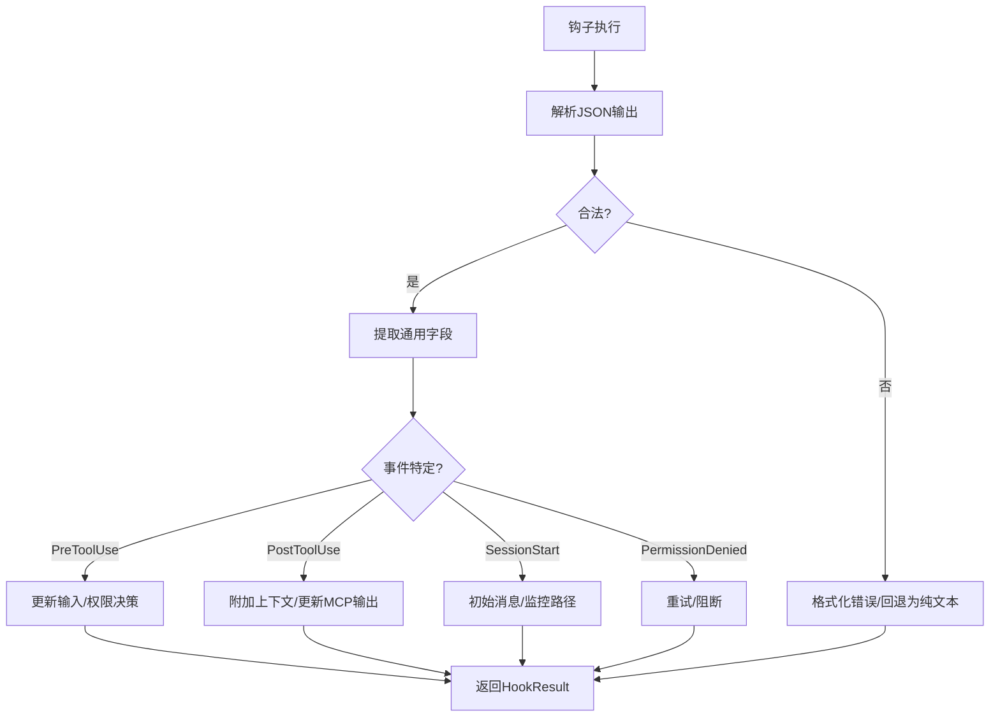

图表来源
- [src/utils/hooks.ts:382-737](file://src/utils/hooks.ts#L382-L737)

章节来源
- [src/utils/hooks.ts:1-800](file://src/utils/hooks.ts#L1-L800)

### 提示调度器与自动紧凑化
- 微紧凑化与自动紧凑化
  - 在每次迭代前进行微紧凑化，必要时触发自动紧凑化并产出摘要消息
- 历史裁剪
  - 历史裁剪减少上下文占用，结合令牌估算避免过长提示
- 令牌预算与恢复
  - 令牌预算跟踪与恢复路径（如最大输出令牌错误）在查询循环中处理

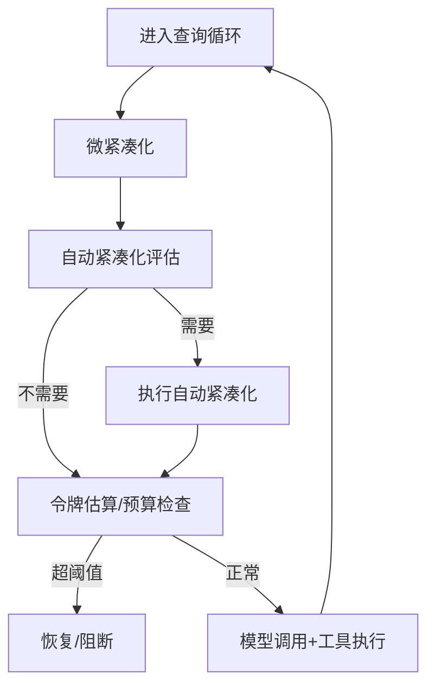

图表来源
- [src/query.ts:412-543](file://src/query.ts#L412-L543)
- [src/query.ts:628-648](file://src/query.ts#L628-L648)

章节来源
- [src/query.ts:219-800](file://src/query.ts#L219-L800)

### 通知服务
- 通道选择
  - auto 模式根据终端类型选择 iTerm2/Kitty/Ghostty/bell；也可显式指定
- 回退与降级
  - Apple Terminal 铃声关闭时回退为 bell；失败时记录日志
- 钩子集成
  - 发送前执行通知钩子，便于统一策略

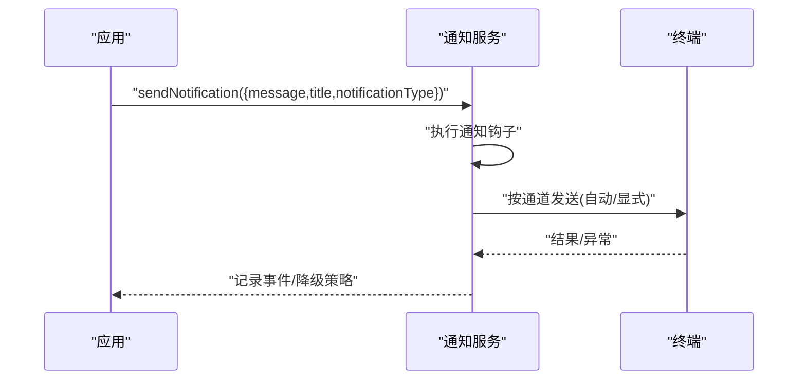

图表来源
- [src/services/notifier.ts:18-157](file://src/services/notifier.ts#L18-L157)

章节来源
- [src/services/notifier.ts:18-157](file://src/services/notifier.ts#L18-L157)

### 令牌估算与回退
- API 计数
  - 使用当前主循环模型与可用 beta 列表进行精确计数；支持思考块
- 粗略估算
  - 基于字符/字节估算，按文件类型调整（JSON 更接近 2 字节/token）
- Bedrock/Vi…te 回退
  - 不支持 countTokens 时使用小模型回退请求；剥离工具搜索相关字段
- 附件与内容块
  - 文本/图像/工具结果/思考块分别估算，图像按固定上限估算

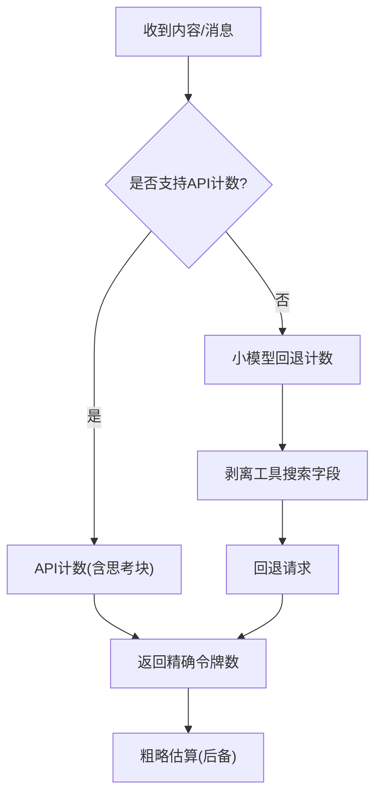

图表来源
- [src/services/tokenEstimation.ts:124-496](file://src/services/tokenEstimation.ts#L124-L496)

章节来源
- [src/services/tokenEstimation.ts:124-496](file://src/services/tokenEstimation.ts#L124-L496)

## 依赖关系分析
- 工具层依赖
  - 工具定义依赖类型系统、消息类型、权限类型、进度类型、主题与系统提示类型
  - 工具池装配依赖特性开关、环境变量、权限规则与工具能力检测
- 执行层依赖
  - 编排依赖工具定义与并发工具集；流式执行器依赖工具定义、钩子系统与消息工具
- 查询循环依赖
  - 令牌估算、紧凑化、通知、工具执行器与钩子系统

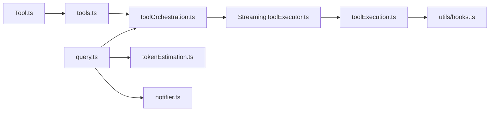

图表来源
- [src/Tool.ts:1-793](file://src/Tool.ts#L1-L793)
- [src/tools.ts:193-390](file://src/tools.ts#L193-L390)
- [src/services/tools/toolOrchestration.ts:19-82](file://src/services/tools/toolOrchestration.ts#L19-L82)
- [src/services/tools/StreamingToolExecutor.ts:40-531](file://src/services/tools/StreamingToolExecutor.ts#L40-L531)
- [src/services/tools/toolExecution.ts:337-490](file://src/services/tools/toolExecution.ts#L337-L490)
- [src/query.ts:219-800](file://src/query.ts#L219-L800)
- [src/utils/hooks.ts:1-800](file://src/utils/hooks.ts#L1-L800)
- [src/services/tokenEstimation.ts:124-496](file://src/services/tokenEstimation.ts#L124-L496)
- [src/services/notifier.ts:18-157](file://src/services/notifier.ts#L18-L157)

章节来源
- [src/Tool.ts:1-793](file://src/Tool.ts#L1-L793)
- [src/tools.ts:193-390](file://src/tools.ts#L193-L390)
- [src/services/tools/toolOrchestration.ts:19-82](file://src/services/tools/toolOrchestration.ts#L19-L82)
- [src/services/tools/StreamingToolExecutor.ts:40-531](file://src/services/tools/StreamingToolExecutor.ts#L40-L531)
- [src/services/tools/toolExecution.ts:337-490](file://src/services/tools/toolExecution.ts#L337-L490)
- [src/query.ts:219-800](file://src/query.ts#L219-L800)
- [src/utils/hooks.ts:1-800](file://src/utils/hooks.ts#L1-L800)
- [src/services/tokenEstimation.ts:124-496](file://src/services/tokenEstimation.ts#L124-L496)
- [src/services/notifier.ts:18-157](file://src/services/notifier.ts#L18-L157)

## 性能考量
- 并发与吞吐
  - 并发安全工具批量并发执行，显著提升吞吐；通过环境变量控制最大并发
- 令牌与成本
  - 令牌估算与自动紧凑化降低上下文长度，减少 API 成本与延迟
- 流式体验
  - 进度消息优先投递，兄弟进程级联取消避免无效计算
- 回退与稳定性
  - API 计数失败时的回退策略与错误分类，保障系统鲁棒性

## 故障排查指南
- 工具执行错误
  - 输入验证失败：查看 Zod 格式化错误与“模式未发送提示”
  - 权限阻断：检查钩子输出与权限决策原因
  - 工具不存在：确认工具名与别名映射
- 流式回退
  - 流式回退时丢弃旧结果并重建执行器，确保后续响应一致性
- 令牌问题
  - API 计数异常或回退失败：检查模型/beta/提供商配置
- 通知问题
  - 通道不可用或终端设置冲突：自动回退为 bell 或禁用

章节来源
- [src/services/tools/toolExecution.ts:578-597](file://src/services/tools/toolExecution.ts#L578-L597)
- [src/services/tools/StreamingToolExecutor.ts:69-71](file://src/services/tools/StreamingToolExecutor.ts#L69-L71)
- [src/services/tokenEstimation.ts:196-200](file://src/services/tokenEstimation.ts#L196-L200)
- [src/services/notifier.ts:77-104](file://src/services/notifier.ts#L77-L104)

## 结论
该工具服务以“强契约工具 + 流式编排 + 钩子治理 + 提示调度”为核心，实现了高并发、可观测、可扩展的工具生态。通过严格的权限与错误处理、灵活的通知与估算策略，既满足复杂场景需求，又兼顾易用性与稳定性。

## 附录：开发与集成指南
- 开发新工具
  - 使用工具构建器定义输入/输出、并发安全、权限校验、进度与渲染方法
  - 通过工具上下文访问消息、文件限制、权限上下文与回调
- 集成 MCP 工具
  - 在工具池装配中合并 MCP 工具，注意名称规范化与权限过滤
- 使用钩子
  - 在预/后置钩子中注入上下文、更新输入或阻断执行；遵循 JSON 输出规范
- 优化性能
  - 合理标记并发安全；控制最大并发；利用自动紧凑化与令牌估算
- 监控与诊断
  - 关注工具执行与钩子耗时统计、错误分类与通知通道使用情况

章节来源
- [src/Tool.ts:783-792](file://src/Tool.ts#L783-L792)
- [src/tools.ts:345-367](file://src/tools.ts#L345-L367)
- [src/utils/hooks.ts:382-737](file://src/utils/hooks.ts#L382-L737)
- [src/services/tokenEstimation.ts:124-496](file://src/services/tokenEstimation.ts#L124-L496)