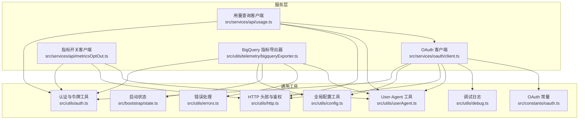
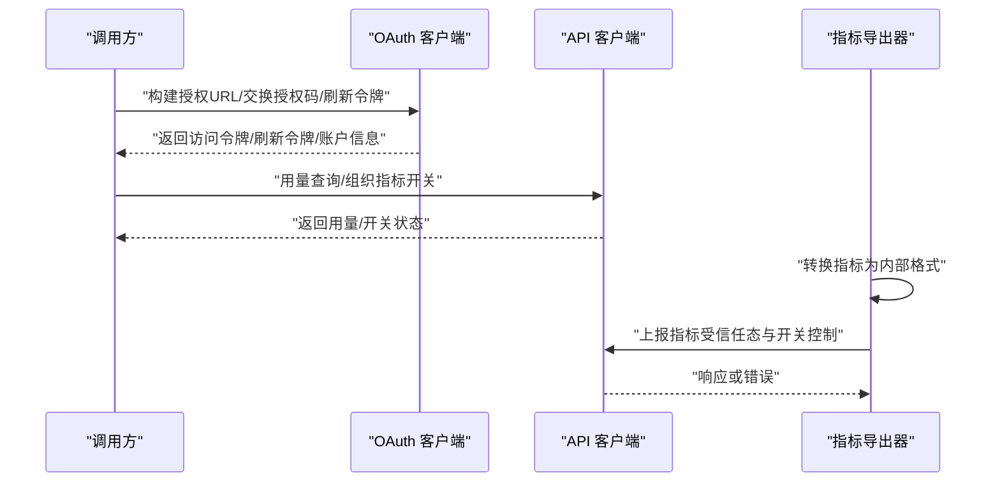
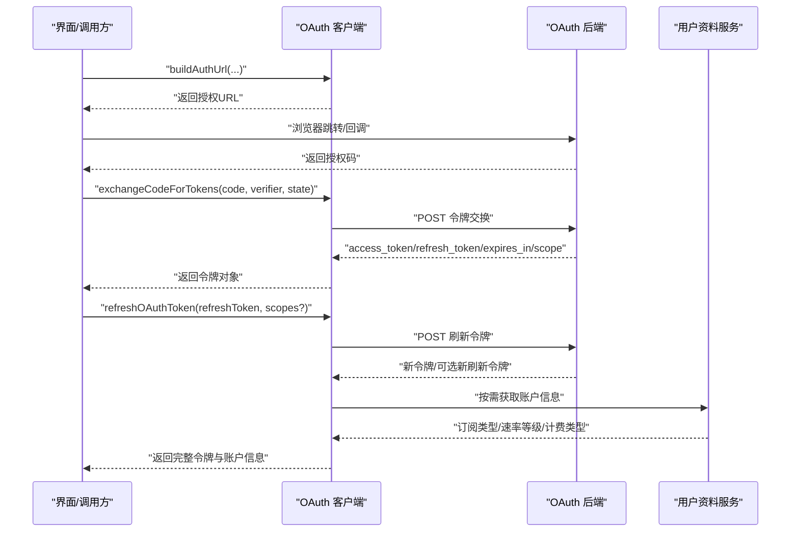
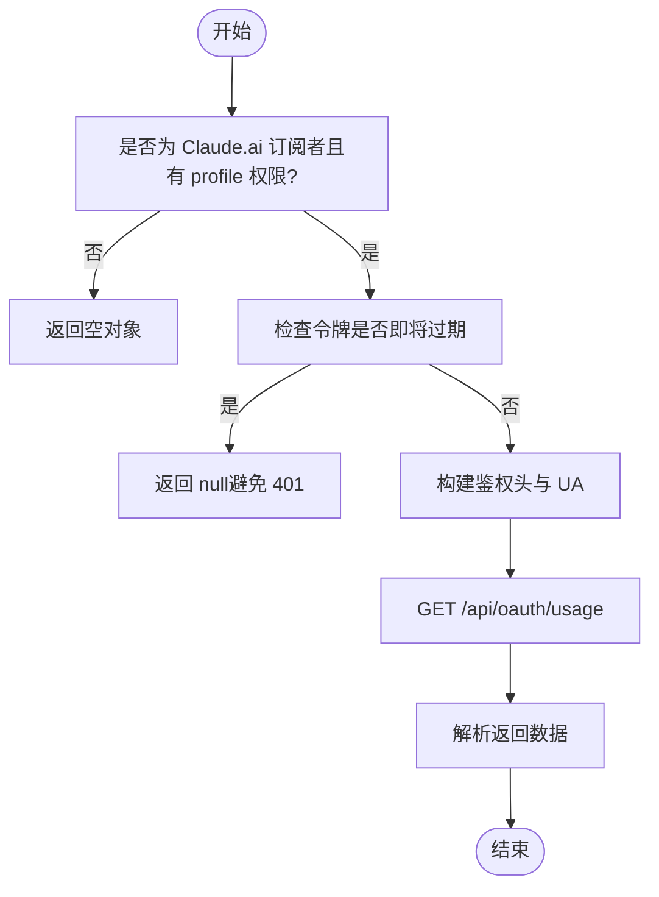
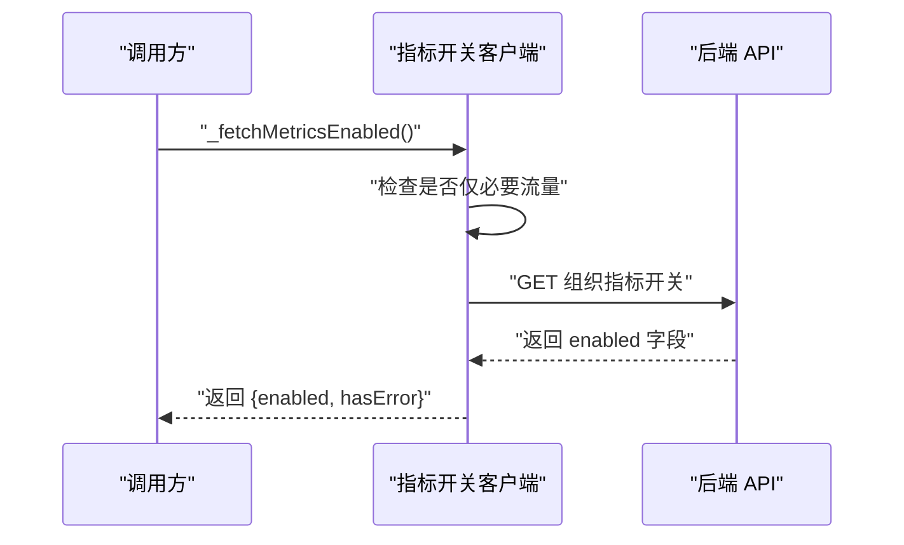
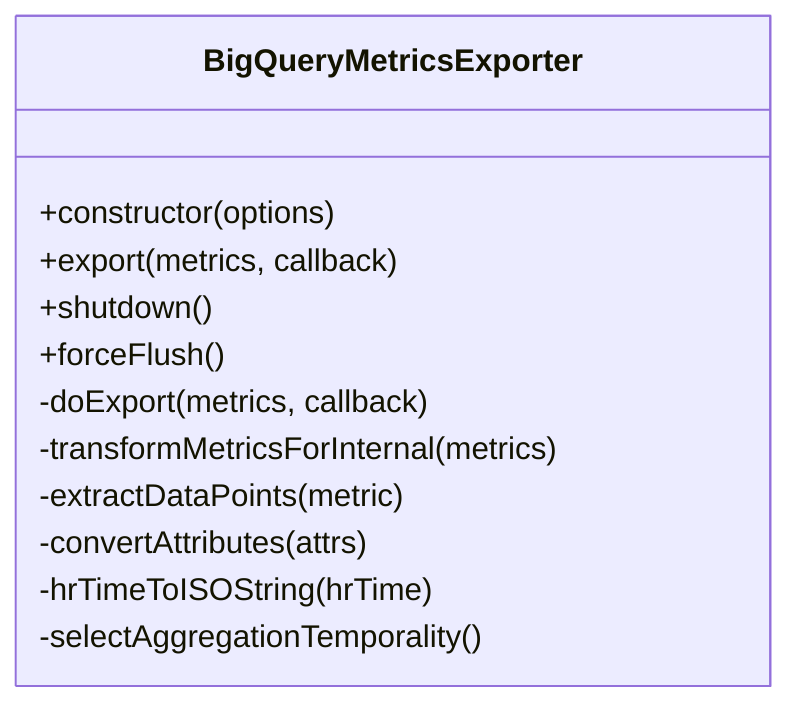
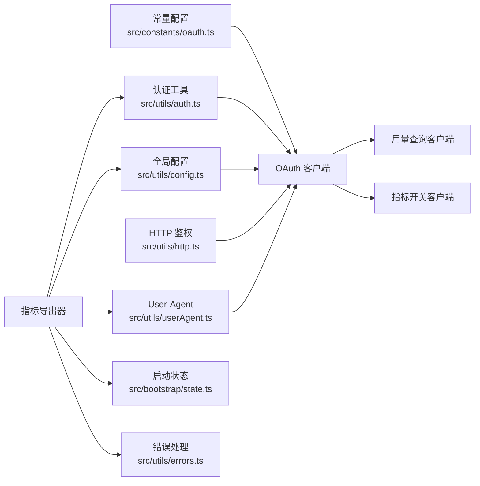

# 服务层架构

<cite>
**本文引用的文件**
- [src/services/oauth/client.ts](file://src/services/oauth/client.ts)
- [src/services/api/usage.ts](file://src/services/api/usage.ts)
- [src/utils/telemetry/bigqueryExporter.ts](file://src/utils/telemetry/bigqueryExporter.ts)
- [src/services/api/metricsOptOut.ts](file://src/services/api/metricsOptOut.ts)
- [src/services/oauth/getOauthProfile.ts](file://src/services/oauth/getOauthProfile.ts)
- [src/constants/oauth.ts](file://src/constants/oauth.ts)
- [src/utils/auth.ts](file://src/utils/auth.ts)
- [src/utils/config.ts](file://src/utils/config.ts)
- [src/utils/http.ts](file://src/utils/http.ts)
- [src/utils/userAgent.ts](file://src/utils/userAgent.ts)
- [src/utils/debug.ts](file://src/utils/debug.ts)
- [src/utils/errors.ts](file://src/utils/errors.ts)
- [src/bootstrap/state.ts](file://src/bootstrap/state.ts)
</cite>

## 目录
1. [简介](#简介)
2. [项目结构](#项目结构)
3. [核心组件](#核心组件)
4. [架构总览](#架构总览)
5. [组件详解](#组件详解)
6. [依赖关系分析](#依赖关系分析)
7. [性能与可靠性](#性能与可靠性)
8. [故障排查指南](#故障排查指南)
9. [结论](#结论)
10. [附录：最佳实践与扩展建议](#附录最佳实践与扩展建议)

## 简介
本文件系统性梳理 free-code 的服务层架构，重点覆盖以下方面：
- API 客户端设计与使用方法
- OAuth 认证流程（授权码、刷新、角色与账户信息获取）
- 分析监控服务（指标采集、转换与上报）
- 各服务职责划分、接口设计与集成方式
- 错误处理与重试策略
- OAuth 配置与管理要点
- 数据收集与报告机制
- 扩展与自定义的最佳实践

## 项目结构
服务层主要分布在以下模块：
- oauth：OAuth 客户端、授权码交换、令牌刷新、角色与账户信息获取
- api：组织级指标开关、用量查询等 API 客户端
- analytics：事件埋点（用于 OAuth 相关流程的遥测）
- telemetry：基于 OpenTelemetry 的指标导出器（BigQuery）

图表来源
- [src/services/oauth/client.ts:1-567](file://src/services/oauth/client.ts#L1-L567)
- [src/services/api/usage.ts:1-64](file://src/services/api/usage.ts#L1-L64)
- [src/utils/telemetry/bigqueryExporter.ts:1-253](file://src/utils/telemetry/bigqueryExporter.ts#L1-L253)
- [src/services/api/metricsOptOut.ts:32-75](file://src/services/api/metricsOptOut.ts#L32-L75)
- [src/constants/oauth.ts](file://src/constants/oauth.ts)
- [src/utils/auth.ts](file://src/utils/auth.ts)
- [src/utils/config.ts](file://src/utils/config.ts)
- [src/utils/http.ts](file://src/utils/http.ts)
- [src/utils/userAgent.ts](file://src/utils/userAgent.ts)
- [src/utils/debug.ts](file://src/utils/debug.ts)
- [src/utils/errors.ts](file://src/utils/errors.ts)
- [src/bootstrap/state.ts](file://src/bootstrap/state.ts)

章节来源
- [src/services/oauth/client.ts:1-567](file://src/services/oauth/client.ts#L1-L567)
- [src/services/api/usage.ts:1-64](file://src/services/api/usage.ts#L1-L64)
- [src/utils/telemetry/bigqueryExporter.ts:1-253](file://src/utils/telemetry/bigqueryExporter.ts#L1-L253)
- [src/services/api/metricsOptOut.ts:32-75](file://src/services/api/metricsOptOut.ts#L32-L75)

## 核心组件
- OAuth 客户端：负责构建授权 URL、交换授权码、刷新令牌、获取用户角色与账户信息，并进行订阅类型与限额等级的解析与缓存。
- 用量查询客户端：在满足订阅与权限条件下，调用后端用量接口并返回多模型维度的使用率与重置时间等信息。
- 指标开关客户端：检查组织级指标上报开关，支持非必要流量抑制与 401/403 处理。
- BigQuery 指标导出器：将 OpenTelemetry 指标转换为内部格式并上报，具备信任态校验、并发导出队列与优雅停机。

章节来源
- [src/services/oauth/client.ts:34-445](file://src/services/oauth/client.ts#L34-L445)
- [src/services/api/usage.ts:33-63](file://src/services/api/usage.ts#L33-L63)
- [src/services/api/metricsOptOut.ts:32-75](file://src/services/api/metricsOptOut.ts#L32-L75)
- [src/utils/telemetry/bigqueryExporter.ts:40-148](file://src/utils/telemetry/bigqueryExporter.ts#L40-L148)

## 架构总览
下图展示了服务层关键交互：OAuth 客户端与 API 客户端通过统一的鉴权头与用户代理参与请求；指标导出器在满足信任态与组织开关的前提下，将指标数据上报至内部接口。

图表来源
- [src/services/oauth/client.ts:46-105](file://src/services/oauth/client.ts#L46-L105)
- [src/services/api/usage.ts:33-63](file://src/services/api/usage.ts#L33-L63)
- [src/utils/telemetry/bigqueryExporter.ts:63-148](file://src/utils/telemetry/bigqueryExporter.ts#L63-L148)

## 组件详解

### OAuth 客户端
职责与能力
- 构建授权 URL（支持 Claude.ai 与控制台、PKCE、state、登录提示与方法等参数）
- 授权码交换为令牌
- 刷新访问令牌（支持作用域扩展）
- 获取用户角色与组织角色信息
- 创建并保存 API Key
- 解析订阅类型、速率等级、计费类型与额外用量开关
- 账户信息缓存与去重更新
- 过期检测与事件埋点

关键流程
- 授权码交换与刷新：包含超时与状态码校验、失败事件记录
- 角色与账户信息：按需拉取并持久化到全局配置
- 订阅类型推断：依据组织类型映射为订阅类型

图表来源
- [src/services/oauth/client.ts:46-105](file://src/services/oauth/client.ts#L46-L105)
- [src/services/oauth/client.ts:107-144](file://src/services/oauth/client.ts#L107-L144)
- [src/services/oauth/client.ts:146-274](file://src/services/oauth/client.ts#L146-L274)
- [src/services/oauth/client.ts:355-420](file://src/services/oauth/client.ts#L355-L420)

章节来源
- [src/services/oauth/client.ts:34-445](file://src/services/oauth/client.ts#L34-L445)

### 用量查询客户端
职责与能力
- 在满足订阅者身份与 profile 权限时发起用量查询
- 避免过期令牌导致的 401，提前返回空值
- 使用统一鉴权头与用户代理
- 返回多模型维度的使用率与重置时间

图表来源
- [src/services/api/usage.ts:33-63](file://src/services/api/usage.ts#L33-L63)

章节来源
- [src/services/api/usage.ts:1-64](file://src/services/api/usage.ts#L1-L64)

### 指标开关客户端
职责与能力
- 查询组织级指标上报开关
- 支持“仅必要流量”模式下的快速失败
- 对 401/403 场景进行重试策略适配
- 记录调试日志与错误

图表来源
- [src/services/api/metricsOptOut.ts:32-75](file://src/services/api/metricsOptOut.ts#L32-L75)

章节来源
- [src/services/api/metricsOptOut.ts:32-75](file://src/services/api/metricsOptOut.ts#L32-L75)

### BigQuery 指标导出器
职责与能力
- 将 OpenTelemetry 指标转换为内部格式
- 注入资源属性（服务名、版本、OS、架构、聚合时序等）
- 基于订阅类型注入客户类型与订阅类型
- 受信任态与组织开关双重控制
- 并发导出队列与优雅停机

图表来源
- [src/utils/telemetry/bigqueryExporter.ts:40-253](file://src/utils/telemetry/bigqueryExporter.ts#L40-L253)

章节来源
- [src/utils/telemetry/bigqueryExporter.ts:1-253](file://src/utils/telemetry/bigqueryExporter.ts#L1-L253)

### 用户资料与账户信息
- 从令牌解析用户资料，推断订阅类型与速率等级
- 缓存账户 UUID、邮箱、组织 UUID、显示名、额外用量开关、计费类型、创建时间等
- 提供组织 UUID 查询与账户信息填充逻辑

章节来源
- [src/services/oauth/client.ts:355-420](file://src/services/oauth/client.ts#L355-L420)
- [src/services/oauth/client.ts:422-515](file://src/services/oauth/client.ts#L422-L515)

## 依赖关系分析
- OAuth 客户端依赖常量配置、认证工具、全局配置、HTTP 鉴权、用户代理与调试日志
- 用量查询客户端依赖 OAuth 令牌状态与鉴权头生成
- 指标导出器依赖组织开关、信任态、错误处理与用户代理
- 指标导出器与用量查询客户端共同依赖统一的鉴权头与 UA

图表来源
- [src/constants/oauth.ts](file://src/constants/oauth.ts)
- [src/utils/auth.ts](file://src/utils/auth.ts)
- [src/utils/config.ts](file://src/utils/config.ts)
- [src/utils/http.ts](file://src/utils/http.ts)
- [src/utils/userAgent.ts](file://src/utils/userAgent.ts)
- [src/services/oauth/client.ts:1-567](file://src/services/oauth/client.ts#L1-L567)
- [src/services/api/usage.ts:1-64](file://src/services/api/usage.ts#L1-L64)
- [src/services/api/metricsOptOut.ts:32-75](file://src/services/api/metricsOptOut.ts#L32-L75)
- [src/utils/telemetry/bigqueryExporter.ts:1-253](file://src/utils/telemetry/bigqueryExporter.ts#L1-L253)
- [src/bootstrap/state.ts](file://src/bootstrap/state.ts)
- [src/utils/errors.ts](file://src/utils/errors.ts)

## 性能与可靠性
- 超时与重试
  - OAuth 令牌交换与刷新设置合理超时，失败时记录事件并抛出错误
  - 指标开关客户端对 401/403 场景采用带重试的封装
  - 用量查询在令牌即将过期时避免无效请求
- 并发与优雅停机
  - 指标导出器维护待完成导出任务列表，shutdown 时等待完成
- 资源属性与聚合时序
  - 导出器固定使用 Delta 聚合以保证仪表盘正确性
- 信任态与开关
  - 非交互会话与信任对话框接受前跳过指标上报，降低噪声

章节来源
- [src/services/oauth/client.ts:130-144](file://src/services/oauth/client.ts#L130-L144)
- [src/services/oauth/client.ts:165-173](file://src/services/oauth/client.ts#L165-L173)
- [src/services/api/metricsOptOut.ts:62-64](file://src/services/api/metricsOptOut.ts#L62-L64)
- [src/services/api/usage.ts:38-42](file://src/services/api/usage.ts#L38-L42)
- [src/utils/telemetry/bigqueryExporter.ts:215-224](file://src/utils/telemetry/bigqueryExporter.ts#L215-L224)
- [src/utils/telemetry/bigqueryExporter.ts:246-251](file://src/utils/telemetry/bigqueryExporter.ts#L246-L251)

## 故障排查指南
- OAuth 令牌交换失败
  - 检查授权码是否有效、redirect_uri 是否匹配、PKCE 参数是否正确
  - 关注 401 与状态码差异，查看事件埋点与错误日志
- 令牌刷新失败
  - 确认刷新令牌有效与作用域范围；注意后端允许作用域扩展
  - 查看失败事件埋点与响应体
- 用量查询为空
  - 确认订阅者身份与 profile 权限；检查令牌过期缓冲
- 指标上报失败
  - 检查信任态与组织开关；确认鉴权头可用与网络可达
  - 查看导出器回调中的错误码与日志

章节来源
- [src/services/oauth/client.ts:135-141](file://src/services/oauth/client.ts#L135-L141)
- [src/services/oauth/client.ts:264-272](file://src/services/oauth/client.ts#L264-L272)
- [src/services/api/usage.ts:34-42](file://src/services/api/usage.ts#L34-L42)
- [src/utils/telemetry/bigqueryExporter.ts:114-122](file://src/utils/telemetry/bigqueryExporter.ts#L114-L122)
- [src/utils/telemetry/bigqueryExporter.ts:140-147](file://src/utils/telemetry/bigqueryExporter.ts#L140-L147)

## 结论
该服务层围绕 OAuth 与指标两大主线构建：OAuth 客户端提供完整的授权与令牌生命周期管理；API 客户端在订阅者与权限前提下提供用量与组织级指标开关；指标导出器以标准化方式将运行指标安全、可靠地上报。整体设计强调可观察性、可扩展性与健壮性。

## 附录：最佳实践与扩展建议
- OAuth
  - 始终使用 PKCE（S256）与 state 参数，严格校验 redirect_uri
  - 在刷新令牌时显式声明所需作用域，利用后端的作用域扩展能力
  - 对令牌过期进行缓冲判断，避免频繁无效请求
- API 客户端
  - 统一使用鉴权头与用户代理，确保可观测性与合规
  - 对敏感错误（如 401/403）进行幂等重试与降级处理
- 指标导出
  - 保持 Delta 聚合一致性，避免影响仪表盘统计
  - 在非交互会话与未建立信任态时跳过上报，减少噪音
- 可扩展性
  - 新增服务时复用统一鉴权头与用户代理工具
  - 引入事件埋点记录关键路径，便于排障与审计
  - 对外部依赖（网络、第三方 API）增加超时与退避策略