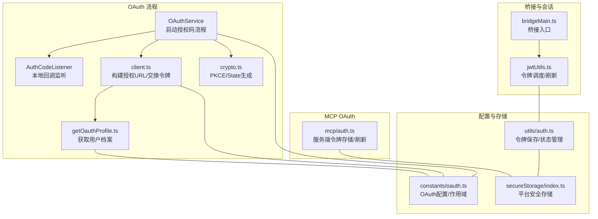
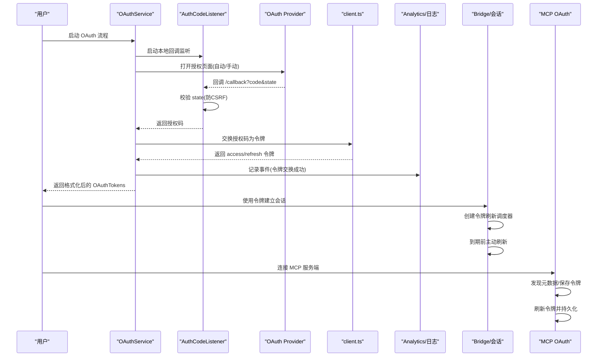
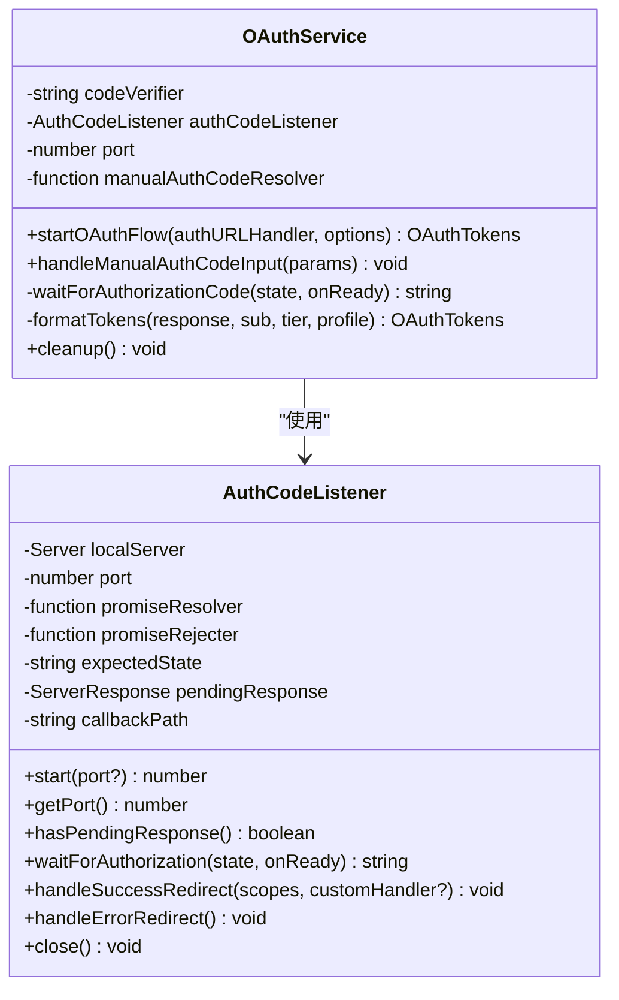
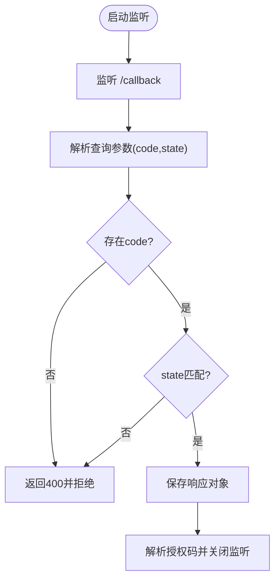
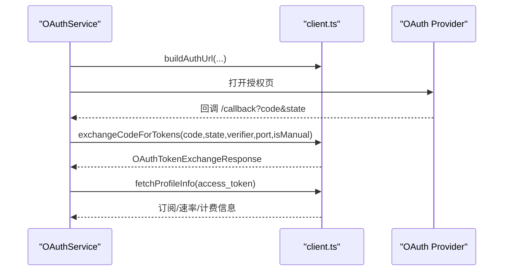
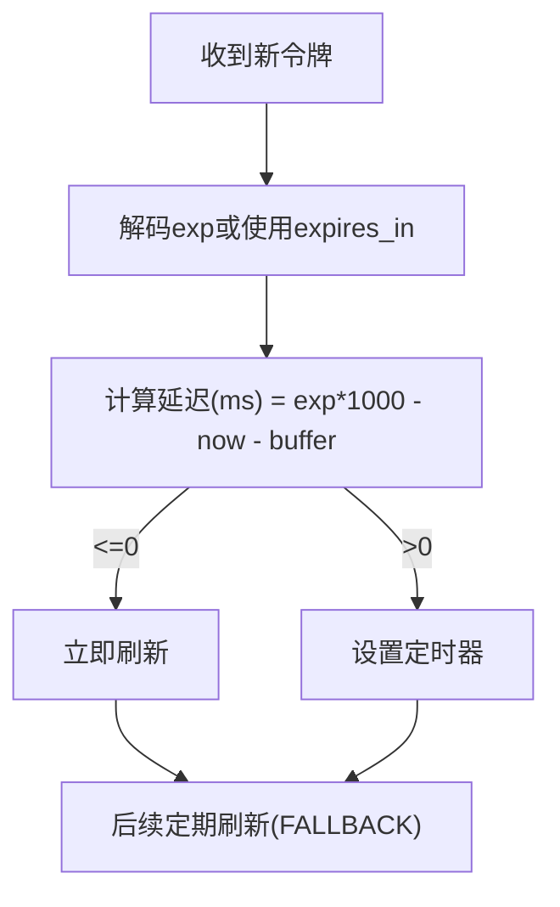
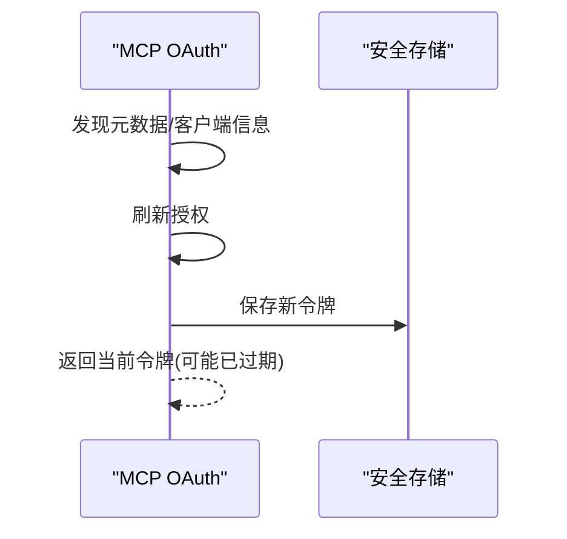
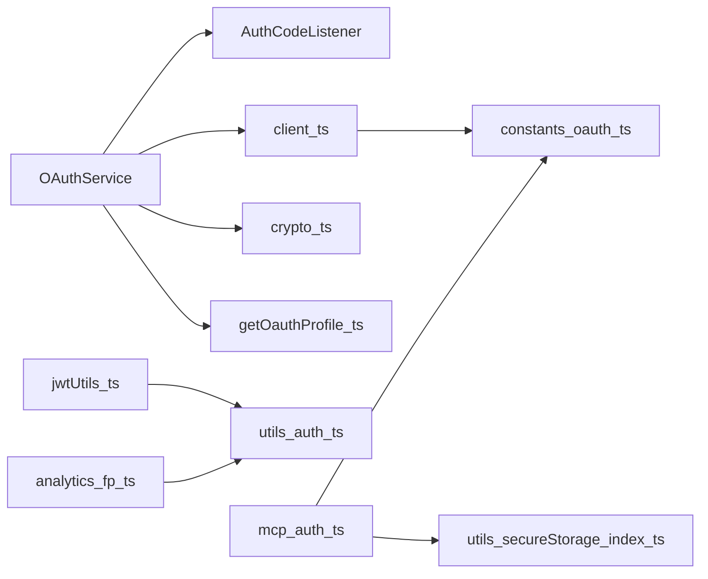

# 认证服务

<cite>
**本文档引用的文件**
- [src/services/oauth/index.ts](file://src/services/oauth/index.ts)
- [src/services/oauth/auth-code-listener.ts](file://src/services/oauth/auth-code-listener.ts)
- [src/services/oauth/client.ts](file://src/services/oauth/client.ts)
- [src/services/oauth/crypto.ts](file://src/services/oauth/crypto.ts)
- [src/services/oauth/getOauthProfile.ts](file://src/services/oauth/getOauthProfile.ts)
- [src/constants/oauth.ts](file://src/constants/oauth.ts)
- [src/bridge/jwtUtils.ts](file://src/bridge/jwtUtils.ts)
- [src/bridge/bridgeMain.ts](file://src/bridge/bridgeMain.ts)
- [src/services/mcp/auth.ts](file://src/services/mcp/auth.ts)
- [src/utils/auth.ts](file://src/utils/auth.ts)
- [src/utils/secureStorage/index.ts](file://src/utils/secureStorage/index.ts)
- [src/services/analytics/firstPartyEventLoggingExporter.ts](file://src/services/analytics/firstPartyEventLoggingExporter.ts)
- [src/commands/logout/logout.tsx](file://src/commands/logout/logout.tsx)
</cite>

## 目录
1. [简介](#简介)
2. [项目结构](#项目结构)
3. [核心组件](#核心组件)
4. [架构总览](#架构总览)
5. [详细组件分析](#详细组件分析)
6. [依赖关系分析](#依赖关系分析)
7. [性能考量](#性能考量)
8. [故障排除指南](#故障排除指南)
9. [结论](#结论)
10. [附录](#附录)

## 简介
本文件系统性阐述 free-code 的认证服务，重点覆盖以下方面：
- OAuth 2.0 授权码流程（含 PKCE）与自动/手动两种授权码获取方式
- 本地回调监听器（AuthCodeListener）工作机制与安全校验
- 用户身份验证与令牌管理（访问令牌、刷新令牌、过期时间）
- 管理员请求的认证处理与权限角色获取
- 日志记录中的认证信息管理与安全检查机制
- 配置体系（多环境、自定义 OAuth 基地址、客户端 ID 覆盖）
- 令牌与会话管理（桥接层主动刷新、MCP OAuth 存储与刷新）

## 项目结构
认证相关代码主要分布在如下模块：
- OAuth 流程与工具：src/services/oauth/*
- 桥接层令牌调度：src/bridge/jwtUtils.ts、src/bridge/bridgeMain.ts
- MCP OAuth 服务端集成：src/services/mcp/auth.ts
- 安全存储与持久化：src/utils/secureStorage/*、src/utils/auth.ts
- 配置与常量：src/constants/oauth.ts
- 分析与日志：src/services/analytics/*
- 登出与缓存清理：src/commands/logout/logout.tsx

**图表来源**
- [src/services/oauth/index.ts:21-132](file://src/services/oauth/index.ts#L21-L132)
- [src/services/oauth/auth-code-listener.ts:18-72](file://src/services/oauth/auth-code-listener.ts#L18-L72)
- [src/services/oauth/client.ts:74-133](file://src/services/oauth/client.ts#L74-L133)
- [src/services/oauth/getOauthProfile.ts:47-63](file://src/services/oauth/getOauthProfile.ts#L47-L63)
- [src/bridge/jwtUtils.ts:72-163](file://src/bridge/jwtUtils.ts#L72-L163)
- [src/bridge/bridgeMain.ts:279-314](file://src/bridge/bridgeMain.ts#L279-L314)
- [src/services/mcp/auth.ts:620-700](file://src/services/mcp/auth.ts#L620-L700)
- [src/constants/oauth.ts:218-266](file://src/constants/oauth.ts#L218-L266)
- [src/utils/secureStorage/index.ts:9-17](file://src/utils/secureStorage/index.ts#L9-L17)
- [src/utils/auth.ts:1210-1238](file://src/utils/auth.ts#L1210-L1238)

**章节来源**
- [src/services/oauth/index.ts:1-199](file://src/services/oauth/index.ts#L1-L199)
- [src/services/oauth/auth-code-listener.ts:1-212](file://src/services/oauth/auth-code-listener.ts#L1-L212)
- [src/services/oauth/client.ts:1-595](file://src/services/oauth/client.ts#L1-L595)
- [src/services/oauth/crypto.ts:1-42](file://src/services/oauth/crypto.ts#L1-L42)
- [src/services/oauth/getOauthProfile.ts:1-64](file://src/services/oauth/getOauthProfile.ts#L1-L64)
- [src/constants/oauth.ts:1-267](file://src/constants/oauth.ts#L1-L267)
- [src/bridge/jwtUtils.ts:63-256](file://src/bridge/jwtUtils.ts#L63-L256)
- [src/bridge/bridgeMain.ts:279-314](file://src/bridge/bridgeMain.ts#L279-L314)
- [src/services/mcp/auth.ts:620-2005](file://src/services/mcp/auth.ts#L620-L2005)
- [src/utils/secureStorage/index.ts:1-17](file://src/utils/secureStorage/index.ts#L1-L17)
- [src/utils/auth.ts:1210-1238](file://src/utils/auth.ts#L1210-L1238)

## 核心组件
- OAuthService：封装 OAuth 2.0 授权码流程（PKCE），支持自动浏览器打开与手动输入两种授权码获取路径，并完成令牌格式化与资源清理。
- AuthCodeListener：在 localhost 启动临时 HTTP 服务器，捕获授权回调，进行 state 校验与响应处理，确保 CSRF 防护。
- client.ts：构建授权 URL、交换授权码为令牌、刷新令牌、获取用户角色与 API Key、解析作用域、获取用户档案等。
- crypto.ts：生成 PKCE code_verifier、code_challenge 与 state，保障授权码流程安全性。
- getOauthProfile.ts：通过 OAuth Access Token 或 API Key 获取用户档案信息。
- constants/oauth.ts：集中管理 OAuth 配置（授权/令牌端点、成功跳转页、作用域集合、多环境切换与自定义基地址限制）。
- bridge/jwtUtils.ts：为桥接会话创建令牌刷新调度器，基于 JWT exp 或 expires_in 主动刷新，避免会话中断。
- bridge/bridgeMain.ts：在桥接层根据会话版本选择直接更新令牌或通过重连触发服务端重新分发。
- mcp/auth.ts：MCP 服务端的 OAuth 令牌存储、发现元数据、刷新与失效管理，结合安全存储持久化。
- utils/auth.ts 与 secureStorage：令牌持久化到平台安全存储（macOS Keychain/回退明文），登出时清理缓存与安全存储。

**章节来源**
- [src/services/oauth/index.ts:21-199](file://src/services/oauth/index.ts#L21-L199)
- [src/services/oauth/auth-code-listener.ts:18-212](file://src/services/oauth/auth-code-listener.ts#L18-L212)
- [src/services/oauth/client.ts:74-302](file://src/services/oauth/client.ts#L74-L302)
- [src/services/oauth/crypto.ts:20-42](file://src/services/oauth/crypto.ts#L20-L42)
- [src/services/oauth/getOauthProfile.ts:47-63](file://src/services/oauth/getOauthProfile.ts#L47-L63)
- [src/constants/oauth.ts:70-96](file://src/constants/oauth.ts#L70-L96)
- [src/bridge/jwtUtils.ts:72-256](file://src/bridge/jwtUtils.ts#L72-L256)
- [src/bridge/bridgeMain.ts:279-314](file://src/bridge/bridgeMain.ts#L279-L314)
- [src/services/mcp/auth.ts:620-700](file://src/services/mcp/auth.ts#L620-L700)
- [src/utils/auth.ts:1210-1238](file://src/utils/auth.ts#L1210-L1238)
- [src/utils/secureStorage/index.ts:9-17](file://src/utils/secureStorage/index.ts#L9-L17)

## 架构总览
下图展示从用户授权到令牌使用、再到会话刷新与 MCP OAuth 存储的整体流程。

**图表来源**
- [src/services/oauth/index.ts:32-132](file://src/services/oauth/index.ts#L32-L132)
- [src/services/oauth/auth-code-listener.ts:62-175](file://src/services/oauth/auth-code-listener.ts#L62-L175)
- [src/services/oauth/client.ts:135-172](file://src/services/oauth/client.ts#L135-L172)
- [src/bridge/jwtUtils.ts:72-163](file://src/bridge/jwtUtils.ts#L72-L163)
- [src/services/mcp/auth.ts:2242-2281](file://src/services/mcp/auth.ts#L2242-L2281)

## 详细组件分析

### OAuthService：授权码流程与令牌格式化
- 自动/手动双通道：自动模式通过浏览器打开授权页并在本地监听回调；手动模式仅展示授权 URL，由用户复制授权码。
- PKCE 与 state：生成 code_verifier、code_challenge 与 state，分别用于令牌交换与 CSRF 防护。
- 成功/错误处理：成功后获取用户档案并根据授予的作用域选择合适的成功页；异常时发送错误重定向并清理资源。
- 令牌格式化：将后端返回的令牌信息转换为统一结构，包含访问令牌、刷新令牌、过期时间、作用域、订阅类型、速率等级与账户信息。

**图表来源**
- [src/services/oauth/index.ts:21-199](file://src/services/oauth/index.ts#L21-L199)
- [src/services/oauth/auth-code-listener.ts:18-212](file://src/services/oauth/auth-code-listener.ts#L18-L212)

**章节来源**
- [src/services/oauth/index.ts:32-132](file://src/services/oauth/index.ts#L32-L132)
- [src/services/oauth/auth-code-listener.ts:62-175](file://src/services/oauth/auth-code-listener.ts#L62-L175)

### AuthCodeListener：本地回调监听与安全校验
- 本地 HTTP 服务器：监听 localhost 指定端口，等待授权回调。
- 请求处理：仅处理配置的回调路径；提取 code 与 state 参数。
- CSRF 防护：严格校验 state 与期望值一致，不一致则拒绝并记录错误。
- 响应策略：成功时根据授予作用域选择不同成功页；失败时发送错误重定向以保证浏览器流程闭环。

**图表来源**
- [src/services/oauth/auth-code-listener.ts:134-175](file://src/services/oauth/auth-code-listener.ts#L134-L175)

**章节来源**
- [src/services/oauth/auth-code-listener.ts:134-175](file://src/services/oauth/auth-code-listener.ts#L134-L175)

### client.ts：授权 URL 构建、令牌交换与用户档案
- 授权 URL 构建：支持 Claude.ai 与 Console 两套授权页，可按需选择 inference-only 作用域与登录提示参数。
- 令牌交换：向令牌端点发起授权码交换，携带 code_verifier 与 state，处理非 200 响应并记录事件。
- 刷新令牌：支持按需扩展作用域，避免重复拉取用户档案。
- 角色与 API Key：获取用户组织/工作区角色，必要时创建 API Key 并持久化。
- 用户档案：通过访问令牌获取订阅类型、速率等级、计费类型等信息。

**图表来源**
- [src/services/oauth/client.ts:74-133](file://src/services/oauth/client.ts#L74-L133)
- [src/services/oauth/client.ts:135-172](file://src/services/oauth/client.ts#L135-L172)
- [src/services/oauth/client.ts:383-448](file://src/services/oauth/client.ts#L383-L448)

**章节来源**
- [src/services/oauth/client.ts:74-172](file://src/services/oauth/client.ts#L74-L172)
- [src/services/oauth/client.ts:174-302](file://src/services/oauth/client.ts#L174-L302)
- [src/services/oauth/client.ts:383-448](file://src/services/oauth/client.ts#L383-L448)

### crypto.ts：PKCE 与状态参数生成
- code_verifier：32 字节随机数经 base64URL 编码。
- code_challenge：对 verifier 做 SHA256 后 base64URL 编码。
- state：用于防止 CSRF 攻击的随机字符串。

**章节来源**
- [src/services/oauth/crypto.ts:20-42](file://src/services/oauth/crypto.ts#L20-L42)

### getOauthProfile.ts：用户档案获取
- 通过 OAuth Access Token 获取用户档案，包含账户与组织信息。
- 通过 API Key 获取用户档案（用于特定场景）。

**章节来源**
- [src/services/oauth/getOauthProfile.ts:47-63](file://src/services/oauth/getOauthProfile.ts#L47-L63)

### constants/oauth.ts：认证配置与作用域
- 多环境配置：prod/staging/local，默认 prod，可通过环境变量切换。
- 自定义 OAuth 基地址：仅允许白名单域名，防止凭据泄露。
- 作用域集合：Console、Claude.ai、OpenAI 的作用域定义与合并。
- 成功页与端点：授权、令牌、API Key、角色、成功页等 URL。

**章节来源**
- [src/constants/oauth.ts:218-266](file://src/constants/oauth.ts#L218-L266)
- [src/constants/oauth.ts:66-68](file://src/constants/oauth.ts#L66-L68)

### 桥接层令牌调度与会话刷新
- 令牌刷新调度器：基于 JWT exp 或 expires_in 在到期前主动刷新，避免会话中断。
- 版本区分：v2 会话通过重连触发服务端重新分发，v1 直接更新令牌。
- 会话生命周期：为每个会话维护定时器，支持取消与批量取消。

**图表来源**
- [src/bridge/jwtUtils.ts:102-163](file://src/bridge/jwtUtils.ts#L102-L163)
- [src/bridge/bridgeMain.ts:279-314](file://src/bridge/bridgeMain.ts#L279-L314)

**章节来源**
- [src/bridge/jwtUtils.ts:72-256](file://src/bridge/jwtUtils.ts#L72-L256)
- [src/bridge/bridgeMain.ts:279-314](file://src/bridge/bridgeMain.ts#L279-L314)

### MCP OAuth：服务端令牌存储与刷新
- 元数据发现：首次连接时发现授权服务器元数据并缓存。
- 客户端信息：动态获取客户端信息（client_id/secret）。
- 令牌刷新：通过 SDK 刷新授权，成功后保存至安全存储。
- 存储结构：按服务端键名保存 accessToken、refreshToken、expiresAt、scope 等字段。
- 失效与清理：支持按范围失效（全部、客户端、令牌、验证器、发现）。

**图表来源**
- [src/services/mcp/auth.ts:2242-2281](file://src/services/mcp/auth.ts#L2242-L2281)
- [src/services/mcp/auth.ts:1540-1702](file://src/services/mcp/auth.ts#L1540-L1702)
- [src/services/mcp/auth.ts:1704-1731](file://src/services/mcp/auth.ts#L1704-L1731)
- [src/services/mcp/auth.ts:1960-1995](file://src/services/mcp/auth.ts#L1960-L1995)

**章节来源**
- [src/services/mcp/auth.ts:620-700](file://src/services/mcp/auth.ts#L620-L700)
- [src/services/mcp/auth.ts:1540-1731](file://src/services/mcp/auth.ts#L1540-L1731)
- [src/services/mcp/auth.ts:1960-1995](file://src/services/mcp/auth.ts#L1960-L1995)

### 安全存储与持久化
- 平台适配：macOS 使用 Keychain + 明文回退；其他平台使用明文存储。
- 令牌持久化：将 OAuthTokens 写入安全存储，记录成功/失败事件。
- 登出清理：清空安全存储、清除缓存、重置用户状态与增长书配置。

**章节来源**
- [src/utils/secureStorage/index.ts:9-17](file://src/utils/secureStorage/index.ts#L9-L17)
- [src/utils/auth.ts:1210-1238](file://src/utils/auth.ts#L1210-L1238)
- [src/commands/logout/logout.tsx:16-71](file://src/commands/logout/logout.tsx#L16-L71)

## 依赖关系分析
- OAuthService 依赖 AuthCodeListener、client、crypto、getOauthProfile 与 constants/oauth。
- client 依赖 constants/oauth、utils/auth、getOauthProfile。
- bridge/jwtUtils 依赖 utils/auth 提供的令牌获取与日志调试。
- mcp/auth 依赖 secureStorage 与 constants/oauth。
- analytics 组件在导出事件时根据 OAuth 令牌状态决定是否带认证头。

**图表来源**
- [src/services/oauth/index.ts:1-12](file://src/services/oauth/index.ts#L1-L12)
- [src/services/oauth/client.ts:1-32](file://src/services/oauth/client.ts#L1-L32)
- [src/bridge/jwtUtils.ts:1-25](file://src/bridge/jwtUtils.ts#L1-L25)
- [src/services/mcp/auth.ts:1-20](file://src/services/mcp/auth.ts#L1-L20)
- [src/services/analytics/firstPartyEventLoggingExporter.ts:553-584](file://src/services/analytics/firstPartyEventLoggingExporter.ts#L553-L584)

**章节来源**
- [src/services/oauth/index.ts:1-12](file://src/services/oauth/index.ts#L1-L12)
- [src/services/oauth/client.ts:1-32](file://src/services/oauth/client.ts#L1-L32)
- [src/bridge/jwtUtils.ts:1-25](file://src/bridge/jwtUtils.ts#L1-L25)
- [src/services/mcp/auth.ts:1-20](file://src/services/mcp/auth.ts#L1-L20)
- [src/services/analytics/firstPartyEventLoggingExporter.ts:553-584](file://src/services/analytics/firstPartyEventLoggingExporter.ts#L553-L584)

## 性能考量
- 主动刷新：桥接层在到期前固定缓冲时间刷新，避免会话抖动与频繁重试。
- 缓存与去重：MCP OAuth 刷新过程中对并发刷新进行去重与结果复用。
- 减少网络往返：refreshOAuthToken 在已有全局配置与安全存储中存在必要信息时跳过额外档案请求。
- 安全存储访问：避免在高频请求中强制刷新 Keychain 缓存，降低 CPU 开销。

[本节为通用指导，无需具体文件分析]

## 故障排除指南
- 企业代理导致的 SSL 错误：在手动输入授权码时，若遇到 SSL 握手失败，系统会提示代理拦截（如 Zscaler）并建议调整网络配置。
- 回调无授权码：确认 AuthCodeListener 是否正确启动且回调路径匹配；检查浏览器是否被拦截或未返回 code。
- state 不匹配：本地监听器会拒绝无效 state，检查 OAuthService 传入的 state 与回调是否一致。
- 令牌交换失败：检查授权码是否过期、code_verifier 是否正确、redirect_uri 是否与授权时一致。
- 令牌过期：桥接层会在到期前主动刷新；若仍出现 401，检查刷新逻辑与安全存储写入。
- 登出后残留状态：执行登出命令会清理安全存储与各类缓存，确保下次登录干净。

**章节来源**
- [src/components/ConsoleOAuthFlow.tsx:208-214](file://src/components/ConsoleOAuthFlow.tsx#L208-L214)
- [src/services/oauth/auth-code-listener.ts:164-169](file://src/services/oauth/auth-code-listener.ts#L164-L169)
- [src/services/oauth/client.ts:163-169](file://src/services/oauth/client.ts#L163-L169)
- [src/bridge/jwtUtils.ts:126-132](file://src/bridge/jwtUtils.ts#L126-L132)
- [src/commands/logout/logout.tsx:16-71](file://src/commands/logout/logout.tsx#L16-L71)

## 结论
free-code 的认证服务围绕 OAuth 2.0 授权码流程（PKCE）构建，结合本地回调监听器确保安全与可用性；通过桥接层主动刷新与 MCP OAuth 存储实现稳定会话；配合严格的配置与安全存储策略，保障凭证安全与用户体验。针对企业网络与代理场景提供了明确的提示与处理路径。

[本节为总结，无需具体文件分析]

## 附录

### 认证配置清单
- 环境切换：通过环境变量选择 prod/staging/local。
- 自定义 OAuth 基地址：仅允许白名单域名，防止凭据泄露。
- 客户端 ID 覆盖：支持通过环境变量覆盖 CLIENT_ID。
- 作用域集合：Console 与 Claude.ai 作用域合并，支持 inference-only 场景。

**章节来源**
- [src/constants/oauth.ts:6-31](file://src/constants/oauth.ts#L6-L31)
- [src/constants/oauth.ts:218-266](file://src/constants/oauth.ts#L218-L266)

### 管理员请求与角色管理
- 角色获取：通过访问令牌调用角色端点，更新全局配置中的组织/工作区角色与名称。
- 权限检查：在需要时检查用户档案作用域与订阅状态，决定是否启用某些功能。

**章节来源**
- [src/services/oauth/client.ts:304-337](file://src/services/oauth/client.ts#L304-L337)
- [src/services/oauth/client.ts:479-543](file://src/services/oauth/client.ts#L479-L543)

### 日志与安全检查
- 事件记录：在令牌交换、刷新、档案获取等关键节点记录事件，便于审计与排障。
- 401 自适应：分析导出器在遇到 401 时自动降级为非认证发送，避免阻塞。
- 信任与过期：在信任未建立或令牌过期时跳过认证头，减少不必要的错误。

**章节来源**
- [src/services/oauth/client.ts:170-171](file://src/services/oauth/client.ts#L170-L171)
- [src/services/oauth/client.ts:213-214](file://src/services/oauth/client.ts#L213-L214)
- [src/services/analytics/firstPartyEventLoggingExporter.ts:553-584](file://src/services/analytics/firstPartyEventLoggingExporter.ts#L553-L584)
- [src/services/analytics/firstPartyEventLoggingExporter.ts:594-614](file://src/services/analytics/firstPartyEventLoggingExporter.ts#L594-L614)