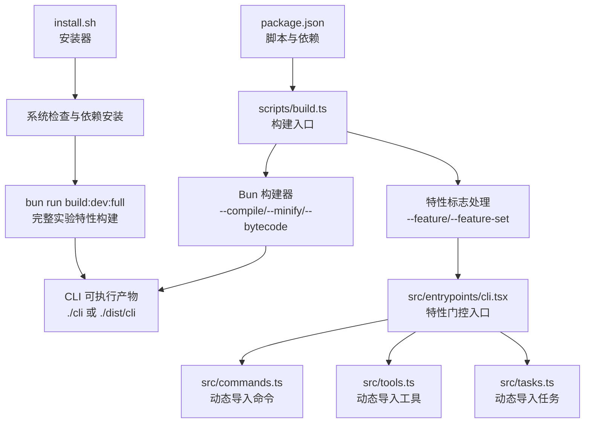
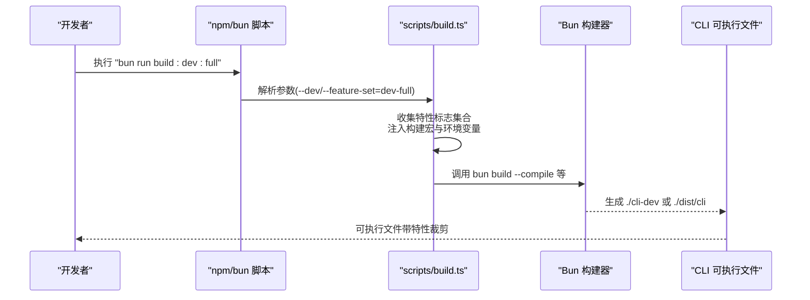
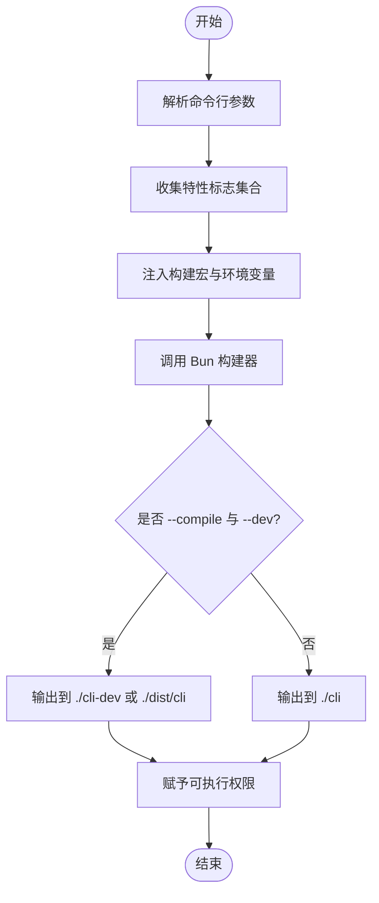
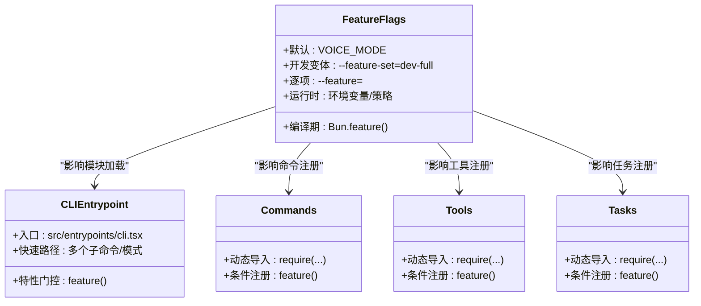
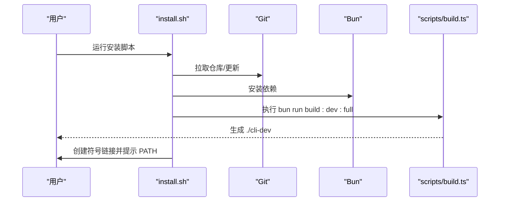
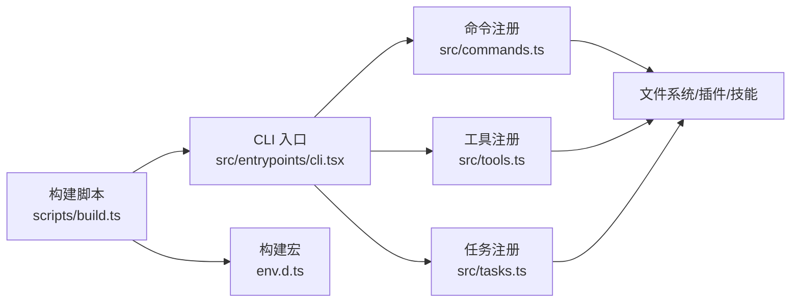

# 构建和部署

<cite>
**本文引用的文件**
- [package.json](file://package.json)
- [scripts/build.ts](file://scripts/build.ts)
- [FEATURES.md](file://FEATURES.md)
- [install.sh](file://install.sh)
- [src/entrypoints/cli.tsx](file://src/entrypoints/cli.tsx)
- [src/commands.ts](file://src/commands.ts)
- [src/tools.ts](file://src/tools.ts)
- [src/tasks.ts](file://src/tasks.ts)
- [env.d.ts](file://env.d.ts)
- [src/bootstrap/state.ts](file://src/bootstrap/state.ts)
</cite>

## 目录
1. [简介](#简介)
2. [项目结构](#项目结构)
3. [核心组件](#核心组件)
4. [架构总览](#架构总览)
5. [详细组件分析](#详细组件分析)
6. [依赖关系分析](#依赖关系分析)
7. [性能考虑](#性能考虑)
8. [故障排除指南](#故障排除指南)
9. [结论](#结论)
10. [附录](#附录)

## 简介
本文件面向 free-code（Claude Code 源码快照）的构建与部署，系统性阐述以下内容：
- 构建系统设计：基于 Bun 的脚本化构建流程，支持开发与发布两种模式，以及可选的编译打包产物。
- 特性标志管理机制：通过编译期特性标志（feature flags）实现功能门控与按需裁剪，覆盖命令、工具、任务等模块。
- 构建变体与输出差异：默认构建、开发构建、完整实验特性构建之间的区别及适用场景。
- 编译时开关与运行时环境变量：如何在构建阶段注入常量与环境变量，并在运行时生效。
- 完整构建流程：从依赖安装到二进制产物生成的步骤说明。
- 部署配置与环境变量设置：安装器脚本、运行前准备与常用环境变量。
- 构建优化与故障排除：常见问题定位与解决建议。

## 项目结构
该项目采用 Bun 工作区与 TypeScript 源码组织，核心构建与部署相关文件如下：
- 构建脚本：scripts/build.ts
- 包管理与脚本：package.json
- 特性审计与变体说明：FEATURES.md
- 安装器脚本：install.sh
- CLI 入口与特性门控：src/entrypoints/cli.tsx
- 命令注册与特性门控：src/commands.ts
- 工具注册与特性门控：src/tools.ts
- 任务注册与特性门控：src/tasks.ts
- 构建宏类型声明：env.d.ts
- 运行时状态与环境变量使用：src/bootstrap/state.ts

图表来源
- [package.json:15-21](file://package.json#L15-L21)
- [scripts/build.ts:161-197](file://scripts/build.ts#L161-L197)
- [install.sh:122-127](file://install.sh#L122-L127)

章节来源
- [package.json:15-21](file://package.json#L15-L21)
- [scripts/build.ts:161-197](file://scripts/build.ts#L161-L197)
- [install.sh:122-127](file://install.sh#L122-L127)

## 核心组件
- 构建脚本（scripts/build.ts）
  - 解析命令行参数：--compile、--dev、--feature-set、--feature。
  - 收集特性标志集合，默认包含 VOICE_MODE；--feature-set=dev-full 将启用大量实验特性。
  - 注入构建宏与环境变量：VERSION、BUILD_TIME、PACKAGE_URL、FEEDBACK_CHANNEL、ISSUES_EXPLAINER、VERSION_CHANGELOG 等。
  - 调用 Bun 构建器进行打包，输出至 ./cli 或 ./dist/cli，并赋予可执行权限。
- 包脚本（package.json）
  - 提供 build、build:dev、build:dev:full、compile、dev 等脚本，分别对应不同构建变体。
- 特性审计（FEATURES.md）
  - 列出当前可用的特性标志，区分“可干净打包”、“运行时有约束”、“已损坏但可重建”等类别。
  - 明确默认构建与开发构建的特性差异。
- CLI 入口与特性门控（src/entrypoints/cli.tsx）
  - 使用 Bun 的 feature() 在模块顶层进行死代码消除（DCE），确保未启用的分支不进入产物。
  - 对若干子路径（如远程控制、模板作业、守护进程等）进行快速路径优化。
- 命令、工具、任务注册（src/commands.ts、src/tools.ts、src/tasks.ts）
  - 通过 require 动态导入与 feature() 组合，仅在启用相应特性时加载对应模块。
  - 提供过滤与去重逻辑，保证最终可用能力集合稳定且可缓存。

章节来源
- [scripts/build.ts:82-110](file://scripts/build.ts#L82-L110)
- [scripts/build.ts:135-159](file://scripts/build.ts#L135-L159)
- [scripts/build.ts:161-197](file://scripts/build.ts#L161-L197)
- [package.json:15-21](file://package.json#L15-L21)
- [FEATURES.md:16-29](file://FEATURES.md#L16-L29)
- [src/entrypoints/cli.tsx:1-304](file://src/entrypoints/cli.tsx#L1-L304)
- [src/commands.ts:59-123](file://src/commands.ts#L59-L123)
- [src/tools.ts:104-135](file://src/tools.ts#L104-L135)
- [src/tasks.ts:1-40](file://src/tasks.ts#L1-L40)

## 架构总览
下图展示从源码到可执行产物的关键流程，以及特性标志在不同层级的作用点。

图表来源
- [package.json:15-21](file://package.json#L15-L21)
- [scripts/build.ts:82-110](file://scripts/build.ts#L82-L110)
- [scripts/build.ts:161-197](file://scripts/build.ts#L161-L197)

## 详细组件分析

### 构建系统与脚本
- 参数解析与特性收集
  - 支持 --compile 与 --dev 控制产物位置与开发环境变量注入。
  - 支持 --feature-set=dev-full 启用全部实验特性集合。
  - 支持 --feature 逐项追加特性。
- 宏与环境变量注入
  - 通过 --define 注入构建宏（如 VERSION、BUILD_TIME、PACKAGE_URL 等）。
  - 注入运行时环境变量（如 NODE_ENV、CLAUDE_CODE_EXPERIMENTAL_BUILD、USER_TYPE 等）。
- 输出与权限
  - 根据是否 --compile 与 --dev 决定输出路径（./cli、./cli-dev、./dist/cli）。
  - 产物赋予 0755 权限，便于直接执行。

图表来源
- [scripts/build.ts:82-110](file://scripts/build.ts#L82-L110)
- [scripts/build.ts:135-159](file://scripts/build.ts#L135-L159)
- [scripts/build.ts:161-197](file://scripts/build.ts#L161-L197)
- [scripts/build.ts:203-205](file://scripts/build.ts#L203-L205)

章节来源
- [scripts/build.ts:82-110](file://scripts/build.ts#L82-L110)
- [scripts/build.ts:135-159](file://scripts/build.ts#L135-L159)
- [scripts/build.ts:161-197](file://scripts/build.ts#L161-L197)
- [scripts/build.ts:203-205](file://scripts/build.ts#L203-L205)

### 特性标志管理机制
- 编译期门控
  - 在 CLI 入口与命令/工具/任务注册处使用 Bun 的 feature() 进行死代码消除。
  - 未启用的分支在构建时被移除，减少产物体积与启动开销。
- 运行时门控
  - 部分特性在运行时还受环境变量或策略限制（例如远程控制需要认证与策略允许）。
- 特性集合与变体
  - 默认包含 VOICE_MODE。
  - --feature-set=dev-full 启用大量实验特性，适合开发与测试。
  - 可通过 --feature 逐项启用特定特性。

图表来源
- [src/entrypoints/cli.tsx:1-304](file://src/entrypoints/cli.tsx#L1-L304)
- [src/commands.ts:59-123](file://src/commands.ts#L59-L123)
- [src/tools.ts:104-135](file://src/tools.ts#L104-L135)
- [src/tasks.ts:1-40](file://src/tasks.ts#L1-L40)

章节来源
- [src/entrypoints/cli.tsx:1-304](file://src/entrypoints/cli.tsx#L1-L304)
- [src/commands.ts:59-123](file://src/commands.ts#L59-L123)
- [src/tools.ts:104-135](file://src/tools.ts#L104-L135)
- [src/tasks.ts:1-40](file://src/tasks.ts#L1-L40)

### 构建变体与输出差异
- 默认构建（bun run build）
  - 生成外部二进制 ./cli，包含默认特性（如 VOICE_MODE）。
- 开发构建（bun run build:dev）
  - 生成 ./cli-dev，注入开发环境变量与版本号（含时间戳与提交信息）。
- 完整实验特性构建（bun run build:dev:full）
  - 启用 FEATURES.md 中列出的全部“可干净打包”的实验特性，适合全量测试。
- 编译构建（bun run compile）
  - 生成 ./dist/cli，适用于打包到发行目录。

章节来源
- [FEATURES.md:16-29](file://FEATURES.md#L16-L29)
- [package.json:15-21](file://package.json#L15-L21)
- [scripts/build.ts:112-118](file://scripts/build.ts#L112-L118)

### 编译时开关与运行时环境变量
- 编译时开关
  - 通过 --define 注入构建宏，如 VERSION、BUILD_TIME、PACKAGE_URL、FEEDBACK_CHANNEL、ISSUES_EXPLAINER、VERSION_CHANGELOG 等。
  - 通过 --external 排除部分原生模块，避免打包到产物中。
- 运行时环境变量
  - NODE_ENV、COREPACK_ENABLE_AUTO_PIN、CLAUDE_CODE_REMOTE、NODE_OPTIONS 等在 CLI 入口与运行时初始化中使用。
  - 某些特性在运行时还受 USER_TYPE、ANTHROPIC_API_KEY 等环境变量影响。

章节来源
- [scripts/build.ts:135-159](file://scripts/build.ts#L135-L159)
- [scripts/build.ts:127-133](file://scripts/build.ts#L127-L133)
- [src/entrypoints/cli.tsx:4-15](file://src/entrypoints/cli.tsx#L4-L15)
- [src/bootstrap/state.ts:391-426](file://src/bootstrap/state.ts#L391-L426)

### 完整构建流程（从依赖安装到二进制产物）
- 系统与依赖检查
  - install.sh 检查 OS、git、bun 版本，必要时自动安装 bun 并拉取仓库。
- 依赖安装
  - 使用 bun install 安装项目依赖。
- 构建二进制
  - 执行 bun run build:dev:full 生成完整实验特性的二进制。
- 链接与 PATH 设置
  - 创建 ~/.local/bin/free-code 符号链接，并提示将该目录加入 PATH。

图表来源
- [install.sh:44-93](file://install.sh#L44-L93)
- [install.sh:115-127](file://install.sh#L115-L127)
- [install.sh:129-143](file://install.sh#L129-L143)

章节来源
- [install.sh:44-93](file://install.sh#L44-L93)
- [install.sh:115-127](file://install.sh#L115-L127)
- [install.sh:129-143](file://install.sh#L129-L143)

### 部署配置与环境变量设置
- 安装器脚本
  - 自动检测与安装 bun，克隆仓库，安装依赖，构建二进制，并创建 ~/.local/bin/free-code 链接。
- 常用环境变量
  - ANTHROPIC_API_KEY：用于 API 认证。
  - CLAUDE_CODE_REMOTE 与 NODE_OPTIONS：在容器等环境中设置最大堆大小。
  - COREPACK_ENABLE_AUTO_PIN：禁用 corepack 自动固定以避免冲突。
  - USER_TYPE：影响某些命令与工具的可用性（如 ant 专用命令）。

章节来源
- [install.sh:170-178](file://install.sh#L170-L178)
- [src/entrypoints/cli.tsx:4-15](file://src/entrypoints/cli.tsx#L4-L15)
- [src/bootstrap/state.ts:391-426](file://src/bootstrap/state.ts#L391-L426)

## 依赖关系分析
- CLI 入口对命令/工具/任务的依赖通过特性标志进行解耦，避免不必要的模块加载。
- 命令、工具、任务注册均采用动态导入与 feature() 组合，形成稳定的“按需加载”模式。
- 构建脚本通过 --external 排除原生模块，降低产物复杂度。

图表来源
- [src/entrypoints/cli.tsx:1-304](file://src/entrypoints/cli.tsx#L1-L304)
- [src/commands.ts:59-123](file://src/commands.ts#L59-L123)
- [src/tools.ts:104-135](file://src/tools.ts#L104-L135)
- [src/tasks.ts:1-40](file://src/tasks.ts#L1-L40)
- [scripts/build.ts:161-197](file://scripts/build.ts#L161-L197)
- [env.d.ts:1-15](file://env.d.ts#L1-L15)

章节来源
- [src/entrypoints/cli.tsx:1-304](file://src/entrypoints/cli.tsx#L1-L304)
- [src/commands.ts:59-123](file://src/commands.ts#L59-L123)
- [src/tools.ts:104-135](file://src/tools.ts#L104-L135)
- [src/tasks.ts:1-40](file://src/tasks.ts#L1-L40)
- [scripts/build.ts:161-197](file://scripts/build.ts#L161-L197)
- [env.d.ts:1-15](file://env.d.ts#L1-L15)

## 性能考虑
- 死代码消除（DCE）
  - 通过 Bun 的 feature() 在编译期移除未启用分支，显著减少产物体积与启动时间。
- 快速路径
  - CLI 入口对 --version、--dump-system-prompt 等常见路径进行快速处理，避免加载完整 CLI。
- 模块懒加载
  - 命令、工具、任务均采用动态导入，仅在需要时加载，降低内存占用。
- 构建优化
  - 使用 --minify 与 --bytecode 提升运行时性能与体积。
  - 通过 --external 排除原生模块，避免打包失败与体积膨胀。

章节来源
- [src/entrypoints/cli.tsx:34-72](file://src/entrypoints/cli.tsx#L34-L72)
- [src/commands.ts:257-346](file://src/commands.ts#L257-L346)
- [src/tools.ts:193-251](file://src/tools.ts#L193-L251)
- [scripts/build.ts:172-174](file://scripts/build.ts#L172-L174)
- [scripts/build.ts:180-182](file://scripts/build.ts#L180-L182)

## 故障排除指南
- 构建失败（找不到特性相关模块）
  - 现象：某些特性在构建时报错，提示缺失模块或资产。
  - 原因：特性未启用或相关资产缺失。
  - 处理：确认是否使用了 --feature-set=dev-full；对于“可重建”的特性，按 FEATURES.md 的说明补充缺失文件或资产。
- 运行时功能不可用
  - 现象：启用某特性后仍无法使用。
  - 原因：运行时还受环境变量或策略限制（如远程控制需要认证与策略允许）。
  - 处理：检查 ANTHROPIC_API_KEY、登录状态与策略配置。
- 二进制不可执行
  - 现象：生成的二进制无执行权限。
  - 处理：构建脚本会自动赋予 0755 权限；若失败，请手动 chmod +x。
- 安装器问题
  - 现象：install.sh 报错或无法找到 bun。
  - 处理：确保系统满足要求（macOS/Linux），bun 版本不低于 1.3.11；按提示将 ~/.local/bin 加入 PATH。

章节来源
- [FEATURES.md:195-291](file://FEATURES.md#L195-L291)
- [src/entrypoints/cli.tsx:113-163](file://src/entrypoints/cli.tsx#L113-L163)
- [scripts/build.ts:203-205](file://scripts/build.ts#L203-L205)
- [install.sh:44-93](file://install.sh#L44-L93)
- [install.sh:136-142](file://install.sh#L136-L142)

## 结论
本项目的构建与部署体系以 Bun 为核心，结合编译期特性标志与运行时环境变量，实现了灵活的功能门控与高效的产物生成。通过默认构建、开发构建与完整实验特性构建三种变体，既能满足日常使用，也能支持全面测试。安装器脚本进一步简化了本地部署流程。建议在生产环境中优先使用默认构建，在开发与测试环境中使用完整实验特性构建，并根据实际需求调整特性标志与环境变量。

## 附录
- 常用命令
  - 默认构建：bun run build
  - 开发构建：bun run build:dev
  - 完整实验特性构建：bun run build:dev:full
  - 编译构建：bun run compile
  - 开发调试：bun ./src/entrypoints/cli.tsx
- 关键特性清单参考
  - FEATURES.md 中的“Working Experimental Features”、“Bundle-Clean Support Flags”、“Compile-Safe But Runtime-Caveated”等分类，有助于选择合适的特性组合。

章节来源
- [package.json:15-21](file://package.json#L15-L21)
- [FEATURES.md:38-194](file://FEATURES.md#L38-L194)