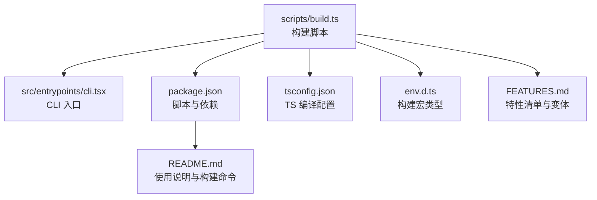
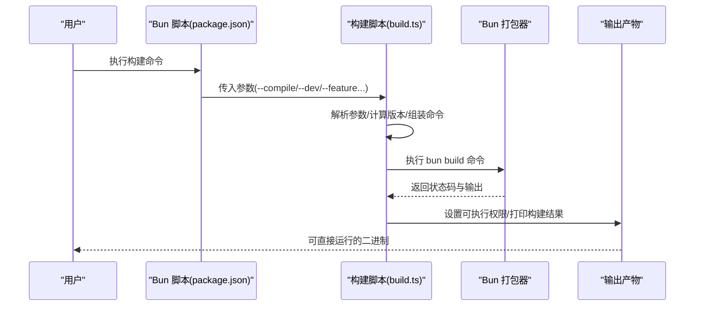
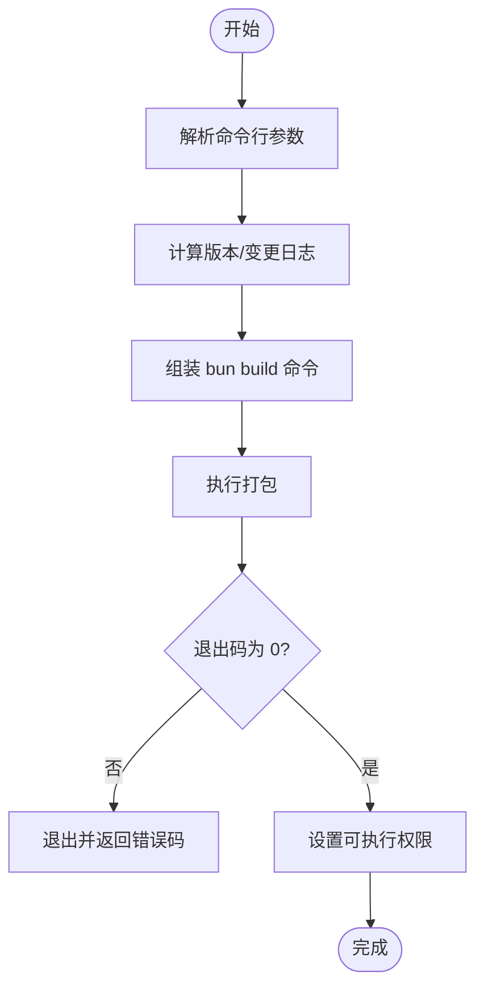
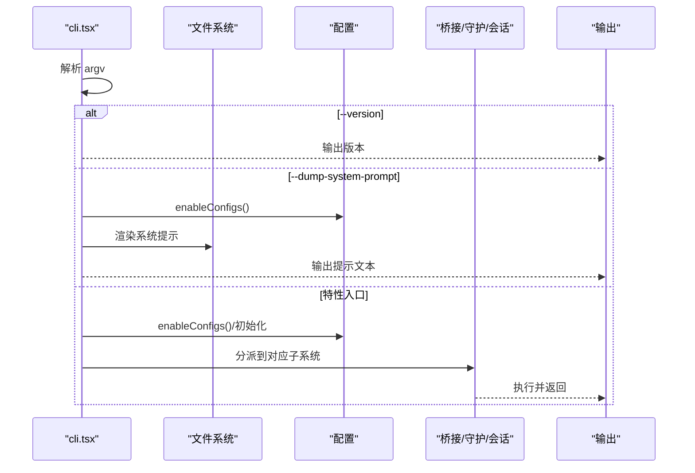
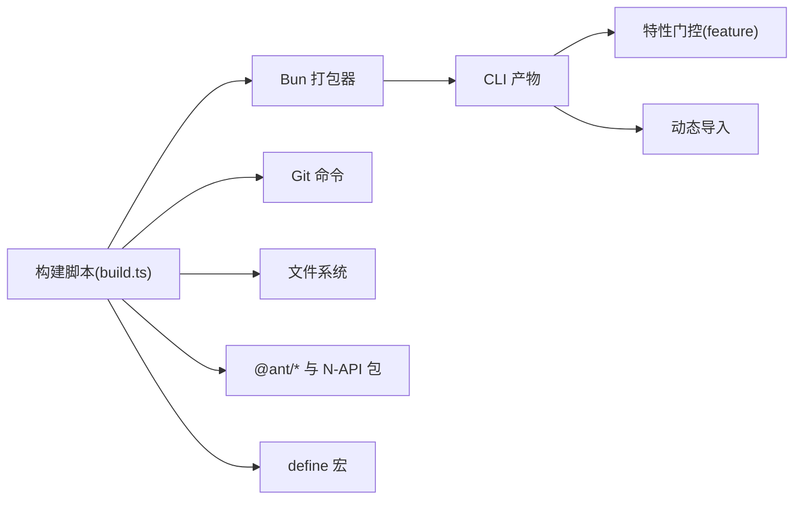

# 构建系统

<cite>
**本文引用的文件**
- [scripts/build.ts](file://scripts/build.ts)
- [package.json](file://package.json)
- [tsconfig.json](file://tsconfig.json)
- [src/entrypoints/cli.tsx](file://src/entrypoints/cli.tsx)
- [env.d.ts](file://env.d.ts)
- [README.md](file://README.md)
- [FEATURES.md](file://FEATURES.md)
</cite>

## 目录
1. [简介](#简介)
2. [项目结构](#项目结构)
3. [核心组件](#核心组件)
4. [架构总览](#架构总览)
5. [详细组件分析](#详细组件分析)
6. [依赖关系分析](#依赖关系分析)
7. [性能考量](#性能考量)
8. [故障排查指南](#故障排查指南)
9. [结论](#结论)
10. [附录](#附录)

## 简介
本文件面向 free-code 的构建系统，聚焦于基于 Bun 的构建流程与脚本实现。内容涵盖：
- 构建脚本的参数处理、命令行选项与构建配置
- 开发构建与生产构建的区别、编译选项与优化设置
- 外部依赖排除机制与打包策略
- 完整的构建命令示例与参数说明
- 构建过程中的错误处理与调试技巧

free-code 是对 Claude Code 的自由版本重构，目标是“零回调、无遥测、解锁全部实验特性”的可构建二进制。构建系统通过 Bun 的原生打包能力，结合自定义脚本完成特征开关注入、外部依赖排除、产物权限设置等关键步骤。

## 项目结构
与构建相关的关键位置如下：
- 构建入口脚本：scripts/build.ts
- 包管理与脚本：package.json
- TypeScript 编译配置：tsconfig.json
- CLI 入口源码：src/entrypoints/cli.tsx
- 构建宏类型声明：env.d.ts
- 项目说明与构建用法：README.md
- 实验特性清单与构建变体：FEATURES.md

图表来源
- [scripts/build.ts:1-208](file://scripts/build.ts#L1-L208)
- [package.json:15-21](file://package.json#L15-L21)
- [tsconfig.json:1-24](file://tsconfig.json#L1-L24)
- [src/entrypoints/cli.tsx:1-200](file://src/entrypoints/cli.tsx#L1-L200)
- [env.d.ts:1-15](file://env.d.ts#L1-L15)
- [README.md:175-200](file://README.md#L175-L200)
- [FEATURES.md:16-318](file://FEATURES.md#L16-L318)

章节来源
- [scripts/build.ts:1-208](file://scripts/build.ts#L1-L208)
- [package.json:15-21](file://package.json#L15-L21)
- [tsconfig.json:1-24](file://tsconfig.json#L1-L24)
- [src/entrypoints/cli.tsx:1-200](file://src/entrypoints/cli.tsx#L1-L200)
- [env.d.ts:1-15](file://env.d.ts#L1-L15)
- [README.md:175-200](file://README.md#L175-L200)
- [FEATURES.md:16-318](file://FEATURES.md#L16-L318)

## 核心组件
- 构建脚本（scripts/build.ts）
  - 解析命令行参数，支持 --compile、--dev、--feature-set、--feature 等
  - 计算版本号（开发版带时间戳与短 SHA）、生成变更日志
  - 组装 Bun 打包命令，注入 define 宏、特征开关、外部依赖排除
  - 调用 Bun 打包并设置产物可执行权限
- CLI 入口（src/entrypoints/cli.tsx）
  - 在未内联宏时提供全局 MACRO 注入，保证版本信息可用
  - 快速路径处理（如 --version），减少模块加载开销
  - 基于 feature() 进行死代码消除（DCE），按需加载子系统
- 配置与类型
  - package.json 提供脚本与二进制映射
  - tsconfig.json 指定 bundler 模式与 JSX/TS 支持
  - env.d.ts 声明构建宏类型，供运行时读取

章节来源
- [scripts/build.ts:9-120](file://scripts/build.ts#L9-L120)
- [src/entrypoints/cli.tsx:1-11](file://src/entrypoints/cli.tsx#L1-L11)
- [package.json:8-21](file://package.json#L8-L21)
- [tsconfig.json:1-24](file://tsconfig.json#L1-L24)
- [env.d.ts:1-9](file://env.d.ts#L1-L9)

## 架构总览
下图展示从命令到最终产物的构建链路，以及关键的参数与配置点。

图表来源
- [package.json:15-21](file://package.json#L15-L21)
- [scripts/build.ts:92-208](file://scripts/build.ts#L92-L208)

章节来源
- [package.json:15-21](file://package.json#L15-L21)
- [scripts/build.ts:92-208](file://scripts/build.ts#L92-L208)

## 详细组件分析

### 构建脚本（scripts/build.ts）解析
- 参数处理
  - --compile：启用字节码与最小化，输出到 dist 或当前目录
  - --dev：开发模式，版本号含时间戳与短 SHA，注入开发环境变量
  - --feature-set=dev-full：一次性启用全部可打包的实验特性
  - --feature=FLAG：追加单个特性开关
- 版本与变更日志
  - 开发版版本号由基础版本+日期+时间+短 SHA 组成
  - 变更日志在开发模式下来自最近 20 条 git 提交记录
- 外部依赖排除
  - 使用 --external 排除特定 N-API 包与 @ant/* 前缀包，避免打包进二进制
- 宏与 define
  - 注入多组 define，覆盖 NODE_ENV、实验开关、版本信息、反馈渠道等
  - 通过 --define 将这些常量内联到产物中，便于运行时分支与诊断
- 打包命令组装
  - 目标平台：bun
  - 输出格式：esm
  - 启用 bytecode 与最小化
  - 条件：bun
- 产物权限
  - 成功后将产物设为可执行（0o755）

图表来源
- [scripts/build.ts:9-208](file://scripts/build.ts#L9-L208)

章节来源
- [scripts/build.ts:9-208](file://scripts/build.ts#L9-L208)

### CLI 入口（src/entrypoints/cli.tsx）解析
- 全局宏注入
  - 在未内联宏时，注入全局 MACRO 对象，确保版本与构建时间可用
- 快速路径
  - --version：零模块加载，直接输出版本
  - --dump-system-prompt：按需渲染系统提示并输出
  - --claude-in-chrome-mcp、--chrome-native-host、--computer-use-mcp：按特性启用的专用服务入口
  - --daemon-worker：守护进程工作线程入口
  - remote-control/rc/remote/sync/bridge：桥接模式入口（受特性与认证限制）
  - daemon 子命令：长驻守护进程入口
  - BG 会话管理：后台会话相关命令与标志
- 动态导入
  - 除快速路径外，其余路径均采用动态 import，降低启动延迟
- 特性门控
  - 使用 feature('FLAG') 进行死代码消除，确保外部构建不包含未启用的功能

图表来源
- [src/entrypoints/cli.tsx:38-200](file://src/entrypoints/cli.tsx#L38-L200)

章节来源
- [src/entrypoints/cli.tsx:1-200](file://src/entrypoints/cli.tsx#L1-L200)

### 构建配置与类型（package.json、tsconfig.json、env.d.ts）
- package.json
  - scripts：提供 build、build:dev、build:dev:full、compile、dev 等脚本
  - bin：将 cli 映射为可执行名称
  - engines：限定 Bun 版本
- tsconfig.json
  - bundler 模式与 JSX/TS 支持
  - noEmit：仅用于类型检查，不生成 JS
- env.d.ts
  - 声明 MACRO 类型，供构建脚本与运行时共享

章节来源
- [package.json:8-21](file://package.json#L8-L21)
- [tsconfig.json:1-24](file://tsconfig.json#L1-L24)
- [env.d.ts:1-9](file://env.d.ts#L1-L9)

### 实验特性与构建变体（FEATURES.md）
- 默认构建包含 VOICE_MODE
- dev-full 构建启用全部可打包的 54 项实验特性
- 部分特性仅打包安全但运行时受限（如需要 OAuth/GrowthBook）

章节来源
- [FEATURES.md:16-318](file://FEATURES.md#L16-L318)

## 依赖关系分析
- 构建脚本依赖
  - Bun spawn 与文件系统 API
  - Git 命令用于版本与变更日志
- CLI 入口依赖
  - feature() 用于特性门控与 DCE
  - 动态 import 用于延迟加载
- 外部依赖排除
  - 通过 --external 排除 @ant/* 与若干 N-API 包，避免打包进二进制
- 宏与 define
  - 通过 --define 将版本、构建时间、反馈渠道等常量内联

图表来源
- [scripts/build.ts:127-190](file://scripts/build.ts#L127-L190)
- [src/entrypoints/cli.tsx:1-200](file://src/entrypoints/cli.tsx#L1-L200)

章节来源
- [scripts/build.ts:127-190](file://scripts/build.ts#L127-L190)
- [src/entrypoints/cli.tsx:1-200](file://src/entrypoints/cli.tsx#L1-L200)

## 性能考量
- 启动性能
  - CLI 入口提供多个快速路径，避免不必要的模块加载
  - 动态导入按需加载，缩短冷启动时间
- 打包体积与速度
  - 启用最小化与 bytecode，减小体积并提升加载速度
  - 外部依赖排除显著降低产物大小
- 特性门控
  - 通过 feature() 进行死代码消除，避免将未启用功能打包进二进制

章节来源
- [src/entrypoints/cli.tsx:38-200](file://src/entrypoints/cli.tsx#L38-L200)
- [scripts/build.ts:172-178](file://scripts/build.ts#L172-L178)
- [scripts/build.ts:127-133](file://scripts/build.ts#L127-L133)

## 故障排查指南
- 构建失败
  - 检查 Bun 版本是否满足 engines 要求
  - 确认 Git 可用且存在提交历史（开发版需要）
  - 查看 bun build 返回的错误码与标准输出
- 产物不可执行
  - 构建脚本会在成功后设置 0o755 权限；若失败，手动赋予可执行权限
- 特性未生效
  - 确认已通过 --feature 或 --feature-set=dev-full 启用相应特性
  - 某些特性仅打包安全但运行时受限（如需要 OAuth/GrowthBook）
- 运行时问题
  - 若缺少外部依赖（如 N-API 包），请安装对应原生模块或使用替代方案
  - 检查 NODE_ENV 与相关环境变量是否符合预期

章节来源
- [package.json:12-14](file://package.json#L12-L14)
- [scripts/build.ts:199-205](file://scripts/build.ts#L199-L205)
- [FEATURES.md:169-194](file://FEATURES.md#L169-L194)

## 结论
free-code 的构建系统以 Bun 为核心，通过自定义脚本实现灵活的参数处理、特征开关注入、外部依赖排除与产物权限设置。CLI 入口采用快速路径与动态导入优化启动性能，并通过特性门控实现按需加载与死代码消除。结合 FEATURES.md 的特性清单与 README 的构建命令，用户可以快速构建出满足自身需求的二进制产物。

## 附录

### 构建命令与参数说明
- 基础构建
  - bun run build：生产风格二进制，输出 ./cli，包含默认特性集
- 开发构建
  - bun run build:dev：开发版本，输出 ./cli-dev，版本含时间戳与短 SHA
  - bun run build:dev:full：开发版本，输出 ./cli-dev，启用全部可打包的实验特性
- 编译变体
  - bun run compile：输出 ./dist/cli，其他行为与 build 类似
- 自定义特性
  - bun run ./scripts/build.ts --feature=FLAG1 --feature=FLAG2：启用指定特性
  - bun run ./scripts/build.ts --feature-set=dev-full：启用全部可打包特性
- 其他选项
  - --compile：启用 bytecode 与最小化
  - --dev：开发模式，注入开发环境变量与实验开关

章节来源
- [README.md:175-200](file://README.md#L175-L200)
- [package.json:15-21](file://package.json#L15-L21)
- [scripts/build.ts:9-120](file://scripts/build.ts#L9-L120)