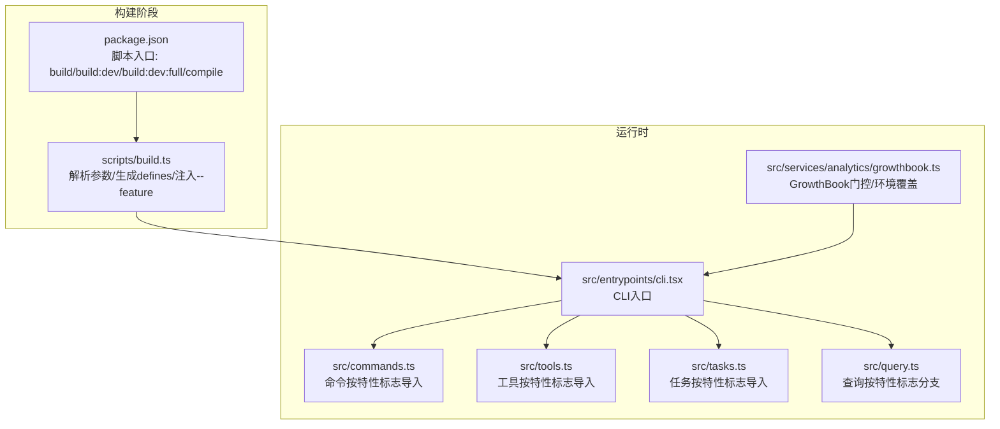
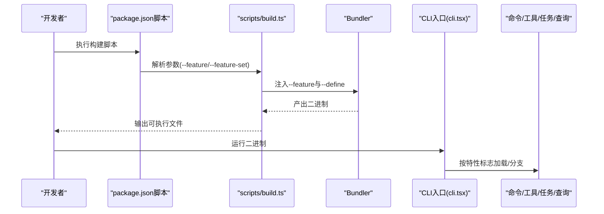
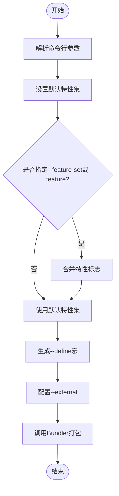
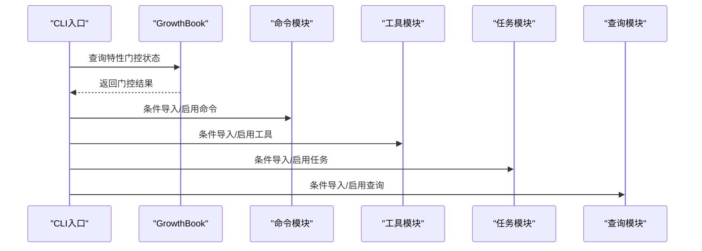
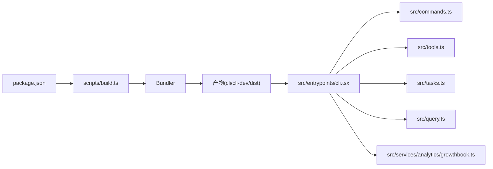

# 特性标志管理

<cite>
**本文引用的文件**
- [FEATURES.md](file://FEATURES.md)
- [package.json](file://package.json)
- [scripts/build.ts](file://scripts/build.ts)
- [src/entrypoints/cli.tsx](file://src/entrypoints/cli.tsx)
- [src/commands.ts](file://src/commands.ts)
- [src/tools.ts](file://src/tools.ts)
- [src/tasks.ts](file://src/tasks.ts)
- [src/query.ts](file://src/query.ts)
- [src/services/analytics/growthbook.ts](file://src/services/analytics/growthbook.ts)
</cite>

## 目录
1. [简介](#简介)
2. [项目结构](#项目结构)
3. [核心组件](#核心组件)
4. [架构总览](#架构总览)
5. [详细组件分析](#详细组件分析)
6. [依赖关系分析](#依赖关系分析)
7. [性能考量](#性能考量)
8. [故障排查指南](#故障排查指南)
9. [结论](#结论)
10. [附录](#附录)

## 简介
本文件系统化阐述 free-code（claude-code）的特性标志（Feature Flags）管理体系，重点覆盖以下方面：
- 设计理念与编译时开关机制
- 可用实验性功能标志的分类与说明（如 AGENT_MEMORY_SNAPSHOT、VOICE_MODE、MCP_RICH_OUTPUT 等）
- 启用方法、禁用策略与组合使用建议
- 对代码体积与运行时性能的影响评估
- 最佳实践与测试指南

## 项目结构
特性标志管理贯穿构建流程与运行时入口，主要涉及：
- 构建脚本：通过命令行参数与构建定义注入特性标志
- 运行时入口：CLI 入口根据特性标志决定加载路径与行为
- 功能模块：命令、工具、任务、查询等模块按特性标志进行条件导入与行为切换
- 分析服务：GrowthBook 支持环境变量覆盖与远程门控

**图表来源**
- [scripts/build.ts:135-190](file://scripts/build.ts#L135-L190)
- [package.json:15-21](file://package.json#L15-L21)
- [src/entrypoints/cli.tsx](file://src/entrypoints/cli.tsx)
- [src/commands.ts](file://src/commands.ts)
- [src/tools.ts](file://src/tools.ts)
- [src/tasks.ts](file://src/tasks.ts)
- [src/query.ts](file://src/query.ts)
- [src/services/analytics/growthbook.ts:159-192](file://src/services/analytics/growthbook.ts#L159-L192)

**章节来源**
- [package.json:15-21](file://package.json#L15-L21)
- [scripts/build.ts:135-190](file://scripts/build.ts#L135-L190)

## 核心组件
- 构建脚本与参数解析
  - 支持 --feature-set=dev-full 一键启用全部“工作实验特性”
  - 支持 --feature 或 --feature=NAME 单个添加特性
  - 默认包含 VOICE_MODE
- 定义注入
  - 通过 --define 注入版本、时间戳、包名等宏常量
  - 外部依赖白名单（externals）避免打包进二进制
- 运行时入口与条件加载
  - CLI 入口根据特性标志决定加载路径与行为
  - 命令、工具、任务、查询模块均支持按特性标志导入

**章节来源**
- [scripts/build.ts:82-109](file://scripts/build.ts#L82-L109)
- [scripts/build.ts:135-159](file://scripts/build.ts#L135-L159)
- [scripts/build.ts:184-190](file://scripts/build.ts#L184-L190)

## 架构总览
特性标志在“构建期”与“运行时”协同工作：
- 构建期：构建脚本将特性标志作为编译时开关传入打包器，影响模块导入与死代码消除
- 运行时：入口与各子系统依据特性标志执行不同逻辑；部分特性还受 GrowthBook 门控与环境变量覆盖

**图表来源**
- [package.json:15-21](file://package.json#L15-L21)
- [scripts/build.ts:82-109](file://scripts/build.ts#L82-L109)
- [scripts/build.ts:184-190](file://scripts/build.ts#L184-L190)
- [src/entrypoints/cli.tsx](file://src/entrypoints/cli.tsx)

## 详细组件分析

### 构建与参数解析
- 参数支持
  - --feature-set=dev-full：一次性启用全部“工作实验特性”
  - --feature NAME 或 --feature=NAME：单个添加特性
- 默认特性
  - 默认包含 VOICE_MODE
- 宏定义
  - 注入版本号、构建时间、包名、反馈渠道等信息
- 外部依赖
  - 将 @ant/*、音频/图像/NAPI 等外部模块标记为外部，避免打包

**图表来源**
- [scripts/build.ts:82-109](file://scripts/build.ts#L82-L109)
- [scripts/build.ts:135-159](file://scripts/build.ts#L135-L159)
- [scripts/build.ts:184-190](file://scripts/build.ts#L184-L190)

**章节来源**
- [scripts/build.ts:82-109](file://scripts/build.ts#L82-L109)
- [scripts/build.ts:135-159](file://scripts/build.ts#L135-L159)

### 运行时入口与特性分支
- CLI 入口
  - 根据特性标志决定加载路径与行为
- 子系统模块
  - 命令、工具、任务、查询模块均支持按特性标志导入
- GrowthBook 门控
  - 支持环境变量覆盖特定特性，便于离线/快速验证

**图表来源**
- [src/entrypoints/cli.tsx](file://src/entrypoints/cli.tsx)
- [src/services/analytics/growthbook.ts:159-192](file://src/services/analytics/growthbook.ts#L159-L192)
- [src/commands.ts](file://src/commands.ts)
- [src/tools.ts](file://src/tools.ts)
- [src/tasks.ts](file://src/tasks.ts)
- [src/query.ts](file://src/query.ts)

**章节来源**
- [src/entrypoints/cli.tsx](file://src/entrypoints/cli.tsx)
- [src/services/analytics/growthbook.ts:159-192](file://src/services/analytics/growthbook.ts#L159-L192)

### 实验性功能标志详解
以下为“工作实验特性”中与本主题直接相关的关键标志说明（摘自审计文档），并给出启用/禁用与组合建议。

- AGENT_MEMORY_SNAPSHOT
  - 说明：在应用中存储额外的自定义代理内存快照状态
  - 启用方式：--feature=AGENT_MEMORY_SNAPSHOT 或 --feature-set=dev-full
  - 组合建议：与 AGENT_TRIGGERS/AGENT_TRIGGERS_REMOTE 配合用于触发式记忆管理
- VOICE_MODE
  - 说明：启用语音切换、按键绑定、语音通知与语音 UI
  - 启用方式：默认包含；也可显式 --feature=VOICE_MODE
  - 运行时依赖：claude.ai OAuth 与本地录音后端（原生或 SoX）
- MCP_RICH_OUTPUT
  - 说明：启用更丰富的 MCP UI 渲染
  - 启用方式：--feature=MCP_RICH_OUTPUT 或 --feature-set=dev-full
  - 组合建议：与 CHICAGO_MCP/CONNECTOR_TEXT 结合提升 MCP 交互体验

其他相关标志（按类别）：
- 交互与 UI 实验：AWAY_SUMMARY、HISTORY_PICKER、HOOK_PROMPTS、KAIROS_BRIEF、KAIROS_CHANNELS、MESSAGE_ACTIONS、NEW_INIT、QUICK_SEARCH、SHOT_STATS、TOKEN_BUDGET、ULTRAPLAN、ULTRATHINK、LODESTONE
- 代理/记忆/规划：AGENT_TRIGGERS、AGENT_TRIGGERS_REMOTE、BUILTIN_EXPLORE_PLAN_AGENTS、CACHED_MICROCOMPACT、COMPACTION_REMINDERS、EXTRACT_MEMORIES、PROMPT_CACHE_BREAK_DETECTION、TEAMMEM、VERIFICATION_AGENT
- 工具/权限/远程：BASH_CLASSIFIER、BRIDGE_MODE、CCR_AUTO_CONNECT、CCR_MIRROR、CCR_REMOTE_SETUP、CHICAGO_MCP、CONNECTOR_TEXT、NATIVE_CLIPBOARD_IMAGE、POWERSHELL_AUTO_MODE、TREE_SITTER_BASH、TREE_SITTER_BASH_SHADOW、UNATTENDED_RETRY

**章节来源**
- [FEATURES.md:38-128](file://FEATURES.md#L38-L128)
- [scripts/build.ts:13-50](file://scripts/build.ts#L13-L50)

### 启用方法、禁用策略与组合使用
- 启用方法
  - 单个启用：--feature=FLAG_NAME
  - 全量启用：--feature-set=dev-full（包含全部“工作实验特性”）
  - 默认启用：VOICE_MODE 已在默认特性集中
- 禁用策略
  - 不传入对应 --feature 即为禁用
  - 使用 --feature-set=dev-full 后再通过后续 --feature 覆盖（例如禁用某特性）
- 组合使用
  - 建议以 --feature-set=dev-full 为基础，按需增删个别特性
  - 注意运行时依赖与外部模块缺失可能导致启动失败（见“已清理但运行时受限”清单）

**章节来源**
- [scripts/build.ts:82-109](file://scripts/build.ts#L82-L109)
- [FEATURES.md:30-36](file://FEATURES.md#L30-L36)

### 运行时门控与环境覆盖
- GrowthBook 门控
  - 支持通过环境变量覆盖特定特性，便于离线/快速验证
- 环境变量覆盖规则
  - 仅在特定用户类型下生效
  - 失败解析会记录错误日志

**章节来源**
- [src/services/analytics/growthbook.ts:159-192](file://src/services/analytics/growthbook.ts#L159-L192)

## 依赖关系分析
- 构建脚本依赖
  - package.json 提供脚本入口
  - scripts/build.ts 解析参数并生成构建命令
- 运行时依赖
  - CLI 入口依赖命令/工具/任务/查询模块的条件导入
  - 部分特性依赖外部 NAPI 包或 OAuth 能力

**图表来源**
- [package.json:15-21](file://package.json#L15-L21)
- [scripts/build.ts:161-190](file://scripts/build.ts#L161-L190)
- [src/entrypoints/cli.tsx](file://src/entrypoints/cli.tsx)
- [src/commands.ts](file://src/commands.ts)
- [src/tools.ts](file://src/tools.ts)
- [src/tasks.ts](file://src/tasks.ts)
- [src/query.ts](file://src/query.ts)
- [src/services/analytics/growthbook.ts:159-192](file://src/services/analytics/growthbook.ts#L159-L192)

**章节来源**
- [package.json:15-21](file://package.json#L15-L21)
- [scripts/build.ts:161-190](file://scripts/build.ts#L161-L190)

## 性能考量
- 代码体积
  - 特性标志通过编译时条件导入减少未使用代码，有助于减小二进制体积
  - 外部模块被标记为 external，避免打包进二进制，进一步降低体积
- 运行时性能
  - 部分特性需要运行时依赖（如音频/图像 NAPI、OAuth），可能增加启动与运行时开销
  - GrowthBook 门控与环境覆盖可减少网络请求，提高稳定性

**章节来源**
- [scripts/build.ts:127-133](file://scripts/build.ts#L127-L133)
- [scripts/build.ts:184-190](file://scripts/build.ts#L184-L190)
- [src/services/analytics/growthbook.ts:159-192](file://src/services/analytics/growthbook.ts#L159-L192)

## 故障排查指南
- 构建失败
  - 检查是否正确传递 --feature 或 --feature-set
  - 确认外部模块是否满足（如音频/图像 NAPI）
- 启动失败
  - 某些特性需要运行时依赖（如 claude.ai OAuth、外部 MCP 包）
  - 查看“已清理但运行时受限”清单，确认特性是否具备完整运行时支持
- 门控不生效
  - 确认环境变量覆盖仅在特定用户类型下生效
  - 检查 JSON 格式是否正确

**章节来源**
- [FEATURES.md:169-194](file://FEATURES.md#L169-L194)
- [src/services/analytics/growthbook.ts:159-192](file://src/services/analytics/growthbook.ts#L159-L192)

## 结论
- 特性标志体系以构建期参数与宏定义为核心，配合运行时 GrowthBook 门控，形成可控的实验性功能发布机制
- 建议优先使用 --feature-set=dev-full 作为基线，再按需微调
- 在启用高资源依赖特性（如语音、MCP）前，确保运行时环境满足要求
- 通过环境变量覆盖与门控，可在开发与测试阶段高效验证不同特性组合

## 附录
- 关键入口与参考
  - 构建入口：scripts/build.ts
  - CLI 入口：src/entrypoints/cli.tsx
  - 功能模块：src/commands.ts、src/tools.ts、src/tasks.ts、src/query.ts
  - 门控服务：src/services/analytics/growthbook.ts
  - 审计文档：FEATURES.md

**章节来源**
- [scripts/build.ts:135-190](file://scripts/build.ts#L135-L190)
- [src/entrypoints/cli.tsx](file://src/entrypoints/cli.tsx)
- [src/commands.ts](file://src/commands.ts)
- [src/tools.ts](file://src/tools.ts)
- [src/tasks.ts](file://src/tasks.ts)
- [src/query.ts](file://src/query.ts)
- [src/services/analytics/growthbook.ts:159-192](file://src/services/analytics/growthbook.ts#L159-L192)
- [FEATURES.md:304-318](file://FEATURES.md#L304-L318)