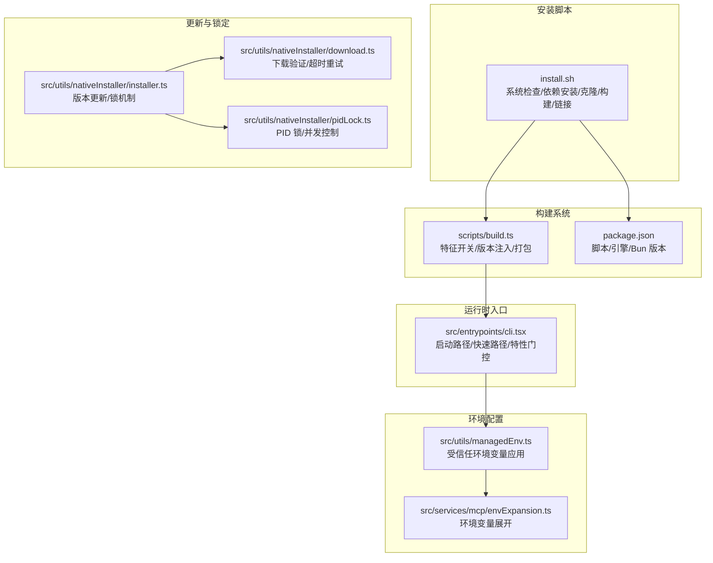
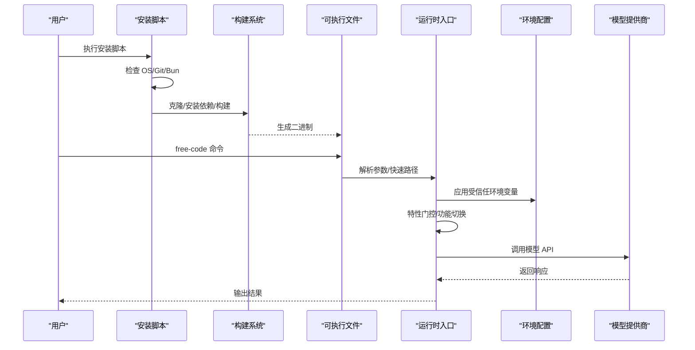
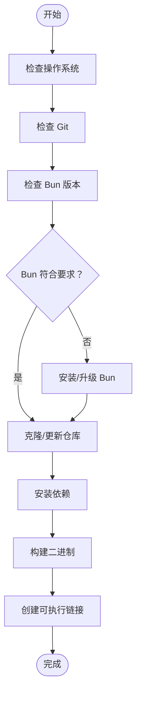
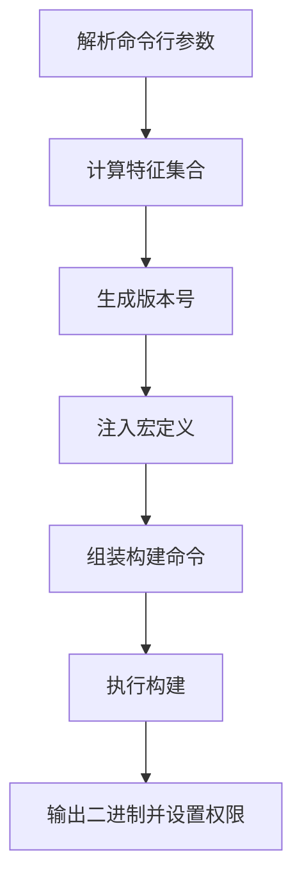
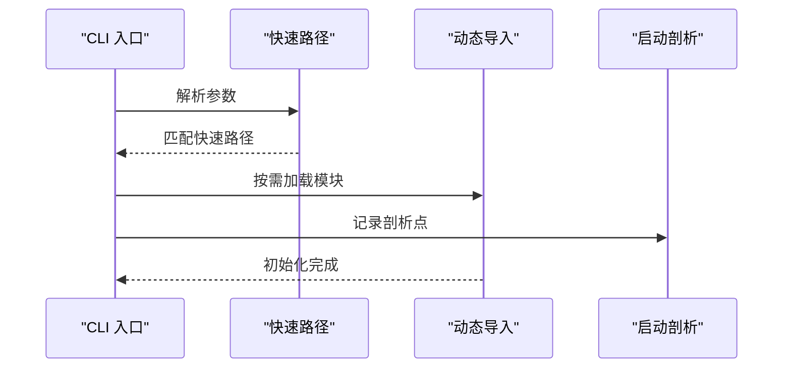
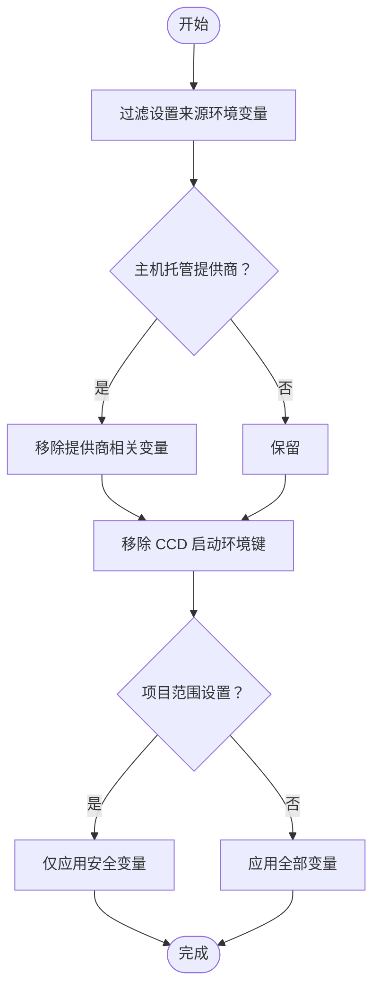
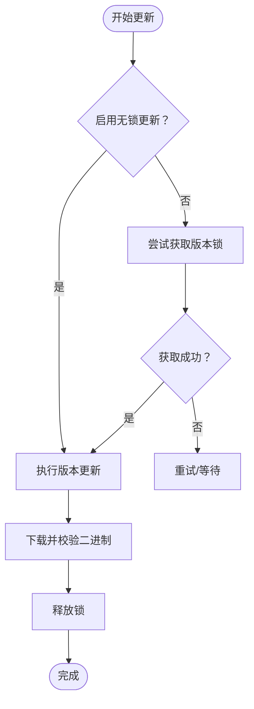
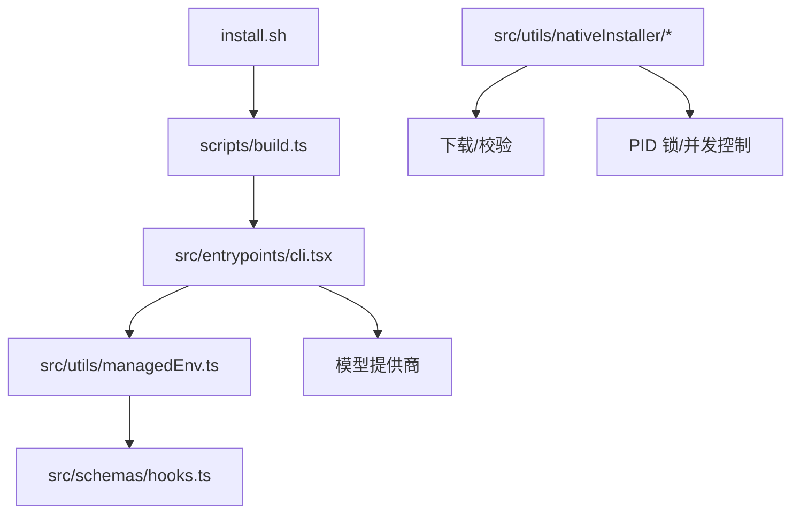

# 部署配置

<cite>
**本文档引用的文件**
- [install.sh](file://install.sh)
- [package.json](file://package.json)
- [README.md](file://README.md)
- [scripts/build.ts](file://scripts/build.ts)
- [src/entrypoints/cli.tsx](file://src/entrypoints/cli.tsx)
- [src/utils/managedEnv.ts](file://src/utils/managedEnv.ts)
- [src/services/mcp/envExpansion.ts](file://src/services/mcp/envExpansion.ts)
- [src/utils/nativesInstaller/installer.ts](file://src/utils/nativeInstaller/installer.ts)
- [src/utils/nativesInstaller/download.ts](file://src/utils/nativeInstaller/download.ts)
- [src/utils/nativesInstaller/pidLock.ts](file://src/utils/nativeInstaller/pidLock.ts)
- [src/schemas/hooks.ts](file://src/schemas/hooks.ts)
</cite>

## 目录
1. [简介](#简介)
2. [项目结构](#项目结构)
3. [核心组件](#核心组件)
4. [架构概览](#架构概览)
5. [详细组件分析](#详细组件分析)
6. [依赖关系分析](#依赖关系分析)
7. [性能考虑](#性能考虑)
8. [故障排除指南](#故障排除指南)
9. [结论](#结论)
10. [附录](#附录)

## 简介
本文件为 free-code 的部署配置详细文档，涵盖安装脚本功能与部署流程、多平台安装方法与环境要求、环境变量配置、系统依赖与权限设置、版本管理与更新机制、回滚策略、容器化部署与 CI/CD 集成指南，以及部署故障排除与性能优化建议。

## 项目结构
free-code 是基于 Bun 的终端原生 AI 编码代理，采用 TypeScript 开发，使用 React + Ink 构建终端 UI，支持多种模型提供商（Anthropic、OpenAI Codex、AWS Bedrock、Google Vertex AI、Anthropic Foundry）。项目通过安装脚本自动检测系统环境、安装依赖、克隆仓库、构建二进制并创建可执行链接。

**图表来源**
- [install.sh:1-180](file://install.sh#L1-L180)
- [scripts/build.ts:1-208](file://scripts/build.ts#L1-L208)
- [package.json:1-122](file://package.json#L1-L122)
- [src/entrypoints/cli.tsx:1-313](file://src/entrypoints/cli.tsx#L1-L313)
- [src/utils/managedEnv.ts:1-200](file://src/utils/managedEnv.ts#L1-L200)
- [src/services/mcp/envExpansion.ts:1-38](file://src/services/mcp/envExpansion.ts#L1-L38)
- [src/utils/nativeInstaller/installer.ts:564-588](file://src/utils/nativeInstaller/installer.ts#L564-L588)
- [src/utils/nativeInstaller/download.ts:250-299](file://src/utils/nativeInstaller/download.ts#L250-L299)
- [src/utils/nativeInstaller/pidLock.ts:264-363](file://src/utils/nativeInstaller/pidLock.ts#L264-L363)

**章节来源**
- [install.sh:1-180](file://install.sh#L1-L180)
- [README.md:23-359](file://README.md#L23-L359)

## 核心组件
- 安装脚本：负责系统检查、Bun 安装、Git 克隆、依赖安装、构建二进制与可执行链接。
- 构建脚本：通过特征开关启用实验性功能，注入版本信息与构建时间，输出可执行文件。
- 运行时入口：按命令行参数选择快速路径（版本查询、系统提示导出、桥接模式等），动态加载模块以优化启动速度。
- 环境配置：在建立信任前应用受信任来源的环境变量；在信任建立后应用所有设置中的环境变量，并清理相关缓存。
- 更新与锁定：支持版本更新、锁文件机制（PID 锁）、下载验证与超时重试，确保并发安全与稳定性。

**章节来源**
- [install.sh:44-161](file://install.sh#L44-L161)
- [scripts/build.ts:82-160](file://scripts/build.ts#L82-L160)
- [src/entrypoints/cli.tsx:43-313](file://src/entrypoints/cli.tsx#L43-L313)
- [src/utils/managedEnv.ts:124-199](file://src/utils/managedEnv.ts#L124-L199)

## 架构概览
下图展示从安装到运行的关键流程：安装脚本 → 构建系统 → 可执行文件 → 运行时入口 → 环境变量应用 → 功能特性门控 → 多提供商模型调用。

**图表来源**
- [install.sh:149-161](file://install.sh#L149-L161)
- [scripts/build.ts:161-197](file://scripts/build.ts#L161-L197)
- [src/entrypoints/cli.tsx:43-313](file://src/entrypoints/cli.tsx#L43-L313)
- [src/utils/managedEnv.ts:124-199](file://src/utils/managedEnv.ts#L124-L199)

## 详细组件分析

### 安装脚本（install.sh）
- 系统检查：识别 macOS/Linux 并校验 Git、Bun 版本（最低要求）。
- Bun 安装：若未安装或版本过低，执行安装脚本并更新 PATH。
- 仓库处理：克隆仓库（深度克隆），存在目录则尝试拉取最新变更。
- 依赖安装：使用 `bun install`，优先冻结锁文件。
- 构建二进制：执行开发全量特性构建，输出 `cli-dev`。
- 可执行链接：在 `~/.local/bin` 创建符号链接，提示将该目录加入 PATH。

**图表来源**
- [install.sh:44-161](file://install.sh#L44-L161)

**章节来源**
- [install.sh:44-161](file://install.sh#L44-L161)

### 构建系统（scripts/build.ts）
- 特征开关：支持默认特性集与开发全量特性集，可通过命令行参数添加或覆盖。
- 版本注入：开发版本包含时间戳与提交 SHA；生产版本使用 package.json 版本。
- 构建输出：根据是否编译与开发模式决定输出路径（cli、cli-dev、dist/cli、dist/cli-dev）。
- 定义常量：通过 `--define` 注入版本、构建时间、包名等宏定义。
- 外部依赖：排除特定 NAPI 模块，避免打包体积过大。

**图表来源**
- [scripts/build.ts:82-208](file://scripts/build.ts#L82-L208)

**章节来源**
- [scripts/build.ts:82-160](file://scripts/build.ts#L82-L160)
- [package.json:15-21](file://package.json#L15-L21)

### 运行时入口（src/entrypoints/cli.tsx）
- 快速路径：支持 `--version`、`--dump-system-prompt`、桥接模式、守护进程、后台会话、模板作业、环境运行器、自托管运行器、工作树 tmux 等。
- 启动性能：动态导入模块，启动剖析点记录，减少首屏加载时间。
- 特性门控：通过 `feature()` 在构建时进行死代码消除，仅保留启用的特性。
- 远程环境：在容器环境中设置最大堆大小，避免内存不足导致的崩溃。

**图表来源**
- [src/entrypoints/cli.tsx:43-313](file://src/entrypoints/cli.tsx#L43-L313)

**章节来源**
- [src/entrypoints/cli.tsx:43-313](file://src/entrypoints/cli.tsx#L43-L313)

### 环境变量配置（src/utils/managedEnv.ts）
- 受信任来源：用户设置、标志设置、策略设置（企业托管设置）在建立信任前应用，允许危险变量（如代理、证书）。
- 安全过滤：对项目范围设置仅应用白名单允许的安全变量；在 CCD 模式下过滤启动时由宿主注入的环境键。
- 提供商托管：当主机托管推理路由时，移除设置中可能重定向请求的提供商相关变量。
- SSH 隧道：移除 SSH 隧道占位认证变量，防止被用户设置覆盖。

**图表来源**
- [src/utils/managedEnv.ts:85-199](file://src/utils/managedEnv.ts#L85-L199)

**章节来源**
- [src/utils/managedEnv.ts:124-199](file://src/utils/managedEnv.ts#L124-L199)

### 环境变量展开（src/services/mcp/envExpansion.ts）
- 支持语法：`${VAR}` 与 `${VAR:-default}`，用于 MCP 服务器配置中的环境变量展开。
- 缺失变量追踪：记录未找到的变量以便错误报告与调试。

**章节来源**
- [src/services/mcp/envExpansion.ts:10-38](file://src/services/mcp/envExpansion.ts#L10-L38)

### 更新与锁定（src/utils/nativeInstaller）
- 版本更新：支持无锁更新与基于锁的更新，避免并发冲突。
- 下载验证：包含停滞检测（默认 60 秒无数据视为停滞）与重试逻辑。
- PID 锁：获取并持有锁文件，进程退出时自动释放，防止竞态条件。

**图表来源**
- [src/utils/nativeInstaller/installer.ts:564-588](file://src/utils/nativeInstaller/installer.ts#L564-L588)
- [src/utils/nativeInstaller/download.ts:293-299](file://src/utils/nativeInstaller/download.ts#L293-L299)
- [src/utils/nativeInstaller/pidLock.ts:264-363](file://src/utils/nativeInstaller/pidLock.ts#L264-L363)

**章节来源**
- [src/utils/nativeInstaller/installer.ts:564-588](file://src/utils/nativeInstaller/installer.ts#L564-L588)
- [src/utils/nativeInstaller/download.ts:250-299](file://src/utils/nativeInstaller/download.ts#L250-L299)
- [src/utils/nativeInstaller/pidLock.ts:264-363](file://src/utils/nativeInstaller/pidLock.ts#L264-L363)

## 依赖关系分析
- 安装脚本依赖系统工具（Git、Bun）与网络访问（GitHub 仓库）。
- 构建脚本依赖 Bun 生态与 TypeScript 编译器，输出二进制文件。
- 运行时入口依赖特性开关与环境变量，动态加载模块以优化性能。
- 环境配置模块依赖设置来源与安全白名单，确保在受信任场景下应用危险变量。
- 更新模块依赖锁文件与下载器，保证并发安全与完整性。

**图表来源**
- [install.sh:153-161](file://install.sh#L153-L161)
- [scripts/build.ts:161-197](file://scripts/build.ts#L161-L197)
- [src/entrypoints/cli.tsx:43-313](file://src/entrypoints/cli.tsx#L43-L313)
- [src/utils/managedEnv.ts:124-199](file://src/utils/managedEnv.ts#L124-L199)
- [src/schemas/hooks.ts:97-126](file://src/schemas/hooks.ts#L97-L126)
- [src/utils/nativeInstaller/download.ts:250-299](file://src/utils/nativeInstaller/download.ts#L250-L299)
- [src/utils/nativeInstaller/pidLock.ts:264-363](file://src/utils/nativeInstaller/pidLock.ts#L264-L363)

**章节来源**
- [install.sh:153-161](file://install.sh#L153-L161)
- [scripts/build.ts:161-197](file://scripts/build.ts#L161-L197)
- [src/entrypoints/cli.tsx:43-313](file://src/entrypoints/cli.tsx#L43-L313)
- [src/utils/managedEnv.ts:124-199](file://src/utils/managedEnv.ts#L124-L199)
- [src/schemas/hooks.ts:97-126](file://src/schemas/hooks.ts#L97-L126)

## 性能考虑
- 启动优化：运行时入口采用动态导入与快速路径，减少模块评估数量，显著降低启动延迟。
- 特性门控：通过构建时死代码消除，仅保留启用的特性，减小二进制体积与运行时开销。
- 内存管理：在远程/容器环境下设置最大堆大小，避免内存不足导致的性能退化。
- 构建优化：使用最小化与字节码打包，提升执行效率。

**章节来源**
- [src/entrypoints/cli.tsx:43-313](file://src/entrypoints/cli.tsx#L43-L313)
- [scripts/build.ts:161-197](file://scripts/build.ts#L161-L197)
- [src/entrypoints/cli.tsx:17-24](file://src/entrypoints/cli.tsx#L17-L24)

## 故障排除指南
- 安装失败（Bun 未找到或版本过低）
  - 确认系统满足要求（macOS/Linux），检查 Git 是否安装。
  - 若安装脚本无法将 Bun 加入 PATH，手动将 `~/.bun/bin` 添加到 PATH 并重启终端。
- 构建失败（依赖安装/构建命令返回非零状态）
  - 使用 `bun install` 或 `bun install --frozen-lockfile` 修复依赖。
  - 确保 `bun` 版本满足最低要求（package.json 中 engines 字段）。
- 运行时问题（远程控制/桥接模式不可用）
  - 检查认证状态与策略限制，确认已登录并满足组织策略。
  - 查看启动剖析点输出，定位慢路径模块。
- 环境变量问题（MCP 配置未生效）
  - 使用 `${VAR}` 或 `${VAR:-default}` 语法展开变量。
  - 确认变量已在受信任来源或安全白名单中。
- 更新冲突（并发更新失败）
  - 检查锁文件是否存在，必要时强制移除旧锁。
  - 启用无锁更新或等待锁释放后重试。

**章节来源**
- [install.sh:53-93](file://install.sh#L53-L93)
- [package.json:12-14](file://package.json#L12-L14)
- [src/entrypoints/cli.tsx:122-172](file://src/entrypoints/cli.tsx#L122-L172)
- [src/services/mcp/envExpansion.ts:10-38](file://src/services/mcp/envExpansion.ts#L10-L38)
- [src/utils/nativeInstaller/pidLock.ts:264-363](file://src/utils/nativeInstaller/pidLock.ts#L264-L363)

## 结论
本部署配置文档提供了从安装到运行的完整流程说明，涵盖了多平台支持、环境变量管理、版本更新与回滚策略、并发安全与性能优化。通过安装脚本与构建系统的协同，结合运行时的特性门控与环境变量安全应用，确保了部署的可靠性与可维护性。

## 附录

### 不同平台安装方法与环境要求
- macOS/Linux：安装脚本自动检测并安装所需工具；Windows 用户可通过 WSL 使用。
- 系统要求：Bun >= 1.3.11，Git，macOS 或 Linux。
- 环境变量：根据所选提供商设置相应变量（如 ANTHROPIC_API_KEY、AWS_REGION 等）。

**章节来源**
- [install.sh:44-60](file://install.sh#L44-L60)
- [README.md:162-172](file://README.md#L162-L172)

### 环境变量配置参考
- 基础变量：ANTHROPIC_API_KEY、ANTHROPIC_AUTH_TOKEN、ANTHROPIC_MODEL、ANTHROPIC_BASE_URL 等。
- 提供商变量：CLAUDE_CODE_USE_OPENAI、CLAUDE_CODE_USE_BEDROCK、CLAUDE_CODE_USE_VERTEX、CLAUDE_CODE_USE_FOUNDRY 等。
- AWS 变量：AWS_REGION、ANTHROPIC_BEDROCK_BASE_URL、AWS_BEARER_TOKEN_BEDROCK、CLAUDE_CODE_SKIP_BEDROCK_AUTH 等。
- GCP 变量：通过 gcloud 默认凭据认证。

**章节来源**
- [README.md:226-240](file://README.md#L226-L240)
- [README.md:102-146](file://README.md#L102-L146)

### 版本管理、更新机制与回滚策略
- 版本管理：构建脚本注入版本与构建时间，开发版本包含日期与提交 SHA。
- 更新机制：支持无锁更新与基于锁的更新，避免并发冲突；下载器具备停滞检测与重试。
- 回滚策略：通过版本路径与锁文件实现版本隔离与安全更新，必要时可强制移除锁并重新安装。

**章节来源**
- [scripts/build.ts:67-80](file://scripts/build.ts#L67-L80)
- [src/utils/nativeInstaller/installer.ts:564-588](file://src/utils/nativeInstaller/installer.ts#L564-L588)
- [src/utils/nativeInstaller/download.ts:271-299](file://src/utils/nativeInstaller/download.ts#L271-L299)
- [src/utils/nativeInstaller/pidLock.ts:264-363](file://src/utils/nativeInstaller/pidLock.ts#L264-L363)

### 容器化部署与 CI/CD 集成
- 容器化：在容器环境中设置最大堆大小，避免内存不足；通过环境变量控制提供商路由与安全策略。
- CI/CD：利用锁文件与下载器的超时与重试机制，确保流水线稳定；通过受信任环境变量应用，保障企业级安全。

**章节来源**
- [src/entrypoints/cli.tsx:17-24](file://src/entrypoints/cli.tsx#L17-L24)
- [src/utils/managedEnv.ts:124-199](file://src/utils/managedEnv.ts#L124-L199)
- [src/utils/nativeInstaller/download.ts:271-299](file://src/utils/nativeInstaller/download.ts#L271-L299)