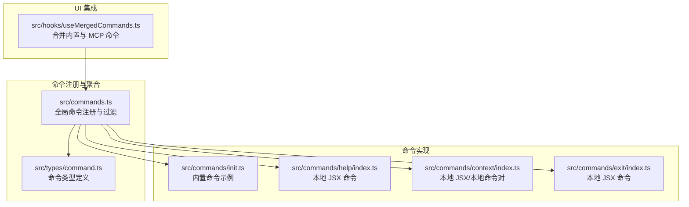
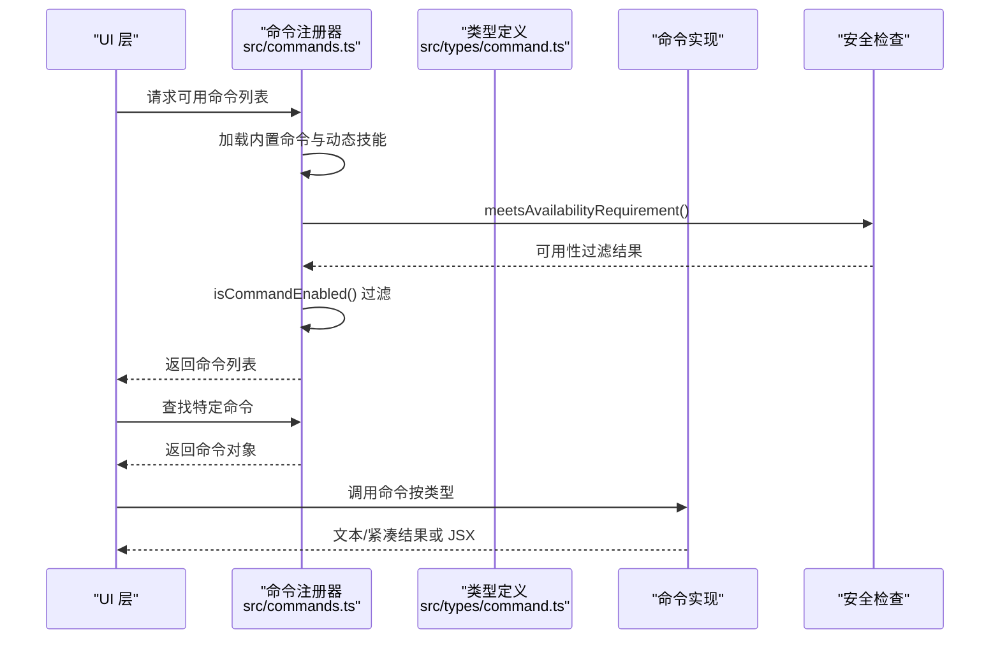
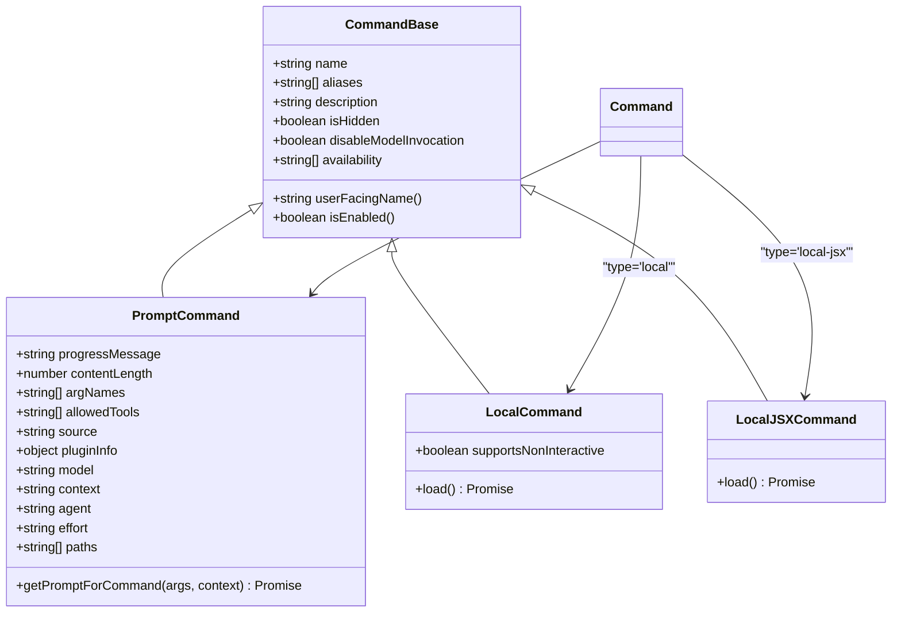
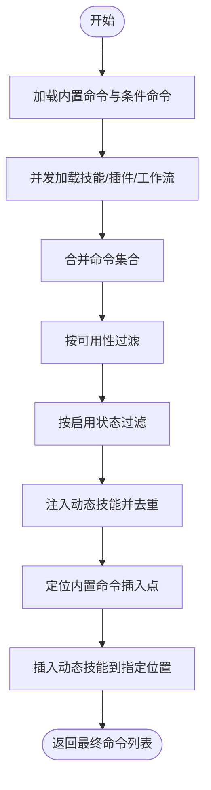
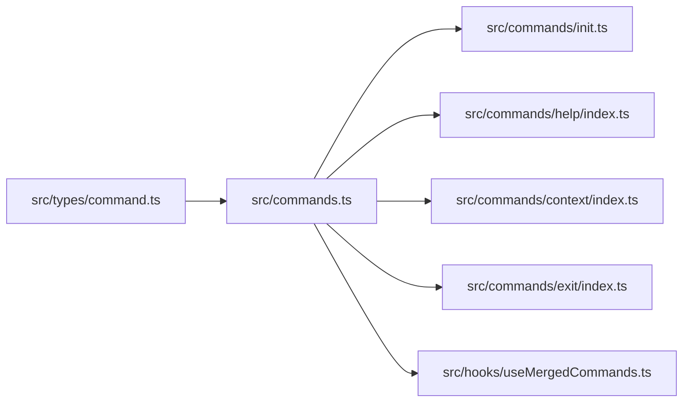

# 命令系统架构

<cite>
**本文引用的文件**
- [src/commands.ts](file://src/commands.ts)
- [src/types/command.ts](file://src/types/command.ts)
- [src/commands/init.ts](file://src/commands/init.ts)
- [src/commands/help/index.ts](file://src/commands/help/index.ts)
- [src/commands/context/index.ts](file://src/commands/context/index.ts)
- [src/commands/exit/index.ts](file://src/commands/exit/index.ts)
- [src/hooks/useMergedCommands.ts](file://src/hooks/useMergedCommands.ts)
</cite>

## 目录
1. [引言](#引言)
2. [项目结构](#项目结构)
3. [核心组件](#核心组件)
4. [架构总览](#架构总览)
5. [详细组件分析](#详细组件分析)
6. [依赖分析](#依赖分析)
7. [性能考量](#性能考量)
8. [故障排查指南](#故障排查指南)
9. [结论](#结论)
10. [附录](#附录)

## 引言
本技术文档围绕命令系统的设计与实现进行深入剖析，覆盖命令注册机制、参数解析流程、权限控制、执行管道、生命周期管理、错误处理策略、性能优化与扩展机制，并结合具体代码示例路径，解释命令系统与工具系统、查询引擎的集成关系。文档同时提供可维护性设计建议、测试策略与调试方法，帮助开发者在不直接阅读源码的情况下也能高效理解与扩展命令系统。

## 项目结构
命令系统位于 src/commands 目录下，采用“按功能分组”的模块化组织方式：每个命令以独立子目录存在，包含入口文件（通常为 index.ts）与实现文件；全局命令注册与聚合逻辑集中在 src/commands.ts 中；命令类型定义位于 src/types/command.ts；部分命令通过懒加载（lazy load）提升启动性能；与命令系统集成的 UI 层通过 React Hook useMergedCommands.ts 合并内置与 MCP 提供的命令列表。

图表来源
- [src/commands.ts](file://src/commands.ts)
- [src/types/command.ts](file://src/types/command.ts)
- [src/commands/init.ts](file://src/commands/init.ts)
- [src/commands/help/index.ts](file://src/commands/help/index.ts)
- [src/commands/context/index.ts](file://src/commands/context/index.ts)
- [src/commands/exit/index.ts](file://src/commands/exit/index.ts)
- [src/hooks/useMergedCommands.ts](file://src/hooks/useMergedCommands.ts)

章节来源
- [src/commands.ts](file://src/commands.ts)
- [src/types/command.ts](file://src/types/command.ts)
- [src/commands/init.ts](file://src/commands/init.ts)
- [src/commands/help/index.ts](file://src/commands/help/index.ts)
- [src/commands/context/index.ts](file://src/commands/context/index.ts)
- [src/commands/exit/index.ts](file://src/commands/exit/index.ts)
- [src/hooks/useMergedCommands.ts](file://src/hooks/useMergedCommands.ts)

## 核心组件
- 命令类型与接口
  - 命令分为三类：prompt（提示型）、local（本地文本输出）、local-jsx（本地 JSX 渲染）。类型定义集中于 src/types/command.ts，包含命令基础字段、可用性声明、执行上下文、结果显示选项等。
- 全局命令注册与聚合
  - src/commands.ts 负责导入所有命令模块，构建命令数组，按可用性与启用状态过滤，并支持动态技能注入与缓存管理。
- 懒加载与性能优化
  - 大量命令通过 import() 或 require() 按需加载，避免初始化时的重负载；对昂贵操作使用 memoize 缓存，如 getCommands、getSkills 等。
- 权限与可用性控制
  - 通过 availability 字段与 meetsAvailabilityRequirement 过滤，支持 claude-ai 与 console 两类提供方环境；结合 isEnabled 自定义启用条件。
- 执行安全与远程模式适配
  - 提供 REMOTE_SAFE_COMMANDS 与 BRIDGE_SAFE_COMMANDS，确保远程/移动端安全执行；isBridgeSafeCommand 统一判定。
- UI 集成
  - useMergedCommands 将内置命令与 MCP 命令去重合并，保证 UI 展示一致性。

章节来源
- [src/types/command.ts](file://src/types/command.ts)
- [src/commands.ts](file://src/commands.ts)
- [src/hooks/useMergedCommands.ts](file://src/hooks/useMergedCommands.ts)

## 架构总览
命令系统采用“类型驱动 + 动态聚合 + 懒加载 + 缓存”的架构模式：
- 类型层：统一的 Command 接口与子类型，明确命令能力边界。
- 注册层：集中导入与聚合命令，注入动态技能，按可用性与启用状态过滤。
- 安全层：基于环境与提供方的可用性检查，以及远程/桥接安全白名单。
- 执行层：根据命令类型选择 prompt/local/local-jsx 的执行路径；prompt 命令通过 getPromptForCommand 生成模型输入；local 命令返回文本或紧凑结果；local-jsx 命令渲染 UI。
- UI 层：React Hook 合并内置与 MCP 命令，避免重复。

图表来源
- [src/commands.ts](file://src/commands.ts)
- [src/types/command.ts](file://src/types/command.ts)

## 详细组件分析

### 命令类型与接口（Prompt/Local/LocalJSX）
- Prompt 命令
  - 用于生成模型输入内容，包含进度消息、内容长度、允许工具、上下文与代理配置、effort 等元数据。
  - 关键字段：progressMessage、contentLength、allowedTools、context、agent、effort、paths、getPromptForCommand。
- Local 命令
  - 本地文本输出命令，支持非交互式调用，通过 load() 返回 call(args, context) 实现。
- LocalJSX 命令
  - 本地 JSX 渲染命令，通过 load() 返回 call(onDone, context, args) 实现，适合需要 UI 交互的场景。
- 命令基础字段
  - availability/isEnabled/isHidden/name/aliases/userFacingName/disableModelInvocation 等，用于控制可见性、可用性与展示名。

图表来源
- [src/types/command.ts](file://src/types/command.ts)

章节来源
- [src/types/command.ts](file://src/types/command.ts)

### 命令注册与聚合（src/commands.ts）
- 导入与条件加载
  - 使用静态 import 与动态 require/import 结合，按特性开关（feature flags）与环境变量条件加载命令与技能。
- 命令构建与过滤
  - COMMANDS() 构建内置命令数组；getCommands() 在每次调用时重新评估可用性与启用状态，确保登录态变化后即时生效。
- 动态技能注入
  - 支持从技能目录、插件、工作流脚本与动态发现的技能中注入命令，并去重插入到合适位置。
- 缓存与清理
  - 对昂贵加载使用 memoize；提供 clearCommandMemoizationCaches 与 clearCommandsCache 清理缓存。
- 安全与远程模式
  - REMOTE_SAFE_COMMANDS 与 BRIDGE_SAFE_COMMANDS 白名单；isBridgeSafeCommand 统一判定；filterCommandsForRemoteMode 预过滤。

图表来源
- [src/commands.ts](file://src/commands.ts)

章节来源
- [src/commands.ts](file://src/commands.ts)

### 内置命令示例：init（Prompt 命令）
- 角色与用途
  - 生成 CLAUDE.md 文件与可选技能/钩子，支持新旧两种引导流程。
- 关键实现要点
  - 通过 feature('NEW_INIT') 切换提示词；根据用户类型或环境变量决定描述文案。
  - getPromptForCommand 返回文本块作为模型输入。
- 适用场景
  - 新项目初始化、团队知识沉淀、个人偏好设置。

章节来源
- [src/commands/init.ts](file://src/commands/init.ts)

### 本地 JSX 命令示例：help
- 角色与用途
  - 提供帮助与可用命令列表的 UI 展示。
- 关键实现要点
  - type 为 local-jsx，通过 load() 懒加载实现模块。

章节来源
- [src/commands/help/index.ts](file://src/commands/help/index.ts)

### 本地 JSX/本地命令对：context
- 角色与用途
  - context：交互式会话中可视化上下文使用情况；contextNonInteractive：非交互式会话中显示当前上下文使用量。
- 关键实现要点
  - 通过 isEnabled 与 isHidden 控制在不同会话模式下的可见性；分别提供 JSX 与本地实现。

章节来源
- [src/commands/context/index.ts](file://src/commands/context/index.ts)

### 本地 JSX 命令示例：exit
- 角色与用途
  - 退出 REPL，支持别名 quit；immediate 标记表示立即执行。
- 关键实现要点
  - type 为 local-jsx，通过 load() 懒加载实现模块。

章节来源
- [src/commands/exit/index.ts](file://src/commands/exit/index.ts)

### UI 集成：useMergedCommands
- 角色与用途
  - 将内置命令与 MCP 提供的命令进行去重合并，保证 UI 展示一致性。
- 关键实现要点
  - 使用 useMemo 缓存合并结果；当任一列表变化时重新合并。

章节来源
- [src/hooks/useMergedCommands.ts](file://src/hooks/useMergedCommands.ts)

## 依赖分析
- 命令类型依赖
  - CommandBase/PromptCommand/LocalCommand/LocalJSXCommand 由 src/types/command.ts 定义，被 src/commands.ts 与各命令实现文件引用。
- 命令注册依赖
  - src/commands.ts 依赖各命令模块的导出，同时依赖工具与技能加载模块、特性开关与认证状态判断函数。
- UI 依赖
  - useMergedCommands 依赖 React 与 lodash-es 的 uniqBy，依赖 src/commands.ts 提供的命令列表。
- 执行安全依赖
  - isBridgeSafeCommand 依赖 REMOTE_SAFE_COMMANDS 与 BRIDGE_SAFE_COMMANDS；meetAvailabilityRequirement 依赖认证与提供方判断函数。

图表来源
- [src/commands.ts](file://src/commands.ts)
- [src/types/command.ts](file://src/types/command.ts)
- [src/commands/init.ts](file://src/commands/init.ts)
- [src/commands/help/index.ts](file://src/commands/help/index.ts)
- [src/commands/context/index.ts](file://src/commands/context/index.ts)
- [src/commands/exit/index.ts](file://src/commands/exit/index.ts)
- [src/hooks/useMergedCommands.ts](file://src/hooks/useMergedCommands.ts)

章节来源
- [src/commands.ts](file://src/commands.ts)
- [src/types/command.ts](file://src/types/command.ts)
- [src/commands/init.ts](file://src/commands/init.ts)
- [src/commands/help/index.ts](file://src/commands/help/index.ts)
- [src/commands/context/index.ts](file://src/commands/context/index.ts)
- [src/commands/exit/index.ts](file://src/commands/exit/index.ts)
- [src/hooks/useMergedCommands.ts](file://src/hooks/useMergedCommands.ts)

## 性能考量
- 懒加载与按需导入
  - 大量命令通过 import() 或 require() 按需加载，减少初始包体积与启动时间。
- 缓存策略
  - 对昂贵操作（如 getCommands、getSkills、getSkillToolCommands、getSlashCommandToolSkills）使用 memoize 缓存；提供 clearCommandMemoizationCaches 与 clearCommandsCache 清理缓存。
- 并发加载
  - 使用 Promise.all 并发加载技能、插件与工作流命令，缩短等待时间。
- 非交互式与远程模式
  - 预过滤 REMOTE_SAFE_COMMANDS，避免在远程模式下渲染本地命令；isBridgeSafeCommand 仅允许安全命令通过。

章节来源
- [src/commands.ts](file://src/commands.ts)

## 故障排查指南
- 命令未出现或不可见
  - 检查 availability 是否满足当前提供方要求；确认 isEnabled 返回值；查看是否被 REMOTE_SAFE_COMMANDS/BRIDGE_SAFE_COMMANDS 限制。
- 命令执行失败
  - 对于 prompt 命令，检查 getPromptForCommand 的实现与上下文；对于 local/local-jsx 命令，检查 load() 返回模块的 call 函数签名与实现。
- 动态技能未生效
  - 确认动态技能已注入且未与内置命令重名；调用 clearCommandMemoizationCaches 或 clearCommandsCache 以刷新缓存。
- UI 显示异常
  - 检查 useMergedCommands 的合并逻辑与依赖项变更；确认命令名称唯一性。

章节来源
- [src/commands.ts](file://src/commands.ts)
- [src/hooks/useMergedCommands.ts](file://src/hooks/useMergedCommands.ts)

## 结论
命令系统通过类型驱动、动态聚合、懒加载与缓存策略实现了高可扩展性与高性能；配合可用性与安全白名单机制，确保在多环境与多客户端（本地/远程/移动端）下稳定运行。通过统一的命令接口与清晰的生命周期管理，开发者可以快速新增命令、注入动态技能并保持 UI 一致性。

## 附录

### 命令生命周期管理
- 定义阶段：在命令目录下编写 index.ts，声明命令类型、描述、可用性与执行实现。
- 注册阶段：在 src/commands.ts 中导入并加入 COMMANDS 或动态注入。
- 运行阶段：UI 层请求命令列表，按可用性与启用状态过滤；执行时根据类型选择 prompt/local/local-jsx 路径。
- 清理阶段：必要时调用 clearCommandsCache 清理缓存，触发重新加载。

章节来源
- [src/commands.ts](file://src/commands.ts)
- [src/types/command.ts](file://src/types/command.ts)

### 错误处理策略
- 加载失败容错：getSkills 与 getSlashCommandToolSkills 对加载失败进行捕获并返回空数组，避免影响主流程。
- 命令查找失败：getCommand 抛出带可用命令列表的错误信息，便于用户自助排查。
- 日志记录：使用 logError 与 logForDebugging 记录错误与调试信息。

章节来源
- [src/commands.ts](file://src/commands.ts)

### 测试策略与调试方法
- 单元测试
  - 针对命令类型定义与过滤逻辑编写单元测试，覆盖 availability、isEnabled、REMOTE_SAFE_COMMANDS/BRIDGE_SAFE_COMMANDS 等分支。
- 集成测试
  - 通过 useMergedCommands 验证内置与 MCP 命令的合并行为；验证 getCommands 的缓存与去重逻辑。
- 调试方法
  - 使用 logForDebugging 输出中间状态；在命令实现中增加断点；利用 clearCommandsCache 刷新缓存以观察效果。

章节来源
- [src/commands.ts](file://src/commands.ts)
- [src/hooks/useMergedCommands.ts](file://src/hooks/useMergedCommands.ts)