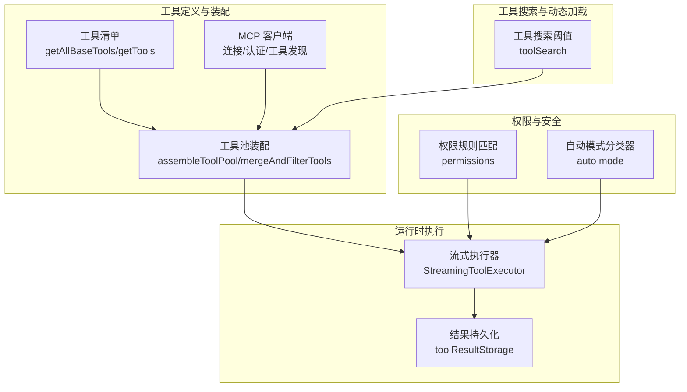
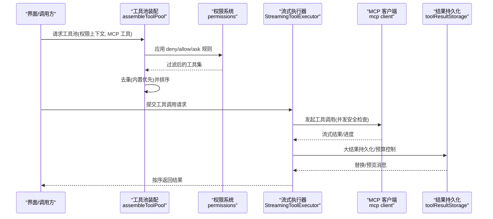
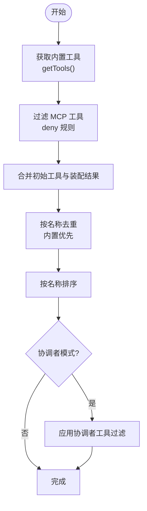
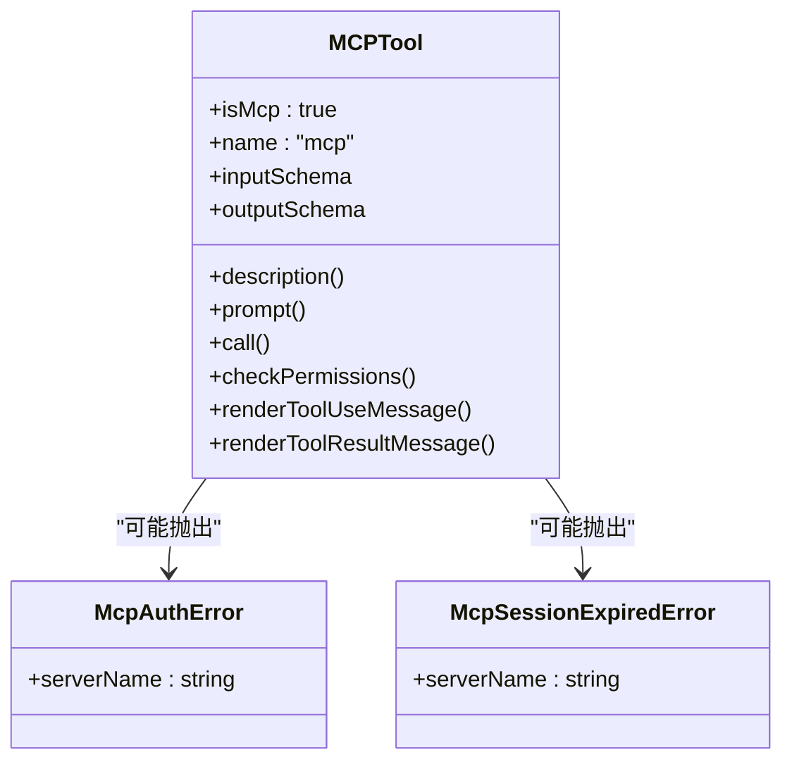
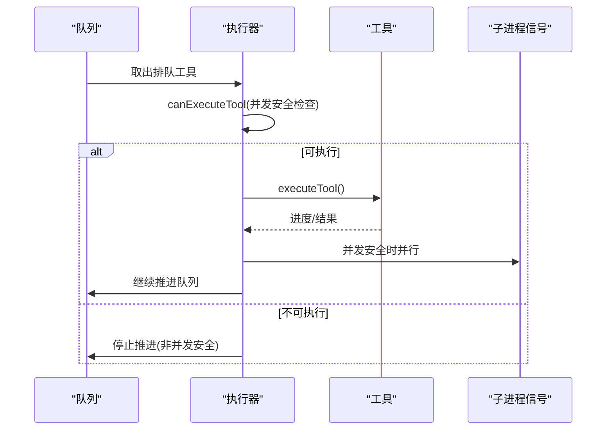
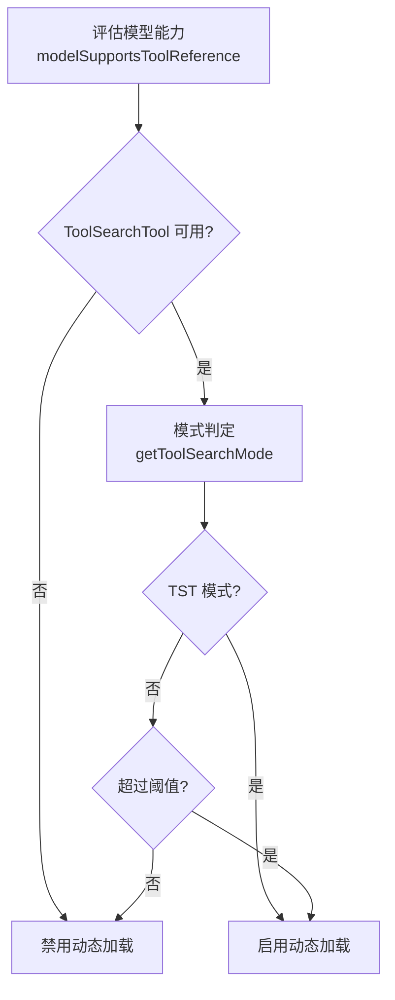
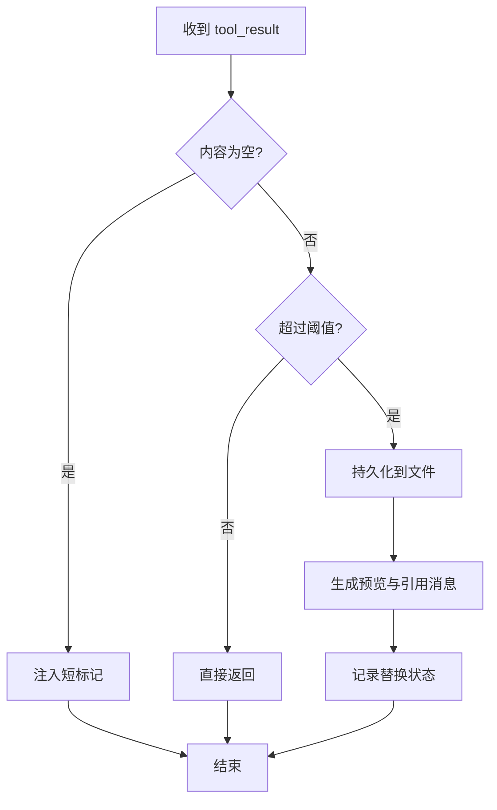
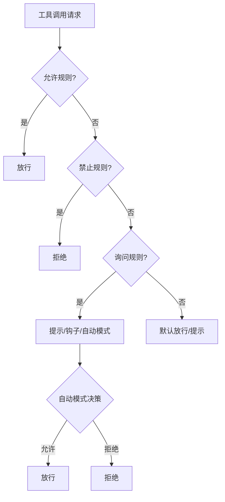
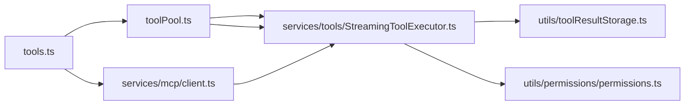

# 工具池管理

<cite>
**本文引用的文件**
- [src/tools.ts](file://src/tools.ts)
- [src/hooks/useMergedTools.ts](file://src/hooks/useMergedTools.ts)
- [src/utils/toolPool.ts](file://src/utils/toolPool.ts)
- [src/utils/toolSearch.ts](file://src/utils/toolSearch.ts)
- [src/services/mcp/client.ts](file://src/services/mcp/client.ts)
- [src/tools/MCPTool/MCPTool.ts](file://src/tools/MCPTool/MCPTool.ts)
- [src/services/tools/StreamingToolExecutor.ts](file://src/services/tools/StreamingToolExecutor.ts)
- [src/utils/toolResultStorage.ts](file://src/utils/toolResultStorage.ts)
- [src/utils/permissions/permissions.ts](file://src/utils/permissions/permissions.ts)
</cite>

## 目录
1. [简介](#简介)
2. [项目结构](#项目结构)
3. [核心组件](#核心组件)
4. [架构总览](#架构总览)
5. [详细组件分析](#详细组件分析)
6. [依赖分析](#依赖分析)
7. [性能考量](#性能考量)
8. [故障排查指南](#故障排查指南)
9. [结论](#结论)
10. [附录](#附录)

## 简介
本文件系统化阐述工具池管理的设计与实现，覆盖以下关键主题：
- 工具池构建原理：内置工具整合、MCP 工具合并、去重策略与排序机制
- 工具池组装算法、过滤逻辑、优先级管理与缓存策略
- 权限系统集成：工具可见性控制、可用性检查与激活机制
- 与插件系统、MCP 协议和用户界面的协作关系
- 性能优化、内存管理与扩展性设计

## 项目结构
工具池管理横跨多个层次：
- 工具定义与装配层：工具清单、权限过滤、MCP 合并与排序
- 运行时执行层：并发控制、结果持久化、预算与压缩
- 权限与安全层：规则匹配、自动分类器、拒绝追踪
- 工具搜索与动态加载：延迟加载、阈值判断、增量变更

**图表来源**
- [src/tools.ts:193-390](file://src/tools.ts#L193-L390)
- [src/utils/toolPool.ts:55-80](file://src/utils/toolPool.ts#L55-L80)
- [src/services/mcp/client.ts:595-800](file://src/services/mcp/client.ts#L595-L800)
- [src/services/tools/StreamingToolExecutor.ts:40-151](file://src/services/tools/StreamingToolExecutor.ts#L40-L151)
- [src/utils/toolResultStorage.ts:137-334](file://src/utils/toolResultStorage.ts#L137-L334)
- [src/utils/permissions/permissions.ts:473-800](file://src/utils/permissions/permissions.ts#L473-L800)
- [src/utils/toolSearch.ts:385-473](file://src/utils/toolSearch.ts#L385-L473)

**章节来源**
- [src/tools.ts:193-390](file://src/tools.ts#L193-L390)
- [src/utils/toolPool.ts:55-80](file://src/utils/toolPool.ts#L55-L80)
- [src/utils/toolSearch.ts:385-473](file://src/utils/toolSearch.ts#L385-L473)

## 核心组件
- 工具清单与装配
  - 内置工具集合：通过环境特性开关与条件导入生成，支持简单模式、REPL 模式与协调者模式下的差异化装配
  - MCP 工具：由 MCP 客户端动态发现并注入，支持认证失败、会话过期等异常处理
  - 装配函数：统一合并内置与 MCP 工具，应用权限过滤与去重，保证提示词缓存稳定性
- 流式执行器
  - 并发控制：区分并发安全与非并发安全工具，串行或并行执行，确保顺序一致性与资源隔离
  - 结果收集：按序产出进度与最终结果，支持中断与回退
- 权限与安全
  - 规则匹配：允许/禁止/询问规则，支持 MCP 服务器级规则与前缀规则
  - 自动模式：在无交互场景下使用分类器进行快速决策
- 工具搜索与动态加载
  - 延迟加载：基于阈值与模型能力，将 MCP 工具以 tool_reference 形式延迟加载
  - 增量变更：记录 deferred tools 的增删变化，用于诊断与统计

**章节来源**
- [src/tools.ts:271-367](file://src/tools.ts#L271-L367)
- [src/services/tools/StreamingToolExecutor.ts:40-151](file://src/services/tools/StreamingToolExecutor.ts#L40-L151)
- [src/utils/permissions/permissions.ts:233-320](file://src/utils/permissions/permissions.ts#L233-L320)
- [src/utils/toolSearch.ts:385-473](file://src/utils/toolSearch.ts#L385-L473)

## 架构总览
工具池管理采用“装配-执行-反馈”的分层架构：
- 装配层负责工具来源聚合与规则过滤，确保输出稳定有序
- 执行层负责并发调度与结果持久化，兼顾性能与一致性
- 权限层贯穿始终，提供细粒度的可见性与可用性控制
- 动态加载层根据上下文与阈值决定是否延迟加载 MCP 工具

**图表来源**
- [src/tools.ts:345-367](file://src/tools.ts#L345-L367)
- [src/utils/permissions/permissions.ts:473-800](file://src/utils/permissions/permissions.ts#L473-L800)
- [src/services/tools/StreamingToolExecutor.ts:40-151](file://src/services/tools/StreamingToolExecutor.ts#L40-L151)
- [src/utils/toolResultStorage.ts:205-334](file://src/utils/toolResultStorage.ts#L205-L334)

## 详细组件分析

### 组件A：工具池装配与合并
- 装配流程
  - 获取内置工具：根据模式（简单/REPL/协调者）与特性开关筛选
  - 过滤 MCP 工具：应用 deny 规则，剔除黑名单工具
  - 去重与排序：以工具名去重，内置工具保持连续前缀，避免缓存键失效
- 合并与过滤
  - 初始工具叠加：初始工具优先于装配结果
  - 协调者模式过滤：仅保留允许的工具集合
- 关键路径
  - 装配入口：assembleToolPool
  - 合并与过滤：mergeAndFilterTools
  - 权限过滤：filterToolsByDenyRules

**图表来源**
- [src/tools.ts:271-367](file://src/tools.ts#L271-L367)
- [src/utils/toolPool.ts:55-80](file://src/utils/toolPool.ts#L55-L80)

**章节来源**
- [src/tools.ts:271-367](file://src/tools.ts#L271-L367)
- [src/utils/toolPool.ts:55-80](file://src/utils/toolPool.ts#L55-L80)

### 组件B：MCP 工具整合与权限检查
- MCP 工具发现与封装
  - 工具描述截断：限制描述长度，避免超大输入
  - 并发安全标注：从 annotations 推断只读/破坏性/开放世界等属性
  - 权限检查：统一返回“放行”策略，具体决策由权限系统在调用时执行
- 认证与会话管理
  - 认证失败缓存：15 分钟 TTL，批量连接时共享缓存读写
  - 会话过期检测：HTTP 404 + JSON-RPC -32001 区分通用 404
- 关键路径
  - 工具封装：MCPTool 定义
  - 权限检查：checkPermissions 返回策略
  - 认证缓存：isMcpAuthCached/setMcpAuthCacheEntry

**图表来源**
- [src/tools/MCPTool/MCPTool.ts:27-78](file://src/tools/MCPTool/MCPTool.ts#L27-L78)
- [src/services/mcp/client.ts:152-206](file://src/services/mcp/client.ts#L152-L206)

**章节来源**
- [src/tools/MCPTool/MCPTool.ts:27-78](file://src/tools/MCPTool/MCPTool.ts#L27-L78)
- [src/services/mcp/client.ts:152-206](file://src/services/mcp/client.ts#L152-L206)

### 组件C：流式执行器与并发控制
- 并发策略
  - 并发安全：工具声明 isConcurrencySafe，允许多个并发安全工具并行
  - 非并发安全：串行执行，避免资源竞争
- 中断与回退
  - 兄弟工具错误传播：如 Bash 错误导致同批其他工具取消
  - 用户中断：根据工具中断行为选择取消或阻塞
  - 流式回退：丢弃当前尝试的结果，转为同步执行
- 关键路径
  - 队列推进：processQueue
  - 执行管线：executeTool
  - 结果产出：getCompletedResults/getRemainingResults

**图表来源**
- [src/services/tools/StreamingToolExecutor.ts:140-151](file://src/services/tools/StreamingToolExecutor.ts#L140-L151)
- [src/services/tools/StreamingToolExecutor.ts:265-405](file://src/services/tools/StreamingToolExecutor.ts#L265-L405)

**章节来源**
- [src/services/tools/StreamingToolExecutor.ts:140-151](file://src/services/tools/StreamingToolExecutor.ts#L140-L151)
- [src/services/tools/StreamingToolExecutor.ts:265-405](file://src/services/tools/StreamingToolExecutor.ts#L265-L405)

### 组件D：工具搜索与动态加载
- 模式与阈值
  - 模式：总是延迟(TST)、自动阈值(TST-AUTO)、标准(内联)
  - 阈值：基于 token 或字符数估算 MCP 工具描述大小
- 动态加载
  - tool_reference：模型侧按需展开工具定义
  - 增量变更：deferred_tools_delta 记录新增/移除工具
- 关键路径
  - 模式判定：getToolSearchMode/isToolSearchEnabled
  - 增量计算：getDeferredToolsDelta
  - 引用提取：extractDiscoveredToolNames

**图表来源**
- [src/utils/toolSearch.ts:385-473](file://src/utils/toolSearch.ts#L385-L473)
- [src/utils/toolSearch.ts:646-706](file://src/utils/toolSearch.ts#L646-L706)

**章节来源**
- [src/utils/toolSearch.ts:385-473](file://src/utils/toolSearch.ts#L385-L473)
- [src/utils/toolSearch.ts:646-706](file://src/utils/toolSearch.ts#L646-L706)

### 组件E：结果持久化与预算控制
- 大结果处理
  - 阈值：工具声明上限与全局默认上限取最小值；支持特性覆盖
  - 持久化：将内容写入会话目录，生成预览与引用消息
  - 空结果保护：空内容注入短标记，避免模型边界问题
- 消息级预算
  - 分组聚合：按 API 用户消息分组，避免跨消息边界误判
  - 决策稳定：已见 ID 冻结替换策略，确保提示词缓存前缀稳定
- 关键路径
  - 阈值解析：getPersistenceThreshold
  - 持久化：persistToolResult/processToolResultBlock
  - 预算执行：enforceToolResultBudget

**图表来源**
- [src/utils/toolResultStorage.ts:272-334](file://src/utils/toolResultStorage.ts#L272-L334)
- [src/utils/toolResultStorage.ts:769-800](file://src/utils/toolResultStorage.ts#L769-L800)

**章节来源**
- [src/utils/toolResultStorage.ts:272-334](file://src/utils/toolResultStorage.ts#L272-L334)
- [src/utils/toolResultStorage.ts:769-800](file://src/utils/toolResultStorage.ts#L769-L800)

### 组件F：权限系统与工具可用性检查
- 规则匹配
  - 允许/禁止/询问规则：支持工具名、MCP 服务器前缀与通配符
  - 代理规则：Agent(agentType) 语法对特定代理类型生效
- 自动模式
  - acceptEdits 快速路径：工作目录安全操作跳过分类器
  - 安全白名单：高可信工具直接放行
  - 分类器：YOLO 行为分类，记录连败与成本
- 关键路径
  - 规则匹配：toolMatchesRule/getDenyRuleForTool
  - 决策流程：hasPermissionsToUseToolInner
  - 拒绝追踪：recordDenial/recordSuccess

**图表来源**
- [src/utils/permissions/permissions.ts:233-320](file://src/utils/permissions/permissions.ts#L233-L320)
- [src/utils/permissions/permissions.ts:473-800](file://src/utils/permissions/permissions.ts#L473-L800)

**章节来源**
- [src/utils/permissions/permissions.ts:233-320](file://src/utils/permissions/permissions.ts#L233-L320)
- [src/utils/permissions/permissions.ts:473-800](file://src/utils/permissions/permissions.ts#L473-L800)

## 依赖分析
- 组件耦合
  - 工具池装配依赖权限模块进行 deny 规则过滤
  - 流式执行器依赖 MCP 客户端与权限系统进行并发与可用性控制
  - 结果持久化依赖预算模块与特性配置
- 外部依赖
  - MCP SDK：传输层抽象、认证与会话管理
  - 分类器服务：自动模式下的行为决策
  - 文件系统：工具结果持久化

**图表来源**
- [src/tools.ts:271-367](file://src/tools.ts#L271-L367)
- [src/utils/toolPool.ts:55-80](file://src/utils/toolPool.ts#L55-L80)
- [src/services/mcp/client.ts:595-800](file://src/services/mcp/client.ts#L595-L800)
- [src/services/tools/StreamingToolExecutor.ts:40-151](file://src/services/tools/StreamingToolExecutor.ts#L40-L151)
- [src/utils/toolResultStorage.ts:137-334](file://src/utils/toolResultStorage.ts#L137-L334)
- [src/utils/permissions/permissions.ts:473-800](file://src/utils/permissions/permissions.ts#L473-L800)

**章节来源**
- [src/tools.ts:271-367](file://src/tools.ts#L271-L367)
- [src/utils/toolPool.ts:55-80](file://src/utils/toolPool.ts#L55-L80)
- [src/services/mcp/client.ts:595-800](file://src/services/mcp/client.ts#L595-L800)
- [src/services/tools/StreamingToolExecutor.ts:40-151](file://src/services/tools/StreamingToolExecutor.ts#L40-L151)
- [src/utils/toolResultStorage.ts:137-334](file://src/utils/toolResultStorage.ts#L137-L334)
- [src/utils/permissions/permissions.ts:473-800](file://src/utils/permissions/permissions.ts#L473-L800)

## 性能考量
- 装配与排序
  - 使用稳定排序与去重，确保内置工具前缀连续，避免缓存键抖动
  - 对 MCP 工具进行 deny 规则过滤，减少后续执行负担
- 并发执行
  - 并发安全工具并行执行，非并发安全工具串行，平衡吞吐与一致性
  - 兄弟工具错误传播，避免无效资源消耗
- 结果持久化
  - 大结果按阈值持久化，避免内存膨胀与 API 限制
  - 预算控制按消息分组，减少跨消息边界误判
- 动态加载
  - 基于阈值与模型能力的延迟加载，降低初始上下文开销
  - 增量变更记录，便于诊断与统计

[本节为通用指导，无需具体文件分析]

## 故障排查指南
- MCP 工具不可用
  - 检查认证失败缓存与会话过期：查看缓存条目与错误日志
  - 确认模型是否支持 tool_reference：不支持时切换为标准模式
- 工具未出现或被隐藏
  - 检查 deny 规则与模式过滤：确认工具名与 MCP 前缀规则
  - 确认 REPL 模式下是否被隐藏：REPL 仅暴露 VM 内部工具
- 工具执行异常
  - 查看流式执行器的中断原因：兄弟错误/用户中断/流式回退
  - 检查权限决策：自动模式分类器是否可用，连败状态是否触发拒绝
- 结果过大或丢失
  - 检查持久化阈值与特性覆盖：确认是否被持久化
  - 查看预算控制是否替换：确认替换记录与预览消息

**章节来源**
- [src/services/mcp/client.ts:280-316](file://src/services/mcp/client.ts#L280-L316)
- [src/utils/toolSearch.ts:418-472](file://src/utils/toolSearch.ts#L418-L472)
- [src/services/tools/StreamingToolExecutor.ts:210-231](file://src/services/tools/StreamingToolExecutor.ts#L210-L231)
- [src/utils/permissions/permissions.ts:520-793](file://src/utils/permissions/permissions.ts#L520-L793)
- [src/utils/toolResultStorage.ts:324-334](file://src/utils/toolResultStorage.ts#L324-L334)

## 结论
工具池管理通过“装配-执行-反馈”的分层设计，在保证安全性与一致性的前提下，实现了高性能、可扩展的工具编排能力。内置工具与 MCP 工具的统一装配、严格的权限过滤、智能的并发控制与结果持久化策略，共同构成了稳定可靠的工具生态。动态加载与预算控制进一步提升了用户体验与系统性能。

[本节为总结，无需具体文件分析]

## 附录
- 代码示例路径（不含具体代码）
  - 工具池装配入口：[assembleToolPool:345-367](file://src/tools.ts#L345-L367)
  - 合并与过滤：[mergeAndFilterTools:55-80](file://src/utils/toolPool.ts#L55-L80)
  - 流式执行器队列推进：[processQueue:140-151](file://src/services/tools/StreamingToolExecutor.ts#L140-L151)
  - 结果持久化阈值解析：[getPersistenceThreshold:55-78](file://src/utils/toolResultStorage.ts#L55-L78)
  - 动态加载模式判定：[isToolSearchEnabled:385-473](file://src/utils/toolSearch.ts#L385-L473)

[本节为补充说明，无需具体文件分析]