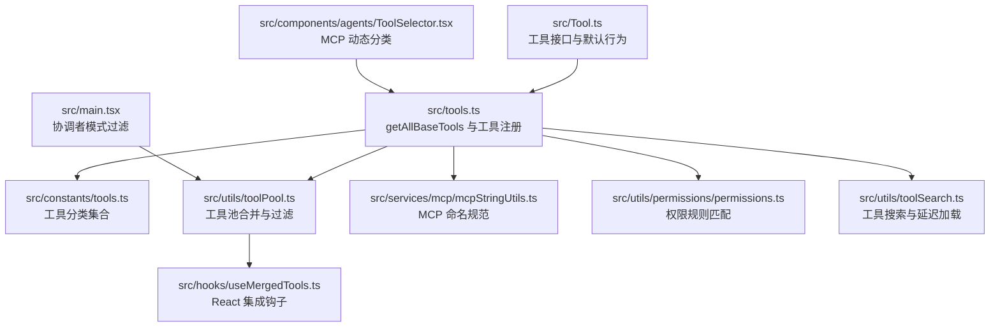
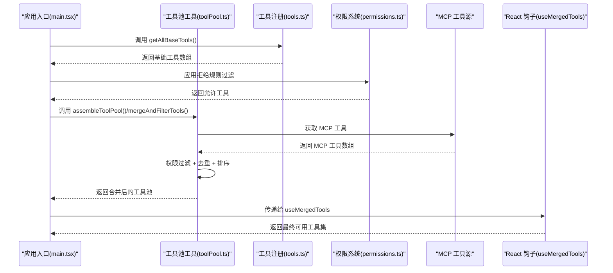
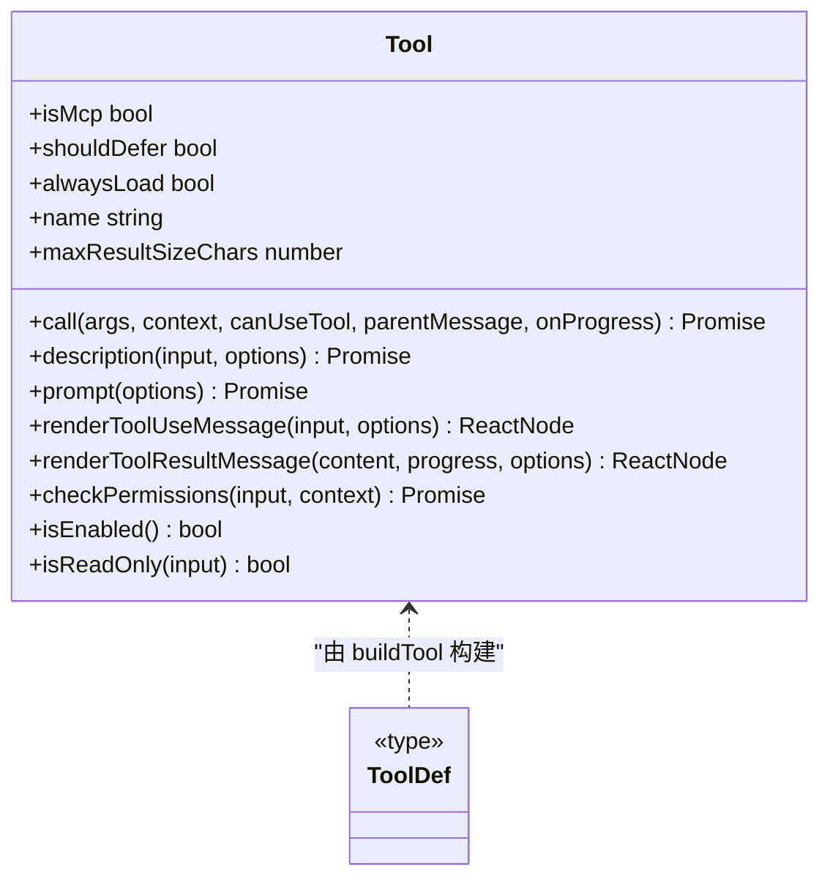
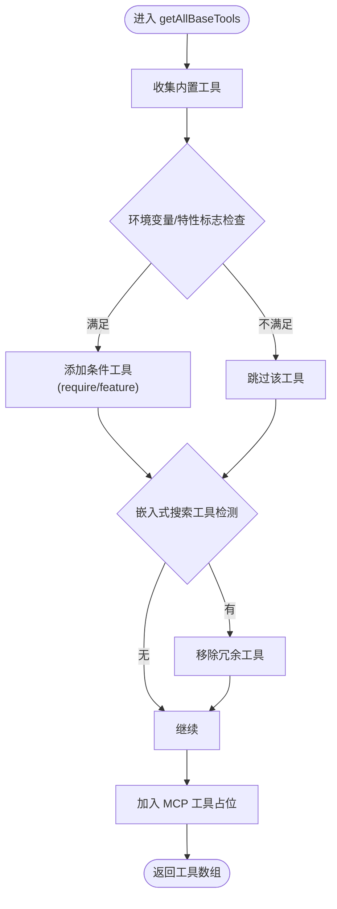
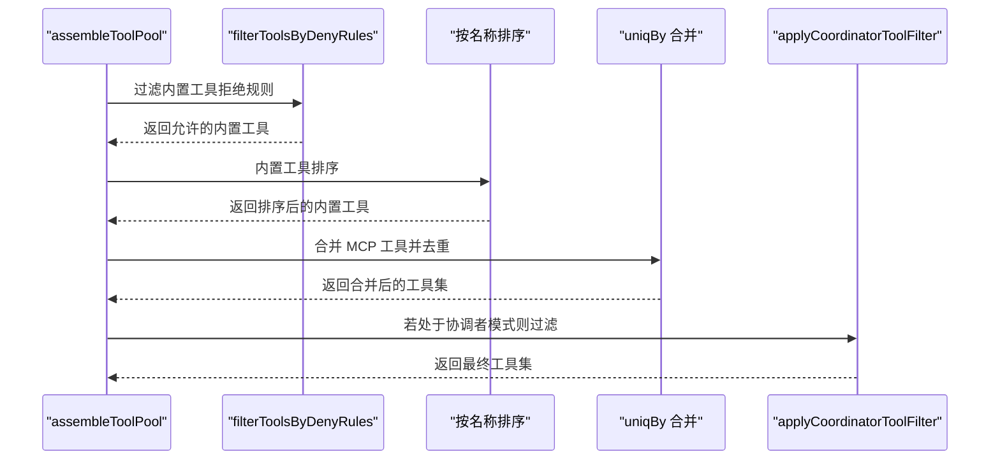
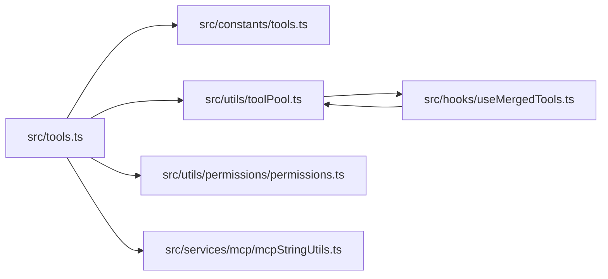

# 工具注册机制

<cite>
**本文档引用的文件**
- [src/Tool.ts](file://src/Tool.ts)
- [src/tools.ts](file://src/tools.ts)
- [src/constants/tools.ts](file://src/constants/tools.ts)
- [src/utils/toolPool.ts](file://src/utils/toolPool.ts)
- [src/hooks/useMergedTools.ts](file://src/hooks/useMergedTools.ts)
- [src/services/mcp/mcpStringUtils.ts](file://src/services/mcp/mcpStringUtils.ts)
- [src/utils/permissions/permissions.ts](file://src/utils/permissions/permissions.ts)
- [src/utils/toolSearch.ts](file://src/utils/toolSearch.ts)
- [src/main.tsx](file://src/main.tsx)
- [src/components/agents/ToolSelector.tsx](file://src/components/agents/ToolSelector.tsx)
</cite>

## 目录
1. [简介](#简介)
2. [项目结构](#项目结构)
3. [核心组件](#核心组件)
4. [架构总览](#架构总览)
5. [详细组件分析](#详细组件分析)
6. [依赖关系分析](#依赖关系分析)
7. [性能考量](#性能考量)
8. [故障排查指南](#故障排查指南)
9. [结论](#结论)
10. [附录](#附录)

## 简介
本文件系统性阐述该代码库中的“工具注册机制”，覆盖工具接口规范、工具元数据与命名约定、工具分类体系、工具池组装流程，以及工具注册函数 getAllBaseTools() 的实现原理（含动态导入、环境变量控制与特性标志驱动的条件注册）。同时提供工具注册与权限系统、MCP 协议集成方式的说明，并给出可操作的实践指引与可视化图示。

## 项目结构
围绕工具注册的关键模块与文件如下：
- 工具接口与默认行为：src/Tool.ts
- 工具清单与注册入口：src/tools.ts
- 工具常量与分类集合：src/constants/tools.ts
- 工具池合并与过滤：src/utils/toolPool.ts
- React 集成钩子：src/hooks/useMergedTools.ts
- MCP 名称规范化与前缀生成：src/services/mcp/mcpStringUtils.ts
- 权限规则与拒绝匹配：src/utils/permissions/permissions.ts
- 工具搜索与延迟加载策略：src/utils/toolSearch.ts
- 应用入口与协调者模式过滤：src/main.tsx
- UI 分类选择器（MCP 动态分类）：src/components/agents/ToolSelector.tsx

**图表来源**
- [src/Tool.ts:1-793](file://src/Tool.ts#L1-L793)
- [src/tools.ts:193-390](file://src/tools.ts#L193-L390)
- [src/constants/tools.ts:1-113](file://src/constants/tools.ts#L1-L113)
- [src/utils/toolPool.ts:1-80](file://src/utils/toolPool.ts#L1-L80)
- [src/hooks/useMergedTools.ts:1-44](file://src/hooks/useMergedTools.ts#L1-L44)
- [src/services/mcp/mcpStringUtils.ts:34-67](file://src/services/mcp/mcpStringUtils.ts#L34-L67)
- [src/utils/permissions/permissions.ts:107-1347](file://src/utils/permissions/permissions.ts#L107-L1347)
- [src/utils/toolSearch.ts:185-392](file://src/utils/toolSearch.ts#L185-L392)
- [src/main.tsx:1870-1901](file://src/main.tsx#L1870-L1901)
- [src/components/agents/ToolSelector.tsx:54-74](file://src/components/agents/ToolSelector.tsx#L54-L74)

**章节来源**
- [src/Tool.ts:1-793](file://src/Tool.ts#L1-L793)
- [src/tools.ts:193-390](file://src/tools.ts#L193-L390)
- [src/constants/tools.ts:1-113](file://src/constants/tools.ts#L1-L113)
- [src/utils/toolPool.ts:1-80](file://src/utils/toolPool.ts#L1-L80)
- [src/hooks/useMergedTools.ts:1-44](file://src/hooks/useMergedTools.ts#L1-L44)
- [src/services/mcp/mcpStringUtils.ts:34-67](file://src/services/mcp/mcpStringUtils.ts#L34-L67)
- [src/utils/permissions/permissions.ts:107-1347](file://src/utils/permissions/permissions.ts#L107-L1347)
- [src/utils/toolSearch.ts:185-392](file://src/utils/toolSearch.ts#L185-L392)
- [src/main.tsx:1870-1901](file://src/main.tsx#L1870-L1901)
- [src/components/agents/ToolSelector.tsx:54-74](file://src/components/agents/ToolSelector.tsx#L54-L74)

## 核心组件
- 工具接口与默认行为
  - 定义了工具的标准方法、输入输出模式、权限检查、UI 渲染回调、并发安全等契约；提供 buildTool 构造器与 TOOL_DEFAULTS 默认值，确保工具实现最小化样板。
- 工具注册入口
  - getAllBaseTools() 返回当前环境可用的“基础工具全集”，包含静态导入与动态 require 的混合策略，结合环境变量与特性标志进行条件注册。
- 工具分类与集合
  - constants/tools.ts 提供 ALL_AGENT_DISALLOWED_TOOLS、ASYNC_AGENT_ALLOWED_TOOLS、COORDINATOR_MODE_ALLOWED_TOOLS 等集合，用于不同场景下的工具可用性约束。
- 工具池组装与过滤
  - assembleToolPool() 将内置工具与 MCP 工具合并，应用权限拒绝规则与去重；mergeAndFilterTools() 在 React 层进一步合并初始工具并按名称排序与协调者模式过滤。
- MCP 集成
  - mcpStringUtils.ts 负责 MCP 工具名前缀生成与规范化，保证权限规则匹配时区分 MCP 与内置工具。
- 权限系统
  - permissions.ts 提供规则解析、匹配与决策逻辑，支持 blanket deny 规则在工具装配阶段即剔除。
- 工具搜索与延迟加载
  - toolSearch.ts 提供工具搜索模式判断、模型兼容性检测与阈值策略，配合 shouldDefer/alwaysLoad 控制工具是否延迟加载。

**章节来源**
- [src/Tool.ts:362-792](file://src/Tool.ts#L362-L792)
- [src/tools.ts:193-390](file://src/tools.ts#L193-L390)
- [src/constants/tools.ts:36-113](file://src/constants/tools.ts#L36-L113)
- [src/utils/toolPool.ts:43-80](file://src/utils/toolPool.ts#L43-L80)
- [src/services/mcp/mcpStringUtils.ts:34-67](file://src/services/mcp/mcpStringUtils.ts#L34-L67)
- [src/utils/permissions/permissions.ts:107-1347](file://src/utils/permissions/permissions.ts#L107-L1347)
- [src/utils/toolSearch.ts:185-392](file://src/utils/toolSearch.ts#L185-L392)

## 架构总览
工具注册与使用的核心流程：
- 注册阶段：getAllBaseTools() 汇聚所有候选工具，依据环境变量与特性标志决定是否包含某些工具。
- 过滤阶段：根据权限上下文过滤掉被拒绝的工具；在 REPL/协调者模式下进一步裁剪。
- 组装阶段：将内置工具与 MCP 工具合并，保持内置工具连续前缀以稳定提示缓存键。
- 使用阶段：通过 React 钩子或主流程获取最终工具集，供模型调用与 UI 展示。

**图表来源**
- [src/main.tsx:1870-1901](file://src/main.tsx#L1870-L1901)
- [src/utils/toolPool.ts:43-80](file://src/utils/toolPool.ts#L43-L80)
- [src/tools.ts:330-390](file://src/tools.ts#L330-L390)
- [src/utils/permissions/permissions.ts:107-1347](file://src/utils/permissions/permissions.ts#L107-L1347)
- [src/hooks/useMergedTools.ts:20-44](file://src/hooks/useMergedTools.ts#L20-L44)

## 详细组件分析

### 工具接口规范与默认行为
- 工具类型 Tool 定义了调用签名、描述、输入输出模式、并发安全、只读/破坏性标记、权限检查、UI 渲染回调、MCP 元信息、延迟加载标记等。
- buildTool 提供统一的默认填充，避免每个工具重复实现相同逻辑；TOOL_DEFAULTS 设定 fail-closed 的安全默认。
- 工具可通过 isEnabled() 控制是否参与最终工具集；isReadOnly/isDestructive 用于权限与 UI 提示。

**图表来源**
- [src/Tool.ts:362-792](file://src/Tool.ts#L362-L792)

**章节来源**
- [src/Tool.ts:362-792](file://src/Tool.ts#L362-L792)

### 工具注册函数 getAllBaseTools() 实现原理
- 动态导入与条件注册
  - 使用 require() 与 feature('FLAG') 结合，仅在特性开启时引入对应工具模块；process.env.* 变量用于运行时开关（如 USER_TYPE、NODE_ENV、ENABLE_LSP_TOOL 等）。
  - 对于可能循环依赖的模块（如 TeamCreateTool/TeamDeleteTool），采用惰性 require() 包装函数延迟加载。
- 工具列表构建
  - 返回一个包含内置工具与条件工具的数组；对嵌入式搜索工具（如 hasEmbeddedSearchTools()）进行排除，避免冗余。
- 环境变量与特性标志
  - 支持 CLAUDE_CODE_SIMPLE、CLAUDE_CODE_VERIFY_PLAN、ENABLE_LSP_TOOL、WORKTREE_MODE 等环境变量与特性标志，影响工具可用性。
- 与权限系统的衔接
  - 最终工具集会再经 filterToolsByDenyRules() 剔除被拒绝的工具；getTools() 在此之前完成模式过滤与 REPL 工具隐藏。

**图表来源**
- [src/tools.ts:193-251](file://src/tools.ts#L193-L251)

**章节来源**
- [src/tools.ts:193-251](file://src/tools.ts#L193-L251)

### 工具分类体系与集合
- ALL_AGENT_DISALLOWED_TOOLS：异步代理不允许使用的工具集合（如 AgentTool、TaskOutputTool 等），并考虑 USER_TYPE 与特性标志。
- ASYNC_AGENT_ALLOWED_TOOLS：异步代理允许使用的工具集合，包含文件读写、网络搜索、技能工具等。
- COORDINATOR_MODE_ALLOWED_TOOLS：协调者模式下允许的工具集合（输出与代理管理相关）。
- IN_PROCESS_TEAMMATE_ALLOWED_TOOLS：仅限进程内同伴使用的工具集合（如任务 CRUD、定时任务等）。

这些集合用于在不同执行路径（普通、REPL、协调者模式、异步代理）下精确控制工具可用性。

**章节来源**
- [src/constants/tools.ts:36-113](file://src/constants/tools.ts#L36-L113)

### 工具池组装过程
- assembleToolPool()
  - 获取 getTools() 的内置工具，过滤 MCP 工具的拒绝规则，按名称排序后与 MCP 工具合并，保持内置工具连续前缀以稳定缓存键。
- mergeAndFilterTools()
  - 在 React 层将 initialTools 与 assembleToolPool 结果合并，先去重再分区排序；随后根据协调者模式应用过滤。
- applyCoordinatorToolFilter()
  - 仅保留 COORDINATOR_MODE_ALLOWED_TOOLS 中的工具，或 PR 活动订阅工具（始终允许）。

**图表来源**
- [src/tools.ts:330-367](file://src/tools.ts#L330-L367)
- [src/utils/toolPool.ts:43-80](file://src/utils/toolPool.ts#L43-L80)

**章节来源**
- [src/tools.ts:330-367](file://src/tools.ts#L330-L367)
- [src/utils/toolPool.ts:43-80](file://src/utils/toolPool.ts#L43-L80)

### 权限系统与工具注册的衔接
- 拒绝规则匹配
  - 在工具装配阶段即应用拒绝规则，避免将被全局拒绝的工具暴露给模型；MCP 工具使用 fully qualified 名称进行匹配，防止与内置工具混淆。
- 规则来源与优先级
  - 规则来自多种来源（设置、命令行、会话等），统一解析为 allow/deny/ask 行为，最终决策由权限系统综合判定。
- 与工具注册的耦合点
  - getAllBaseTools() 返回的工具集会再次经过 filterToolsByDenyRules()，确保从源头剔除不可用工具。

**章节来源**
- [src/utils/permissions/permissions.ts:107-1347](file://src/utils/permissions/permissions.ts#L107-L1347)
- [src/tools.ts:253-269](file://src/tools.ts#L253-L269)

### MCP 协议集成方式
- 命名规范与前缀
  - 使用 getMcpPrefix()/buildMcpToolName() 生成 mcp__server__tool 形式的工具名，确保权限规则与显示名称解耦。
- 工具发现与包装
  - MCP 工具通过客户端拉取并包装，支持特性开关（如 CHICAGO_MCP）与过滤策略（如 isIncludedMcpTool）。
- 与工具池的融合
  - MCP 工具与内置工具共同参与去重与排序，内置工具必须保持连续前缀以维持服务器端缓存策略。

**章节来源**
- [src/services/mcp/mcpStringUtils.ts:34-67](file://src/services/mcp/mcpStringUtils.ts#L34-L67)
- [src/utils/toolPool.ts:65-70](file://src/utils/toolPool.ts#L65-L70)
- [src/tools.ts:345-367](file://src/tools.ts#L345-L367)

### 工具搜索与延迟加载策略
- 模式判断
  - 根据环境变量、特性标志与模型能力（是否支持 tool_reference）确定工具搜索模式（标准/延迟/自动）。
- 阈值与统计
  - 通过统计工具数量与大小估算，结合 GrowthBook 配置动态调整阈值，决定是否启用延迟加载。
- 与工具注册的关系
  - 工具搜索策略影响工具是否 shouldDefer/alwaysLoad，但不会改变 getAllBaseTools() 的注册结果；实际 API 请求时才做最终决策。

**章节来源**
- [src/utils/toolSearch.ts:185-392](file://src/utils/toolSearch.ts#L185-L392)
- [src/tools.ts:247-249](file://src/tools.ts#L247-L249)

### 具体实践指引：如何定义新工具、注册与依赖处理
- 定义工具
  - 使用 buildTool(def) 构造工具对象，仅提供必要的方法与输入输出模式；其余默认由 TOOL_DEFAULTS 填充。
  - 在工具文件中导出工具实例，并在 tools.ts 中将其纳入 getAllBaseTools() 的返回数组。
- 条件注册
  - 对于仅在特定环境/特性下可用的工具，使用 feature('FLAG') 或 process.env.* 判断，必要时采用惰性 require()。
- 依赖关系处理
  - 若存在循环依赖，使用惰性 require 包装函数（如 getTeamCreateTool/getTeamDeleteTool）延迟加载。
- 权限与 MCP
  - 若为 MCP 工具，确保设置 isMcp 标记与 mcpInfo；权限系统将使用 fully qualified 名称进行匹配。

**章节来源**
- [src/Tool.ts:783-792](file://src/Tool.ts#L783-L792)
- [src/tools.ts:62-72](file://src/tools.ts#L62-L72)
- [src/services/mcp/mcpStringUtils.ts:50-52](file://src/services/mcp/mcpStringUtils.ts#L50-L52)

## 依赖关系分析
- 组件耦合
  - tools.ts 是工具注册的中心，依赖环境变量与特性标志；与 constants/tools.ts 的集合配合实现分类控制。
  - utils/toolPool.ts 与 hooks/useMergedTools.ts 为上层装配提供纯函数与 React 集成，降低 UI 与核心逻辑耦合。
  - permissions.ts 与 mcpStringUtils.ts 分别负责权限匹配与 MCP 命名，二者在工具池阶段协同工作。
- 外部依赖
  - feature('FLAG') 来自 bun:bundle，用于编译期/运行时特性开关；lodash-es 的 partition/uniqBy 用于高效去重与分区。
- 循环依赖规避
  - 通过惰性 require 与模块拆分，避免 tools.ts 与团队工具之间的直接循环。

**图表来源**
- [src/tools.ts:193-390](file://src/tools.ts#L193-L390)
- [src/constants/tools.ts:1-113](file://src/constants/tools.ts#L1-L113)
- [src/utils/toolPool.ts:1-80](file://src/utils/toolPool.ts#L1-L80)
- [src/hooks/useMergedTools.ts:1-44](file://src/hooks/useMergedTools.ts#L1-L44)
- [src/utils/permissions/permissions.ts:107-1347](file://src/utils/permissions/permissions.ts#L107-L1347)
- [src/services/mcp/mcpStringUtils.ts:34-67](file://src/services/mcp/mcpStringUtils.ts#L34-L67)

**章节来源**
- [src/tools.ts:193-390](file://src/tools.ts#L193-L390)
- [src/utils/toolPool.ts:1-80](file://src/utils/toolPool.ts#L1-L80)
- [src/hooks/useMergedTools.ts:1-44](file://src/hooks/useMergedTools.ts#L1-L44)
- [src/utils/permissions/permissions.ts:107-1347](file://src/utils/permissions/permissions.ts#L107-L1347)
- [src/services/mcp/mcpStringUtils.ts:34-67](file://src/services/mcp/mcpStringUtils.ts#L34-L67)

## 性能考量
- 死代码消除与按需加载
  - 通过 feature('FLAG') 与 process.env.* 条件导入，减少未使用工具的打包体积与启动时间。
- 工具池稳定性
  - 内置工具保持连续前缀与稳定排序，有助于服务器端系统提示缓存命中率。
- 去重与分区
  - 使用 uniqBy 与 partition 避免重复与提升排序效率；在 React 层同样采用分区排序以保持一致性。
- MCP 工具获取缓存
  - MCP 工具获取采用缓存策略，避免频繁拉取导致的性能抖动。

[本节为通用指导，无需具体文件分析]

## 故障排查指南
- 工具未出现在工具池
  - 检查环境变量与特性标志是否满足条件；确认工具已在 getAllBaseTools() 中注册且未被拒绝规则剔除。
- MCP 工具无法识别
  - 确认 MCP 工具名前缀与规范化是否正确；权限规则应使用 fully qualified 名称进行匹配。
- REPL 模式下工具不可见
  - 检查 REPL_ONLY_TOOLS 与 isReplModeEnabled 的组合逻辑；REPL 模式会隐藏部分原始工具。
- 协调者模式工具受限
  - 确认 applyCoordinatorToolFilter 是否生效；仅 COORDINATOR_MODE_ALLOWED_TOOLS 中的工具会被保留。

**章节来源**
- [src/tools.ts:312-327](file://src/tools.ts#L312-L327)
- [src/utils/toolPool.ts:35-41](file://src/utils/toolPool.ts#L35-L41)
- [src/services/mcp/mcpStringUtils.ts:60-67](file://src/services/mcp/mcpStringUtils.ts#L60-L67)

## 结论
该工具注册机制通过统一的工具接口、集中化的注册入口、灵活的条件注册策略与严格的权限过滤，实现了在多场景（普通、REPL、协调者模式、MCP）下的一致工具可用性与安全性。getAllBaseTools() 作为核心枢纽，结合环境变量与特性标志，既保证了功能扩展性，又兼顾了性能与稳定性。配合工具池合并与过滤、MCP 命名规范与权限系统，形成了可维护、可演进的工具生态。

[本节为总结，无需具体文件分析]

## 附录

### 工具接口关键字段说明
- name：工具唯一标识，用于 UI 显示与权限匹配。
- aliases：别名，支持重命名后的向后兼容查找。
- inputSchema/inputJSONSchema：输入模式定义，Zod 或 JSON Schema。
- outputSchema：输出模式定义。
- isMcp/isLsp：工具来源标记。
- shouldDefer/alwaysLoad：工具搜索与延迟加载控制。
- maxResultSizeChars：结果持久化阈值，超过则落盘。
- isEnabled/isReadOnly/isDestructive：运行时状态与安全标记。
- checkPermissions/toAutoClassifierInput：权限与安全分类输入。

**章节来源**
- [src/Tool.ts:362-695](file://src/Tool.ts#L362-L695)

### 工具分类集合用途
- ALL_AGENT_DISALLOWED_TOOLS：限制异步代理使用高风险工具。
- ASYNC_AGENT_ALLOWED_TOOLS：为异步代理开放安全工具集。
- COORDINATOR_MODE_ALLOWED_TOOLS：协调者模式下最小可用工具集。
- IN_PROCESS_TEAMMATE_ALLOWED_TOOLS：进程内同伴专用工具集。

**章节来源**
- [src/constants/tools.ts:36-113](file://src/constants/tools.ts#L36-L113)

### MCP 工具命名约定
- fully qualified 名称：mcp__server__tool，用于权限规则匹配与 UI 去歧义。
- 前缀生成：getMcpPrefix()/buildMcpToolName() 统一规范化。

**章节来源**
- [src/services/mcp/mcpStringUtils.ts:34-67](file://src/services/mcp/mcpStringUtils.ts#L34-L67)