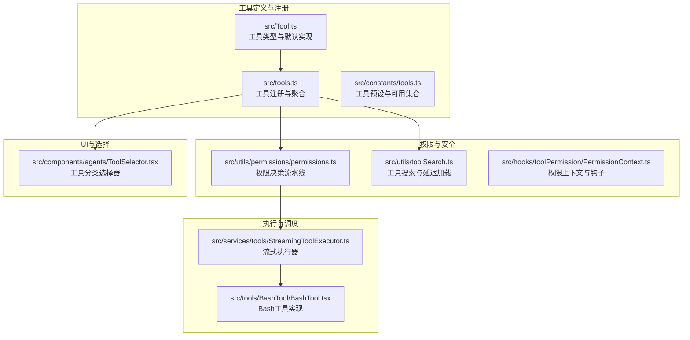
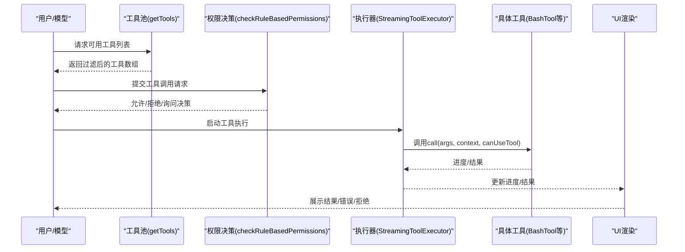
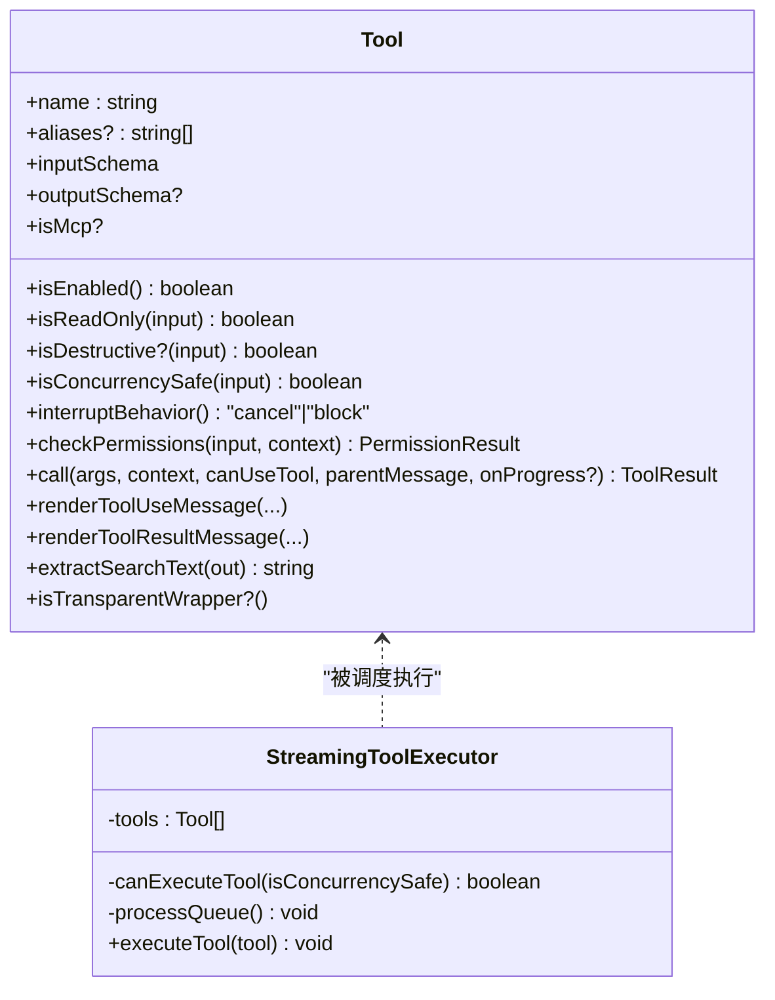
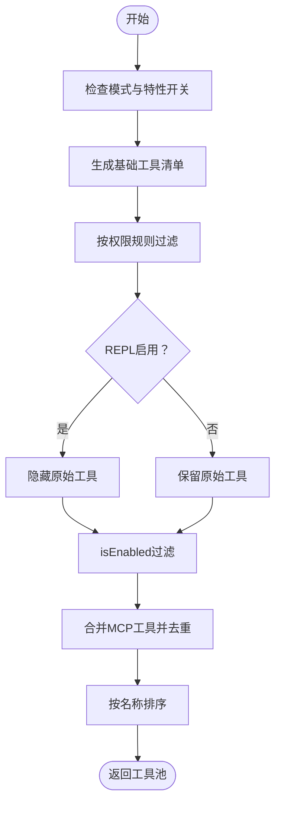
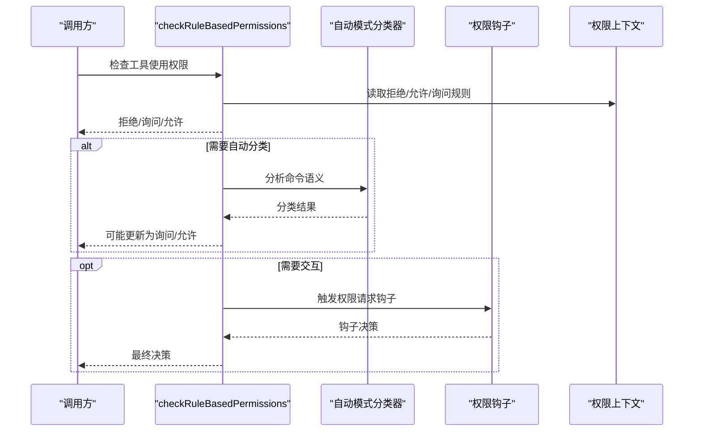
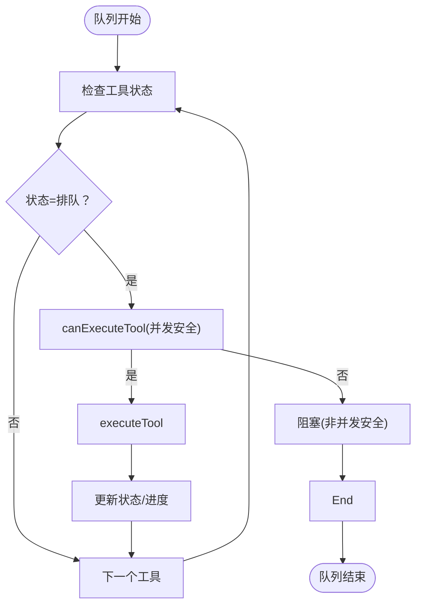
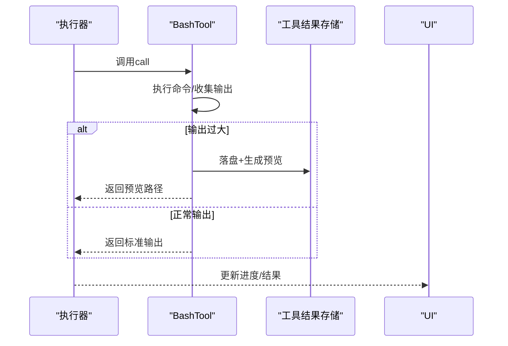
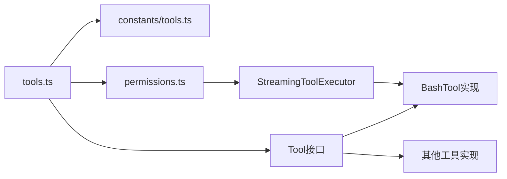

# 工具系统架构

<cite>
**本文档引用的文件**
- [src/tools.ts](file://src/tools.ts)
- [src/Tool.ts](file://src/Tool.ts)
- [src/constants/tools.ts](file://src/constants/tools.ts)
- [src/utils/permissions/permissions.ts](file://src/utils/permissions/permissions.ts)
- [src/utils/toolSearch.ts](file://src/utils/toolSearch.ts)
- [src/services/tools/StreamingToolExecutor.ts](file://src/services/tools/StreamingToolExecutor.ts)
- [src/tools/BashTool/BashTool.tsx](file://src/tools/BashTool/BashTool.tsx)
- [src/components/agents/ToolSelector.tsx](file://src/components/agents/ToolSelector.tsx)
- [src/hooks/toolPermission/PermissionContext.ts](file://src/hooks/toolPermission/PermissionContext.ts)
</cite>

## 目录
1. [简介](#简介)
2. [项目结构](#项目结构)
3. [核心组件](#核心组件)
4. [架构总览](#架构总览)
5. [详细组件分析](#详细组件分析)
6. [依赖关系分析](#依赖关系分析)
7. [性能考量](#性能考量)
8. [故障排除指南](#故障排除指南)
9. [结论](#结论)
10. [附录](#附录)

## 简介
本文件面向工具系统架构，系统性阐述工具系统的整体设计、核心组件与实现机制，覆盖工具注册流程、权限模型、执行管道与结果处理。文档同时包含工具分类体系、安全控制机制、资源管理策略与性能优化方案，并提供具体代码示例路径以展示工具定义、权限检查与执行过程。最后讨论工具系统的扩展性设计、插件集成机制与向后兼容性，以及与命令系统、状态管理的协作关系。

## 项目结构
工具系统围绕“工具类型定义”“工具注册与聚合”“权限与安全控制”“并发与执行调度”“结果与UI渲染”五大维度组织，采用分层与模块化设计，确保可扩展性与可维护性。

**图表来源**
- [src/Tool.ts:1-793](file://src/Tool.ts#L1-L793)
- [src/tools.ts:193-390](file://src/tools.ts#L193-L390)
- [src/constants/tools.ts:1-113](file://src/constants/tools.ts#L1-L113)
- [src/utils/permissions/permissions.ts:1-200](file://src/utils/permissions/permissions.ts#L1-L200)
- [src/utils/toolSearch.ts:364-392](file://src/utils/toolSearch.ts#L364-L392)
- [src/services/tools/StreamingToolExecutor.ts:123-151](file://src/services/tools/StreamingToolExecutor.ts#L123-L151)
- [src/tools/BashTool/BashTool.tsx:1-200](file://src/tools/BashTool/BashTool.tsx#L1-L200)
- [src/components/agents/ToolSelector.tsx:54-74](file://src/components/agents/ToolSelector.tsx#L54-L74)

**章节来源**
- [src/tools.ts:193-390](file://src/tools.ts#L193-L390)
- [src/Tool.ts:1-793](file://src/Tool.ts#L1-L793)
- [src/constants/tools.ts:1-113](file://src/constants/tools.ts#L1-L113)

## 核心组件
- 工具类型与默认实现：统一的工具接口、输入输出模式、并发安全、只读/破坏性标记、权限检查、UI渲染与摘要等能力抽象，提供安全默认值与可选覆盖点。
- 工具注册与聚合：集中式工具清单生成、按环境与特性开关动态装配、基于权限规则的过滤、REPL模式下的工具可见性控制、内置与MCP工具合并去重。
- 权限与安全控制：规则驱动的允许/拒绝/询问三态决策、自动模式分类器、会话级权限上下文、钩子扩展点、沙箱与工作目录限制。
- 执行与调度：并发安全判定、队列与串行/并行执行策略、进度与结果持久化、中断行为与UI反馈。
- 结果与UI渲染：工具结果消息映射、摘要与截断、进度消息渲染、拒绝/错误UI定制、群组渲染与转录索引支持。

**章节来源**
- [src/Tool.ts:362-793](file://src/Tool.ts#L362-L793)
- [src/tools.ts:271-390](file://src/tools.ts#L271-L390)
- [src/utils/permissions/permissions.ts:1071-1297](file://src/utils/permissions/permissions.ts#L1071-L1297)

## 架构总览
工具系统通过“类型中心 + 注册聚合 + 权限决策 + 执行调度 + 渲染输出”的闭环实现：

**图表来源**
- [src/tools.ts:271-327](file://src/tools.ts#L271-L327)
- [src/utils/permissions/permissions.ts:1071-1297](file://src/utils/permissions/permissions.ts#L1071-L1297)
- [src/services/tools/StreamingToolExecutor.ts:123-151](file://src/services/tools/StreamingToolExecutor.ts#L123-L151)
- [src/tools/BashTool/BashTool.tsx:1-200](file://src/tools/BashTool/BashTool.tsx#L1-L200)

## 详细组件分析

### 工具类型与默认实现（Tool 接口）
- 关键职责
  - 统一工具签名：call、description、inputSchema、outputSchema、isEnabled、isReadOnly、isDestructive、interruptBehavior、isSearchOrReadCommand、checkPermissions、render*系列方法。
  - 并发与安全：isConcurrencySafe用于并发调度；interruptBehavior控制用户打断时的行为。
  - 输入校验与权限：validateInput进行参数校验；checkPermissions结合通用权限系统进行细粒度控制。
  - UI与转录：renderToolUseMessage/renderToolResultMessage等负责消息与结果渲染；extractSearchText支持转录搜索索引。
  - MCP与透明包装：isMcp标识MCP工具；isTransparentWrapper支持包装工具（如REPL）。
- 默认实现
  - 提供安全默认值（如默认允许、非并发安全、非只读、非破坏性），避免遗漏实现导致的不一致。

**图表来源**
- [src/Tool.ts:362-793](file://src/Tool.ts#L362-L793)
- [src/services/tools/StreamingToolExecutor.ts:123-151](file://src/services/tools/StreamingToolExecutor.ts#L123-L151)

**章节来源**
- [src/Tool.ts:362-793](file://src/Tool.ts#L362-L793)

### 工具注册与聚合（tools.ts）
- 工具清单生成
  - getAllBaseTools：根据环境变量与特性开关组装基础工具集，包含条件导入与懒加载，确保死代码消除与运行时最小化。
  - getTools：在基础工具上应用模式过滤（如简单模式、REPL模式）、权限规则过滤、isEnabled过滤与REPL可见性控制。
  - assembleToolPool/getMergedTools：将内置工具与MCP工具合并，按名称排序并去重，内置工具优先，保证提示缓存稳定性。
- 工具过滤
  - filterToolsByDenyRules：基于权限上下文的拒绝规则过滤工具，匹配工具名或MCP前缀规则。
- 预设与可用集合
  - constants/tools.ts：定义异步代理/协调者/进程内队友等工具可用集合，用于不同角色与模式下的工具约束。

**图表来源**
- [src/tools.ts:193-390](file://src/tools.ts#L193-L390)
- [src/constants/tools.ts:36-113](file://src/constants/tools.ts#L36-L113)

**章节来源**
- [src/tools.ts:193-390](file://src/tools.ts#L193-L390)
- [src/constants/tools.ts:1-113](file://src/constants/tools.ts#L1-L113)

### 权限模型与安全控制（permissions.ts）
- 决策流水线
  - 规则阶段：整工具拒绝/询问规则优先；允许规则直接放行；沙箱自动允许Bash（满足条件时）。
  - 模式阶段：bypassPermissions/plan模式下可绕过部分规则。
  - 自动模式分类器：对命令进行语义分析，决定是否需要人工确认。
  - 钩子阶段：可扩展的权限请求钩子，支持更新权限与建议。
- 上下文与追踪
  - DenialTrackingState记录拒绝次数与阈值，超过阈值回退到交互确认。
  - 支持工作目录限制、额外工作目录、权限模式切换与预计划模式保存/恢复。

**图表来源**
- [src/utils/permissions/permissions.ts:1071-1297](file://src/utils/permissions/permissions.ts#L1071-L1297)
- [src/hooks/toolPermission/PermissionContext.ts:204-242](file://src/hooks/toolPermission/PermissionContext.ts#L204-L242)

**章节来源**
- [src/utils/permissions/permissions.ts:1-200](file://src/utils/permissions/permissions.ts#L1-L200)
- [src/utils/permissions/permissions.ts:1071-1297](file://src/utils/permissions/permissions.ts#L1071-L1297)
- [src/hooks/toolPermission/PermissionContext.ts:204-242](file://src/hooks/toolPermission/PermissionContext.ts#L204-L242)

### 执行管道与并发调度（StreamingToolExecutor）
- 并发策略
  - 单实例串行：非并发安全工具必须串行执行。
  - 并发安全：并发安全工具可并行执行，但需保证队列顺序与一致性。
- 队列处理
  - processQueue遍历工具队列，根据canExecuteTool判断是否执行；非并发安全工具遇到阻塞即停止后续排队。
- 与工具的协作
  - 工具通过isConcurrencySafe声明自身并发属性；工具内部通过onProgress回调上报进度；结果持久化与UI更新由上层负责。

**图表来源**
- [src/services/tools/StreamingToolExecutor.ts:123-151](file://src/services/tools/StreamingToolExecutor.ts#L123-L151)

**章节来源**
- [src/services/tools/StreamingToolExecutor.ts:123-151](file://src/services/tools/StreamingToolExecutor.ts#L123-L151)

### 结果处理与UI渲染（BashTool 示例）
- 大结果持久化
  - 当工具输出过大时，自动落盘并生成预览，避免内存溢出与模型缓存污染。
- 命令语义与UI
  - BashTool识别搜索/读取/列表命令，用于UI折叠与摘要显示；提供“静默命令”判断，优化用户体验。
- 渲染与转录
  - renderToolUseMessage/renderToolResultMessage支持简洁/详细模式；extractSearchText用于转录搜索索引。

**图表来源**
- [src/tools/BashTool/BashTool.tsx:728-761](file://src/tools/BashTool/BashTool.tsx#L728-L761)

**章节来源**
- [src/tools/BashTool/BashTool.tsx:1-200](file://src/tools/BashTool/BashTool.tsx#L1-L200)
- [src/tools/BashTool/BashTool.tsx:728-761](file://src/tools/BashTool/BashTool.tsx#L728-L761)

### 工具分类体系与选择器
- 工具分类
  - 编辑类：文件编辑/写入/笔记本编辑
  - 执行类：Bash/Tungsten等外部执行工具
  - MCP类：动态MCP工具集合
  - 其他：未归类的工具
- 用途
  - UI侧工具选择器按分类组织，便于用户快速定位所需工具。

**章节来源**
- [src/components/agents/ToolSelector.tsx:54-74](file://src/components/agents/ToolSelector.tsx#L54-L74)

## 依赖关系分析
- 工具类型与实现
  - 所有工具实现遵循Tool接口，统一通过buildTool注入默认行为，降低实现复杂度。
- 注册与聚合
  - tools.ts依赖环境变量与特性开关，动态导入工具模块；与constants/tools.ts配合实现角色级工具可用性。
- 权限与安全
  - permissions.ts依赖分类器、钩子、沙箱与设置系统，形成多层安全防护。
- 执行与UI
  - StreamingToolExecutor与具体工具（如BashTool）解耦，通过并发安全与进度回调实现稳定执行。

**图表来源**
- [src/Tool.ts:362-793](file://src/Tool.ts#L362-L793)
- [src/tools.ts:193-390](file://src/tools.ts#L193-L390)
- [src/constants/tools.ts:1-113](file://src/constants/tools.ts#L1-L113)
- [src/utils/permissions/permissions.ts:1-200](file://src/utils/permissions/permissions.ts#L1-L200)
- [src/services/tools/StreamingToolExecutor.ts:123-151](file://src/services/tools/StreamingToolExecutor.ts#L123-L151)

**章节来源**
- [src/Tool.ts:362-793](file://src/Tool.ts#L362-L793)
- [src/tools.ts:193-390](file://src/tools.ts#L193-L390)
- [src/constants/tools.ts:1-113](file://src/constants/tools.ts#L1-L113)
- [src/utils/permissions/permissions.ts:1-200](file://src/utils/permissions/permissions.ts#L1-L200)
- [src/services/tools/StreamingToolExecutor.ts:123-151](file://src/services/tools/StreamingToolExecutor.ts#L123-L151)

## 性能考量
- 工具注册与打包
  - 条件导入与懒加载减少初始包体与冷启动时间；死代码消除确保仅包含当前环境所需的工具。
- 并发执行
  - StreamingToolExecutor通过isConcurrencySafe区分并发安全工具，最大化并行度同时避免竞态。
- 结果存储
  - 大输出自动落盘与预览，避免内存峰值与模型缓存抖动。
- 提示缓存稳定性
  - 内置工具与MCP工具分别排序并去重，内置工具保持连续前缀，防止缓存键被打乱导致的缓存失效。

[本节为通用性能指导，无需特定文件来源]

## 故障排除指南
- 工具不可见
  - 检查getTools中的模式过滤（简单模式、REPL模式）与isEnabled返回值。
  - 确认权限规则中是否存在针对该工具的拒绝规则。
- 权限拒绝/询问过多
  - 查看DenialTrackingState阈值与自动模式分类器配置；必要时调整规则或开启bypassPermissions模式。
- 执行卡住
  - 检查工具是否声明isConcurrencySafe；非并发安全工具会阻塞后续排队。
- 结果过大导致内存问题
  - 确认大结果持久化逻辑已触发；检查工具的maxResultSizeChars与预览生成。

**章节来源**
- [src/tools.ts:271-327](file://src/tools.ts#L271-L327)
- [src/utils/permissions/permissions.ts:1071-1297](file://src/utils/permissions/permissions.ts#L1071-L1297)
- [src/services/tools/StreamingToolExecutor.ts:123-151](file://src/services/tools/StreamingToolExecutor.ts#L123-L151)
- [src/tools/BashTool/BashTool.tsx:728-761](file://src/tools/BashTool/BashTool.tsx#L728-L761)

## 结论
工具系统通过“类型中心 + 动态注册 + 权限决策 + 并发调度 + 结果持久化”的架构实现了高扩展性与强安全性。其设计兼顾易用性与可控性：开发者只需关注工具的核心行为与安全边界，系统自动处理注册、权限、并发与UI渲染。未来可在以下方向持续演进：
- 插件生态：通过MCP与工具池合并机制无缝接入第三方工具。
- 向后兼容：利用工具别名与默认实现，平滑迁移工具命名与行为。
- 协作关系：与命令系统、状态管理协同，确保工具调用与UI状态的一致性。

[本节为总结性内容，无需特定文件来源]

## 附录

### 工具定义示例（路径参考）
- 工具类型与默认实现：[src/Tool.ts:362-793](file://src/Tool.ts#L362-L793)
- 工具注册与聚合：[src/tools.ts:193-390](file://src/tools.ts#L193-L390)
- Bash工具实现：[src/tools/BashTool/BashTool.tsx:1-200](file://src/tools/BashTool/BashTool.tsx#L1-L200)

### 权限检查示例（路径参考）
- 规则与模式决策：[src/utils/permissions/permissions.ts:1071-1297](file://src/utils/permissions/permissions.ts#L1071-L1297)
- 权限钩子与上下文：[src/hooks/toolPermission/PermissionContext.ts:204-242](file://src/hooks/toolPermission/PermissionContext.ts#L204-L242)

### 执行与结果处理示例（路径参考）
- 并发调度与队列处理：[src/services/tools/StreamingToolExecutor.ts:123-151](file://src/services/tools/StreamingToolExecutor.ts#L123-L151)
- 大结果持久化与预览：[src/tools/BashTool/BashTool.tsx:728-761](file://src/tools/BashTool/BashTool.tsx#L728-L761)