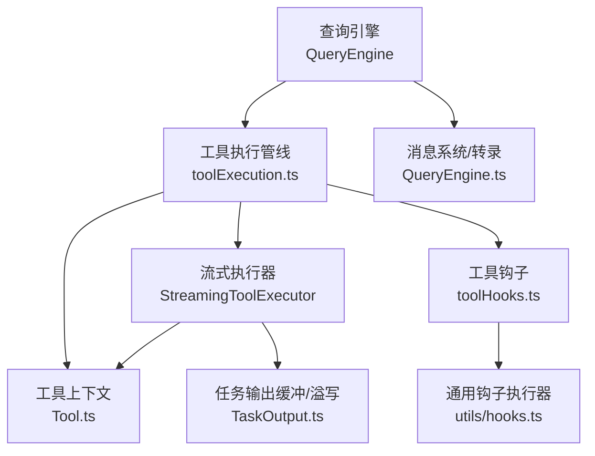
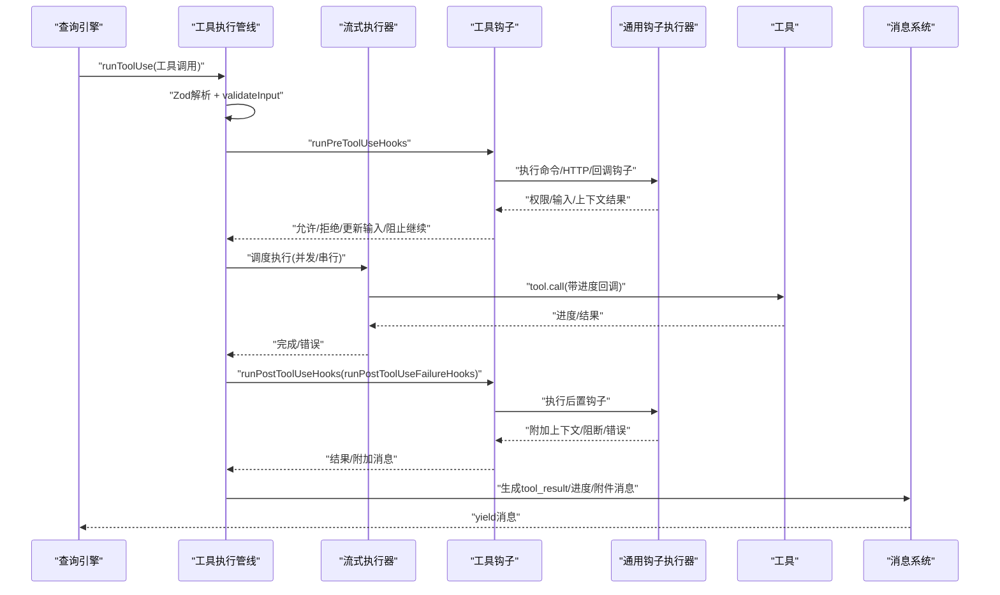
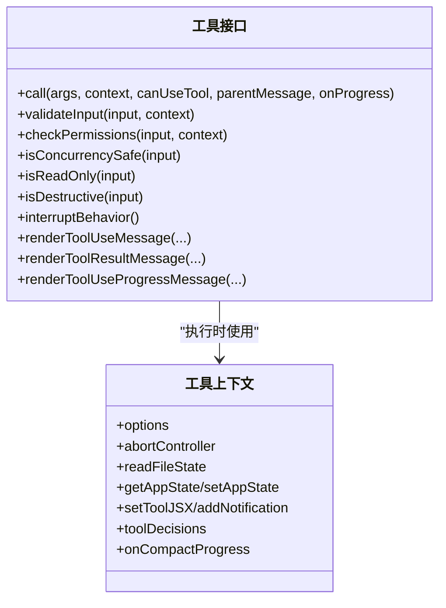
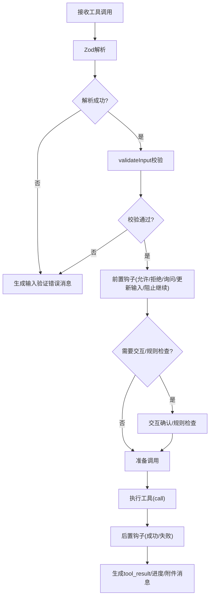
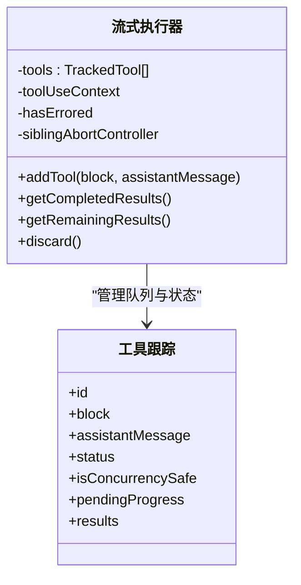
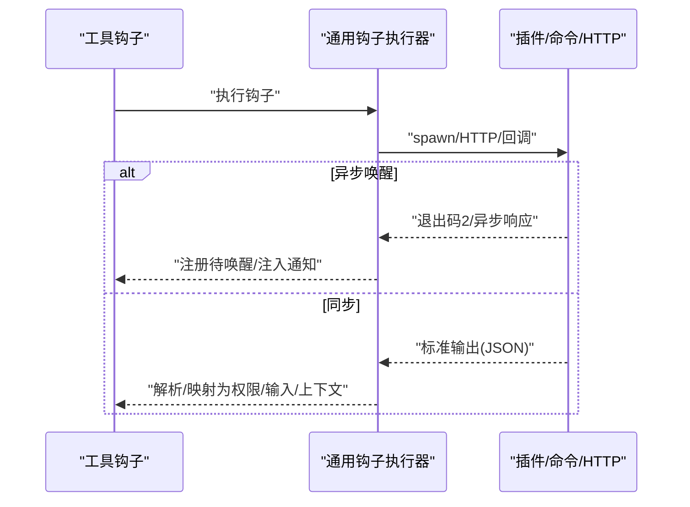
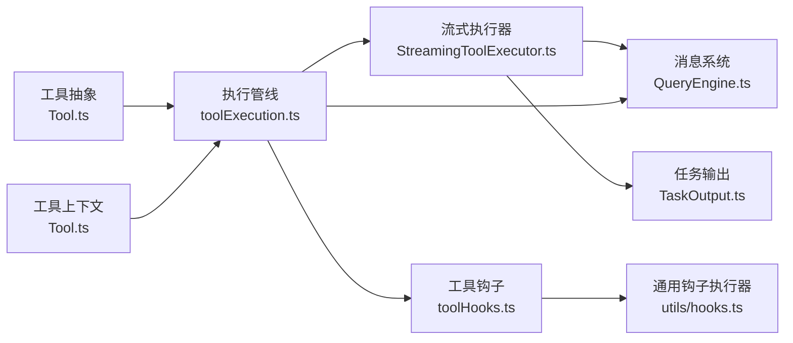

# 执行引擎

<cite>
**本文引用的文件**   
- [src/Tool.ts](file://src/Tool.ts)
- [src/services/tools/toolExecution.ts](file://src/services/tools/toolExecution.ts)
- [src/services/tools/StreamingToolExecutor.ts](file://src/services/tools/StreamingToolExecutor.ts)
- [src/services/tools/toolHooks.ts](file://src/services/tools/toolHooks.ts)
- [src/utils/hooks.ts](file://src/utils/hooks.ts)
- [src/QueryEngine.ts](file://src/QueryEngine.ts)
- [src/tools.ts](file://src/tools.ts)
- [src/utils/task/TaskOutput.ts](file://src/utils/task/TaskOutput.ts)
</cite>

## 目录
1. [简介](#简介)
2. [项目结构](#项目结构)
3. [核心组件](#核心组件)
4. [架构总览](#架构总览)
5. [详细组件分析](#详细组件分析)
6. [依赖分析](#依赖分析)
7. [性能考虑](#性能考虑)
8. [故障排查指南](#故障排查指南)
9. [结论](#结论)
10. [附录](#附录)

## 简介
本文件面向“工具执行引擎”的技术文档，系统阐述工具从被模型调用到最终结果呈现的完整生命周期：包括工具调用解析、参数校验、权限与中间件（钩子）决策、并发与异步执行、流式输出处理、结果聚合与错误恢复、以及与查询引擎、消息系统、状态管理的协作关系。文档同时覆盖执行钩子机制、执行日志与性能监控、可扩展的自定义执行器实现与性能优化建议。

## 项目结构
执行引擎由以下关键模块组成：
- 工具抽象与上下文：工具接口、输入/输出模式、执行上下文与进度类型
- 工具执行管线：工具调用解析、参数校验、权限与钩子、实际执行、结果处理与错误恢复
- 并发与流式执行器：顺序与并发调度、进度优先出队、兄弟进程取消联动
- 钩子系统：预/后置工具钩子、失败钩子、异步唤醒与后台执行
- 查询引擎与消息系统：会话状态、消息持久化、转录记录与回放
- 任务输出与溢写：大输出的磁盘溢写与内存缓冲、尾部截断提示

图表来源
- [src/QueryEngine.ts:184-800](file://src/QueryEngine.ts#L184-L800)
- [src/services/tools/toolExecution.ts:337-800](file://src/services/tools/toolExecution.ts#L337-L800)
- [src/services/tools/StreamingToolExecutor.ts:40-531](file://src/services/tools/StreamingToolExecutor.ts#L40-L531)
- [src/services/tools/toolHooks.ts:1-651](file://src/services/tools/toolHooks.ts#L1-L651)
- [src/utils/hooks.ts:1-800](file://src/utils/hooks.ts#L1-L800)
- [src/Tool.ts:158-300](file://src/Tool.ts#L158-L300)
- [src/utils/task/TaskOutput.ts:256-295](file://src/utils/task/TaskOutput.ts#L256-L295)

章节来源
- [src/QueryEngine.ts:184-800](file://src/QueryEngine.ts#L184-L800)
- [src/services/tools/toolExecution.ts:337-800](file://src/services/tools/toolExecution.ts#L337-L800)
- [src/services/tools/StreamingToolExecutor.ts:40-531](file://src/services/tools/StreamingToolExecutor.ts#L40-L531)
- [src/services/tools/toolHooks.ts:1-651](file://src/services/tools/toolHooks.ts#L1-L651)
- [src/utils/hooks.ts:1-800](file://src/utils/hooks.ts#L1-L800)
- [src/Tool.ts:158-300](file://src/Tool.ts#L158-L300)
- [src/utils/task/TaskOutput.ts:256-295](file://src/utils/task/TaskOutput.ts#L256-L295)

## 核心组件
- 工具抽象与上下文
  - 工具接口定义了输入/输出模式、并发安全、只读/破坏性、中断行为、渲染与摘要等能力；工具上下文承载会话状态、权限、文件缓存、Abort信号、进度回调等
- 工具执行管线
  - 解析与校验：Zod模式解析 + 工具自定义校验
  - 权限与钩子：前置钩子、规则检查、交互式确认、后置钩子与失败钩子
  - 实际执行：调用工具的 call 方法，支持进度回调与上下文修改
  - 结果处理：消息构建、附件注入、进度消息、错误包装
- 流式执行器
  - 并发控制：并发安全工具可并行；非并发工具串行独占
  - 进度优先：进度消息立即出队，结果按到达顺序累积
  - 错误传播：兄弟错误触发级联取消，用户中断区分取消/阻塞
- 钩子系统
  - 命令/HTTP/回调钩子统一执行路径，支持异步唤醒、后台执行、进度上报
  - 钩子输出标准化为结构化JSON，映射为权限决策、输入更新、附加上下文等
- 查询引擎与消息系统
  - 会话状态贯穿多轮对话，消息持久化与转录记录，支持回放与恢复
- 任务输出与溢写
  - 大量输出自动溢写至磁盘，保留最近若干行作为预览，避免内存膨胀

章节来源
- [src/Tool.ts:362-695](file://src/Tool.ts#L362-L695)
- [src/services/tools/toolExecution.ts:599-800](file://src/services/tools/toolExecution.ts#L599-L800)
- [src/services/tools/StreamingToolExecutor.ts:40-531](file://src/services/tools/StreamingToolExecutor.ts#L40-L531)
- [src/services/tools/toolHooks.ts:1-651](file://src/services/tools/toolHooks.ts#L1-L651)
- [src/utils/hooks.ts:184-265](file://src/utils/hooks.ts#L184-L265)
- [src/QueryEngine.ts:184-800](file://src/QueryEngine.ts#L184-L800)
- [src/utils/task/TaskOutput.ts:256-295](file://src/utils/task/TaskOutput.ts#L256-L295)

## 架构总览
下图展示了从模型发出工具调用到最终消息产出的关键交互：

图表来源
- [src/services/tools/toolExecution.ts:337-800](file://src/services/tools/toolExecution.ts#L337-L800)
- [src/services/tools/StreamingToolExecutor.ts:265-405](file://src/services/tools/StreamingToolExecutor.ts#L265-L405)
- [src/services/tools/toolHooks.ts:435-651](file://src/services/tools/toolHooks.ts#L435-L651)
- [src/utils/hooks.ts:747-800](file://src/utils/hooks.ts#L747-L800)

章节来源
- [src/services/tools/toolExecution.ts:337-800](file://src/services/tools/toolExecution.ts#L337-L800)
- [src/services/tools/StreamingToolExecutor.ts:265-405](file://src/services/tools/StreamingToolExecutor.ts#L265-L405)
- [src/services/tools/toolHooks.ts:435-651](file://src/services/tools/toolHooks.ts#L435-L651)
- [src/utils/hooks.ts:747-800](file://src/utils/hooks.ts#L747-L800)

## 详细组件分析

### 组件A：工具抽象与上下文
- 工具接口
  - 输入/输出模式：Zod或JSON Schema；可选输出模式
  - 能力标记：并发安全、只读、破坏性、是否MCP/LSP工具
  - 行为约定：中断行为、搜索/读取命令识别、透明包装、摘要与活动描述
  - 渲染与结果：结果消息渲染、进度消息渲染、拒绝/错误UI定制
- 工具上下文
  - 选项：工具集、命令集、调试/思考配置、MCP连接与资源、最大预算等
  - 运行时：Abort控制器、文件状态缓存、应用状态读写、通知/系统消息追加
  - 会话追踪：查询链ID/深度、工具决策记录、内容替换预算、本地拒绝计数等

图表来源
- [src/Tool.ts:362-695](file://src/Tool.ts#L362-L695)
- [src/Tool.ts:158-300](file://src/Tool.ts#L158-L300)

章节来源
- [src/Tool.ts:362-695](file://src/Tool.ts#L362-L695)
- [src/Tool.ts:158-300](file://src/Tool.ts#L158-L300)

### 组件B：工具执行管线（含参数校验、权限与钩子）
- 参数解析与校验
  - 使用Zod对工具输入进行类型解析；若失败，构建输入验证错误消息并终止
  - 工具自定义 validateInput 提供值语义校验；失败则返回错误消息
- 权限与钩子
  - 规范化输入（如去除内部字段），回填可观测字段副本，避免影响真实调用
  - 运行前置钩子：可能返回允许/拒绝/询问、更新输入、阻止继续、附加上下文
  - 规则检查：在钩子允许的前提下仍需通过规则检查；必要时进入交互式确认
  - 后置钩子：成功/失败两类钩子，可附加上下文、阻断继续、更新MCP输出
- 执行与结果
  - 记录开始/结束跨度、会话活动、工具耗时统计
  - 将进度事件转换为进度消息，将结果转换为tool_result消息
  - 对于未知工具或中止情况，生成错误/取消消息

图表来源
- [src/services/tools/toolExecution.ts:599-800](file://src/services/tools/toolExecution.ts#L599-L800)
- [src/services/tools/toolHooks.ts:435-651](file://src/services/tools/toolHooks.ts#L435-L651)

章节来源
- [src/services/tools/toolExecution.ts:599-800](file://src/services/tools/toolExecution.ts#L599-L800)
- [src/services/tools/toolHooks.ts:435-651](file://src/services/tools/toolHooks.ts#L435-L651)

### 组件C：流式执行器（并发控制与进度优先）
- 并发策略
  - 并发安全工具：与其他并发安全工具并行
  - 非并发工具：串行独占，保证互斥
- 进度优先与结果聚合
  - 进度消息先于结果消息出队，确保UI及时反馈
  - 完成后按到达顺序累积结果，并标记工具使用完成
- 错误与中断处理
  - 兄弟错误触发级联取消（如Bash工具失败时）
  - 用户中断区分“取消”与“阻塞”，尊重工具中断行为
  - 支持丢弃（用于流式回退场景）

图表来源
- [src/services/tools/StreamingToolExecutor.ts:40-531](file://src/services/tools/StreamingToolExecutor.ts#L40-L531)

章节来源
- [src/services/tools/StreamingToolExecutor.ts:40-531](file://src/services/tools/StreamingToolExecutor.ts#L40-L531)

### 组件D：钩子系统（中间件模式与异步执行）
- 中间件模式
  - 前置钩子：在权限与规则检查前介入，可更新输入、阻止继续、附加上下文
  - 后置钩子：在工具执行后介入，可附加上下文、阻断继续、更新MCP输出
  - 失败钩子：工具执行失败时介入，可附加上下文、阻断继续
- 异步与后台执行
  - 支持异步唤醒：退出码2表示阻断错误，通过任务通知唤醒模型或注入命令
  - 后台执行：不阻塞主流程，但保持stdout/stderr内存捕获，便于后续读取
- 输出标准化
  - 统一JSON Schema，映射为权限决策、输入更新、附加上下文、MCP输出更新等

图表来源
- [src/services/tools/toolHooks.ts:39-191](file://src/services/tools/toolHooks.ts#L39-L191)
- [src/utils/hooks.ts:184-265](file://src/utils/hooks.ts#L184-L265)

章节来源
- [src/services/tools/toolHooks.ts:39-191](file://src/services/tools/toolHooks.ts#L39-L191)
- [src/utils/hooks.ts:184-265](file://src/utils/hooks.ts#L184-L265)

### 组件E：查询引擎与消息系统（状态管理与转录）
- 会话状态
  - 工具权限上下文、文件历史、归属信息、主题设置、快速模式状态等
- 消息持久化与转录
  - 在API响应前写入转录，保证中断后仍可恢复
  - 支持紧凑边界消息与回放
- 与执行引擎协作
  - 构建工具上下文，传递Abort控制器、文件缓存、应用状态读写
  - 生成系统初始化消息，驱动工具池装配与MCP工具合并

章节来源
- [src/QueryEngine.ts:184-800](file://src/QueryEngine.ts#L184-L800)
- [src/tools.ts:345-390](file://src/tools.ts#L345-L390)

### 组件F：任务输出与溢写（大结果处理）
- 内存与磁盘模式
  - 内存模式：环形缓冲与最近行预览，超过阈值提示截断
  - 磁盘模式：溢写至临时文件，保留stderr标记，支持读取完整输出
- 性能与稳定性
  - 避免内存峰值，保障长输出场景下的稳定性

章节来源
- [src/utils/task/TaskOutput.ts:256-295](file://src/utils/task/TaskOutput.ts#L256-L295)

## 依赖分析
- 组件耦合
  - 工具执行管线依赖工具抽象、工具上下文、钩子系统与消息系统
  - 流式执行器依赖工具执行管线与工具上下文，负责并发与进度调度
  - 钩子系统依赖通用钩子执行器，后者负责命令/HTTP/回调的统一执行
- 外部依赖
  - 子进程与任务输出：用于钩子与Bash工具的流式捕获与溢写
  - 分析与遥测：事件与跨度记录，支撑性能监控与诊断

图表来源
- [src/Tool.ts:158-300](file://src/Tool.ts#L158-L300)
- [src/services/tools/toolExecution.ts:337-800](file://src/services/tools/toolExecution.ts#L337-L800)
- [src/services/tools/StreamingToolExecutor.ts:40-531](file://src/services/tools/StreamingToolExecutor.ts#L40-L531)
- [src/services/tools/toolHooks.ts:1-651](file://src/services/tools/toolHooks.ts#L1-L651)
- [src/utils/hooks.ts:1-800](file://src/utils/hooks.ts#L1-L800)
- [src/QueryEngine.ts:184-800](file://src/QueryEngine.ts#L184-L800)
- [src/utils/task/TaskOutput.ts:256-295](file://src/utils/task/TaskOutput.ts#L256-L295)

章节来源
- [src/Tool.ts:158-300](file://src/Tool.ts#L158-L300)
- [src/services/tools/toolExecution.ts:337-800](file://src/services/tools/toolExecution.ts#L337-L800)
- [src/services/tools/StreamingToolExecutor.ts:40-531](file://src/services/tools/StreamingToolExecutor.ts#L40-L531)
- [src/services/tools/toolHooks.ts:1-651](file://src/services/tools/toolHooks.ts#L1-L651)
- [src/utils/hooks.ts:1-800](file://src/utils/hooks.ts#L1-L800)
- [src/QueryEngine.ts:184-800](file://src/QueryEngine.ts#L184-L800)
- [src/utils/task/TaskOutput.ts:256-295](file://src/utils/task/TaskOutput.ts#L256-L295)

## 性能考虑
- 并发与串行
  - 利用工具的并发安全标识，最大化并行吞吐；非并发工具串行避免竞态
- 进度优先
  - 进度消息优先出队，降低感知延迟，提升交互体验
- 钩子超时与异步
  - 钩子执行超时控制，异步唤醒减少阻塞；后台执行避免阻断主流程
- 输出溢写
  - 大输出自动溢写磁盘，避免内存峰值；仅在需要时读取完整内容
- 统计与监控
  - 工具耗时、钩子耗时、会话活动跨度记录，支持性能分析与告警

## 故障排查指南
- 工具调用失败
  - 输入解析失败：检查Zod模式与模型输出一致性
  - 自定义校验失败：查看工具 validateInput 的错误消息
  - 权限拒绝：检查规则/钩子/交互确认流程
- 钩子异常
  - JSON输出格式错误：核对钩子输出Schema
  - 异步唤醒未生效：确认退出码与异步响应结构
- 并发问题
  - 兄弟错误导致级联取消：定位首个失败工具（如Bash命令）
  - 进度未及时显示：确认进度消息是否被正确注入与出队
- 转录与恢复
  - 中断后无法恢复：确认转录写入时机与完整性

章节来源
- [src/services/tools/toolExecution.ts:599-800](file://src/services/tools/toolExecution.ts#L599-L800)
- [src/services/tools/toolHooks.ts:39-191](file://src/services/tools/toolHooks.ts#L39-L191)
- [src/utils/hooks.ts:184-265](file://src/utils/hooks.ts#L184-L265)
- [src/services/tools/StreamingToolExecutor.ts:265-405](file://src/services/tools/StreamingToolExecutor.ts#L265-L405)

## 结论
执行引擎以“工具抽象 + 上下文 + 钩子中间件 + 流式并发执行器”为核心，实现了从模型调用到结果呈现的全链路闭环。通过严格的参数校验、权限与钩子决策、并发控制与进度优先、以及大结果溢写与转录持久化，系统在安全性、可扩展性与用户体验之间取得平衡。结合查询引擎的状态管理与消息系统，执行引擎能够稳定支撑复杂会话与多轮交互。

## 附录
- 扩展性设计
  - 自定义工具：通过 buildTool 注册工具，遵循并发安全与只读/破坏性标记
  - 自定义钩子：命令/HTTP/回调三类钩子统一接入，支持异步唤醒与后台执行
  - 自定义执行器：可基于 StreamingToolExecutor 的并发与进度模型扩展
- 性能优化建议
  - 合理标注并发安全工具，最大化并行度
  - 使用钩子异步唤醒与后台执行，减少阻塞
  - 对大输出启用溢写，避免内存峰值
  - 利用统计与跨度记录持续优化关键路径