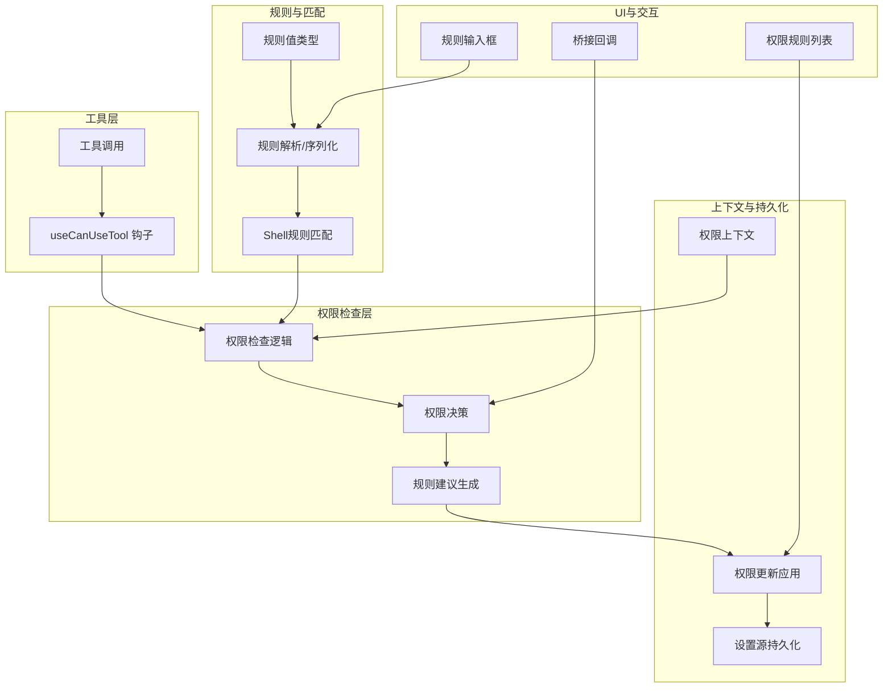
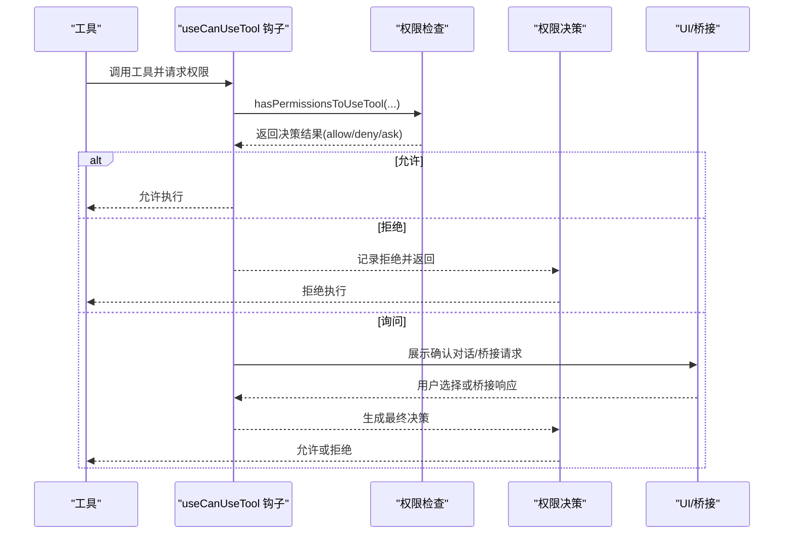
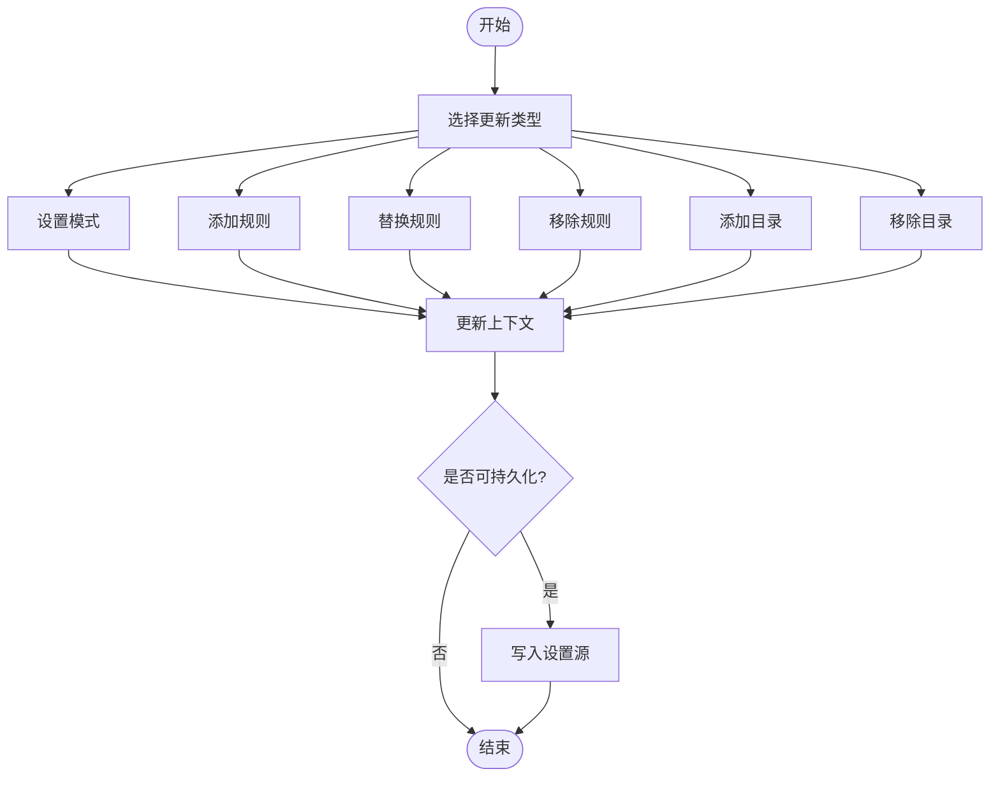
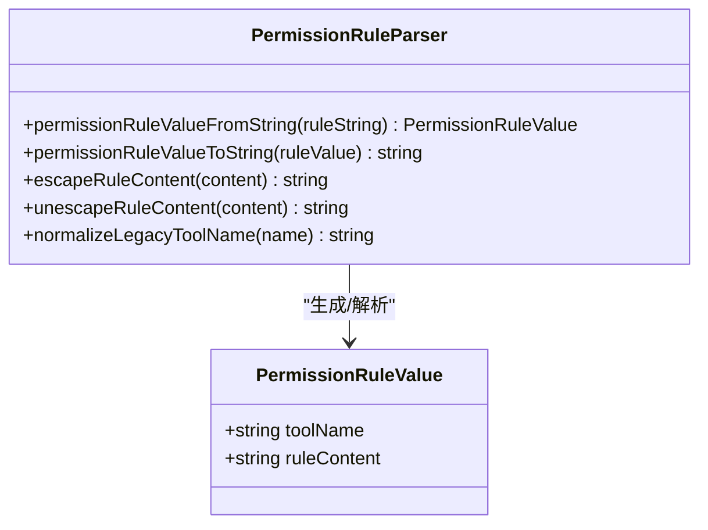
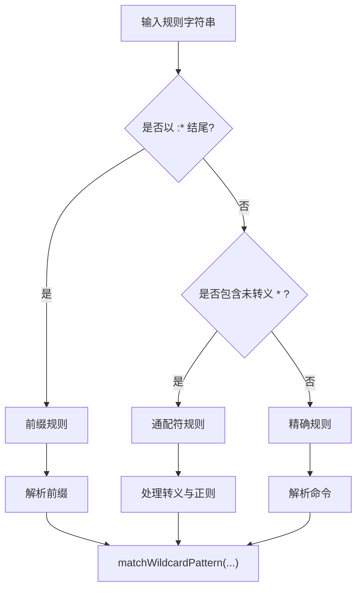
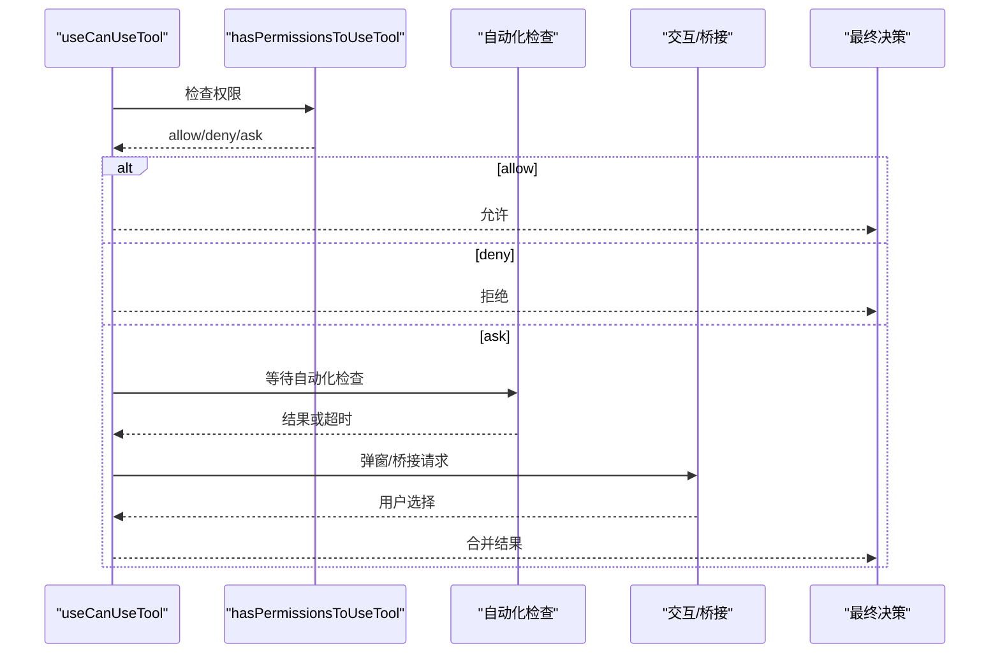
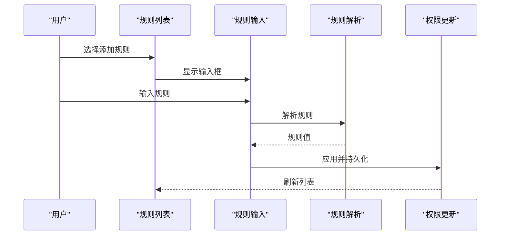
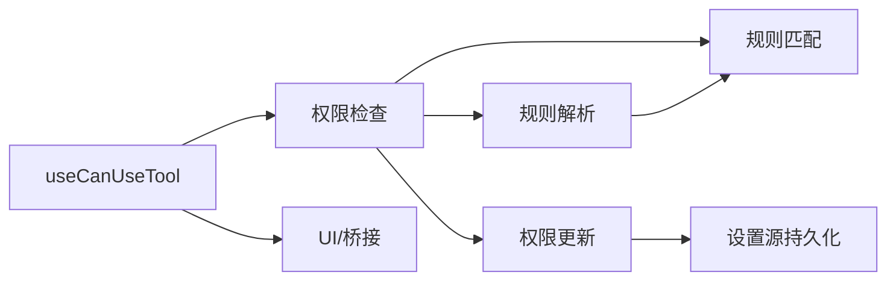

# 权限控制系统

<cite>
**本文档引用的文件**
- [src/bridge/bridgePermissionCallbacks.ts](file://src/bridge/bridgePermissionCallbacks.ts)
- [src/utils/permissions/PermissionUpdate.ts](file://src/utils/permissions/PermissionUpdate.ts)
- [src/utils/permissions/shellRuleMatching.ts](file://src/utils/permissions/shellRuleMatching.ts)
- [src/utils/permissions/PermissionRule.ts](file://src/utils/permissions/PermissionRule.ts)
- [src/utils/permissions/permissionRuleParser.ts](file://src/utils/permissions/permissionRuleParser.ts)
- [src/hooks/useCanUseTool.tsx](file://src/hooks/useCanUseTool.tsx)
- [src/commands/permissions/permissions.tsx](file://src/commands/permissions/permissions.tsx)
- [src/components/permissions/rules/PermissionRuleList.tsx](file://src/components/permissions/rules/PermissionRuleList.tsx)
- [src/components/permissions/rules/PermissionRuleInput.tsx](file://src/components/permissions/rules/PermissionRuleInput.tsx)
</cite>

## 目录
1. [简介](#简介)
2. [项目结构](#项目结构)
3. [核心组件](#核心组件)
4. [架构总览](#架构总览)
5. [详细组件分析](#详细组件分析)
6. [依赖关系分析](#依赖关系分析)
7. [性能考虑](#性能考虑)
8. [故障排除指南](#故障排除指南)
9. [结论](#结论)
10. [附录](#附录)

## 简介
本文件为权限控制系统的技术文档，围绕工具权限模型进行深入解析，涵盖权限分类体系、权限检查流程、规则匹配机制、权限决策算法、权限上下文管理、权限规则定义、权限拒绝机制、权限缓存策略、权限分类器工作原理（Bash命令分类、文件系统访问控制、危险模式检测、权限提升防护）、权限系统与工具执行/用户交互/安全审计的关系，以及扩展性设计与自定义权限规则的实现方法。

## 项目结构
权限控制相关代码主要分布在以下模块：
- 工具权限钩子：用于在工具使用前进行权限检查与决策
- 规则定义与解析：权限规则的值类型、行为、解析与序列化
- 规则匹配与建议：针对Shell工具的规则匹配、通配符处理、建议生成
- 权限更新与持久化：规则增删改、目录白名单、设置源持久化
- UI与交互：权限规则列表、输入框、添加/删除规则、工作区目录管理
- 桥接回调：与桥接层通信，传递请求/响应与取消控制

**图表来源**
- [src/hooks/useCanUseTool.tsx:28-191](file://src/hooks/useCanUseTool.tsx#L28-L191)
- [src/utils/permissions/PermissionUpdate.ts:55-206](file://src/utils/permissions/PermissionUpdate.ts#L55-L206)
- [src/utils/permissions/shellRuleMatching.ts:159-184](file://src/utils/permissions/shellRuleMatching.ts#L159-L184)
- [src/utils/permissions/permissionRuleParser.ts:93-152](file://src/utils/permissions/permissionRuleParser.ts#L93-L152)
- [src/components/permissions/rules/PermissionRuleList.tsx:473-800](file://src/components/permissions/rules/PermissionRuleList.tsx#L473-L800)
- [src/components/permissions/rules/PermissionRuleInput.tsx:19-138](file://src/components/permissions/rules/PermissionRuleInput.tsx#L19-L138)
- [src/bridge/bridgePermissionCallbacks.ts:1-44](file://src/bridge/bridgePermissionCallbacks.ts#L1-L44)

**章节来源**
- [src/hooks/useCanUseTool.tsx:28-191](file://src/hooks/useCanUseTool.tsx#L28-L191)
- [src/utils/permissions/PermissionUpdate.ts:55-206](file://src/utils/permissions/PermissionUpdate.ts#L55-L206)
- [src/utils/permissions/shellRuleMatching.ts:159-184](file://src/utils/permissions/shellRuleMatching.ts#L159-L184)
- [src/utils/permissions/permissionRuleParser.ts:93-152](file://src/utils/permissions/permissionRuleParser.ts#L93-L152)
- [src/components/permissions/rules/PermissionRuleList.tsx:473-800](file://src/components/permissions/rules/PermissionRuleList.tsx#L473-L800)
- [src/components/permissions/rules/PermissionRuleInput.tsx:19-138](file://src/components/permissions/rules/PermissionRuleInput.tsx#L19-L138)
- [src/bridge/bridgePermissionCallbacks.ts:1-44](file://src/bridge/bridgePermissionCallbacks.ts#L1-L44)

## 核心组件
- 权限上下文与更新
  - 权限上下文包含模式（mode）与三类规则集合（允许/拒绝/询问），以及附加工作目录映射
  - 支持对上下文应用单个或多个权限更新，包括添加/替换/移除规则、添加/移除目录
  - 支持将更新持久化到本地/用户/项目设置源
- 规则值与行为
  - 规则值由工具名与可选内容组成；行为分为允许、拒绝、询问
  - 提供规则值的字符串化与反序列化，支持转义括号等特殊字符
- 规则匹配与建议
  - 支持精确匹配、前缀匹配（兼容旧语法）与通配符匹配（含转义）
  - 提供针对精确命令与前缀的规则建议，便于快速授权
- 权限检查与决策
  - 在工具使用前进行权限检查，根据规则与上下文决定允许、拒绝或弹窗确认
  - 支持自动化检查（如分类器）与交互式确认的混合流程
- UI与交互
  - 提供权限规则列表、搜索、添加/删除规则、工作区目录管理
  - 规则输入框支持格式提示与校验

**章节来源**
- [src/utils/permissions/PermissionUpdate.ts:55-206](file://src/utils/permissions/PermissionUpdate.ts#L55-L206)
- [src/utils/permissions/PermissionRule.ts:25-41](file://src/utils/permissions/PermissionRule.ts#L25-L41)
- [src/utils/permissions/permissionRuleParser.ts:93-152](file://src/utils/permissions/permissionRuleParser.ts#L93-L152)
- [src/utils/permissions/shellRuleMatching.ts:159-184](file://src/utils/permissions/shellRuleMatching.ts#L159-L184)
- [src/hooks/useCanUseTool.tsx:28-191](file://src/hooks/useCanUseTool.tsx#L28-L191)
- [src/components/permissions/rules/PermissionRuleList.tsx:473-800](file://src/components/permissions/rules/PermissionRuleList.tsx#L473-L800)
- [src/components/permissions/rules/PermissionRuleInput.tsx:19-138](file://src/components/permissions/rules/PermissionRuleInput.tsx#L19-L138)

## 架构总览
权限系统采用“钩子驱动 + 规则匹配 + 上下文持久化”的分层架构：
- 钩子层：在工具调用前拦截，构建权限上下文，发起权限检查
- 规则层：解析规则、匹配命令、生成建议
- 决策层：根据规则与上下文决定行为（允许/拒绝/询问），必要时触发UI或桥接回调
- 上下文层：维护当前会话的权限状态，支持持久化到不同设置源
- UI层：提供规则编辑、搜索、工作区目录管理等交互

**图表来源**
- [src/hooks/useCanUseTool.tsx:32-191](file://src/hooks/useCanUseTool.tsx#L32-L191)

**章节来源**
- [src/hooks/useCanUseTool.tsx:32-191](file://src/hooks/useCanUseTool.tsx#L32-L191)

## 详细组件分析

### 组件A：权限上下文与更新（PermissionUpdate）
- 功能要点
  - 单条更新应用：支持设置模式、添加/替换/移除规则、添加/移除目录
  - 批量更新应用：顺序应用多个更新
  - 设置源持久化：仅对可持久化的目标（本地/用户/项目）写入
  - 规则建议：为目录生成读取规则建议
- 复杂度与性能
  - 应用单条更新为O(1)，批量更新为O(n)
  - 持久化按需写入，避免频繁IO
- 错误处理
  - 对未知更新类型直接返回原上下文，保证健壮性

**图表来源**
- [src/utils/permissions/PermissionUpdate.ts:55-206](file://src/utils/permissions/PermissionUpdate.ts#L55-L206)
- [src/utils/permissions/PermissionUpdate.ts:222-342](file://src/utils/permissions/PermissionUpdate.ts#L222-L342)

**章节来源**
- [src/utils/permissions/PermissionUpdate.ts:55-206](file://src/utils/permissions/PermissionUpdate.ts#L55-L206)
- [src/utils/permissions/PermissionUpdate.ts:222-342](file://src/utils/permissions/PermissionUpdate.ts#L222-L342)

### 组件B：规则值与解析（PermissionRule + permissionRuleParser）
- 功能要点
  - 规则值Schema定义工具名与可选内容
  - 解析字符串为规则值：支持转义括号、空内容与通配符
  - 序列化规则值为字符串：对内容进行转义
  - 工具名别名映射：兼容历史名称
- 匹配与建议
  - 与shellRuleMatching配合，支持精确/前缀/通配符匹配
  - 生成精确命令与前缀的规则建议

**图表来源**
- [src/utils/permissions/PermissionRule.ts:25-41](file://src/utils/permissions/PermissionRule.ts#L25-L41)
- [src/utils/permissions/permissionRuleParser.ts:93-152](file://src/utils/permissions/permissionRuleParser.ts#L93-L152)

**章节来源**
- [src/utils/permissions/PermissionRule.ts:25-41](file://src/utils/permissions/PermissionRule.ts#L25-L41)
- [src/utils/permissions/permissionRuleParser.ts:93-152](file://src/utils/permissions/permissionRuleParser.ts#L93-L152)

### 组件C：Shell规则匹配（shellRuleMatching）
- 功能要点
  - 解析规则：精确、前缀（兼容旧语法）、通配符
  - 通配符匹配：支持\*转义、\*匹配任意字符、末尾单星可选参数
  - 建议生成：针对精确命令与前缀生成规则建议
- 性能特性
  - 正则对象编译一次，避免重复开销
  - 通配符转换与转义处理在解析阶段完成

**图表来源**
- [src/utils/permissions/shellRuleMatching.ts:159-184](file://src/utils/permissions/shellRuleMatching.ts#L159-L184)
- [src/utils/permissions/shellRuleMatching.ts:90-154](file://src/utils/permissions/shellRuleMatching.ts#L90-L154)

**章节来源**
- [src/utils/permissions/shellRuleMatching.ts:159-184](file://src/utils/permissions/shellRuleMatching.ts#L159-L184)
- [src/utils/permissions/shellRuleMatching.ts:90-154](file://src/utils/permissions/shellRuleMatching.ts#L90-L154)

### 组件D：权限检查与决策（useCanUseTool）
- 功能要点
  - 构建权限上下文，检查工具权限
  - 自动化检查（如分类器）与交互式确认的混合流程
  - 分支处理：允许、拒绝、询问三种行为
  - 桥接回调：在桥接模式下通过回调与外部通信
- 决策流程
  - 若已允许，直接放行
  - 若拒绝，记录并返回
  - 若询问，优先等待自动化检查结果，再进入交互或桥接流程

**图表来源**
- [src/hooks/useCanUseTool.tsx:32-191](file://src/hooks/useCanUseTool.tsx#L32-L191)

**章节来源**
- [src/hooks/useCanUseTool.tsx:32-191](file://src/hooks/useCanUseTool.tsx#L32-L191)

### 组件E：UI与交互（PermissionRuleList / PermissionRuleInput）
- 功能要点
  - 规则列表：支持最近拒绝、允许、询问、拒绝四类标签页，支持搜索与排序
  - 规则输入：格式提示（工具名、可选内容），支持示例与快捷键
  - 工作区目录：添加/移除目录，支持额外工作目录映射
- 交互细节
  - 支持键盘快捷键、搜索模式、焦点管理
  - 添加规则后记录变更并提示潜在冲突（不可达规则）

**图表来源**
- [src/components/permissions/rules/PermissionRuleList.tsx:473-800](file://src/components/permissions/rules/PermissionRuleList.tsx#L473-L800)
- [src/components/permissions/rules/PermissionRuleInput.tsx:19-138](file://src/components/permissions/rules/PermissionRuleInput.tsx#L19-L138)
- [src/utils/permissions/permissionRuleParser.ts:93-152](file://src/utils/permissions/permissionRuleParser.ts#L93-L152)
- [src/utils/permissions/PermissionUpdate.ts:222-342](file://src/utils/permissions/PermissionUpdate.ts#L222-L342)

**章节来源**
- [src/components/permissions/rules/PermissionRuleList.tsx:473-800](file://src/components/permissions/rules/PermissionRuleList.tsx#L473-L800)
- [src/components/permissions/rules/PermissionRuleInput.tsx:19-138](file://src/components/permissions/rules/PermissionRuleInput.tsx#L19-L138)
- [src/utils/permissions/permissionRuleParser.ts:93-152](file://src/utils/permissions/permissionRuleParser.ts#L93-L152)
- [src/utils/permissions/PermissionUpdate.ts:222-342](file://src/utils/permissions/PermissionUpdate.ts#L222-L342)

## 依赖关系分析
- 组件耦合
  - useCanUseTool 依赖权限检查函数、上下文构建、UI/桥接回调
  - 规则解析与匹配被权限检查与建议生成广泛使用
  - 权限更新与持久化解耦于设置源，便于扩展新目标
- 外部依赖
  - 桥接回调接口用于与外部系统通信
  - 设置源读写用于持久化权限状态

**图表来源**
- [src/hooks/useCanUseTool.tsx:28-191](file://src/hooks/useCanUseTool.tsx#L28-L191)
- [src/utils/permissions/permissionRuleParser.ts:93-152](file://src/utils/permissions/permissionRuleParser.ts#L93-L152)
- [src/utils/permissions/shellRuleMatching.ts:159-184](file://src/utils/permissions/shellRuleMatching.ts#L159-L184)
- [src/utils/permissions/PermissionUpdate.ts:222-342](file://src/utils/permissions/PermissionUpdate.ts#L222-L342)

**章节来源**
- [src/hooks/useCanUseTool.tsx:28-191](file://src/hooks/useCanUseTool.tsx#L28-L191)
- [src/utils/permissions/permissionRuleParser.ts:93-152](file://src/utils/permissions/permissionRuleParser.ts#L93-L152)
- [src/utils/permissions/shellRuleMatching.ts:159-184](file://src/utils/permissions/shellRuleMatching.ts#L159-L184)
- [src/utils/permissions/PermissionUpdate.ts:222-342](file://src/utils/permissions/PermissionUpdate.ts#L222-L342)

## 性能考虑
- 规则匹配
  - 通配符正则仅在模块初始化时编译一次，减少重复开销
  - 通配符转换与转义在解析阶段完成，运行时只需正则测试
- 更新与持久化
  - 批量更新顺序应用，避免多次上下文重建
  - 持久化仅对可持久化目标写入，减少IO
- UI渲染
  - 列表使用虚拟滚动与搜索过滤，降低渲染压力
  - 焦点与快捷键优化交互体验

## 故障排除指南
- 权限检查抛出中断错误
  - 场景：用户中止或API中止
  - 处理：记录日志并取消当前权限检查，返回中止状态
- 自动化检查超时
  - 场景：分类器检查未及时返回
  - 处理：等待固定时间后继续进入交互或桥接流程
- 规则解析异常
  - 场景：规则字符串格式不合法
  - 处理：回退为工具名规则，提示用户修正

**章节来源**
- [src/hooks/useCanUseTool.tsx:171-182](file://src/hooks/useCanUseTool.tsx#L171-L182)

## 结论
该权限控制系统通过清晰的分层设计与模块化实现，提供了灵活且可扩展的工具权限管理能力。其核心优势在于：
- 规则模型简洁、解析与匹配高效
- 决策流程支持自动化与人工干预的混合模式
- 上下文与持久化解耦，便于多场景部署
- UI友好，支持快速规则编辑与工作区管理

## 附录

### 权限规则配置示例路径
- 规则值定义与Schema：[src/utils/permissions/PermissionRule.ts:25-41](file://src/utils/permissions/PermissionRule.ts#L25-L41)
- 规则解析与序列化：[src/utils/permissions/permissionRuleParser.ts:93-152](file://src/utils/permissions/permissionRuleParser.ts#L93-L152)
- 规则匹配与建议：[src/utils/permissions/shellRuleMatching.ts:159-184](file://src/utils/permissions/shellRuleMatching.ts#L159-L184)

### 权限检查实现示例路径
- 权限钩子与决策流程：[src/hooks/useCanUseTool.tsx:28-191](file://src/hooks/useCanUseTool.tsx#L28-L191)

### 权限决策过程示例路径
- 权限更新应用与持久化：[src/utils/permissions/PermissionUpdate.ts:55-206](file://src/utils/permissions/PermissionUpdate.ts#L55-L206)

### 权限系统与工具执行、用户交互、安全审计的关系
- 工具执行：在工具调用前通过钩子进行权限检查，确保符合规则
- 用户交互：在需要时弹窗或桥接请求，提供透明的授权流程
- 安全审计：记录拒绝与自动化检查结果，支持后续追踪与统计

**章节来源**
- [src/hooks/useCanUseTool.tsx:64-168](file://src/hooks/useCanUseTool.tsx#L64-L168)
- [src/commands/permissions/permissions.tsx:5-9](file://src/commands/permissions/permissions.tsx#L5-L9)

### 扩展性设计与自定义权限规则
- 新增规则行为：扩展权限行为Schema与更新应用逻辑
- 新增规则来源：在设置源持久化中增加新目标
- 新增匹配策略：在规则匹配模块中新增类型与匹配函数
- 新增UI功能：在规则列表与输入框中扩展交互能力

**章节来源**
- [src/utils/permissions/PermissionRule.ts:25-41](file://src/utils/permissions/PermissionRule.ts#L25-L41)
- [src/utils/permissions/PermissionUpdate.ts:208-216](file://src/utils/permissions/PermissionUpdate.ts#L208-L216)
- [src/utils/permissions/shellRuleMatching.ts:25-38](file://src/utils/permissions/shellRuleMatching.ts#L25-L38)