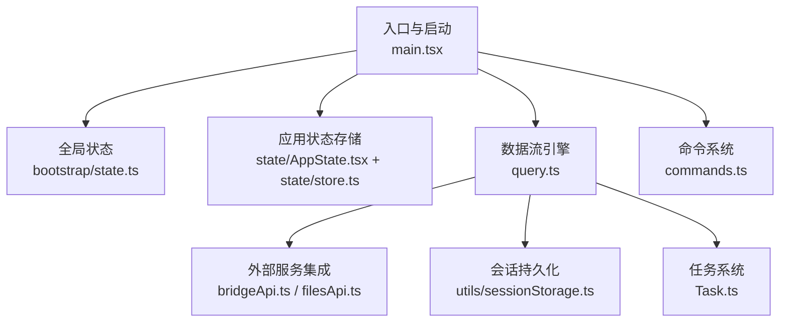
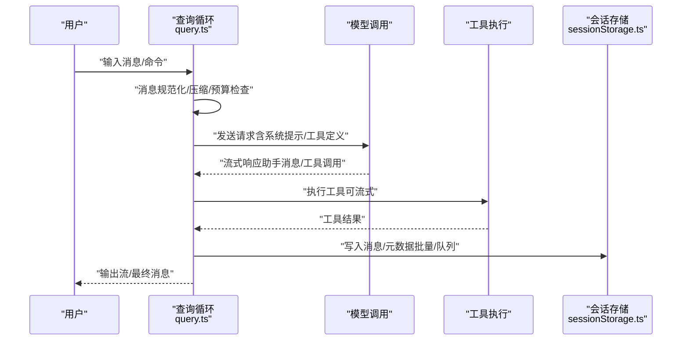
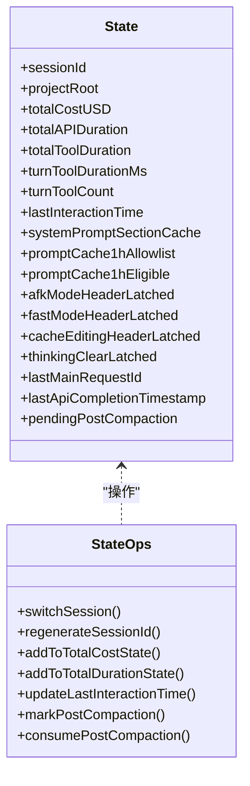
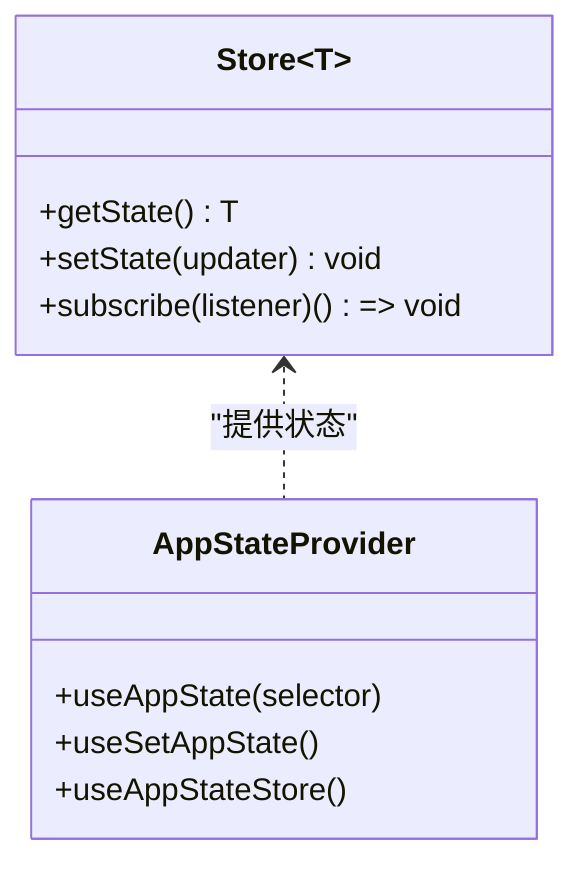
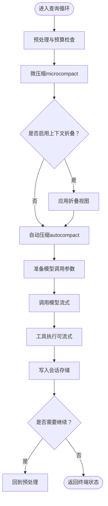
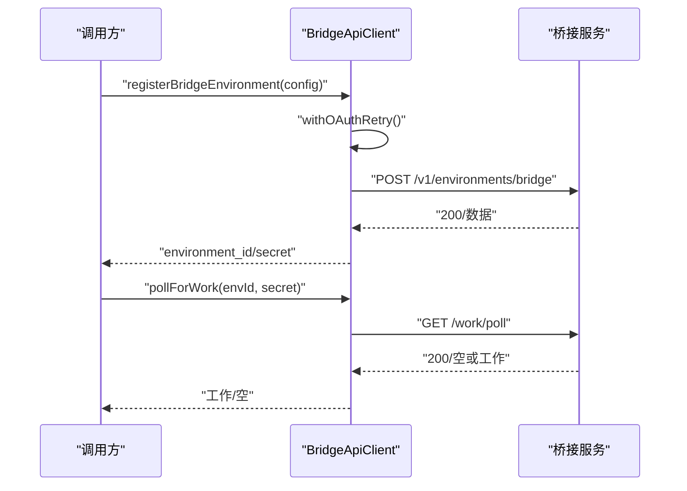
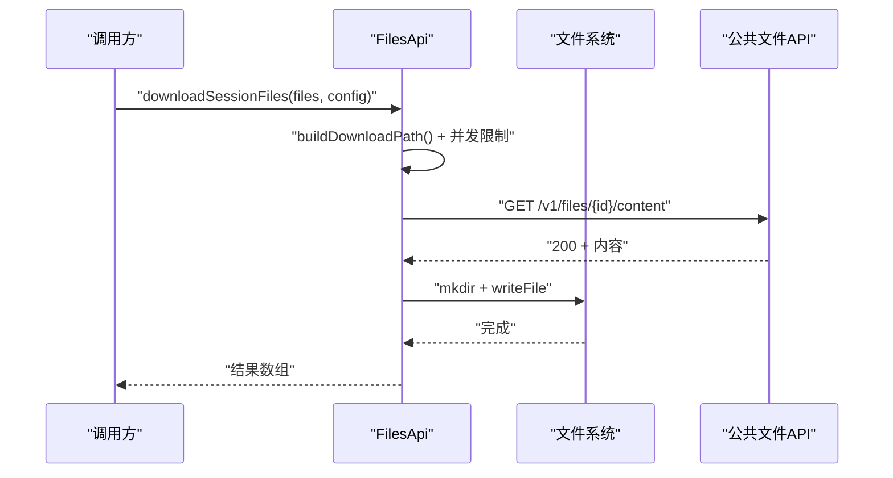
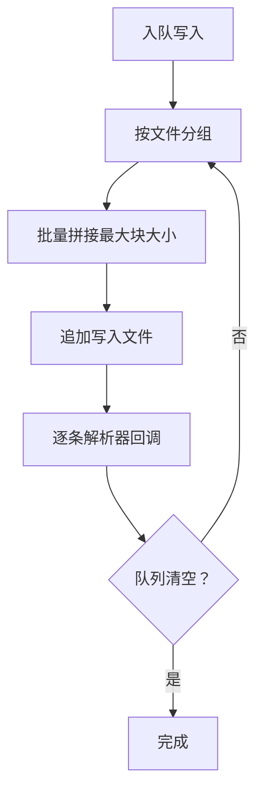
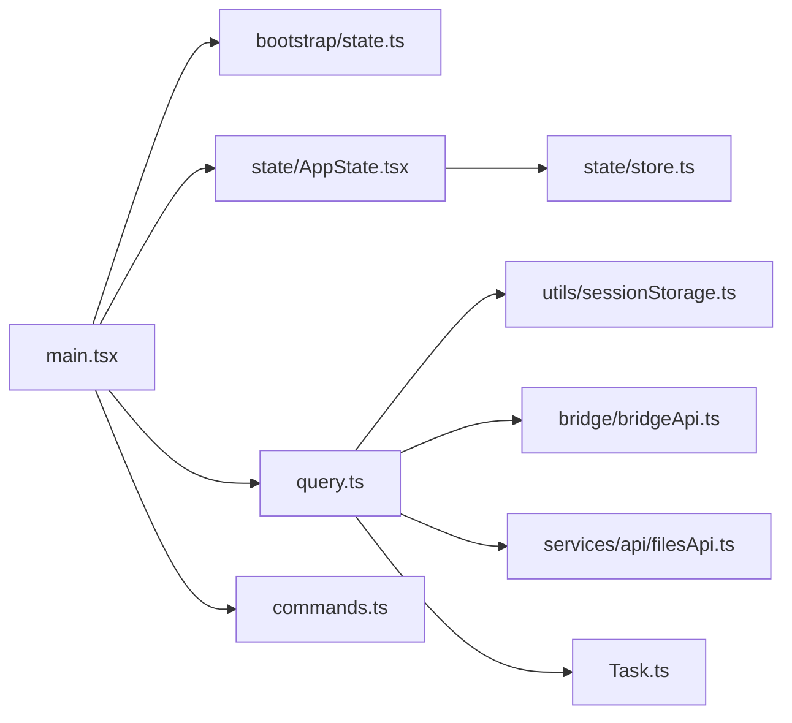

# 数据流架构

<cite>
**本文档引用的文件**
- [main.tsx](file://src/main.tsx)
- [state.ts](file://src/bootstrap/state.ts)
- [AppState.tsx](file://src/state/AppState.tsx)
- [store.ts](file://src/state/store.ts)
- [bridgeApi.ts](file://src/bridge/bridgeApi.ts)
- [filesApi.ts](file://src/services/api/filesApi.ts)
- [sessionStorage.ts](file://src/utils/sessionStorage.ts)
- [query.ts](file://src/query.ts)
- [Task.ts](file://src/Task.ts)
- [commands.ts](file://src/commands.ts)
</cite>

## 目录
1. [引言](#引言)
2. [项目结构](#项目结构)
3. [核心组件](#核心组件)
4. [架构总览](#架构总览)
5. [详细组件分析](#详细组件分析)
6. [依赖关系分析](#依赖关系分析)
7. [性能考虑](#性能考虑)
8. [故障排除指南](#故障排除指南)
9. [结论](#结论)

## 引言
本文件系统性阐述该代码库的数据流架构，覆盖从输入到输出的完整路径、中间处理步骤、缓存与持久化策略、并发控制与一致性保障、以及与各子系统的集成关系。文档以循序渐进的方式呈现，既适合初学者快速理解整体流程，也提供深入的技术细节供高级用户参考。

## 项目结构
该项目采用模块化分层设计：
- 入口与启动：入口文件负责初始化、设置全局状态、加载配置与预取资源，并在渲染后启动后台预取。
- 状态管理：通过轻量级状态存储与上下文提供者实现跨组件的状态共享与订阅。
- 数据流引擎：查询循环（query）负责消息编排、压缩、工具执行与模型调用。
- 外部服务集成：桥接API（Bridge）、文件API（Files API）等。
- 持久化与会话：会话存储模块负责消息序列化、写入队列、元数据维护与重放。
- 命令系统：命令注册与过滤，支持动态技能与插件扩展。

图表来源
- [main.tsx](file://src/main.tsx)
- [state.ts](file://src/bootstrap/state.ts)
- [AppState.tsx](file://src/state/AppState.tsx)
- [store.ts](file://src/state/store.ts)
- [query.ts](file://src/query.ts)
- [bridgeApi.ts](file://src/bridge/bridgeApi.ts)
- [filesApi.ts](file://src/services/api/filesApi.ts)
- [sessionStorage.ts](file://src/utils/sessionStorage.ts)
- [commands.ts](file://src/commands.ts)
- [Task.ts](file://src/Task.ts)

章节来源
- [main.tsx](file://src/main.tsx)
- [state.ts](file://src/bootstrap/state.ts)
- [AppState.tsx](file://src/state/AppState.tsx)
- [store.ts](file://src/state/store.ts)
- [query.ts](file://src/query.ts)
- [bridgeApi.ts](file://src/bridge/bridgeApi.ts)
- [filesApi.ts](file://src/services/api/filesApi.ts)
- [sessionStorage.ts](file://src/utils/sessionStorage.ts)
- [commands.ts](file://src/commands.ts)
- [Task.ts](file://src/Task.ts)

## 核心组件
- 全局状态与会话管理：提供会话ID、工作目录、计费与时长统计、提示词缓存等会话级状态。
- 应用状态存储：基于轻量Store的订阅式状态容器，支持选择器与变更通知。
- 查询循环：统一的消息编排、压缩、工具执行与模型调用流水线。
- 外部服务客户端：桥接API与文件API，封装认证、重试、错误处理与调试日志。
- 会话存储：面向磁盘的高吞吐写入队列、批量追加、元数据重附着与尾窗读取。
- 命令系统：命令注册、可用性过滤、动态技能与插件注入。
- 任务系统：任务生命周期管理、输出文件定位与清理。

章节来源
- [state.ts](file://src/bootstrap/state.ts)
- [AppState.tsx](file://src/state/AppState.tsx)
- [store.ts](file://src/state/store.ts)
- [query.ts](file://src/query.ts)
- [bridgeApi.ts](file://src/bridge/bridgeApi.ts)
- [filesApi.ts](file://src/services/api/filesApi.ts)
- [sessionStorage.ts](file://src/utils/sessionStorage.ts)
- [commands.ts](file://src/commands.ts)
- [Task.ts](file://src/Task.ts)

## 架构总览
下图展示了从用户输入到模型响应再到工具执行与持久化的端到端数据流：

图表来源
- [query.ts](file://src/query.ts)
- [sessionStorage.ts](file://src/utils/sessionStorage.ts)

章节来源
- [query.ts](file://src/query.ts)
- [sessionStorage.ts](file://src/utils/sessionStorage.ts)

## 详细组件分析

### 全局状态与会话管理（bootstrap/state）
- 职责：维护会话级全局状态（如计费、时长、工具耗时、提示词缓存、权限模式、远程模式标志等），提供原子切换会话的能力。
- 关键点：
  - 会话ID与项目目录原子切换，避免会话间漂移。
  - 统一的时间戳与交互时间刷新策略，减少频繁调用。
  - 提示词缓存与头部开关的“粘滞”标记，避免频繁失效导致的缓存击穿。
- 并发与一致性：通过不可变状态与变更通知，确保订阅方在渲染周期内一致感知。

图表来源
- [state.ts](file://src/bootstrap/state.ts)

章节来源
- [state.ts](file://src/bootstrap/state.ts)

### 应用状态存储（AppState + Store）
- 职责：提供订阅式状态容器，支持选择器与变更回调；与设置变更监听联动，确保UI与业务状态同步。
- 关键点：
  - 使用useSyncExternalStore实现高效订阅，避免不必要重渲染。
  - 设置变更通过应用函数传播，保持状态收敛。
- 并发与一致性：Store内部使用Set维护监听器，setState在对象相等性检查后才触发更新。

图表来源
- [store.ts](file://src/state/store.ts)
- [AppState.tsx](file://src/state/AppState.tsx)

章节来源
- [store.ts](file://src/state/store.ts)
- [AppState.tsx](file://src/state/AppState.tsx)

### 查询循环（query）
- 职责：统一的消息编排、压缩、工具执行与模型调用流水线；处理流式回退、令牌预算、恢复路径与边界消息。
- 关键流程：
  - 预处理：规范化消息、应用内容替换预算、可选的历史截断（snip）。
  - 压缩：微压缩（microcompact）与自动压缩（autocompact），产出摘要消息与边界标记。
  - 工具执行：可流式工具执行器，支持回退与墓碑消息清理。
  - 模型调用：前置令牌预警、任务预算参数传递、思维模式与快速模式头。
  - 输出：流式事件、最终消息、工具使用摘要、墓碑消息（用于UI清理）。
- 错误处理与回滚：
  - 对“提示过长/输出令牌过多”等可恢复错误进行保留与恢复尝试。
  - 流式回退时生成墓碑消息，避免无效签名导致的API错误。
- 并发与一致性：
  - 写入队列与批量追加，确保磁盘写入顺序与原子性。
  - 令牌预算跟踪与任务预算剩余值在压缩边界处正确传递。

图表来源
- [query.ts](file://src/query.ts)
- [sessionStorage.ts](file://src/utils/sessionStorage.ts)

章节来源
- [query.ts](file://src/query.ts)
- [sessionStorage.ts](file://src/utils/sessionStorage.ts)

### 外部服务集成

#### 桥接API（bridgeApi）
- 职责：与桥接服务通信，注册环境、轮询工作、确认与停止工作、心跳、权限事件上报等。
- 关键点：
  - OAuth认证与401重试（可选刷新）。
  - 请求头包含运行器版本、Beta标头、可信设备令牌等。
  - 对401/403/404/410等状态进行致命错误映射，便于上层处理。
  - 空轮询计数与日志节流，降低噪音。
- 错误处理：非可重试错误直接抛出，可重试错误通过withOAuthRetry处理。

图表来源
- [bridgeApi.ts](file://src/bridge/bridgeApi.ts)

章节来源
- [bridgeApi.ts](file://src/bridge/bridgeApi.ts)

#### 文件API（filesApi）
- 职责：下载/上传文件、列出文件、解析文件规格、带指数退避的重试。
- 关键点：
  - 下载：构建下载路径、并发限制、超时与重试、大小校验。
  - 上传：读取本地文件、大小限制、多部分表单、超时与取消。
  - 列表：分页游标（after_id）遍历，错误分类与指标上报。
- 并发与性能：默认并发5，避免阻塞；指数退避降低服务器压力。

图表来源
- [filesApi.ts](file://src/services/api/filesApi.ts)

章节来源
- [filesApi.ts](file://src/services/api/filesApi.ts)

### 会话存储（sessionStorage）
- 职责：将消息与元数据持久化到JSONL文件，支持批量写入、队列调度、尾窗读取与元数据重附着。
- 关键点：
  - 写入队列：按文件分组，批量追加，超过阈值切片写入。
  - 元数据重附着：在压缩或退出时将标题/标签等关键元数据重新写入尾部，确保快速加载可见。
  - 清理钩子：进程退出前刷新队列并重附着元数据。
- 并发与一致性：
  - 写入计数与等待解析器确保flush时机可控。
  - 与全局状态配合，避免会话间路径漂移。

图表来源
- [sessionStorage.ts](file://src/utils/sessionStorage.ts)

章节来源
- [sessionStorage.ts](file://src/utils/sessionStorage.ts)

### 命令系统（commands）
- 职责：集中注册与过滤命令，支持动态技能、插件与工作流注入；提供远程安全命令集合。
- 关键点：
  - 可用性过滤：根据认证与提供商要求筛选命令。
  - 动态技能去重：避免与内置/插件命令重复。
  - 远程安全命令白名单：限制仅能在远程模式下安全执行的命令。
- 扩展性：通过memoize缓存与异步加载，平衡性能与灵活性。

章节来源
- [commands.ts](file://src/commands.ts)

### 任务系统（Task）
- 职责：抽象任务生命周期（创建、运行、完成/失败/中止），提供任务ID生成与输出文件定位。
- 关键点：
  - 终止状态判断：用于清理与消息注入保护。
  - 输出文件偏移：支持增量输出与重放。

章节来源
- [Task.ts](file://src/Task.ts)

## 依赖关系分析
- 启动阶段依赖：入口文件依赖全局状态初始化、设置预取、遥测与特性门控。
- 查询循环依赖：消息规范化、压缩、工具执行、模型调用、会话存储与状态更新。
- 外部服务依赖：桥接API与文件API作为独立客户端，通过错误映射与重试策略解耦。
- 命令系统依赖：动态加载技能与插件，与可用性过滤结合。
- 任务系统依赖：与查询循环协作，执行工具与子代理任务。

图表来源
- [main.tsx](file://src/main.tsx)
- [state.ts](file://src/bootstrap/state.ts)
- [AppState.tsx](file://src/state/AppState.tsx)
- [store.ts](file://src/state/store.ts)
- [query.ts](file://src/query.ts)
- [sessionStorage.ts](file://src/utils/sessionStorage.ts)
- [bridgeApi.ts](file://src/bridge/bridgeApi.ts)
- [filesApi.ts](file://src/services/api/filesApi.ts)
- [commands.ts](file://src/commands.ts)
- [Task.ts](file://src/Task.ts)

章节来源
- [main.tsx](file://src/main.tsx)
- [query.ts](file://src/query.ts)
- [sessionStorage.ts](file://src/utils/sessionStorage.ts)
- [bridgeApi.ts](file://src/bridge/bridgeApi.ts)
- [filesApi.ts](file://src/services/api/filesApi.ts)
- [commands.ts](file://src/commands.ts)
- [Task.ts](file://src/Task.ts)

## 性能考虑
- 启动阶段优化：延迟预取与后台任务，避免阻塞首屏渲染；并行读取密钥与MDM配置。
- 写入性能：批量追加与块大小限制，减少磁盘碎片与系统调用次数；写入队列与定时器合并写入。
- 网络重试：指数退避与可取消请求，降低抖动对用户体验的影响。
- 缓存与头部：提示词缓存与“粘滞”头部，减少不必要的缓存失效。
- 令牌预算：在压缩边界与任务预算之间传递剩余值，避免重复计算与过度压缩。

## 故障排除指南
- 认证失败（401）：检查OAuth令牌与刷新流程；桥接API支持一次自动刷新重试。
- 权限拒绝（403）：检查组织权限与作用域；某些操作可能被抑制（如外部轮询）。
- 资源过载（429）：降低轮询频率或增加退避；关注速率限制策略。
- 文件上传失败：检查文件大小限制、网络中断与取消；查看非可重试错误类型。
- 会话写入异常：确认目录存在与权限；写入队列会在缺失目录时自动创建。
- 查询循环卡顿：检查压缩策略与工具执行耗时；必要时禁用自动压缩或调整并发。

章节来源
- [bridgeApi.ts](file://src/bridge/bridgeApi.ts)
- [filesApi.ts](file://src/services/api/filesApi.ts)
- [sessionStorage.ts](file://src/utils/sessionStorage.ts)
- [query.ts](file://src/query.ts)

## 结论
该数据流架构以“查询循环为核心”，通过状态管理、压缩与工具执行形成闭环，结合桥接与文件API实现外部能力接入，并以会话存储保障持久化与一致性。整体设计强调可扩展性（动态命令/技能/插件）、可观测性（指标与调试日志）与健壮性（重试与回退）。建议在生产环境中持续监控压缩效果、写入延迟与工具执行耗时，以进一步优化端到端体验。