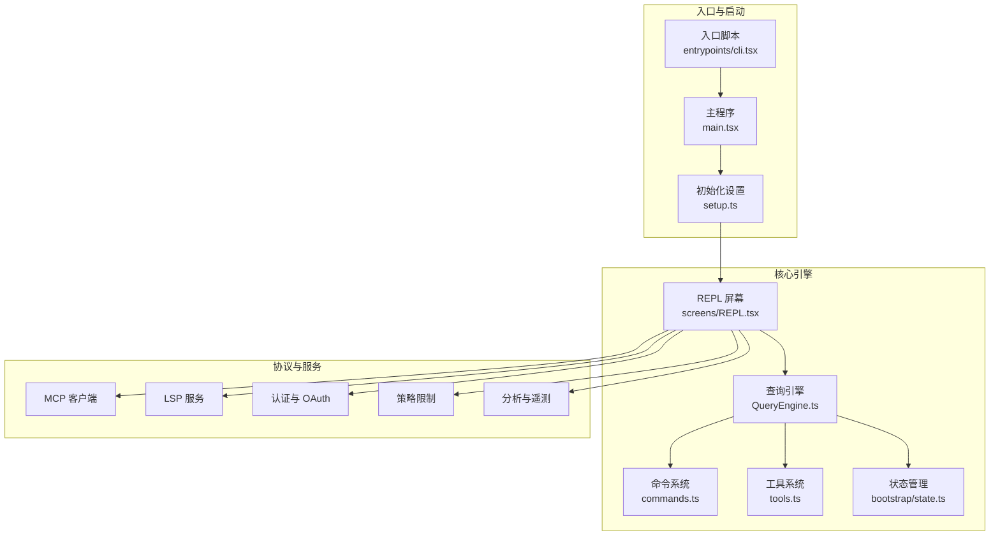
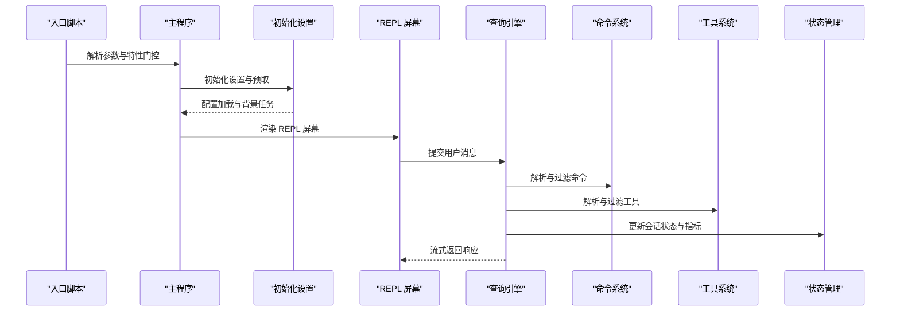
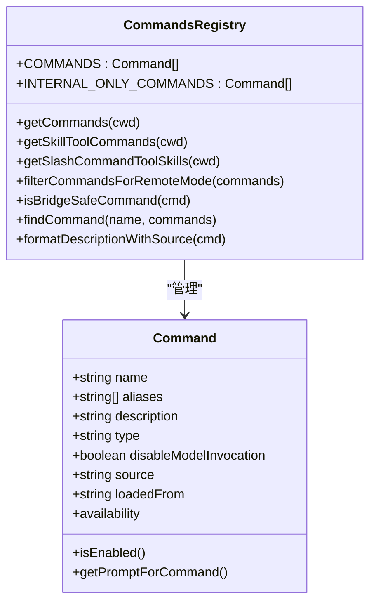
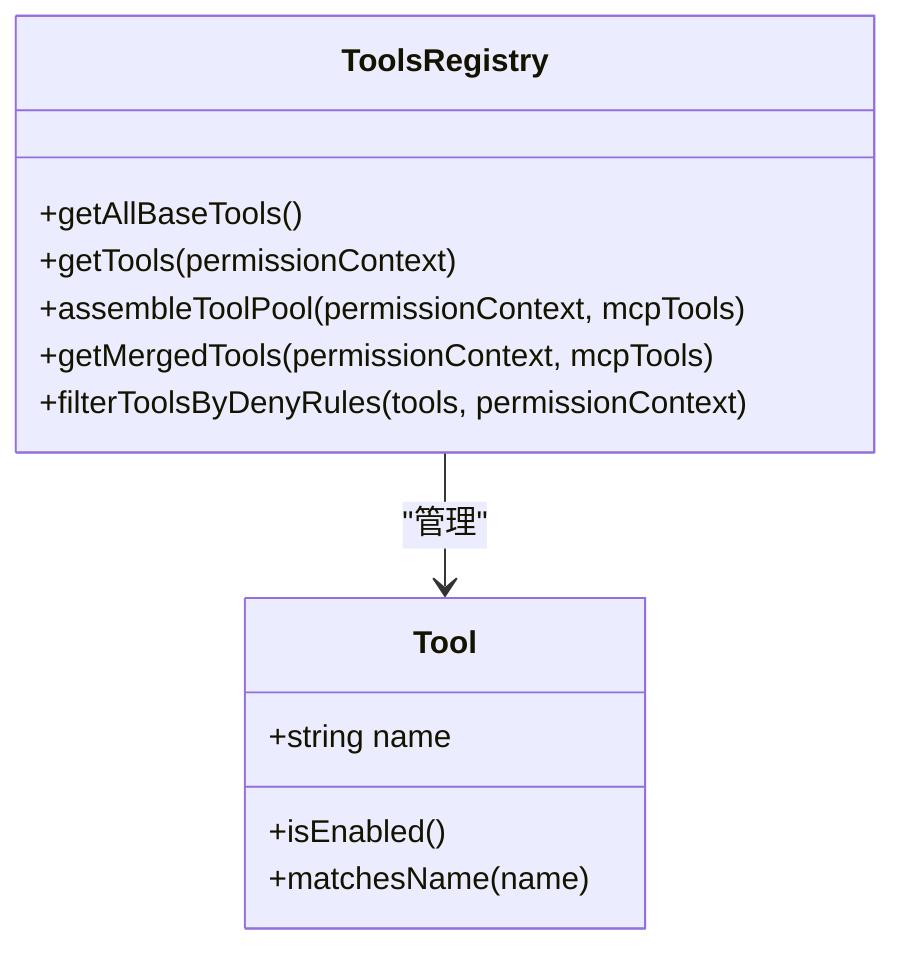
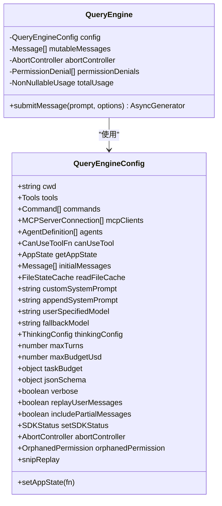
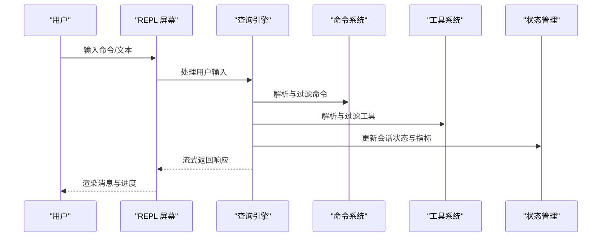
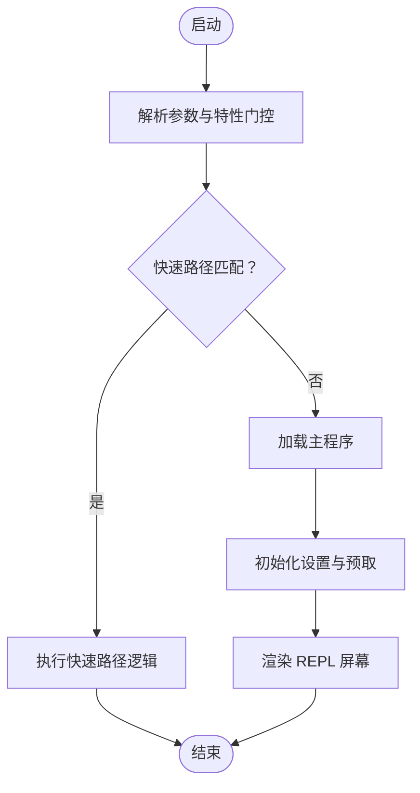
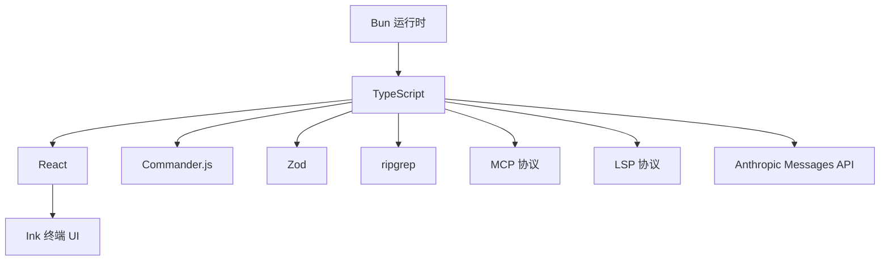

# 架构设计

<cite>
**本文档引用的文件**
- [README.md](file://README.md)
- [package.json](file://package.json)
- [src/main.tsx](file://src/main.tsx)
- [src/setup.ts](file://src/setup.ts)
- [src/bootstrap/state.ts](file://src/bootstrap/state.ts)
- [src/QueryEngine.ts](file://src/QueryEngine.ts)
- [src/commands.ts](file://src/commands.ts)
- [src/tools.ts](file://src/tools.ts)
- [src/entrypoints/cli.tsx](file://src/entrypoints/cli.tsx)
- [src/screens/REPL.tsx](file://src/screens/REPL.tsx)
</cite>

## 目录
1. [引言](#引言)
2. [项目结构](#项目结构)
3. [核心组件](#核心组件)
4. [架构总览](#架构总览)
5. [详细组件分析](#详细组件分析)
6. [依赖关系分析](#依赖关系分析)
7. [性能考量](#性能考量)
8. [故障排查指南](#故障排查指南)
9. [结论](#结论)
10. [附录](#附录)

## 引言
本项目是 Claude Code 的自由构建版本，目标是在本地终端中提供一个可构建、可定制、无遥测与安全提示注入的 AI 编码助手。项目采用 Bun 运行时与 TypeScript 开发，结合 React + Ink 实现终端 UI，并通过模块化的命令系统、工具系统、查询引擎与状态管理实现完整的交互式对话与自动化任务执行。

## 项目结构
项目采用按功能域分层的组织方式：
- 入口与启动：入口脚本负责快速路径优化与特性门控，主程序完成初始化、设置与 REPL 启动。
- 命令系统：统一注册与可用性过滤，支持内置、插件与动态技能命令。
- 工具系统：围绕 Bash、文件读写、网络搜索等能力构建的工具集合，支持权限控制与 MCP 扩展。
- 查询引擎：封装消息系统提示词构建、权限检查、工具调用与模型交互的生命周期。
- 状态管理：集中式的会话状态与指标统计，贯穿 REPL 与后台任务。
- 屏幕与 UI：REPL 组件负责输入、渲染、通知与交互，支持虚拟滚动与搜索等体验优化。
- 服务与协议：MCP、LSP、OAuth、策略限制、分析与遥测（在本版本中被移除或禁用）。



**图表来源**
- [src/entrypoints/cli.tsx:1-304](file://src/entrypoints/cli.tsx#L1-L304)
- [src/main.tsx:1-800](file://src/main.tsx#L1-L800)
- [src/setup.ts:1-478](file://src/setup.ts#L1-L478)
- [src/screens/REPL.tsx:1-800](file://src/screens/REPL.tsx#L1-L800)
- [src/QueryEngine.ts:1-800](file://src/QueryEngine.ts#L1-L800)
- [src/commands.ts:1-755](file://src/commands.ts#L1-L755)
- [src/tools.ts:1-390](file://src/tools.ts#L1-L390)
- [src/bootstrap/state.ts:1-800](file://src/bootstrap/state.ts#L1-L800)

**章节来源**
- [README.md:179-205](file://README.md#L179-L205)
- [src/entrypoints/cli.tsx:1-304](file://src/entrypoints/cli.tsx#L1-L304)
- [src/main.tsx:1-800](file://src/main.tsx#L1-L800)
- [src/setup.ts:1-478](file://src/setup.ts#L1-L478)
- [src/screens/REPL.tsx:1-800](file://src/screens/REPL.tsx#L1-L800)
- [src/QueryEngine.ts:1-800](file://src/QueryEngine.ts#L1-L800)
- [src/commands.ts:1-755](file://src/commands.ts#L1-L755)
- [src/tools.ts:1-390](file://src/tools.ts#L1-L390)
- [src/bootstrap/state.ts:1-800](file://src/bootstrap/state.ts#L1-L800)

## 核心组件
- 命令系统：统一注册内置、插件与动态技能命令，支持可用性过滤与启用状态检查，提供命令查找与格式化描述。
- 工具系统：围绕 Bash、文件操作、网络搜索等能力构建，支持权限规则过滤、MCP 工具合并与工具池组装。
- 查询引擎：封装消息系统提示词构建、权限检查、工具调用与模型交互的生命周期，支持历史压缩、思维模式与预算控制。
- 状态管理：集中式的会话状态、指标统计与运行时配置，支持会话切换、持久化与性能指标追踪。
- REPL 屏幕：终端 UI 主界面，负责输入处理、消息渲染、通知与交互，支持虚拟滚动、搜索与快捷键绑定。
- 入口与启动：快速路径优化、特性门控、远程模式与桥接模式的入口处理。

**章节来源**
- [src/commands.ts:1-755](file://src/commands.ts#L1-L755)
- [src/tools.ts:1-390](file://src/tools.ts#L1-L390)
- [src/QueryEngine.ts:1-800](file://src/QueryEngine.ts#L1-L800)
- [src/bootstrap/state.ts:1-800](file://src/bootstrap/state.ts#L1-L800)
- [src/screens/REPL.tsx:1-800](file://src/screens/REPL.tsx#L1-L800)
- [src/entrypoints/cli.tsx:1-304](file://src/entrypoints/cli.tsx#L1-L304)

## 架构总览
系统采用“入口脚本 → 主程序 → 初始化设置 → REPL 屏幕”的启动链路，REPL 作为用户交互中枢，驱动查询引擎完成消息构建、权限检查与工具调用，状态管理贯穿整个生命周期，服务层通过 MCP、LSP、OAuth 等协议扩展能力。



**图表来源**
- [src/entrypoints/cli.tsx:1-304](file://src/entrypoints/cli.tsx#L1-L304)
- [src/main.tsx:1-800](file://src/main.tsx#L1-L800)
- [src/setup.ts:1-478](file://src/setup.ts#L1-L478)
- [src/screens/REPL.tsx:1-800](file://src/screens/REPL.tsx#L1-L800)
- [src/QueryEngine.ts:1-800](file://src/QueryEngine.ts#L1-L800)
- [src/commands.ts:1-755](file://src/commands.ts#L1-L755)
- [src/tools.ts:1-390](file://src/tools.ts#L1-L390)
- [src/bootstrap/state.ts:1-800](file://src/bootstrap/state.ts#L1-L800)

## 详细组件分析

### 命令系统架构
命令系统以统一注册与可用性过滤为核心，支持内置、插件与动态技能命令的组合与去重，确保命令列表在不同环境下的稳定性与一致性。



**图表来源**
- [src/commands.ts:1-755](file://src/commands.ts#L1-L755)

**章节来源**
- [src/commands.ts:1-755](file://src/commands.ts#L1-L755)

### 工具系统架构
工具系统围绕 Bash、文件读写、网络搜索等能力构建，支持权限规则过滤、MCP 工具合并与工具池组装，确保工具列表在不同模式下的稳定与一致。



**图表来源**
- [src/tools.ts:1-390](file://src/tools.ts#L1-L390)

**章节来源**
- [src/tools.ts:1-390](file://src/tools.ts#L1-L390)

### 查询引擎架构
查询引擎封装消息系统提示词构建、权限检查、工具调用与模型交互的生命周期，支持历史压缩、思维模式与预算控制，确保长会话的内存与性能可控。



**图表来源**
- [src/QueryEngine.ts:1-800](file://src/QueryEngine.ts#L1-L800)

**章节来源**
- [src/QueryEngine.ts:1-800](file://src/QueryEngine.ts#L1-L800)

### 状态管理架构
状态管理集中于会话状态、指标统计与运行时配置，支持会话切换、持久化与性能指标追踪，确保系统在多线程与异步场景下的稳定性。

```mermaid
classDiagram
class State {
+string originalCwd
+string projectRoot
+number totalCostUSD
+number totalAPIDuration
+number totalToolDuration
+number turnHookDurationMs
+number turnToolDurationMs
+number turnClassifierDurationMs
+number turnToolCount
+number turnHookCount
+number turnClassifierCount
+number startTime
+number lastInteractionTime
+number totalLinesAdded
+number totalLinesRemoved
+boolean hasUnknownModelCost
+string cwd
+object modelUsage
+string mainLoopModelOverride
+string initialMainLoopModel
+ModelStrings modelStrings
+boolean isInteractive
+boolean kairosActive
+boolean strictToolResultPairing
+boolean sdkAgentProgressSummariesEnabled
+boolean userMsgOptIn
+string clientType
+string sessionSource
+string questionPreviewFormat
+string flagSettingsPath
+object flagSettingsInline
+SettingSource[] allowedSettingSources
+string sessionIngressToken
+string oauthTokenFromFd
+string apiKeyFromFd
+Meter meter
+AttributedCounter sessionCounter
+AttributedCounter locCounter
+AttributedCounter prCounter
+AttributedCounter commitCounter
+AttributedCounter costCounter
+AttributedCounter tokenCounter
+AttributedCounter codeEditToolDecisionCounter
+AttributedCounter activeTimeCounter
+object statsStore
+string sessionId
+string parentSessionId
+LoggerProvider loggerProvider
+Logger eventLogger
+MeterProvider meterProvider
+BasicTracerProvider tracerProvider
+Map~string,AgentColorName~ agentColorMap
+number agentColorIndex
+object lastAPIRequest
+BetaMessageStreamParams[] lastAPIRequestMessages
+unknown[] lastClassifierRequests
+string cachedClaudeMdContent
+{error,timestamp}[] inMemoryErrorLog
+string[] inlinePlugins
+boolean chromeFlagOverride
+boolean useCoworkPlugins
+boolean sessionBypassPermissionsMode
+boolean scheduledTasksEnabled
+SessionCronTask[] sessionCronTasks
+Set~string~ sessionCreatedTeams
+boolean sessionTrustAccepted
+boolean sessionPersistenceDisabled
+boolean hasExitedPlanMode
+boolean needsPlanModeExitAttachment
+boolean needsAutoModeExitAttachment
+boolean lspRecommendationShownThisSession
+object initJsonSchema
+object registeredHooks
+Map~string,string~ planSlugCache
+object teleportedSessionInfo
+Map~string,object~ invokedSkills
+{operation,durationMs,timestamp}[] slowOperations
+string[] sdkBetas
+string mainThreadAgentType
+boolean isRemoteMode
+string directConnectServerUrl
+Map~string,string|null~ systemPromptSectionCache
+string lastEmittedDate
+string[] additionalDirectoriesForClaudeMd
+ChannelEntry[] allowedChannels
+boolean hasDevChannels
+string sessionProjectDir
+string[] promptCache1hAllowlist
+boolean promptCache1hEligible
+boolean afkModeHeaderLatched
+boolean fastModeHeaderLatched
+boolean cacheEditingHeaderLatched
+boolean thinkingClearLatched
+string promptId
+string lastMainRequestId
+number lastApiCompletionTimestamp
+boolean pendingPostCompaction
}
class StateManager {
+getSessionId()
+regenerateSessionId(options)
+getParentSessionId()
+switchSession(sessionId, projectDir)
+getOriginalCwd()
+setOriginalCwd(cwd)
+getProjectRoot()
+setProjectRoot(cwd)
+getCwdState()
+setCwdState(cwd)
+getDirectConnectServerUrl()
+setDirectConnectServerUrl(url)
+addToTotalDurationState(duration, durationWithoutRetries)
+resetTotalDurationStateAndCost_FOR_TESTS_ONLY()
+addToTotalCostState(cost, modelUsage, model)
+getTotalCostUSD()
+getTotalAPIDuration()
+getTotalDuration()
+getTotalAPIDurationWithoutRetries()
+getTotalToolDuration()
+addToToolDuration(duration)
+getTurnHookDurationMs()
+resetTurnHookDuration()
+getTurnToolDurationMs()
+resetTurnToolDuration()
+getTurnClassifierDurationMs()
+resetTurnClassifierDuration()
+getStatsStore()
+setStatsStore(store)
+updateLastInteractionTime(immediate?)
+flushInteractionTime()
+addToTotalLinesChanged(added, removed)
+getTotalLinesAdded()
+getTotalLinesRemoved()
+getTotalInputTokens()
+getTotalOutputTokens()
+getTotalCacheReadInputTokens()
+getTotalCacheCreationInputTokens()
+getTotalWebSearchRequests()
+getTurnOutputTokens()
+getCurrentTurnTokenBudget()
+snapshotOutputTokensForTurn(budget)
+getBudgetContinuationCount()
+incrementBudgetContinuationCount()
+setHasUnknownModelCost()
+hasUnknownModelCost()
+getLastMainRequestId()
+setLastMainRequestId(requestId)
+getLastApiCompletionTimestamp()
+setLastApiCompletionTimestamp(timestamp)
+markPostCompaction()
+consumePostCompaction()
+getLastInteractionTime()
}
StateManager --> State : "维护"
```

**图表来源**
- [src/bootstrap/state.ts:1-800](file://src/bootstrap/state.ts#L1-L800)

**章节来源**
- [src/bootstrap/state.ts:1-800](file://src/bootstrap/state.ts#L1-L800)

### REPL 屏幕与交互流程
REPL 作为用户交互中枢，负责输入处理、消息渲染、通知与交互，支持虚拟滚动、搜索与快捷键绑定，驱动查询引擎完成消息构建、权限检查与工具调用。



**图表来源**
- [src/screens/REPL.tsx:1-800](file://src/screens/REPL.tsx#L1-L800)
- [src/QueryEngine.ts:1-800](file://src/QueryEngine.ts#L1-L800)
- [src/commands.ts:1-755](file://src/commands.ts#L1-L755)
- [src/tools.ts:1-390](file://src/tools.ts#L1-L390)
- [src/bootstrap/state.ts:1-800](file://src/bootstrap/state.ts#L1-L800)

**章节来源**
- [src/screens/REPL.tsx:1-800](file://src/screens/REPL.tsx#L1-L800)

### 入口与启动流程
入口脚本负责快速路径优化与特性门控，主程序完成初始化、设置与 REPL 启动，确保在不同模式（远程、桥接、守护进程等）下的正确行为。



**图表来源**
- [src/entrypoints/cli.tsx:1-304](file://src/entrypoints/cli.tsx#L1-L304)
- [src/main.tsx:1-800](file://src/main.tsx#L1-L800)
- [src/setup.ts:1-478](file://src/setup.ts#L1-L478)

**章节来源**
- [src/entrypoints/cli.tsx:1-304](file://src/entrypoints/cli.tsx#L1-L304)
- [src/main.tsx:1-800](file://src/main.tsx#L1-L800)
- [src/setup.ts:1-478](file://src/setup.ts#L1-L478)

## 依赖关系分析
系统依赖关系主要体现在以下方面：
- 运行时与语言：Bun 与 TypeScript。
- 终端 UI：React + Ink。
- CLI 解析：Commander.js。
- 模式验证：Zod。
- 代码搜索：ripgrep（内嵌）。
- 协议：MCP、LSP。
- API：Anthropic Messages API。
- 分析与遥测：在本版本中被移除或禁用。



**图表来源**
- [package.json:1-122](file://package.json#L1-L122)
- [README.md:208-221](file://README.md#L208-L221)

**章节来源**
- [package.json:1-122](file://package.json#L1-L122)
- [README.md:208-221](file://README.md#L208-L221)

## 性能考量
- 启动性能：入口脚本采用快速路径与特性门控，减少模块评估；主程序与设置阶段进行预取与懒加载，降低首帧延迟。
- 内存与会话：查询引擎支持历史压缩与思维模式，状态管理提供预算与持续计数，避免长会话内存膨胀。
- I/O 与并发：插件与技能加载采用缓存与懒加载，文件变更监听与后台任务分离，减少主线程阻塞。
- 虚拟滚动与渲染：REPL 支持虚拟滚动与搜索索引预热，提升大消息集的渲染性能。

## 故障排查指南
- 启动失败：检查 Bun 版本与环境变量，确认特性门控与远程模式配置。
- 权限问题：检查权限模式与策略限制，必要时使用旁路权限开关（需满足安全条件）。
- 插件与技能：确认插件缓存与技能目录加载，清理缓存后重试。
- 会话恢复：检查会话文件与转录，确保会话 ID 与项目根目录一致。
- 日志与诊断：查看内存错误日志与诊断跟踪，定位异常事件与耗时点。

**章节来源**
- [src/main.tsx:1-800](file://src/main.tsx#L1-L800)
- [src/setup.ts:1-478](file://src/setup.ts#L1-L478)
- [src/bootstrap/state.ts:1-800](file://src/bootstrap/state.ts#L1-L800)

## 结论
本项目通过模块化的命令系统、工具系统、查询引擎与状态管理，构建了可扩展、可定制且高性能的终端 AI 编码助手。入口脚本与启动流程确保快速路径与特性门控，REPL 作为交互中枢驱动查询引擎完成消息构建与工具调用，状态管理贯穿生命周期，服务层通过协议扩展能力。整体架构在保证安全性与可维护性的同时，兼顾了性能与用户体验。

## 附录
- 技术栈与版本兼容性：Bun >= 1.3.11，TypeScript，React + Ink，Commander.js，Zod，ripgrep，MCP/LSP，Anthropic Messages API。
- 基础设施要求：macOS 或 Linux（Windows 通过 WSL），Anthropic API 密钥。
- 部署拓扑：单机二进制，零回调；支持远程模式与桥接模式，具备策略限制与旁路权限控制。

**章节来源**
- [README.md:86-96](file://README.md#L86-L96)
- [README.md:208-221](file://README.md#L208-L221)
- [package.json:1-122](file://package.json#L1-L122)