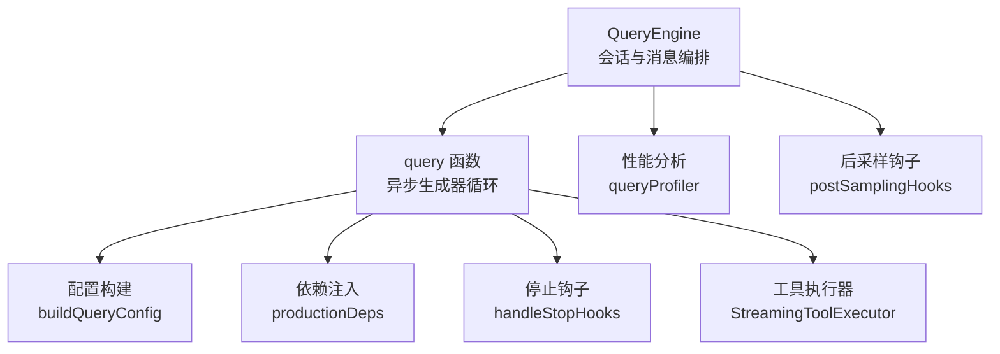
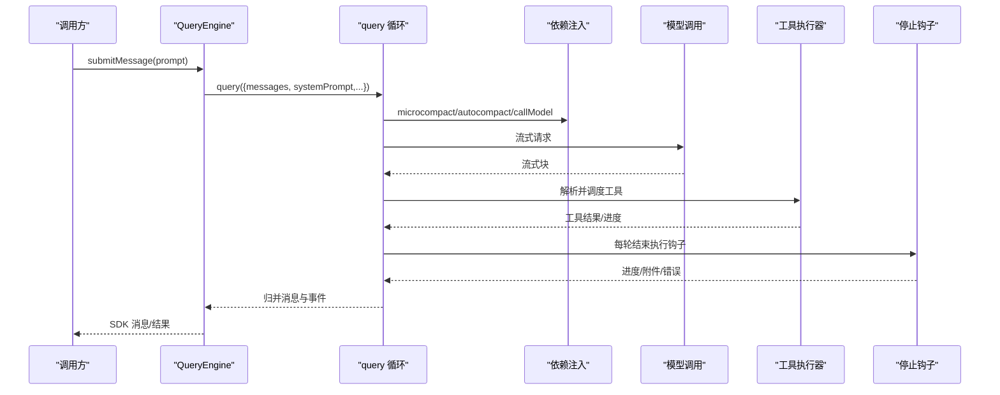
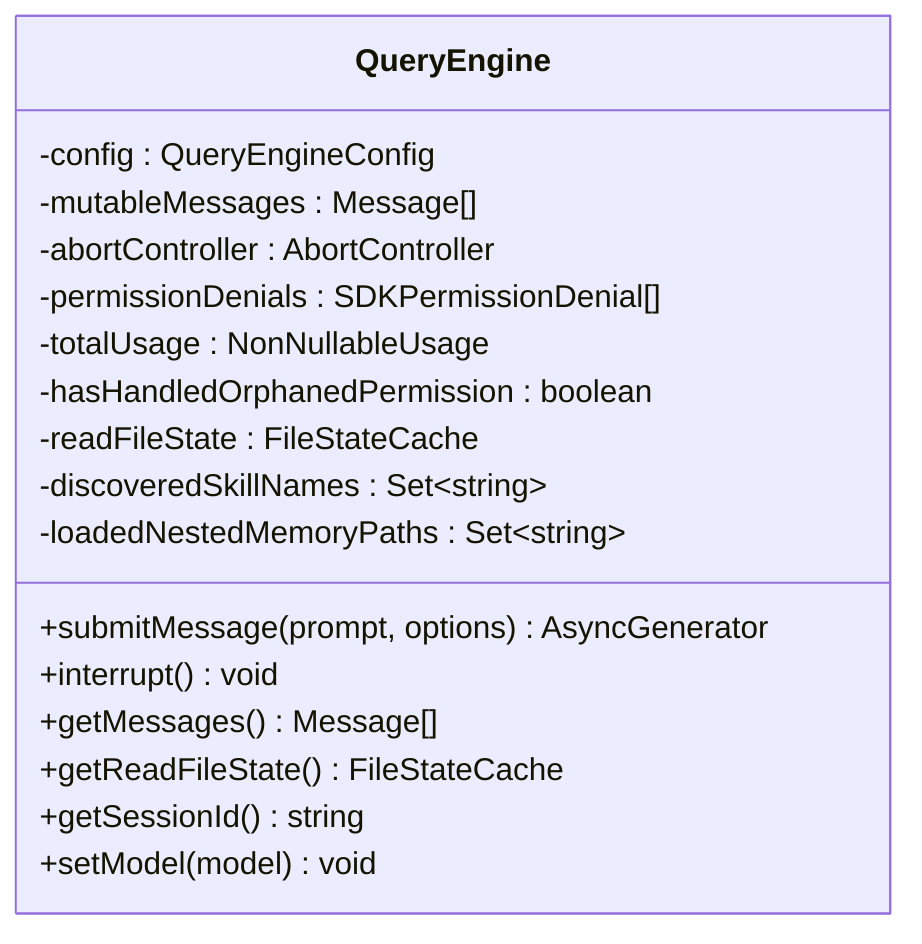
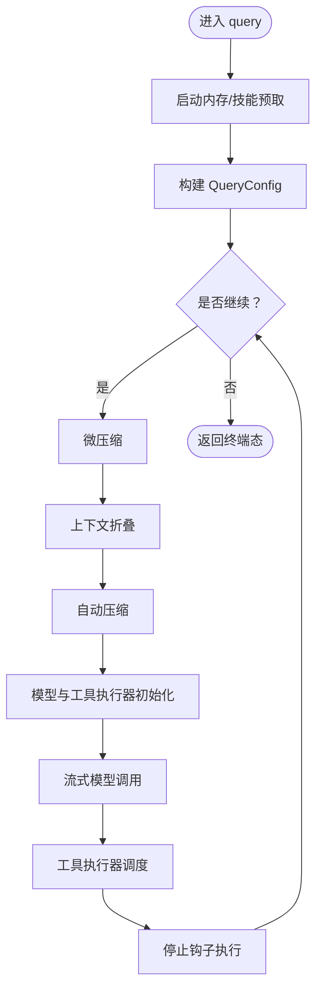
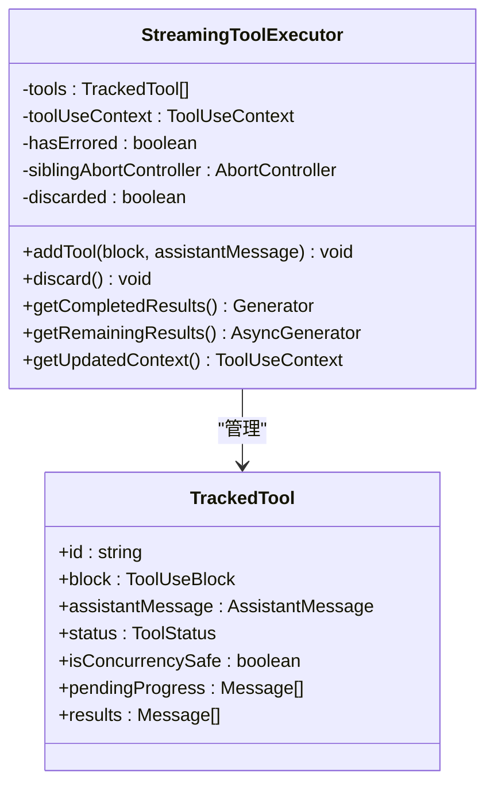
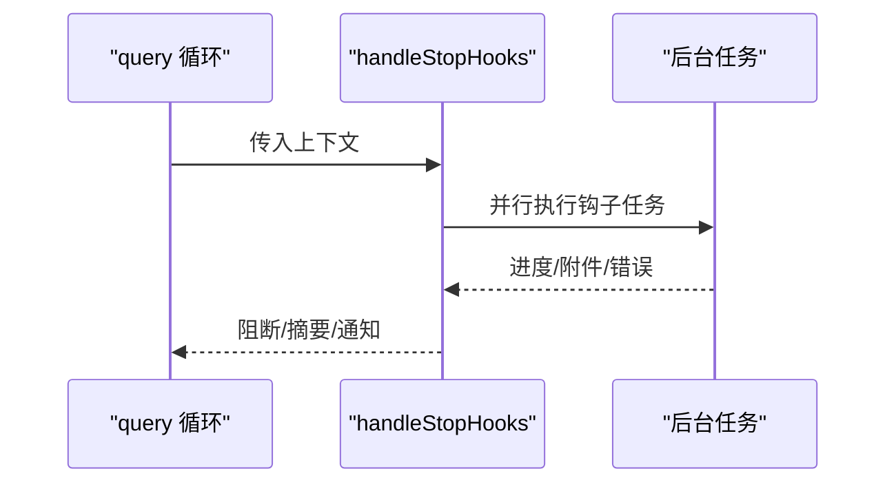
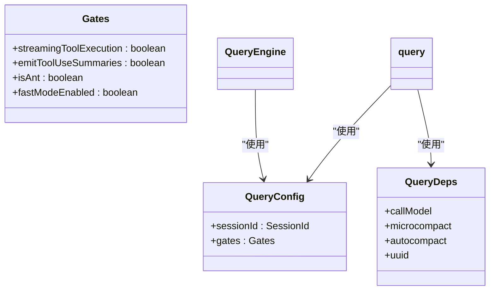
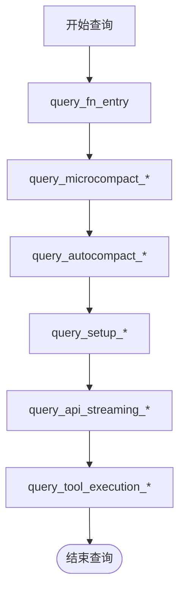
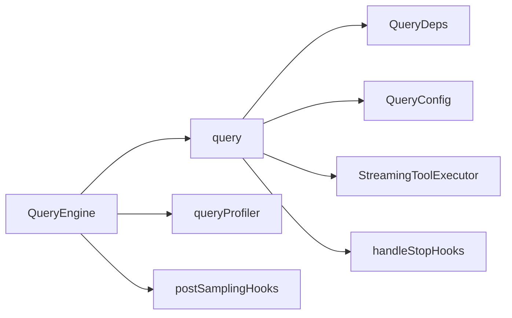

# 查询引擎架构

<cite>
**本文引用的文件**
- [src/query.ts](file://src/query.ts)
- [src/QueryEngine.ts](file://src/QueryEngine.ts)
- [src/query/config.ts](file://src/query/config.ts)
- [src/query/deps.ts](file://src/query/deps.ts)
- [src/query/tokenBudget.ts](file://src/query/tokenBudget.ts)
- [src/query/stopHooks.ts](file://src/query/stopHooks.ts)
- [src/services/tools/StreamingToolExecutor.ts](file://src/services/tools/StreamingToolExecutor.ts)
- [src/utils/queryProfiler.ts](file://src/utils/queryProfiler.ts)
- [src/utils/hooks/postSamplingHooks.ts](file://src/utils/hooks/postSamplingHooks.ts)
</cite>

## 目录
1. [引言](#引言)
2. [项目结构](#项目结构)
3. [核心组件](#核心组件)
4. [架构总览](#架构总览)
5. [详细组件分析](#详细组件分析)
6. [依赖关系分析](#依赖关系分析)
7. [性能考量](#性能考量)
8. [故障排查指南](#故障排查指南)
9. [结论](#结论)
10. [附录：代码示例路径](#附录代码示例路径)

## 引言
本文件面向“查询引擎”（Query Engine）的架构与实现，系统化阐述其整体设计、核心算法、数据流与控制流，以及与工具系统、服务层的集成方式。内容覆盖查询处理流程、缓存与压缩机制、并发控制、错误恢复与重试、查询优化、内存管理、性能监控与扩展性设计，并提供可测试性与调试工具说明。

## 项目结构
查询引擎位于 src 目录下，核心由以下模块组成：
- QueryEngine 类：面向 SDK/CLI 的会话级生命周期管理与消息编排
- query 函数：异步生成器驱动的查询循环，负责上下文压缩、模型调用、工具执行与结果归并
- 配置与依赖注入：query/config.ts 与 query/deps.ts 提供运行时门控与 I/O 依赖
- 停止钩子：query/stopHooks.ts 在每轮结束时执行后台任务与钩子
- 工具执行器：StreamingToolExecutor 实现流式工具并发调度与中断传播
- 性能分析：utils/queryProfiler.ts 提供查询阶段计时与报告
- 后采样钩子：utils/hooks/postSamplingHooks.ts 支持程序化后采样钩子注册与执行

**图表来源**
- [src/QueryEngine.ts:184-1177](file://src/QueryEngine.ts#L184-L1177)
- [src/query.ts:219-1049](file://src/query.ts#L219-L1049)
- [src/query/config.ts:29-46](file://src/query/config.ts#L29-L46)
- [src/query/deps.ts:33-40](file://src/query/deps.ts#L33-L40)
- [src/query/stopHooks.ts:65-473](file://src/query/stopHooks.ts#L65-L473)
- [src/services/tools/StreamingToolExecutor.ts:40-531](file://src/services/tools/StreamingToolExecutor.ts#L40-L531)
- [src/utils/queryProfiler.ts:50-301](file://src/utils/queryProfiler.ts#L50-L301)
- [src/utils/hooks/postSamplingHooks.ts:45-70](file://src/utils/hooks/postSamplingHooks.ts#L45-L70)

**章节来源**
- [src/QueryEngine.ts:184-1177](file://src/QueryEngine.ts#L184-L1177)
- [src/query.ts:219-1049](file://src/query.ts#L219-L1049)

## 核心组件
- QueryEngine：封装一次对话的完整生命周期，负责系统提示拼装、用户输入处理、消息持久化、工具权限跟踪、结果聚合与最终返回
- query：查询主循环，按轮次迭代，执行上下文压缩、模型调用、工具执行、停止钩子与结果归并
- StreamingToolExecutor：在流式响应中按并发安全策略调度工具，支持取消、进度消息即时产出与错误传播
- 停止钩子：在每轮结束时触发各类后台任务（如记忆提取、自动做梦、提示建议等），并可阻止继续
- 配置与依赖：通过 buildQueryConfig 与 productionDeps 注入运行时门控与 I/O 依赖，便于测试替换

**章节来源**
- [src/QueryEngine.ts:209-1177](file://src/QueryEngine.ts#L209-L1177)
- [src/query.ts:241-1049](file://src/query.ts#L241-L1049)
- [src/services/tools/StreamingToolExecutor.ts:40-531](file://src/services/tools/StreamingToolExecutor.ts#L40-L531)
- [src/query/stopHooks.ts:65-473](file://src/query/stopHooks.ts#L65-L473)
- [src/query/config.ts:29-46](file://src/query/config.ts#L29-L46)
- [src/query/deps.ts:33-40](file://src/query/deps.ts#L33-L40)

## 架构总览
查询引擎采用“会话级 QueryEngine + 轮次级 query 循环”的分层设计：
- QueryEngine 负责跨轮次的状态保存、系统提示构建、消息持久化与最终结果汇总
- query 作为异步生成器，每轮内完成上下文压缩、模型调用、工具执行与钩子处理
- 工具执行器在流式过程中按并发策略执行工具，保证顺序与一致性
- 停止钩子在每轮结束后异步执行后台任务，必要时阻断继续

**图表来源**
- [src/QueryEngine.ts:209-1177](file://src/QueryEngine.ts#L209-L1177)
- [src/query.ts:241-1049](file://src/query.ts#L241-L1049)
- [src/query/deps.ts:21-40](file://src/query/deps.ts#L21-L40)
- [src/services/tools/StreamingToolExecutor.ts:40-531](file://src/services/tools/StreamingToolExecutor.ts#L40-L531)
- [src/query/stopHooks.ts:65-473](file://src/query/stopHooks.ts#L65-L473)

## 详细组件分析

### 组件一：QueryEngine（会话与消息编排）
- 角色定位：单次对话的生命周期管理器，持有 mutableMessages、权限拒绝记录、用量统计等状态
- 关键职责：
  - 系统提示拼装与上下文注入
  - 用户输入处理与消息写入
  - 与持久化与快照（transcript、文件历史）交互
  - 将 query 的消息流映射为 SDK 消息并聚合最终结果
  - 中断控制与状态查询接口

**图表来源**
- [src/QueryEngine.ts:184-1177](file://src/QueryEngine.ts#L184-L1177)

**章节来源**
- [src/QueryEngine.ts:209-1177](file://src/QueryEngine.ts#L209-L1177)

### 组件二：query（查询主循环）
- 角色定位：异步生成器，按轮次推进，贯穿上下文压缩、模型调用、工具执行与钩子处理
- 关键流程：
  - 初始化配置与依赖、启动内存预取
  - 执行微压缩与自动压缩（含历史截断与上下文折叠）
  - 构建系统提示与用户上下文，进行流式模型调用
  - 流式工具执行器按并发策略产出进度与结果
  - 每轮结束执行停止钩子，可能产生阻断或附加信息
  - 处理最大输出令牌恢复、阻断限制与预算检查

**图表来源**
- [src/query.ts:241-1049](file://src/query.ts#L241-L1049)

**章节来源**
- [src/query.ts:241-1049](file://src/query.ts#L241-L1049)

### 组件三：StreamingToolExecutor（流式工具执行器）
- 并发策略：
  - 并发安全工具：可与其他并发安全工具并行
  - 非并发工具：串行独占，确保资源隔离
- 错误与中断：
  - Bash 等工具错误会向兄弟进程广播取消信号，避免无效执行
  - 用户中断与流式回退会生成合成错误消息
- 结果产出：
  - 进度消息优先即时产出
  - 工具结果按接收顺序缓冲并有序产出
  - 支持丢弃（流式回退时清理未完成结果）

**图表来源**
- [src/services/tools/StreamingToolExecutor.ts:40-531](file://src/services/tools/StreamingToolExecutor.ts#L40-L531)

**章节来源**
- [src/services/tools/StreamingToolExecutor.ts:40-531](file://src/services/tools/StreamingToolExecutor.ts#L40-L531)

### 组件四：停止钩子（handleStopHooks）
- 触发时机：每轮结束（assistant 响应之后）
- 功能范围：
  - 分类模板作业、提示建议、记忆提取、自动做梦、计算机使用清理等
  - 收集阻断错误与输出，决定是否阻止继续
  - 生成摘要消息与通知，便于用户了解钩子执行情况

**图表来源**
- [src/query/stopHooks.ts:65-473](file://src/query/stopHooks.ts#L65-L473)

**章节来源**
- [src/query/stopHooks.ts:65-473](file://src/query/stopHooks.ts#L65-L473)

### 组件五：配置与依赖注入
- buildQueryConfig：一次性快照会话级配置与运行时门控（如流式工具执行、快速模式等）
- productionDeps：生产环境依赖工厂，统一注入模型调用、微压缩与自动压缩能力

**图表来源**
- [src/query/config.ts:29-46](file://src/query/config.ts#L29-L46)
- [src/query/deps.ts:21-40](file://src/query/deps.ts#L21-L40)

**章节来源**
- [src/query/config.ts:29-46](file://src/query/config.ts#L29-L46)
- [src/query/deps.ts:21-40](file://src/query/deps.ts#L21-L40)

### 组件六：性能分析与预算控制
- queryProfiler：通过性能标记记录查询关键节点耗时，输出阶段分解与慢操作警告
- tokenBudget：基于全局轮次令牌与预算阈值的继续/停止决策，避免无意义长尾

**图表来源**
- [src/utils/queryProfiler.ts:69-93](file://src/utils/queryProfiler.ts#L69-L93)
- [src/query/tokenBudget.ts:45-93](file://src/query/tokenBudget.ts#L45-L93)

**章节来源**
- [src/utils/queryProfiler.ts:69-93](file://src/utils/queryProfiler.ts#L69-L93)
- [src/query/tokenBudget.ts:45-93](file://src/query/tokenBudget.ts#L45-L93)

## 依赖关系分析
- 松耦合：query 通过 QueryDeps 抽象 I/O，便于测试替身；配置通过 QueryConfig 快照化，避免运行期动态变化
- 顺序约束：工具执行器需在模型调用之后，停止钩子在每轮结束之后
- 并发边界：非并发工具串行，兄弟工具错误通过 AbortController 传播

**图表来源**
- [src/query.ts:241-1049](file://src/query.ts#L241-L1049)
- [src/query/deps.ts:21-40](file://src/query/deps.ts#L21-L40)
- [src/query/config.ts:29-46](file://src/query/config.ts#L29-L46)
- [src/services/tools/StreamingToolExecutor.ts:40-531](file://src/services/tools/StreamingToolExecutor.ts#L40-L531)
- [src/query/stopHooks.ts:65-473](file://src/query/stopHooks.ts#L65-L473)
- [src/QueryEngine.ts:209-1177](file://src/QueryEngine.ts#L209-L1177)
- [src/utils/queryProfiler.ts:50-301](file://src/utils/queryProfiler.ts#L50-L301)
- [src/utils/hooks/postSamplingHooks.ts:45-70](file://src/utils/hooks/postSamplingHooks.ts#L45-L70)

**章节来源**
- [src/query.ts:241-1049](file://src/query.ts#L241-L1049)
- [src/QueryEngine.ts:209-1177](file://src/QueryEngine.ts#L209-L1177)

## 性能考量
- 流式工具执行：按并发策略调度，减少等待时间；进度消息优先产出，改善感知延迟
- 上下文压缩：微压缩与自动压缩降低输入规模，缓解模型调用成本与超限风险
- 预取与快照：内存与技能预取隐藏后台开销；转录快照在关键节点落盘，平衡一致性与吞吐
- 预算控制：基于全局轮次令牌与预算阈值的继续/停止决策，避免无效长尾
- 性能分析：通过 queryProfiler 记录关键节点耗时，识别瓶颈并指导优化

[本节为通用性能讨论，无需具体文件分析]

## 故障排查指南
- 最终结果判定：QueryEngine 使用 isResultSuccessful 判定成功与否，并在失败时输出诊断信息（包含结果类型、最后内容类型、stop_reason 等）
- 错误日志水印：通过内存错误缓冲的水印定位错误范围，避免一次性输出全量日志
- 流式回退：当模型流式回退时，丢弃孤儿消息并重建执行器，避免不一致结果
- 阻断限制：在未启用自动压缩时，若达到阻断限制，直接返回 API 错误消息并终止
- 停止钩子错误：钩子执行异常会被捕获并记录，同时生成可见的警告消息，便于调试

**章节来源**
- [src/QueryEngine.ts:1058-1117](file://src/QueryEngine.ts#L1058-L1117)
- [src/query.ts:712-741](file://src/query.ts#L712-L741)
- [src/query.ts:628-648](file://src/query.ts#L628-L648)
- [src/query/stopHooks.ts:456-472](file://src/query/stopHooks.ts#L456-L472)

## 结论
查询引擎以 QueryEngine 与 query 双层结构实现“会话级状态管理 + 轮次级处理循环”，通过上下文压缩、流式工具执行、停止钩子与预算控制等机制，在保证正确性的同时兼顾性能与可扩展性。依赖注入与配置快照化提升了可测试性与可维护性；性能分析与错误诊断工具为线上问题定位提供了坚实支撑。

[本节为总结性内容，无需具体文件分析]

## 附录：代码示例路径
以下为关键流程的代码示例路径（仅列出路径，不展示具体代码内容）：
- 查询构建与执行入口
  - [src/QueryEngine.ts:209-1177](file://src/QueryEngine.ts#L209-L1177)
- 查询循环与消息归并
  - [src/query.ts:241-1049](file://src/query.ts#L241-L1049)
- 配置构建与依赖注入
  - [src/query/config.ts:29-46](file://src/query/config.ts#L29-L46)
  - [src/query/deps.ts:21-40](file://src/query/deps.ts#L21-L40)
- 停止钩子执行
  - [src/query/stopHooks.ts:65-473](file://src/query/stopHooks.ts#L65-L473)
- 流式工具执行器
  - [src/services/tools/StreamingToolExecutor.ts:40-531](file://src/services/tools/StreamingToolExecutor.ts#L40-L531)
- 性能分析与报告
  - [src/utils/queryProfiler.ts:69-93](file://src/utils/queryProfiler.ts#L69-L93)
  - [src/utils/queryProfiler.ts:129-211](file://src/utils/queryProfiler.ts#L129-L211)
- 后采样钩子注册与执行
  - [src/utils/hooks/postSamplingHooks.ts:45-70](file://src/utils/hooks/postSamplingHooks.ts#L45-L70)