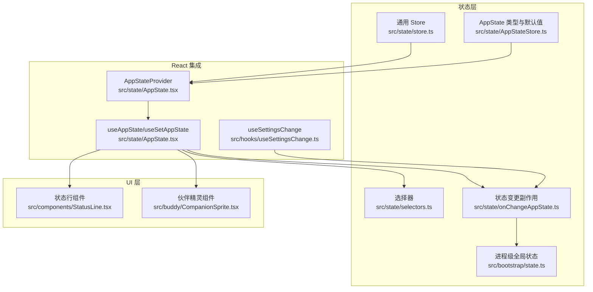
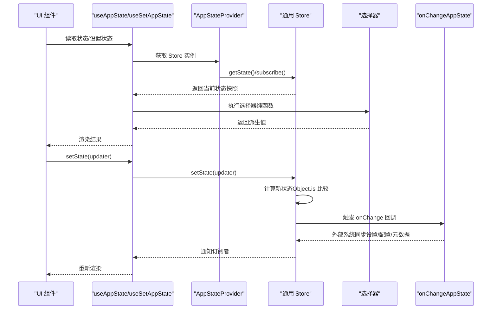
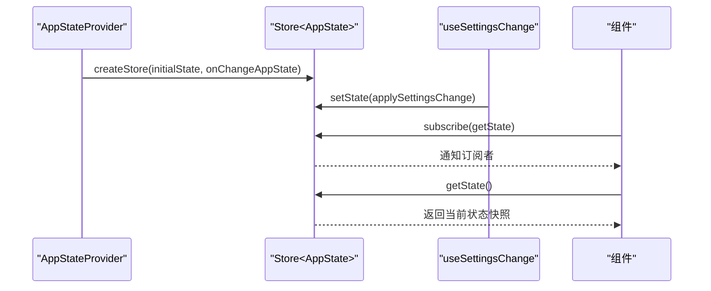
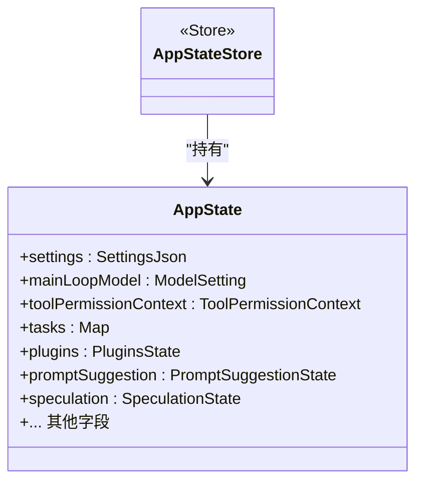
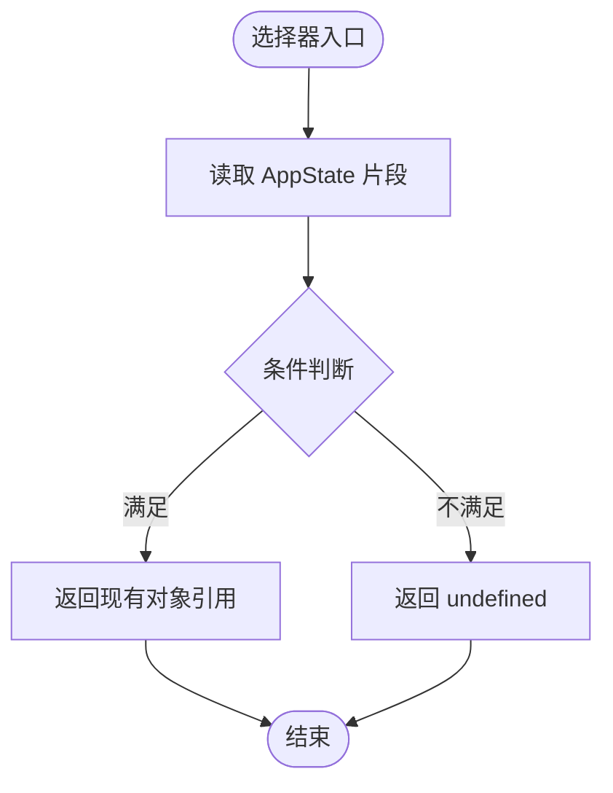
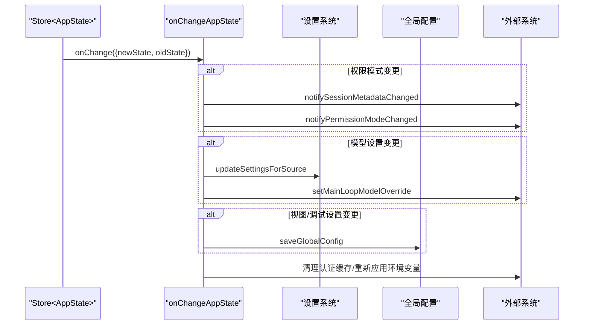
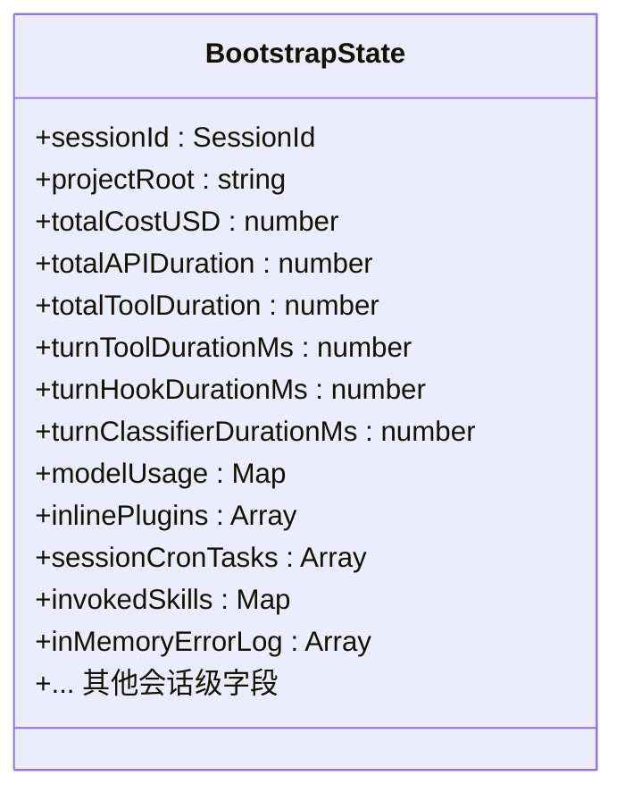
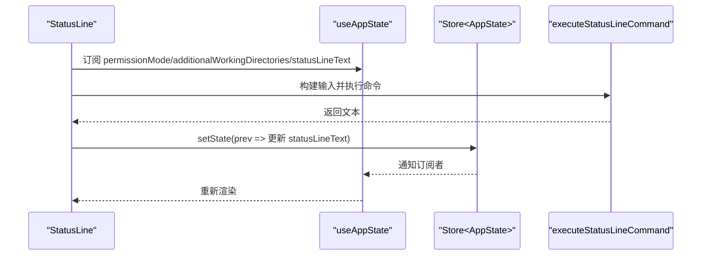
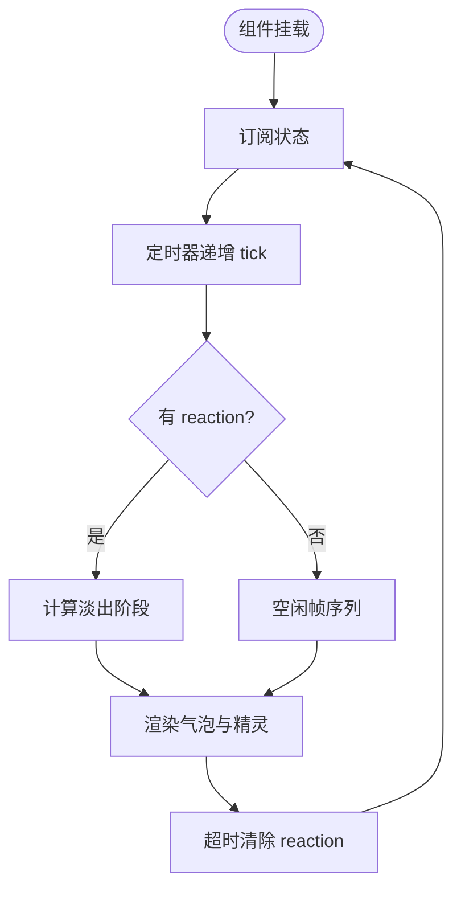
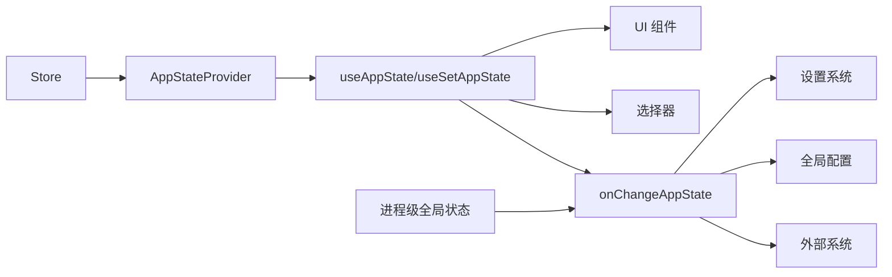

# 状态管理系统架构

<cite>
**本文档引用的文件**
- [src/state/store.ts](file://src/state/store.ts)
- [src/state/AppState.tsx](file://src/state/AppState.tsx)
- [src/state/AppStateStore.ts](file://src/state/AppStateStore.ts)
- [src/state/selectors.ts](file://src/state/selectors.ts)
- [src/state/onChangeAppState.ts](file://src/state/onChangeAppState.ts)
- [src/bootstrap/state.ts](file://src/bootstrap/state.ts)
- [src/hooks/useSettingsChange.ts](file://src/hooks/useSettingsChange.ts)
- [src/components/StatusLine.tsx](file://src/components/StatusLine.tsx)
- [src/buddy/CompanionSprite.tsx](file://src/buddy/CompanionSprite.tsx)
</cite>

## 目录
1. [简介](#简介)
2. [项目结构](#项目结构)
3. [核心组件](#核心组件)
4. [架构总览](#架构总览)
5. [详细组件分析](#详细组件分析)
6. [依赖关系分析](#依赖关系分析)
7. [性能考虑](#性能考虑)
8. [故障排除指南](#故障排除指南)
9. [结论](#结论)
10. [附录](#附录)

## 简介
本架构文档系统性阐述了该代码库中的状态管理系统，重点覆盖以下方面：
- 整体设计模式：基于轻量级通用 Store 的单向数据流与订阅机制
- 数据流与组件交互：从状态变更到 UI 订阅渲染的完整链路
- 状态树结构：AppState 的深层嵌套结构与职责划分
- 选择器机制：纯函数派生计算，避免副作用
- 副作用处理：通过 onChange 回调与外部系统同步
- 订阅模式：useSyncExternalStore 驱动的 React 订阅
- 持久化策略：配置与设置的持久化与跨会话同步
- 性能优化：选择器缓存、去抖、稳定引用与最小重渲染
- 调试工具与测试方法：日志、通知与变更追踪
- 可维护性设计：模块化、类型安全与清晰的职责边界
- 错误处理与迁移策略：异常捕获与兼容性处理
- 与 UI 组件、服务层的数据交互关系：桥接与插件生态

## 项目结构
状态管理相关的核心文件组织如下：
- src/state/store.ts：通用 Store 抽象与订阅实现
- src/state/AppState.tsx：应用状态提供者与 React 订阅钩子
- src/state/AppStateStore.ts：AppState 类型定义与默认值
- src/state/selectors.ts：纯函数选择器（派生状态）
- src/state/onChangeAppState.ts：状态变更副作用（外部系统同步）
- src/bootstrap/state.ts：进程级全局状态（会话级）
- src/hooks/useSettingsChange.ts：设置变更监听与同步
- src/components/StatusLine.tsx：状态驱动的 UI 示例
- src/buddy/CompanionSprite.tsx：状态订阅与动画示例



**图表来源**
- [src/state/store.ts:1-35](file://src/state/store.ts#L1-L35)
- [src/state/AppState.tsx:1-200](file://src/state/AppState.tsx#L1-L200)
- [src/state/AppStateStore.ts:1-570](file://src/state/AppStateStore.ts#L1-L570)
- [src/state/selectors.ts:1-77](file://src/state/selectors.ts#L1-L77)
- [src/state/onChangeAppState.ts:1-172](file://src/state/onChangeAppState.ts#L1-L172)
- [src/bootstrap/state.ts:1-800](file://src/bootstrap/state.ts#L1-L800)
- [src/hooks/useSettingsChange.ts:1-26](file://src/hooks/useSettingsChange.ts#L1-L26)
- [src/components/StatusLine.tsx:1-324](file://src/components/StatusLine.tsx#L1-L324)
- [src/buddy/CompanionSprite.tsx:170-369](file://src/buddy/CompanionSprite.tsx#L170-L369)

**章节来源**
- [src/state/store.ts:1-35](file://src/state/store.ts#L1-L35)
- [src/state/AppState.tsx:1-200](file://src/state/AppState.tsx#L1-L200)
- [src/state/AppStateStore.ts:1-570](file://src/state/AppStateStore.ts#L1-L570)
- [src/state/selectors.ts:1-77](file://src/state/selectors.ts#L1-L77)
- [src/state/onChangeAppState.ts:1-172](file://src/state/onChangeAppState.ts#L1-L172)
- [src/bootstrap/state.ts:1-800](file://src/bootstrap/state.ts#L1-L800)
- [src/hooks/useSettingsChange.ts:1-26](file://src/hooks/useSettingsChange.ts#L1-L26)
- [src/components/StatusLine.tsx:1-324](file://src/components/StatusLine.tsx#L1-L324)
- [src/buddy/CompanionSprite.tsx:170-369](file://src/buddy/CompanionSprite.tsx#L170-L369)

## 核心组件
- 通用 Store：提供 getState、setState、subscribe 三件套，支持 onChange 回调与订阅去重
- AppStateProvider：在 React 上下文中注入 Store，并处理设置变更同步
- useAppState/useSetAppState：基于 useSyncExternalStore 的订阅钩子，按选择器粒度订阅
- AppState 类型与默认值：定义复杂嵌套状态树，包含任务、插件、权限、提示建议等
- 选择器：纯函数派生计算，如当前视图任务、输入路由目标等
- onChangeAppState：集中处理权限模式、模型设置、全局配置等副作用
- 进程级全局状态：会话标识、计时统计、令牌预算、错误日志等

**章节来源**
- [src/state/store.ts:1-35](file://src/state/store.ts#L1-L35)
- [src/state/AppState.tsx:1-200](file://src/state/AppState.tsx#L1-L200)
- [src/state/AppStateStore.ts:1-570](file://src/state/AppStateStore.ts#L1-L570)
- [src/state/selectors.ts:1-77](file://src/state/selectors.ts#L1-L77)
- [src/state/onChangeAppState.ts:1-172](file://src/state/onChangeAppState.ts#L1-L172)
- [src/bootstrap/state.ts:1-800](file://src/bootstrap/state.ts#L1-L800)

## 架构总览
状态管理采用“通用 Store + React 订阅 + 纯函数选择器 + 副作用回调”的分层架构：
- 底层 Store：不可变状态 + 订阅集合 + 变更通知
- 中间层 Provider/Hook：将 Store 与 React 生命周期绑定，暴露稳定的订阅接口
- 业务层选择器：从 AppState 派生计算，保证无副作用
- 副作用层：onChange 回调统一处理外部系统同步（设置、配置、遥测）



**图表来源**
- [src/state/AppState.tsx:142-179](file://src/state/AppState.tsx#L142-L179)
- [src/state/store.ts:10-35](file://src/state/store.ts#L10-L35)
- [src/state/selectors.ts:1-77](file://src/state/selectors.ts#L1-L77)
- [src/state/onChangeAppState.ts:43-92](file://src/state/onChangeAppState.ts#L43-L92)

**章节来源**
- [src/state/AppState.tsx:142-179](file://src/state/AppState.tsx#L142-L179)
- [src/state/store.ts:10-35](file://src/state/store.ts#L10-L35)
- [src/state/selectors.ts:1-77](file://src/state/selectors.ts#L1-L77)
- [src/state/onChangeAppState.ts:43-92](file://src/state/onChangeAppState.ts#L43-L92)

## 详细组件分析

### 通用 Store 设计
- 接口：getState、setState、subscribe
- 订阅：Set 存储监听器，去重并支持取消订阅
- 变更：浅比较（Object.is）避免重复渲染；触发 onChange 与所有监听器
- 并发：单线程状态机，确保一致性

```mermaid
classDiagram
class Store~T~ {
+getState() T
+setState(updater : (prev : T) => T) void
+subscribe(listener : () => void) () => void
}
class Listener {
+() void
}
class OnChange~T~ {
+(args : { newState : T; oldState : T }) void
}
Store <|.. Listener
Store <|.. OnChange
```

**图表来源**
- [src/state/store.ts:1-35](file://src/state/store.ts#L1-L35)

**章节来源**
- [src/state/store.ts:1-35](file://src/state/store.ts#L1-L35)

### AppStateProvider 与 React 订阅
- 提供上下文：AppStateProvider 注入 Store 到 React 树
- 设置同步：useSettingsChange 监听设置变更并通过 Store 更新
- 安全订阅：useAppState 使用 useSyncExternalStore，支持 SSR 与并发
- 选择器约束：返回原状态对象会被显式校验并抛错，防止误用



**图表来源**
- [src/state/AppState.tsx:37-110](file://src/state/AppState.tsx#L37-L110)
- [src/hooks/useSettingsChange.ts:1-26](file://src/hooks/useSettingsChange.ts#L1-L26)

**章节来源**
- [src/state/AppState.tsx:37-110](file://src/state/AppState.tsx#L37-L110)
- [src/hooks/useSettingsChange.ts:1-26](file://src/hooks/useSettingsChange.ts#L1-L26)

### AppState 类型与默认值
- 结构：包含设置、模型、权限、任务、插件、通知、提示建议、推测状态等
- 默认值：getDefaultAppState 提供初始状态，确保首次渲染安全
- 深度不可变：通过 DeepImmutable 约束，减少意外修改



**图表来源**
- [src/state/AppStateStore.ts:89-454](file://src/state/AppStateStore.ts#L89-L454)

**章节来源**
- [src/state/AppStateStore.ts:1-570](file://src/state/AppStateStore.ts#L1-L570)

### 选择器机制
- 纯函数：仅做数据提取，不产生副作用
- 组合复用：如 getViewedTeammateTask 与 getActiveAgentForInput
- 性能友好：返回现有对象引用，避免不必要的重渲染



**图表来源**
- [src/state/selectors.ts:18-40](file://src/state/selectors.ts#L18-L40)
- [src/state/selectors.ts:59-76](file://src/state/selectors.ts#L59-L76)

**章节来源**
- [src/state/selectors.ts:1-77](file://src/state/selectors.ts#L1-L77)

### 副作用处理与外部系统同步
- 权限模式同步：toolPermissionContext.mode 变更时对外部系统报告
- 模型设置同步：mainLoopModel 变更时写入/移除用户设置并覆盖运行时
- 全局配置持久化：expandedView、verbose、tungstenPanelVisible 等变更持久化
- 设置变更清理：清除认证缓存并重新应用环境变量



**图表来源**
- [src/state/onChangeAppState.ts:43-171](file://src/state/onChangeAppState.ts#L43-L171)

**章节来源**
- [src/state/onChangeAppState.ts:1-172](file://src/state/onChangeAppState.ts#L1-L172)

### 进程级全局状态（会话）
- 会话标识与项目根：getSessionId、getProjectRoot、setProjectRoot
- 统计与计时：总成本、API 时长、工具时长、令牌预算、交互时间
- 插件与 MCP：客户端、工具、命令、资源与重连键
- 错误与诊断：最近错误日志、提示缓存、思维清理闩锁等



**图表来源**
- [src/bootstrap/state.ts:45-257](file://src/bootstrap/state.ts#L45-L257)

**章节来源**
- [src/bootstrap/state.ts:1-800](file://src/bootstrap/state.ts#L1-L800)

### UI 组件与状态交互示例

#### 状态行组件（StatusLine）
- 订阅：permissionMode、additionalWorkingDirectories、statusLineText
- 去抖：300ms 去抖更新，避免频繁计算
- 异步：执行钩子命令生成文本，成功后写回状态
- 稳定性：refs 缓存最新值，避免闭包陷阱



**图表来源**
- [src/components/StatusLine.tsx:144-223](file://src/components/StatusLine.tsx#L144-L223)

**章节来源**
- [src/components/StatusLine.tsx:1-324](file://src/components/StatusLine.tsx#L1-L324)

#### 伙伴精灵组件（CompanionSprite）
- 订阅：companionReaction、companionPetAt、footerSelection
- 动画：基于 tick 的帧循环与淡出逻辑
- 渲染：根据终端宽度与聚焦状态决定显示样式



**图表来源**
- [src/buddy/CompanionSprite.tsx:176-214](file://src/buddy/CompanionSprite.tsx#L176-L214)

**章节来源**
- [src/buddy/CompanionSprite.tsx:170-369](file://src/buddy/CompanionSprite.tsx#L170-L369)

## 依赖关系分析
- 组件对 Store 的依赖：通过 Provider 注入，避免直接导入 Store
- 选择器对 AppState 的依赖：纯函数，无副作用
- 副作用对设置与配置的依赖：集中处理，避免分散更新
- 进程级状态对全局配置与外部系统的依赖：通过 onChange 同步



**图表来源**
- [src/state/AppState.tsx:1-200](file://src/state/AppState.tsx#L1-L200)
- [src/state/selectors.ts:1-77](file://src/state/selectors.ts#L1-L77)
- [src/state/onChangeAppState.ts:1-172](file://src/state/onChangeAppState.ts#L1-L172)
- [src/bootstrap/state.ts:1-800](file://src/bootstrap/state.ts#L1-L800)

**章节来源**
- [src/state/AppState.tsx:1-200](file://src/state/AppState.tsx#L1-L200)
- [src/state/selectors.ts:1-77](file://src/state/selectors.ts#L1-L77)
- [src/state/onChangeAppState.ts:1-172](file://src/state/onChangeAppState.ts#L1-L172)
- [src/bootstrap/state.ts:1-800](file://src/bootstrap/state.ts#L1-L800)

## 性能考虑
- 选择器缓存：返回现有对象引用，避免 Object.is 不相等导致的重渲染
- 去抖更新：StatusLine 对昂贵计算进行去抖，降低渲染压力
- 稳定引用：useSetAppState 返回稳定引用，避免非必要重渲染
- 最小订阅：按需选择器粒度订阅，减少无关更新
- 深度不可变：通过类型约束减少意外修改引发的重渲染

[本节为通用指导，无需特定文件引用]

## 故障排除指南
- 选择器返回原状态：useAppState 会在开发模式下检测并抛错，需改为返回现有子对象引用
- 设置变更未生效：检查 onChangeAppState 是否正确清理认证缓存并重新应用环境变量
- 权限模式不同步：确认 onChangeAppState 是否正确对外部系统报告权限模式变化
- UI 不更新：确认订阅是否在正确的 Provider 下，以及选择器是否返回稳定引用

**章节来源**
- [src/state/AppState.tsx:126-163](file://src/state/AppState.tsx#L126-L163)
- [src/state/onChangeAppState.ts:154-170](file://src/state/onChangeAppState.ts#L154-L170)

## 结论
该状态管理系统以通用 Store 为核心，结合 React 订阅与纯函数选择器，实现了清晰、可维护且高性能的状态管理方案。通过集中式的副作用处理与进程级全局状态，系统在复杂 UI 与服务层之间建立了稳定的桥梁。推荐在后续演进中持续强化类型约束、选择器单元测试与变更追踪能力。

[本节为总结，无需特定文件引用]

## 附录

### 状态定义与更新示例路径
- 状态定义：[AppState 类型与默认值:89-570](file://src/state/AppStateStore.ts#L89-L570)
- Provider 初始化与设置同步：[AppStateProvider:37-110](file://src/state/AppState.tsx#L37-L110)
- 订阅与设置：[useAppState/useSetAppState:142-179](file://src/state/AppState.tsx#L142-L179)
- 选择器示例：[getViewedTeammateTask/getActiveAgentForInput:18-76](file://src/state/selectors.ts#L18-L76)
- 副作用处理：[onChangeAppState:43-171](file://src/state/onChangeAppState.ts#L43-L171)
- 进程级状态：[BootstrapState:45-257](file://src/bootstrap/state.ts#L45-L257)

### 测试方法建议
- 单元测试：针对选择器编写纯函数测试，验证输入输出映射
- 集成测试：模拟 Provider、Store 与 UI 组件，验证订阅与渲染行为
- 变更追踪：利用 onChange 回调与日志系统记录关键状态变更
- 性能测试：对去抖与选择器缓存进行基准测试，监控渲染次数与耗时

[本节为通用指导，无需特定文件引用]